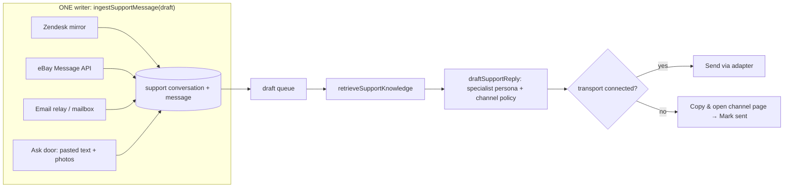

# HANDOFF — Support upgrade: channel-agnostic inbox, AI drafting over the latent RAG, saved views, copy/paste fallback (written 2026-10-03)

Paste the **Prompt** block at the bottom into a fresh session. Dev origin `http://localhost:3050`
only (AGENTS.md §1). The `.env` DB is PRODUCTION. Other sessions edit this tree: re-read before
each edit, touch only your lines, never commit, never `git checkout/stash`. Migrations need the
owner's explicit ok before apply. Sibling handoffs carry laws this work inherits:
`docs/HANDOFF-tasks-mobile-first.md` (M1 mobile-first, M2 no field labels, M3 inline not right-rail,
M9 hotkeys on hover only), `docs/HANDOFF-tasks-board-phase-3.md` §0.

Every "today" claim below was read from the tree on 2026-10-03 (scout reports
`SupportSurfaceMap`, `AiRagMap`, `ChannelsMap`). `[INFERENCE]` / `[VERIFY]` mark what was not
observed — check before building on it.

## 0. Owner ruling (verbatim intent → decision)

| # | Owner said | Decision |
|---|---|---|
| S1 | "The support should include ticket agnostic …" | Support is a **conversation** inbox, not a Zendesk ticket list. A conversation has a **channel** (where the customer wrote: Zendesk/email, eBay, Amazon, Ecwid, walk-in, phone, manual) and a **transport** (how a reply leaves: an API we hold, or the staffer's clipboard). Zendesk becomes one adapter among several. |
| S2 | "… auto drafting with AI, customer support specialist, and using the RAG that is latent within the codebase for service manuals …" | Every inbound customer message gets an AI **draft** written in the voice of a customer support specialist, grounded by ONE retrieval function over what the repo already holds (service manuals via NemoClaw, product manuals by SKU, orders, repairs, warranty, SKU catalog, past resolved replies) with citations and a confidence. Draft-only by default; see open decision D1 for auto-send. |
| S3 | "… using RAG to draft an automatic reply to the ticket, an automatic reply in general, manually uploading a staff question, and having the AI draft a response for it." | Three doors into the SAME drafter: (a) automatic on ingest of a new customer message, (b) "Draft a reply" on any open conversation, (c) **Ask** — a staffer pastes/uploads a customer message or their own question (text + photos + optional order/listing link) and gets a draft back, saved as a manual conversation so it is findable later. |
| S4 | "The support should not be sorted just under tickets only. It should be sorted under different saved views, for example, Amazon, eBay, messages that do not have the end-to-end connections and APIs." | The Support sidebar declares **views by channel** (All · eBay · Amazon · Email/Zendesk · Website · Not connected) plus work views (Needs reply · Draft ready · Waiting on customer · Done), and staff can **save their own views** (register `support` as a saved-view surface). Views live in the LEFT contextual sidebar (placement block, §4). |
| S5 | "There should be a fallback for if the user has connected it, or if the user just asked the AI a question, it should be able to copy and paste a reply and then reply to eBay insanely easily." | Every draft has ONE primary verb chosen by connection state: **Send** (channel API connected) or **Copy & open eBay** (not connected / Ask door) — copies the sanitized reply, opens the exact eBay (or Amazon) page for that order/buyer in a new tab, and leaves a **Mark sent** confirm in the thread so the history stays complete. One click + one paste. |

## 1. What exists today (evidence)

### 1.1 Support surface
- Desk `/support` → `src/app/support/page.tsx` (`SupportSidebarPanel` + `SupportWorkspace` in `DeskPageLayout`). Phone `/m/t/[ticketId]` → `MobileTicketThread` + `MobileTicketReplyDock`.
- Sidebar modes `SupportMode = 'tickets' | 'voicemail' | 'calls' | 'warranty' | 'issues' | 'orders'` (`src/lib/support/support-sidebar-shared.ts:21-34`, `?mode=`). Ticket list = `SupportTicketsBoard.tsx` + `useZendeskTickets` (`src/hooks/useZendeskQueries.ts`): status tabs `TICKET_STATUS_ITEMS` (`?tstatus=` → ZQL `status<solved`…), search `?tq=` appended to ZQL, sort in React state (`recent|oldest|priority`). **The list is a live Zendesk search, not a read of the local mirror.**
- `NAV_PAGE_DECLS.support` (`src/lib/nav/context/pages.ts:759`) declares search params only. `support` is **not** in `SAVED_VIEW_SURFACES` / `GENERIC_SAVED_VIEW_SURFACES` (`src/lib/saved-views/surfaces.ts:12,51`). No saved views on Support.
- APIs under `src/app/api/support/**`: `products`, `tickets` (create w/ anchor), `tickets/[id]/items` (+ `[itemId]`), `tickets/link`, `tickets/by-entity`, **`suggest`** (AI draft), `overview`, `requester`, `linkage`, `context`. Zendesk proxies under `src/app/api/zendesk/**` (`tickets`, `[id]`, `[id]/bundle` = mirror read, `comments`, `assign`, `photos`, `photo-ticket`, `users`, `agents`, `next-ticket-number`).
- Composer: `TicketComposer.tsx` + `use-ticket-composer.ts` (Public-first, `ComposerTicketChannelToggle`), `+` tree `ticket-composer-insert-tree.ts` = Browse library · Upload file · Product sent to customer. Phone dock `+` = Product sent only. No macros/templates.

### 1.2 Data model (Zendesk-centric)
- `support_tickets` (`2026-07-01f_support_tickets.sql`, mirror cols `2026-09-29_helpdesk_ticket_mirror.sql`): `provider CHECK IN ('zendesk','internal')` (`:18`), `external_ticket_id`, `subject_cache`, `status_cache`, `ticket_payload` JSONB (Zendesk `via.channel` lives here), requester/assignee Zendesk user ids, tags. **No channel column; eBay/Amazon are not representable.**
- `support_ticket_comments` (mirror): `external_comment_id`, `author_zendesk_user_id`, `body/html_body/plain_body`, `is_public`, `attachments`, `via`.
- `ticket_links` (one `anchor` per ticket; entity ORDER/SHIPMENT/RECEIVING/…), `support_ticket_items` (2026-10-03), `support_ticket_assignments`, `ticket_work_outbox` (CREATE_TICKET/ATTACH_TICKET/POST_REPLY, drained every 5 min), `entity_threads` + `thread_messages` (internal/zendesk/system), `support_interactions` (`channel IN ('call','voicemail','email','chat','walk_in')`, `2026-09-25d_support_interactions.sql`).
- Zendesk: client `src/lib/zendesk.ts` (`addTicketComment` :543, public/internal), adapter `src/lib/integrations/helpdesk/zendesk-adapter.ts` behind `HelpdeskProvider` (`src/lib/integrations/helpdesk/types.ts`), mirror `src/lib/support/ticket-mirror.ts` (15-min freshness, write-through). Crons: `zendesk/ticket-watch` (10 min), `ticket-outbox` (5 min), `tickets/designated-assign` (15 min). **No inbound webhooks.**

### 1.3 AI drafting that already ships
- `POST /api/support/suggest` → `suggestSupportReply` (`src/lib/support/suggest-reply.ts`) → `suggestSupportReplyCore(input, deps)` (`suggest-reply-core.ts`, pure, deps-injected): NemoClaw RAG (`queryNemoClawRag(query, topK=5)`, `src/lib/ai/nemoclaw-rag.ts`, `NEMOCLAW_RAG_URL` over a Cloudflare tunnel) + photo OCR/barcode evidence (`collectPhotoEvidence`, `photo-evidence.ts`; deps `photo-evidence-deps.ts`) + record matches (`hybridSearch`) + vision lane (`vision-lane.ts`: local-only vs cloud-multimodal) + persona (`reply-persona.ts` `buildSupportSystemPrompt`) + org chat model (`resolveOrgAiConfig`). Gated `integrations.zendesk`, rate-limited 25/min. Input `{ ticketId, subject, question, stagedPhotoIds }` — **Zendesk ticket shaped.**
- UI: `SupportAssistDisplay.tsx` in the right context drawer's **Assist** tab (confidence, lane, model, observations, matched records, source pills Thread/RAG/OCR/Catalog) → "Put in composer" → `seedComposerDraft` (`src/lib/threads/composer-draft.ts`). Auto-runs when an image is pasted on the thread.
- Marketplace guard: `src/lib/ai/seller-message-guard.ts` (`sellerMessageHasLinks`, `stripLinksFromSellerMessage`, `sanitizeSellerMessage`) — strips links for eBay/Amazon TOS. Deterministic seller-message baseline `buildDeterministicSellerMessage` (`src/lib/receiving-claim-seller-assist.ts`).
- Provider layer: `resolveOrgAiConfig/resolveOrgAiChain` (`org-provider.ts`, BYOK → local MLX → platform), `postToAiProvider` failover (`failover.ts`), `hermesToolCall<T>` forced structured output (`hermes-tool-call.ts`), metering `recordAiUsage` → `ai_usage_events`, caps `checkOrgSpendCap`, `readOrgMaxInflight`. Evals: `scripts/ai-eval/run.ts` (`pnpm ai:eval`, goldens).
- Assistant: `ASSISTANT_TOOLS` (`src/lib/assistant/tools/index.ts`) has support READS (`resolveSupportTicket`, `listSupportFollowups`, `getTicketEntities`, `getOrderLookup`, `lookupWarrantyCoverage`, `getCustomer`) but **no draft-a-reply tool**. MCP server `src/lib/mcp/tool-server.ts` exposes the same tools.

### 1.4 The latent RAG (what is retrievable, what is not)
| Knowledge | Where | Retrievable today |
|---|---|---|
| Service manuals / repair guides | external NemoClaw (`queryNemoClawRag`) | yes, external only; returns chunks + `sources` |
| Product manuals (per SKU) | `product_manuals` + Google Drive ids; `/manuals` → `/products` Manuals view | **no vector** — lookup by SKU only (`manual-link-tools.ts`) |
| Orders, serials, receiving, SKU, repairs (`repair_services`), FBA, warranty claims, support tickets (subject/status only), locations | `entity_search_docs` vector(768) + trigram, `hybridSearch` (RRF k=60, 300 ms embed budget, keyword fallback) | yes |
| Bench notes `repair_actions.notes` | — | **no** |
| Ticket thread bodies / past resolved replies | `support_ticket_comments` | **no** (only `subject_cache` is indexed) |
| Task Docs / SOPs | `work_assignment_documents` | **no** |
| Legacy RAG | `rag_documents` / `rag_document_chunks` vector(**1536**), `/api/rag/*`, `src/lib/ai/gemini.ts` (768-dim → dimension mismatch) | orphaned — candidate for deletion (clean cutover) |

### 1.5 Channels and connection state
- **No customer-messaging API on any marketplace today.** eBay scopes (`src/lib/ebay/oauth-config.ts:48-61`) = `api_scope`, `sell.inventory`, `sell.fulfillment`, `sell.account`; credential allowlist `orders.read, purchases.read, identity.read, tokens.write` (`credential-allowlist.ts:25-30`). `EbayClient.fetchUnreadMessages` (`src/lib/ebay/client.ts:309-354`, Commerce Message API `getConversations`) has **0 callers**. Amazon SP-API covers orders/catalog/address/returns only (`src/lib/amazon/client.ts`); allowlist `orders.read, identity.read, tokens.write` (`:31-35`). Ecwid/Square/Shopify/ShipStation: orders only. No support mailbox ingestion (PO Gmail is dogfood-locked vendor mail; task email refs store headers only).
- Connection checks: `hasAnyProviderConnection(orgId, provider)`, `getConnectionStatus` (`src/lib/integrations/connectors/connections.ts`), `isCapabilityConnected(orgId, capability)` / `connectedProviderKey` (`capability-connections.ts`, e.g. `'helpdesk' → 'zendesk'`), eBay accounts `listActiveEbayAccounts(orgId)` (`src/lib/ebay/credentials`). Vault `organization_integrations` (status active/error/revoked/disconnected), refresh + self-heal crons.
- Customer identity: `resolveBuyerCustomers` (`src/lib/orders/resolve-buyer-customers.ts`): channel id → email → phone last-10; staff edits protected.
- External APIs to evaluate (read 2026-10-03): eBay **Message API** has `getConversations`, `getConversation`, `sendMessage`, `updateConversation`, `bulkUpdateConversation` (<https://developer.ebay.com/api-docs/commerce/message/resources/methods>). `[VERIFY]` its OAuth scope string on the `sendMessage` page before changing `oauth-config.ts`. Amazon SP-API **Messaging v1** sends Amazon-defined message TYPES per order (availability varies per order) — it is not a free-form "reply to this buyer question" API (<https://developer-docs.amazon.com/sp-api/docs/messaging-api>). `[INFERENCE]` Amazon buyer questions reach sellers through the Buyer-Seller Messaging email relay (`@marketplace.amazon.com`), so for Amazon the realistic "connected" path is email ingestion + reply-by-email, and the copy/paste fallback to Seller Central is the default.

## 2. Target model



1. **Conversation, not ticket (S1).** Extend `support_tickets` rather than add a parallel table (one store, one writer): add `channel` (`zendesk_email | ebay | amazon | ecwid | website | walk_in | phone | manual`), widen `provider` (transport: `zendesk | ebay | email | internal`), add `channel_conversation_id` + `channel_order_ref` (eBay order/item id, Amazon order id), `last_inbound_at`, `needs_reply` (derived on write). Messages stay in `support_ticket_comments`; generalize its Zendesk-only columns (`author_zendesk_user_id` → `author_kind` + `author_ref`, `external_comment_id` text). Backfill `channel` for existing Zendesk rows from `ticket_payload->'via'` (+ tags/requester address, e.g. eBay/Amazon relay addresses). Every write goes through ONE function `ingestSupportMessage(draft: SupportMessageDraft)` in `src/lib/support/` (the inbound-order precedent: `InboundOrderDraft` → `ingestInboundOrder`, AGENTS.md §4). Zendesk mirror, eBay poll, email ingest and the Ask door all call it.
2. **Transport adapters.** Generalize `HelpdeskProvider` into `SupportTransport { channel, canSend(orgId), send(conversation, body, opts), deepLink(conversation) }`: `zendesk` (exists), `ebay-message` (new, behind connection + scope), `email` (when a mailbox is connected), `clipboard` (always available: copy + deep link + Mark sent). `canSend` reads `isCapabilityConnected` / `listActiveEbayAccounts` — never a second connection registry.
3. **One retrieval function (S2).** `retrieveSupportKnowledge(orgId, { query, sku?, orderRef?, serial?, channel }): { passages[], records[], citations[] }` composed from: `queryNemoClawRag` (service manuals) · `hybridSearch` (orders/repairs/warranty/SKU) · product manuals for the resolved SKU · **past resolved public replies** (new: index `support_ticket_comments` public bodies into `entity_search_docs` as `SUPPORT_REPLY`) · bench notes (`repair_actions.notes`, new index rows). Degrades per arm (NemoClaw down → still drafts from records). Decide in Phase 2 whether `rag_document_chunks` / `gemini.ts` / `/api/rag/*` are deleted or migrated to 768-dim — no third vector space.
4. **One drafter (S2/S3).** Refactor `suggestSupportReplyCore` into `draftSupportReplyCore(input: SupportDraftInput, deps)` with `SupportDraftInput = { channel, customerMessage, thread[], linked: { orders, repairs, skus }, photos[], staffQuestion? }` — no `ticketId` in the core. Output `{ reply, confidence, citations[], observations[], policyApplied[] }`. Persona = customer support specialist (`buildSupportSystemPrompt` extended, tenant voice). **Channel policy** applied after generation and asserted in tests: eBay/Amazon → `sanitizeSellerMessage` (no links, no off-platform contact), length cap `[VERIFY]` per channel; email/Zendesk → markdown allowed. Expose it three ways: REST (`/api/support/suggest` reshaped, permission no longer `integrations.zendesk`-only), the assistant tool `draft_support_reply` in `ASSISTANT_TOOLS` (so ⌘J / MCP can draft), and the auto-draft worker.
5. **Auto-draft (S3a).** On ingest of an inbound customer message, enqueue a draft (outbox row; reuse the `ticket_work_outbox` pattern or a sibling `support_draft_outbox`), store the result as a pending draft on the conversation (`support_drafts`: conversation, body, citations JSONB, confidence, model, status `ready|used|discarded|stale`, created_at). Stale when a newer inbound message lands. Metered and capped by the existing AI caps. **Never auto-sends** unless D1 says otherwise.
6. **Ask door (S3c).** A Support verb "Ask" (desk sidebar primary + phone `/m/*` primary): paste a customer message or type a staff question, attach photos, optionally paste an eBay/Amazon order or listing URL. Channel detected from the pasted URL/text (eBay order/item ids, Amazon order id pattern) with a one-tap override. Creates a `channel=<detected>, provider=internal` conversation via `ingestSupportMessage`, drafts immediately, shows the draft inline (M3: never a right-rail door).
7. **Saved views (S4).** Register `support` in `SAVED_VIEW_SURFACES`; declare in `NAV_PAGE_DECLS.support`: views by channel (All · eBay · Amazon · Email · Website · Not connected) and work views (Needs reply · Draft ready · Waiting on customer · Done); facet counts via `NAV_FACET_GROUPS['support.<view>']` from the SAME query builder the list uses. **Not connected** = conversations whose channel has no sendable transport for this org (derived from `canSend`, not stored). The list reads the LOCAL store (mirror + new channels), not a live Zendesk search — Zendesk search stays as a "search Zendesk" escape only if the owner wants it.
8. **Copy & open (S5).** For `clipboard` transport the draft's primary is **Copy & open eBay** (or Amazon / the channel's name): writes the sanitized reply to the clipboard, opens `deepLink(conversation)` in a new tab, and puts a **Mark sent** confirm on the thread that logs the outbound message (`provider=internal`, `meta.sentVia='clipboard'`). Deep links `[VERIFY]` against live pages before shipping: eBay seller order details (`https://www.ebay.com/sh/ord/details?orderid=<id>`), eBay contact buyer, Amazon Seller Central order page / Buyer-Seller Messages. If no order ref is known, open the channel's messages inbox. Phone: the same verb uses the share sheet / copy + `window.open`.

## 3. Work, in order (each phase: smoke at :3050, then `pnpm verify:fast`)

0. **Ask the owner (one `ask` call, batched):** D1 auto-send policy (draft-only · auto-send above a confidence for email only · never) · D2 first live channel to connect (eBay Message API vs support mailbox) · D3 Zendesk's future (stay the email transport vs replaced by a direct mailbox) · D4 delete legacy `rag_*` + `/api/rag/*` (recommended) vs migrate. Carry the answers into the phases below.
1. **Spec first (M1 + disclosure law).** Write the priority spec for the phone Support screen and the conversation sheet in `src/lib/disclosure/surfaces.ts` (L1: customer · channel glyph · last message · draft-ready mark; L2: thread, citations, linked records). Run `ds_contract '<job>'` for each UI job and paste its `placement.briefBlock` (§4) into every brief.
2. **Schema + one writer.** Migration (owner ok) extending `support_tickets` / `support_ticket_comments` (§2.1), backfill `channel` from Zendesk payloads, `ingestSupportMessage` + tests (`domain-unit-test` skill), Zendesk mirror writes routed through it. RLS: new columns inherit the table's policy; run `npm run tenancy:coverage` (the `org-scope` skill for any new route).
3. **Retrieval.** `retrieveSupportKnowledge` + new index rows (`SUPPORT_REPLY` public reply bodies, bench notes, product manual text by SKU) through `search-outbox-worker`; backfill; decide D4.
4. **Drafter.** `draftSupportReplyCore` (refactor of `suggestSupportReplyCore`, keep its tests passing then re-point them), channel policy + tests (eBay draft never contains a URL), `draft_support_reply` assistant tool, reshaped `/api/support/suggest`. Goldens in `scripts/ai-eval` for 5 real resolved conversations per channel (redacted).
5. **Auto-draft worker + `support_drafts`.** Enqueue on ingest, stale on new inbound, cron drain, metering. Draft-ready flag feeds the Draft ready view.
6. **Phone first (M1):** `/m/support` list (channel views as Apple list-of-lists, like `docs/HANDOFF-tasks-mobile-lists.md`), conversation sheet with the draft inline + ONE primary (Send | Copy & open), Ask as the screen's primary. Smoke at 390×844 light + dark (stamp `data-theme="dark"` + `data-color-scheme="dark"` after load; never PUT the pref).
7. **Desk:** sidebar views + saved views declared (no in-page filter bar), list reads the local store, Assist moves from the right drawer INTO the conversation (M3), composer gains "Use draft" + Copy & open for clipboard transports. Hotkeys only in hover tooltips (M9). `ds_critique` every touched UI file.
8. **eBay Message API (if D2 = eBay):** scope added to `oauth-config.ts` + allowlist `messages.read/messages.write`, re-consent flow, poll `getConversations` (wire the dead `fetchUnreadMessages` or delete it) → `ingestSupportMessage`, `sendMessage` adapter. Sandbox first.
9. Docs: `docs/integrations/ebay-connect.md`, `docs/settings-registry.md` if settings are added, and a dated status log appended to the end of this file (what shipped, what was smoked, what is open).

## 4. Placement (binding — returned by `ds_contract`, paste verbatim into every UI brief)

```
PLACEMENT (binding — returned by ds_contract; paste verbatim, never restate a different placement):
1. Every control that changes WHICH records show or IN WHAT ORDER — filters, sort, date / day / time-of-day window, staff, carrier / status / reason facets, views, modes, direction (inbound / outbound) — lives in the LEFT contextual sidebar. Declare it; never draw it in the page body.
   - Modes (top tier, e.g. Direction): NAV_PAGE_DECLS[page].modes = { label } (src/lib/nav/context/pages.ts) + one SIDEBAR_PAGE_NAV child per mode (src/lib/sidebar-navigation.ts). No 'all' mode.
   - Views (one list each, unfiltered count chip): sidebar-navigation children with `group: <modeId>`; counts via facet context `<pageId>.<viewId>` (NAV_FACET_CONTEXTS, src/lib/nav/facets/contexts.ts).
   - Controls: NAV_PAGE_DECLS[page].controls or a view's `controls` (NavControlsSchema, src/lib/nav/context/schema.ts:115-227): sort { param, defaultValue, options }, staff[] { id, param, label }, dateRanges[] { id, label, fromParam, toParam, placeholder, fromTimeParam?, toTimeParam? } — one day + a time-of-day window IS one dateRange with fromTimeParam/toTimeParam (schema.ts:155-156; precedent SHIPPED_CONTROLS, pages.ts:397-415).
   - Facets with counts (carrier, status, reason…): NAV_FACET_GROUPS['<pageId>.<viewId>'] = [{ id, label, param, multi }] (src/lib/nav/facets/contexts.ts); counts come from the SAME query builder the list uses — never a second predicate.
   - Find: NAV_PAGE_DECLS[page].search = { source: 'url-param', param: 'q', placeholder } (NavFind). Never an in-page search field.
   ContextualSidebar / NavModeSwitcher / NavViewSwitcher / NavFilters paint all of it from the declaration; the list reads the same URL params.
2. The page body shows RECORDS ONLY, in the display method chosen PER PAGE by `ds_display_method` from THIS page's facts (column board | card list | triage sections | data table | record ledger | admin table | detail hub) — this block never fixes the display. The placement rule covers CONTROLS only: NO in-page filter bar, chip / pill row, aria-pressed toggle group, segmented control, tab row, date / time picker, staff picker or facet picker in the page body. Selection, `bulk` actions and the chosen display's own density stay with the records.
3. 'The convention can't do X' is only valid with a citation of the missing field in src/lib/nav/context/schema.ts; then extend NavControlsSchema + NavFilters — never build the control in the page.
4. Reference implementation: the Exceptions hub — NAV_PAGE_DECLS.exceptions.modes = { label: 'Domain' } (src/lib/nav/context/pages.ts:990-994); domain + kind children with `group` (src/lib/sidebar-navigation.ts, the `exceptions` entry ~1146-1185); facet contexts + counts (src/lib/nav/facets/contexts.ts, src/lib/nav/facets/exceptions.ts).
5. Gate: run ds_critique on every touched UI file. Rule `filter-controls-outside-sidebar` blocks a page-body write that both writes list filters to the URL and mounts a filter control.
```

Composer law (pinned `TicketComposer`): ONE composer mouth for every ticket surface — Internal|Public on the action bar right of `+`, Cc on Public only. A draft lands in that composer (`seedComposerDraft`), never a second editor.

## 5. Principles and safety

- **P1 one store, one writer** — every channel enters through `ingestSupportMessage`; views are queries over it, never per-channel tables.
- **P2 one drafter, one retriever** — REST, assistant tool and auto-draft call the same core; channel policy is code, tested, not prompt-only.
- **P3 draft, human sends** — no customer-visible message leaves without a staffer's click unless D1 explicitly allows it. Every draft shows its citations and confidence; low confidence says what is missing.
- **P4 marketplace TOS** — eBay/Amazon drafts pass `sanitizeSellerMessage`; no links, no off-platform contact, no email addresses. PAN guard (`src/lib/assistant/pan-guard.ts`) before any model call.
- **P5 privacy** — vision lane respected (`local-only` orgs never send photos to cloud models); customer PII stays org-scoped (RLS, `withTenantTransaction`).
- **P6 the clipboard is a transport** — Copy & open is a first-class path with its own Mark sent log, not a degraded mode.
- Testing: **never post a public reply to a real customer.** Zendesk smokes use INTERNAL notes on QA ticket #10092 only (list every note posted). eBay: sandbox credentials only. AI goldens use redacted copies.

## 6. Verification checklist (report numbers, URLs, screenshots)

- Phone `/m/support` at 390×844, light + dark: 0 field labels, ≥44px targets, contrast 0 fails, one primary per screen.
- An eBay conversation created through Ask with a pasted order URL lands in the eBay + Not connected views; its draft contains no URL; Copy & open copies exactly the shown text and opens the order page; Mark sent logs it.
- A Zendesk conversation: auto-draft appears within one worker cycle after a new inbound comment (simulate on #10092 with an internal note authored as requester only if the owner allows; else unit-test the enqueue path).
- `retrieveSupportKnowledge` returns a NemoClaw manual passage for a Bose Wave repair question and still drafts (records-only) when `NEMOCLAW_RAG_URL` is unset.
- `pnpm verify:fast` green except other sessions' files (name them); `pnpm ai:eval` goldens pass.

---

## Prompt

```
You are upgrading CycleForge Support. Read docs/HANDOFF-support-upgrade.md end to end first
(owner rulings S1–S5, §1 evidence, §2 target model, §3 order, §4 placement block, §5 safety),
then the laws it inherits: docs/HANDOFF-tasks-mobile-first.md (M1 mobile-first, M2 no field
labels, M3 inline never right-rail, M9 hotkeys on hover only) and AGENTS.md.

Owner direction: Support is channel-agnostic — Zendesk/email, eBay, Amazon, website, walk-in and
manual "Ask" messages are ONE conversation inbox, sorted into saved views by channel (eBay, Amazon,
Not connected …), not a Zendesk ticket list. Every inbound message gets an AI draft written as a
customer support specialist, grounded by ONE retrieval function over the RAG already in the repo
(NemoClaw service manuals, product manuals by SKU, orders, repairs, warranty, SKU catalog, past
resolved replies). Staff can paste a customer message or ask their own question and get a draft.
When the channel is connected the primary verb is Send; when it is not (or the draft came from
Ask), the primary is "Copy & open eBay/Amazon" + Mark sent — one click, one paste.

Start with §3 step 0: ask the owner D1–D4 in ONE ask call. Then go phase by phase; phone first
(M1). Reuse what exists: suggestSupportReplyCore, queryNemoClawRag, hybridSearch,
sanitizeSellerMessage, HelpdeskProvider, isCapabilityConnected, saved-views surfaces,
NAV_PAGE_DECLS — extend once, never fork. One writer: ingestSupportMessage.

Rules: dev origin http://localhost:3050 only; the .env DB is PRODUCTION — migrations need the
owner's ok; never post a public reply to a real customer (internal notes on QA ticket #10092
only; eBay sandbox only); re-read before each edit; never commit. Run ds_contract before any UI
and paste its placement.briefBlock; ds_critique every touched UI file. Smoke headlessly with
tests/.auth/admin.json at 390×844 and desk widths; finish on `pnpm verify:fast` (report other
sessions' reds by file). Report exact URLs, screenshots, numbers, and what is still open.
```

## Status log

### 2026-10-03: owner answers + phase 1 (Draft with AI in the composer)

**Owner answers (§3 step 0):**
- D1: **draft-only.** A human sends every reply. The owner's later aim, "a question asked twice is answered automatically", stays draft-first: it is a retrieval goal (past resolved replies), and the human still sends.
- D2: **Zendesk support tickets first.** The eBay Message API is deferred.
- D3: done means every support ticket has a **Draft with AI** button. Drafts come from the **gex45** local model (vLLM `cf-v2-base`, Qwen3-4B, through tunnel `127.0.0.1:18002`, the `.env` OLLAMA slot) with RAG context. Later: an editable AI-first acknowledgement in automations, and auto-draft when a customer writes.
- D4: **migrate, don't delete.** `rag_documents` and `rag_document_chunks` hold **0 rows** (owner DSN, RLS bypassed, 2026-10-03), so there is nothing to migrate. Only the empty tables and `/api/rag/*` remain.
- MIG: write the SQL, have the owner review it, then apply. Phase 1 needed no migration.

**Phase 1 definition of done (owner):** clicking Draft with AI in a support ticket's composer drafts a reply when the ticket is customer-support oriented.

**Shipped:**
- `src/lib/support/support-thread.ts` `readSupportThread` is the pure gate plus thread reader, and it uses facts read from the mirror. Of 58 mirrored tickets, 20 carry `customer_support`. Most support tickets are opened by staff for the customer and have **no** end-user comment.
  - Rule order: automated sender → refuse. Any `claim_*`, `receiving_claim`, `trade_in` or `api_test` tag → refuse (`operations_ticket`). Customer-authored public comment → answer the latest one. Support tag (`customer_support`, `technical_support`, `walk_in`, `repair_service`, …) → draft from the staff case log. Anything else → refuse (`no_customer_message`).
  - Internal notes never reach the model.
- `POST /api/support/suggest` now takes `{ ticketId, stagedPhotoIds? }`. It reads the thread from the local mirror on the server (`loadTicketMirror`) and returns `422 { error, reason }` when the gate refuses. The Assist tab no longer derives the question on the client.
- `suggestSupportReplyCore`:
  - Grounds on the thread (dated turns), today's date, NemoClaw (best-effort) and our own records (`hybridSearch`, the new `searchRecords` dep), all concurrently.
  - Drafts a staff-logged case from the case log.
  - Persona: "customer support specialist with 15+ years of e-commerce experience", plain text, no signature or placeholders.
- `suggest-reply.ts` sends `chat_template_kwargs.enable_thinking=false` to self-hosted runtimes only. Before: Qwen3 thought for 506 tokens in ~52 s. After: 1.7 s.
- UI: `useTicketComposer().draftWithAi` lands the draft through `seedComposerDraft` (Public lane; asks before replacing typed text). It is surfaced in two places:
  - Desk: a `TicketComposer` footer button, **Draft with AI**.
  - Phone: a 44×44 glyph beside the field in `MobileTicketReplyDock`. The action row was already full at 390 px.

**Smoked at :3050 (headless, `tests/.auth/admin.json`; nothing posted):**
- Desk `/support?ticket=9942` (staff-logged walk-in repair): 200, model `cf-v2-base`, draft landed in the Public composer.
- Desk `/support?ticket=10092` (QA receiving claim): 422 `operations_ticket`, shown as a toast, composer untouched.
- Phone `/m/t/9995` at 390×844: 200, 44×44 target, the draft about the customer's crackling Companion 5 landed in the field.
- API `/api/support/suggest`: #9995 200 in 5.9 s, #9942 200 in 3.2 s, #9996 (trade-in, no tag) 422 `no_customer_message`.

**Open:**
- **Retrieval returns nothing today.** `rag.michaelgarisek.com` does not resolve (NemoClaw down). `hybridSearch` keyword is ILIKE/trigram over the whole query, so full sentences miss, and no embed model is configured for the semantic arm. Phase 3 (`retrieveSupportKnowledge`: identifier extraction, linked entity, past resolved replies as `SUPPORT_REPLY`, product manuals by SKU) is the next lever.
- The 4B model can invent a weekday ("Monday, October 3rd"; that date is a Saturday). Staff review catches it; it is not a gate.
- The model is the org's chain head (`AI_PROVIDER_ORDER=local-first` → gex45). Under production's cloud-first default it would not be gex45 unless the org order says local-first.
- `/m/t` dark-mode visual not verified: the stamped attributes did not survive hydration in the headless run.
- Pre-existing: `ds_critique` flags `MobileTicketReplyDock` as a second ticket composer, and `SupportAssistDisplay` at 332 lines.
