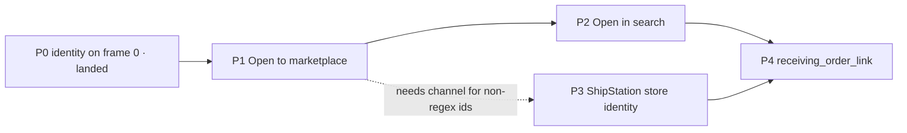

# Carton order identity — Open · Open in search · Edit pairing

Plan only. Nothing in P1–P5 is built yet; P0 is landed and verified.

The desktop carton bar's `#` cell is the operator's handle on **which order this box
is**. Today it can copy a number and (sometimes) open a Zoho PO. This plan makes it
three real verbs, and — the part that actually matters — fixes the identity model
underneath so those verbs are answering from one source instead of a fourth ladder.

---

## 0. Where the identity lives today

Two disjoint namespaces, no join between them:

| | Outbound | Inbound |
|---|---|---|
| Table | `orders` (`schema.ts:1107-1155`) | `receiving_carton.source_order_id`, `receiving_line.source_order_id`, `inbound_purchase_order_links` |
| External id | `orders.order_id` | `source_order_id` (text, **no FK**) |
| Channel | `orders.account_source` | `receiving_line.inbound_source_type` + `source_platform` |
| Unique | `(account_source, order_id)` (`2026-06-14c_amazon_orders_support.sql:10-11`) | none |

**There is no join anywhere between `receiving_*` and `orders`.** The only bridges are
procedural point lookups: `importSalesOrderByNumber` (`returned-serial-link.ts:668-672`),
`linkCartonIdentifier` (`link-carton-identifier.ts:186-200`), `po-search/route.ts:79-84`.

That is the root fact behind every symptom below. The chip is reading a string, not a
record, so it cannot open anything, cannot link back, and cannot tell you which account
the order belongs to.

### What each verb hits today

- **Open** — `poOpenHref` (`useReceivingLineCore.ts:608-613`) builds a Zoho Inventory URL
  and nothing else. No Zoho PO ⇒ `null` ⇒ `IdentityLinkChip.tsx:415-433` renders the Open
  row `disabled` ("No link available"). A RETURN is greyed out a second way:
  `orderCopyOnly` (`CartonContextCard.tsx:456`) forces `openHref` to `undefined`.
- **Open in search** — does not exist on the chip. The destination does:
  `/search?sel=order:<pk>` resolves through `parseSearchSel` (`search-selection.ts:25-36`)
  → `SearchDossier` (`SearchDossier.tsx:25`) → `SearchOrderDossier`, which already renders
  order id, SKU, qty, tracking, lines and the full event stream. `searchOrderFeedbackHref`
  (`search-hit.ts:161-164`) already builds that href. **`sel=` takes a numeric PK, not a
  marketplace string** — that is the one missing hop.
- **Edit order id** — exists and works: `onEditPo` → `openDisplays('linkage', { linkageAction: 'link' })`
  (`LineEditPanel.tsx:1016`) → `POST /api/receiving/link-id` → `linkCartonIdentifier`.

### What ShipStation throws away

`V1OrderSchema` (`orders-v1.ts:98-111`) does not parse `storeId`, `advancedOptions`
(which carries `storeId` + `source`: "Amazon" / "eBay"), or `orderKey`.
`toCanonicalLine` (`connectors/shipstation.ts:31,102`) then hardcodes
`accountSource = 'shipstation'`, and `externalOrderId = orderNumber` (`shipstation.ts:77`).

Consequences, all of them load-bearing for this feature:
1. A ShipStation-sourced order lands as `account_source='shipstation'` — the channel is
   gone, so no deep-link builder can pick Seller Central vs Seller Hub from the record.
   The only thing that still works is the **regex on the id shape**
   (`inferMarketplaceFromOrderId`, Amazon 3-7-7 / eBay 2-5-5).
2. If ShipStation's `orderNumber` is a ShipStation sequence rather than the marketplace
   number, the real marketplace order id is **lost on import**.
3. The seller account is unknowable, so per-account/region routing is impossible.

ShipStation *has* all of it: `GET /stores` returns `storeId`, `storeName`,
`marketplaceId`/`marketplaceName`, `accountName`. We simply never asked.

---

## P0 — landed (this session)

1. **The dashed order id, on frame 0.** `/api/receiving/lookup-po` stripped
   `zoho_purchaseorder_number` / `source_order_id` / `inbound_source_type` from its six
   response branches even though `rz` was already joined. The scan stub therefore had no
   order identity, `getReceivingPoIdentityParts` resolved `''`, and the bar fell through to
   the internal numeric `linkedOrderNumber` — a **dashless** string that matches nothing
   when pasted into eBay. Now one `serializeLookupLine` serializer carries identity on the
   scan response; `PoLineSummary` / `buildMatchedStubRow` thread it onto the optimistic row.
   No new request; it deletes an identity waterfall.
2. **Empty is a CTA.** `—` became **Pair** on hosts that wire `onEditPo`
   (`CartonContextCard.tsx`), opening Package Pairing on the right.
3. **Descender clipping.** `chipLabel`'s `leading-none` + the menu row's `truncate`
   (`overflow:hidden`) clipped g/p/y. Fixed on `CHIP_HOVER_MENU_ITEM_CLASS` with a stated law.

---

## P1 — Open goes to the marketplace (no schema, no request)

`marketplaceOrderUrl` (`src/utils/order-platform.ts:78-117`) **already builds**
Seller Central / Seller Hub / Walmart URLs, and `resolveReceivingOrderOpenUrl`
(`src/lib/receiving/resolve-receiving-order-open-url.ts:10-27`) already wraps it for a
receiving row. Neither is wired into the carton bar. This phase is wiring, not invention.

1. `poOpenHref` becomes a ladder in `useReceivingLineCore.ts:608`:
   Zoho PO id → Zoho PO number → `resolveReceivingOrderOpenUrl(row, poValue)` → `null`.
   Channel comes from `storedOrInferredSourcePlatform`, so an id-shape match still works
   when the stored slug is empty (which is exactly the ShipStation case until P3).
2. `orderCopyOnly` (`CartonContextCard.tsx:456`) must stop blanket-killing RETURN links.
   A return's order id is the *most* linkable thing on the box. Keep copy-only **only**
   where the value is the internal `linkedOrderNumber` (no external id to aim at).
3. Open row title becomes channel-named: "Open on eBay" / "Open in Seller Central" /
   "Open purchase order", so a greyed row is legible as "we have no channel" rather than
   "this is broken".

**Acceptance:** on the Amazon RETURN carton used in testing (order `111-8077794-5833026`),
the Open row is enabled and lands on `sellercentral.amazon.com/orders-v3/order/111-8077794-5833026`.
No Zoho PO on the box. Zero added requests — this is pure derivation from row fields.

**Deliberately deferred:** tenant/region URL templates. `platforms` and `platform_accounts`
carry **no url column** today. Amazon EU/FE hosts exist (`amazon/constants.ts:26-30`) but
until P3 gives us the account we cannot choose one, and both marketplaces resolve a bare
order id against the logged-in session anyway.

---

## P2 — Open in search (the back-link), zero extra requests

The verb is "show me everything we know about this order, inside the app" — i.e.
`/search?sel=order:<orders.id>`, which already renders a full dossier.

The missing hop is **marketplace string → `orders.id`**. Two candidate shapes:

- **(a) Resolve in the row query — recommended.** The receiving lines SQL already joins
  six tables; add a LATERAL against `orders` on
  `(organization_id, order_id = COALESCE(rl.source_order_id, r.source_order_id))`
  projecting `order_pk`. `orders (account_source, order_id)` is already unique-indexed;
  scope by org. The chip then renders the row when `order_pk` is present and **fires no
  request at all** — same discipline as P0.
- **(b) Resolve on click.** `GET /api/orders/lookup/:token` exists
  (`resolve-search-order.ts:103-178`). One request, but only on an explicit click, and no
  SQL change. Fallback when (a) is not yet deployed: `/search?q=<order id>`, which the
  deterministic fan-out already matches on `orders.order_id`,
  `receiving_carton.source_order_id`, `receiving_line.source_order_id` and
  `inbound_purchase_order_links.source_order_id` (`global-entity-search.ts:185-424`).

Chip wiring: `IdentityLinkChip` already has the slot — `onDetails` / `detailsLabel`
(`IdentityLinkChip.tsx:46,104-105,465-475`), the row `ReceivingTicketChip` and
`LinkageDisplayHost` use for in-app jumps. Menu becomes
**Open · Open in search · Copy · Edit order** (`Pair package` when empty).

**Do not** implement this as an Unbox right-rail display. That column is deliberately
client-state only — `stripStaleUnboxRightEdgeParamsFromUrl` (`unbox-right-edge.ts:68-80`)
erases `?display=` on mount — so it cannot be linked or shared. `/search?sel=` is
bookmarkable and already has the dossier. An Unbox "Order" leaf is registerable later
(`unbox-side-tabs.ts` → `unbox-tabs.tsx` → `unbox-display-index.ts`) if the operator wants
the facts without leaving the bench; it is not the back-link.

**Acceptance:** chip menu row "Open in search" on a carton with a known order navigates to
the order dossier showing status, tracking, lines and timeline. Hidden (not greyed) when no
local order row exists — an absent row is honest, a dead row is not.

---

## P3 — ShipStation identity capture (the foundation P1/P2 are standing on)

Until this lands, every ShipStation-sourced order is channel-less and the deep link works
only by id-shape luck. Order of work:

1. **Parse what we already receive.** Extend `V1OrderSchema` (`orders-v1.ts:98-111`) with
   `orderId`, `orderKey`, `storeId`, `advancedOptions.{storeId,source,customField1..3}`.
   Nothing downstream breaks: it is a widening of a Zod schema on a response we already fetch.
2. **Sync the stores.** New `GET /stores` call + a `shipstation_stores` mapping row per org
   (`store_id`, `store_name`, `marketplace_name`, `account_name`, plus nullable FKs to
   `platforms.id` / `platform_accounts.id`). This is the record that turns "shipstation"
   into "eBay · USAV Main". Write it through the connector, not a one-off script.
3. **Stop hardcoding the channel.** `toCanonicalLine` (`shipstation.ts:31,102`) resolves
   `accountSource` from the store mapping and falls back to `'shipstation'` only when the
   store is unmapped. **Migration hazard:** `orders` is unique on
   `(account_source, order_id)`, so changing `account_source` for existing rows is an
   identity change, not a cosmetic one. Do it as a backfill that maps
   `('shipstation', order_id)` → `(resolved_channel, order_id)` with conflict handling, or
   keep `account_source` stable and add a dedicated `channel` column. **Decide this before
   writing code** — it is the one irreversible step in the plan.
4. **Keep the marketplace order id.** When `advancedOptions.source` names a marketplace and
   `orderNumber` is a ShipStation sequence, the marketplace number must be preserved
   (store-mapped column or `order_external_ref`), or the box on the dock can never be
   matched to the sale.

**Acceptance:** a ShipStation-synced eBay order shows `account_source` = the eBay account,
`marketplaceOrderUrl` picks Seller Hub from the record (not from a regex), and P2's
resolution finds it.

---

## P4 — one order-identity linkage, for imports in general

`inbound_purchase_order_links` is **not** the home for this, for three concrete reasons:
`receiving_line_id NOT NULL` (a carton with no line yet cannot have a row),
`CHECK (source_type IN ('zoho','ebay','amazon','manual'))` (shipstation/shopify/walmart
violate it on insert), and it models *purchases we made*, not sales or returns
(`2026-07-01k_inbound_polymorphic_purchase_tables.sql:63-79`).

Target shape — a carton-level identity edge, org-scoped, tenant-from-birth:

```
receiving_order_link(
  organization_id, receiving_id, receiving_line_id NULL,
  external_order_id, channel, platform_account_id NULL,
  local_order_id NULL  -- FK orders.id, the bridge that does not exist today
)
```

with `linkCartonIdentifier` (`link-carton-identifier.ts:133-278`) as the single writer,
and the existing import paths (`/api/receiving/link-id`, `/api/receiving/import-sales-order`,
`/api/receiving/inbound/import-ebay`, Zoho mirror) all landing on it instead of each
writing a different column. That is what makes "import a PO/order" one act with one record
rather than four ladders. Once `local_order_id` exists, P2 option (a) is a plain join and
the search dossier, the unbox bar and the incoming grid all read the same edge.

**This phase needs the `/db-migrate` path and a decision on P3.3 first.** It is the largest
step and should not start until P1/P2 have proven the verbs are what the operator wants.

---

## P5 — perf posture (no drawback, measured)

- P1 and P2(a) add **zero** requests: both are derivations from data the row already
  carries. P2(b) adds one request per explicit click only.
- `/unbox` Tier-1 baseline to protect: Perf 95, LCP 1356 ms, TBT 0, CLS 0.006
  (`lighthouse-baseline.json`). Re-check with `npm run lighthouse:check` on a quiet host
  (the runner refuses above 0.5 load) and `npm run perf:requests -- --route=/unbox`
  against a production build on an isolated `NEXT_DIST_DIR` + throwaway port, then verify
  at `:3050`.
- Any P3 store lookup belongs in the **sync**, never on the scan path. The receiving scan
  path is speed-first by law (`useUnfoundRefetchActions.ts:26-30`).

---

## Sequencing



P1 and P3 are independent and can run in parallel; P4 needs both.

## Blocker to clear first

`pnpm verify:fast` currently fails typecheck on **unrelated, pre-existing** breakage:
`src/lib/shipping/shipstation/order-ship-to.ts` no longer exports `snapshotShipToOnShipment`,
which `src/app/api/shipping/order-labels/purchase/route.ts:24` and
`scripts/e2e-shipstation-customer-book.ts:109` import. That file sits in the ShipStation
tree this plan touches, so P3 cannot be called done while the tree is red. Restore or
re-implement that export before starting P3.
