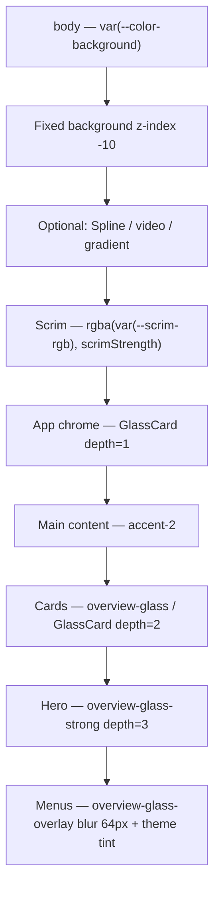

# Glass Design System — Port Guide & Implementation Plan

**Canonical spec** for Garisek-OS **depth-keyed glassmorphism**, **dual theme** (`html.dark` + `html.light`), and the **adjustable grain/frost layer** for readable text over animated backgrounds.

Use this document to:
1. **Port** the full system into another repo (Next.js + Tailwind recommended; framework-agnostic CSS/JS patterns included).
2. **Track** light-theme implementation status in Garisek-OS (see §0 below).

> **Not** the mobile refactor SoT — glass + light theme live here. `docs/MOBILE-FIRST-REFACTOR-SOT.md` only links to this file.

**Source of truth in Garisek-OS (branch `agent/glass-grain-settings-link`):**

| Concern | Path |
|---|---|
| Global tokens + surface CSS | `src/app/globals.css` |
| `GlassCard` component | `src/components/ui/GlassCard.tsx` |
| Grain → CSS var mapper | `src/lib/utils/glassGrain.ts` |
| Grain HTML sync | `src/components/providers/GlassGrainAttribute.tsx` |
| User prefs store | `src/store/ui-prefs.store.ts` |
| Settings sliders | `src/components/settings/DisplayPrefs.tsx` |
| Animated bg + scrim | `src/components/background/SplineBackground.tsx` |
| Enter motion | `src/hooks/useFadeStagger.ts` |
| Theme HTML sync | `src/components/providers/ThemeAttribute.tsx` |
| Theme resolver | `src/lib/utils/theme.ts` |
| Resolved theme hook | `src/hooks/useResolvedTheme.ts` |
| Calm mode HTML sync | `src/components/providers/CalmModeAttribute.tsx` |
| Reference page layout | `src/app/(dashboard)/overview/page.tsx` |

---

## 0. Implementation status (Garisek-OS)

### Shipped on `agent/glass-grain-settings-link`

| Area | Status | Files |
|---|---|---|
| Dark glass tokens + frost CSS | ✅ | `globals.css` |
| **Light theme** (`html.light` overrides) | ✅ | `globals.css` § `html.light` |
| Theme resolver + hook | ✅ | `theme.ts`, `useResolvedTheme.ts` |
| `ThemeAttribute` (class + color-scheme) | ✅ | `ThemeAttribute.tsx` |
| Theme-aware grain mapper | ✅ | `glassGrain.ts`, `GlassGrainAttribute.tsx` |
| Theme-aware scrim on background | ✅ | `SplineBackground.tsx` |
| User prefs (`theme`, `scrim`, `grain`) | ✅ | `ui-prefs.store.ts` |
| Settings UI (Light / Dark / System) | ✅ | `DisplayPrefs.tsx` |
| Provider mount order | ✅ | `providers.tsx` |
| `GlassCard` + `--glass-card-shadow` | ✅ | `GlassCard.tsx`, `globals.css` |
| Overview pill light borders | ✅ | `html.light .overview-pill-border` |
| Settings gear → `/settings` | ✅ | `AppHeader`, `MobilePageHeader`, `LabHeader` |

### Light theme implementation plan

Execute in order when porting or extending. Garisek-OS items marked **done**.

| Step | Task | Garisek |
|---|---|---|
| **L1** | Add full `html.light { }` block — fg, borders, glass fills, grain blend, scrim rgb, overview ink, shadows | **done** |
| **L2** | Ship `<html className="dark" suppressHydrationWarning>`; `ThemeAttribute` flips class on hydrate | **done** |
| **L3** | `resolveTheme()` + `useResolvedTheme()` for system pref + `prefers-color-scheme` listener | **done** |
| **L4** | Pass resolved theme into `glassGrainStyleVars(grain, theme)` | **done** |
| **L5** | Background scrim: `SCRIM_RGB.dark` vs `SCRIM_RGB.light` | **done** |
| **L6** | Settings: 3-way theme control + scrim + grain sliders | **done** |
| **L7** | Audit hardcoded `text-white`, `border-white/10`, `bg-white/[0.03]` — use tokens or `overview-pill-border` | partial |
| **L8** | Verify overview + dropdowns + bento in light at default grain (6%) | manual QA |
| **L9** | Sonner/toast styles theme-aware (currently hardcoded dark in `providers.tsx`) | todo |
| **L10** | Remaining dashboard pages (non-overview) semantic token pass | todo |

### Light-theme acceptance criteria

- [ ] Toggle Light / Dark / System in Settings — no flash, `html` class matches resolved theme
- [ ] `color-scheme` and `data-theme` on `<html>` match resolved theme
- [ ] Glass cards readable at `glassGrain: 0.06` over Spline in **both** themes
- [ ] Scrim washes (light) / dims (dark) without killing glass blur
- [ ] `overview-glass-overlay` menus legible in light (white tint, not gray slab)
- [ ] Grain slider re-runs when theme changes (not only when grain changes)
- [ ] `prefers-color-scheme` updates live when theme pref is `system`

---

## 1. Design intent

**Dual theme** (`html.dark` + `html.light`). UI floats as **frosted glass** over a live background (Spline iframe, video, or gradient). Theme flips surface physics and ink — accents and depth structure stay the same.

Readability is a **three-lever system** (works in both themes):

1. **Scrim** — tints the global background (dark scrim in dark mode, light scrim in light mode).
2. **Backdrop blur + fill opacity** — per-surface depth (`glass-1/2/3`), higher white fill in light mode.
3. **Grain** — SVG noise frost on each glass surface (user slider, 0–100%; blend mode flips per theme).

Grain does **not** replace blur or scrim. It breaks up color bleed so body text stays legible while the surface still reads as glass.

### Theme switching contract

| Mechanism | Value |
|---|---|
| HTML class | `html.dark` or `html.light` (never both) |
| `color-scheme` | `dark` or `light` on `<html>` |
| `data-theme` | `dark` or `light` (optional, for debugging) |
| User pref | `theme: 'dark' \| 'light' \| 'system'` (persisted) |
| System fallback | `prefers-color-scheme` when pref is `system` |

Components use **semantic CSS variables only** (`var(--color-fg-strong)`, `var(--overview-ink)`, etc.). Never hardcode `#fafafa` or `#09090b` in feature code — tokens flip automatically.

---

## 2. Layer stack



Every glass surface also gets:

- `::before` — fractal noise grain (`mix-blend-mode: var(--glass-grain-blend)`)
- `::after` — fill boost (`rgb(var(--glass-fill-boost-rgb) / var(--glass-fill-boost))`)
- Dynamic `backdrop-filter` blur boost (tied to grain slider)

| Property | Dark | Light |
|---|---|---|
| `--scrim-rgb` | `9 9 11` | `250 250 250` |
| `--glass-grain-blend` | `overlay` | `multiply` |
| `--glass-fill-boost-rgb` | `255 255 255` | `255 255 255` |
| Glass fill strategy | Low white alpha on dark bg | High white alpha on light bg |
| Overview ink | Light text `#f5f3ff` | Dark text `#18181b` |
| Overlay tint | Dark purple `rgba(18,12,30,0.6)` | White `rgba(255,255,255,0.82)` |

---

## 3. Token reference

### 3.1 Base palette

**Dark (default — `html.dark` or `:root` in `@theme`):**

```css
html.dark {
  --color-background: #09090b;
  --color-foreground: #d4d4d8;
  --color-fg-strong: #fafafa;
  --color-fg-default: #d4d4d8;
  --color-fg-muted: #a1a1aa;
  --color-fg-subtle: #71717a;
  --color-border-default: rgba(255, 255, 255, 0.08);
  --color-border-strong: rgba(255, 255, 255, 0.14);
}
```

**Light (`html.light`):**

```css
html.light {
  --color-background: #fafafa;
  --color-foreground: #3f3f46;
  --color-fg-strong: #09090b;
  --color-fg-default: #3f3f46;
  --color-fg-muted: #71717a;
  --color-fg-subtle: #a1a1aa;
  --color-border-default: rgba(0, 0, 0, 0.08);
  --color-border-strong: rgba(0, 0, 0, 0.12);
}
```

### 3.2 Depth-keyed glass

One axis: **depth**. Drives fill, border, blur base, and accent color.

| Depth | Dark fill | Light fill | Dark border | Light border | Blur | Accent |
|---|---|---|---|---|---|---|
| 1 | 6% white | 55% white | 12% white | 6% black | 16px | `--accent-1` |
| 2 | 10% white | 72% white | 16% white | 8% black | 22px | `--accent-2` |
| 3 | 14% white | 85% white | 22% white | 10% black | 28px | `--accent-3` |

**Dark:**

```css
html.dark {
  --glass-1: rgba(255, 255, 255, 0.06);
  --glass-2: rgba(255, 255, 255, 0.10);
  --glass-3: rgba(255, 255, 255, 0.14);
  --glass-border-1: rgba(255, 255, 255, 0.12);
  --glass-border-2: rgba(255, 255, 255, 0.16);
  --glass-border-3: rgba(255, 255, 255, 0.22);
}
```

**Light:**

```css
html.light {
  --glass-1: rgba(255, 255, 255, 0.55);
  --glass-2: rgba(255, 255, 255, 0.72);
  --glass-3: rgba(255, 255, 255, 0.85);
  --glass-border-1: rgba(0, 0, 0, 0.06);
  --glass-border-2: rgba(0, 0, 0, 0.08);
  --glass-border-3: rgba(0, 0, 0, 0.10);
}
```

Accents are **theme-invariant** (hue stays recognizable in both modes):

```css
--accent-1: #4f6aff;  /* chrome */
--accent-2: #16a34a;  /* main panel */
--accent-3: #10b981;  /* nested */
--accent-current: var(--accent-2);
```

### 3.3 Overview ink (scoped green dashboard skin)

Opt-in token set for calm home / command-center pages. Historical names use `--overview-purple*` but values are **green**. Green accent hex values are shared; **ink and shadows flip**.

**Dark:**

```css
html.dark {
  --overview-purple: #16a34a;
  --overview-purple-light: #34d399;
  --overview-ink: #f5f3ff;
  --overview-ink-muted: rgba(245, 243, 255, 0.62);
  --overview-ink-faint: rgba(245, 243, 255, 0.42);
  --overview-overlay-bg: rgba(18, 12, 30, 0.6);
  --overview-overlay-sheen: rgba(255, 255, 255, 0.06);
  --overview-shadow-card:
    inset 0 1px 0 0 rgba(255, 255, 255, 0.12),
    inset 0 0 0 1px rgba(255, 255, 255, 0.04),
    0 1px 2px 0 rgba(0, 0, 0, 0.4),
    0 16px 32px -16px rgba(0, 0, 0, 0.55);
}
```

**Light:**

```css
html.light {
  --overview-ink: #18181b;
  --overview-ink-muted: rgba(24, 24, 27, 0.62);
  --overview-ink-faint: rgba(24, 24, 27, 0.42);
  --overview-overlay-bg: rgba(255, 255, 255, 0.82);
  --overview-overlay-sheen: rgba(255, 255, 255, 0.95);
  --overview-shadow-card:
    inset 0 1px 0 0 rgba(255, 255, 255, 0.95),
    inset 0 0 0 1px rgba(0, 0, 0, 0.04),
    0 1px 2px 0 rgba(0, 0, 0, 0.06),
    0 12px 28px -12px rgba(0, 0, 0, 0.10);
}
```

### 3.4 Grain tokens (user-adjustable, theme-aware)

Defaults apply before React hydrates. `GlassGrainAttribute` overwrites dynamic vars on `<html>` when the user moves the slider. Static per-theme vars (`--glass-grain-blend`, `--glass-fill-boost-rgb`, `--scrim-rgb`) live in CSS.

```css
html.dark {
  --glass-grain-opacity: 0.06;
  --glass-grain-blend: overlay;
  --glass-fill-boost-rgb: 255 255 255;
  --scrim-rgb: 9 9 11;
}

html.light {
  --glass-grain-blend: multiply;
  --glass-fill-boost-rgb: 255 255 255;
  --scrim-rgb: 250 250 250;
}

/* Updated at runtime by GlassGrainAttribute */
--glass-grain-size: 180px;
--glass-fill-boost: 0;
--glass-blur-boost: 0px;
```

**Mapping function** (`glassGrainStyleVars`) — pass resolved theme for stronger light-mode frost:

```ts
export function glassGrainStyleVars(
  grain: number,
  theme: 'dark' | 'light' = 'dark',
): Record<string, string> {
  const t = Math.min(1, Math.max(0, grain))
  const opacityBase = theme === 'light' ? 0.03 : 0.02
  const opacityRange = theme === 'light' ? 0.14 : 0.12
  const fillCap = theme === 'light' ? 0.07 : 0.05
  return {
    '--glass-grain-opacity': String(opacityBase + t * opacityRange),
    '--glass-grain-size': `${200 - t * 80}px`,
    '--glass-fill-boost': String(t * fillCap),
    '--glass-blur-boost': `${t * 12}px`,
  }
}
```

| Slider | Dark opacity | Light opacity | Fill cap (dark / light) |
|---|---|---|---|
| 0% | 0.02 | 0.03 | 0 / 0 |
| 50% | 0.08 | 0.10 | 0.025 / 0.035 |
| 100% | 0.14 | 0.17 | 0.05 / 0.07 |

**Light-mode tuning:** Start grain ~10% higher than dark for the same background busyness.

### 3.5 Full `html.light` block (copy from Garisek-OS)

Paste after dark tokens in `globals.css`. This is the **single switch** that flips the whole glass system — no per-component theme branches.

```css
html.light {
  color-scheme: light;

  --color-background: #fafafa;
  --color-foreground: #3f3f46;
  --color-fg-strong: #09090b;
  --color-fg-default: #3f3f46;
  --color-fg-muted: #71717a;
  --color-fg-subtle: #a1a1aa;
  --color-border-default: rgba(0, 0, 0, 0.08);
  --color-border-strong: rgba(0, 0, 0, 0.12);
  --color-overlay-hover: rgba(0, 0, 0, 0.04);
  --color-surface-container-low: rgba(0, 0, 0, 0.04);
  --color-surface-container-high: rgba(0, 0, 0, 0.08);

  /* Light glass — higher white fill, dark hairline borders */
  --glass-1: rgba(255, 255, 255, 0.55);
  --glass-2: rgba(255, 255, 255, 0.72);
  --glass-3: rgba(255, 255, 255, 0.85);
  --glass-border-1: rgba(0, 0, 0, 0.06);
  --glass-border-2: rgba(0, 0, 0, 0.08);
  --glass-border-3: rgba(0, 0, 0, 0.10);

  --glass-grain-blend: multiply;
  --glass-fill-boost-rgb: 255 255 255;
  --scrim-rgb: 250 250 250;

  --glass-card-shadow:
    inset 0 1px 0 0 rgba(255, 255, 255, 0.9),
    inset 0 0 0 1px rgba(0, 0, 0, 0.04),
    0 1px 2px 0 rgba(0, 0, 0, 0.05),
    0 12px 28px -12px rgba(0, 0, 0, 0.10);

  /* Overview ink inverts to dark-on-light */
  --overview-ink: #18181b;
  --overview-ink-muted: rgba(24, 24, 27, 0.62);
  --overview-ink-faint: rgba(24, 24, 27, 0.42);
  --overview-overlay-bg: rgba(255, 255, 255, 0.82);
  --overview-overlay-sheen: rgba(255, 255, 255, 0.95);
  --overview-shadow-card:
    inset 0 1px 0 0 rgba(255, 255, 255, 0.95),
    inset 0 0 0 1px rgba(0, 0, 0, 0.04),
    0 1px 2px 0 rgba(0, 0, 0, 0.06),
    0 12px 28px -12px rgba(0, 0, 0, 0.10);
}

/* Optional: overview pill chips — avoids hardcoded white/10 borders */
html.light .overview-pill-border {
  border-color: rgba(0, 0, 0, 0.08);
  background-color: rgba(0, 0, 0, 0.03);
}
html.light .overview-pill-border:hover {
  border-color: rgba(0, 0, 0, 0.14);
  background-color: rgba(0, 0, 0, 0.05);
}
```

Dark mode uses the inverse: low white fill, `overlay` grain blend, `--scrim-rgb: 9 9 11`, light overview ink. `GlassCard` reads `shadow-[var(--glass-card-shadow)]` so card elevation flips with theme automatically.

---

## 4. Surface CSS (copy verbatim)

### 4.1 Frost layer (all glass surfaces)

```css
.glass-surface,
.overview-glass,
.overview-glass-strong,
.overview-glass-overlay {
  position: relative;
  isolation: isolate;
  backdrop-filter: blur(calc(var(--glass-blur-base, 22px) + var(--glass-blur-boost, 0px)))
    saturate(var(--glass-saturate, 140%));
  -webkit-backdrop-filter: blur(calc(var(--glass-blur-base, 22px) + var(--glass-blur-boost, 0px)))
    saturate(var(--glass-saturate, 140%));
}

/* Grain — breaks up background color bleed */
.glass-surface::before,
.overview-glass::before,
.overview-glass-strong::before,
.overview-glass-overlay::before {
  content: '';
  position: absolute;
  inset: 0;
  border-radius: inherit;
  pointer-events: none;
  z-index: 0;
  opacity: var(--glass-grain-opacity, 0.06);
  mix-blend-mode: var(--glass-grain-blend, overlay);
  background-image: url("data:image/svg+xml,%3Csvg viewBox='0 0 256 256' xmlns='http://www.w3.org/2000/svg'%3E%3Cfilter id='n'%3E%3CfeTurbulence type='fractalNoise' baseFrequency='0.85' numOctaves='4' stitchTiles='stitch'/%3E%3C/filter%3E%3Crect width='100%25' height='100%25' filter='url(%23n)'/%3E%3C/svg%3E");
  background-size: var(--glass-grain-size, 180px) var(--glass-grain-size, 180px);
}

/* Fill boost — rgb token flips per theme; opacity from grain slider */
.glass-surface::after,
.overview-glass::after,
.overview-glass-strong::after,
.overview-glass-overlay::after {
  content: '';
  position: absolute;
  inset: 0;
  border-radius: inherit;
  pointer-events: none;
  z-index: 0;
  background: rgb(var(--glass-fill-boost-rgb, 255 255 255) / var(--glass-fill-boost, 0));
}

/* Keep content above pseudo layers */
.glass-surface > *,
.overview-glass > *,
.overview-glass-strong > *,
.overview-glass-overlay > * {
  position: relative;
  z-index: 1;
}
```

### 4.2 Surface variants

```css
/* Standard card — depth 2 */
.overview-glass {
  --glass-blur-base: 22px;
  --glass-saturate: 140%;
  background: var(--glass-2);
  border: 1px solid var(--glass-border-2);
  border-radius: 22px;
  box-shadow: var(--overview-shadow-card);
  --accent-current: var(--accent-2);
}

/* Hero / nested — depth 3 */
.overview-glass-strong {
  --glass-blur-base: 28px;
  --glass-saturate: 150%;
  background: var(--glass-3);
  border: 1px solid var(--glass-border-3);
  border-radius: 22px;
  box-shadow: var(--overview-shadow-card);
  --accent-current: var(--accent-3);
}

/* Floating menus — occlusion via heavy blur + theme tint (dark purple / white) */
.overview-glass-overlay {
  --glass-blur-base: 64px;
  --glass-saturate: 135%;
  background:
    linear-gradient(180deg, var(--overview-overlay-sheen) 0%, transparent 42%),
    var(--overview-overlay-bg);
  border: 1px solid var(--glass-border-3);
  border-radius: 22px;
  box-shadow:
    inset 0 1px 0 0 rgba(255, 255, 255, 0.08),
    0 24px 56px -12px rgba(0, 0, 0, 0.7),
    0 0 0 1px rgba(34, 197, 94, 0.06);
}
```

### 4.3 Accent cascade utilities

Descendants of a `GlassCard` inherit `--accent-current`. No per-button accent props.

```css
.text-accent { color: var(--accent-current); }
.bg-accent { background-color: var(--accent-current); }
.border-accent { border-color: var(--accent-current); }
.ring-accent { --tw-ring-color: var(--accent-current); }

.bg-accent-gradient {
  background: linear-gradient(
    135deg,
    var(--accent-current),
    color-mix(in srgb, var(--accent-current) 65%, black)
  );
}
```

---

## 5. React components

### 5.1 `GlassCard`

Primary surface primitive. Sets depth, blur base, accent cascade, and `glass-surface` class.

```tsx
'use client'

import { forwardRef, type ElementType, type ReactNode } from 'react'

export type GlassDepth = 1 | 2 | 3

const DEPTH_VAR = {
  1: { bg: 'var(--glass-1)', border: 'var(--glass-border-1)', accent: 'var(--accent-1)', blur: 16, saturate: 140 },
  2: { bg: 'var(--glass-2)', border: 'var(--glass-border-2)', accent: 'var(--accent-2)', blur: 22, saturate: 140 },
  3: { bg: 'var(--glass-3)', border: 'var(--glass-border-3)', accent: 'var(--accent-3)', blur: 28, saturate: 150 },
} as const

// Props: depth?, as?, className?, children?, style?, ...native element props
// Renders with:
//   className="glass-surface relative rounded-[22px] border shadow-[var(--glass-card-shadow)]"
//   style={{ background, borderColor, --glass-blur-base, --glass-saturate, --accent-current }}
```

**Usage:**

```tsx
<GlassCard depth={1} as="aside" className="w-[250px]">Sidebar</GlassCard>
<GlassCard depth={2} className="p-4">Content card</GlassCard>
<GlassCard depth={3} className="p-6">Modal panel</GlassCard>
```

Legacy pages can use CSS classes directly: `className="overview-glass p-4"` (no import required).

### 5.2 `useResolvedTheme` + `ThemeAttribute`

**Shared resolver** — any client component that needs the active theme (background scrim, grain, charts) should use this hook instead of duplicating `matchMedia` logic.

```tsx
// hooks/useResolvedTheme.ts
'use client'

import { useSyncExternalStore } from 'react'
import { useUiPrefsStore } from '@/store/ui-prefs.store'
import { resolveTheme, type ResolvedTheme } from '@/lib/utils/theme'

function subscribeSystemTheme(onChange: () => void) {
  const mq = window.matchMedia('(prefers-color-scheme: dark)')
  mq.addEventListener('change', onChange)
  return () => mq.removeEventListener('change', onChange)
}

export function useResolvedTheme(): ResolvedTheme {
  const themePref = useUiPrefsStore((s) => s.theme)
  const systemDark = useSyncExternalStore(
    subscribeSystemTheme,
    () => window.matchMedia('(prefers-color-scheme: dark)').matches,
    () => true, // SSR default dark — avoids light flash
  )
  return resolveTheme(themePref, systemDark)
}
```

```tsx
// lib/utils/theme.ts
export type ThemePreference = 'dark' | 'light' | 'system'
export type ResolvedTheme = 'dark' | 'light'

export function resolveTheme(preference: ThemePreference, systemDark: boolean): ResolvedTheme {
  if (preference === 'system') return systemDark ? 'dark' : 'light'
  return preference
}
```

**HTML sync** — mount once in providers. Reads prefs from store (no props).

```tsx
'use client'

import { useEffect } from 'react'
import { useUiPrefsStore } from '@/store/ui-prefs.store'
import { useResolvedTheme } from '@/hooks/useResolvedTheme'

export function ThemeAttribute() {
  const themePref = useUiPrefsStore((s) => s.theme)
  const resolved = useResolvedTheme()

  useEffect(() => {
    const root = document.documentElement
    root.classList.remove('dark', 'light')
    root.classList.add(resolved)
    root.style.colorScheme = resolved
    root.dataset.theme = resolved
  }, [themePref, resolved])

  return null
}
```

Root layout ships `className="dark"` + `suppressHydrationWarning` on `<html>`; `ThemeAttribute` corrects on hydrate.

### 5.3 `GlassGrainAttribute` + provider order

Mount in `providers.tsx` in this order (theme before grain):

```tsx
<ThemeAttribute />
<CalmModeAttribute />   {/* optional */}
<GlassGrainAttribute />
```

`GlassGrainAttribute` reads `glassGrain` + `useResolvedTheme()` and writes CSS vars to `<html>`:

```tsx
'use client'

import { useEffect } from 'react'
import { useUiPrefsStore } from '@/store/ui-prefs.store'
import { glassGrainStyleVars } from '@/lib/utils/glassGrain'
import { useResolvedTheme } from '@/hooks/useResolvedTheme'

export function GlassGrainAttribute() {
  const grain = useUiPrefsStore((s) => s.glassGrain)
  const resolved = useResolvedTheme()

  useEffect(() => {
    const root = document.documentElement
    const vars = glassGrainStyleVars(grain, resolved)
    for (const [key, value] of Object.entries(vars)) {
      root.style.setProperty(key, value)
    }
  }, [grain, resolved])

  return null
}
```

Re-run grain mapping when **either** `glassGrain` or resolved theme changes.

### 5.4 Background + scrim

Fixed full-viewport layer behind all content. Scrim RGB must flip with theme.

```tsx
const SCRIM_RGB = { dark: '9, 9, 11', light: '250, 250, 250' } as const

// Resolve theme same as ThemeAttribute, then:
<div
  className="absolute inset-0"
  style={{ backgroundColor: `rgba(${SCRIM_RGB[resolved]}, ${scrimStrength})` }}
/>
```

Defaults: `scrimStrength = 0.3`, range `0 – 0.8`. Light scrim **washes** colorful backgrounds; dark scrim **dims** them.

---

## 6. User preferences store

Persisted Zustand (localStorage). Minimum fields for the glass upgrade:

```ts
type UiPrefsState = {
  theme: 'dark' | 'light' | 'system'
  calmMode: boolean
  reducedMotionAuto: boolean
  splineEnabled: boolean
  splineSceneUrl: string
  scrimStrength: number      // 0 – 1, UI caps at 0.8
  glassGrain: number         // 0 – 1
}

// Defaults
theme: 'dark'
calmMode: false
reducedMotionAuto: true
splineEnabled: true
scrimStrength: 0.3
glassGrain: 0.06
```

Clamp on write:

```ts
setTheme: (theme) => set({ theme })
setScrimStrength: (n) => set({ scrimStrength: Math.min(1, Math.max(0, n)) })
setGlassGrain: (n) => set({ glassGrain: Math.min(1, Math.max(0, n)) })
```

---

## 7. Settings UI

Place theme control + sliders in a **Display** / **Appearance** settings card.

```tsx
{/* Theme — 3-way segmented control */}
{(['light', 'dark', 'system'] as const).map((value) => (
  <button key={value} type="button" onClick={() => setTheme(value)} />
))}

{/* Scrim — tints global background (color follows theme) */}
<label htmlFor="pref-scrim">Scrim {Math.round(scrimStrength * 100)}%</label>
<input
  id="pref-scrim"
  type="range"
  min={0}
  max={0.8}
  step={0.05}
  value={scrimStrength}
  onChange={(e) => setScrimStrength(Number(e.target.value))}
/>

{/* Grain — frost on glass cards */}
<label htmlFor="pref-glass-grain">Grain {Math.round(glassGrain * 100)}%</label>
<input
  id="pref-glass-grain"
  type="range"
  min={0}
  max={1}
  step={0.02}
  value={glassGrain}
  onChange={(e) => setGlassGrain(Number(e.target.value))}
/>

<p className="text-caption">
  Theme flips glass fill and text ink. Scrim tints the background. Grain adds frost to cards.
</p>
```

### Light-mode component rules

| Pattern | Dark | Light | Notes |
|---|---|---|---|
| Pill chip border | `border-white/10` | `border-black/8` or semantic `border-[var(--color-border-default)]` | Prefer semantic tokens |
| Pill chip bg | `bg-white/[0.03]` | `bg-black/[0.03]` | Or `var(--color-overlay-hover)` |
| Progress track | `bg-white/[0.06]` | `bg-black/[0.06]` | Works via perceptual contrast |
| Hardcoded `text-white` on pills | OK on gradient CTA | OK on gradient CTA | Body text must use `--overview-ink` |
| `overview-glass` on page | Works as-is | Works as-is | Tokens flip in `html.light` |

**Never** branch components with `isDark ? ... : ...` for colors — use semantic CSS variables.

Header settings gear should navigate to this page:

```tsx
navigateTo('settings', '/settings', 'General')
router.push('/settings')
// or <Link href="/settings" onClick={() => navigateTo(...)} />
```

---

## 8. Overview page layout grammar

The overview page is the reference implementation. Replicate this **composition**, not just the CSS classes.

### 8.1 Page shell

```tsx
<div className="relative -m-2 flex min-h-full flex-col md:-m-3">
  <div className="relative z-10 mx-auto flex w-full max-w-4xl flex-1 flex-col gap-6 px-4 py-6 sm:px-6 md:gap-8 md:px-8 md:py-10">
    {/* sections */}
  </div>
</div>
```

Constraints:

- `max-w-4xl mx-auto` — editorial width
- `gap-6 md:gap-8` — vertical rhythm
- `text-center` on hero block
- `relative z-10` so content sits above background

### 8.2 Section order (narrative flow)

1. Greeting (time-aware, centered)
2. Goal hero (`overview-glass-strong` selector pill + progress card)
3. Pill header (workflow chips + quick capture)
4. Today focus list (`overview-glass`)
5. Inbox triage (`overview-glass`)
6. Initiatives (`overview-glass` expandable)
7. Bento tiles (`grid grid-cols-2 gap-3 md:grid-cols-4`)

### 8.3 Motion

```tsx
const { stagger } = useFadeStagger()
<motion.div {...stagger(0)}>Greeting + hero</motion.div>
<motion.div {...stagger(1)}>Pills</motion.div>
// ... delay factor increments per section
```

`useFadeStagger` honors:

- `prefers-reduced-motion` (when `reducedMotionAuto` is on)
- **Calm mode** — opacity-only, no `y` translation, slower timing
- Default — `opacity 0→1`, `y 12→0`, 400ms, `ease [0.25, 1, 0.5, 1]`

Calm mode CSS (optional):

```css
html[data-calm="true"] {
  --calm-accent-filter: saturate(0.78);
  --calm-hover-duration: 240ms;
}
html[data-calm="true"] .calm-soft {
  filter: var(--calm-accent-filter);
  transition-duration: var(--calm-hover-duration) !important;
}
```

---

## 9. Typography patterns

Use overview ink tokens on green-accent pages; semantic fg tokens elsewhere.

| Role | Classes |
|---|---|
| Section label | `text-[11px] font-semibold uppercase tracking-[0.14em] text-[var(--overview-ink-faint)]` |
| Date line | `text-[11px] font-medium uppercase tracking-[0.16em] text-[var(--overview-ink-faint)]` |
| Greeting | `text-[19px] font-semibold tracking-[-0.01em] text-[var(--overview-ink)]` |
| Goal name | `text-[20px] font-bold tracking-[-0.02em] sm:text-[26px] md:text-[30px] text-[var(--overview-ink)]` |
| Metric value | `text-[28px] font-bold leading-none tabular-nums text-[var(--overview-ink)]` |
| Body | `text-[13px] text-[var(--overview-ink)]` |
| Caption | `text-[11px] text-[var(--overview-ink-faint)]` |
| Icon accent | `h-3 w-3 text-[var(--overview-purple-light)]` |

Display type uses **Manrope** (`--font-display`); UI uses **Inter** (`--font-sans`).

---

## 10. Component recipes

### 10.1 Pill chip (navigation)

Prefer `overview-pill-border` (theme-aware in CSS) or semantic borders:

```tsx
className={cn(
  'overview-pill-border inline-flex h-7 items-center gap-1.5 rounded-full pl-2.5 pr-3',
  'text-[12px] font-medium text-[var(--overview-ink-muted)]',
  'transition-colors duration-150 hover:text-[var(--overview-ink)]',
  'focus-visible:outline-none focus-visible:ring-2 focus-visible:ring-[var(--overview-purple-light)]',
)}
```

Fallback without utility class — use semantic tokens:

```tsx
'border border-[var(--color-border-default)] bg-[var(--color-overlay-hover)]',
'hover:border-[var(--color-border-strong)] hover:bg-[var(--color-surface-container-low)]',
```

Primary CTA pill:

```tsx
'bg-gradient-to-b from-[var(--overview-purple-light)] to-[var(--overview-purple)]',
'text-[12px] font-semibold text-white',
'shadow-[0_6px_18px_-8px_rgba(34,197,94,0.55)]',
'hover:scale-[1.03] active:scale-[0.98]',
```

### 10.2 Bento tile

```tsx
<Link className={cn(
  'overview-glass group flex flex-col gap-3 overflow-hidden rounded-2xl p-4',
  'transition-[transform,box-shadow] duration-200 ease-out',
  'hover:-translate-y-0.5 hover:shadow-xl',
  'focus-visible:ring-2 focus-visible:ring-[var(--overview-purple-light)]',
)}>
  {/* Icon badge: backgroundColor={`${accent}22`}, color={accent} */}
  {/* Label: text-[10px] font-semibold uppercase tracking-[0.1em] */}
  {/* Metric: text-[28px] font-bold tabular-nums */}
</Link>
```

### 10.3 Progress bar

```tsx
{/* Track — semantic overlay works in both themes */}
<div
  className="relative w-full overflow-hidden rounded-full bg-[var(--color-surface-container-high)] ring-1 ring-inset ring-[var(--color-border-subtle)]"
  style={{ height }}
>
  {/* Fill */}
  <div
    className="h-full rounded-full transition-[width] duration-500 ease-out"
    style={{
      width: `${pct}%`,
      background: 'linear-gradient(90deg, #15803d 0%, #16a34a 60%, #34d399 100%)',
      boxShadow: '0 0 12px rgba(34,197,94,0.45), inset 0 1px 0 rgba(255,255,255,0.25)',
    }}
  />
</div>
```

### 10.4 Dropdown / popover

Always use `overview-glass-overlay`, not `overview-glass`:

```tsx
<DropdownMenuContent className="overview-glass-overlay w-[min(360px,calc(100vw-32px))] p-1.5" />
```

---

## 11. Readability troubleshooting

| Symptom | Dark fix | Light fix |
|---|---|---|
| Background animation distracts | Raise **scrim** | Raise **scrim** (light wash) |
| Text on cards hard to read | Raise **grain** 40–60% | Raise **grain** 50–70% (higher curve) |
| Dropdown text bleeds through | `overview-glass-overlay` | Same — white overlay tint |
| Surfaces look flat/muddy | Lower grain; raise scrim | Lower grain; check white fill % |
| Glass effect lost | Lower grain below 30% | Ensure `backdrop-filter` not disabled |
| Light cards look too opaque | Lower grain | Lower `--glass-2` to 0.65 if needed |

**Do not** put grain only on `body` — it must be on **each glass surface** (`::before` on `.glass-surface`).

**Do not** raise fill opacity without blur — surfaces read as solid gray panels.

---

## 12. Port checklist

Copy in this order. **Garisek-OS** column shows what is already shipped on `agent/glass-grain-settings-link`.

### Phase 1 — Tokens + CSS

| Task | Garisek |
|---|---|
| Add depth glass tokens for **both** `html.dark` and `html.light` | ✅ |
| Add grain tokens (`--glass-grain-blend`, `--glass-fill-boost-rgb`, `--scrim-rgb`) | ✅ |
| Add `--glass-card-shadow` per theme | ✅ |
| Add overview ink tokens with light-mode overrides | ✅ |
| Paste frost layer CSS (§4.1) with theme-aware blend + fill rgb | ✅ |
| Paste surface variant CSS (§4.2) | ✅ |
| Paste accent cascade utilities (§4.3) | ✅ |
| Add `html.light .overview-pill-border` (optional chip helper) | ✅ |
| Ship `html` with `className="dark"` + `suppressHydrationWarning` | ✅ |

### Phase 2 — Components

| Task | Garisek |
|---|---|
| `GlassCard` with `glass-surface` + `var(--glass-card-shadow)` | ✅ |
| `theme.ts` resolver | ✅ |
| `useResolvedTheme()` hook | ✅ |
| `ThemeAttribute` provider (store-driven, no props) | ✅ |
| `glassGrain.ts` mapper (theme-aware) | ✅ |
| `GlassGrainAttribute` provider | ✅ |
| Background layer + **theme-aware** scrim | ✅ |
| `useFadeStagger` hook (optional) | ✅ |
| `CalmModeAttribute` (optional) | ✅ |

### Phase 3 — State + settings

| Task | Garisek |
|---|---|
| Prefs store with `theme`, `scrimStrength`, `glassGrain` (persisted) | ✅ |
| Mount `ThemeAttribute` → `GlassGrainAttribute` in providers | ✅ |
| Display settings: theme control + scrim + grain sliders | ✅ |
| Wire header settings button → `/settings` | ✅ |

### Phase 4 — Page grammar (optional reference page)

| Task | Garisek |
|---|---|
| Centered `max-w-4xl` layout | ✅ overview |
| Hero + pills + lists + bento grid | ✅ overview |
| Staggered `motion.div` entrances | ✅ overview |
| Use `var(--overview-ink*)` — never hardcoded text colors | partial |

### Phase 5 — Verify (both themes)

| Task | Garisek |
|---|---|
| Toggle light/dark/system — all semantic tokens flip, no flash | QA |
| Grain slider updates frost in **both** themes | ✅ code path |
| Scrim uses dark rgb in dark mode, light rgb in light mode | ✅ |
| Dropdowns readable in both themes (`overview-glass-overlay`) | QA |
| Overview page legible at default grain in light + dark | QA |
| `prefers-color-scheme` respected when theme is `system` | ✅ code path |
| Sonner / global toasts theme-aware | ❌ todo |

---

## 13. File manifest (minimal copy set)

```
src/app/globals.css                          # dark + html.light token overrides
src/lib/utils/theme.ts                       # resolveTheme helper
src/hooks/useResolvedTheme.ts                # shared theme resolution
src/components/providers/ThemeAttribute.tsx
src/components/ui/GlassCard.tsx
src/lib/utils/glassGrain.ts
src/components/providers/GlassGrainAttribute.tsx
src/store/ui-prefs.store.ts                  # theme + scrim + grain
src/components/settings/DisplayPrefs.tsx
src/components/background/SplineBackground.tsx
src/components/providers.tsx                 # ThemeAttribute → GlassGrainAttribute
```

---

## 14. Dependencies

| Package | Purpose |
|---|---|
| `framer-motion` | Page stagger, calm/reduced-motion |
| `zustand` + `persist` | User prefs (grain, scrim, calm) |
| `tailwindcss` v4 | Utility classes (`@theme`, `@import "tailwindcss"`) |
| `@fontsource` or `next/font` | Inter + Manrope |

No extra dependency for grain — pure CSS `feTurbulence` SVG data URI.

---

## 15. Customization for your repo

| Knob | Where to change |
|---|---|
| Light glass opacity | `html.light { --glass-1/2/3 }` |
| Grain blend per theme | `--glass-grain-blend` in `html.dark` / `html.light` |
| Grain intensity curve | `glassGrainStyleVars()` — separate dark/light coefficients |
| Scrim color | `SCRIM_RGB` in background component or `--scrim-rgb` CSS |
| Default theme | `theme: 'dark'` in prefs store |
| Accent colors per depth | `--accent-1/2/3` (usually theme-invariant) |
| Overview brand color | `--overview-purple*` tokens |
| Default grain level | `glassGrain: 0.06` (bump to `0.08` for light-first apps) |
| Light pill borders | `overview-pill-border` class or `--color-border-default` |

### Known follow-ups (Garisek-OS)

- **Toasts:** `providers.tsx` Sonner `toastOptions.style` is still hardcoded dark — should read resolved theme or CSS vars.
- **Non-overview pages:** some modules still use `border-white/10` chips; migrate to semantic tokens per §7 table.

---

*Garisek-OS glass design system — dual theme + grain frost. Canonical doc. Last updated: 2026-07-11.*
