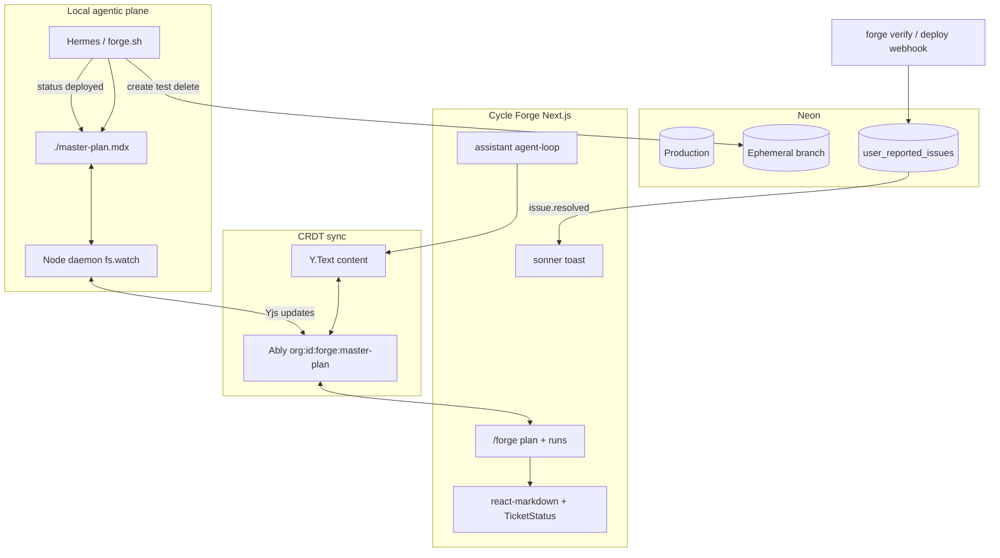

# Cycle Forge Agentic Loop — Master Plan (Neon + Ably + Yjs)

> **Status:** PLAN LOCKED (2026-07-11). Implementation **0%** — docs + contracts only.
> Executable companion: [`agentic-loop-EXECUTION-PROMPT.md`](./agentic-loop-EXECUTION-PROMPT.md)
> (Fable 5 / ultracode). Paste that prompt into a fresh session to build phases.
>
> **Product framing:** Cycle Forge is the sellable B2B warehouse/fulfillment SaaS (`PRODUCT_NAME`).
> This plan is the **agentic meta-loop** that bridges Cursor, Hermes/`forge.sh`, the `/forge`
> dashboard, and safe Neon branch verification. USAV is the first dogfood tenant only.
>
> **Deep-scan baseline (2026-07-11):** Ably + Neon are production-grade. Yjs/CRDT, programmatic Neon
> branching, local `fs.watch` daemon, and issue→deploy→toast are greenfield. `/forge` is poll-only
> run history today (one optional PWA ingest comment in `.cycle_forge_ops/scripts/forge.sh`).

---

## -2. Locked synthesis

Where earlier drafts conflict with this section, **this section wins**.

### Locked decisions

| Decision | Answer |
|---|---|
| **Stack** | **Neon Postgres + Ably + Yjs + Next.js.** Composable: Ably = realtime sync; Neon = ops data + issues + CoW branch sandboxes; Yjs = conflict-free Markdown merge. |
| **Anti-goals** | No second browser Ably client outside `AblyProvider`. No Vercel AI SDK `useChat` replacement of the existing SSE assistant in this plan. No third-party CRDT host — Yjs rides Ably. |
| **What this loop is** | Agentic meta-loop: local `./master-plan.mdx` ↔ Y.Text ↔ Ably ↔ `/forge` plan UI ↔ Hermes/`forge.sh` ↔ Neon ephemeral branches ↔ in-app resolution toasts. |
| **What this loop is not** | Not a parallel product. Not a replacement for `docs/CYCLE-FORGE-ROADMAP` (that remains the product feature spine; this loop **executes** those tickets safely). |
| **CRDT document** | Single `Y.Text('content')` holding the raw MDX/Markdown string of the master plan. Humans in Cursor and agents on the web merge without last-write-wins clobber. |
| **Authoritative ops DB** | Neon stays primary for FBA, inventory, users, `cycle_forge_runs`, and `user_reported_issues`. Neon does **not** hold the live CRDT blob (optional snapshot table later). |
| **Realtime transport** | Existing Ably org-scoped bus (`src/lib/realtime/channels.ts`). New channel helper: `getMasterPlanChannel(orgId)` → `org:{uuid}:forge:master-plan`. Yjs sync steps ride Ably messages (custom provider; own the protocol — do not depend on unmaintained community packages without vendoring). |
| **Local bridge** | Node daemon (`fs.watch` on `./master-plan.mdx`) under `.cycle_forge_ops/scripts/`, PM2-managed. Upstream: file → Y.Text → Ably. Downstream: Ably → atomic file write. Echo suppressed via generation tokens. |
| **Web render** | Prefer existing `react-markdown` + `remark-gfm` + custom components (`TicketStatus`, `AgentLog`). Add `next-mdx-remote` only if MDX component compilation is required. |
| **Web agent** | Extend **existing** `src/lib/assistant/agent-loop.ts` + SSE with a server tool `mutate_master_plan`. Do not fork a second chat stack. |
| **Ticket status enum** | Only `pending` \| `in-progress` \| `deployed` inside `<TicketStatus />`. |
| **Verification sandbox** | Before DB-touching VERIFY: Neon API creates an ephemeral CoW branch from production; tests run against branch connection string; on success update MDX status + delete branch; on fail keep branch for retry (TTL + max attempts). Never point production `DATABASE_URL` at agent work. |
| **In-app feedback loop** | Neon `user_reported_issues` + Ably push + sonner toast (stateful in-app resolution). Dual-write with existing GitHub Issues path (`/api/user-issues` + `claude-fix-issue.yml`). |
| **Forge run history** | Keep `cycle_forge_runs` / `cycle_forge_run_steps` + `/api/forge/ingest`. CRDT plan ≠ run history. |
| **Display archetype** | `/forge` plan region = **Monitor** (or Canvas if semantic zoom is added later). Run list = **Workbench**. Never blend two archetypes in one region. |
| **Tenancy** | All Ably channels via `orgChannelPrefix()`. `orgId` from auth `ctx`, never body. Daemon uses server `ABLY_API_KEY` or a machine token — never ship the API key to the browser. |

### Concern isolation (why this stack)

```
Ably     → blazing-fast pub/sub + Yjs sync across Cursor, web, agents
Yjs      → CRDT merge for concurrent human + agent edits of master-plan.mdx
Neon     → heavy-duty ops data + instantaneous CoW branches for safe agent VERIFY
Next.js  → stateful dashboard + existing assistant SSE loop
```

---

## -1. Repo reality map (extend, don’t fork)

| Layer | Exists today | Agentic-loop action |
|---|---|---|
| Ably org bus | `channels.ts`, `AblyContext`, `publish.ts`, `/api/realtime/token` | Add master-plan channel + token capability |
| Forge UI | `/forge` poll-only run history | Ably-live runs + plan MDX view |
| Forge ingest | `POST /api/forge/ingest` (`x-forge-token`) | Emit TicketStatus / issue resolution hooks |
| Local loop | `.cycle_forge_ops/scripts/forge.sh` + Hermes | Parse pending tickets; Neon branch VERIFY; write `deployed` |
| Assistant | `agent-loop.ts` + `useAssistantChat` SSE | Add `mutate_master_plan` tool |
| Feedback | `FeedbackWidget` → GitHub only | Dual-write Neon + Ably resolve toast |
| Toasts | `src/lib/toast.ts` (sonner) | Resolution toast copy locked below |
| Neon branching | Manual CLI in `docs/qa-org-playbook.md` | Programmatic API client + lifecycle |
| Yjs CRDT | **Absent** | Greenfield Ably↔Yjs provider |
| Outbox `orgId` gap | `realtime-outbox-relay.js` omits `orgId` | Fix if issues use DB→Ably path |

---

## 0. Architecture



### MDX component contract

```mdx
<TicketStatus status="pending" ticketId="P1-TRACE-02" href="/docs/todo/…" />
<TicketStatus status="in-progress" ticketId="P1-TRACE-02" href="…" />
<TicketStatus status="deployed" ticketId="P1-TRACE-02" href="…" resolutionCommit="abc1234" />

<AgentLog runUid="…" stage="verify" />
```

Statuses outside `{pending, in-progress, deployed}` are invalid. Parsers and UI must reject them.

### Resolution toast copy (locked)

> The bug you reported has been fixed! Refresh the page to load the latest version.

---

## 1. SoT task list

Status values for tasks below: `todo` · `in-progress` · `review` · `done` · `blocked`.

### Phase 0 — Formalize contracts

| ID | Task | Status | Acceptance |
|---|---|---|---|
| **ALP-0.1** | Document agentic-loop scope; `/forge` chrome stays Cycle Forge branding | `todo` | Product name unchanged; meta-loop named in docs only |
| **ALP-0.2** | Publish locked stack + anti-goals (this §-2) | `done` | This document |
| **ALP-0.3** | Channel contract: `getMasterPlanChannel(orgId)` in `channels.ts` | `todo` | Org-scoped; throws on bad UUID via `orgChannelPrefix` |
| **ALP-0.4** | TicketStatus / AgentLog component contract + TypeScript types | `todo` | Enum + props documented; unit parse tests |
| **ALP-0.5** | File SoT: `./master-plan.mdx` ↔ `Y.Text('content')`; Neon not live CRDT store | `todo` | Written into daemon + web bootstrap |

### Phase 1 — Real-time state layer (Ably + Yjs)

| ID | Task | Status | Acceptance |
|---|---|---|---|
| **ALP-1.1** | Add `yjs`; implement Ably↔Yjs provider (custom) | `todo` | Two clients merge concurrent edits |
| **ALP-1.2** | Extend `/api/realtime/token` capabilities for master-plan channel | `todo` | E2E token test asserts capability |
| **ALP-1.3** | Shared `createMasterPlanYDoc()` factory (server, client, daemon) | `todo` | Single `Y.Text('content')` key |
| **ALP-1.4** | Empty-room bootstrap from `master-plan.mdx` or last snapshot | `todo` | Never wipes Neon ops data |

**HUMAN GATE 1:** two browsers + one daemon see the same string after concurrent edits.

### Phase 2 — Local file bridge

| ID | Task | Status | Acceptance |
|---|---|---|---|
| **ALP-2.1** | `.cycle_forge_ops/scripts/master-plan-sync-daemon.mjs` + `fs.watch` | `todo` | Starts under PM2 |
| **ALP-2.2** | Upstream: local save → Y.Text → Ably | `todo` | Cursor save appears in web &lt;1s |
| **ALP-2.3** | Downstream: remote update → atomic write (temp+rename); echo tokens | `todo` | No infinite write loop |
| **ALP-2.4** | `ecosystem.config.cjs` entry + env docs in `context/ENV-VARS.md` | `todo` | Documented vars only; no secrets committed |
| **ALP-2.5** | `forge.sh` VERIFY success updates TicketStatus in local MDX | `todo` | Daemon broadcasts `deployed` |

**HUMAN GATE 2:** edit in Cursor ↔ edit in web round-trip without clobber.

### Phase 3 — Stateful web dashboard

| ID | Task | Status | Acceptance |
|---|---|---|---|
| **ALP-3.1** | `/forge`: Ably-live run feed + plan view region (Monitor archetype) | `todo` | No `refetchInterval` polling |
| **ALP-3.2** | Bind Y.Text → React state → `react-markdown` + custom components | `todo` | Live re-render on remote edit |
| **ALP-3.3** | `<TicketStatus/>` semantic chips; pulse on `deployed` | `todo` | Tokens from `semantic.ts` only |
| **ALP-3.4** | Assistant tool `mutate_master_plan` (server-side Yjs mutate) | `todo` | SSE path unchanged; tool unit-tested with fakes |
| **ALP-3.5** | UI laws: rails, `HoverTooltip`, sonner only for cross-session notices | `todo` | DS guards green |

**HUMAN GATE 3:** status flip pending→deployed pulses green without refresh.

### Phase 4 — Agent execution + Neon branch verification

| ID | Task | Status | Acceptance |
|---|---|---|---|
| **ALP-4.1** | Outer loop: scan MDX for `status="pending"`; follow `href` plan docs | `todo` | Deterministic next-ticket picker |
| **ALP-4.2** | Neon Control Plane client (`NEON_PROJECT_ID` + API key): create branch, mint URL | `todo` | Deps-injected; DB-free unit tests with fakes |
| **ALP-4.3** | Fail loop: retest on same branch; never use prod `DATABASE_URL` | `todo` | Guard asserts URL ≠ production |
| **ALP-4.4** | Success: MDX `deployed` + delete branch | `todo` | Branch gone; UI green |
| **ALP-4.5** | Ingest run metadata (branch id) via `/api/forge/ingest` | `todo` | Visible on `/forge` timeline |

**HUMAN GATE 4:** create → test → delete branch against a throwaway ticket; prod untouched.

### Phase 5 — In-app issue → fix → toast

| ID | Task | Status | Acceptance |
|---|---|---|---|
| **ALP-5.1** | Migration `user_reported_issues` (polymorphic-tables + tenant-from-birth) | `todo` | Author only; model in Drizzle |
| **ALP-5.2** | Dual-write `/api/user-issues` → Neon + GitHub | `todo` | Existing Claude fix workflow kept |
| **ALP-5.3** | Resolution path: VERIFY/deploy → `status=deployed` + `resolution_commit` + Ably `issue.resolved` | `todo` | Event on `inbox:{staffId}` or `issues:{staffId}` |
| **ALP-5.4** | Client subscribe → locked toast copy | `todo` | Reporter sees toast without refresh |
| **ALP-5.5** | FeedbackWidget: inline “Issue logged”; resolution = toast | `todo` | No double UX |

**HUMAN GATE 5:** report issue as staff A → mark deployed → toast on A’s session.

### Phase 6 — Hardening

| ID | Task | Status | Acceptance |
|---|---|---|---|
| **ALP-6.1** | Fix realtime outbox `orgId` if issues use DB→Ably relay | `todo` | Webhook 200s with org |
| **ALP-6.2** | Neon cost: no canvas polling; branch TTL + delete-on-success/fail-after-N | `todo` | neon-cost-reviewer clean |
| **ALP-6.3** | Capability least-privilege on token route | `todo` | No wildcard publish beyond need |
| **ALP-6.4** | Adversarial: echo-loop, split-brain MDX, branch leak, toast spam | `todo` | Written findings + fixes |

---

## 2. File / module targets (implementation map)

| Concern | Target path |
|---|---|
| Channel helper | `src/lib/realtime/channels.ts` |
| Token capabilities | `src/app/api/realtime/token/route.ts` |
| Yjs factory + Ably provider | `src/lib/master-plan/` (new) |
| Daemon | `.cycle_forge_ops/scripts/master-plan-sync-daemon.mjs` |
| PM2 | `ecosystem.config.cjs` |
| Plan UI | `src/app/forge/` + `src/components/forge/` |
| TicketStatus | `src/components/forge/TicketStatus.tsx` |
| mutate tool | `src/lib/assistant/tools/` |
| Neon branches | `src/lib/neon/branches.ts` (Deps-injected) |
| Issues schema | `src/lib/migrations/YYYY-MM-DD_user_reported_issues.sql` + Drizzle |
| Issues API | `src/app/api/user-issues/route.ts` |
| Resolve publish | `src/lib/realtime/publish.ts` |
| Toast subscriber | hook near FeedbackWidget / Providers |

---

## 3. Skills & review agents (mandatory when triggered)

| Trigger | Skill / agent |
|---|---|
| New migration | `db-migration-author` |
| New API route | `new-route` + `api-route-reviewer` |
| Domain helper | `domain-unit-test` |
| `/forge` UI | display archetype rules + DS guards |
| Neon branch / polling | `neon-cost-reviewer` |
| Permissions | `permission-registry-guard` |
| Tenancy | `org-scope` |

---

## 4. Out of scope (explicit)

- Rebranding Cycle Forge or inventing a parallel product name in UI chrome
- Hosting the CRDT document on a third-party collaboration SaaS (Yjs must ride Ably)
- Replacing the assistant SSE stack with Vercel AI SDK `useChat`
- Training / Jetson / Qwen pipeline changes
- Auto-publishing Studio workflow drafts
- Applying migrations from the agent without a HUMAN GATE

---

## 5. Relationship to other plans

| Doc | Relationship |
|---|---|
| `docs/CYCLE-FORGE-ROADMAP` | Product feature tickets this loop may execute |
| `docs/roadmap/MASTER.md` + `LOOP_PROMPT.md` | Legacy checkbox loop; this plan supersedes for the agentic meta-loop |
| `docs/integrations/realtime-ai.md` | Ably + Hermes baseline — extend, don’t rewrite |
| `docs/qa-org-playbook.md` | Manual Neon branch playbook → automate in Phase 4 |
| `.cycle_forge_ops/prompts/*` | Architect/coder MFM — still used inside forge.sh VERIFY |

---

## 6. Success criteria (whole program)

1. Human edits `master-plan.mdx` in Cursor; web `/forge` updates without refresh.
2. Web/agent edits the plan; Cursor file updates without refresh.
3. Concurrent edits merge via Yjs (no silent clobber).
4. Agent VERIFY runs only on Neon branches; production data untouched.
5. TicketStatus `deployed` pulses live on the dashboard.
6. Reporter receives the locked toast when their issue reaches `deployed`.
7. Stack remains Neon + Ably + Yjs + Next.js only (no third-party CRDT host deps).
