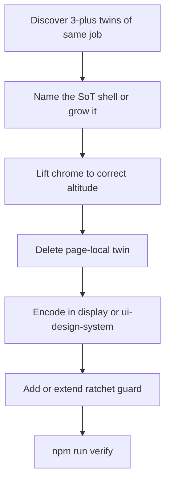
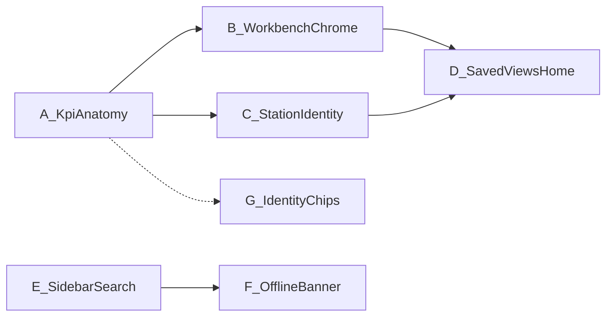

# Chrome SoT compound — house-wide upgrade plan

**Status:** Plan only (2026-07-30). No code in this doc.
**Lane:** current checkout — no ad-hoc branch.
**Product frame:** Cycle Forge multi-tenant reseller-ops SaaS. USAV is dogfood only.
**Reference ship (template):** Mode + Recents in `GlobalHeader`
([`header-mode-switcher-UNBOX-HANDOFF.md`](./header-mode-switcher-UNBOX-HANDOFF.md) — historical
pilot; house SoT is current in [`workbench.md`](../../.claude/rules/display/workbench.md)).

**Paste for a new session:**

> Read `docs/todo/chrome-sot-compound-PLAN.md` and start at §4 for the phase you are executing.
> Do not re-open §1–§2 decisions. Verify claims by **call sites**, not docblocks.

---

## 0. Verdict

The Mode + Recents move was not a one-off Unbox polish. It is a **reusable compound pattern**:

> **Chrome that answers “where am I / where can I go / what needs attention” lived at the wrong
> altitude, forked per page, while a named SoT already existed. Lift to the SoT, delete twins,
> encode in display law, ratchet with a guard.**

This plan inventories the next upgrades in that family, orders them by ROI and blast radius, and
defines done per phase so sessions do not invent a second visual language or leave both old and
new chrome live on the same route.

**Hard law (from the reference ship — do not weaken):**

1. **One control surface, not two.** When the SoT mounts, hide/delete the page-local twin.
2. **Compose → grow → compound.** Grow the SoT when it is wrong; never fork a page-local twin for
   the same job ([`pattern-evolution.md`](../../.claude/rules/pattern-evolution.md)).
3. **Nested facets stay local.** Pairing sort, sourcing status, FBA L3 plan pills, inventory triage
   filters, claim-wizard steps — not page L2 / not GlobalHeader Mode.
4. **`npm run verify` green before done.** Never raise a DS / knip baseline to pass.

---

## 1. The compound pattern (law)

| Step | What “good” looks like |
|---|---|
| Discover | ≥3 call sites (or 2 + a dormant twin) doing the same chrome job with divergent markup |
| Name / grow | Prefer an existing module (`KpiStrip`, `WorkbenchChromeHeader`, `StationContextBar`, …). Grow its API only when a sibling is stronger |
| Altitude | Shell that is always visible for the job (GlobalHeader, workbench header, Station bookmark, Monitor registry) — not a collapsed sidebar |
| Delete twins | File deleted or reduced to a thin data adapter; no dual chrome on one route |
| Law | One paragraph in the right `.claude/rules/display/*` or `ui-design-system.md` |
| Guard | File/path assertion or baseline-ratchet-down test (same spirit as `header-mode.guard.test.ts`) |

**Anti-pattern (do not plan these as “upgrades”):**

- Replacing nested facet sliders with header icons “for consistency.”
- Forcing Monitor 2×2 grid density onto Station floor strips that are horizontal filter bands.
- A second Mode/Recents language in the sidebar “because MasterNav used to.”

---

## 2. Decisions locked — do not re-open

| Decision | Verdict |
|---|---|
| L2 Mode + Recents altitude | **GlobalHeader** (`HeaderModeSwitcher` / `HeaderRecentsSwitcher`). Done. |
| Spine MRU chips | **Gone.** Recents = History icon only. Do not restore. |
| Page L2 rails in sidebar | **Gone** for modeful pages. Nested secondary sliders may remain. |
| KPI visual language | **One family:** `@/design-system/components/monitor` (`KpiTile` / `KpiStrip` / intent helpers). Domain files stay as **data + interaction adapters**. |
| Workbench lifecycle tabs | **`WorkbenchChromeHeader`** (see Walk-In / Outbound). Not a page-local pill band. |
| Display sort | **`QueueSortSwitch`** trailing quiet dropdown ([`workbench-sort-chrome.mdc`](../../.cursor/rules/workbench-sort-chrome.mdc)). |
| Station identity | **`StationContextBar` + `StationMoreDetails`** bookmark chrome. No second title row. |
| Detail overlays | **`GlobalDetailStackHost` + registry** — grow registry; do not invent a third slide-over host. |
| Sidebar search band | **`SidebarShell` owns search** — panels supply slots, never hand-position the 40px band. |
| Saved views | **One apply/storage core** (`useSavedViews` / server-backed polymorphic surface). Tabs ≠ saved views ([`workbench.md`](../../.claude/rules/display/workbench.md)). Chrome home TBD in Phase D — Ask-first if new GlobalHeader slot. |

---

## 3. Inventory (current codebase)

Verify each row by **call sites** before executing. Counts drift; paths are the durable truth.

### 3.1 Phase A — KPI strip consolidation (highest ROI)

| Adapter (keep as thin wrapper or fold) | Path |
|---|---|
| Outbound | `src/components/dashboard/OutboundKpiStrip.tsx` |
| Dashboard receiving | `src/components/dashboard/receiving/DashboardReceivingKpiStrip.tsx` |
| Pack | `src/components/packer/PackKpiStrip.tsx` |
| Shipping | `src/components/tech/shipping/ShippingKpiStrip.tsx` |
| Testing | `src/components/tech/testing/TestingKpiStrip.tsx` |
| Unbox | `src/components/receiving/unbox/UnboxKpiStrip.tsx` |
| Triage | `src/components/receiving/triage/TriageKpiStrip.tsx` |
| Incoming | `src/components/sidebar/receiving/incoming/IncomingKpiStrip.tsx` |
| Labels | `src/components/outbound/labels/LabelsKpiStrip.tsx` |
| Ready | `src/components/outbound/ready/ReadyKpiStrip.tsx` |
| FBA | `src/components/fba/FbaKpiStrip.tsx` |
| Sales / Walk-In | `src/components/walk-in/SalesKpiStrip.tsx` |

**SoT:** `src/design-system/components/monitor/KpiStrip.tsx`, `KpiTile.tsx`, `OpsKpiBand.tsx`,
`metricIntentTextClass` / `MONITOR_KPI_TILE_CLASS`.
**Golden composition:** `OutboundKpiStrip` + `OperationsAnalyticsView` (already Monitor tiles).
**Data SoTs to keep separate:** `outbound-metrics`, `shipping-metrics`, `testing-metrics`,
`unbox-metrics`, etc. — pure split/sort helpers stay; only chrome merges.

**Nuance (do not flatten blindly):**

- **Monitor observe** strips (Operations analytics, pure rollups) → `KpiStrip` grid is correct.
- **Workbench attention** strips (Outbound / Pack / Shipping) → horizontal filterable tile band is
  correct; they must still compose **`KpiTile`**, not invent a second gauge. Shared band layout
  helper (`AttentionKpiBand` or grow `OpsKpiBand`) is Ask-first once 2+ adapters share markup.

### 3.2 Phase B — Workbench chrome (tabs + sort)

| Job | SoT | Twin risk |
|---|---|---|
| Lifecycle / mode tabs in desk headers | `WorkbenchChromeHeader` via `walk-in/WalkInDeskHeader`, `dashboard/OutboundWorkspaceHeader`, many `*WorkspaceHeader.tsx` | Page-local `TabSwitch` / `HorizontalButtonSlider` as primary tab strip |
| Display sort | `QueueSortSwitch` + Labels trailing pattern | Solid `TabSwitch` beside search |

**Law already written:** `.cursor/rules/workbench-sort-chrome.mdc`, `workbench.md` (one tab strip).
**Work:** audit `*WorkspaceHeader*.tsx` + any remaining solid sort beside search; migrate or delete.

### 3.3 Phase C — Station identity + detail stack adoption

| Job | SoT | Twin risk |
|---|---|---|
| Active-entity identity under GlobalHeader | `StationContextBar` + `StationMoreDetails` (`station/entity-context/`) | `PaneHeader` title row above Station Workbench; custom sticky headers |
| Slide-over record detail | `GlobalDetailStackHost` + `src/lib/detail-stacks/registry.ts` | Page-local DocumentSlideOver / dialog stacks for the same entity jobs |

**Reference remounts already done:** Unbox, Testing, Shipping active-order, Support ticket focus,
Packer review (see agent-log). **Work:** finish remaining Station workbench surfaces; shrink
`STATION_WORKBENCH_ADOPTION_EXEMPT` if it still exists; no second identity bookmark recipe.

### 3.4 Phase D — Saved views chrome home

| Piece | Path / note |
|---|---|
| Hook | `src/hooks/useSavedViews.ts` — verify server vs localStorage by reading the hook + API, not `workbench.md` prose (doc may lag) |
| Faces today | `OutboundSavedViewsList`, `TableOptionsMenu` (⋮) |
| Deleted twin | `SavedViewsControl` (sidebar) — do not resurrect as a third face without deleting another |

**Ask-first:** whether generic surfaces get a GlobalHeader / workbench trailing control (same density
as Mode/Recents) vs staying inside table options. Tabs remain system lifecycle; saved views remain
operator facet combos (`workbench.md`).

### 3.5 Phase E — Sidebar search finish

| SoT | Guard |
|---|---|
| `SidebarShell` mounts `SidebarSearchBar` from `search` prop | `src/components/ui/sidebar-search-bar.guard.test.ts` |

**Work:** clear remaining hand-positioned search outside the shell until the guard reports zero
exceptions (or only documented escapes).

### 3.6 Phase F — Offline / connection banner

| Twin | Path |
|---|---|
| Station | `src/components/station/OfflineBanner.tsx` |
| Layout | `src/components/layout/OfflineBanner.tsx` |
| Mobile | `src/components/mobile/OfflineBanner.tsx` (uses external-store subscribe — stronger) |

**Work:** one online subscription SoT + density faces (Station floor vs mobile absolute). Delete
duplicate `navigator.onLine` listeners.

### 3.7 Phase G — One-row identity / chips (ongoing)

Presentation-kind SoTs (order identity, platform marks, copy chips). Grow named primitives when a
page invents a second fact-row recipe. Lower priority than A–F unless a live defect forces it.

### 3.8 Explicitly out of scope (nested / correct locals)

Leave in the sidebar or local header unless a later Ask-first says otherwise:

- Products pairing sort slider
- Sourcing status / facet filters
- FBA plan / combine L3 pills (`FbaSidebarRails`)
- Inventory triage filters
- Claim wizard / intake step sliders
- Studio zoom L0/L1/L2 (Canvas contract — not Workbench L2)

---

## 4. Phase map

| Phase | Goal | Depends | Est. session shape |
|---|---|---|---|
| **A** | One KPI tile language; thin adapters | None | 1–2 sessions; pilot Pack + Shipping → roll Outbound family |
| **B** | Headers + sort on WorkbenchChrome / QueueSortSwitch only | Soft: A (shared trailing density) | 1 session audit + migrate |
| **C** | Station bookmark + detail-stack adoption complete | None (parallel with A) | 1–2 sessions; exempt list → 0 |
| **D** | One saved-views chrome home; no third face | B (chrome slot decision) | Ask-first gate before code |
| **E** | Sidebar search only via SidebarShell | None (parallel) | Short; guard-driven |
| **F** | One offline subscription + faces | Soft: E (shell honesty) | Short |
| **G** | Chip/identity SoT growth | Opportunistic | Per defect / improve-ui |

**Parallelism:** A ∥ C ∥ E is safe. D waits on chrome-slot Ask-first. Do not open all phases in one
PR/session — each phase must leave **one** chrome language live.

---

## 5. Phase A — KPI strip consolidation (detail)

### 5.1 Goal

Every attention / rollup strip composes Monitor `KpiTile` (and shared band layout where horizontal).
Domain files own **fetch + metric pure functions + click-to-filter wiring** only.

### 5.2 Steps

1. **Baseline inventory** — for each adapter in §3.1, note: already on `KpiTile`? custom markup?
   Monitor grid vs horizontal band? click-to-filter?
2. **Extract shared band** (only if Pack / Shipping / Outbound share ≥15 lines of identical band
   chrome) — e.g. `AttentionKpiBand` next to `OpsKpiBand`, or grow `OpsKpiBand` with a `layout`
   prop. Ask-first if public API of monitor package changes.
3. **Pilot:** Pack + Shipping (already share `shipping-metrics` language) → prove adapter thickness.
4. **Roll** Unbox / Testing / Labels / Ready / Incoming / Triage / Sales / FBA / Dashboard receiving.
5. **Outbound** last or carefully — it is the golden attention strip; do not regress zoning
   (`splitOutboundAttention`) or URL filter parity with toolbar.
6. **Law:** add a short “Workbench attention strip” paragraph under
   [`monitor-rollup-blocks.md`](../../.claude/rules/display/monitor-rollup-blocks.md) or
   `workbench.md` — tiles from Monitor SoT; band layout may be Workbench-specific.
7. **Guard:** fail if a `*KpiStrip.tsx` under `src/components` imports neither `KpiTile` nor
   `KpiStrip` / `OpsKpiBand` (allowlist only documented escapes).

### 5.3 Done

- No second hero/eyebrow/delta visual language in strip files.
- Metrics pure modules unchanged in behavior (unit tests still green).
- Click-to-filter still shares URL hooks with toolbars where that contract exists today.
- `npm run verify` green.

### 5.4 Traps

- Collapsing horizontal attention bands into Monitor `KpiStrip`’s 2×2/4-col grid “for SoT purity”
  — wrong altitude for Station/Workbench queues.
- Moving metric SQL into components.
- Touching `DashboardAttentionStrip` zoning without reading its docblock (attention ≠ status mirror).

---

## 6. Phase B — Workbench tabs + sort (detail)

### 6.1 Goal

Every desk/workspace header that exposes **lifecycle or mode tabs** composes
`WorkbenchChromeHeader`. Display sort is only `QueueSortSwitch` (or Labels’ trailing twin in the
same slot).

### 6.2 Steps

1. Grep `*WorkspaceHeader*.tsx`, `TabSwitch`, solid sort beside search.
2. Classify each `HorizontalButtonSlider` / `TabSwitch`: **page L2** (illegal twin — should be
   header Mode), **lifecycle tabs** (WorkbenchChromeHeader), **nested facet** (keep).
3. Migrate lifecycle offenders; delete dead tab helpers.
4. Sort: migrate any solid sort to `QueueSortSwitch`; extend guard or
   `workbench-sort-chrome` coverage if needed.

### 6.3 Done

- No solid sort beside search on Workbench queues.
- No page-local primary tab band outside `WorkbenchChromeHeader` / documented Station section tabs.
- Verify green.

---

## 7. Phase C — Station identity + detail stacks (detail)

### 7.1 Goal

Scanner Station focus surfaces use bookmark identity (`StationContextBar` / `MoreDetails`); record
slide-overs go through `GlobalDetailStackHost`.

### 7.2 Steps

1. List Station workbench hosts still using `PaneHeader` as the primary identity.
2. Remount onto Unbox density=`bar` pattern (Shipping / Testing already reference).
3. Audit detail-stack registry vs page-local slide-overs for the **same entity types**; register or
   delete.
4. Shrink adoption exempt lists / guard baselines down only.

### 7.3 Done

- No dual title row (PaneHeader + bookmark) on adopted Stations.
- Exempt list empty or every remaining entry has a dated Ask-first reason.
- Verify green.

### 7.4 Traps

- Putting Workbench CRUD into Station bookmark chrome.
- Reusing `CartonContextCard` for non-carton entities — Support ticket identity correctly uses the
  bar’s `identity` slot with its own chip row.

---

## 8. Phase D — Saved views chrome home (detail)

### 8.1 Gate (Ask-first before code)

Choose **one** face for generic ops surfaces:

| Option | Shape | When |
|---|---|---|
| **D1** | Stay in `TableOptionsMenu` + outbound sidebar list | Lowest risk; already two faces of one hook |
| **D2** | Quiet GlobalHeader / workbench trailing control (Mode/Recents density) | If operators need views with sidebar collapsed — same argument that moved L2 |

Do **not** ship D1 and D2 together. Do **not** resurrect `SavedViewsControl` as a third face.

### 8.2 Steps (after gate)

1. Confirm storage SoT (server polymorphic vs residual localStorage) against live hook + migrations.
2. Implement the chosen face; delete the losing face’s chrome (keep hook).
3. Update `workbench.md` split-brain note to match reality.
4. E2E: apply / save / delete on one Workbench queue with sidebar collapsed if D2.

### 8.3 Done

- One apply core, ≤2 faces, documented boundary vs lifecycle tabs.
- Verify green.

---

## 9. Phase E — Sidebar search finish (detail)

### 9.1 Goal

`sidebar-search-bar.guard.test.ts` exceptions → documented zero (or ratchet-down only).

### 9.2 Steps

1. Read guard allowlist / failures.
2. Route each offender through `SidebarShell` `search` prop.
3. Delete hand-positioned absolute search bands.

### 9.3 Done

Guard green with no new escapes; verify green.

---

## 10. Phase F — Offline banner (detail)

### 10.1 Goal

One `subscribe` / snapshot SoT for online state; Station and mobile faces consume it.

### 10.2 Steps

1. Promote mobile’s external-store pattern (or shared `lib/offline/online-store.ts`).
2. Point Station + layout banners at it; keep density-specific markup.
3. Delete duplicate window listener setups.
4. Optional guard: at most one file calls `addEventListener('offline'` for banner purposes
   (store only).

### 10.3 Done

Single subscription; both shells show honest offline; verify green.

---

## 11. Phase G — Identity chips (light)

Opportunistic under `improve-ui` / defect pressure:

- Grow `OrderIdentityChips` / platform marks / copy-chip SoT rather than page-local chip rows.
- Prefer when a second consumer appears — do not boil the ocean.

---

## 12. Display / SoT doc updates (per phase)

| Phase | Update |
|---|---|
| A | `monitor-rollup-blocks.md` and/or `workbench.md` — attention strip composes Monitor tiles |
| B | Confirm `workbench-sort-chrome.mdc`; note any new header SoT path in `workbench.md` |
| C | `display/station.md` / `station-workbench` — adoption complete note |
| D | `workbench.md` saved-views storage + chrome-home verdict |
| E | `workbench.md` SidebarShell search paragraph (already exists — mark migration complete) |
| F | `display/station.md` OfflineBanner SoT path |
| — | Do **not** restate Mode + Recents — already house law |

---

## 13. Definition of done (whole program)

The program is done when:

1. Phases **A, B, C, E, F** are shipped and verify-green.
2. Phase **D** has an explicit Ask-first verdict (ship or decline) written into `workbench.md`.
3. No route mounts **two** chrome languages for the same job.
4. Each shipped phase left a **guard or law paragraph** so the twin cannot silently return.
5. Nested facet sliders (§3.8) remain local — not “cleaned up” into the header.

---

## 14. Session traps (read every time)

- **Docblocks lie.** `workbench.md` may still say localStorage for saved views after server migration.
  Grep call sites and the hook body.
- **Golden pages are not sacred pixels.** Outbound strip zoning is sacred **behavior**; markup may
  move to shared band helpers.
- **Don’t reverse Mode + Recents.** Sidebar L2 rails and spine MRU are closed.
- **Don’t raise baselines.** DS ratchets and knip only go down.
- **Concurrent WIP.** Unrelated dirty files (reconciliation, receiving resize, knip-baseline) are not
  this program — fix only what you touch or what blocks verify for your phase.
- **Never start the dev server.** Attach to `:3050`.

---

## 15. Related docs

| Doc | Role |
|---|---|
| [`header-mode-switcher-UNBOX-HANDOFF.md`](./header-mode-switcher-UNBOX-HANDOFF.md) | Reference ship (historical pilot → house SoT) |
| [`dashboard-ia-rework-HANDOFF.md`](./dashboard-ia-rework-HANDOFF.md) | Dashboard IA; saved-views / tabs boundary |
| [`dashboard-ia-rework-PLAN.md`](./dashboard-ia-rework-PLAN.md) | Why tabs vs views; do not re-litigate direction axis |
| [`.claude/rules/display/workbench.md`](../../.claude/rules/display/workbench.md) | L2 Mode + Recents, tabs vs saved views, SidebarShell |
| [`.claude/rules/display/monitor-rollup-blocks.md`](../../.claude/rules/display/monitor-rollup-blocks.md) | Monitor KPI registry |
| [`.claude/rules/pattern-evolution.md`](../../.claude/rules/pattern-evolution.md) | Compose / grow / Ask-first |
| [`.cursor/rules/workbench-sort-chrome.mdc`](../../.cursor/rules/workbench-sort-chrome.mdc) | Sort chrome |

---

## 16. Suggested first execution paste

> Execute **Phase A** of `docs/todo/chrome-sot-compound-PLAN.md` §5.
> Pilot Pack + Shipping onto shared Monitor `KpiTile` band chrome; do not change metric pure
> modules’ behavior; add a guard; update display law; `npm run verify` before claiming done.
> Do not touch Mode/Recents, saved views, or nested facet sliders.
