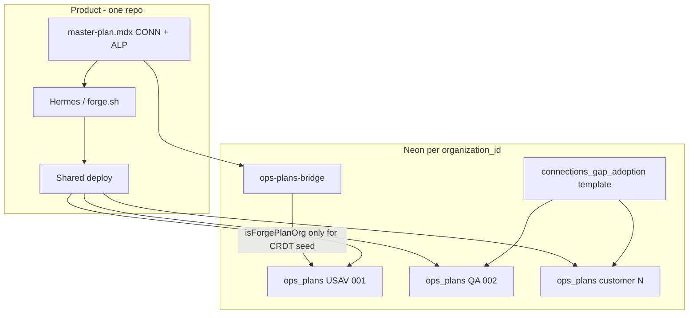

# Connections → MDX Forge + org-scoped `ops_plans`

> **Status:** Phase 1 **SHIPPED** (2026-07-12) — 74 `CONN-*` tickets in `master-plan.mdx`; extractor
> `scripts/extract-connections-mdx.mjs`; HTML deprecated mirror; unit/smoke tests green.  
> Phase 2 (adoption templates) still gated.  
> **Created:** 2026-07-11 · **Companion:** [`connections-mdx-forge-EXECUTION-PROMPT.md`](./connections-mdx-forge-EXECUTION-PROMPT.md)  
> **Source docs:** [`docs/master-connections-and-refactor/`](../master-connections-and-refactor/)  
> **Depends on (shipped):** agentic loop Phase 0–6 — [`agentic-loop-master-plan.md`](./agentic-loop-master-plan.md)

---

## 0. TL;DR

1. Convert the interactive connections HTML (and align with existing staff MD) into **`<TicketStatus />` tickets** inside repo-root **`master-plan.mdx`**.
2. Live view already works: `/forge` → Operations ▸ Plans `?view=live` (Yjs + Ably + `MasterPlanView`).
3. Org linkage uses the **existing** Neon hierarchy — there is **no `ops_goals` table**:

```
organization_id
  └── ops_plans
        └── ops_plan_phases (station)
              └── ops_plan_tasks (client_event_id)
                    └── ops_plan_task_links?
```

4. **USAV `#1`:** product tickets → Hermes ships shared code.  
   **QA `#2` / customers:** same deploy + **their own** adoption `ops_plans` (templates / claim-complete) — **never** a per-tenant codebase mutation loop.

---

## 1. Locked decisions (do not re-litigate)

| Decision | Lock |
|---|---|
| Live SoT for product tickets | `./master-plan.mdx` ↔ `Y.Text('content')` ↔ Ably `org:{forgeOrg}:forge:master-plan` |
| Ticket component contract | Only `<TicketStatus status="pending\|in-progress\|deployed" ticketId="…" href="…" />` + optional `<AgentLog />` — no new MDX components in Phase 1 |
| Ticket ID prefix | `CONN-*` (distinct from `ALP-*` / roadmap IDs) |
| Org goals store | `ops_plans*` only — never invent `ops_goals` |
| Bridge identity | Plan title `Agentic Loop — Master Plan`; task key `master-plan:{ticketId}` |
| Forge org | `USAV_ORG_ID` (`00000000-0000-0000-0000-000000000001`) via `FORGE_ORG_ID` / `isForgePlanOrg` |
| QA org | `QA_ORG_ID` (`…0002`) — isolation sandbox; **no dogfood MDX seed** |
| Staff narrative | Keep `staff/*.md` + `master-index-plan.md`; HTML becomes deprecated mirror after fold |
| Customer gap close | `PLAN_TEMPLATES` + `/api/ops-plans/from-template` + claim/complete — config/training only |
| Work branch | `main` only; no stash; no commit unless human asks |

---

## 2. Codebase map (deep scan — what already exists)

### 2.1 Source folder (not “many HTML files”)

| Path | Role |
|---|---|
| [`staff-connections-planning.html`](../master-connections-and-refactor/staff-connections-planning.html) | ~2k lines — **only** interactive HTML (Now/Change, Staff\|Tech, checkboxes) |
| [`staff/01`–`08`](../master-connections-and-refactor/staff/) + `INDEX.md` | Human 1-on-1 plans (already Markdown) |
| [`master-index-plan.md`](../master-connections-and-refactor/master-index-plan.md) | Technical SoT |
| [`README.md`](../master-connections-and-refactor/README.md) | Hub — update after fold |

**HTML tabs → staff docs:**

| `data-tab` | Staff doc | Check-id prefix |
|---|---|---|
| `start` | INDEX / overview | `start-*` |
| `big` | `01-big-picture.md` | `big-*` |
| `locations` | `02-inventory-and-locations.md` | `loc-*` |
| `tickets` | `03-testing-and-support-tickets.md` | `tix-*` |
| `journey` | `04-item-journey.md` | `jny-*` |
| `zoho` | `05-external-inventory-zoho.md` | `zoho-*` |
| `pickup` | `06-local-pickup.md` | `pk-*` |
| `pages` | `07-pages-and-design.md` | `pg-*` |
| `roadmap` | `08-roadmap-and-phases.md` | `rm-*` |
| `tech` | `master-index-plan.md` | `tech-*` |

### 2.2 Agentic / forge plane (shipped)

| Piece | Path |
|---|---|
| Live MDX | `master-plan.mdx` |
| Sync daemon | `.cycle_forge_ops/scripts/master-plan-sync-daemon.mjs` |
| Doc / seed gate | `src/lib/master-plan/server-doc.ts` (`forgePlanOrgId`, `isForgePlanOrg`) |
| Ticket parse/mutate | `src/lib/master-plan/ticket-status.ts` |
| Segments / render | `src/lib/master-plan/segments.ts`, `src/components/forge/MasterPlanView.tsx` |
| Live console | `src/components/forge/AgenticLoopLiveConsole.tsx` |
| `/forge` redirect | `src/app/forge/page.tsx` → Ops Plans live |
| Bridge | `src/lib/master-plan/ops-plans-bridge.ts` + `ops-plans-bridge-constants.ts` |
| Plan agent | `src/app/api/forge/chat/route.ts`, `PlanAgentChat.tsx` |

### 2.3 Ops plans plane (“ops goals”)

| Piece | Path |
|---|---|
| Migrations | `src/lib/migrations/2026-07-08c_ops_plans_core.sql`, `2026-07-08d_ops_plan_task_links.sql` |
| Drizzle | `src/lib/drizzle/schema.ts` (~4196–4279) |
| Domain | `src/lib/ops-plans/{queries,transitions,progress,templates,inbox,side-effects,constants}.ts` |
| APIs | `src/app/api/ops-plans/**` |
| UI | `PlansSidebar.tsx`, `OperationsPlansView.tsx`, `plans-shared.ts` |
| Realtime | `org:{uuid}:ops_plans:changes` → event `ops_plan.updated` |
| Template seed | `POST /api/ops-plans/from-template` ← `PLAN_TEMPLATES` |
| **Not** this domain | `staff_goals` (daily throughput) |

**Bridge write shape (already live):**

| MDX | Neon |
|---|---|
| File / CRDT | — |
| `## Section` with tickets | `ops_plan_phases` (`station='ADMIN'`, title=heading) |
| `<TicketStatus ticketId="X" />` | `ops_plan_tasks` title=`X`, `client_event_id=master-plan:X` |
| `pending` / `in-progress` / `deployed` | `open` / `in_progress` / `done` |
| Ticket removed from MDX | task `canceled` |

Plan find-or-create: title **`Agentic Loop — Master Plan`**, under **caller `organization_id`**.

---

## 3. Org model (product vs adoption)



| Org | Constant | Product MDX / Hermes | `ops_plans` role |
|---|---|---|---|
| `#1` USAV | `USAV_ORG_ID` | **Yes** — forge org | Bridge projects `master-plan:CONN-*` tasks |
| `#2` QA | `QA_ORG_ID` | **No** CRDT seed | Adoption / verify checklist only |
| Customers | signup UUIDs | **No** | Adoption via template / claim-complete |

**Rule:** If it changes Cycle Forge for everyone → `CONN-*` in `master-plan.mdx`.  
If it configures / trains **this** warehouse → `ops_plan_tasks` under **that** `organization_id`.

---

## 4. Phase 1 — Fold HTML gaps into `master-plan.mdx`

### 4.1 Ticket ID scheme

`CONN-{html-check-id}` (stable, 1:1 with HTML `data-check-id`).

Examples: `CONN-start-stories`, `CONN-loc-current`, `CONN-tix-fail`, `CONN-rm-p1-bins`.

### 4.2 Full inventory (HTML `data-check-id` → ticket)

**Start (`start-*`) — 9**

| check-id | Suggested title (short) | Staff href |
|---|---|---|
| `start-stories` | One shared Now→Change plan surface | `../master-connections-and-refactor/staff/INDEX.md` |
| `start-language` | Drift vs journey language | same |
| `start-progress` | Progress tracking in one place | same |
| `start-unit-facade` | Unit façade / `recordUnitEvent` hot paths | `../master-connections-and-refactor/master-index-plan.md` |
| `start-loc-dual` | Location dual SoT (TEXT vs bin FK) | `staff/02-inventory-and-locations.md` |
| `start-journey-tickets` | Journey ↔ tickets merge | `staff/04-item-journey.md` |
| `start-fail-ticket` | FAIL → ticket_links | `staff/03-testing-and-support-tickets.md` |
| `start-pickup-dual` | Pickup dual model | `staff/06-local-pickup.md` |
| `start-zoho-sync` | Zoho sync path via connector | `staff/05-external-inventory-zoho.md` |

**Big picture (`big-*`) — 6:** `big-mental`, `big-history`, `big-tickets`, `big-locations`, `big-erp`, `big-new-work` → `staff/01-big-picture.md`

**Locations (`loc-*`) — 8:** `loc-hierarchy`, `loc-rack`, `loc-current`, `loc-events`, `loc-transfers`, `loc-putaway`, `loc-sku-qty`, `loc-warehouse` → `staff/02-…`

**Tickets (`tix-*`) — 7:** `tix-registry`, `tix-resolver`, `tix-api`, `tix-ui`, `tix-fail`, `tix-serial`, `tix-nav` → `staff/03-…`

**Journey (`jny-*`) — 7:** `jny-spines`, `jny-facade`, `jny-api`, `jny-ui`, `jny-prov`, `jny-naming`, `jny-complete` → `staff/04-…`

**Zoho (`zoho-*`) — 6:** `zoho-mental`, `zoho-connector`, `zoho-sync-ux`, `zoho-schema`, `zoho-mirrors`, `zoho-provider` → `staff/05-…`

**Pickup (`pk-*`) — 6:** `pk-model`, `pk-surface`, `pk-journey`, `pk-lcpu`, `pk-sales`, `pk-parity` → `staff/06-…`

**Pages (`pg-*`) — 6:** `pg-archetypes`, `pg-surfaces`, `pg-rails`, `pg-nav`, `pg-inventory`, `pg-admin` → `staff/07-…`

**Roadmap (`rm-*`) — 12:** `rm-p0-docs`, `rm-p0-governance`, `rm-p1-bins`, `rm-p1-fail`, `rm-p1-pickup`, `rm-p1-ship`, `rm-p1-sync`, `rm-p2-chips`, `rm-p2-journey`, `rm-p3-inv`, `rm-p3-support`, `rm-p4-provider` → `staff/08-…`

**Technical (`tech-*`) — 7:** `tech-index`, `tech-connections`, `tech-unit-facade`, `tech-ledger`, `tech-poly`, `tech-transition`, `tech-ext-inv` → `master-index-plan.md`

**Total ≈ 74 tickets.** Do not paste full Staff|Tech dual prose into MDX — one Now → Change sentence pair + chip is enough; deep narrative stays in staff/tech MD via `href`.

### 4.3 MDX section shape (required)

Append after existing ALP / roadmap tickets in `master-plan.mdx`:

```mdx
## Connections — Start

Now: … · Change: …

<TicketStatus status="pending" ticketId="CONN-start-stories" href="/docs/master-connections-and-refactor/staff/INDEX.md" />

## Connections — 01 Big picture
…
```

Rules:

- One `##` heading per topic (bridge → one `ops_plan_phases` row each).
- Exactly one `<TicketStatus />` per check-id; status starts `pending` unless already shipped (mark `deployed` only with evidence).
- Prefer `href` paths that resolve under `/docs/...` the way existing ALP tickets do.
- Keep the file comment header SoT contract intact (status enum, sync daemon).

### 4.4 Doc / hub updates (Phase 1)

1. Update [`docs/master-connections-and-refactor/README.md`](../master-connections-and-refactor/README.md):
   - Primary live view = Operations ▸ Plans / `/forge` (bridged master plan).
   - HTML = deprecated mirror (keep file until Phase 1 verified; then optional delete in a later PR).
2. Optional one-liner in [`staff/INDEX.md`](../master-connections-and-refactor/staff/INDEX.md) pointing at live plan.
3. Index this plan in [`docs/todo/README.md`](./README.md).

### 4.5 Verify Phase 1

With sync daemon running (or after `GET /api/forge/master-plan` as forge-org user):

1. `/forge` opens live console; `CONN-*` chips render.
2. Operations ▸ Plans shows **Agentic Loop — Master Plan** with new phases.
3. DB (USAV): `ops_plan_tasks.client_event_id` like `master-plan:CONN-loc-current`.
4. `scanTicketStatuses(mdx)` returns all `CONN-*` with valid statuses.
5. QA org `#2` still has **no** dogfood MDX content when opened as that tenant.

### 4.6 Out of scope for Phase 1

- New MDX components (`<NowChange />`, Staff|Tech toggle)
- Checkbox localStorage from HTML
- Per-customer CRDT rooms
- Hermes implementing all 74 tickets in one run
- New migrations / new tables
- Changing `MASTER_PLAN_OPS_TITLE` or bridge key prefix

---

## 5. Phase 2 — Org adoption via `ops_plans` templates (after Phase 1)

### 5.1 Add template

In [`src/lib/ops-plans/templates.ts`](../../src/lib/ops-plans/templates.ts):

```ts
connections_gap_adoption: {
  templateKey: 'connections_gap_adoption',
  title: 'Connections gap adoption',
  description: 'Org checklist to adopt shipped connections capabilities (config + training — not product code).',
  phases: [
    { station: 'ADMIN', title: 'Governance & docs', tasks: [/* human tasks */] },
    { station: 'RECEIVING', title: 'Locations & receiving', tasks: […] },
    { station: 'TECH', title: 'Tickets & journey', tasks: […] },
    // …
  ],
}
```

Seed: `POST /api/ops-plans/from-template` with `{ templateKey: 'connections_gap_adoption' }` — stamps **session** `organization_id`.

### 5.2 Optional on-deploy upsert (later)

When a product `CONN-*` flips to `deployed`, idempotently upsert adoption tasks for **non-forge** orgs with `client_event_id = conn-adopt:{ticketId}` (must not collide with `master-plan:` prefix). Never call Hermes for those rows.

### 5.3 Closing adoption tasks

- Claim / complete via existing `/api/ops-plans/tasks/...` routes.
- Optional `ops_plan_task_links` to `work_assignment` / `inventory_event` / `manual` when floor proof exists.
- Progress: `ops_plan_progress(plan_id, org_id)` + Plans inbox.

### 5.4 What other orgs do **not** get

- Seeded dogfood `master-plan.mdx` content
- Automated PRs into `src/` because they checked a box
- A second forge daemon bound to their org

They get: **deployed product features** + **org-scoped plan tasks** (manual / config UI).

---

## 6. File touch list

| Phase | Files |
|---|---|
| 1 | `master-plan.mdx` (primary) |
| 1 | `docs/master-connections-and-refactor/README.md` |
| 1 | `docs/master-connections-and-refactor/staff/INDEX.md` (optional pointer) |
| 1 | `docs/todo/README.md` (index) |
| 1 optional | `.cycle_forge_ops/scripts/html-connections-to-mdx.mjs` (extractor — nice-to-have) |
| 2 | `src/lib/ops-plans/templates.ts` |
| 2 optional | bridge/job to upsert `conn-adopt:*` on deploy |
| Never Phase 1–2 | New `ops_goals` migration; second CRDT file; fork of `AblyProvider` |

---

## 7. Success criteria

### Phase 1

- [ ] All HTML `data-check-id` values have a matching `CONN-{id}` in `master-plan.mdx`
- [ ] Live `/forge` / Ops Plans shows chips; bridge tasks exist under USAV `organization_id`
- [ ] Hub README points to live plan; HTML marked deprecated
- [ ] `tsc` / existing master-plan unit tests still pass; no new invalid TicketStatus values
- [ ] QA `#2` does not receive dogfood MDX seed

### Phase 2

- [ ] `connections_gap_adoption` in `PLAN_TEMPLATES` + `from-template` works for a non-forge org
- [ ] Adoption tasks use that org’s `organization_id`; claim/complete works
- [ ] Docs state clearly: product = Hermes once; other orgs = adoption plans only

---

## 8. Risks & mitigations

| Risk | Mitigation |
|---|---|
| MDX file becomes huge (~74 tickets) | Short Now/Change lines; narrative stays in staff MD |
| Duplicate tickets if ALP already covers a gap | Prefer one SoT ticket; mark HTML-derived as `deployed` if already shipped, or cross-link in notes |
| Bridge phase spam (too many `##`) | One `##` per topic tab (~10 phases), not one per ticket |
| Accidental seed to QA | Keep `isForgePlanOrg` gate; do not widen seed |
| Hermes picks all CONN tickets at once | forge.sh already picks next `pending` — prioritize via ordering / leave low-priority pending |

---

## 9. Related docs

- [`agentic-loop-master-plan.md`](./agentic-loop-master-plan.md) — CRDT / forge contracts
- [`docs/roadmap/gap-closure-plan.md`](../roadmap/gap-closure-plan.md) — commercial gaps (distinct from connections spines)
- [`docs/second-tenant-onboarding-checklist.md`](../second-tenant-onboarding-checklist.md) — QA / tenant #2 verify
- Staff hub: [`docs/master-connections-and-refactor/staff/INDEX.md`](../master-connections-and-refactor/staff/INDEX.md)
