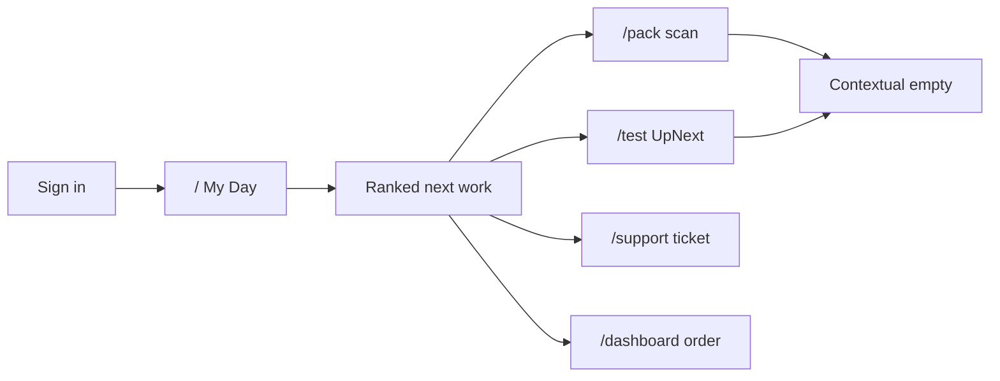

# Contextual My Day home — operator entry UX

**Status:** Proposal — **needs validation** (not scheduled for build)  
**Created:** 2026-07-11  
**Archetype:** Workbench for `/` (My Day); Station empty-states stay Station  
**Related:**
- [`studio-driven-operator-surfaces-refactor-plan.md`](./studio-driven-operator-surfaces-refactor-plan.md) — first-class `/pack`, `/test`, landing overrides
- [`onboarding-foundational-plan.md`](./onboarding-foundational-plan.md) — dashboard empty-states (O0)
- Activity inbox + work-order mine (shipped: `HeaderTopWorkOrderChip`, `ActivityInboxContext`)
- Staff pages intent: [`../master-connections-and-refactor/staff/07-pages-and-design.md`](../master-connections-and-refactor/staff/07-pages-and-design.md)
- Technical hub: [`../master-connections-and-refactor/master-index-plan.md`](../master-connections-and-refactor/master-index-plan.md)

> Save this doc to pressure-test with floor staff / leads before any implementation.
> Update this file’s **Validation log** as interviews and dogfood checks land.
> Before build: update technical §7 (if new cross-domain deps) **and** staff plan 07 Now/Change if operator-visible.

> ⚠️ **2026-08-01 — this doc's core premise is now stale; see Validation findings below.**
> `src/app/page.tsx` no longer redirects to `/dashboard` — Home has already been un-parked with a
> mode rail (`HomeWorkspace`), built by [`home-ops-tv-collab-surfaces-plan.md`](./home-ops-tv-collab-surfaces-plan.md),
> which explicitly claims to **absorb/supersede this doc for landing**. Read the findings before
> treating "Target UX §A" as the thing still to build.

---

## Verdict

A static “home with all work orders” is the wrong shape. 2026 warehouse/ops SaaS converges on:

1. **Personal ranked work** — “what should I do next?” across domains
2. **Deep stations stay scan-first** — packing / test / receive remain tools, not landing pages for everyone
3. **Empty states that explain context** — never a faint blank when the user has access but no role / work

Cycle Forge already has the building blocks; they are not composed into one entry surface:

| Building block | Where |
|----------------|--------|
| Top assigned work order | `GET /api/work-orders/mine` + `HeaderTopWorkOrderChip` |
| Cross-domain interrupts | `ActivityInboxContext` (tech queue, support followup, priority unbox, …) |
| Station “My work” scope | `?scope=mine` via `useStationStaffScope` |
| Role / per-staff landing | `signin/page.tsx` + `LandingPageCard` / `default_home_path` |
| Support console + pack Zendesk | `/support`, `PackZendeskSection` |

**Working product default (to validate):** `/` becomes **My Day for everyone**; specialists may still deep-land on `/pack` or `/test` via role / staff override; stations stop looking broken for cross-trained or mis-permissioned staff.

---

## Problem today

| Reality | Effect |
|---------|--------|
| `/pack` only requires a session; `packing.view` gates nav/APIs, not a human empty state | Cross-trained staff open Packing and see `"No packer records found"` |
| Packing is **scan-first history**, not an assignment queue | No “your assigned pack jobs” or “claim next” when idle |
| `src/app/page.tsx` hard-redirects to `/dashboard` | “Go home” ignores role landing and personal work |
| Role string `packer` ≠ permission `packing.view` | Access without identity → blank specialist UI |

Industry expectation: **permission ≠ assignment ≠ ready-to-work**. The UI must say which of the three applies.

---

## Target UX (to validate)

### A. My Day at `/` (primary entry)

One composition (workbench): ranked list → select → deep-link into the right station / order / ticket.

**Proposed sections (single scroll, not a KPI dashboard):**

1. **Do next** — top ranked item from `work-orders/mine` + urgency (must-go, SLA, support followup)
2. **Assigned to me** — work orders / pack + tech assignments (`assigned_packer_id` / `assigned_tech_id`)
3. **Needs attention** — Activity Inbox kinds already fetched
4. **Available queues** — only surfaces the user can act on (`packing.view`, `tech.view`, `dashboard.view`, `integrations.zendesk`, …) with counts + “Open queue”
5. **Idle / nothing for me** — teaching empty with permission-filtered claim / open links

Reuse, don’t rebuild: fold header WO chip data into the hero row; keep the chip as a persistent shortcut.

**Landing policy (proposed):**

- `/` → My Day (replace hard `/dashboard` redirect)
- Role defaults remain **optional deep landings** (packer → `/pack` still OK for high-volume specialists)
- “Go home” / not-authorized home → `/` (My Day), never raw `/dashboard`

### B. Station empty states (fix packing pain first)

On `/pack`, `/test`, and similar shells, replace faint italic empties with a **three-state** `EmptyState`:

| State | When | Copy / CTA direction |
|-------|------|----------------------|
| **Ready** | Has station assignment or is the role’s home; no active scan | “Scan an order to pack” / goal bar stays |
| **No work for you** | Has permission but no assignments and no week history | “Nothing assigned. View queue / My Day / Claim unassigned” |
| **Observer / wrong tool** | Has permission but `staff_stations` does not include that station (and not admin/supervisor) | “You’re not assigned to this station. Switch or open My Day” |

Use `EmptyState` (same teaching pattern as outbound first-run), not opacity-20 italics.

Optional: page-level `requirePermission` on operator surfaces that already declare `SURFACE_REGISTRY` permissions → `/not-authorized` instead of a hollow shell.

### C. Support is a lane in My Day, not a second home

Support tickets / voicemail stay at `/support`. My Day surfaces **assigned / follow-up** tickets (`support_followup` in Activity Inbox) as ranked interrupts with deep links — not a duplicate Support console on home.

---

## Implementation phases (only after validation)

### Phase 0 — Station honesty (ship first, small)

- Contextual empties on pack + test (and receiving if same faint pattern)
- Classify ready vs no-assignment vs not-my-station via `staff_stations` + `work_assignments` + week history
- CTA to My Day once it exists; until then `/dashboard` or role home
- Tighten page guards aligned with `SURFACE_REGISTRY`

### Phase 1 — My Day v1

- Route at `/` (or `/home` with `/` redirect) — workbench list
- Aggregator over existing endpoints (`/api/work-orders/mine`, inbox sources, or thin `/api/my-day`)
- Permission-filtered queue cards
- Sign-in fallback + “Go home” → My Day
- Keep `default_home_path` for specialists who want station-first

### Phase 2 — Claim / start

- “Start” deep-links into station with order preselected (tech UpNext already has Start; packing needs parity)
- Optional claim of unassigned work where APIs already allow assign
- Supervisor strip only if user has assign permissions — not the default floor home

### Out of scope

- Replacing `/dashboard` Orders / Shipping console
- New work-order data model (reuse `work_assignments`)
- AI “Insights what should I do” (rule-based ranking first)

---

## Key files (when building)

- `src/app/page.tsx` — stop blind `/dashboard` redirect
- New: `src/features/my-day/*` (+ route under `/` or `/home`)
- `src/components/packer/*` / Packer table — empty states
- Tech table / station empty paths
- `src/app/signin/page.tsx` — fallback landing
- `src/lib/neon/staff-stations-queries.ts` + work-order mine helpers
- `src/contexts/ActivityInboxContext.tsx`

---

## Success criteria (draft)

- Cross-trained staff with `packing.view` never land on a silent blank pack week
- After login (no override), staff see personal next work within one viewport
- Support followups appear beside pack / test assignments without opening `/support` first
- Specialists with `default_home_path=/pack` still get a useful ready-to-scan empty, not a void

---

## Validation findings — 2026-08-01 automated pass (repo audit)

Checked against current repo state. **Net: the premise is stale — the redirect problem this doc solves is already fixed, by a different, more-executed plan that doesn't share this doc's proposed shape. Everything else (building blocks, Packing empty-state gap) still holds.**

**Core premise — FALSE/stale.** `src/app/page.tsx` no longer hard-redirects to `/dashboard`; it mounts `HomeWorkspace` unconditionally, which already implements a mode rail (`today | inbox | tasks | collab | forge | brief`) — landed via `home-ops-tv-collab-surfaces-plan.md` Phases A–B (commits `2bf06953e` "HOME-OPS Phase A: Home mode rail + forge redirect", `1daf6eb73` "unpark Home..."), both **after** this doc's 2026-07-11 creation date. The "Landing policy" ask (`/` → My Day, not `/dashboard`) is done. **What shipped is not what this doc proposes**, though: Target UX §A describes a flat single-scroll list (Do next / Assigned to me / Needs attention / Available queues / Idle); what exists is a five/six-mode tab rail where "My Day" is one tab (`today`), not the whole page.

**Building blocks table — all CONFIRMED still accurate**, no drift: `GET /api/work-orders/mine` + `HeaderTopWorkOrderChip`, `ActivityInboxContext`, `useStationStaffScope` (`?scope=mine`), `signin/page.tsx` + `LandingPageCard`/`default_home_path`, `/support` + `PackZendeskSection` all exist as described.

**Problem-today claims — mostly still real, one exact quote stale.** The literal string `"No packer records found"` no longer exists anywhere in the repo (likely reworded since this doc was written), but the underlying anti-pattern is current and real elsewhere: `StationListTable.tsx` still renders `opacity-20 italic` faint empty text. Packing genuinely still has no assigned/claim UI, and the `packer` role vs `packing.view` permission mismatch is confirmed current.

**Phase 0 — the primitive already exists and is half-wired; this doc doesn't know it.** `ContextualEmptyState` (a real 3-state Ready/No-work/Observer component matching this doc's Phase 0 spec almost exactly) already shipped and is wired into **Testing** (`TechTable.tsx`) — but has zero call sites in `src/components/packer/*`. Phase 0 is therefore "wire an existing component into Packing," not "design and build a 3-state empty state" — meaningfully smaller than as written.

**Phase 1 (My Day v1) — consistent with sibling findings.** `/api/my-day` → `aggregateMyDayFeed` exists and is a thin aggregator as asked, but (per the daily-triage validation passes) has a closed 3-value interrupt union and zero filter params today.

**Cross-plan conflict — real, significant, one-directional awareness.** `home-ops-tv-collab-surfaces-plan.md` explicitly names this doc and claims to supersede it (its header: *"absorbs / supersedes for landing"*; its §21: *"Today = compose existing My Day, not rebuild"*) — and it is the plan that actually got built through Phase C. **This doc does not reference that plan at all** — its own "Related" list predates it and points elsewhere. Separately, a THIRD document (`daily-triage-FRONTEND-PLAN-VALIDATION.md`) proposes yet another reshape of the same `/` Today region (a categorized `TriageTask` board) on top of the same `MyDayWorkspace`/`aggregateMyDayFeed` surface this doc also targets. **Recommendation: mark this doc superseded/merged rather than schedule it as written** — its Phase 0 (Packing empty state) is still real, actionable, standalone work; its Phase 1/Target UX §A is not the shape to build, since a different, further-along plan already occupies that space.

---

## Validation backlog

Use this section to invalidate or harden the proposal before Phase 0.

### Questions to answer with real staff

| # | Question | Who | Result |
|---|----------|-----|--------|
| V1 | After clock-in, do you want **My Day** or jump straight to your station? | Packer, tech, receiver, cross-trained, lead | _open_ |
| V2 | When you open Packing with no jobs, what should the screen say / offer? | Packer + non-packer with `packing.view` | _open_ |
| V3 | Should support followups appear on My Day, or only the header inbox / `/support`? | Support-capable staff | _open_ |
| V4 | Is “claim unassigned” a floor behavior you want, or assignment-only (lead assigns)? | Ops lead | _open_ |
| V5 | Should supervisors see a different home (team queues) or the same My Day + assign strip? | Lead / admin | _open_ |
| V6 | Mobile: is `/m/home` (receiving feed today) wrong for packers/techs — replace with My Day mobile? | Mobile users | _open_ |

### Dogfood checks (no code)

- [ ] List every role’s current post-login destination (`ROLE_HOME` + staff overrides) and note who lands on an empty specialist page
- [ ] Screenshot pack / test empty week for a non-assigned staffer with view permission
- [ ] Trace one support followup: inbox → deep link — confirm My Day would not duplicate `/support`
- [ ] Confirm `work-orders/mine` ranking matches “do next” intuition for 3 real staff
- [ ] Decide: My Day for **everyone** vs **fallback only** when no `default_home_path` / role station

### Decision to lock before build

| Decision | Options | Locked choice |
|----------|---------|---------------|
| Who gets My Day as `/` | Everyone / fallback only / supervisors only | _unset — validate V1 + V5_ |
| Station-first overrides | Keep role + `default_home_path` | **Proposed keep** |
| Claim from My Day | Yes / assign-only | _unset — validate V4_ |
| Phase 0 before Phase 1 | Always | **Proposed yes** |

### Validation log

| Date | Who | Finding | Impact on plan |
|------|-----|---------|----------------|
| 2026-07-11 | Product / agent | Initial write from packing empty-state + landing audit | Proposal created |
| 2026-08-01 | Claude (automated repo audit) | Landing premise is stale (Home already un-parked via `home-ops-tv-collab-surfaces-plan.md`, which explicitly supersedes this doc); Phase 0's `ContextualEmptyState` primitive already exists and is wired into Testing but not Packing; a third doc (daily-triage frontend) also targets the same `/` Today region | Mark superseded for Target UX §A / Phase 1; keep Phase 0 (Packing empty-state wiring) as standalone actionable work; do not schedule the flat single-scroll layout against the shipped mode-rail `HomeWorkspace` |

---

## Open risks

- High-volume packers may hate an extra hop if My Day becomes mandatory `/` without override — mitigate with `default_home_path=/pack`
- Ranking wrong “do next” erodes trust faster than no home — start rule-based and narrow
- Page-level `requirePermission` may surprise staff who deep-link today — soft empty may be safer than hard gate in Phase 0
- Dual mobile + desktop My Day scope creep — validate V6 before designing `/m/home` rewrite
