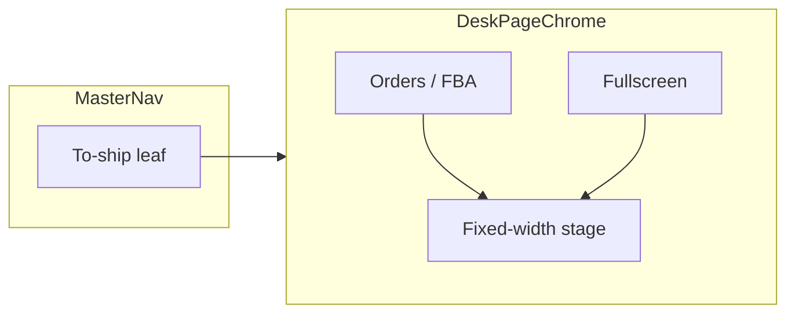

# Desk page chrome — in-page tabs + fixed-width stage (non-scan only)

**Status:** plan of record · **Written:** 2026-08-30 · **Branch:** `main`  
**Companion prompt:** [`desk-page-chrome-fixed-width-IMPLEMENTATION-PROMPT.md`](./desk-page-chrome-fixed-width-IMPLEMENTATION-PROMPT.md)  
**Fix / restructure execution (rails fighting the stage):** [`shipping-desk-fixed-width-FIX-IMPLEMENTATION-PROMPT.md`](./shipping-desk-fixed-width-FIX-IMPLEMENTATION-PROMPT.md) — remove Labels recent rail + right Recent overlay; constrain stage height; desk tabs only.  

**Scope of this plan only:** move sibling pages out of the **spine/nav dropdown** into **in-page tabs**, and put mouse/keyboard **data-table desks** on a **fixed-width guttered stage**.  

**Not in this plan:** caged→released, Add/triage forms, documents, shipping buy, slot-column binding. Those stay in [`non-scan-desk-chrome-caged-release-PLAN.md`](./non-scan-desk-chrome-caged-release-PLAN.md) (which should **compose** this chrome, not re-specify it).

---

## THIS SHIP

**Verify on To-ship first.** Pattern must be generic for every later **non-scan** desk.

| Must be true | Must stay true |
|---|---|
| Spine L1 is a **flat display name** (e.g. To-ship) — **no child dropdown** for that desk’s modes | **Scan stations stay edge-to-edge** (Unbox, Arrival/Triage, Testing, Packing, Scan out, …) |
| Former nav children become **website-style page tabs** inside the desk | Desk tables are **not** full-bleed by default |
| Desk stage = **fixed max width + gutters/padding** for alignment | Fullscreen expand (optional but recommended) is the only way to reclaim max width |

---

## 0. The split (hard law)

```text
SCAN STATIONS          →  edge-to-edge middle measure (today’s station shell)
                          mouse is secondary; scan + density win
                          SoT: STATION_WORKBENCH_* / scan-station edge-measure guards

NON-SCAN DESKS         →  fixed-width stage + gutters + in-page tabs
                          mouse + keyboard triage (data tables, boards)
                          SoT: this plan / DeskPageChrome
```

**Why:** Edge-to-edge is correct when the operator is scanning at a station. It is wrong when the operator is **triaging a spreadsheet-like queue** — gutters and a stable content measure make columns, headers, and padding align and reduce eye travel against the warehouse chrome.

Do **not** reuse [`STATION_WORKBENCH_LOCK_PX`](src/lib/station/workbench-layout.ts) (720 floor for scan centers) as the desk max-width. Desk uses a separate constant (e.g. `DESK_STAGE_MAX_PX`) sized for Mac-class laptop workbench viewing.

---

## 0.1 Refactor method (locked — do not big-bang)

**Do not** “build To-ship fixed-width, delete every other desk/shell fork, and import all pages into the To-ship component.” That turns To-ship into a junk drawer, mixes unrelated domain UIs (FBA board internals, Inventory, Sales, …), and risks touching scan stations.

**Do this instead: extract → dogfood → wrap → delete only chrome forks.**

```text
1. EXTRACT   DeskPageChrome + DESK_STAGE_MAX_PX
             (tabs band + fixed/fullscreen stage — no domain tables inside)

2. DOGFOOD   Mount chrome on To-ship ONLY
             Tab bodies = EXISTING surfaces passed as children
             (Orders grid stays where it lives; FBA board stays where it lives)

3. FLATTEN   Spine children for that L1 → page-tab config
             (nav stops duplicating what the page already tabs)

4. PORT      Next non-scan desk: wrap with same chrome + its own tab map
             One desk per change set after To-ship sign-off

5. DELETE    Only duplicate CHROME (ad-hoc max-w wrappers, second tab chip rows,
             spine children that mirror page tabs)
             NEVER delete scan-station shells
             NEVER merge foreign domain tables “into” To-ship
```

| Move | Verdict |
|---|---|
| Shared chrome SoT, To-ship first consumer | **Yes** |
| To-ship as host that owns every other page’s body | **No** |
| Delete scan-station edge-to-edge code | **No** |
| Later desks import `DeskPageChrome` and keep their own table/board modules | **Yes** |

To-ship is the **verification surface** and **first adopter**, not the **monorepo for all desks**.

---

## 1. Vocabulary

| Term | Meaning |
|---|---|
| **Scan station** | Floor scan workbench under Scan Stations / station kind — **edge-to-edge forever** in this plan |
| **Non-scan desk** | Mouse/keyboard triage surface (To-ship, Sales board, Operations modes, Inbound grids, Inventory, …) |
| **Spine L1** | MasterNav top label — for opted-in desks: **leaf only**, no nested children |
| **Page tabs** | In-page tab strip (Orders · FBA · …) — URL-deep-linkable |
| **Desk stage** | Content frame hosting the table/board — default fixed max-width + horizontal gutters |
| **Fullscreen stage** | Optional: stage fills the content canvas (still inside WarehouseShell) |

---

## 2. Navigation → in-page tabs

### 2.1 Anti-goal vs goal

| Anti-goal | Goal |
|---|---|
| Click To-ship → spine expands children | Click To-ship → land on desk with **page tabs** |
| Modes live only as nav children | Modes live as **tabs in the page** |
| Different desks invent different chip rows | Shared **DeskPageChrome** tab band |

### 2.2 To-ship v1 (verification surface)

| Spine | Page tabs (inside desk) |
|---|---|
| **To-ship** (single L1) | **Orders** · **FBA** (minimum). More tabs later by checklist. |

URL must carry the active tab (query or path — one SoT). Refresh and deep links restore the same tab.

### 2.3 Adoption rule (any desk)

For a desk that today has `children` on [`SIDEBAR_PAGE_NAV`](src/lib/sidebar-navigation.ts) / page nav:

1. Mark the L1 as **desk-chrome opted-in** (flat spine).  
2. Map each former child → a **page tab** `{ id, label, href|params, body }`.  
3. Mount bodies inside `DeskPageChrome` — **do not** leave duplicate spine children.  
4. Scan-station entries (**never** opt in): Unbox, Arrival, Testing, Packing, Scan out, and other `kind: 'station'` / floor scan surfaces that use station edge-measure.

Home / Operations / Sales / Inbound **may** opt in after To-ship — one desk per change set after sign-off.

### 2.4 What stays in the spine

- L1 display names (To-ship, Inventory, …)  
- Scan Stations group and its station leaves (edge-to-edge)  
- Top utilities (Search, Settings, …) unchanged  

**Not** in the spine for opted-in desks: mode children that are really “pages of the same desk.”

---

## 3. Fixed-width stage (non-scan)

### 3.1 Default

- Content stage: `max-width: DESK_STAGE_MAX_PX`, **centered** in the warehouse content column.  
- Horizontal **gutters/padding** outside the stage so the table does not kiss the shell edges.  
- Inside the stage, the DataTable / board may scroll horizontally if columns exceed the stage — the **page** does not go full-bleed by default.  
- Vertical: stage fills available height; table scrolls inside (existing patterns).

### 3.2 Fullscreen (recommended in same chrome)

- Control: top-right of desk chrome.  
- Expands stage to full content canvas width (gutters collapse).  
- Exit restores fixed width.  
- No geometry layout animations (instant class / CSS). Interaction ≤1 click each way.

### 3.3 Explicit non-goals for width

- Do not make scan stations fixed-width.  
- Do not remove scan-station edge-measure guards / CI ratchets.  
- Do not invent a third measure token that fights both SoTs.

---

## 4. Component shape

```text
DeskPageChrome
  ├─ tab band: [ tab … tab ]     (optional right slot — empty in THIS plan)
  ├─ stage header: [ title/meta ]  [ fullscreen ]
  └─ stage: fixed-width | fullscreen
        └─ children (Orders grid | FBA board | …)
```

- Tabs + stage geometry are **data props**. No `if (route === '/dashboard')` inside chrome for width.  
- Optional right slot on the tab band is **out of scope here** (Add CTA belongs to the caged-release plan). This plan may leave the slot unused/`null`.



---

## 5. Phased delivery

### Phase 1 — Shell + To-ship

- Introduce `DESK_STAGE_MAX_PX` + `DeskPageChrome`.  
- Mount on To-ship / outbound orders desk only.  
- Flatten To-ship spine children → Orders | FBA page tabs.  
- Default fixed width + gutters; fullscreen toggle.  
- Assert scan stations still edge-to-edge (no DeskPageChrome import).  
- `npm run verify`.

### Phase 2 — Propagation checklist (after To-ship sign-off)

For each non-scan desk with nav children: flatten L1 → page tabs → same chrome. One desk per PR.

### Out of this plan

- Add button, triage forms, caged/released  
- Slot metadata columns  
- Changing scan-station layout  

---

## 6. Success criteria

1. To-ship: spine shows one label; Orders/FBA are **in-page tabs** with URL restore.  
2. Default To-ship grid sits in a **fixed-width guttered** stage — not edge-to-edge.  
3. Fullscreen (if shipped) expands stage for max viewing; exit restores gutters.  
4. Unbox (and peer scan stations) remain **edge-to-edge**; edge-measure guards still pass.  
5. Next desk is a checklist port of the same chrome.

---

## 7. Related docs

| Doc | Relationship |
|---|---|
| [`non-scan-desk-chrome-caged-release-PLAN.md`](./non-scan-desk-chrome-caged-release-PLAN.md) | **Composes** this chrome; owns Add CTA + release gates |
| [`slot-based-metadata-table-PLAN.md`](./slot-based-metadata-table-PLAN.md) | Grid inside the Orders tab body |
| Scan-station edge measure | [`station-workbench-chrome-config.ts`](src/components/station/workbench/station-workbench-chrome-config.ts) Guard I — **do not weaken** |
