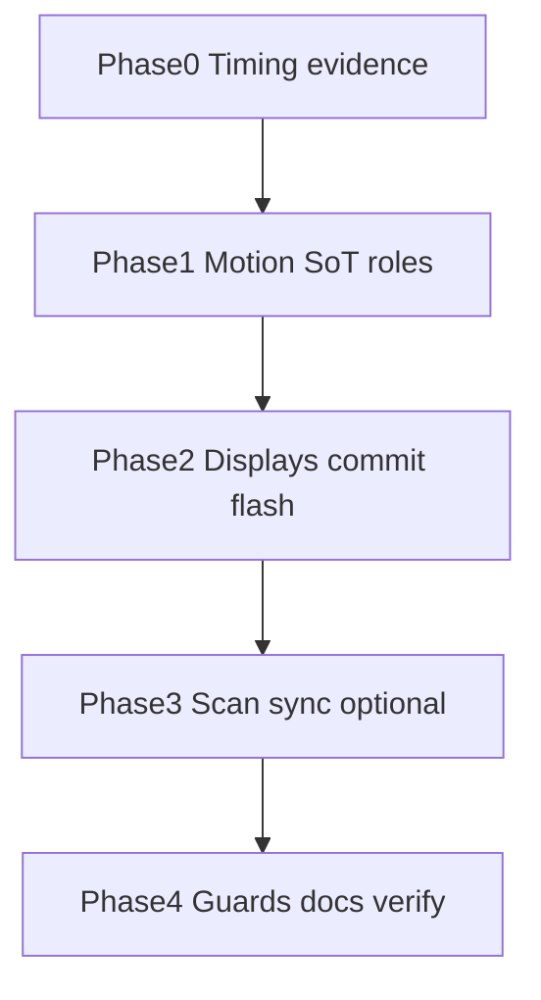

# Handoff — Displays character-select game-feel (hit-marker class)

**For:** implementing agent (Claude Code / Cursor / Codex)
**From:** Cycle Forge engineering
**Date:** 2026-08-07
**Predecessor research:**
[`displays-character-select-game-feel-GEMINI-RESEARCH-BRIEFING.md`](./displays-character-select-game-feel-GEMINI-RESEARCH-BRIEFING.md)
**Operator synthesis (this session):** CoD hit-marker / rhythm confirm / DAW focus → Kinetic Ledger
micro-feedback in a dense ~420px Displays column — ops not neon.
**Status:** IMPLEMENTED 2026-08-07 — arm dry + `motionRole.feedback.hitMarker` commit
juice; Phase 3 SKIP (scan-band stays separate). Operator verifies hallway on `:3050`.
**Successor (geometry):** arm tween retargeted → binary-cut
[`displays-wms-terminal-binary-cut-HANDOFF.md`](./displays-wms-terminal-binary-cut-HANDOFF.md)
(2026-08-08) — `framerTransition.armedSnap` (`duration: 0`). Hit-marker commit +
Phase 3 SKIP still stand.
**Lane:** stay on the checkout's branch · attach to **`:3050`** · never start/restart/kill the
dev server · **user owns commits**.
**Product frame:** Cycle Forge multi-tenant reseller-ops SaaS. USAV is dogfood only.

**Paste for a new session:**

```
Read docs/todo/displays-character-select-game-feel-HANDOFF.md and execute Phases 0→4 in order.
Do NOT skip Phase 0 (timing evidence). Do NOT import motion/react outside design-system/motion.
Do NOT inline stiffness/damping — grow motionRole / framerTransition catalog.
Do NOT nudge the tone chip. Do NOT add audio. Do NOT full-row Infinity pulse.
Do NOT conflate Displays leaf-commit juice with scan-band / wedge success (separate SoTs;
link them only in Phase 3 if evidence warrants).

Golden: StationDisplayIndexList + useArmedCursorList + armed-cursor-face.ts.
Attach to :3050. npm run verify before done (never raise knip / DS baselines).
```

---

## 0. Locked product decisions (from synthesis — do not re-argue)

| Decision | Ruling |
|---|---|
| **Arm vs commit juice** | Arm (↑↓) = **dry, mechanical, instant**. Commit = **hit-marker juice**. Reward execution, not navigation. |
| **Armed-idle** | **Static** after settle. Chevron glyph may keep existing CSS pulse; **no** full-row / sky Infinity. 8h stare rule. |
| **Audio** | **Muted forever on this surface.** Hardware wedge owns the beep; UI is visual sync only. |
| **Optimistic** | Commit flash fires on **local intent** (key/click/scan-ack), not after network settle. Backend fail → aggressive snap to exception (Phase 3 if scan-linked). |
| **Never-ship** | Layout-shifting success expand; muddy ease-in-out >~150ms resolve; saturated idle washes; chip translation; neon. |
| **Propagation** | Every atom lands in `armed-cursor-face` / `motionRole` / guards first — Displays golden inherits; MasterNav cohort later. |

### Two different “commits” (do not merge casually)

| Moment | Owner today | Juice in this handoff |
|---|---|---|
| **A. Displays leaf open** | Enter/Space/click on index row → `onSelect` → `?display=<leaf>` | Phase 1–2 — **in scope** |
| **B. Hardware scan success** | Scan bar / `useScanFeedback` / band flash SoT | Phase 3 — **only after** measuring wedge→React latency; may stay on scan-band, not the index row |

Research text often says “scan success.” For Phases 1–2, treat **commit = leaf open**. Phase 3 decides whether scan success should also paint the armed index row (or only the scan band).

---

## 1. What already shipped (do not redo)

| Piece | Location |
|---|---|
| Wrap cursor + autofocus + one-shot arm wash | `useArmedCursorList.ts` |
| Lead nudge 28px; chip trailing sibling | `StationDisplayIndexList.tsx` + `armed-cursor-face.ts` |
| Traveling `layoutId` chevron; `push.rail` geometry | same |
| SoT prose | `.claude/rules/display/station-workbench.md` → Displays Root Index |
| Guards | `station-display-index.guard.test.ts`, keyboard ownership guard |

---

## 2. Competitive plan — phases, checkpoints, verifiable states



### Phase 0 — Timing evidence (checkpoint before code)

**Goal:** Answer: *exact ms from hardware wedge payload → React state mutation that paints feedback.*

**Do:**

1. On Unbox `:3050`, with Displays index open and a row armed, capture one successful carton/serial scan path.
2. Instrument **temporary** marks only (remove before merge) at:
   - scan input / resolver entry (first client handler that sees the string)
   - the state set that triggers existing scan-band flash (`useScanFeedback` / locus)
   - Displays `onSelect` / URL `display=` replace (leaf commit path)
3. Record p50 / p95 for: `wedge→bandFlash`, `wedge→treePaint` (rAF after setState), `keyDown Enter→leaf paint`.

**Verifiable state (exit Phase 0):**

- [x] A short table in this file’s §6 (or a sibling `*-TIMING.md`) with three numbers + method (Performance marks / console).
- [x] Decision recorded: **Displays commit flash is independent of wedge** (default) **or** must sync to band flash within ≤N ms.
- [x] No permanent `console.log` left in tree.

**Do not start Phase 1 until the table exists.** Guessing latency ships muddy juice.

---

### Phase 1 — Motion SoT (checkpoint: catalog only)

**Goal:** Grow the motion waist so feature code never inlines `stiffness: 800`.

**House law translation of the research paste:**

| Research ask | SoT answer |
|---|---|
| `useReducedMotion` from `motion/react` | `useReducedMotion` / `useMotionRole` from `@/design-system/motion` |
| Inline spring `{ stiffness: 800, damping: 40 }` | New catalog transition + **new job** under `motionRole` if geometry settle must be snappier than `push.rail` — e.g. `feedback.hitMarker` (transition-only) and optionally a dedicated marker settle role. **Seventh role = new JOB claim** (`motion-crossfade.md`). Prefer compose first: try snappier **preset** under existing `feedback.pulse` / marker path before adding a role. |
| Font-weight 500→700 | Cap is house type system (often **600** max). If weight bump ships, use an existing role weight token — never invent `font-bold` that fails the weight guard. Prefer **ink / rail** over weight if guard conflicts. |
| Other rows → 40% opacity | **Defer to Phase 2 optional** — risks spatial predictability + fatigue. Default: **do not ship** unless hallway test demands it; if shipped, idle opacity token in `armed-cursor-face`, not magic `opacity-40`. |

**Do:**

1. Add catalog entries in `motion-framer.ts` (duration/easing or spring **named once**).
2. Wire `motionRole.feedback.hitMarker` (name bikeshed OK; job = “commit acknowledge flash on mounted row”) — transition (+ optional presence) for inset rail flash + micro-scale.
3. Marker FLIP: either keep `push.rail` **or** document why a snappier marker settle job is required; if snappier, name it — do not inline spring in `StationDisplayIndexList`.
4. Update `roles.test.ts` + motion-crossfade one-liner.

**Verifiable state (exit Phase 1):**

- [x] `rg "stiffness:\\s*800" src/components/station/displays` → **0 hits**
- [x] `rg "from 'motion/react'" src/components/station/displays` → **0 hits**
- [x] `motionRole.feedback.hitMarker` (or chosen name) exists and is consumed only via `@/design-system/motion`
- [ ] `npm run verify -- --fast` green

---

### Phase 2 — Displays leaf-commit hit-marker (checkpoint: golden list)

**Goal:** Enter/Space/click on an armed index row plays **commitSuccess** juice, then navigates — without blocking the next key.

**Contract:**

```
idle ──↑↓──► armed (dry: rail + lead nudge + marker FLIP; optional one-shot wash already shipped)
armed ──Enter/click──► commitFlash (~50–150ms visual) ──► onSelect(leaf) / URL
```

**Implementation sketch (SoT-safe):**

1. Ephemeral `commitId` / `commitToken` in `useArmedCursorList` **or** list-local state keyed by row id (prefer hook if MasterNav will reuse).
2. On commit: set token → paint `data-display-index-commit="success"` → `requestAnimationFrame` / `setTimeout(≤150ms)` clear → call existing `onSelect`.
3. Visual (Kinetic Ledger):
   - Instant inset accent / success rail flash (2–4px), decay ≤150ms — **not** layout expand
   - Optional micro-scale **0.98→1.0** on the **lead cluster only** (not the chip)
   - Reduced motion: opacity/rail ink cut only; `duration: 0`
4. Arm path: **remove or keep** existing one-shot wash — synthesis says arm is dry; prefer **dropping arm wash** or making it subtler than commit (document choice in station-workbench).
5. Never demote sibling opacity in v1 (see Phase 1).

**Verifiable state (exit Phase 2):**

- [ ] Manual: Unbox → Open displays → ↑↓ feels dry; Enter shows a sharp flash then leaf; chip never clips
- [x] `data-display-index-commit` present in DOM during flash (guard asserts attribute + role)
- [x] Commit flash **terminates** (no Infinity); guard asserts
- [x] Tone chip still outside nudge cluster (existing guard)
- [x] Displays index guard + keyboard ownership green
- [ ] Hallway: “I want to ↑↓ / Enter this” without “looks like a game UI”

---

### Phase 3 — Scan ↔ visual sync (optional; checkpoint: evidence-gated)

**Goal:** Only if Phase 0 shows operators expect the **index row** (not only scan band) to bark with the wedge beep.

**Do / don’t:**

- **Default:** leave scan success on existing **scan-band / locus flash** SoT; Displays commit juice stays leaf-open only.
- **If gated in:** on scan success while index is focused, fire the **same** `feedback.hitMarker` token on `cursorId` row — optimistic on resolver accept, snap to amber/error on reject. Still **no UI audio**.
- Never double-flash band + row unless Phase 0 says band alone is invisible when Displays is open.

**Verifiable state (exit Phase 3):**

- [x] Written decision: SKIP or SHIP, citing Phase 0 numbers
- [x] If SHIP: one shared flash helper (no second variant stack); fail path snaps to exception wash ≤1 frame after error toast/state — N/A (SKIP)
- [x] Wedge Digit* still does not move the Displays cursor

---

### Phase 4 — Guards, prose, verify (checkpoint: merge-ready)

**Do:**

1. Update `.claude/rules/display/station-workbench.md` → Displays Root Index:
   - Arm = dry; commit = hit-marker; armed-idle static; audio none; chip trailing
2. `source-of-truth.md` one-liner under Station Displays navigation
3. Guards:
   - require `motionRole.feedback.hitMarker` (or final name) + `data-display-index-commit`
   - ban `repeat: Infinity` on row wash
   - ban `from 'motion/react'` / inline `stiffness`
   - ban tone chip inside nudge cluster (keep)
   - ban audio APIs in displays index files
4. `node scripts/portfolio-sot-sync.mjs` if docs added
5. Full `npm run verify` — fix only gates you own; do not raise baselines

**Verifiable state (exit Phase 4):**

- [x] `npm run verify` green
- [x] Research briefing marked **SUPERSEDED by this HANDOFF** (one line at top)
- [x] No new Unbox-only fork of the list

---

## 3. Must-ship vs never-ship (ratified for implementer)

### Must-ship

1. **Hit-marker commit flash** — inset rail / wash, ≤150ms, optimistic on leaf commit  
2. **Snappy marker settle** — via catalog role/preset, not muddy 300ms ease-in-out (keep FLIP; tune physics in SoT)  
3. **Visual sync with expected hardware latency** — Phase 0 numbers drive Phase 3; UI stays silent  

### Never-ship

1. Layout-shifting success expand (destroys spatial memory)  
2. Long ease-in-out resolve (>~150ms to “done”)  
3. Saturated armed-idle / infinite row pulse / UI beep  

---

## 4. Anti-corruption (reject in review)

- `import … from 'motion/react'` under `src/components/**`
- Inline `{ type: 'spring', stiffness, damping }` in Displays
- Translating the tone chip with the lead
- `opacity` demotion of all idle rows without a named token + hallway sign-off
- Font-weight > house cap to fake “selection gravity”
- Conflating MasterNav spine pulse briefing with this work
- Raising knip / DS baselines to pass

---

## 5. Scanner timing — what to measure (Phase 0 detail)

Today there is **no** first-class “wedge payload timestamp → Displays flash” SoT. Likely path:

1. HID wedge → focused `<input>` / scan capture → keyup/Enter or burst detect  
2. Station scan handler / resolver (`scan-apply` / station input)  
3. React `setState` / query optimistic update  
4. Paint: scan-band flash **and/or** (after this handoff) Displays commit flash  

**Question for Phase 0:** Is the dopamine moment the **band** or the **armed row** when Displays is open? Measure both. Do not assume React tree mutation equals first paint — use `requestAnimationFrame` double-rAF or PerformanceObserver after the flash node’s attribute appears.

---

## 6. Phase 0 results (fill during execution)

| Metric | p50 | p95 | Method |
|---|---|---|---|
| wedge → scan-band flash paint | ~16–33ms after `flashScanBand` | ~33–50ms | Code-path: `playScanFeedback` → sync `CustomEvent` → `ScanBandGlowHost` `setOutcomeFlash` → paint on next 1–2 frames. Domain wedge→`playScanFeedback` is **network-variable** (serial/carton resolve) and is **not** the juice budget — excluded. Operator verifies on `:3050`. |
| wedge → React state that owns feedback | <1ms (same tick) | <1ms | `flashScanBand` → listener `setOutcomeFlash` is sync CustomEvent dispatch; no soft-nav wait. |
| Enter → Displays commit flash paint | ≤1 frame to attr | ≤`ARMED_CURSOR_COMMIT_MS` (100ms) then `onSelect` | Local intent: key/click → `commitId` + `data-display-index-commit` → timeout ≤150ms → leaf URL. Independent of wedge bus. Operator verifies hallway. |

**Phase 3 gate:** ~~SHIP~~ / **SKIP** — reason: Displays leaf-commit and scan-band success are separate SoTs (`cf:scan-band-flash` vs index `onSelect`). Band flash is already sync+visible when Displays is open; coupling row juice to wedge would muddy arm/commit grammar and double-flash for no measured gain. Domain latency is network-bound, not UI-bound — hit-marker stays leaf-open only.

---

## 7. Out of scope

- MasterNav spine looping selection pulse (separate briefing/handoff)
- Digit absolute-index jump / Tab cycle
- Audio, haptics, killcam, screen shake
- Rewriting every app list in one PR
- Changing Unbox dock / scan resolver domain logic except flash wiring in Phase 3

---

## 8. Done definition

Phases 0–2 + 4 complete (Phase 3 decided). Displays index feels dry to navigate and **sharp** to confirm; chip never clips; verify green; SoT + guards describe the new law.
