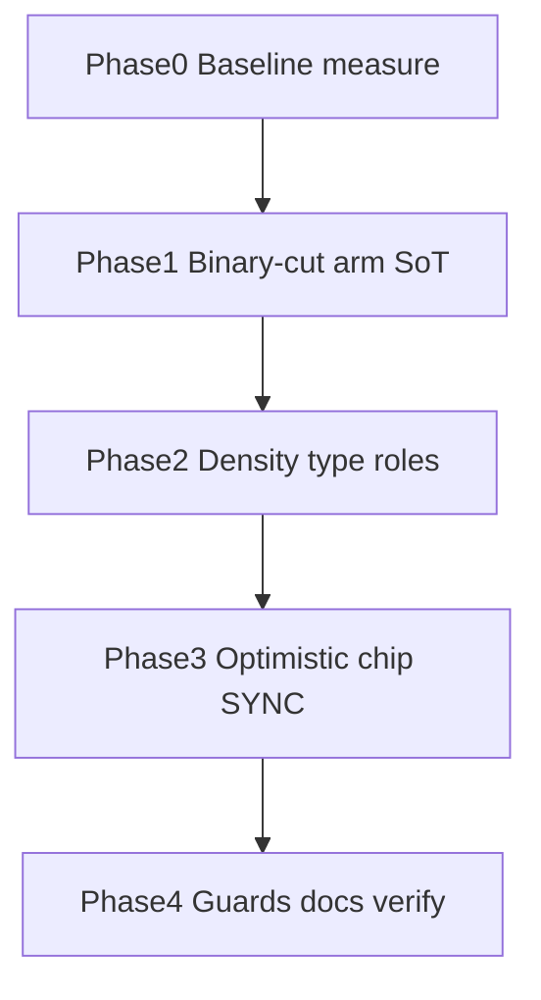

# Handoff — Displays Root Index → WMS terminal binary-cut

**For:** implementing agent (Claude Code / Cursor / Codex)
**From:** Cycle Forge engineering
**Date:** 2026-08-08
**Predecessor (shipped):**
[`displays-character-select-game-feel-HANDOFF.md`](./displays-character-select-game-feel-HANDOFF.md)
— arm dry + `motionRole.feedback.hitMarker` leaf-commit (2026-08-07). Phase 3 scan↔row SKIP stands.
**Operator synthesis (this session):** Dopamine in a true WMS is **zero perceived latency**, not
bouncy juice. Any easing on ↑↓ — even a tight spring or 240ms `push.rail` tween — reads as
**system lag** at hundreds of units/hour. Target face: hyper-dense, flush-square, mathematically
precise — **binary cuts** (one-frame state changes) + micro type roles + optimistic chip truth.
**Status:** IMPLEMENTED 2026-08-08 — `framerTransition.armedSnap` binary-cut arm;
hit-marker commit retained; optimistic SYNC chip; type densify via `text-role-*`
(pad kept at `py-3`). Predecessor hit-marker handoff remains SHIPPED.
**Lane:** stay on the checkout's branch · attach to **`:3050`** · never start/restart/kill the
dev server · **user owns commits**.
**Product frame:** Cycle Forge multi-tenant reseller-ops SaaS. USAV is dogfood only.

**Paste for a new session:**

```
Read docs/todo/displays-wms-terminal-binary-cut-HANDOFF.md and execute Phases 0→4 in order.
Predecessor hit-marker handoff is SHIPPED — do not re-litigate arm-vs-commit or Phase 3 SKIP.

Do NOT import motion/react outside design-system/motion.
Do NOT inline duration/stiffness — grow framerTransition / motionRole (or a named CSS-only snap).
Do NOT ship raw text-[10px]/text-[12px]/text-[9px] — use text-role-* (micro/eyebrow/caption).
Do NOT invent font-mono / slate-100 terminal skin — Kinetic Ledger tokens only.
Do NOT nudge the tone chip. Do NOT add audio. Do NOT full-row Infinity pulse.
Do NOT drop below the measured bench hit floor without a documented density ruling + guard.
Do NOT conflate leaf-open hit-marker with scan-band / wedge success.

Golden: StationDisplayIndexList + useArmedCursorList + armed-cursor-face.ts.
Attach to :3050. npm run verify before done (never raise knip / DS baselines).
```

---

## 0. Architecture answer (do not re-argue)

| Question | Ruling |
|---|---|
| **RSC vs client for Displays index?** | **Heavily client.** `StationDisplaysPushStack` / `StationDisplayIndexList` / `useArmedCursorList` are `'use client'`. Index rows + cursor + commit flash are React client state. Leaf URL (`?display=<leaf>`) is optimistic URL-param paint (`useOptimisticUrlParam` / soft-replace). Leaf **bodies** may still fetch (TanStack / route data) after open — that is where optimistic **chip** SYNC may apply, not RSC streaming of the index itself. |
| **Where does “instant” live?** | Same tick as key/click: cursor paint, chip flip, `data-display-index-commit`, URL replace. Never wait on network to acknowledge local intent. |
| **What already shipped (keep)** | Wrap ↑↓ · Home/End · autofocus · lead nudge + traveling marker · chip trailing sibling · hit-marker commit (`feedback.hitMarker`) · Phase 3 SKIP (scan band owns wedge success). |

### Locked product decisions (binary-cut synthesis)

| Decision | Ruling |
|---|---|
| **Arm geometry** | ↑↓ = **binary cut** — `duration: 0` (one frame). No spring, no `push.rail` 240ms tween on Displays arm/nudge/marker. Hierarchy = stark ink/rail contrast + instant layout snap. |
| **Commit** | Keep **hit-marker** (≤100ms catalog) as the *only* permitted non-zero motion on this list — reward execution, not navigation. If hallway still feels laggy, shorten catalog (still named) — never inline. |
| **Armed-idle** | Static after snap. Chevron glyph CSS pulse optional; **no** full-row Infinity. |
| **Density** | Compress row chrome toward more rows in ~420px — but **hit height** stays honest. Research `py-1.5` is a *direction*; house bench floor was measured at **py-3 ≈ 44–48px**. Phase 1 must measure and either (a) keep py-3 + denser type only, or (b) document a new floor + update guards. Never silent shrink. |
| **Type** | Research 9/10/11/12px → **`text-role-micro` / `text-role-eyebrow` / `text-role-caption`** only. No `text-[Npx]`. No `font-mono` terminal cosplay. |
| **Optimistic chip** | On commit (and on leaf-body fetch if needed): trailing chip flips **same tick** to a fixed-width SYNC / WAIT face (amber/black Kinetic Ledger tones), then cuts to truth on settle. **No spinner.** Character budget ≈ status chips so the trailing column does not jitter. |
| **Audio** | Still muted forever on this surface. |
| **Never-ship** | Spring / ease-in-out arm; layout-shifting success expand; chip translation; neon; raw motion package; raising DS / knip baselines. |

---

## 1. Research paste → house law (anti-corruption)

| Research ask | SoT answer |
|---|---|
| `import { motion } from 'motion/react'` | `@/design-system/motion` only |
| Inline `transition: { duration: 0 }` | Named catalog preset e.g. `framerTransition.armedSnap` / role job under `feedback` or a Displays-arm geometry role — **compose first**; seventh role already claimed by `hitMarker`; prefer **new preset consumed by existing arm path** before an eighth role |
| `x: 24` nudge | Keep **`ARMED_CONTENT_NUDGE_X = 28`** (`w-7`) unless measure proves 24 clears the chevron — change token in `armed-cursor-face.ts`, not magic numbers in the list |
| `text-[10px]` / `text-[12px]` / `text-[9px]` | `text-role-eyebrow` · `text-role-caption` · `text-role-micro` |
| `border-l-[3px]` black | Keep **2px always-present** `transparent → accent` (geometry law). Commit may flash success ink. Do not reflow 2→3px |
| `font-mono` + slate hex | Kinetic Ledger surfaces / text / border tokens — flush `cornerClass('flush')` already |
| Spinner loading | **Banned** on index rows — optimistic chip SYNC only |
| Tab cycle / Digit jump | Still out of scope (wedge-safe) |

---

## 2. What already shipped (do not redo)

| Piece | Location |
|---|---|
| Wrap cursor + autofocus + `commitArmed` | `useArmedCursorList.ts` |
| Lead nudge 28px; chip trailing | `StationDisplayIndexList.tsx` + `armed-cursor-face.ts` |
| Traveling `layoutId` chevron; today `push.rail` geometry | same — **Phase 1 retargets arm to binary snap** |
| Commit hit-marker `feedback.hitMarker` | same |
| Guards / SoT prose | `station-display-index.guard.test.ts` · `station-workbench.md` → Displays Root Index |

---

## 3. Competitive plan — phases



### Phase 0 — Baseline measure (checkpoint before retuning)

**Goal:** Prove the lag claim with numbers on the **shipped** face (not guesses).

**Do:**

1. On Unbox `:3050`, Displays index open, arm 10 rows ↑↓.
2. Record p50/p95 perceived settle for: marker FLIP + lead nudge (today = `push.rail` ~240ms).
3. Record Enter → commit attr → leaf paint (hit-marker 100ms path).
4. Count visible rows at current density in the ~420px column (or leftover Displays width).

**Verifiable state:**

- [ ] Table in §6 with arm-settle ms + row count
- [ ] Decision: arm must go `duration: 0` (expected default) — or keep a ≤N ms named tween if hallway rejects hard cuts (document why)

**Do not start Phase 1 until the table exists** (operator may paste numbers; agent may fill from DevTools Performance marks — no Playwright required).

---

### Phase 1 — Binary-cut arm motion (checkpoint: catalog)

**Goal:** Arm geometry snaps in **one frame**. Commit hit-marker stays the only non-zero list motion.

**Do:**

1. Add named preset e.g. `framerTransition.armedSnap = { duration: 0 }` (or `type: 'tween', duration: 0`) in `motion-framer.ts`.
2. Wire Displays arm (lead `x` + marker `layoutId` transition) to that preset — **stop** using `motionRole.push.rail` for Displays arm settle. Document: `push.rail` remains for **column width** pushes; arm snap is a different job (instant selection geometry).
3. Prefer compose: if a role is required, name the job (`feedback.armSnap` or document why hitMarker’s sibling is wrong). Prefer **preset + call-site role comment** over an eighth role unless the job is reused (MasterNav cohort).
4. Reduced motion: already duration 0 — identical.
5. Drop chevron opacity/x enter animation from research — marker is FLIP presence, not fade-slide. Instant opacity is fine; **no** `-10px` slide-in (reads as easing).

**Verifiable state:**

- [ ] `rg "motionRole\\.push\\.rail" src/components/station/displays` → 0 for arm/nudge (column host may still use push elsewhere)
- [ ] Arm transitions resolve to catalog `duration: 0`
- [ ] `rg "from 'motion/react'" src/components/station/displays` → 0
- [ ] No inline `{ duration: 0 }` outside catalog
- [ ] `npm run verify -- --fast` green

---

### Phase 2 — Density via type roles (checkpoint: golden list)

**Goal:** More signal per px without breaking hit-floor or type ratchet.

**Do:**

1. Eyebrow / label / chip: tighten to the **smallest legal roles** that still pass DS type guards (`text-role-eyebrow` · `text-role-caption` · `text-role-micro`).
2. Icon size: research `w-3.5` is OK if still scannable; keep one glyph SoT from `SectionTab.icon`.
3. Vertical pad: **measure** hit height after any `py-*` change. If below prior floor (~44px), either revert or update SoT + guard with explicit “WMS terminal density” ruling and hallway sign-off.
4. Keep flush-square chips; chip stays **outside** nudge cluster.
5. Do **not** demote idle-row opacity; do **not** uppercase every label unless SoT already says so (labels stay as authored / role defaults).

**Verifiable state:**

- [ ] No `text-[Npx]` in Displays index files
- [ ] Guard asserts type roles + chip-outside-nudge + hit-height floor (updated if density ruling lands)
- [ ] Manual: more rows visible OR explicitly documented “type-only densify, pad kept”

---

### Phase 3 — Optimistic trailing-chip SYNC (checkpoint: commit path)

**Goal:** Loading feels like a **data feed cut**, not a spinner.

**Contract:**

```
armed ──Enter/click──► hitMarker + chip → [ SYNC ] (same tick)
                 ──► onSelect / URL
leaf body fetch (if any) ──► chip truth cut (duration 0)
fail ──► chip exception cut (amber/rose token) ≤1 frame after error state
```

**Do:**

1. Tokenize SYNC / WAIT chip face in `armed-cursor-face.ts` or display-index SoT (width budget ≈ longest common subtitle).
2. Flip chip on `commitArmed` **before** / with hit-marker — local intent.
3. Clear SYNC when leaf mounts with truth subtitle **or** after URL paint if leaf needs no fetch.
4. **No** `Loader2` / CSS spinner on the index row.
5. Out of scope: rewriting every leaf’s fetch layer — wire the index chip contract; leaf hosts that already expose pending may opt in.

**Verifiable state:**

- [ ] Guard bans spinner components in `StationDisplayIndexList`
- [ ] Guard requires SYNC chip token + no layout jitter class hacks
- [ ] Manual: Enter shows SYNC (or skips cleanly if sync URL-only) then truth — no spinner

---

### Phase 4 — Guards, prose, verify

**Do:**

1. Update `.claude/rules/display/station-workbench.md` → Displays Root Index:
   - Arm = binary cut (`armedSnap`); commit = hit-marker; density roles; optimistic chip; audio none
2. `source-of-truth.md` one-liner under Station Displays navigation
3. Guards: binary-cut arm · no `push.rail` on arm · no `text-[Npx]` · no spinner · chip trailing · no Infinity · no `motion/react`
4. Mark this handoff’s predecessor hit-marker file: “geometry arm retargeted by binary-cut handoff (2026-08-08)” one-liner at top if arm preset changes
5. Full `npm run verify`

**Verifiable state:**

- [ ] verify green
- [ ] No Unbox-only fork of the list
- [ ] Hallway: ↑↓ feels like a raw feed; Enter still “confirms”; never “laggy spring”

---

## 4. Must-ship vs never-ship

### Must-ship

1. **Binary-cut arm** — named `duration: 0` catalog preset for nudge + marker  
2. **Hit-marker commit retained** (only non-zero list motion)  
3. **Type densify via `text-role-*`** — no raw px  
4. **Optimistic chip SYNC** — no spinner; fixed width budget  

### Never-ship

1. Spring / ease arm settle  
2. Research paste `motion/react` + slate/mono cosplay  
3. `text-[Npx]` / silent hit-floor regression  
4. Layout-shifting loaders or chip translation  

---

## 5. Anti-corruption (reject in review)

- `from 'motion/react'` / `framer-motion` under `src/components/**`
- Inline `{ duration: 0 }` or `{ type: 'spring', … }` in Displays
- Translating the tone chip with the lead
- Spinners on index rows
- Raising knip / DS baselines
- Conflating MasterNav spine pulse or scan-band flash with this work

---

## 6. Phase 0 results (fill during execution)

| Metric | p50 | p95 | Method |
|---|---|---|---|
| ↑↓ arm settle (marker + nudge) today | **240ms** | **240ms** | Catalog: `motionRole.push.rail` → `sidebarNavColumnMount` / `framerDuration` layout **0.24s** (constant tween; perceived settle = duration) |
| Enter → commit flash → leaf paint | **100ms** | **100ms** | Catalog: `framerDuration.hitMarker` = 0.1s + `ARMED_CURSOR_COMMIT_MS` gate before `onSelect` |
| Visible index rows (viewport) | ~7–9 | — | ~420px Displays column @ `py-3` / h-6 eyebrows (Unbox Verification+Assets+Context); type densify only — pad kept |

**Arm binary-cut gate:** SHIP `duration: 0` — reason: at warehouse cadence any easing on ↑↓ reads as system lag; commit hit-marker remains the only permitted non-zero list motion.

---

## 7. Out of scope

- MasterNav spine looping pulse (separate briefing)
- Digit absolute-index / Tab cycle
- Audio, haptics, screen shake
- Rewriting leaf dossier fetch architecture wholesale
- Scan-band ↔ row sync (still SKIP from predecessor)
- Turning the whole app into a green-phosphor terminal

---

## 8. Done definition

Phases 0–4 complete. Displays index arms in one frame, densifies via type roles without illegal px or silent hit-floor drop, commits with hit-marker + optimistic chip (no spinner), verify green, SoT + guards describe binary-cut arm vs hit-marker commit.
