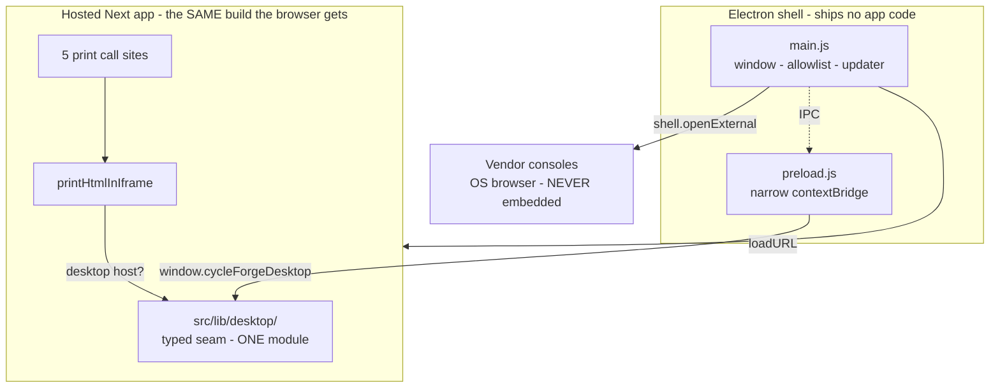

# PLAN — Cycle Forge desktop shell: thin Electron station host (+ N5 VendorView)

**For:** Claude Code / coding agents (paste one phase prompt at a time)
**Date:** 2026-08-10
**Status:** P0–P4 EXECUTED. **N5 VendorView SUPERSEDES the 2026-08-10 vendor-embed HARD BAN** (2026-08-10 evening) — see [`source-of-truth.md`](../../.claude/rules/source-of-truth.md) → Station desktop VendorView · Zendesk dogfood first. P5–P6 (signing / release) require owner credentials.
**Parent research:** [`electron-vendor-webview-displays-delete-keep-GEMINI-RESEARCH-BRIEFING.md`](./electron-vendor-webview-displays-delete-keep-GEMINI-RESEARCH-BRIEFING.md) — Zoho/Inventory slice remains deep-link; **Zendesk Agent escape hatch reopened via N5**.
**Sibling plan (do not merge):** [`unbox-inventory-zoho-deep-link-port-PLAN.md`](./unbox-inventory-zoho-deep-link-port-PLAN.md) — Zoho dossier + deep link unchanged until a later VendorView port.
**Legacy source:** `~/repos/USAV-Orders-Backend-retired-2026-07-10/electron/` (445-line `main.js`, `preload.js`, `printer.js`, `electron-builder.yml`) — the pre-split desktop app. **Port forward selectively; do not copy.**
**Lane:** current checkout — attach to `:3050` (never start/restart/kill). User owns commits. Stay on branch.

**Binding rules:**
[`AGENTS.md`](../../AGENTS.md) · [`.claude/rules/source-of-truth.md`](../../.claude/rules/source-of-truth.md) → Station desktop VendorView · Integrations · Printed code ↔ scan round-trip · Nav keys · Station scan bar chords · [`.claude/rules/workflow-safety.md`](../../.claude/rules/workflow-safety.md) → the dev server is ATTACH-only · [`.claude/rules/build-gotchas.md`](../../.claude/rules/build-gotchas.md) → bundle altitude · [`pattern-evolution.md`](../../.claude/rules/pattern-evolution.md).
**Done =** phase acceptance + `npm run verify` green (fix only this-lane regressions).

---

## 0. ~~Locked verdict (do not re-litigate)~~ — **SUPERSEDED 2026-08-22**

> ⚠️ **"Browser stays primary" was overturned by operator ruling on 2026-08-22.**
> The product is now an installed native application — see `docs/warehouse-os/LAWS.md`
> **T30** (native is the product) and **T31** (the GS1 resolvers stay on the public
> web). The engineering below — thin wrapper, sandboxed preload, no `nodeIntegration`,
> no DOM-scrape macros, one renderer seam — **still stands and is still correct**;
> what changed is that the shell is no longer optional and no longer thin. Read the
> table below as the *starting point* of the port, not as the verdict.

## 0. Original verdict (historical)

| Decision | Pick |
|---|---|
| **Browser stays primary** | **YES** — `saas-commercialization-plan.md` §0 is untouched. The desktop shell is an **optional station-PC host**, never the distribution the product is sold as. A tenant who never installs it loses N1–N5. |
| **Shell shape** | **Thin hosted-URL wrapper.** One `BrowserWindow` loading the deployed Next app. The shell ships **no** application code, **no** bundled Next build, **no** business logic. |
| **VendorView (`WebContentsView` + `session.fromPartition`)** | **N5 — earned.** Full-window escape hatch for signed-in vendor consoles (Zendesk Agent dogfood). Legacy `<webview>` **tag** stays banned (`webviewTag: false`). Mutations Cycle Forge owns stay on REST facades — never DOM injection macros. |
| **Zoho / marketplace embeds** | **Still deferred** — API dossier + deep link until Zendesk VendorView is floor-proven. |
| **`nodeIntegration` / `sandbox: false`** | **BANNED.** Legacy shipped `sandbox: false` + `webviewTag: true`; both die in the port. Sandboxed preloads can still use `ipcRenderer`, so the bridge loses nothing. |
| **Express sidecar on `:3001`** | **DELETE — do not port.** It existed for `.docx` upload/store; this repo replaced that with NAS direct-write + Blob. A localhost HTTP server inside a signed desktop app is attack surface with no remaining consumer. |
| **`electron/printer.js` (`lp` / PowerShell `Start-Process`)** | **DELETE — do not port.** It shells out with an interpolated file path (command-injection shape) to print a *file*. The repo prints *HTML and raw device bytes*, never a file path from the renderer. |
| **What earns native** | N1–N4 in §2, plus **N5 VendorView** (partitioned vendor console overlay). No generic `invoke` / `executeJavaScript` macro channel. |
| **Renderer seam** | **ONE module** — `src/lib/desktop/`. Feature code never sniffs `window.electronAPI`. |
| **Print interception point** | **`printHtmlInIframe`** — the single browser fallback behind 5 call sites. The desktop path is chosen *inside* it, so no call site changes and no second print SoT appears. |

**One-sentence mission.** Give warehouse station PCs a hardened, auto-updating desktop host for the *same* hosted app — closing N1–N5 at the bench — **without** DOM-scrape macros, **without** forking the print stack, and **without** making the browser a second-class client.

---

## 1. Why this is not "wrap it in Electron and ship"

The legacy shell was written when the app *was* the desktop product. Three of its four subsystems are now **dead weight or hazards**, because this repo solved the same problems browser-first:

| Legacy subsystem | Status in this repo | Verdict |
|---|---|---|
| `print-html` IPC → hidden window silent print | `browserPrint.ts` (WebUSB / Web Serial, raw TSPL/ZPL/ESC-POS) covers **thermal** printers dialog-free | **PORT — narrowed.** Still the only way to reach an **OS/office** printer (`kind: 'os'`) silently |
| Express sidecar `:3001` (`.docx` upload) | NAS direct-write + Blob | **DELETE** |
| `<webview>` **tag** for vendors | Legacy USAV used `webviewTag: true` | **TAG BANNED** — N5 uses `WebContentsView` API only; Zoho leaf still deep-link |
| `electron/printer.js` file printing | No consumer; injection-shaped | **DELETE** |

**Measured:** `grep -rn "electronAPI\|desktopApp\|isElectron" src/` returns **zero hits**. There is no desktop code path in this repo to reconnect — the shell is greenfield against a browser-first app. That is the whole reason this is a re-architecture rather than a file copy, and it is why the plan leads with a delete list.

The one seam the repo *already anticipated* is real and load-bearing:

```ts
// src/lib/print/browserPrint.ts
/** os only — OS printer name (matches the Electron preset deviceName). */
deviceName?: string | null;
```

A `PrinterProfile` of `kind: 'os'` already carries the exact field the shell needs. The port fills a socket the app left open.

---

## 2. The justified native surface — N1–N5

Each row states the browser limit, so a future agent can check whether it still holds.

| # | Capability | Why a browser cannot | Shell answer |
|---|---|---|---|
| **N1** | **Silent print to an OS/office printer** (pickup reports, repair paper, packing slips, `kind: 'os'`) | Web pages get no driver-owned printer access; `window.print()` opens a dialog. `--kiosk-printing` only ever hits the **default** printer and requires re-launching the browser with a flag. | `webContents.print({ silent: true, deviceName })` in a hidden window — targets a **named** printer with no dialog |
| **N2** | **Enumerate installed printers** | No web API returns the OS printer list; `deviceName` today is free-typed | `webContents.getPrintersAsync()` → Settings offers real device names |
| **N3** | **Global scan hotkey when unfocused** | `Insert` / `F1–F12` (`DEFAULT_FOCUS_SCAN_HOTKEY`) only fire while the tab has focus; a wedge scan into another window is lost | `globalShortcut` re-focuses the station window, then the existing in-page handler owns the scan |
| **N4** | **Versioned, auto-updating, chrome-less host** | A bench PC "should have the right tab open" is not a deployment. No pinned version, no rollback, browser chrome steals vertical room the 720px station lock needs | Packaged app + `electron-updater` against GitHub Releases |
| **N5** | **VendorView** (partitioned `WebContentsView`) | iframe / deep-link cannot keep a signed-in Agent Workspace beside Unbox without leaving the station | `WebContentsView` + `persist:<vendor>`; React mask + Esc/Ctrl+]; REST for CF-owned mutations |

**Anything not on this list does not earn an IPC channel.** N5 is the written product decision that reopened vendor consoles after the Zoho deep-link verdict.

**Known gap in N1 (stated, not silent).** The bridge accepts a `deviceName`, and Settings now offers the real OS names (N2) — but the five call sites behind `printHtmlInIframe` do not yet pass one, so a desktop print goes to the **system default** printer. That is deliberately the same target `--kiosk-printing` would hit, so behaviour is honest rather than surprising. Routing a document to the `paper`-role profile's device needs a per-call-site role (a label fallback and a document print funnel through the same function), which is a follow-up with its own consumer — not a guess made inside the shared helper.

**N3 is deliberately shallow.** The shell focuses the window and stops. It does **not** read, buffer, or route the scan — `src/lib/scan-hotkey/` and `routeScan` stay the only decoders (`source-of-truth.md` → Printed code ↔ scan round-trip). A shell that started interpreting barcodes would be a second scan engine.

---

## 3. Target architecture



**Load path:** the shell points at the deployed origin. It does **not** bundle a Next build — so a shell install never pins an app version, and shipping app code does not require shipping an installer.

**Trust boundary:** `contextIsolation: true`, `sandbox: true`, `nodeIntegration: false`, `webviewTag: false`. The preload exposes four functions and a version bag — no `require`, no filesystem, no arbitrary IPC.

**Navigation:** origin allowlist. In-allowlist navigation proceeds; everything else is handed to `shell.openExternal`. This is what keeps a deep link to a Zoho PO landing in the operator's real browser — signed in, full-featured, and *not* embedded.

---

## 4. File-level matrix

| Path | Verdict | Notes |
|---|---|---|
| `electron/main.js` | **NEW** (port, hardened) | Window, allowlist, menu, N1–N4, updater. No sidecar, no webview |
| `electron/preload.js` | **NEW** (port, narrowed) | `window.cycleForgeDesktop` — 4 calls + version bag |
| `electron/entitlements.mac.plist` | **NEW** (copy) | Hardened-runtime entitlements for notarization |
| `electron-builder.yml` | **NEW** (port, rebranded) | `com.cycleforge.desktop` · Cycle Forge · GitHub publish |
| `scripts/electron-dev.mjs` | **NEW** | **ATTACHES to `:3050`** — must never spawn a dev server |
| `src/lib/desktop/desktop-host.ts` | **NEW** | Typed renderer SoT — the only file that names the bridge |
| `src/lib/desktop/electron-shell.guard.test.ts` | **NEW** | Pins §0's bans as CODE — `sandbox`/`webviewTag` are one word each, and a plan file cannot fail |
| `src/lib/print/iframePrint.ts` | **THIN** | Route to desktop silent print when hosted; browser path unchanged |
| `package.json` | **THIN** | `main`, `desktop:*` scripts, 4 devDeps |
| `knip.config.ts` | **THIN** | Electron deps live outside knip's `src/**` project glob |
| `electron/printer.js` (legacy) | **DO NOT PORT** | Injection-shaped; no consumer |
| `server/index.js` sidecar (legacy) | **DO NOT PORT** | Replaced by NAS direct-write / Blob |
| `src/lib/print/browserPrint.ts` | **DO NOT TOUCH** | WebUSB/Serial stays the thermal SoT |
| `src/lib/scan-hotkey/**`, `routeScan` | **DO NOT TOUCH** | Shell focuses a window; it never decodes |

---

## 5. Phase map

| Phase | Name | Pass gate |
|---|---|---|
| **P0** | Lock verdict | This plan linked from the parent briefing; ban restated |
| **P1** | Hardened shell | `electron/` mounts the hosted app; sandbox on, webview off, allowlist enforced |
| **P2** | Typed renderer bridge | `src/lib/desktop/` is the only file naming the bridge; no `window.electronAPI` in feature code |
| **P3** | Print seam | `printHtmlInIframe` prefers silent OS print when hosted; 5 call sites unchanged; browser path byte-identical |
| **P4** | Build config | `pnpm desktop:dev` attaches to `:3050`; `desktop:dist` produces an installer; `npm run verify` green |
| **P5** | Signing + notarization | Owner-credential gated (`APPLE_ID`, `APPLE_TEAM_ID`, `CSC_*`) |
| **P6** | Release + rollout | GitHub Release; auto-update verified on a second install |

**v1 shippable = P1–P4.** P5–P6 need credentials this lane does not hold.

---

## 6. Non-goals

- Embedding **any** vendor console (Zoho, eBay, Zendesk, ShipStation) — inherited hard ban.
- Bundling the Next build into the installer (would pin app version to installer version).
- Making desktop the primary or recommended client.
- Porting the Express sidecar or `printer.js`.
- Touching `browserPrint.ts`, the scan-hotkey store, `routeScan`, or any Displays surface.
- Tauri evaluation (separate decision; Electron is the ported-from stack).
- Raising DS ratchet baselines.

---

## 7. Phase prompts (paste one at a time)

### Prompt — P1
> Execute **P1** of `docs/todo/electron-desktop-shell-PLAN.md`. Create `electron/main.js` + `preload.js` + `entitlements.mac.plist`. Hardened: `sandbox: true`, `contextIsolation: true`, `nodeIntegration: false`, `webviewTag: false`. Origin allowlist → `shell.openExternal` for everything else. Implement N1–N4 only. Do NOT port the Express sidecar or `printer.js`. Do NOT add a `<webview>`.

### Prompt — P2 + P3
> Execute **P2–P3**. Add `src/lib/desktop/desktop-host.ts` as the only module naming the bridge, then route `printHtmlInIframe` through it so a desktop host silently prints to the profile's `deviceName`. Do not change the 5 call sites and do not alter browser behavior when no desktop host is present. `npm run verify` before done.

### Prompt — P4
> Execute **P4**. Add `electron-builder.yml`, `scripts/electron-dev.mjs` (**attach to `:3050`, never spawn a dev server**), package.json `main` + `desktop:*` scripts + devDeps, and knip `ignoreDependencies`. Full `npm run verify` green.

---

## 8. Acceptance checklist

- [x] No `<webview>` / `WebContentsView` / vendor embed anywhere in `electron/`
- [x] `sandbox: true`, `contextIsolation: true`, `nodeIntegration: false`, `webviewTag: false`
- [x] No Express sidecar; no `printer.js`; no filesystem or `require` reachable from the renderer
- [x] Exactly one renderer module names the bridge (`src/lib/desktop/`)
- [x] `printHtmlInIframe` browser path unchanged when no desktop host is present
- [x] 5 print call sites untouched
- [x] Dev script attaches to `:3050` and never spawns a server
- [x] Guard test pins the bans (`electron-shell.guard.test.ts`, 13 assertions)
- [x] Shell boots and attaches to a running dev server (verified 2026-08-10)
- [x] This lane's gates green — lint, typecheck, print tests, knip, doc catalog
- [ ] **Whole-repo `npm run verify` green** — blocked by a CONCURRENT session's
      uncommitted work, not by this lane. At `HEAD` those tests pass 30/30; in the
      working tree `DETAIL_STACK_PUSH_COLUMN_CLASS` lost `border-l`, the orders
      column model gained `packStation`, and an untracked `UnboxBrowseFirstPaint.tsx`
      appeared mid-run. None are files this lane touched.
- [ ] Signed + notarized installer (P5 — owner credentials)
- [ ] Auto-update verified install→install (P6)

---

## Appendix — legacy shell delta (what changed and why)

| Legacy | Now | Reason |
|---|---|---|
| `sandbox: false` | `sandbox: true` | Sandboxed preload still gets `ipcRenderer`; nothing was lost |
| `webviewTag: true` | `webviewTag: false` | Vendor-embed hard ban |
| Express sidecar `:3001` | removed | No consumer; localhost server = attack surface |
| `printer.js` (`lp` / PowerShell) | removed | Injection-shaped; no consumer |
| `clearCache()` on every launch | removed | Fought the 256 MB disk cache the same file configured |
| `desktopApp` + `electronAPI` globals | one `cycleForgeDesktop` | Two globals for one job |
| dev script spawns `npm run dev` | attaches to `:3050` | Hard law: never start/kill the user's dev server |
| `appId: com.usav.orders.desktop` | `com.cycleforge.desktop` | Product rename (branding spec §6.1 Phase 5) |
