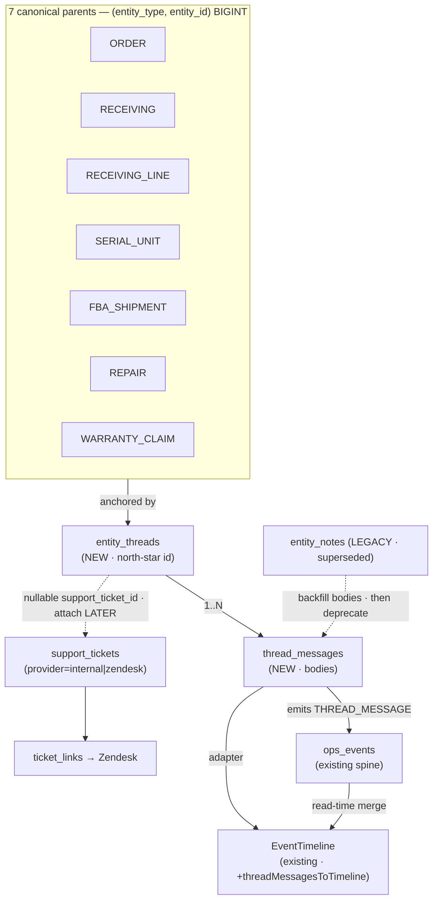

# Entity Threads — unified entity-anchored conversation + timeline display

> **Status:** Proposed (2026-07-14). **Owner:** dogfood/main lane.
> **Skill entry points:** `db-migration-author`, `new-route`, `domain-unit-test`, `improve-ui`, `reseller-flow`.
> **Constitution:** `AGENTS.md`, `.claude/rules/polymorphic-tables.md`, `.claude/rules/backend-patterns.md`,
> `.claude/rules/display/reference-timeline.md`, `.claude/rules/display/workbench.md`, `.claude/rules/contextual-display.md`.
> **Companion:** `entity-threads-conversation-EXECUTION-PROMPT.md` (runnable execution prompt).

## Thesis (why this is ~70% already built)

A "master-ID linkage for a timeline + threads, attachable to items that have no support ticket yet" is **three
layers**. Two already exist in this schema and must be **composed, not rebuilt**; only the third is missing:

| Layer | State | Evidence |
|---|---|---|
| **Polymorphic anchor** (the "master-ID linkage") | ✅ ratified across 7 tables | `feed_memberships`, `entity_signals`, `ops_events`, `entity_search_docs`, `ticket_links`, `photo_entity_links`, `document_entity_links`; contract `.claude/rules/polymorphic-tables.md`; vocab SoT `src/lib/surfaces/registry.ts` + `src/lib/surfaces/canonical-ref.ts` |
| **Event / timeline spine** | ✅ built | `ops_events` (`schema.ts:4070`), `entity_signals` (emits an `ops_events` row on every insert), read-time merge `src/lib/operations/journey.ts` (5 spines) + `src/lib/timeline/journey.ts` `mergeJourney` + 11 `*ToTimeline` adapters |
| **Conversation body** (the thread of messages) | ❌ **absent** — the only real gap | no `entity_threads`/`thread_messages`; bodies scattered across `entity_notes`, `staff_messages`, `receiving_claim_seller_messages`, `warranty_claim_events(NOTE)`, `ai_chat_messages` |

Repo-wide, `thread_id` / `conversation_id` / `correlation_id` / `root_id` / `case_id` are **absent** as internal
concepts (only external `gmail_thread_id`, eBay `conversationId`). So this is a **greenfield table pair keyed off an
already-ratified anchor**, dropping its messages onto an **already-built spine**, rendered through an **already-built
timeline** — plus one reusable **Conversation panel** placed identically on every entity detail surface.

## Problem: the display is fragmented

- **No conversation can exist before a Zendesk ticket.** `ticket_links.zendesk_ticket_id` is `BIGINT NOT NULL` +
  `UNIQUE(org, zendesk_ticket_id)` (`2026-06-01_ticket_links.sql:29,35`); message bodies live only in Zendesk,
  live-fetched (`load-ticket-bundle.ts:42-48`, 90 s Redis SWR cache). `support_tickets.provider='internal'` is
  schema-legal but has **zero writers** (`src/lib/support/tickets.ts:93`; only `tickets.test.ts:30`).
- **Notes are scattered and inconsistent per surface.** Order notes → `orders.notes` via `ShippedPanelEditorDock`;
  receiving-line → `receiving_lines.notes` (`LineNotesTabbedCard` Internal tab); carton → `NotesTab`; warranty →
  read-only `claim.notes` (`WarrantyClaimDetailPanel.tsx:248`). Four different note UIs, none shared, none threaded.
- **`entity_notes` looks like the answer but is a dead-end.** `entity_id` is **UUID** (`schema.ts:937`) while
  order/serial/receiving PKs are integer `serial`s → cannot key modern parents; no `updated_at`; free-text
  `entity_type` (no CHECK); its only writer is `salesOrderRepository.ts:95` (zoho-error notes) and **no UI reads it**.
  `.claude/rules/polymorphic-tables.md` explicitly bans reusing it.
- **The timeline can't show conversation.** 11 adapters, none for messages; `mergeJourney` has 5 sources
  (`src/lib/timeline/journey.ts:31`).
- **There is already a placeholder intent.** `HomeCollabPanel` (`src/features/home/HomeModePanels.tsx:79-93`)
  describes "entity-anchored ops threads" extending `entity_notes` — never built. This plan is that feature, done right.

## Goals / Non-goals

**Goals**
1. One **`entity_threads` + `thread_messages`** polymorphic pair, tenant-from-birth, keyed by the ratified
   `(entity_type, entity_id)` anchor — a conversation on **any** of the 7 canonical entities, **ticket-optional**.
2. Thread messages **flow onto the `ops_events` spine** and **into the existing `EventTimeline`** via one new adapter
   — timeline stays read-time-merged; **no master id for display**.
3. One reusable **Conversation panel** (message list + composer) placed in the **same idiomatic slot** on every entity
   detail surface (order, receiving, unit, warranty) + the support console + Home — a consistent display.
4. A **later** Zendesk attach: escalate a thread → mint a ticket → set `entity_threads.support_ticket_id` + the normal
   `ticket_links` row, activating the dead `provider='internal'` seam.
5. **Supersede** `entity_notes` and consolidate the scattered note/message stores behind one read.

**Non-goals (this plan)**
- A true **Case/Journey root** entity spanning *multiple* entities under one id (Salesforce Case model) — deferred
  (§ Deferred). Read-time `journeyKeyOf` already covers most of it.
- Making `ticket_links` itself ticket-optional (relaxing `zendesk_ticket_id`) — **ask-first**, shared hub with 6
  backfills. This plan attaches via `entity_threads.support_ticket_id` instead.
- Migrating conversation history OUT of Zendesk. Zendesk stays the SoT for Zendesk tickets; a local thread is the
  pre-ticket / internal channel that can *link* to a ticket.

## Ratified architecture decisions

| # | Decision | Rationale / SoT |
|---|---|---|
| **D1** | New pair `entity_threads` + `thread_messages`; do **not** extend `entity_notes`. | `entity_notes.entity_id` is UUID; siblings are BIGINT. `.claude/rules/polymorphic-tables.md` bans reuse. |
| **D2** | `entity_id BIGINT`, `entity_type TEXT` with a **named CHECK** = the 7-value UPPERCASE vocab (`RECEIVING\|RECEIVING_LINE\|SERIAL_UNIT\|ORDER\|FBA_SHIPMENT\|REPAIR\|WARRANTY_CLAIM`), matching `entity_signals`/`feed_memberships`. | Anchor SoT `src/lib/surfaces/registry.ts` (`SURFACE_ENTITY_TYPES`). |
| **D3** | `thread_messages` **INSERT emits an `ops_events` row** (`event_type='THREAD_MESSAGE'`), mapping the UPPERCASE type → `ops_events`' lowercase 9-value CHECK via the registry. | Mirrors `entity_signals`→`ops_events`. Puts messages on the one spine the timeline already reads. |
| **D4** | Timeline shows messages via a **new `threadMessagesToTimeline` adapter** + a 6th `mergeJourney` source — **no new timeline component**. | `.claude/rules/display/reference-timeline.md` ("one primitive, no second timeline"). |
| **D5** | The interactive **Conversation panel** is a chat surface (bubbles + composer) that **mirrors `SupportChatThread`/`SupportChatComposer`** — distinct from the read-only `EventTimeline` history. Both are valid and both appear. | Reuse the sanctioned chat UI (`SupportChatThread.tsx:98`, `SupportChatComposer.tsx:25`), not a new one. |
| **D6** | Thread owns the ticket attachment: nullable **`entity_threads.support_ticket_id → support_tickets`**. `ticket_links` untouched (do-now path). | Lowest blast radius; activates `provider='internal'`. |
| **D7** | New permission family **`support.thread.view` / `support.thread.manage`** (there is no `support.*` perm today — only `integrations.zendesk`, `permission-registry.ts:191`). | A ticketless internal thread must gate independently of Zendesk. |
| **D8** | On **Monitor** surfaces (Operations history), thread messages **appear (read-only)** via the spine, but the **composer is NOT mounted** there — composing lives on Workbench surfaces only. | `.claude/rules/contextual-display.md` ("don't bolt edit onto a Monitor"). |

## Connection model



**Display consistency principle:** every entity detail surface gets **(a)** the same merged history (its existing
`EventTimeline` now including `THREAD_MESSAGE` rows) and **(b)** the same **Conversation panel** in that surface's most
idiomatic slot. Same primitive, same behavior, ticket-optional, everywhere.

---

## Phases

### Phase 0 — Schema & tenancy (migration + Drizzle)

**Skill:** `db-migration-author`. **One migration** in `src/lib/migrations/` (dated, idempotent). Migration is
**UNAPPLIED** until `npm run db:migrate` — track in `docs/partial/HUMAN-TODO.md`.

Tables (follow the canonical DDL skeleton in `.claude/rules/polymorphic-tables.md`):

```sql
-- entity_threads: one ticket-optional conversation anchored to any canonical entity
id                BIGSERIAL PRIMARY KEY
organization_id   UUID NOT NULL                       -- NO default; enforce_tenant_isolation installs it
entity_type       TEXT NOT NULL                       -- named CHECK = 7 UPPERCASE values
entity_id         BIGINT NOT NULL
status            TEXT NOT NULL DEFAULT 'open'         -- named CHECK (open|snoozed|resolved)
support_ticket_id BIGINT NULL REFERENCES support_tickets(id) ON DELETE SET NULL  -- D6 attach seam
last_message_at   TIMESTAMPTZ NULL                     -- denormalized for rail sort
created_by        INTEGER REFERENCES staff(id)
created_at        TIMESTAMPTZ NOT NULL DEFAULT now()
updated_at        TIMESTAMPTZ NOT NULL DEFAULT now()
-- CHECK ux: entity_threads_entity_type_chk
-- UNIQUE ux_entity_threads_natural (organization_id, entity_type, entity_id)   -- one thread per entity (v1)
-- INDEX  idx_entity_threads_entity  (organization_id, entity_type, entity_id)

-- thread_messages: provider-agnostic bodies
id              BIGSERIAL PRIMARY KEY
organization_id UUID NOT NULL
thread_id       BIGINT NOT NULL REFERENCES entity_threads(id) ON DELETE CASCADE   -- real parent FK
author_staff_id INTEGER NULL REFERENCES staff(id)     -- NULL = provider-mirrored/system
provider        TEXT NOT NULL DEFAULT 'internal'      -- named CHECK (internal|zendesk|system)
visibility      TEXT NOT NULL DEFAULT 'internal'      -- named CHECK (internal|public) — mirrors Zendesk note/reply
body            TEXT NOT NULL CHECK (length(btrim(body)) > 0)
client_event_id TEXT NULL                             -- idempotency
meta            JSONB NULL                            -- photo refs, cc, external ids
created_at      TIMESTAMPTZ NOT NULL DEFAULT now()
-- UNIQUE ux_thread_messages_client_event (organization_id, client_event_id) WHERE client_event_id IS NOT NULL
-- INDEX  idx_thread_messages_thread (thread_id, created_at)
```

Tasks:
- [ ] Named CHECK on `entity_threads.entity_type` (idempotent `DO $$ … duplicate_object …$$`), values from
      `SURFACE_ENTITY_TYPES`. `status`/`provider`/`visibility` CHECKs likewise.
- [ ] **Parent-delete integrity** per contract: since `entity_type` is polymorphic, add one
      `trg_delete_entity_threads_on_<parent>_delete` per nameable parent sharing a generic
      `fn_delete_entity_threads_on_parent_delete()` dispatching on `TG_ARGV[0]` (cascade threads → messages cascade
      via FK). Model on `fn_delete_photos_on_parent_delete()`. Any parent without a confirmed table → document + skip.
- [ ] `enforce_tenant_isolation('entity_threads')` and `enforce_tenant_isolation('thread_messages')` in the **same
      migration** (guarded `IF EXISTS pg_proc …`).
- [ ] **Backfill** `entity_notes` rows whose `entity_type` maps to a canonical parent → `entity_threads` +
      `thread_messages` (idempotent `ON CONFLICT DO NOTHING`, keyed by a synthetic `client_event_id='entity_notes:<id>'`).
      Leave `entity_notes` in place (read-superseded, not dropped).
- [ ] Model both `pgTable(...)` in `src/lib/drizzle/schema.ts` (same PR); comment the CHECK vocab. Run
      `npm run schema:drift-guard`.

**Acceptance:** `npm run db:migrate:dry` clean; drift-guard passes; tables model-visible. **Verify:** `npm run db:migrate:dry`.

### Phase 1 — Domain layer (`src/lib/threads/`)

**Skill:** `domain-unit-test`. Deps-injected, DB-free-testable (`.claude/rules/backend-patterns.md`).

- [ ] `resolveThreadForEntity(deps, { orgId, entityType, entityId })` → existing thread or null.
- [ ] `getOrCreateThread(deps, { orgId, entityType, entityId, createdBy })` — validates the parent **exists** in the
      domain helper (app-side existence check per polymorphic contract point 6), upserts on the natural key.
- [ ] `postThreadMessage(deps, { orgId, threadId, authorStaffId?, provider, visibility, body, clientEventId?, meta? })`
      — insert (idempotent on `client_event_id`), bump `entity_threads.last_message_at`, **emit `ops_events`**
      (`event_type='THREAD_MESSAGE'`, entity mapped to lowercase via registry), return `{ message, idempotent }`.
- [ ] `listThreadMessages(deps, { orgId, threadId, limit, before })`.
- [ ] `attachSupportTicket(deps, { orgId, threadId, supportTicketId })` (used by Phase 6).
- [ ] Unit tests with a `fakes()` factory asserting return value + captured `ops_events`/insert calls.

**Acceptance:** `npx tsx --test src/lib/threads/*.test.ts` green (zero DB). **Verify:** same command.

### Phase 2 — API routes

**Skill:** `new-route` (house skeleton: `withAuth` → Zod → domain helper → 404/409/200 → `recordAudit` → `after()`).
`orgId` from `ctx`, never body. Thread `clientEventId`.

| Route | Method | Perm | Body |
|---|---|---|---|
| `/api/threads` | `POST` | `support.thread.manage` | `{ entityType, entityId }` → get-or-create, returns thread |
| `/api/threads/[id]/messages` | `POST` | `support.thread.manage` | `{ body, visibility, clientEventId, meta? }` |
| `/api/threads/[id]/messages` | `GET` | `support.thread.view` | `?limit&before` |
| `/api/threads` | `GET` | `support.thread.view` | `?entityType&entityId` → thread + counts |
| `/api/threads/[id]/attach-ticket` | `POST` | `support.thread.manage` | Phase 6 |

- [ ] Register `support.thread.view` / `support.thread.manage` in `src/lib/auth/permission-registry.ts`
      (`feature: 'support'`) **and** add matching rows to `src/lib/auth/route-permission-manifest.test.ts`
      (agent: `permission-registry-guard`; run `audit-route-auth`).
- [ ] `after()` side-effect: best-effort Ably emit to refresh the panel (mirror existing patterns).

**Acceptance:** manifest test + `audit-route-auth` pass; routes 200/404/409 correctly. **Verify:**
`npx tsx --test src/lib/auth/route-permission-manifest.test.ts`.

### Phase 3 — Timeline adapter + read model

- [ ] `src/lib/timeline/thread-events.ts` → `threadMessagesToTimeline(messages)`: map each to `TimelineItem`
      (`types.ts:83`) — `title` = author or "Note"/"Reply"; `subtitle` = body preview; `actor` = author; `at`
      = `created_at`; `tone` `info` (public) / `muted` (internal); `ref` optional. Own the type→tone map in the adapter
      (never in a view). Export from `src/lib/timeline/index.ts`.
- [ ] Client merge: add `'thread'` as a 6th source in `src/lib/timeline/journey.ts` (`JourneySource`, dispatch at
      `:93-99`), id-namespaced `thread:<id>`.
- [ ] Server merge: add a **thread spine** to `readJourneyEntity` in `src/lib/operations/journey.ts:288-467` (indexed
      point-lookup by resolved entity), org-gated, so Operations history and serial/receiving journeys include messages.
- [ ] `collapseTimeline` already folds adjacent equals — no change.

**Acceptance:** a thread message renders as a timeline row on a seeded entity in every journey-backed consumer.
**Verify:** `run` skill on `/o/[orderId]` timeline tab after seeding a message.

### Phase 4 — The `ThreadPanel` primitive (Conversation surface)

Build **one** house primitive, Kinetic Ledger-compliant, reusing the support chat pieces:

- [ ] `src/components/threads/ThreadPanel.tsx` — props `{ entityType, entityId, dense?, embedded? }`. Composition:
  - message list mirroring `SupportChatThread.tsx:98` (avatar + author/visibility badge + time + bubble; auto-scroll);
  - composer mirroring `SupportChatComposer.tsx:25` (`textarea`, ⌘↵/Ctrl↵ submit, `VisibilityToggle`
    internal/public, optional photo staging via `useTicketPhotoStaging`);
  - `useThread(entityType, entityId)` hook (TanStack Query) with **optimistic `onMutate` → rollback → `onSettled`
    invalidate** (`.claude/rules/display/workbench.md` Optimistic CRUD); thread `clientEventId` via `safeRandomUUID()`.
  - empty/loading/error = house states (`Loader2` + text; dashed teaching box). Motion via
    `useMotionPresence`/`useMotionTransition` only.
- [ ] Tokens/one-row anatomy/`HoverTooltip`/paired icons per `.claude/rules/ui-design-system.md`. No page-local hex.
- [ ] Optional slide-over form: register through `useRegisterRightPanel` / `DetailStackRailRegistrar` at
      `RIGHT_RAIL_PRIORITY.detail` so `RightRailHost` owns motion — used where an inline card doesn't fit.

**Acceptance:** ThreadPanel renders, posts optimistically, degrades cleanly; passes DS guards. **Verify:** `improve-ui`
critique pass + `run`.

### Phase 5 — Graft into surfaces (the display)

Same primitive, idiomatic slot per surface (from the graft scan):

| Surface | Host (file:line) | Placement | History merge |
|---|---|---|---|
| **Order** `/o/[orderId]` | `ShippedDetailsHeader.tsx:127` (tabs) + `ShippedDetailsBody.tsx:~132` (`scrollContent` switch) | Add a **`conversation` tab** mirroring the Warranty tab; extend `ShippedActiveSection` union | Merge `...threadMessagesToTimeline(thread)` into `OrderTimelineSection.tsx:61-64` before sort/collapse |
| **Receiving line** | `LineEditPanel.tsx:338-430` (`SectionTabsSlider`) | Add a **"Conversation" SectionTab** parallel to the existing `ticket` tab (`:412`, already lazy-mounts `SupportTicketDetail`) | Into each `SerialJourneySection` `mergeJourney` (`SerialJourneySection.tsx:91`) |
| **Unit** (labels) | `UnitDetailWorkspace.tsx:58-77` (vertical card stack) | Append a **collapsible Conversation card** after `TimelineCard` (`:68`) | Its `TimelineCard` is bespoke; mount a `TimelineSection` w/ merged items or rely on the card |
| **Warranty** | `WarrantyClaimDetailPanel.tsx:124-254` (`Section` stack) | Add `<Section title="Conversation">` next to `Timeline` (`:239`); **replace read-only Notes** (`:248`) | Merge into `EventTimeline items` at `:241` |
| **Support console** | `SupportTicketDetail.tsx` | Local thread mirrors this exact layout; when a ticket is linked, show both local + Zendesk comments | n/a (Zendesk live) |
| **Home** | `HomeModePanels.tsx:79-93` (`HomeCollabPanel`) | **Replace the placeholder** with the real ThreadPanel list | n/a |

**Hard display rule (D8):** Operations history (`OperationsHistoryView.tsx:255,336`, Monitor) shows `THREAD_MESSAGE`
rows read-only — **no composer there**.

**Acceptance:** each Workbench surface shows the Conversation panel + merged history; Monitor shows read-only rows.
**Verify:** `run` each surface.

### Phase 6 — Ticket attach seam (activate `provider='internal'`)

- [ ] `attachSupportTicket` + `/api/threads/[id]/attach-ticket`: on "Escalate to Zendesk", `helpdesk.createTicket` →
      `linkTicket` (existing) → set `entity_threads.support_ticket_id` → optional `support_ticket_assignments` row.
- [ ] "Convert to internal ticket" path: `upsertSupportTicket({ provider:'internal' })` (`tickets.ts:93`) — first real
      writer of the dead capability — and set `support_ticket_id` (no Zendesk round-trip).
- [ ] Panel header shows linked-ticket chip when `support_ticket_id` set (reuse ticket chip).

**Acceptance:** a thread with no ticket can escalate and thereafter resolve to a ticket. **Verify:** `run` escalate flow.

### Phase 7 — Consolidation & connection cleanup (recommend; some ask-first)

- [ ] **Read-fold** (do now): `warranty_claim_events(NOTE)`, `receiving_claim_seller_messages`, and entity-context
      `staff_messages` surface *inside* the entity's ThreadPanel as read rows (adapter, not migration).
- [ ] **Deprecate** the four scattered note editors → route them to the thread composer (order/receiving-line/carton/
      warranty). Keep the columns; stop growing new UIs on them.
- [ ] **RLS parity** (ask-first, shared): add `enforce_tenant_isolation` to `ticket_links` +
      `support_ticket_assignments` (today GUC-default only) — separate migration.
- [ ] **`ticket_links` ticket-optional** (ask-first, higher blast radius): only if product wants the *link* itself to
      exist pre-Zendesk; otherwise D6 covers it.

---

## Display / UX contract (per region)

- **Region:** every entity detail surface is a **Workbench focus surface** (`.claude/rules/display/workbench.md`); the
  Conversation panel is a **secondary** inside it, exactly like a reference timeline is secondary
  (`.claude/rules/display/reference-timeline.md`). Not a new region.
- **Two distinct things, both present:** the read-only **merged history** (`EventTimeline`, gains `THREAD_MESSAGE`
  rows via adapter — the *record*) and the interactive **Conversation panel** (chat bubbles + composer — the
  *channel*). Do not fold the composer into `EventTimeline`.
- **Monitor stays observe-only (D8).** Composer only on Workbench surfaces.
- **Motion:** panel body crossfades via `useMotionPresence(framerPresence.workbenchPane)`; never animate layout; list
  reveal is stagger-only.
- **Mobile:** MobileShell surfaces reuse the same endpoints/query keys — one thread, two terminals.
- **Empty/error:** teaching empty ("No messages yet — start the conversation."); failed history degrades to empty,
  never 500s the record.

## Compound opportunities

- **Do now (in scope, low blast radius):** the `entity_threads`/`thread_messages` pair, the adapter, the ThreadPanel,
  Phases 0–5. Supersede `entity_notes` by read.
- **Promote to DS next (2+ call sites):** extract the reused `SupportChatThread`/`SupportChatComposer` internals into a
  shared `@/components/threads/*` (message-bubble + composer) so support + threads share one chat primitive instead of
  two. Promote `SectionCard` a `collapsible` prop (today none — `SupportChatComposer` peers hand-roll it).
- **Deferred (ask first / multi-page):** Case/Journey root (below); `ticket_links` ticket-optional; RLS parity migration.

## Deferred: the Case/Journey root (the literal "one master ID")

A `cases` root entity that groups **multiple** entities (order → serials → return → warranty → ticket → thread) under
one shareable id — the Salesforce Case / Dynamics CaseFeed model. This is a **second correlation axis** over the whole
schema; `journeyKeyOf` (order/serial/tracking bands) already covers most read-time grouping. Build only after
per-entity threads prove demand. Not in this plan.

## Risks & guards

- **Hooks are law** (`.claude/settings.json`): secret-path edits, SoT regressions, `db:push`, force-push are blocked.
  Never bypass. Migration is hand-written SQL, applied via `db:migrate`, never `db:push`.
- **entity_id type trap:** BIGINT everywhere (D2); `entity_notes` UUID is the anti-example — do not copy it.
- **entity_type case trap:** thread table uses UPPERCASE (matches `entity_signals`); `ops_events` uses lowercase 9-value
  — map via `src/lib/surfaces/registry.ts` when emitting (D3). A mismatch fails the `ops_events` CHECK.
- **Monitor-edit anti-pattern (D8):** composer must not land on `OperationsHistoryView`.
- **Permission manifest:** any `permission-registry.ts` edit needs the matching manifest-test row (guard enforced).
- **Tenant-from-birth:** `enforce_tenant_isolation` in the creating migration; `orgId` from `ctx`.
- **Migration UNAPPLIED** until `db:migrate` — record in `docs/partial/HUMAN-TODO.md`; code paths that write threads
  will error until applied.

## Verification matrix

| Phase | Command / method |
|---|---|
| 0 | `npm run db:migrate:dry` + `npm run schema:drift-guard` |
| 1 | `npx tsx --test src/lib/threads/*.test.ts` |
| 2 | `npx tsx --test src/lib/auth/route-permission-manifest.test.ts` + `audit-route-auth` |
| 3 | `run` `/o/[orderId]` timeline after seeding a message |
| 4 | `improve-ui` critique + `run` ThreadPanel |
| 5 | `run` order / receiving / unit / warranty / support / home |
| 6 | `run` escalate-to-Zendesk + convert-to-internal |
| all | `npx tsc --noEmit -p tsconfig.json` when types are in doubt |

## File-touch index

**Create:** `src/lib/migrations/<date>_entity_threads.sql`, `src/lib/threads/{threads.ts,threads.test.ts}`,
`src/app/api/threads/route.ts`, `src/app/api/threads/[id]/messages/route.ts`,
`src/app/api/threads/[id]/attach-ticket/route.ts`, `src/lib/timeline/thread-events.ts`,
`src/components/threads/ThreadPanel.tsx`, `src/hooks/useThread.ts`.

**Edit:** `src/lib/drizzle/schema.ts`, `src/lib/timeline/index.ts`, `src/lib/timeline/journey.ts`,
`src/lib/operations/journey.ts`, `src/lib/auth/permission-registry.ts`,
`src/lib/auth/route-permission-manifest.test.ts`,
`src/components/shipped/details-panel/ShippedDetailsHeader.tsx`,
`src/components/shipped/details-panel/ShippedDetailsBody.tsx`,
`src/components/shipped/OrderTimelineSection.tsx`, `src/components/receiving/workspace/LineEditPanel.tsx`,
`src/components/labels/unit-detail/UnitDetailWorkspace.tsx`,
`src/components/warranty/WarrantyClaimDetailPanel.tsx`, `src/features/home/HomeModePanels.tsx`,
`docs/partial/HUMAN-TODO.md`.
