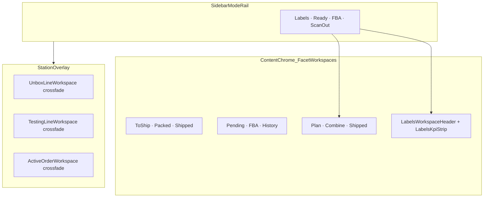

# Fable 5 — SoT Design System Prune & Alignment

**Status:** ready for execution  
**Workstream:** WS-DISPLAY (Axis 5 workbench shell convergence)  
**Execution prompt:** [`fable5-ds-prune-EXECUTION-PROMPT.md`](./fable5-ds-prune-EXECUTION-PROMPT.md)  
**Related:** [`display-convergence-log.md`](./display-convergence-log.md) Axis 5 · [`2026-component-adoption-plan.md`](../design-system/2026-component-adoption-plan.md)

---

## Goal

Give Fable 5 a **repeatable audit → prioritize → implement → verify** playbook to:

1. Find **bad patterns** (hand-rolled headers, KPI grids, tab bands, missing crossfade, duplicate metrics)
2. Prune **dead code** (knip findings, orphaned exports, deleted-header leftovers)
3. **Promote SoT consumption** — compose from registries instead of forking page-local shells
4. Align **component routing** so each region uses the correct contract (Station vs Workbench vs Monitor)

**Primary pain surfaces (user-flagged):** `/outbound` Labels + FBA, `/test` Shipping workspace.

**Golden references:** Unbox / Testing / Shipping stations + `/dashboard`.

---

## Architectural law (hold while executing)

Documented in [display-convergence-log.md](./display-convergence-log.md) Axis 5 — reconcile with current user intent:



| Switch type | Where tabs live | Example | SoT |
|---|---|---|---|
| **Distinct jobs** (different bodies/contracts) | Sidebar `ModeRail` | Outbound 4 modes | Keep sidebar — do **not** add top band for Labels↔FBA↔Ready↔ScanOut |
| **Lifecycle facets** (same workspace, filter/stage) | Content `WorkbenchChromeHeader` | Dashboard, `/test` Shipping, **FBA plan/combine/shipped** | [`workbench-shell.tsx`](../../src/components/dashboard/workbench-shell.tsx) + [`TabSwitch.tsx`](../../src/design-system/components/TabSwitch.tsx) |
| **Focused unit work** | Absolute overlay + crossfade | Unbox/Testing/Shipping scan | [`motion-framer.ts`](../../src/design-system/foundations/motion-framer.ts) `workbenchPane*` |

**User correction vs prior log:** FBA **sub-modes** (plan/combine/shipped) are facets → move from sidebar pills + inline table toolbar to **content chrome tabs top-left + KPI strip below**, matching [`DashboardOrdersView.tsx`](../../src/components/dashboard/DashboardOrdersView.tsx). The four outbound modes themselves stay sidebar-switched.

---

## Golden references (copy these first)

### Station browse + overlay (good)

| Station | Browse shell | Header | KPI | Overlay |
|---|---|---|---|---|
| Unbox | [`UnboxWorkspaceView.tsx`](../../src/components/receiving/unbox/UnboxWorkspaceView.tsx) | [`UnboxWorkspaceHeader.tsx`](../../src/components/receiving/unbox/UnboxWorkspaceHeader.tsx) | [`UnboxKpiStrip.tsx`](../../src/components/receiving/unbox/UnboxKpiStrip.tsx) | [`UnboxLineWorkspace.tsx`](../../src/components/receiving/unbox/UnboxLineWorkspace.tsx) |
| Testing | [`TestingWorkspaceView.tsx`](../../src/components/tech/testing/TestingWorkspaceView.tsx) | [`TestingWorkspaceHeader.tsx`](../../src/components/tech/testing/TestingWorkspaceHeader.tsx) | [`TestingKpiStrip.tsx`](../../src/components/tech/testing/TestingKpiStrip.tsx) | [`TestingLineWorkspace.tsx`](../../src/components/tech/TestingLineWorkspace.tsx) |
| Shipping `/test` | [`ShippingWorkspaceView.tsx`](../../src/components/tech/shipping/ShippingWorkspaceView.tsx) | [`ShippingWorkspaceHeader.tsx`](../../src/components/tech/shipping/ShippingWorkspaceHeader.tsx) | [`ShippingKpiStrip.tsx`](../../src/components/tech/shipping/ShippingKpiStrip.tsx) | [`ActiveOrderWorkspace.tsx`](../../src/components/tech/ActiveOrderWorkspace.tsx) |

Shared recipe:

```tsx
<DashboardScrollShell chrome={<WORKBENCH_CHROME_COLUMN><*WorkspaceHeader /></WORKBENCH_CHROME_COLUMN>}>
  <WORKBENCH_BODY_COLUMN>
    <*KpiStrip />   {/* scrolls away */}
    <TableOrFeed /> {/* full-bleed in gutters */}
  </WORKBENCH_BODY_COLUMN>
</DashboardScrollShell>
```

### Dashboard (facet workbench gold)

[`DashboardOrdersView.tsx`](../../src/components/dashboard/DashboardOrdersView.tsx) — pinned [`OutboundWorkspaceHeader`](../../src/components/dashboard/OutboundWorkspaceHeader.tsx) + [`OutboundKpiStrip`](../../src/components/dashboard/OutboundKpiStrip.tsx).

---

## Bad pattern inventory (prioritized fix list)

### P0 — FBA outbound (`?mode=fba`)

| Issue | Current | Target |
|---|---|---|
| Hand-rolled page shell | [`FbaOutboundWorkspace.tsx`](../../src/components/fba/FbaOutboundWorkspace.tsx) | `DashboardScrollShell` + gutter columns |
| KPI grid inside table toolbar | [`FbaBoardTable.tsx`](../../src/components/fba/FbaBoardTable.tsx) L345–435 — inline `KpiTile` grid + `PaneHeaderTabs` + raw search `<input>` | Extract **`FbaWorkspaceHeader`** (compose `WorkbenchChromeHeader` + `TabSwitch`) + **`FbaKpiStrip`** (Monitor tiles); dedupe with [`ShippingKpiStrip`](../../src/components/tech/shipping/ShippingKpiStrip.tsx) / [`shipping-metrics.ts`](../../src/lib/tech/shipping-metrics.ts) |
| Sub-mode tabs in sidebar | [`FbaWorkspaceSidebar.tsx`](../../src/components/fba/sidebar/FbaWorkspaceSidebar.tsx) `HorizontalButtonSlider` | Move plan/combine/shipped to **content chrome**; sidebar keeps ambient I/O only |
| No tab-body crossfade | Instant remount on sub-mode change | `AnimatePresence mode="wait"` + `framerPresence.workbenchPaneSettle` (pattern: [`ReceivingRightPane.tsx`](../../src/components/receiving/ReceivingRightPane.tsx)) |
| Raw input / focus drift | Search field in `FbaBoardTable` toolbar | `TextField` / DS search + `focusRing('field', …)` |

### P0 — Labels outbound (default `/outbound`)

| Issue | Current | Target |
|---|---|---|
| No content chrome header | [`LabelsQueueTable.tsx`](../../src/components/outbound/labels/LabelsQueueTable.tsx) with `hideHeader`; stats in sidebar [`LabelsModeBody.tsx`](../../src/components/outbound/labels/LabelsModeBody.tsx) | New **`LabelsWorkspaceHeader`** composing `WorkbenchChromeHeader` (sort, search, controls portal) |
| KPI in sidebar only | `StatusLegend` + count in sidebar | New **`LabelsKpiStrip`** in `WORKBENCH_BODY_COLUMN` (Monitor `KpiTile`) |
| Partial shell | [`OutboundWorkspace.tsx`](../../src/components/outbound/OutboundWorkspace.tsx) uses `WorkbenchTablePane` but not full two-zone scroll shell | Wrap labels branch in `DashboardScrollShell` (increment 2 in convergence log) |
| Crossfade | Queue↔print **has** crossfade; **mode switch** (labels↔fba) does not | Add keyed `AnimatePresence` on mode branches in `OutboundWorkspace.tsx` |
| Tab-like UI wrong primitive | Sidebar uses `HorizontalButtonSlider` via [`outbound-sidebar-shared.ts`](../../src/components/outbound/outbound-sidebar-shared.ts) | Keep sidebar rail but ensure any **facet** tabs use `TabSwitch` |

### P1 — `/test` Shipping workspace gaps

| Issue | Current | Target |
|---|---|---|
| No tab-body crossfade | [`ShippingWorkspaceView.tsx`](../../src/components/tech/shipping/ShippingWorkspaceView.tsx) instant `{shipTab === …}` | Add `AnimatePresence` on tab body (same motion preset as Search/Operations history) |
| FBA tab stub | WIP + bare [`FbaShipmentsTable`](../../src/components/fba/FbaShipmentsTable.tsx) | Align with outbound FBA board OR clearly scope as shipment-grain view with same chrome/KPI stack |

### P2 — Same Axis 5 debt (after outbound)

- Receiving incoming: [`IncomingWorkspaceHeader`](../../src/components/sidebar/receiving/incoming/IncomingWorkspaceHeader.tsx) + [`IncomingKpiStrip`](../../src/components/sidebar/receiving/incoming/IncomingKpiStrip.tsx) exist but body not on `DashboardScrollShell` yet
- Ready / Scan-out: [`ReadyQueueTable.tsx`](../../src/components/outbound/ready/ReadyQueueTable.tsx), scan-out staged queue — self-guttered, no KPI strip

### P3 — Dead code & import hygiene

```bash
npm run dead-code:report    # inventory
npm run knip                # gate vs baseline
npm run verify              # full CI mirror before done
```

Follow [`.claude/skills/knip-prune/SKILL.md`](../../.claude/skills/knip-prune/SKILL.md): **grep before delete**, prefer de-export over delete, refresh baseline only for reviewed intentional removals.

Likely prune targets after FBA/header extraction:

- Orphaned `PaneHeaderTabs` usages replaced by `TabSwitch`
- Duplicate KPI resolvers if unified under `lib/tech/shipping-metrics.ts` or new `lib/fba/fba-metrics.ts`
- Any revived/deleted `OutboundModeHeader` references (already removed per log — confirm no dangling imports)

---

## Detection heuristics for audit pass

Scan `src/components/**` and `src/app/**` for:

| Smell | Grep / signal | SoT replacement |
|---|---|---|
| Hand-rolled workbench shell | `PaneHeaderTabs`, inline `grid grid-cols-*` + `KpiTile`, missing `DashboardScrollShell` | `workbench-shell.tsx` |
| Wrong tab primitive | `HorizontalButtonSlider` for **facet** switching inside main pane | `TabSwitch` via `WorkbenchChromeHeader` |
| Forked entity header | Local identity rows not importing [`entity-context/index.ts`](../../src/components/station/entity-context/index.ts) | `CartonContextCard` + adapter |
| Forked station anatomy | Custom flex stacks mimicking toolbar/tabs/dock | [`StationWorkbench.tsx`](../../src/components/station/workbench/StationWorkbench.tsx) |
| Missing crossfade | Mode/tab `if` branches without `AnimatePresence` | `framerPresence.workbenchPane*` |
| Hand-rolled card shell | `rounded-2xl border` page wrappers | `Panel` / `SectionCard` / `MONITOR_SECTION_CARD_*` |
| DS ratchet violations | raw `<button>`, native `title=`, `text-[Npx]` | Migrate to DS primitives or documented `ds-*` escape |

**Region contract check** ([`contextual-display.md`](../../.claude/rules/contextual-display.md)):

- Scan-out dock = **Station** (sidebar scan I/O)
- Labels queue = **Workbench** table
- FBA board = **Workbench** (board/table hybrid)
- Dashboard KPI band = **Monitor rollup**

---

## Implementation phases (execution order)

### Phase A — Read-only audit report (mandatory first output)

1. Load context: `AGENTS.md`, [`DESIGN_SYSTEM.md`](../../src/design-system/DESIGN_SYSTEM.md), [`improve-ui/SKILL.md`](../../.claude/skills/improve-ui/SKILL.md) Phase 0–1, [`display-convergence-log.md`](./display-convergence-log.md) Axis 5
2. Produce **`docs/audit/fable5-ds-prune-report.md`** with:
   - Findings table: path · smell · SoT target · priority · blast radius
   - Dead code candidates (knip top 20 per category in touched trees)
   - Promotion candidates (duplicate header/KPI patterns → shared module)
3. **Stop for user approval** on P0 scope before editing (improve-ui gate)

### Phase B — FBA convergence (highest user pain)

1. Create `FbaWorkspaceHeader.tsx` + `FbaKpiStrip.tsx` mirroring `ShippingWorkspaceHeader` / `ShippingKpiStrip`
2. Refactor [`FbaOutboundWorkspace.tsx`](../../src/components/fba/FbaOutboundWorkspace.tsx) onto `DashboardScrollShell`
3. Strip toolbar from [`FbaBoardTable.tsx`](../../src/components/fba/FbaBoardTable.tsx) — table/board only
4. Move plan/combine/shipped from [`FbaWorkspaceSidebar.tsx`](../../src/components/fba/sidebar/FbaWorkspaceSidebar.tsx) to content chrome
5. Add sub-mode crossfade
6. Unify metrics SoT (single resolver; clickable KPI → filter tab)

### Phase C — Labels convergence

1. Create `LabelsWorkspaceHeader.tsx` + `LabelsKpiStrip.tsx`
2. Wrap labels branch in [`OutboundWorkspace.tsx`](../../src/components/outbound/OutboundWorkspace.tsx) with full workbench shell
3. Move sidebar-only stats to KPI strip; keep sidebar for ambient scan/filter
4. Add outbound **mode-switch** crossfade (`AnimatePresence` keyed on `mode`)
5. Preserve existing queue↔print crossfade

### Phase D — `/test` Shipping polish

1. Tab-body crossfade in `ShippingWorkspaceView.tsx`
2. Reconcile FBA tab body with Phase B outcome

### Phase E — Prune & verify

1. Remove dead exports/files confirmed by grep
2. Fix import paths to barrel SoTs (`@/design-system/components/monitor`, `@/components/station/entity-context`, etc.)
3. Run `npm run verify` — fix all gates (lint, tsc, DS guards, knip, route-auth if touched)
4. Append entry to [`display-convergence-log.md`](./display-convergence-log.md)

---

## Verification gates (definition of done)

- `npm run verify` green
- No new knip findings (or baseline refreshed with documented intentional removals)
- DS ratchet: migrate violations, never raise baselines
- Visual checklist:
  - FBA: tabs top-left in content chrome, KPI below, board full-bleed in gutters
  - Labels: header + KPI in main pane; queue↔print crossfade intact
  - Outbound mode switch: sidebar unchanged, optional body crossfade on mode change
  - Stations (Unbox/Testing/Shipping): no regressions to overlay crossfade

---

## Risk notes

- **Virtualization:** Labels queue may need `DashboardScrollShell` scroll-parent wiring (convergence log increment 2) — defer if it blocks P0; document in audit
- **FBA combine overlay:** Preserve existing combine-mode UX when extracting toolbar
- **Metric dedupe:** Clickable KPI tiles that set filter tabs must keep behavior — wire through shared resolver, not copy-paste counts
- **Concurrent work:** Avoid touching unrelated in-flight lanes (e.g. kiosk auth) unless the audit finds a direct dependency

---

## Changelog

| Date | Note |
|---|---|
| 2026-07-17 | Plan + execution prompt authored for Fable 5 DS prune/alignment run |
