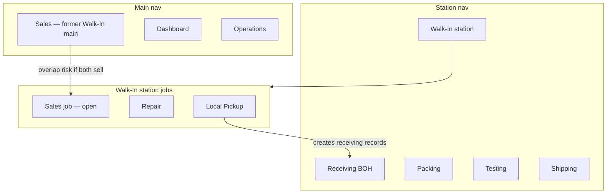

# Front-of-house / back-of-house surface split

**Status:** Partially shipped · direction refined 2026-07-17 (see Revision below) — split into per-surface child plans  
**Created:** 2026-07-16  
**Related:**
- [studio-driven-operator-surfaces-refactor-plan.md](./studio-driven-operator-surfaces-refactor-plan.md)
- [display-convergence-log.md](./display-convergence-log.md)
- [../master-connections-and-refactor/staff/06-local-pickup.md](../master-connections-and-refactor/staff/06-local-pickup.md)
- **Child plan docs:** [`foh-boh-surface-split/`](./foh-boh-surface-split/) — per-surface plans (this refactor is split for independent monitoring)

This is a **design inventory**, not an implementation ticket. Use it to refine product decisions, spot reuse, and cut overlap before writing code.

---

## ⚠️ Revision 2026-07-17 — direction refined + what shipped

**Supersedes the "Walk-In own station" framing below** (Locked product direction; Target IA §Walk-In
station; and the archetype specifics of Phase 0 rows 2 / 7 / 8). Two things changed since the 16 Jul
freeze: the **owner refined the counter's archetype**, and **implementation moved past the frozen
record**. Reconcile child docs 02 / 03 / 05 to this before building further.

### Refined direction (owner, 2026-07-17)

- **The counter is a *form*, not a scanner station.** No scanner ⇒ not a Station (contextual-display
  Q1). `/walk-in` (Sales) becomes a **sidebar-less iPad kiosk**: a service picker — **Sales · Local
  Pickup · Repair** — where each service is its own form wired to its platform (**Square · Zoho ·
  Ecwid**) via capability facades.
- **Local Pickup + Repair are *Receiving modes*, not Walk-In-station jobs.** They run the **exact Unbox
  flow** on the floor — photos → identify → pair in Zoho → place → print unit label. Cart icon = Local
  Pickup, wrench = Repair, as peer modes of Unbox.
- **This retires the `?job=` switcher and the "Walk-In as its own `kind:'station'`" idea.** Kept: the
  Sales relabel; Inbound History → a `/dashboard` mode; Walk-In vs Receiving history stay separate.

### What already shipped (`eb78be34`, `3ea08956`)

| Change | Evidence | State |
|---|---|---|
| Local Pickup + Repair are peer **Receiving rail modes** (cart / wrench); Walk-In pill + History dropped from the rail | `receiving-sidebar-shared.ts` `RECEIVING_MODE_ITEMS`; `sidebar-navigation.ts` receiving `modes[]` + path-based `resolveMode` | ✅ |
| Own routes `/unbox /triage /incoming /pickup /repair`; `?job=` model deleted ("the jobs ARE modes") | route pages exist; nav comment (~L527) | ✅ |
| Walk-In main → **Sales** (label; `id:'walk-in'` kept for bookmarks; `requires: 'walk_in.view'`) | `sidebar-navigation.ts`; `SalesWorkspaceHeader.tsx` | ✅ |
| Panels adopt `StationWorkbench` | `LocalPickupEditPanel`, `RepairIntakeForm`, `RepairTable` (adopters listed in `.claude/rules/display/station-workbench.md`) | ✅ |
| Inbound History → `/dashboard` mode | rail no longer lists `history`; the `/dashboard` Scanned/Unboxed mode is **not built**; `/receiving/history` still resolves | 🟡 |

### Still to build (against the refined direction)

| # | Item | Child doc |
|---|---|---|
| R1 | Promote `pickup`/`repair` to first-class `WORKSPACE_MODES` rows + `STATION_TERMINAL_REGISTRY` — today the `WorkspaceMode` union is only `unbox\|triage\|testing`, so they render but aren't docked workbench modes | 01 |
| R2 | `/walk-in` Sales → sidebar-less **kiosk form** (service picker + one form module per service, Unbox-style split) | 03 |
| R3 | Wire Sales / Pickup / Repair to **Square / Zoho / Ecwid** behind capability facades (connectors already exist) — capability-noun copy, never hardcoded brand sentences | 03 |
| R4 | Retire the stale `src/lib/walk-in/jobs.ts` `?job=` SoT (`WALK_IN_JOBS`, `WALK_IN_STATION_PATH`, `walkInStationHref`) — grep consumers first | 05 |
| R5 | Build the `/dashboard` **Inbound** mode (Scanned · Unboxed) via the dashboard chrome recipe; then retire the `/receiving/history` fallback | 04 |
| R6 | Mobile: `/pickup` still rewrites to `/m/receiving`, no `/m/walk-in` (explicitly deferred in `proxy.ts`) | — |

### Conflicts — resolution status

1. ✅ **Sales = form vs history — RESOLVED (owner, 07-17): both, split by surface.** `/walk-in` (Sales)
   stays the **staff transaction-history** monitor; the **customer intake is a separate route**
   (`/kiosk`), authed as a **device principal**, not a staff member. Auth model owned by
   [06](./foh-boh-surface-split/06-walk-in-kiosk-auth.md); forms + platform wiring by doc 03.
   *(Refines R2: `/walk-in` is not the kiosk.)*
2. ✅ **`/pickup` permission — RESOLVED: `receiving.view` (as shipped).** Verified 07-17 — code gates
   `receiving.view` (`getSidebarRouteKey('/pickup') → 'receiving'`), the standalone `walk_in` station
   nav row is gone, and `SURFACE_REGISTRY.pickup` is receiving work. This reverts Phase 0 #7 and doc
   05's P1–P3 — **[doc 05 reconciled 07-17](./foh-boh-surface-split/05-nav-permission-redirects.md)**
   (documents the revert; P4–P6 stand). `walk_in.*` is reserved for the `/walk-in` Sales + `/kiosk`
   surfaces.
3. **Job switcher (#8).** "Keep `WalkInJobSwitcher`" is moot — the `?job=` model is already deleted in
   code. Update doc 02.

---

## Phase 0 — Decision record (frozen 2026-07-16)

Frozen with the product owner. Downstream child plans inherit these — refine **within** each child doc, don't re-litigate here.

| # | Question | Decision | Rationale |
|---|---|---|---|
| 1 | Deliverable shape | **Split into per-surface plan docs** (see Child plan docs) so each page is built + monitored independently | Owner monitors surfaces separately; matches one-lane-per-initiative |
| 2 | Sales boundary | Station `/pickup?job=sales` = intake cart (act); the Sales main page = the **history** side (observe) | Station-vs-Monitor archetype split; reuse `SalesEditPanel` + `WalkInHistoryHub` |
| 3 | Front-desk history home | Rename `/walk-in` main → **"Sales"** = one **overall transaction history** hosting Sales · Pickups · Repairs categories | Owner: "renamed to sales as overall history display for all transactions" |
| 4 | Walk-In station URL | **Open — leaning Sales namespace**; resolved in [02](./foh-boh-surface-split/02-walk-in-station.md) (recommend keep `/pickup`, decouple identity only) | Owner left open, noted "sales page would be best" |
| 5 | Inbound History home | **`/dashboard`, as a new mode** (beside Orders/Shipping) — not a receiving-rail pill, not a `/inbound` route | Owner: "in the dashboard page, under a different mode, like receiving mode" |
| 6 | Kiosk layout | **Deferred** (non-goal this pass) | Explicit later phase |
| 7 | `SURFACE_REGISTRY` keys | Retarget the `pickup` key `pageKey`→`walk_in`, `permission`→`walk_in.view` (repair job also checks `repair.view`); no new `sales` surface yet | Minimal decouple; owned by [05](./foh-boh-surface-split/05-nav-permission-redirects.md) |
| 8 | Job switcher | Keep in-page `WalkInJobSwitcher`; jobs stay sub-modes, not L2 master-nav modes | Component exists; lowest churn |

## Child plan docs

Each is independently monitorable. Sequence respects dependencies — Walk-In Station + Inbound History must ship **before** the Receiving rail drops their pills.

| # | Plan | Surface | Status | Depends on |
|---|---|---|---|---|
| 01 | [Receiving BOH slim](./foh-boh-surface-split/01-receiving-boh-slim.md) | Receiving station rail | Not started | 02, 04 |
| 02 | [Walk-In Station](./foh-boh-surface-split/02-walk-in-station.md) | `/pickup` intake bench | Not started | 05 |
| 03 | [Sales (main history)](./foh-boh-surface-split/03-sales-main-history.md) | `/walk-in` → Sales monitor | Not started | 05 |
| 04 | [Inbound History → Dashboard mode](./foh-boh-surface-split/04-inbound-history-dashboard-mode.md) | `/dashboard` new mode | Not started | 05 |
| 05 | [Nav · permission · redirects](./foh-boh-surface-split/05-nav-permission-redirects.md) | shared registries | ✅ Reconciled 2026-07-17 (P1–P3 reverted to `receiving`; P4–P6 stand) | — |
| 06 | [Walk-In kiosk auth](./foh-boh-surface-split/06-walk-in-kiosk-auth.md) | `/kiosk` device principal | Planning (greenfield) | 05, 03 |

**Recommended build order: 05 → 02 → 04 → 03 → 01** (connective tissue first; Receiving rail slim last, after its graduated surfaces exist). **06** slots after 05 + alongside 03 (shares the connector wiring).

---

## Locked product direction

> **⚠️ Two rows below were reversed by the [2026-07-17 revision](#-revision-2026-07-17--direction-refined--what-shipped).**
> Struck-through cells are superseded — read the revision block, not these.

| Decision | Lock |
|---|---|
| Walk-In counter | ~~Dedicated station-division item~~ → a **sidebar-less iPad kiosk *form*** (Sales · Local Pickup · Repair service picker). Not a scanner Station. |
| Current main "Walk-In" (`/walk-in`) | **Rename to Sales** ✅ done (label; `id` kept). Job refined: → the **kiosk form** page. |
| Receiving | ~~BOH only: Incoming · Triage · Unbox — no Walk-In pill~~ → **owns Local Pickup + Repair as peer processing modes** of Unbox (cart / wrench). ✅ rail shipped. |
| History chrome | Lifecycle facets **Scanned · Unboxed** via `WorkbenchChromeHeader` (same law as Dashboard To Ship · Packed · Shipped) — now a `/dashboard` mode. |
| Walk-In vs Receiving History | **Keep separate domains** forever |

### Explain 1b (own station item)

**1b** = Walk-In as a first-class `kind: 'station'` nav entry — same band as Receiving / Packing — **without** collapsing history into that station.

- **Station division** = operator benches (scan/intake work). Walk-In counter (Local Pickup intake, Repair intake, optional Sales cart) belongs here.
- **Main division** = monitors / rollups / commerce hubs. Renaming today’s `/walk-in` history hub to **Sales** keeps a main entry for front-desk commerce browse — but only if that page’s job becomes sales-scoped (see open decisions).

What “own station item” is *not*:

- Not a Receiving mode pill (`RECEIVING_MODE_ITEMS` `pickup`).
- Not tabs inside Dashboard outbound.
- Not only a `/pickup` deep link with no nav identity.

Coupling it fixes today: `/pickup` still mounts via `ReceivingSurfacePage`, route key resolves to `receiving`, and page gate is `receiving.view` while APIs already use `walk_in.*`.

---

## Target IA (proposed, still refinable)

### Receiving (station) — after cleanup

Modes: **Incoming · Receiving (triage) · Unbox** only.

Remove from rail: History, Walk-In (`pickup`).

### Walk-In (station) — new first-class surface

- Route: keep `/pickup` for stability **or** promote `/walk-in/station` with redirects (open).
- Jobs via existing SoT `src/lib/walk-in/jobs.ts`: Local Pickup · Repair · (Sales — open).
- Shell: **stop** using `ReceivingSurfacePage`; mount `WalkInStationSidebar` + `WalkInStationPane` under own page shell (`RouteShell` or dedicated station shell).
- Permissions: page gate → `walk_in.view` / `walk_in.intake` (not `receiving.view`).
- SURFACE_REGISTRY: new or retargeted key with `pageKey` ≠ `receiving`.

### Sales (main) — former Walk-In main

- Nav: `id` likely `sales` (or keep `walk-in` id with label Sales — open for deep-link stability).
- Href: keep `/walk-in` or move to `/sales` with redirects (open).
- Content: today `WalkInHistoryHub` is **Repairs · Sales · Pickups** categories. Renaming to Sales implies **narrowing or relocating** repair/pickup history (open).

### Inbound History (Monitor) — placement still open (2a–d)

Chrome pattern is locked (Scanned · Unboxed tabs). **Route home** is comparative below.

---

## History home options (all kept open — refine before build)

| Option | Route | Pros | Cons | Reuse |
|---|---|---|---|---|
| **2a** Keep `/receiving/history` | same URL | Lowest churn; already graduated Monitor; `SurfaceGate('history')` | Still under “receiving” URL family; easy to re-add to Receiving rail by mistake | Promote sort chips → `WorkbenchChromeHeader`; drop from `RECEIVING_MODE_ITEMS` |
| **2b** New `/inbound` | new semantic route | Clear BOH monitor noun; matches FOH/BOH split | New SURFACE_REGISTRY key, redirects, mobile rewrite, nav entry | Same table + chrome as 2a |
| **2c** `/dashboard` Inbound domain | beside Outbound tabs | One Ops hub | Mixes inbound cartons with outbound orders; needs domain switcher; permission mashup | Reuse `DashboardScrollShell` / header; **not** outbound tables |
| **2d** Defer | — | Decide after Walk-In graduation | Risk of History staying as Receiving mode forever | — |

**DECIDED 2026-07-16 — 2c, as a `/dashboard` mode.** Owner: "under a different mode, like receiving mode." Keep inbound cartons in their own domain switch, distinct from outbound orders. Spec: [04-inbound-history-dashboard-mode](./foh-boh-surface-split/04-inbound-history-dashboard-mode.md).

**Original recommendation (superseded):** start with **2a** (chrome + remove from rail), then rename route to **2b** if URL semantics matter. Avoid **2c** unless you explicitly want a unified Ops Dashboard product.

Do **not** merge with Walk-In/Sales history — different APIs and jobs.

---

## Component reuse map (compose, don’t fork)

### Walk-In station — reuse as-is

| Asset | Path | Note |
|---|---|---|
| Job SoT | `src/lib/walk-in/jobs.ts` | `WALK_IN_JOB_ITEMS`, `walkInStationHref` |
| Station panes | `WalkInStationPane`, `WalkInStationSidebar`, `WalkInJobSwitcher` | Already extracted; only mount path is wrong |
| Sales bodies | `SalesEditPanel`, `SalesCartSidebar`, `salesCartStore` | Candidate for Main Sales **and/or** station job |
| Local pickup | `LocalPickupEditPanel`, `LocalPickupSidebarList`, `localPickupStore` | Stay on Walk-In station |
| Repair | `RepairTable`, `RepairSidebarPanel` (embedded) | Stay on Walk-In station |
| History categories | `src/lib/walk-in/history-categories.ts` | Today powers main `/walk-in`; must be reassigned when that page → Sales |

### Receiving BOH — keep, slim

| Asset | Path | Note |
|---|---|---|
| Mode switcher items | `receiving-sidebar-shared.ts` `RECEIVING_MODE_ITEMS` | Drop `pickup` + `history` |
| Mode URL hook | `useReceivingMode.ts` | Remove graduated pickup/history branches after split |
| Unbox / Triage / Incoming | existing surfaces | Unchanged jobs |

### Inbound History chrome — compose Dashboard recipe

| Asset | Path | Note |
|---|---|---|
| Shell | `DashboardScrollShell` | Chrome slot + scroll body |
| Header primitive | `WorkbenchChromeHeader` | Tabs left · search · filters · portal |
| Golden sibling | `OutboundWorkspaceHeader` | Copy pattern, not outbound data |
| Sort SoT | `HISTORY_SORT_OPTIONS` in `receiving-modes.ts` | Promote `scanned_newest` / `unboxed_newest` to tab ids |
| Table | `ReceivingLinesTable` + history descriptor | Keep `view=activity` |
| Search params | `receiving-history-search.ts` | `rh_q` / `rh_field` / `rh_scope` + `sort` |
| Sidebar search today | `ReceivingHistorySearchSection` | Relocate into chrome `search` / `right` |

### Shared layout (already cross-domain)

- `RouteShell`
- `WorkbenchTablePane`
- Facet-vs-mode law in `display-convergence-log.md`

### Do **not** reuse for the wrong job

| Temptation | Why not |
|---|---|
| `ReceivingSurfacePage` for Walk-In station | Brings Receiving mode rail + mobile unbox feed |
| Outbound order tables for inbound History | Wrong domain / APIs |
| Walk-In category slider for Scanned/Unboxed | Different chrome + data |
| Stuffing Local Pickup + Repair into Receiving modes | Wrong archetype (Workbench vs Station) |

---

## Overlap register (resolve before build)

| Overlap | Conflict | Resolve in planning |
|---|---|---|
| **Sales ×2** | Station job `sales` vs Main nav **Sales** page | Pick: Sales only main; only station job; or main = history/monitor and station = intake cart |
| **Walk-In history categories** | `/walk-in` today = repairs + sales + pickups | If main → Sales: where do Repair/Pickup **history** live? |
| **Two “Walk-In” labels** | Receiving mode pill + main Walk-In | Fixed by removing Receiving pill + station item |
| **Permission mismatch** | Page `/pickup` = `receiving.view`; APIs = `walk_in.*` | Station page must use `walk_in.*` |
| **Mobile rewrite** | `/pickup` → `/m/receiving` | Need walk-in mobile or intentional keep |
| **Local pickup → receiving** | Domain handoff creates receiving rows | Keep data link; break **UI** coupling only |
| **History in Receiving rail** | Monitor next to scan modes | Remove from `RECEIVING_MODE_ITEMS`; chrome owns facets |
| **`/repair` redirect** | → `/pickup?job=repair` | Keep after station graduation; update nav active key |
| **Nav id rename** | `walk-in` → `sales` breaks bookmarks / tests | Prefer label change first, id migrate later |

---

## Open decisions checklist

1. **Sales placement:** Main Sales only vs also `?job=sales` on Walk-In station.
2. **Repair / Pickup history home** after main becomes Sales.
3. **Station route:** keep `/pickup` vs `/walk-in/station` (or `/walk-in` station + `/sales` main).
4. **Inbound History route:** 2a / 2b / 2c (see table).
5. **Kiosk layout:** later `?layout=kiosk` / floor density on Walk-In station — phase N.
6. **SURFACE_REGISTRY:** add `walk_in` / `sales` keys vs overload `pickup`.
7. **Master-nav ModeRail for Walk-In station:** jobs as L2 modes vs in-page `WalkInJobSwitcher` only.

---

## Planning todos

Expand each section below before implementation. Check off when the planning artifact is written (not when code ships).

### TODO-1 — Freeze open decisions

**Status:** ✅ complete — frozen 2026-07-16 (see [Phase 0 — Decision record](#phase-0--decision-record-frozen-2026-07-16) at top). Refactor split into 5 child plan docs.

**Deliverable:** One-page decision record answering items 1–7 in Open decisions checklist.

**Details to add:**

- Sales vs Walk-In station job boundary (one sentence).
- Chosen History route (2a / 2b / 2c).
- Repair/pickup history home after main → Sales.
- Station canonical route + redirect list.
- SURFACE_REGISTRY key names.
- ModeRail vs in-page job switcher.

**Owner decision log:**

| Question | Decision | Rationale |
|---|---|---|
| _Full record_ | See [Phase 0 — Decision record](#phase-0--decision-record-frozen-2026-07-16) (8 rows) | — |
| Deliverable shape | Split into per-surface child plan docs | Monitor surfaces separately |
| Front-desk history | `/walk-in` → **"Sales"** = overall transaction history (all categories) | Owner call |
| Inbound History | `/dashboard` as a new mode (like a receiving mode) | Owner call |
| Station URL | Open — leaning Sales namespace; resolved in [02](./foh-boh-surface-split/02-walk-in-station.md) | Owner left open |

---

### TODO-2 — Nav + permission blueprint

**Status:** ✅ built 2026-07-16 — superseded by [05](./foh-boh-surface-split/05-nav-permission-redirects.md), which shipped the whole blueprint (station nav row, Sales relabel, `walk_in` route key + gate, `SURFACE_REGISTRY` retarget, redirect matrix). The `/receiving?mode=history` leg waits on 04's mode.

**Deliverable:** Paper diff for `sidebar-navigation.ts` + permission matrix + redirect matrix.

**Details to add:**

- `APP_SIDEBAR_NAV`: new `kind: 'station'` Walk-In entry; main `walk-in` → label **Sales**.
- `SIDEBAR_PAGE_NAV` / `MASTER_NAV_RAIL_PAGES` mode configs.
- `getSidebarRouteKey('/pickup')` → new key (not `receiving`).
- Route permission prefixes: `/pickup` → `walk_in.view`.
- Redirect matrix: `/receiving?mode=pickup`, `/repair`, `/walk-in?category=`, `/walk-in?mode=sales`.

**Files to touch (when building):**

- `src/lib/sidebar-navigation.ts`
- `src/lib/stations/surface-keys.ts`
- `src/proxy.ts`

---

### TODO-3 — Shell extraction blueprint

**Status:** pending

**Deliverable:** Page tree showing Walk-In station without `ReceivingSurfacePage`.

**Details to add:**

- New page component (e.g. `WalkInSurfacePage`) composing `RouteShell` + `WalkInStation*`.
- What stays on `ReceivingSurfacePage` only.
- Mobile: stop `/pickup` → `/m/receiving` rewrite or define `/m/walk-in`.
- Realtime invalidation scopes per job.

**Reuse:**

- Compose: `WalkInStationPane`, `WalkInStationSidebar`, `RouteShell`
- Delete mount path: `ReceivingDashboard` pickup branch, `ReceivingSidebarPanel` pickup branch

---

### TODO-4 — Inbound History chrome blueprint

**Status:** pending

**Deliverable:** Spec for `InboundWorkspaceHeader` (name TBD) + History removed from receiving rail.

**Details to add:**

- Tab ids → `HISTORY_SORT_OPTIONS` / `normalizeHistorySort`.
- Search/filter relocation from `ReceivingHistorySearchSection` to `WorkbenchChromeHeader` slots.
- `DashboardScrollShell` composition on History page.
- Confirm `RECEIVING_MODE_ITEMS` + receiving `modes[]` drop `history`.
- Nav entry for History (if not only deep link).

**Reuse:**

- Compose: `OutboundWorkspaceHeader` pattern, `ReceivingLinesTable`, history descriptor

---

### TODO-5 — Pre-build audit

**Status:** pending

**Deliverable:** Grep checklist + test list; reuse map marked Compose / Relocate / Delete.

**Details to add:**

- Grep targets: `mode=pickup`, `RECEIVING_MODE_ITEMS`, `getSidebarRouteKey('/pickup')`, `SurfaceGate.*pickup`, mobile rewrite.
- Tests: `sidebar-navigation.test.ts`, `surface-keys.test.ts`, walk-in / repair e2e.
- Mark each asset in reuse map: **Compose** | **Relocate** | **Delete**.

**Explicit non-goals until chosen:**

- Kiosk UI
- Dashboard inbound domain (unless 2c chosen)
- Merging Walk-In history with Receiving History

---

## Success criteria for “plan ready to build”

- [x] Sales vs Walk-In station job boundary written in one sentence. — Station `?job=sales` = intake cart; Sales main page = transaction history.
- [x] History route option chosen (2a/2b/2c). — Inbound History → **2c as a `/dashboard` mode**; front-desk history → "Sales".
- [~] Every row in Overlap register has an owner decision. — Core rows decided in Phase 0; residual rows tracked in child docs.
- [x] Reuse map marked Compose / Relocate / Delete for each asset. — Per child-doc reuse maps.
- [x] No new parallel primitives proposed (headers compose `WorkbenchChromeHeader`; station reuses `WalkInStation*`).

---

## Suggested implementation phases (after planning freeze)

**Phase 0 complete.** The refactor now proceeds through the child plan docs (each independently monitorable). Recommended build order **05 → 02 → 04 → 03 → 01**:

1. **Phase 0** ✅ — Decision freeze (TODO-1 + Phase 0 record above).
2. **[05] Nav · permission · redirects** — shared registries (was TODO-2).
3. **[02] Walk-In Station** — shell extraction off `ReceivingSurfacePage` (was TODO-3).
4. **[04] Inbound History → Dashboard mode** — chrome + relocate (was TODO-4).
5. **[03] Sales (main history)** — relabel `/walk-in` → Sales.
6. **[01] Receiving BOH slim** — drop pickup + history pills (last; gated on 02 + 04).
7. **Pre-build audit** (TODO-5) folded into each child doc's Acceptance + `npm run verify`.
