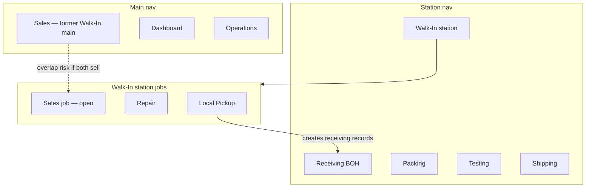

# Front-of-house / back-of-house surface split

**Status:** Planning — refine before build  
**Created:** 2026-07-16  
**Related:**
- [studio-driven-operator-surfaces-refactor-plan.md](./studio-driven-operator-surfaces-refactor-plan.md)
- [display-convergence-log.md](./display-convergence-log.md)
- [../master-connections-and-refactor/staff/06-local-pickup.md](../master-connections-and-refactor/staff/06-local-pickup.md)

This is a **design inventory**, not an implementation ticket. Use it to refine product decisions, spot reuse, and cut overlap before writing code.

---

## Locked product direction

| Decision | Lock |
|---|---|
| Walk-In station | **Dedicated station-division** item in master nav (peer of Receiving / Packing / Testing / Shipping) |
| Current main "Walk-In" (`/walk-in`) | **Rename to Sales**, stay under **main** |
| Receiving | BOH only: Incoming · Triage · Unbox (labeling / processing / putaway handoff) — **no** Walk-In mode pill |
| History chrome | Lifecycle facets **Scanned · Unboxed** via `WorkbenchChromeHeader` (same law as Dashboard To Ship · Packed · Shipped) |
| Walk-In vs Receiving History | **Keep separate domains** forever |

### Explain 1b (own station item)

**1b** = Walk-In as a first-class `kind: 'station'` nav entry — same band as Receiving / Packing — **without** collapsing history into that station.

- **Station division** = operator benches (scan/intake work). Walk-In counter (Local Pickup intake, Repair intake, optional Sales cart) belongs here.
- **Main division** = monitors / rollups / commerce hubs. Renaming today’s `/walk-in` history hub to **Sales** keeps a main entry for front-desk commerce browse — but only if that page’s job becomes sales-scoped (see open decisions).

What “own station item” is *not*:

- Not a Receiving mode pill (`RECEIVING_MODE_ITEMS` `pickup`).
- Not tabs inside Dashboard outbound.
- Not only a `/pickup` deep link with no nav identity.

Coupling it fixes today: `/pickup` still mounts via `ReceivingSurfacePage`, route key resolves to `receiving`, and page gate is `receiving.view` while APIs already use `walk_in.*`.

---

## Target IA (proposed, still refinable)

### Receiving (station) — after cleanup

Modes: **Incoming · Receiving (triage) · Unbox** only.

Remove from rail: History, Walk-In (`pickup`).

### Walk-In (station) — new first-class surface

- Route: keep `/pickup` for stability **or** promote `/walk-in/station` with redirects (open).
- Jobs via existing SoT `src/lib/walk-in/jobs.ts`: Local Pickup · Repair · (Sales — open).
- Shell: **stop** using `ReceivingSurfacePage`; mount `WalkInStationSidebar` + `WalkInStationPane` under own page shell (`RouteShell` or dedicated station shell).
- Permissions: page gate → `walk_in.view` / `walk_in.intake` (not `receiving.view`).
- SURFACE_REGISTRY: new or retargeted key with `pageKey` ≠ `receiving`.

### Sales (main) — former Walk-In main

- Nav: `id` likely `sales` (or keep `walk-in` id with label Sales — open for deep-link stability).
- Href: keep `/walk-in` or move to `/sales` with redirects (open).
- Content: today `WalkInHistoryHub` is **Repairs · Sales · Pickups** categories. Renaming to Sales implies **narrowing or relocating** repair/pickup history (open).

### Inbound History (Monitor) — placement still open (2a–d)

Chrome pattern is locked (Scanned · Unboxed tabs). **Route home** is comparative below.

---

## History home options (all kept open — refine before build)

| Option | Route | Pros | Cons | Reuse |
|---|---|---|---|---|
| **2a** Keep `/receiving/history` | same URL | Lowest churn; already graduated Monitor; `SurfaceGate('history')` | Still under “receiving” URL family; easy to re-add to Receiving rail by mistake | Promote sort chips → `WorkbenchChromeHeader`; drop from `RECEIVING_MODE_ITEMS` |
| **2b** New `/inbound` | new semantic route | Clear BOH monitor noun; matches FOH/BOH split | New SURFACE_REGISTRY key, redirects, mobile rewrite, nav entry | Same table + chrome as 2a |
| **2c** `/dashboard` Inbound domain | beside Outbound tabs | One Ops hub | Mixes inbound cartons with outbound orders; needs domain switcher; permission mashup | Reuse `DashboardScrollShell` / header; **not** outbound tables |
| **2d** Defer | — | Decide after Walk-In graduation | Risk of History staying as Receiving mode forever | — |

**Recommendation to challenge later:** start with **2a** (chrome + remove from rail), then rename route to **2b** if URL semantics matter. Avoid **2c** unless you explicitly want a unified Ops Dashboard product.

Do **not** merge with Walk-In/Sales history — different APIs and jobs.

---

## Component reuse map (compose, don’t fork)

### Walk-In station — reuse as-is

| Asset | Path | Note |
|---|---|---|
| Job SoT | `src/lib/walk-in/jobs.ts` | `WALK_IN_JOB_ITEMS`, `walkInStationHref` |
| Station panes | `WalkInStationPane`, `WalkInStationSidebar`, `WalkInJobSwitcher` | Already extracted; only mount path is wrong |
| Sales bodies | `SalesEditPanel`, `SalesCartSidebar`, `salesCartStore` | Candidate for Main Sales **and/or** station job |
| Local pickup | `LocalPickupEditPanel`, `LocalPickupSidebarList`, `localPickupStore` | Stay on Walk-In station |
| Repair | `RepairTable`, `RepairSidebarPanel` (embedded) | Stay on Walk-In station |
| History categories | `src/lib/walk-in/history-categories.ts` | Today powers main `/walk-in`; must be reassigned when that page → Sales |

### Receiving BOH — keep, slim

| Asset | Path | Note |
|---|---|---|
| Mode switcher items | `receiving-sidebar-shared.ts` `RECEIVING_MODE_ITEMS` | Drop `pickup` + `history` |
| Mode URL hook | `useReceivingMode.ts` | Remove graduated pickup/history branches after split |
| Unbox / Triage / Incoming | existing surfaces | Unchanged jobs |

### Inbound History chrome — compose Dashboard recipe

| Asset | Path | Note |
|---|---|---|
| Shell | `DashboardScrollShell` | Chrome slot + scroll body |
| Header primitive | `WorkbenchChromeHeader` | Tabs left · search · filters · portal |
| Golden sibling | `OutboundWorkspaceHeader` | Copy pattern, not outbound data |
| Sort SoT | `HISTORY_SORT_OPTIONS` in `receiving-modes.ts` | Promote `scanned_newest` / `unboxed_newest` to tab ids |
| Table | `ReceivingLinesTable` + history descriptor | Keep `view=activity` |
| Search params | `receiving-history-search.ts` | `rh_q` / `rh_field` / `rh_scope` + `sort` |
| Sidebar search today | `ReceivingHistorySearchSection` | Relocate into chrome `search` / `right` |

### Shared layout (already cross-domain)

- `RouteShell`
- `WorkbenchTablePane`
- Facet-vs-mode law in `display-convergence-log.md`

### Do **not** reuse for the wrong job

| Temptation | Why not |
|---|---|
| `ReceivingSurfacePage` for Walk-In station | Brings Receiving mode rail + mobile unbox feed |
| Outbound order tables for inbound History | Wrong domain / APIs |
| Walk-In category slider for Scanned/Unboxed | Different chrome + data |
| Stuffing Local Pickup + Repair into Receiving modes | Wrong archetype (Workbench vs Station) |

---

## Overlap register (resolve before build)

| Overlap | Conflict | Resolve in planning |
|---|---|---|
| **Sales ×2** | Station job `sales` vs Main nav **Sales** page | Pick: Sales only main; only station job; or main = history/monitor and station = intake cart |
| **Walk-In history categories** | `/walk-in` today = repairs + sales + pickups | If main → Sales: where do Repair/Pickup **history** live? |
| **Two “Walk-In” labels** | Receiving mode pill + main Walk-In | Fixed by removing Receiving pill + station item |
| **Permission mismatch** | Page `/pickup` = `receiving.view`; APIs = `walk_in.*` | Station page must use `walk_in.*` |
| **Mobile rewrite** | `/pickup` → `/m/receiving` | Need walk-in mobile or intentional keep |
| **Local pickup → receiving** | Domain handoff creates receiving rows | Keep data link; break **UI** coupling only |
| **History in Receiving rail** | Monitor next to scan modes | Remove from `RECEIVING_MODE_ITEMS`; chrome owns facets |
| **`/repair` redirect** | → `/pickup?job=repair` | Keep after station graduation; update nav active key |
| **Nav id rename** | `walk-in` → `sales` breaks bookmarks / tests | Prefer label change first, id migrate later |

---

## Open decisions checklist

1. **Sales placement:** Main Sales only vs also `?job=sales` on Walk-In station.
2. **Repair / Pickup history home** after main becomes Sales.
3. **Station route:** keep `/pickup` vs `/walk-in/station` (or `/walk-in` station + `/sales` main).
4. **Inbound History route:** 2a / 2b / 2c (see table).
5. **Kiosk layout:** later `?layout=kiosk` / floor density on Walk-In station — phase N.
6. **SURFACE_REGISTRY:** add `walk_in` / `sales` keys vs overload `pickup`.
7. **Master-nav ModeRail for Walk-In station:** jobs as L2 modes vs in-page `WalkInJobSwitcher` only.

---

## Planning todos

Expand each section below before implementation. Check off when the planning artifact is written (not when code ships).

### TODO-1 — Freeze open decisions

**Status:** pending

**Deliverable:** One-page decision record answering items 1–7 in Open decisions checklist.

**Details to add:**

- Sales vs Walk-In station job boundary (one sentence).
- Chosen History route (2a / 2b / 2c).
- Repair/pickup history home after main → Sales.
- Station canonical route + redirect list.
- SURFACE_REGISTRY key names.
- ModeRail vs in-page job switcher.

**Owner decision log:**

| Question | Decision | Rationale |
|---|---|---|
| | | |

---

### TODO-2 — Nav + permission blueprint

**Status:** pending

**Deliverable:** Paper diff for `sidebar-navigation.ts` + permission matrix + redirect matrix.

**Details to add:**

- `APP_SIDEBAR_NAV`: new `kind: 'station'` Walk-In entry; main `walk-in` → label **Sales**.
- `SIDEBAR_PAGE_NAV` / `MASTER_NAV_RAIL_PAGES` mode configs.
- `getSidebarRouteKey('/pickup')` → new key (not `receiving`).
- Route permission prefixes: `/pickup` → `walk_in.view`.
- Redirect matrix: `/receiving?mode=pickup`, `/repair`, `/walk-in?category=`, `/walk-in?mode=sales`.

**Files to touch (when building):**

- `src/lib/sidebar-navigation.ts`
- `src/lib/stations/surface-keys.ts`
- `src/proxy.ts`

---

### TODO-3 — Shell extraction blueprint

**Status:** pending

**Deliverable:** Page tree showing Walk-In station without `ReceivingSurfacePage`.

**Details to add:**

- New page component (e.g. `WalkInSurfacePage`) composing `RouteShell` + `WalkInStation*`.
- What stays on `ReceivingSurfacePage` only.
- Mobile: stop `/pickup` → `/m/receiving` rewrite or define `/m/walk-in`.
- Realtime invalidation scopes per job.

**Reuse:**

- Compose: `WalkInStationPane`, `WalkInStationSidebar`, `RouteShell`
- Delete mount path: `ReceivingDashboard` pickup branch, `ReceivingSidebarPanel` pickup branch

---

### TODO-4 — Inbound History chrome blueprint

**Status:** pending

**Deliverable:** Spec for `InboundWorkspaceHeader` (name TBD) + History removed from receiving rail.

**Details to add:**

- Tab ids → `HISTORY_SORT_OPTIONS` / `normalizeHistorySort`.
- Search/filter relocation from `ReceivingHistorySearchSection` to `WorkbenchChromeHeader` slots.
- `DashboardScrollShell` composition on History page.
- Confirm `RECEIVING_MODE_ITEMS` + receiving `modes[]` drop `history`.
- Nav entry for History (if not only deep link).

**Reuse:**

- Compose: `OutboundWorkspaceHeader` pattern, `ReceivingLinesTable`, history descriptor

---

### TODO-5 — Pre-build audit

**Status:** pending

**Deliverable:** Grep checklist + test list; reuse map marked Compose / Relocate / Delete.

**Details to add:**

- Grep targets: `mode=pickup`, `RECEIVING_MODE_ITEMS`, `getSidebarRouteKey('/pickup')`, `SurfaceGate.*pickup`, mobile rewrite.
- Tests: `sidebar-navigation.test.ts`, `surface-keys.test.ts`, walk-in / repair e2e.
- Mark each asset in reuse map: **Compose** | **Relocate** | **Delete**.

**Explicit non-goals until chosen:**

- Kiosk UI
- Dashboard inbound domain (unless 2c chosen)
- Merging Walk-In history with Receiving History

---

## Success criteria for “plan ready to build”

- [ ] Sales vs Walk-In station job boundary written in one sentence.
- [ ] History route option chosen (2a/2b/2c).
- [ ] Every row in Overlap register has an owner decision.
- [ ] Reuse map marked Compose / Relocate / Delete for each asset.
- [ ] No new parallel primitives proposed (headers compose `WorkbenchChromeHeader`; station reuses `WalkInStation*`).

---

## Suggested implementation phases (after planning freeze)

1. **Phase 0** — Decision freeze (this doc TODO-1).
2. **Phase 1** — Nav + permission (TODO-2).
3. **Phase 2** — Shell extraction (TODO-3).
4. **Phase 3** — Inbound History chrome (TODO-4).
5. **Phase 4** — Pre-build audit (TODO-5) → then implementation tickets.
