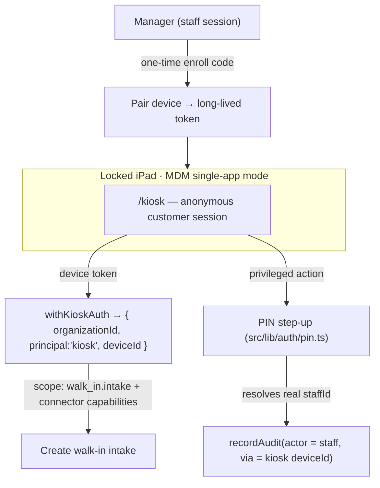

# 06 — Walk-In kiosk: unattended device auth

**Status:** ✅ Built (code-complete) 2026-07-17 — `npm run verify` green. Migration
`2026-07-17_kiosk_devices.sql` is **UNAPPLIED** (run `npm run db:migrate`); runtime
acceptance pending a real DB + a tablet. The kiosk **forms + Square/Zoho/Ecwid wiring
remain doc 03's** (non-goal here — this doc shipped the auth model only).
**Created:** 2026-07-17
**Parent:** [../foh-boh-surface-split-plan.md](../foh-boh-surface-split-plan.md)
**Build order:** after [05](./05-nav-permission-redirects.md) (new route key + gate) and alongside
[03](./03-sales-main-history.md) (the kiosk's forms + platform wiring)

The customer-facing intake tablet. This doc **owns the auth model** for it — how a public iPad
runs without a staff member signed in — and nothing else (the forms themselves + Square/Zoho/Ecwid
wiring live in [03](./03-sales-main-history.md)).

## What this resolves

Settles two things left open in the parent plan:

| Parent item | Resolution |
|---|---|
| **Conflict #1** — Sales = kiosk form vs Sales = history hub | **Both, split by surface.** `/walk-in` (Sales) stays the **staff transaction-history monitor** (`WalkInHistoryHub`). The **customer intake form is a separate route** (`/kiosk`), not `/walk-in`. |
| **Open decision #1** — who holds the iPad | **The customer.** The tablet authenticates **as a device principal**, never as a staff member. Staff step up with a PIN only for privileged actions. |

> This **refines parent R2**: R2 said "`/walk-in` Sales → sidebar-less kiosk form." Corrected — `/walk-in`
> keeps its history job; the kiosk is a new, separately-authed surface.

## The core rule (industry standard)

**A public tablet is never signed in as a person.** It authenticates as *itself* — a provisioned,
org-scoped **device principal** — and the customer using it runs in an **anonymous session on top of
that device credential**. A real staff member only appears for the brief privileged moments, via the
existing PIN, so the audit log attributes those actions to a human.

Leaving a shared staff login on the tablet is the anti-pattern this exists to prevent: it leaks that
employee's full permissions to anyone who walks up, and makes every action look like it was them.

### The three models, and the blend we pick

| Model | Base identity | Who "logs in" | Exemplars |
|---|---|---|---|
| Unattended self-service | Device principal | Nobody (customer anonymous) | Airport check-in (CUSS), patient check-in (Epic Welcome, Phreesia) |
| Attended terminal + staff PIN | Device / location principal | Staff PIN to attribute each action | Square Register, Toast, Clover |
| Anonymous + step-up | Anonymous session | Staff PIN only at privileged moments | Most retail intake kiosks |

**Chosen: attended-blend.** Device is the principal; the customer session is anonymous; **staff step up
with a PIN** (refund, approve repair, price override) so those writes carry a real `staffId`.

Underlying standards, for reference: OAuth 2.0 **device authorization grant** (RFC 8628) for pairing a
keyboard-less screen; **client-credentials grant** for the device's ongoing machine identity; **MDM
single-app / kiosk mode** (iOS Guided Access / Autonomous Single App Mode; Android COSU; Windows
Assigned Access) to lock the tablet to the one URL.

## Current state (verified 2026-07-17)

| Concern | State | Note |
|---|---|---|
| Staff PIN primitive | ✅ exists | `src/lib/auth/pin.ts`, `/api/auth/pin`, `/api/auth/pin/create` — **reuse as the step-up** |
| `walk_in.intake` permission | ✅ exists | `permission-registry.ts` — the kiosk principal's scope target |
| Session shape | staff-based | `{ organizationId, staffId }` (`current-user.ts`, `auth-context.ts`) — the kiosk needs a **non-`staffId`** principal |
| Device / kiosk principal | ❌ none | greenfield — this doc's core deliverable |
| `/walk-in` page | `WalkInHistoryHub` | ✅ correct for the **history** side; unchanged by this doc |
| Kiosk route | ❌ none | new `/kiosk` (recommended) — see P1 |

## Target architecture

- **Device principal, capability-scoped.** A `withKioskAuth` gate resolves the device token to
  `{ organizationId, principal: 'kiosk', deviceId }` with permissions limited to `walk_in.intake` plus
  the connector capabilities the forms need (payment / stock / storefront). It is **not** a `staffId`
  and cannot reach any staff surface.
- **Separate route.** `/kiosk` — gated by the device token, never renders staff nav, cannot resolve a
  staff-only page. `/walk-in` (Sales history) stays behind normal staff sign-in + `walk_in.view`. A
  top-level `/kiosk` is cleanest for MDM URL-lock (`/walk-in/kiosk` is the alternative).
- **Anonymous customer session.** The customer fills the form; the **device token** authorizes the
  write, not the customer. Customer phone/email is *data*, not an auth principal.
- **PIN step-up for privileged moments.** Reuse `src/lib/auth/pin.ts`: a privileged action prompts for
  a staff PIN, resolves the real `staffId`, and `recordAudit` attributes it to that person (with the
  `deviceId` as `via`). Base intake stays anonymous.
- **Provisioning = manager-enrolled, once.** A manager (staff session) mints a one-time enrollment code;
  the tablet exchanges it for a long-lived, revocable device token stored on-device. No human login
  after that. Mirrors Square terminal pairing.
- **Platform writes via capability facades** (shared with [03](./03-sales-main-history.md)): Square /
  Zoho / Ecwid behind `getInventoryProvider` / capability facades — **never** direct vendor imports,
  and product copy uses capability nouns, never hardcoded brand sentences (AGENTS.md → Integrations).

## Data model (new table — follows the polymorphic/tenant-from-birth contract)

`kiosk_devices` — one row per enrolled tablet. Per
[`.claude/rules/polymorphic-tables.md`](../../../.claude/rules/polymorphic-tables.md):

- `organization_id UUID NOT NULL` (no DEFAULT) + `enforce_tenant_isolation('kiosk_devices')` in the
  **same migration** — tenant-from-birth, FORCE RLS.
- `id BIGSERIAL`; `device_token_hash` (never store the raw token); `status` via a **named CHECK**
  (`enrolled` / `active` / `revoked`); `label`, `last_seen_at`, `enrolled_by_staff_id`, timestamps.
- Org-led indexes (`(organization_id, status)`, unique on `(organization_id, device_token_hash)`).
- **Model it in Drizzle in the same PR** (`src/lib/drizzle/schema.ts`).

Enrollment codes are short-lived, single-use (reuse the device-grant shape); the token exchange
happens once and returns the long-lived device credential.

## Phases

- [x] **P1** — Route + gate. `src/app/kiosk/page.tsx` (chromeless — added to `proxy.ts` `PUBLIC_PATHS`
  + `AuthContext` `CLIENT_PUBLIC_PATHS`, no staff nav) + `src/lib/auth/withKioskAuth.ts` resolving a
  device token → `{ organizationId, principal:'kiosk', deviceId }`. No `SidebarRouteKey` added.
  `withKioskAuth` registered as a recognized gate in `scripts/audit-route-auth.ts`.
- [x] **P2** — `src/lib/migrations/2026-07-17_kiosk_devices.sql` (tenant-from-birth, pre-auth identity
  table like `staff_sessions`) + `kioskDevices` Drizzle model. Code + token hashed at rest (SHA-256).
  **Migration UNAPPLIED** — run `npm run db:migrate`.
- [x] **P3** — Enrollment flow. New `walk_in.enroll_kiosk` permission gates `POST /api/kiosk/enroll`
  (mint code) + `POST /api/kiosk/revoke`; `POST /api/kiosk/pair` (public, code-capability) exchanges
  the code for a device token + sets the `cf_kiosk` cookie.
- [x] **P4** — PIN step-up wiring. `resolveKioskStepUp()` reuses `verifyStaffPin`; a privileged intake
  (`staffId` + `pin` on the body) resolves the real `staffId` and `recordAudit` records
  `{ actor: staffId (stepped-up), via: kiosk_device:<id> }`. Base intake stays anonymous.
- [x] **P5** — Capability-scoped write path. `POST /api/kiosk/intake` runs under the device principal
  via `withTenantTransaction(organizationId, …)`. **Seam:** the real intake persistence +
  Square/Zoho/Ecwid capability-facade calls are [03](./03-sales-main-history.md)'s to compose on top.
- [x] **P6** — Lockdown guidance: [`docs/security/kiosk-device-lockdown.md`](../../security/kiosk-device-lockdown.md)
  (MDM single-app mode / Guided Access pinned to `/kiosk`; ops runbook, not app-enforced).

## Reuse map (compose, don't fork)

| Asset | Path | Mark |
|---|---|---|
| PIN step-up | `src/lib/auth/pin.ts` + `/api/auth/pin` | **Compose** (P4) |
| Route auth pattern | `withAuth` / `withTenantTransaction` / `recordAudit` (backend-patterns) | **Extend** — new `withKioskAuth` sibling (P1) |
| Permission scope | `walk_in.intake` (registry) | **Compose** (P5) |
| Connector facades | `getInventoryProvider`, capability facades | **Compose** — shared with 03 (P5) |
| New table contract | `.claude/rules/polymorphic-tables.md` | **Follow** (P2) |

**Do not fork:** a second auth stack for the kiosk (extend the `withAuth`/`Deps` pattern with a device
principal); a bespoke step-up (the PIN primitive already exists); direct Square/Zoho/Ecwid imports in
the kiosk (capability facades only).

## Security notes

- **Least privilege** — the device principal holds `walk_in.intake` + named connector capabilities and
  nothing else. It can create an intake; it cannot read the staff dashboard, other customers' history,
  or any admin surface.
- **Audit integrity** — ordinary intake is attributed to the `deviceId`; privileged writes carry the
  stepped-up `staffId`. **Nothing is ever attributed to a shared human account** — the whole point.
- **Revocation** — a lost/retired tablet is a single `kiosk_devices.status = 'revoked'`; the token dies
  server-side, no password rotation across staff.
- **Payment path (Square)** — keeping the device off any staff session and scoped tight is the
  PCI-adjacent hygiene reason this matters most on the intake→payment flow.
- **Tokens live only in `organization_integrations`** for the connectors (existing SoT); the device
  token is a separate, hashed `kiosk_devices` credential — **not** a new home for vendor tokens.

## Open questions

1. ✅ **Route** — **`/kiosk`** (top-level, cleanest MDM lock). Built.
2. ✅ **Enrollment permission** — **new `walk_in.enroll_kiosk`** (registry). Built.
3. ✅ **Device token lifetime + rotation** — **long-lived, server-side revoke only** (`kiosk_devices.status`);
   the `cf_kiosk` cookie sits near the 400-day browser ceiling. Periodic refresh not added (revoke is instant).
4. **Which actions require step-up** — the wiring exists (`resolveKioskStepUp` + a hard `403 STEPUP_FAILED`);
   **which** actions demand it (every payment vs exceptions only) is doc 03's per-form decision. Square's
   model — base sale device-authed, refunds need a person — is the recommended default.
5. **Offline** — does the kiosk queue an intake when the network drops (station degrade-not-block), or
   hard-require connectivity for the payment leg?

## Acceptance

- [ ] A tablet with a valid device token loads `/kiosk` with **no staff session**; an expired/revoked
  token is refused.
- [ ] `/kiosk` cannot resolve any staff-only route (nav + `withAuth` guards verified).
- [ ] An intake created from the kiosk is stamped with `organization_id` + `deviceId`; a privileged
  action records the stepped-up `staffId` via the PIN flow.
- [ ] `kiosk_devices` passes the tenancy audit (FORCE RLS, org-led keys) and is modeled in Drizzle.
- [ ] Revoking a device immediately blocks its token.

## Verify

`npm run verify` (route-auth drift + enforce for the new gate, tenancy audit for `kiosk_devices`,
schema drift). Add unit tests for `withKioskAuth` (device-principal resolution, scope denial) using the
`Deps`-injection pattern (DB-free), mirroring `backend-patterns.md`.

## Non-goals

- The kiosk **forms** and Square/Zoho/Ecwid wiring — those are [03](./03-sales-main-history.md).
- A `/m/walk-in` mobile shell (parent R6, deferred).
- Kiosk **hardware/layout** polish (parent Phase 0 #6, deferred) — this doc is auth only.

---

## Addendum — host split (2026-07-23)

Public tablet URL is now **`https://{slug}.kiosk.app.cycleforge.ai`** (dogfood:
`https://usav.kiosk.app.cycleforge.ai`). Same deploy; `proxy.ts` allowlists the
kiosk host to intake UI + device APIs only. Path `/kiosk` remains the internal
route (`/` on the kiosk host rewrites to it). Staff-host `/kiosk` 308s to the
tenant kiosk origin when a slug is present.

- Host SoT: `src/lib/tenancy/kiosk-host.ts`
- Ops runbook (MDM + DNS): [`docs/security/kiosk-device-lockdown.md`](../../security/kiosk-device-lockdown.md)
- Human DNS gate: HUMAN-TODO §J7b (`*.kiosk.app.cycleforge.ai`)

Org for writes is still the device row; pairing additionally rejects enroll-code
org ≠ host-slug org. `cf_kiosk` stays host-only — re-pair after cutover.
