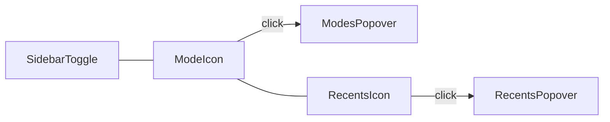

# Header mode switcher — Unbox/Receiving pilot handoff

**Self-contained.** A new session needs only this file. Paste:

> Read `docs/todo/header-mode-switcher-UNBOX-HANDOFF.md` and start at §3.

**Companion, not replacement.** Row H of
[`dashboard-ia-rework-HANDOFF.md`](dashboard-ia-rework-HANDOFF.md) ratified a **persistent
in-sidebar L2 rail** and shipped it across the ten panels. This prompt **supersedes that shape for
the Receiving family only** — Option A (Linear/Notion density: collapsed GlobalHeader icons). House-
wide rollout is a **later** prompt once Unbox design is ratified in-browser. Do not treat this as a
half-done house flip.

**Status as of 2026-07-30:** **House-wide.** Mode + Recents in `GlobalHeader` for every
modeful `SIDEBAR_PAGE_NAV` page; sidebar L2 rails removed; MasterNav spine MRU chips
removed. SoT: `workbench.md` + `source-of-truth.md` + `HeaderModeSwitcher` /
`HeaderRecentsSwitcher`. This Unbox pilot handoff is historical — implementers should
treat the house SoT as current, not re-run a Receiving-only experiment.

---

## 0. The four things to internalise

1. **Shape A is two adjacent GlobalHeader icons** after the sidebar toggle — **Mode** (this page's
   L2) and **Recents** (cross-page MRU, collapsed by default). Closed = 32px icon; open =
   `AnchoredLayer` menu. No full-width pill band.
2. **Scope v1 = Receiving family only.** Surfaces that mount
   [`ReceivingModeSwitcher`](../../src/components/sidebar/receiving/ReceivingModeSwitcher.tsx) via
   [`ReceivingSidebarPanel.tsx`](../../src/components/sidebar/ReceivingSidebarPanel.tsx) —
   `/unbox`, `/triage`, `/incoming`, `/pickup`, `/repair`, etc. **Do not** strip Outbound / Products
   / Tech / … rails yet.
3. **One control surface, not two.** When the header Mode icon is mounted, hide the sidebar
   `ReceivingModeSwitcher`. Never leave both rails live on the same route.
4. **Modes are path-based.** Incoming / Arrival / Unbox / Local Pickup / Repair each own a route
   (`/incoming`, `/triage`, `/unbox`, `/pickup`, `/repair`). Navigate via SoT `to()` targets (or the
   existing `updateMode` helper that already resolves those paths) — never a fake `?mode=` toggle on
   a single path.

---

## 1. Decisions locked — do not re-open

| Decision | Verdict |
|---|---|
| Shape | **A** — Mode + Recents GlobalHeader icons (Linear/Notion density) |
| Scope v1 | Receiving route key / pathname family only |
| Aesthetic | Closed = active-mode icon (32px hit); open = `AnchoredLayer` popover. No pill band |
| Sidebar rail | Hide `ReceivingModeSwitcher` when header control mounts |
| Other panels | Leave their persistent rails alone |
| `workbench.md` | Provisional Receiving exception note only — **no** house-wide rewrite |
| Follow-up | System-wide header rollout = separate handoff after Unbox is browser-ratified |

Research / prior context (read only if trapped): Row H verdict in
[`dashboard-ia-rework-HANDOFF.md`](dashboard-ia-rework-HANDOFF.md) §3.2;
[`dashboard-ia-research-briefing-HKL.md`](dashboard-ia-research-briefing-HKL.md).

---

## 2. Traps that will cost you a session

- **Row H just enabled rails.** Call sites and docs still say "persistent rail." Unbox is the
  deliberate pilot that *reverses* that for one family. Do not "finish Row H" by deleting every
  panel's rail, and do not leave Receiving with both shapes.
- **Station sidebar may be hidden by default.** Modes must work with the nav spine closed — the
  GlobalHeader is always visible. If Mode only lives in the sidebar, operators cannot switch
  surfaces when the spine is collapsed. That is the entire point of moving L2 into the header.
- **Receiving modes are path-based**, not only `?mode=`. `SIDEBAR_PAGE_NAV` receiving `to()` targets
  land on `/incoming` · `/triage` · `/unbox` · `/pickup` · `/repair`. A header control that only
  mutates `?mode=` on `/unbox` is wrong. Reuse `useReceivingMode().updateMode` or the same
  `applyModeTarget` / mode `to()` path the sidebar already uses.
- **Stale `ReceivingModeSwitcher` docblock** still mentions MasterNav gating ("Hidden when the
  master-nav dropdown is enabled"). Ignore it — MasterNav L2 (`ModesPanel` / `MasterNavProvider`) is
  already gone. The rail is always-on today; this prompt replaces it for Receiving only.
- **Verify claims by call sites, not docblocks.** Same lesson as the IA rework: a component that
  documents itself as gated may no longer be.
- **E2E expects the rail.** `tests/e2e/sidebar-nav-column.spec.ts` asserts
  `main [aria-label="Receiving mode"]` on `/unbox`. Update that assertion for the header control
  (Receiving family only) — do not weaken unrelated panel rail tests.

---

## 3. What to build — start here

### 3.1 `HeaderModeSwitcher` (SoT)

New component (suggested home: `src/components/layout/HeaderModeSwitcher.tsx` or
`src/components/sidebar/receiving/` if you keep Receiving-specific wiring colocated — pick one
concern, do not fork).

**Mount:** in [`GlobalHeader.tsx`](../../src/components/layout/GlobalHeader.tsx) left cluster
(`HEADER_ICON_CLUSTER`), **immediately after** the sidebar toggle, **only** when the active route
key is `receiving` (or pathname family `/unbox` | `/triage` | `/incoming` | `/pickup` | `/repair` |
legacy `/receiving/*`). Use the same route-key resolver the shell already uses
([`resolveSidebarRouteKey` / receiving prefixes in `sidebar-navigation.ts`](../../src/lib/sidebar-navigation.ts)).

**Closed face:** 32px `IconButton` showing the **active mode's** SoT icon (from
`RECEIVING_MODE_ITEMS` / `RECEIVING_MODE_ICONS`). Tooltip = active mode label. Match existing header
icon tokens (`HEADER_ICON_WRAP`, `HEADER_ICON_BTN_CLASS`, `TOP_CHROME_ICON_GLYPH`) — mirror
[`HeaderGoalChip`](../../src/components/layout/HeaderGoalChip.tsx).

**Open:** `AnchoredLayer` popover listing Incoming · Arrival · Unbox · Local Pickup · Repair from
[`RECEIVING_MODE_ITEMS`](../../src/components/sidebar/receiving/receiving-sidebar-shared.ts).
Selecting a row navigates via existing `updateMode` / mode `to()` targets — **do not** invent a
second navigation path.

**Data:** same URL SoT [`ReceivingSidebarPanel`](../../src/components/sidebar/ReceivingSidebarPanel.tsx)
already uses — `useReceivingMode()` (or equivalent read of
[`SIDEBAR_PAGE_NAV` receiving `resolveMode`](../../src/lib/sidebar-navigation.ts)). One mode
truth; header and (hidden) rail must not diverge.

### 3.2 `HeaderRecentsSwitcher`

Same left cluster, immediately after Mode. **Closed** = history / clock icon (collapsed by
default — no always-visible MRU chips in the header). **Open** = list from
[`useRecentModes`](../../src/components/sidebar/master-nav/useRecentModes.ts). Reuse the chip /
navigation resolution pattern from
[`MasterNav.tsx`](../../src/components/sidebar/master-nav/MasterNav.tsx) +
[`MasterNavHeader`](../../src/components/sidebar/master-nav/MasterNavHeader.tsx) (page+mode →
`useSidebarModeNav` / `handleNavigate`). Exclude the current page+mode. Cap at `MAX_RECENT_MODES`.

Do not re-implement localStorage; `useRecentModes` is the SoT. MasterNav may still push recents —
header reads the same store.

### 3.3 Hide the sidebar Receiving mode rail

When the header Mode control is mounted on a Receiving route, **do not render**
[`ReceivingModeSwitcher`](../../src/components/sidebar/receiving/ReceivingModeSwitcher.tsx) in
`ReceivingSidebarPanel`. One shape: route-key / pathname gate (or a single shared helper used by
both GlobalHeader and the panel). Prefer the route check over a new feature flag unless you need a
temporary kill switch — if you add a flag, it must gate **both** mount points so you never get
rails + header together.

### 3.4 What not to touch in v1

- Other panels' mode rails (Outbound, Products, Tech, Inventory, …).
- Permanent rewrite of [`.claude/rules/display/workbench.md`](../../.claude/rules/display/workbench.md)
  — at most a short **provisional Receiving exception** ("Receiving L2 lives in GlobalHeader for the
  pilot; other workbenches keep the sidebar rail until the rollout handoff"). Full house law rewrite
  waits for the system-wide prompt.
- Admin / dashboard rails, MasterNav L1 page switching, saved views.

### 3.5 Verify

1. Attach to the user's `:3050` — never start/restart the dev server.
2. Browser-check `/unbox` (and spot-check `/incoming`, `/triage`):
   - No full-width mode strip in the receiving sidebar header.
   - GlobalHeader shows Mode + Recents icons after the sidebar toggle.
   - Mode popover lists the five receiving modes; selecting navigates to the correct path.
   - With sidebar **collapsed**, Mode still works.
   - Recents opens collapsed-by-default; jumping to a recent works.
3. Update E2E that expected the receiving rail in `sidebar-nav-column` for this family only
   (`tests/e2e/sidebar-nav-column.spec.ts` — `/unbox: persistent L2 mode rail…`). Assert the header
   control instead; leave other panels' rail expectations intact.
4. `npm run verify` green before claiming done.

---

## 4. Source-of-truth map (link, do not restate)

| Concern | SoT |
|---|---|
| Receiving L2 mode list + labels/icons | [`RECEIVING_MODE_ITEMS`](../../src/components/sidebar/receiving/receiving-sidebar-shared.ts) |
| Path `to()` / `resolveMode` | [`SIDEBAR_PAGE_NAV` receiving entry](../../src/lib/sidebar-navigation.ts) |
| URL ⇄ mode + `updateMode` | [`useReceivingMode`](../../src/components/sidebar/receiving/useReceivingMode.ts) |
| Today's sidebar rail (hide in v1) | [`ReceivingModeSwitcher`](../../src/components/sidebar/receiving/ReceivingModeSwitcher.tsx) · mount in [`ReceivingSidebarPanel`](../../src/components/sidebar/ReceivingSidebarPanel.tsx) |
| Header left cluster | [`GlobalHeader`](../../src/components/layout/GlobalHeader.tsx) · tokens in `header-shell` |
| Icon+AnchoredLayer precedent | [`HeaderGoalChip`](../../src/components/layout/HeaderGoalChip.tsx) |
| Cross-page MRU store | [`useRecentModes`](../../src/components/sidebar/master-nav/useRecentModes.ts) |
| MRU chip resolve + navigate | [`MasterNav`](../../src/components/sidebar/master-nav/MasterNav.tsx) · [`MasterNavHeader`](../../src/components/sidebar/master-nav/MasterNavHeader.tsx) |
| Route key `receiving` | `resolveSidebarRouteKey` / receiving path prefixes in `sidebar-navigation.ts` |

Compose from these. Do not fork a page-local mode list or a second recents store.

---

## 5. Adjacent / out of scope

- **System-wide rail → header rollout** — separate handoff after Unbox is ratified in-browser.
  That prompt will update `workbench.md` house-wide and migrate remaining panels.
- **Row G** (`/search` results) and other IA backlog — stay on
  [`dashboard-ia-rework-HANDOFF.md`](dashboard-ia-rework-HANDOFF.md).
- URL isolation for non-receiving surfaces — [`nav-routing-refactor-FINISH-PROMPT.md`](nav-routing-refactor-FINISH-PROMPT.md).

---

## 6. Definition of done

- [x] `HeaderModeSwitcher` mounts on Receiving routes only, after sidebar toggle in `GlobalHeader`
- [x] Closed face shows active mode icon; open lists `RECEIVING_MODE_ITEMS`; select navigates via SoT
- [x] `HeaderRecentsSwitcher` mounts beside Mode; closed by default; open uses `useRecentModes`
- [x] `ReceivingModeSwitcher` is **not** rendered when the header Mode control is mounted
- [x] Other panels' persistent rails unchanged
- [x] Modes work with sidebar collapsed
- [ ] `/unbox` (and family) browser-checked on `:3050` *(implementer: attach + ratify)*
- [x] Receiving-family E2E updated; other rail E2E untouched
- [x] At most a provisional Receiving exception note in `workbench.md` (optional); no house rewrite
- [x] `npm run verify` green
- [x] Stop — do not start system-wide rollout in this session

---

## 7. Hard constraints

- **Receiving-only.** No Outbound/Products/… rail deletion. No house-wide `workbench.md` rewrite.
- **One L2 surface per Receiving route** — header XOR sidebar rail, never both.
- **Navigate via SoT** (`updateMode` / mode `to()` / `applyModeTarget`) — no invented query toggles.
- **Compose from named SoT** — `RECEIVING_MODE_ITEMS`, `SIDEBAR_PAGE_NAV`, `useRecentModes`, header
  icon tokens. No page-local twin lists.
- **DS primitives** — `IconButton`, `HoverTooltip`, `AnchoredLayer`, `focusRing` / header shell
  classes. No raw `<button>` growth; never raise a ratchet baseline.
- **Attach `:3050` only.** Never start, stop, or restart the user's dev server.
- **The user manages commits.** Stage only your files; commit only when asked.
- **`npm run verify` before done.**
