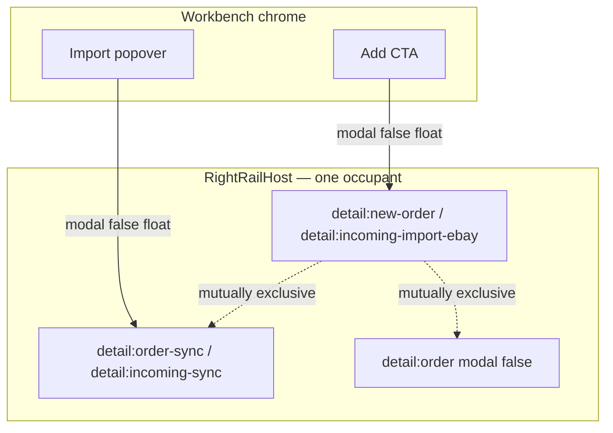

# Handoff — Import / Add Order → non-modal right rail (same metric as Unbox tool push + order inspector)

**For:** implementing agent (Cursor / Claude Code)
**From:** Cycle Forge engineering
**Date:** 2026-07-31
**Status:** done — Phase 0–1 shipped 2026-07-31 (modality flip + bulk sync on RightRailHost)
**Sibling just shipped:** Unbox line-edit modals → station push (`ReceivingToolPushStack`); dashboard / receiving details → `RightRailHost` `modal={false}`

---

## 0. One-sentence goal

Make every **Import / Add Order** intake surface open as a **right-edge secondary** that keeps the queue/workbench visible (no centered modal, no viewport scrim), using the **same modality + exclusivity metric** already proven for order inspectors and Unbox tool push — so Add Order, Import eBay purchase, and bulk-import progress all feel like one family.

---

## 1. Product ask (operator language)

Today, “Add order” / “Import” flows either:

1. sit on `RightRailHost` but still behave like a **blocking modal** (scrim + scroll lock), or
2. open as a **centered `RightPaneOverlay` / Dialog** that buries the order list.

Desired: open from the **right**, shift/coexist with the layout so the operator still sees the orders table / Incoming grid underneath, and every variant of “bring an order into the system” uses the **same right-rail pattern metric**.

---

## 2. Pattern metric (locked — do not re-litigate)

Read first:

| Law | Path |
|---|---|
| Right-rail modality | `.claude/rules/source-of-truth.md` § Right-rail modality |
| Navigators push, inspectors float | `AGENTS.md` hard laws |
| Dashboard non-modal inspector | `docs/todo/dashboard-inline-detail-editing-EXECUTION-PLAN.md` (shipped) |
| Receiving details Model B | `docs/todo/receiving-details-float-push-GEMINI-RESEARCH-BRIEFING.md` — **float, no layout squeeze** |
| Unbox tool push (station exception) | `ReceivingToolPushStack` / `ReceivingClaimStack` — **in-flow push**, not RightRailHost |

### Decision rule for THIS initiative

| Surface family | Target shell | Why |
|---|---|---|
| **Intake forms** (New Order, Add eBay purchase) | `DetailStackRailRegistrar` → `RightRailHost` with **`modal={false}`** + `ariaLabel` | Same metric as `detail:order` / `detail:receiving`. Queue stays live; resize free; **no** layout push (declined for dense LedgerGrids). |
| **Bulk sync progress** (Sheets/Ecwid/Incoming sync) | Port off centered overlay → **same RightRailHost non-modal occupant** (or a dedicated stable id) | Still “import UX”; must not stay a dimmed center card while intake is a float. |
| **Trigger chrome** (Import popover menus) | Keep as popovers | Triggers are not record planes. |
| **CSV import on Settings** | Leave inline | Settings page, not ops queue. |
| **Unbox station tools** | Do **not** use `ReceivingToolPushStack` for dashboard/Incoming intake | Tool-push is Unbox-scoped so `detail:receiving` stays free. Intake is workbench/queue-scoped → RightRailHost. |

**Hard rule:** never hand-roll `fixed right-0 z-panel w-[420px]`. One owner: `RightRailHost` + `src/lib/right-rail/store.ts`.

---

## 3. Inventory (measured)

### 3a — Primary targets (intake forms — already on the rail, still modal)

| Surface | File | Registrar id | Today | Target |
|---|---|---|---|---|
| **New Order Entry** | `src/components/orders/NewOrderEntryOverlay.tsx` | `detail:new-order` | `DetailStackRailRegistrar` **modal default (true)** | `modal={false}` + `ariaLabel` (e.g. `"New order entry"`) |
| **Add eBay purchase** | `src/components/sidebar/receiving/incoming/IncomingImportEbayOverlay.tsx` | `detail:incoming-import-ebay` | same | same |

**Bodies (keep):**

- New Order → `ShippedIntakeForm` inside `SidebarIntakeFormShell` (tabs Replacement / Add Order).
- Incoming → `SidebarIntakeFormShell` fields → `POST /api/receiving/inbound/import-ebay`.

**Openers:**

| Surface | Chrome | URL / state |
|---|---|---|
| New Order | `OutboundOrderChromeActions` **Add** on Dashboard Outbound, Labels, Pack, Shipping | `?new=true` (`useNewOrderParam` / dashboard search controller) |
| Add eBay | `IncomingChromeActions` **Add**; station action `incoming.import_ebay_order` → `station:import-ebay-order` | Local `addOpen` (+ optional prefill) |

### 3b — Secondary targets (bulk import — still center modal/overlay)

| Surface | File | Shell today | Target |
|---|---|---|---|
| **Order sync progress** | `src/components/sidebar/OrderSyncDialog.tsx` | Centered `RightPaneOverlay` | Extract body → register on RightRailHost (`detail:order-sync` or similar), `modal={false}` |
| **Incoming sync result** | `IncomingSyncDialog.tsx` (via Incoming chrome) | DS `Dialog` | Same family — non-modal right rail occupant (or fold into OrderSync-style panel) |

**Keep as popovers (out of scope for modality):**

- `OrdersSyncPopover` / Incoming Import popover — menu only; they *open* the progress panel.

### 3c — Explicit non-goals

- CSV order import on Settings (`CsvOrderImport`)
- Unbox `commitPoNumberOrImportOrder` (inline field, not a panel)
- Flipping RightRailHost default modality house-wide
- Layout **push/squeeze** of the dashboard LedgerGrid (declined — see receiving-details Model B)
- Migrating Testing-panel Unbox overlays (separate wave)

---

## 4. Pattern metric checklist (copy into PR / verify)

Every migrated surface must satisfy **all** of these (same bar as `tests/e2e/dashboard-inspector-non-modal.spec.ts` + `tests/e2e/unbox-tool-push.spec.ts`):

1. **Shell:** `DetailStackRailRegistrar` (or `useRegisterRightPanel`) — geometry owned by `RightRailHost` only.
2. **`modal={false}`** — no scrim, no `backdrop-blur`, no body scroll lock.
3. **`role="region"` + `ariaLabel`** — not `role="dialog" aria-modal`.
4. **Resizable** — free once non-modal (`DETAIL_STACK_RESIZE` path on the host).
5. **Queue stays live** — sibling rows / KPI / lifecycle tabs remain clickable (no full-viewport dismiss layer unless product explicitly wants `closeOnOutsideClick` like receiving details).
6. **One right-edge secondary** — opening intake/import clears/suspends competing occupants (`detail:order`, `detail:receiving`, assistant yield rules already in store). Prefer stable ids (`detail:new-order`, `detail:incoming-import-ebay`) so reopen is instant.
7. **Escape** — host closes unless an inner overlay owns Escape (`useAnyOverlayOpen`).
8. **No private fixed panels.**

---

## 5. Suggested execution phases

### Phase 0 — modality flip (smallest win, highest leverage)

**Files:** `NewOrderEntryOverlay.tsx`, `IncomingImportEbayOverlay.tsx`

```tsx
<DetailStackRailRegistrar
  id="detail:new-order" // or detail:incoming-import-ebay
  onClose={onClose}
  modal={false}
  ariaLabel="New order entry" // / "Add eBay purchase"
>
  {/* existing body unchanged */}
</DetailStackRailRegistrar>
```

**Verify manually / E2E:**

- Open Add on Dashboard Outbound → panel floats right; **no** backdrop; body `overflow` not `hidden`.
- Click a second pending row (or scroll the grid) while open — must work (dashboard leaves `closeOnOutsideClick` off).
- Incoming Add eBay → same asserts on Incoming workbench.
- Opening Add while an order inspector is open → one occupant (store priority / replace).

**E2E sketch:** mirror `dashboard-inspector-non-modal.spec.ts` with `data-testid` on the aside / registrar content; assert `BACKDROP_SELECTOR` count 0 + `role="region"`.

### Phase 1 — bulk sync progress onto the rail

1. Extract `OrderSyncDialog` body from `RightPaneOverlay` into `OrderSyncPanel` (chrome-free).
2. Register via `DetailStackRailRegistrar` `id="detail:order-sync"` `modal={false}` `ariaLabel="Order import progress"`.
3. Keep thin modal wrapper **only** if a non-rail host still needs it; prefer delete.
4. Wire `OrdersSyncPopover` / `OrdersImportCard` / `DashboardManagementPanel` to open the rail occupant instead of the center overlay.
5. Repeat for `IncomingSyncDialog` → `detail:incoming-sync` (or reuse one sync occupant with a mode prop if bodies are similar enough — prefer one SoT if the UI is the same job).

**Exclusivity:** opening sync clears intake (`detail:new-order` / `detail:incoming-import-ebay`) and vice versa — one import-plane at a time.

### Phase 2 — shared intake chrome polish (optional, same PR or follow-up)

- Confirm `SidebarIntakeFormShell` works at resized rail widths (min width clamp).
- Align header collapse / X with `DetailStackFrame` collapse grip (avoid double-close affordances fighting Escape).
- Document in `.claude/rules/source-of-truth.md` Right-rail modality that **intake overlays** (`detail:new-order`, `detail:incoming-import-ebay`) are non-modal occupants alongside `detail:order` / `detail:receiving`.

### Phase 3 — verify

- `npm run verify` green (never raise DS ratchets).
- E2E against **QA org** (`pnpm provision:qa-org`), not dogfood.
- Visual: Add Order and Import progress both read as the same right inset card family as the order inspector.

---

## 6. Architecture sketch



**Not this:** Unbox `ReceivingToolPushStack` in-flow squeeze for dashboard/Incoming — wrong region contract.

---

## 7. Key files

| Role | Path |
|---|---|
| New order overlay | `src/components/orders/NewOrderEntryOverlay.tsx` |
| Incoming eBay overlay | `src/components/sidebar/receiving/incoming/IncomingImportEbayOverlay.tsx` |
| Intake form body | `src/components/shipped/ShippedIntakeForm.tsx` |
| Shared form chrome | `src/design-system/components/sidebar-intake` |
| Outbound Add/Import chrome | `src/components/dashboard/OutboundOrderChromeActions.tsx` |
| Incoming Add/Import chrome | `IncomingChromeActions` / `IncomingWorkspaceHeader` |
| Bulk sync overlay (migrate) | `src/components/sidebar/OrderSyncDialog.tsx` |
| Registrar API | `src/components/right-rail/DetailStackRailRegistrar.tsx` |
| Host / store | `src/components/right-rail/RightRailHost.tsx`, `src/lib/right-rail/store.ts` |
| Golden non-modal exemplar | `src/components/shipped/ShippedDetailsPanel.tsx` (`modal={false}`) |
| Golden Unbox push (do not copy for this job) | `src/components/receiving/workspace/ReceivingToolPushStack.tsx` |
| E2E exemplar | `tests/e2e/dashboard-inspector-non-modal.spec.ts` |

---

## 8. Acceptance criteria

- [x] `NewOrderEntryOverlay` and `IncomingImportEbayOverlay` pass `modal={false}` + named `ariaLabel`.
- [x] Opening either does **not** mount panel/detail-stack backdrops; body scroll stays unlocked.
- [x] Order / Incoming queues remain interactive under the open intake panel.
- [x] `OrderSyncDialog` (and Incoming sync result) no longer use centered `RightPaneOverlay` / blocking Dialog as the primary ops path — they register on RightRailHost non-modally.
- [x] One right-rail import/intake occupant at a time; opening Add clears sync and vice versa; opening a record inspector clears intake (existing store behavior OK if verified).
- [x] `npm run verify` green; E2E on QA org covers Add Order non-modal + Import progress non-modal.

---

## 9. Prompt the next agent can paste

```
Implement docs/todo/import-add-order-right-rail-HANDOFF.md.

Phase 0 first: set modal={false} + ariaLabel on NewOrderEntryOverlay and
IncomingImportEbayOverlay (already on DetailStackRailRegistrar). Do not invent
a private fixed right panel. Do not use ReceivingToolPushStack — that is Unbox-
only. Match ShippedDetailsPanel / ReceivingDetailsStack non-modal metric.

Then Phase 1: extract OrderSyncDialog body off centered RightPaneOverlay onto
RightRailHost (modal={false}); same for IncomingSyncDialog. Keep Import
popovers as triggers only.

Exclusivity: one import/intake right-rail occupant. Verify with npm run verify
and an E2E patterned on dashboard-inspector-non-modal.spec.ts against the QA org.
Never raise DS ratchet baselines. Do not edit the handoff file except to add a
Status line when phases complete.
```

---

## 10. Status log

| When | Note |
|---|---|
| 2026-07-31 | Handoff filed after Unbox tool-push ship. Intake overlays already on RightRailHost; remaining work is modality + bulk-sync port. |
| 2026-07-31 | **Done** — Phase 0–1: `modal={false}` + ariaLabels on `detail:new-order` / `detail:incoming-import-ebay`; OrderSync + IncomingSync on RightRailHost (`detail:order-sync` / `detail:incoming-sync`); SoT + E2E `import-add-order-non-modal.spec.ts`. |
