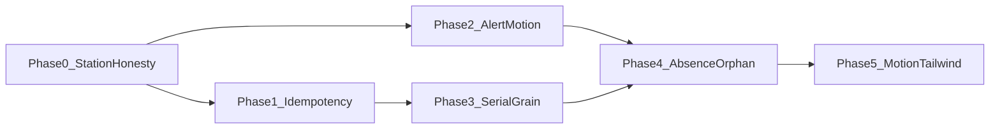

# Kinetic Ledger — Station safety & DS governance (90-day)

**Status:** Phases 0–5 shipped (2026-07-30). Tailwind v4 landed (`@config` bridge) — see [`tailwind-v4-SPIKE.md`](./tailwind-v4-SPIKE.md).
**Lane:** `main` (or current checkout — no ad-hoc branch).
**Product frame:** Cycle Forge multi-tenant reseller-ops SaaS. USAV is dogfood only.
**Industry input:** 2026 Kinetic Ledger vs industry standards audit (Station hard-fail, idempotency, serial grain, reduced-motion, `alert()`, empty states). Corrected against the live codebase — see §2.

**Companion executable:** [`kinetic-ledger-station-safety-EXECUTION-PROMPT.md`](./kinetic-ledger-station-safety-EXECUTION-PROMPT.md)

**Related research (do not re-litigate):**
- [`../research/gemini-briefing-serial-label-order-binding.md`](../research/gemini-briefing-serial-label-order-binding.md) — CF-03 serial↔order grain
- E2E: `tests/e2e/audit-cf02-exception-honesty.spec.ts`, `audit-order-lifecycle-control.spec.ts`, `audit-pack-queue-membership.spec.ts`

---

## 1. Goal

Close the gap between Kinetic Ledger’s **architectural maturity** (four region contracts + ratchet governance) and **warehouse-floor safety** (honest Station states, request idempotency, correct serial binding grain, WCAG motion, no focus-stealing alerts) — without adopting Zebra-style hard-stop modals that fight the house Station focus-lock contract.

**Done means:** Station optimistic UI is safe under retry; unmatched / exception / 409 states are glanceable card truths; serials bind at order/unit grain (or an explicit Monitor surfaces orphans until they do); DS ratchets cover `alert()` + Station motion bridge; `npm run verify` green.

---

## 2. Audit corrections (plan law)

| Audit claim | Code reality | Plan law |
|---|---|---|
| Build `StationCard` with required `onHardDismiss` | **No `StationCard`.** Surface is `ActiveOrderScanFeedback`. House Station wants **big card pass/fail**, not a blocking dismiss overlay ([`display/station.md`](../../.claude/rules/display/station.md) §6). | **Keep house contract.** Honest amber exception card + continue scanning; rose fail card on hard reject. Never add a modal that steals wedge focus. |
| CF-02 silent green Active | **Mostly fixed** (2026-07-28 chip honesty). Residual closed in Phase 0. | Treat CF-02 UI as **done**; keep E2E gate green. |
| Require middleware that forces `clientEventId` on all mutations | Opt-in SoT is [`api-idempotency.ts`](../../src/lib/api-idempotency.ts). Receiving already gold. | **Per-route wire**, gold = `mark-received-po` / `useReceiveAction`. Global middleware is a later optional ratchet, not Phase 1. |
| Bind serials to `order_line` | `order_line_items` not live; inventory-v2 has `order_unit_allocations`. Testing writes `tech_serial_numbers.shipment_id` only. | Phase 3: bind via **order_id and/or `order_unit_allocations`**, not invent order_line. Follow serial-label research. |
| 16 `alert()` sites | **20** remaining after Phase 0 (was 22). | Ratchet baseline in `alert.guard.test.ts` — shrink only. |
| CF-09 / “ECWID” placeholder | No CF-09 id. Split: `GridCellDash` (`—`) vs `LedgerValue`/`DateTimeValue` default `"N/A"`. | Phase 4: unify absence on ledger primitives to `—` / omit-fact. |

---

## 3. Phase map



| Phase | Window | Theme | Depends on |
|---|---|---|---|
| **0** | Shipped 2026-07-29 | Station honesty + SoT + serial-route idempotency + motion bridge on card primitives | — |
| **1** | Days 0–14 | Remaining barcode lifecycle idempotency (`orders/add`, packing-logs) | Phase 0 |
| **2** | Days 0–21 (parallel) | Kill remaining `alert()`; expand motion-bridge coverage on Station surfaces | Phase 0 |
| **3** | Days 14–45 | Serial binding grain (CF-03) + pack-queue exclusion (CF-04) | Phase 1 (retries safe while migrating) |
| **4** | Days 30–60 | Honest absence primitives; Reconciliation / orphan Monitor | Phase 3 for orphan truth; Phase 2 for chrome |
| **5** | Days 60–90 | Motion major unification; Tailwind v4 plan | Phase 2 done |

Phases 1 and 2 may run in parallel. Phase 3 must not start without Phase 1 green on Testing serial writes.

---

## 4. Phase 0 — DONE (2026-07-29)

### Shipped

| Area | Change |
|---|---|
| SoT | [`display/station.md`](../../.claude/rules/display/station.md) §6–§7, §9, anti-patterns; [`source-of-truth.md`](../../.claude/rules/source-of-truth.md) toast/`alert` law; [`contextual-display.md`](../../.claude/rules/contextual-display.md) ACT step |
| Honesty | No success flash on unmatched tracking; render `inlineMicrocopy`; rose fail card in `StationTesting` when `errorMessage && !activeOrder`; no confetti / complete on exception-held serials |
| Motion | `CardShell` + `ActiveOrderScanFeedback` use `useMotionTransition` / `useMotionPresence`; suppress `layout` under reduced motion |
| Idempotency | `/api/tech/serial` + `add-serial` / `add-serial-to-last` honor client `idempotencyKey` |
| Ratchets | `src/components/ui/alert.guard.test.ts` (baseline 20); `station-motion-bridge.guard.test.ts`; both on `npm run test:ds-guards` |

### Do not regress

- E2E `tests/e2e/audit-cf02-exception-honesty.spec.ts`
- Alert baseline may only **shrink**
- Station card primitives must keep motion-bridge imports

---

## 5. Phase 1 — Ubiquitous barcode-mutation idempotency

**Outcome:** The four critical lifecycle writes all replay safely under double-submit / flaky network.

| Write | Route(s) | Status | Work |
|---|---|---|---|
| Receiving / unbox | `mark-received-po`, `scan-serial`, … | **HAS** | Reference implementation — do not reinvent |
| Tech serial attach | `/api/tech/serial` (+ wrappers) | **HAS (Phase 0 + 3)** | Idempotency + `order_id` stamp |
| Order creation | `POST /api/orders/add` | **HAS (Phase 1)** | `readIdempotencyKey` + claim; client mints UUID |
| Pack logs | `POST /api/packing-logs`, `/update`, `/api/packerlogs` | **HAS (Phase 1)** | Request-level key + StationPacking / MarkAsShipped clients |

### Concrete steps

1. Read gold path: [`useReceiveAction.tsx`](../../src/components/receiving/workspace/line-edit/hooks/useReceiveAction.tsx) + [`mark-received-po/route.ts`](../../src/app/api/receiving/mark-received-po/route.ts) (`claimOrReplay` where concurrent-safe).
2. Wire `POST /api/orders/add` — header or body key; cache `<500` responses; document in route comment.
3. Wire packing-log POST paths the same way; `StationPacking` / pack clients mint keys.
4. Unit tests: same key → same body, no duplicate insert (follow `api-idempotency.test.ts`).
5. Optional later: ESLint / route-audit “mutation without idempotency helper” — **not** required to close Phase 1.

### Verify

```bash
npm run verify -- --fast
npx tsx --test src/lib/api-idempotency.test.ts
# plus any new route-focused unit tests
```

### Exit criteria

- All four rows in the scorecard above are **HAS**
- Double POST of create-order and pack-log with same key is a replay, not a duplicate

---

## 6. Phase 2 — Alert ban + Station motion coverage

**Outcome:** Zero native alerts on Station / shipped / settings hot paths; Station Up Next cards honor reduced motion.

### 2a — `alert()` migration (baseline 20 → 0)

Migrate every site to `@/lib/toast` (errors/warnings) or DS `confirm` / modal for blocking choices. Shrink `ALERT_BASELINE` on each PR.

Priority order (Station / focus-sensitive first):

1. `src/hooks/station/handleSkuScan.ts`
2. `src/hooks/station/useWorkOrderAssignment.ts`
3. `src/hooks/station/useUpNextRepairCard.ts` (3)
4. Shipped stacks (`PackerDetailsStack`, `TechDetailsStack`, `DashboardDetailsStack`, `DeleteOrderControl`, `shipped-details-hooks`)
5. `dashboard-sidebar-hooks.ts`
6. Settings / billing / staff / sourcing leftovers

Escape only with same-line / line-above `ds-allow-alert` — genuine one-offs, rare.

### 2b — Motion bridge on Station surfaces

`station-motion-bridge.guard.test.ts` today pins `CardShell` + `ActiveOrderScanFeedback`. Expand the allowlist **after** migrating, or add a shrink-only raw-import count for `src/components/station/**`.

Priority files (raw framer without bridge):

- `StationPacking.tsx`, `OrderCard.tsx`, `FbaItemCard.tsx`, `RepairCard.tsx`, `UpNextOrderPieces.tsx`, `ReceivingAssignmentCard.tsx`, `OfflineBanner.tsx`, `StationGoalBar.tsx`, …

Pattern: import `useMotionTransition` / `useMotionPresence` like [`PackOrderPanel.tsx`](../../src/components/packer/PackOrderPanel.tsx).

### Verify

```bash
npm run test:ds-guards
npm run verify -- --fast
```

### Exit criteria

- `ALERT_BASELINE === 0` (or only documented `ds-allow-alert` escapes)
- Station Up Next + Packing cards use the motion bridge; guard updated

---

## 7. Phase 3 — Serial binding grain (CF-03) + queue membership (CF-04)

**Outcome:** A scanned serial attributes to **one** order (or one unit allocation), not every sibling sharing a shipment. Pack Up Next does not vanish siblings because a SAL exists on the shipment.

### Non-negotiables

- Read [`gemini-briefing-serial-label-order-binding.md`](../research/gemini-briefing-serial-label-order-binding.md) before designing.
- Prefer growing [`order_unit_allocations`](../../src/lib/drizzle/schema.ts) and/or adding `order_id` on the TSN write path — **Ask-first** before a large schema fork.
- Status changes still via `transition()` / domain transition helpers only.
- `orgId` from `ctx` only.

### Concrete workstreams

1. **Write path:** `insertTechSerialForSalContext` / `attachTechSerial` — persist order (or unit allocation) when SAL resolved to an order; keep `orders_exception_id` path for unmatched.
2. **Read path:** replace `WHERE tsn.shipment_id = o.shipment_id` aggregations (lookup, `order-linkage`, neon queries, search) with order/unit-scoped joins; leave temporary dual-read only behind a clear comment + sunset.
3. **Queue exclusion:** `excludePacked` / Up Next `NOT EXISTS (… sal.shipment_id = o.shipment_id)` → order-grain (or fulfillmentScope that already excludes tech-only) — see CF-04 E2E.
4. **E2E:** extend `audit-order-lifecycle-control` + `audit-pack-queue-membership` so sibling smear / vanish fail the build.

### Verify

```bash
npm run verify
# E2E against QA org — never dogfood tenant
```

### Exit criteria

- One serial cannot appear on two product-different sibling orders via shipment join
- Packing a sibling does not remove an untested sibling from the queue without an explicit processed fact on that order

---

## 8. Phase 4 — Honest absence + Reconciliation Monitor

**Outcome:** Missing facts never look like vendor defaults; stuck / orphaned serial-order facts have a Monitor home.

### 4a — Absence primitives

| Primitive | Today | Target |
|---|---|---|
| `GridCellDash` | `—` (honest) | Keep as grid SoT |
| `LedgerValue` / `DateTimeValue` | default `"N/A"` | Default to `—` or empty token; migrate call sites |
| Condition / pack mappers | coerce missing → `'N/A'` | Omit or `—` |

Update SoT one-liner in `source-of-truth.md` + workbench empty/absence section. Optional ratchet: ban new `"N/A"` string literals outside allowlist.

### 4b — Reconciliation Hub (Monitor contract)

- New Monitor surface (not Station, not Workbench browse-in-scan-column): list orders excluded by shipment-grain SAL / serials on exceptions past SLA / smear candidates.
- Compose `@/design-system/components/monitor` rollup blocks — never invent page-local card shells.
- Wire to existing `orders_exceptions` sweep where relevant; **new** query for CF-03 orphans once Phase 3 lands (or a read-only “suspected smear” view if Phase 3 is mid-flight).

### Exit criteria

- No new `"N/A"` defaults on ledger primitives
- Operators can open a Monitor and see stuck Testing/Pack membership issues without SQL

---

## 9. Phase 5 — Motion majors + Tailwind v4

**Outcome:** One motion stack; Tailwind upgrade path documented and scheduled.

| Debt | Today | Work |
|---|---|---|
| `framer-motion` ^11 vs `motion` ^12 (nested framer 12) | **DONE** — app on `framer-motion@^12.42.2`; single major in lockfile; `motion-major.guard.test.ts` | Keep SoT imports on `framer-motion`; Motion+ only via `@/design-system/motion` |
| Tailwind 3.4.x → 4.3.x | **DONE** (`@tailwindcss/postcss` + `@config` bridge) | Optional: full `@theme` migration — [`tailwind-v4-SPIKE.md`](./tailwind-v4-SPIKE.md) |

Phase 5 is **debt**, not floor safety — do not block Phases 1–3 on it.

---

## 10. Hard laws (every phase)

- Compose SoT first; grow SoT when wrong ([`pattern-evolution.md`](../../.claude/rules/pattern-evolution.md)).
- Never raise a DS ratchet baseline to pass.
- Never start/restart/kill the dev server (`:3050`).
- User manages commits; no `git stash`; stay on checkout branch.
- `orgId` from `ctx`; status via `transition()`.
- E2E asserts against **QA org**.
- `npm run verify` before calling a phase done (full gate before merge).

---

## 11. File index (quick)

| Concern | Path |
|---|---|
| Station contract | `.claude/rules/display/station.md` |
| Idempotency SoT | `src/lib/api-idempotency.ts` |
| Active card | `src/components/station/ActiveOrderScanFeedback.tsx` |
| Testing host | `src/components/station/StationTesting.tsx` |
| Serial write | `src/app/api/tech/serial/route.ts`, `src/lib/tech/insertTechSerialForSalContext.ts` |
| Alert ratchet | `src/components/ui/alert.guard.test.ts` |
| Motion ratchet | `src/components/ui/station-motion-bridge.guard.test.ts` |
| CF-03 research | `docs/research/gemini-briefing-serial-label-order-binding.md` |
| Receiving gold idempotency | `src/components/receiving/workspace/line-edit/hooks/useReceiveAction.tsx` |

---

## 12. Status log

| Date | Event |
|---|---|
| 2026-07-29 | Phase 0 shipped (SoT + honesty + CardShell bridge + tech.serial idempotency + ratchets). Plan + execution prompt authored. |
| 2026-07-29 | Phase 1 shipped: `orders.add` + packing-logs/update/packerlogs POST honor client Idempotency-Key; StationPacking + sidebar clients mint UUID. |
| 2026-07-29 | Phase 2 shipped: `ALERT_BASELINE` → 0 (toast migration); Station Packing / Up Next / OfflineBanner / GoalBar on motion bridge. |
| 2026-07-30 | Phase 3 in progress: `tech_serial_numbers.order_id` + order-grain SQL SoT; write stamps from SAL metadata; lookup/Up Next/excludePacked use order grain. |
| 2026-07-30 | Phase 3 closed: migration applied; remaining TSN reads dual-read order-grain; `tsn-order-grain.guard.test.ts` CI ratchet; E2E mutate stays QA opt-in. |
| 2026-07-30 | Phase 4a: `LedgerValue`/`DateTimeValue` default absence → `—`; SoT honest-absence row. |
| 2026-07-30 | Phase 4b: Operations `?mode=reconciliation` Monitor + `GET /api/operations/reconciliation` (smear + open exceptions). |
| 2026-07-30 | Phase 5: `framer-motion` → ^12.42.2 (single major with `motion`); `motion-major.guard.test.ts`; Tailwind v4 spike doc. |
| 2026-07-30 | Tailwind v4 upgrade: `4.3.3` + `@tailwindcss/postcss`; `@config` bridge; plain `var(--ds-…)` colors; `@source` globs. |
