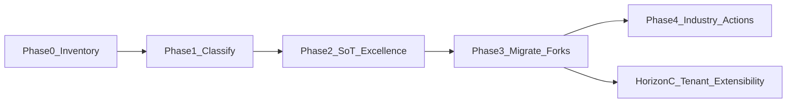

# HANDOFF — Unified LedgerGrid table SoT (research → excellence → industry actions)

**Audience:** Codex / Claude Code / Cursor agent with a **fresh context**.  
**Repo:** `cycleforge-app` · stay on the current checkout branch.  
**Product framing:** Cycle Forge is multi-tenant reseller-ops SaaS (USAV = dogfood tenant only).

**Paste everything below the line into a new session.** Do not edit this file unless the human asks; append findings to a sibling inventory doc you create.

---

# Cycle Forge — Unified Workbench data-table SoT

You are an implementation agent in the Cycle Forge monorepo. Your job is **not** to invent a second table library. It is to **inventory every database-backed collection table in the product**, classify each against the existing Kinetic Ledger spreadsheet SoT, then execute a **three-horizon** program:

1. **Horizon A — One excellent display SoT first.** Every ops/workbench spreadsheet must contract onto `LedgerGrid` / `LedgerGridSurface` + `GridSurfaceDescriptor` (+ `GridSurfaceCapabilities`), with Excel/Sheets/Airtable-grade interaction for *display, selection, sort, fields, frozen identity, row fill*. No foreign UI grids (AG Grid / MUI / Glide / shadcn DataGrid).
2. **Registry waist (nonlinear engine) — approved accelerator on A:** replace page-coupled `*GridView` forest with a **static TypeScript table-definition registry** + thin page bindings (`NonlinearTableHost`). Domain cells stay per family; AI may author Zod definition payloads only (not JSX/DDL). Plan: [`nonlinear-data-table-engine-PLAN.md`](nonlinear-data-table-engine-PLAN.md). Briefing: [`nonlinear-data-table-engine-GEMINI-RESEARCH-BRIEFING.md`](nonlinear-data-table-engine-GEMINI-RESEARCH-BRIEFING.md).
3. **Horizon B — Only after Horizon A is dogfood-strong:** grow **industry-standard row / multi-select / record actions** on that same SoT (assign to staff, open/create support ticket for this item, exact status transitions via `transition()`, ticket linkages, bulk flag/ship-by patterns already on Orders, etc.). Actions are **capability-gated** — Catalog must never grow Orders triage row paint or dispatch actions just because the shell can. Plan: [`grid-industry-actions-HORIZON-B-PLAN.md`](grid-industry-actions-HORIZON-B-PLAN.md).
4. **Horizon C — Multi-tenant extensibility (after A display pin + registry waist; does not skip B):** long-term **DB-backed** saved views / vocab / custom fields / optional custom tables on the **same** LedgerGrid + RightRailHost kernel — compounds on the code registry, does not replace it. Gemini research: [`tenant-table-extensibility-HORIZON-C-GEMINI-RESEARCH-BRIEFING.md`](tenant-table-extensibility-HORIZON-C-GEMINI-RESEARCH-BRIEFING.md). Plan file (when landed): [`tenant-table-extensibility-HORIZON-C-PLAN.md`](tenant-table-extensibility-HORIZON-C-PLAN.md).

**Do not skip Horizon A (or the registry waist) to build action menus or custom tables.** A mediocre forked table with great actions is worse than one excellent shell that every surface mounts. **Do not jump to Horizon C JSON defs before the code registry + host exist.**

---

## Mission (one line)

Deep-search the codebase, produce a complete inventory of every table/grid/list that displays DB-backed rows, then migrate / grow until **one pin SoT** (`LedgerGrid` family + capabilities) owns Workbench spreadsheet display — then extend that SoT with industry action planes (Horizon B) and, separately, multi-tenant extensibility research/plan (Horizon C).

---

## Read first (in this order, before writing code)

1. **`AGENTS.md`** + **`CLAUDE.md`** — hard laws; pattern evolution; verify.
2. **`.claude/rules/source-of-truth.md`** — especially:
   - Ops table / spreadsheet shell (`TABLE_SURFACE_*`)
   - **Grid surface capabilities** (`GridSurfaceCapabilities` on every descriptor)
   - Grid leaf-row fill (`ledgerRowFillClass`)
   - LedgerGrid column header / justification / identity pane / visibility / sort
3. **`.claude/rules/display/workbench.md`** — collection-surface **four action planes** (in-cell · row-scoped · multi-select · record); empty vs no-matches; Receiving spreadsheet waist.
4. **`.claude/rules/pattern-evolution.md`** — compose → grow the SoT → compound; never fork a page-local twin for the same job; different jobs may keep sibling composers.
5. **`.claude/rules/ui-design-system.md`** + **`kinetic-ledger.md`** — density, one-row anatomy, data-shape→surface.
6. **`src/design-system/DESIGN_SYSTEM.md`** → Workbench spreadsheet section.
7. **Already shipped capabilities waist (do not re-litigate):**
   - `src/design-system/components/grid/grid-surface-descriptor.ts` — `GridSurfaceCapabilities`, `makeGridSurfaceDescriptor`
   - `src/components/ui/queue-row-chrome.ts` — `ledgerRowFillClass` / `ledgerRowStateClass`
   - Family descriptors: `orders-queue-descriptor.ts`, `receiving-grid-descriptor.ts`, `incoming-grid-descriptor.ts`, `catalog-grid-descriptor.ts`, `repair-grid-descriptor.ts`, `pickup-grid-descriptor.ts`
   - Guard: `src/lib/tables/grid-surface-capabilities.guard.test.ts`
8. **Prior table initiatives (read status; do not duplicate finished work):**
   - `docs/todo/grid-surface-descriptor-plan.md` (+ phase run notes if present)
   - `docs/todo/all-tables-improvements-EXECUTION-PROMPT.md`
   - `docs/todo/pending-grid-industry-standard-EXECUTION-PROMPT.md`
   - `docs/todo/unbox-receiving-grid-CONTEXT-MAP.md`
   - `docs/todo/local-pickup-ledgergrid-port-HANDOFF.md`
9. **Skill (when editing Receiving cells):** `.claude/skills/receiving-grid-cell/SKILL.md`

Also run: `pnpm worklog:tail` (last ~15) before starting.

---

## Locked decisions (already made — do not relitigate)

1. **Shell SoT = `LedgerGrid` / `LedgerGridSurface`.** TanStack Table v8 = **state math only** (`useGridSurface`, keep `"use no memo"`). Kinetic Ledger owns markup, CSS-var geometry, virtualization, fetch, mutations. **Never** import a foreign grid aesthetic.
2. **Two families, one law.**
   - Virtualized ops / Workbench queues → **LedgerGrid family**.
   - Non-virtualized lifecycle/admin HTML tables → sibling **`DataTable`** (same `TABLE_SURFACE_*` shell). Do not force Settings/admin into LedgerGrid unless the surface is an ops queue.
3. **Capabilities are the feature pin.** Every descriptor declares explicit booleans: `rowTriageFlags` · `multiSelect` · `inCellEdit` · `fieldsMenu` · `dayBands`. Catalog / Receiving / Incoming / Repair / Pickup keep `rowTriageFlags: false`. Only Orders (today) may paint staff triage wash. Grow the bag when a new *shared* feature needs a gate — do not sprinkle `if (surface === 'orders')` in the shell.
4. **Domain cell registries stay per family.** Orders cells ≠ Receiving cells ≠ Catalog cells. Unify shell + chrome + atoms (`grid-cells`, CopyChip, `QUEUE_ROW`); do **not** collapse all JSX into one mega-row.
5. **Unbox has two surfaces — do not conflate.**
   - Workbench browse (Queue · Viewed · History) = `ReceivingLinesTable` → `ReceivingGridView` (shared with dashboard Receiving).
   - Open-carton Station (`PoLinesAccordion` / `PoLineMetaGrid` / unit slots) = **not** LedgerGrid; different job (edit lines). Porting accordion onto LedgerGrid is **ask-first / out of scope** unless the human names it.
6. **Status changes only via `transition()`** — never raw `UPDATE … current_status`. Ticket / assign / flag APIs must go through existing house waists (`useOrderAssignment`, support ticket routes, audit). `orgId` from `ctx`.
7. **Four action planes, one primary each** (workbench.md). Horizon B mounts actions on the correct plane — do not put “create ticket” as an in-cell editor or a random title click.
8. **URL-durable sort/filter** on Workbench tables; staff Fields prefs in `staff_preferences.tableColumns[tableId]` (delta). Do not invent a second prefs shape.
9. **Proof = inventory doc + `npm run verify` + Playwright per migration wave.** Manual spot-check alone is not done.
10. **Do not commit or stash** unless the human asks. Leave unrelated working-tree changes untouched.

---

## Horizon A vs Horizon B vs Horizon C (strict sequencing)



| Phase | Goal | Exit criteria |
|---|---|---|
| **0 — Inventory** | Find every DB-backed table/grid/list display | Written inventory markdown (paths, family, row type, fork vs SoT) |
| **1 — Classify** | Map each to LedgerGrid / DataTable / keep-sibling / retire | Classification table + recommended destination descriptor id |
| **2 — SoT excellence** | Make the pin display *excellent* (Excel-grade) on the golden adopters before mass migration | Golden surfaces dogfood-ready; capabilities + header + fill + Fields + sort proven |
| **3 — Migrate forks** | Collapse hand-rolled / twin tables onto the SoT | No ops hand-rolled `<table>` for the same job; guards updated |
| **4 — Industry actions** | Shared action vocabulary on capabilities | Assign / ticket / status / linkages available where capability allows; Catalog stays display-safe |
| **Horizon C** | Multi-tenant views / custom fields / optional custom tables on the same kernel | Plan from [`tenant-table-extensibility-HORIZON-C-GEMINI-RESEARCH-BRIEFING.md`](tenant-table-extensibility-HORIZON-C-GEMINI-RESEARCH-BRIEFING.md); **do not start C2+ custom-field product work while Phase 3 ops forks remain** |

**Stop and ask the human** before starting Phase 4 if Phase 2–3 are incomplete.  
**Horizon C research** may run in parallel (docs only); **Horizon C implementation** waits on the A display pin and must not reopen B’s action-plane decisions.

---

## Phase 0 — Deep-search inventory (do this first; read-only)

Produce a new doc: **`docs/todo/table-surface-inventory-YYYY-MM-DD.md`** (use today’s date).

### Search recipe (run all; expand as you find patterns)

```bash
# LedgerGrid family
rg -l 'LedgerGrid|LedgerGridSurface|makeGridSurfaceDescriptor|GridSurfaceDescriptor' src

# DataTable sibling
rg -l "from '@/design-system/components/DataTable|DataTable" src

# Hand-rolled / legacy tables
rg -l '<table|role="table"|QueueTable|ListTable|BoardTable' src/components src/features src/app

# Column layout SoTs
rg -l 'GRID_COLUMNS|QUEUE_COLUMNS|_COLUMNS.*=.*\[' src/lib src/components

# Selection / bulk bars (action foreshadow)
rg -l 'ContextualSelectionBar|useTableSelectMode|BulkFlag|BulkShip' src
```

Also walk:

- `src/components/dashboard/**` (Orders / Packed / Shipped / Receiving hosts)
- `src/components/station/**` (Receiving, Incoming, History, StationList*)
- `src/components/receiving/**` (Unbox, Pickup, Unfound)
- `src/components/products/catalog/**`
- `src/components/repair/**`
- `src/components/support/**`, `src/features/review/**`
- `src/components/warehouse/**`, `src/components/tracking-exceptions/**`, `src/components/warranty/**`
- `src/components/outbound/**`, `src/components/photos/**`
- `src/app/settings/**`, `src/app/admin/**`, `src/app/reports/**`
- Mobile: `src/components/mobile/**` (note: mobile often uses **list** row SoTs, not LedgerGrid — classify separately; do not force spreadsheet chrome onto phone)

### Inventory row schema (required columns)

For each surface, record:

| Field | Meaning |
|---|---|
| **Route / host** | e.g. `/dashboard?unshipped`, `/unbox`, `/pickup` |
| **Composer file** | View / table component path |
| **Family today** | `LedgerGrid` · `DataTable` · `hand-rolled <table>` · `CSS grid list` · `accordion` · `board` · `mobile list` |
| **Descriptor / column SoT** | path or “none” |
| **`GridSurfaceCapabilities`** | declared? which flags? |
| **Row entity / DB** | orders, receiving_line, catalog product, repair, pickup line, … |
| **Grouping** | flat · PO fold · day-band · order fold |
| **Header** | `LedgerGridColumnHeader` adapter · Orders fork · custom |
| **Selection** | none · open-highlight · multi-check + bar |
| **Mutations today** | in-cell · bulk · inspector-only · read-only |
| **Horizon A action** | `keep` · `thin-adapt` · `migrate-to-LedgerGrid` · `migrate-to-DataTable` · `keep-sibling-job` · `retire` |
| **Horizon B candidates** | e.g. assign staff, create ticket, status transition, flag, link ticket — only if the entity supports it |
| **Risk / notes** | e.g. “Orders header resize/reorder deferred”, “Station accordion — different job” |

### Seed list (verify + extend — do not treat as complete)

**Already on LedgerGrid (verify capabilities + header adapter):**

- Orders / Pending / Tested / Packed / Shipped → `OrdersGridView` (+ `ORDERS_GRID_CAPABILITIES`, triage flags on)
- Receiving / Unbox browse / History / Testing browse → `ReceivingGridView`
- Incoming POS → `IncomingGridView`
- Catalog → `CatalogGridView`
- Repair → `RepairGridView`
- Local Pickup → `PickupGridView`

**Likely forks / siblings to classify (confirm in code):**

- `UnfoundQueueTable`, `ReadyQueueTable`, `StationListTable`, `StationHistoryTable`
- `ReviewPackingTable`, `ReviewPairingTable`, `SupportOrdersBoard`
- `BinsTable`, `TrackingExceptionsTable`, `WarrantyClaimsTable`
- `StaffTable`, settings/admin `TableSections`, reports pages
- FBA / walk-in history modes, photo library grids (`PhotoFlatGrid` may be media, not LedgerGrid)
- Open-carton `PoLineMetaGrid` / `PoLinesAccordion` → **keep-sibling-job** unless human expands scope
- Mobile receive/pack lists → classify as Monitor/list density, not Workbench spreadsheet

**Known deferred (document, do not force in Horizon A):**

- `OrdersQueueColumnHeader` resize/reorder recipe onto `LedgerGridColumnHeader` v1
- TanStack grouping Phase E on day-band surfaces (see all-tables prompt) — ask-first if still gated
- Schema auto-CRUD / Excel fill-handle / range select — **closed forever**

---

## Phase 1 — Classification rules

Apply these rules when filling **Horizon A action**:

| If… | Then… |
|---|---|
| Ops queue / Workbench pick-list, virtualized or should be | → `LedgerGrid` (+ descriptor + capabilities) |
| Admin / settings / small lifecycle HTML table, no virtualizer need | → `DataTable` |
| Same job as an existing LedgerGrid family but forked markup | → `migrate-to-LedgerGrid` (thin adapter + column SoT) |
| Genuinely different job/region (Station edit accordion, board, mobile feed) | → `keep-sibling-job` (share atoms only: chips, dates, tones) |
| Dead / replaced by another composer | → `retire` |

**Capability defaults for new LedgerGrid adopters** (explicit in descriptor; never omit):

```ts
{
  rowTriageFlags: false, // true ONLY for outbound Orders-class triage
  multiSelect: true,     // false for read-only browse (Pickup-style)
  inCellEdit: false,     // true only when Sheets-style editors are intentional
  fieldsMenu: true,
  dayBands: false,       // true when sticky civil-day bands are a real mode
}
```

---

## Phase 2 — SoT excellence (pin display must be “very good” first)

Work **on the golden LedgerGrid shell and the primary adopters** before mass-migrating obscure admin tables.

### Excellence checklist (Horizon A definition of “good”)

Treat Pending / Orders airtable grid + Receiving browse as the dogfood pin. The SoT is excellent when:

1. **One framed shell** — `TABLE_SURFACE_CLIP_CLASS` / airtable skin; no hand-rolled card chrome.
2. **Frozen identity pane** — contiguous `frozen: true` prefix; never hideable; never in-cell title edit.
3. **Justification** — `resolveGridColumnAlign` only (digit/id/date end; text/tag start).
4. **Fields + visibility** — `useGridColumnVisibility` + `GridFieldsMenu`; core/optional tiers; no dead ruled bands for hidden columns.
5. **Sort** — URL-durable (`?colsort=`/`?coldir=` or documented surface SoT); header `aria-sort` via `LedgerGridColumnHeader`.
6. **Row fill** — `ledgerRowFillClass` everywhere under airtable; selection fill-only (no inset ring under cell rules); triage wash capability-gated.
7. **Empty honesty** — settled-empty ≠ no-matches (`emptyMessage` / `searchEmptyMessage`).
8. **Virtualization** — large queues stay on `VirtualGroupedSections`; no full DOM dump.
9. **Header SoT** — thin adapters over `LedgerGridColumnHeader` (Orders resize/reorder still deferred — document, don’t half-port).
10. **Shared value atoms** — dates, qty fractions, dashes, platform marks, staff cells from `grid-cells` / CopyChip — no per-surface twins for the same fact.
11. **Guards green** — `grid-surface-capabilities`, `grid-column-tier`, `grid-column-display`, `ledger-grid-column-header`, queue-row chrome.
12. **Playwright** — existing grid suite stays green; extend when behavior changes.

### Grow the SoT when a fork is stronger

If a page-local table has a better interaction (e.g. better empty teaching, better select-all), **promote into `LedgerGrid` / `LedgerGridSurface` / `grid-cells`**, then delete the twin. That is pattern evolution — not invention beside the SoT.

### Explicit non-goals for Phase 2

- No new action menus yet (that is Phase 4).
- No accordion→LedgerGrid port.
- No mobile spreadsheet chrome.
- No raising knip / DS ratchet baselines to pass verify.

---

## Phase 3 — Migrate forks onto the pin

For each inventory row marked `migrate-to-LedgerGrid` / `migrate-to-DataTable`, one wave:

1. Author or reuse column model + `make*GridDescriptor` with **explicit capabilities**.
2. Thin `*GridView` composer: data fetch/grouping stay house; shell = `LedgerGridSurface` (or `LedgerGrid` + `TABLE_SURFACE_*` like Orders).
3. Thin header adapter over `LedgerGridColumnHeader` (unless Orders-class resize/reorder).
4. Row uses `ledgerRowFillClass({ selected, flagClass?, capabilities })`.
5. Wire Fields menu + URL sort if the surface is a Workbench queue.
6. Delete the hand-rolled `<table>` / twin chrome.
7. Playwright smoke: open route → rows → sort/select/open record as applicable.
8. `npm run verify` green; `pnpm worklog "…" --result …`.

Prefer **one family per wave** (e.g. Unfound, then Ready, then Review) so blast radius stays reviewable.

---

## Phase 4 — Industry-standard actions (only after Horizon A)

Grow **shared action vocabulary** on the SoT. Actions are not a second table — they are capability-gated planes on the same shell.

### Action catalog to research then implement (map to existing APIs first)

| Action | Typical plane | Existing house waist (search before inventing) | Capability gate (propose) |
|---|---|---|---|
| Multi-select bulk bar | multi-select | `ContextualSelectionBar`, `useTableSelectMode` | `multiSelect` |
| Triage row flag / bulk flag | multi-select / record | `order-row-flags`, `BulkFlagDialog`, orders flag API | `rowTriageFlags` |
| Bulk ship-by | multi-select | `BulkShipByDialog` | Orders-only (or new `bulkShipBy`) |
| Assign / send to staff | row-scoped or multi-select | `useOrderAssignment`, staff pickers | propose `assignStaff` |
| Create / link support ticket for item | row-scoped / record | support ticket routes, ticket_links, Unbox claim family | propose `supportTicket` |
| Exact status change | record (primary) · multi-select when safe | **`transition()` only** | propose `statusTransition` + allowlist |
| Open record inspector | record | `RightRailHost` `modal={false}`, detail stacks | always (navigator law) |
| In-cell field edit | in-cell | `LedgerCellEditor`, Orders cell-editors | `inCellEdit` |

### Phase 4 rules

1. **Research first:** inventory which entities already have APIs for assign / ticket / status. Do not invent parallel mutation routes.
2. **Extend `GridSurfaceCapabilities`** with new booleans only when ≥2 families need the gate; otherwise keep domain wiring in the composer.
3. **Catalog / pure display surfaces** must keep dangerous capabilities `false` — guard-extend `grid-surface-capabilities.guard.test.ts`.
4. **One primary plane per action** — don’t put status transition both as a random cell click and a competing bulk control without the workbench plane contract.
5. **Audit + tenant** — every write through house patterns (`withTenantTransaction`, audit, `transition()`).
6. **Dogfood on Orders + one Receiving surface** before spreading to Catalog/Repair.

### Industry bar (what “Excel-grade ops spreadsheet” means here)

Not Excel formulas. It means the operator can:

- Scan a dense sheet with frozen identity + typed columns
- Select one or many rows without layout shift
- Act: flag, assign, ticket, status — without leaving the collection map when the plane allows
- Open the full record for the complete edit superset
- Trust that Catalog cannot “accidentally” get dispatch triage chrome

---

## Hard rules (always on)

- Obey `AGENTS.md`: no `.env` commits; **never start/kill the dev server** (user’s is on `:3050`); user manages commits; stay on branch; `orgId` from `ctx`; `transition()` for status; tokens only.
- **`npm run verify` green** before claiming a wave done — never raise ratchet baselines; never `--no-verify`.
- Prefer growing SoT modules over page-local twins.
- Append work-log per landed wave: `pnpm worklog "…" --result …`.
- Update `.claude/rules/source-of-truth.md` when you add a new capability key or retire a table family.

---

## Deliverables checklist

- [ ] `docs/todo/table-surface-inventory-YYYY-MM-DD.md` complete (Phase 0–1)
- [ ] Horizon A excellence checklist signed off on golden adopters (Phase 2)
- [ ] Migration waves for classified forks (Phase 3), each with verify + Playwright
- [ ] Phase 4 design note (capability bag deltas + API map) **approved by human** before coding actions
- [ ] Guards updated; SoT docs updated; work-log entries written
- [ ] Compound opportunities section in the inventory (promote / defer / ask-first)

---

## Paste-ready kickoff (short)

> Read `docs/todo/ledgergrid-unified-table-sot-RESEARCH-HANDOFF.md` in full.  
> Start **Phase 0 read-only**: deep-search and write `docs/todo/table-surface-inventory-YYYY-MM-DD.md` classifying every DB-backed table display against LedgerGrid / DataTable / sibling-job.  
> Do **not** implement industry actions (assign / ticket / status) until Horizon A (SoT display excellence + fork migrations) is done and I approve Phase 4.  
> Compose from `LedgerGrid` + `GridSurfaceCapabilities`; never invent a second grid. Stay on branch; no commit/stash; `npm run verify` before done.

---

## Compound opportunities (agent: fill after inventory)

- Do now (low blast radius): …
- Promote to DS next (2+ call sites): …
- Deferred / ask-first: …
