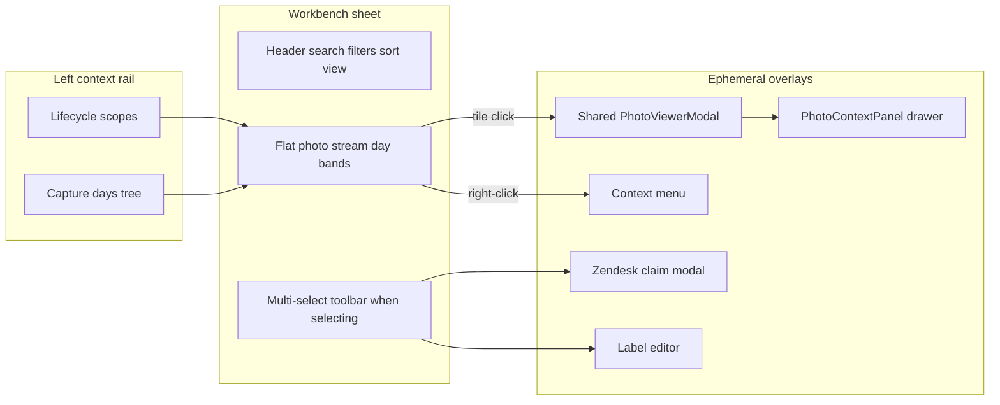

# Research briefing — Media Library: recency-by-station + right-rail action inspector

**For:** Gemini Pro (deep research) — **you have read access to this repository.** Paths below are pointers; open the real files. Do not invent modules from naming convention.
**From:** Cycle Forge engineering
**Date:** 2026-08-07
**Surface:** `/ops/photos` — the Media Library (Workbench pick+edit). **Not** Unbox Displays → Photos; **not** station capture chrome.
**Subject:** Operators want the Media Library to feel **user-friendly for triage**: see **what was recently taken and from which evidence station/stage**, and perform **exact actions** on a selected photo via a **right-rail slide-over** (desk-inspector grammar), not only a fullscreen lightbox Details drawer, a context menu, or a header multi-select toolbar.
**Status:** OPEN research. Prior nav defects from the July Media Library brief are largely **fixed in code**; a prior non-modal photo inspector was **built then deleted**. This brief must not casually reinstate either without adjudication.
**Your deliverable:** a markdown report for an implementing agent. **You do not write repo files.**

**Bias:** Prefer **compose / grow existing SoTs** (`RightRailHost`, `InspectorActionFloor`, shared `photo-gallery` viewer, `LibraryPhoto` identity bundle, evidence `stage` labels). Prefer **deleting or consolidating action planes** over adding a fifth home for the same verb. "More panels" is not an answer unless each plane has a distinct job and a killed twin.

**Related briefs / handoffs (do not re-litigate; cite or supersede with a dated note):**

| Brief / handoff | Overlap / job |
|---|---|
| [`media-library-ux-GEMINI-RESEARCH-BRIEFING.md`](media-library-ux-GEMINI-RESEARCH-BRIEFING.md) (2026-07-28) | Navigation IA. **Partially obsolete** — see §2. Do not re-run Q1–Q3 folder/recency-tab research as if those tabs still exist. |
| [`media-library-rail-card-HANDOFF.md`](media-library-rail-card-HANDOFF.md) | What landed (flat stream, sidebar rail, date sargability) + **explicit: `PhotoInspectorPanel` + `?photoId=` deleted — leave gone** until this research says otherwise. |
| [`photo-evidence-chain-GEMINI-RESEARCH-BRIEFING.md`](photo-evidence-chain-GEMINI-RESEARCH-BRIEFING.md) | Five-stage evidence spine; dispute bar. Station vocabulary for photos is **stage**, not physical bench id. |
| [`station-realtime-capture-visibility-GEMINI-RESEARCH-BRIEFING.md`](station-realtime-capture-visibility-GEMINI-RESEARCH-BRIEFING.md) | Paired desk↔phone capture / Ably visibility — Station contract. Library is Workbench; do not fork a second realtime bus for the library. |
| [`detail-surface-IA-GEMINI-RESEARCH-BRIEFING.md`](detail-surface-IA-GEMINI-RESEARCH-BRIEFING.md) | Desk detail / inspector IA patterns. |
| [`.claude/rules/display/right-rail-inspector.md`](../../.claude/rules/display/right-rail-inspector.md) | Right-rail anatomy + `InspectorActionFloor` law. |

---

## 0. Method — read before answering

### 0.1 Verify in the repo. Not optional.

- Every path you cite must be one you opened. Mark inferences `[UNVERIFIED]`.
- Quote load-bearing evidence: function signature, type field, comment block, SoT table row.
- Do not attribute a product decision to this brief that is not written here; label your own reasoning `"my reasoning:"`.
- If a July-brief defect is already fixed, say **"FIXED — do not re-propose"** and quote the landing code.

### 0.2 Search the web for industry / UX parts. Also not optional.

Answer from **named 2024–2026** systems and published product decisions, not memory. Cover at least:

- Professional / enterprise DAM pick+edit (Adobe Lightroom Classic/Cloud, Bridge, Capture One, Bynder, Cloudinary Media Library, Frame.io, Brandfolder)
- Consumer / drive-style Recent (Google Photos, Google Drive Recent vs My Drive, Dropbox, Box)
- Evidence / DEMS-adjacent (Axon Evidence or peer; insurance claim portals; WMS photo archives) for **recent capture + case linkage**
- Ops SaaS pick+edit twins (Linear issue detail, Salesforce record, Stripe Dashboard) for **inspector vs modal** action floors

Distinguish **immersive lightbox** (single-asset, modal/ephemeral) from **persistent non-modal inspector** (rapid triage across many assets) — both exist in Lightroom/Bridge/Frame.io; rule how they divide the work for *this* evidence library.

### 0.3 Scoring model (mandatory)

Score each hypothesis (H1–H3) and each forced decision (D1–Dn) on:

| Axis | Weight |
|---|---|
| Operator seconds to "see recent + know which station/stage" | high |
| Operator seconds to complete the top 5 verbs (download / share / label / ticket / delete) | high |
| Fitts / eye travel (grid ↔ inspector ↔ lightbox) | high |
| Frame width budget + single right-edge slot | high |
| Compose-from-SoT (no page-local twin) | high |
| URL-as-state honesty (deep link / filter eviction) | medium |
| Dispute / audit provenance honesty (Captured vs Uploaded) | medium |
| Implementation blast radius / deletion payoff | medium |

**Forbidden non-answers:** "tabs for everything"; "it depends"; "keep the toolbar *and* the inspector *and* the context menu *and* the lightbox drawer with the same verbs"; inventing a physical `station_id` without ROI; reintroducing Year→Week folder landing.

---

## 1. Product context

**Cycle Forge** is multi-tenant reseller-operations SaaS for used-goods resellers. USAV is the dogfood tenant only. The Media Library is the org's **photo-evidence DAM**: inbound unboxing, triage, testing, repair, packing, shipping, and claims captures land here for dispute packs, ticket attach, and supervisor spot-check.

**UI identity — Kinetic Ledger:** dense, state-colored, scan-aware; **legible throughput over document calm**. Region vocabulary is mandatory:

| Contract | Job on this surface |
|---|---|
| **Workbench** (default for `/ops/photos`) | pick → inspect/edit → persist; durable URL filters; multi-select |
| **Monitor** (possible sub-region) | observe a stream ("what just landed") with no durable record selection |
| **Station** | out of scope for this brief (capture happens on benches; library is desk) |

The operator's jobs, in rough frequency order (unchanged from the July brief's §1 — still load-bearing):

1. Identifier → photos (PO / order / tracking / serial / ticket)
2. **What did we photograph in the last hour / today — and where in the pipeline?** (recency + station/stage)
3. Pull every photo for an entity and ZIP it for a claim
4. Attach selected photos to a Zendesk ticket
5. Find a serial close-up / labeled shot

**Note what is newly emphasized for this brief:** job (2) is not only "newest first grid." Operators want **station/stage provenance on the face of recency**, and **actions in a right-rail slide-over** like other desk Workbench inspectors — not buried behind ⋮ / lightbox Info / select-mode toolbar.

---

## 2. Settled / closed — do not overturn casually

If you recommend violating one, say so explicitly and name the replacement contract.

| Claim | Status | Where |
|---|---|---|
| Polymorphic `photo_entity_links` is the link hub | Closed | `.claude/rules/polymorphic-tables.md` · evidence brief |
| Evidence stage spine (arrival → packing) | Closed | `src/lib/photos/stages.ts` |
| Flat reverse-chron stream is landing | **Shipped** | `DEFAULT_PHOTO_LIBRARY_VIEW = 'grid-sm'` in `library-filter-state.ts` |
| Year→Month→Week→Day folder hierarchy as primary nav | **Deleted** | Handoff §2; `?view=folders` degrades to flat stream |
| Chrome "Recent · Today · Last 7 · All" date tabs | **Deleted** | Comments in `library-filter-state.ts` ~L122–127 |
| Left facet rail empty | **Fixed** | `PhotoLibrarySidebarPanel` mounted from `SidebarContextPanel` for `ops-photos` |
| Date filter non-sargable PST cast | **Fixed** | Handoff §3 — half-open UTC bounds |
| Always-open SearchField on this surface | House exception | `ui-design-system.md` / `source-of-truth.md` |
| Prior non-modal `PhotoInspectorPanel` + `?photoId=` | **Deleted by operator** | Handoff §2; `parsePhotoLibraryDisplayParams` comment ~L526–536 |
| No second hybrid search engine for photos | House law | `AGENTS.md` — grow search SoT or defend identifier finder |
| Physical floor `station_id` on photo rows | **Does not exist** | Schema: `taken_by_staff_id`, `photo_type`, `client_captured_at` — stage inferred |

**July briefing obsolescence (dated 2026-08-07):** §§3.1–3.5 of `media-library-ux-GEMINI-RESEARCH-BRIEFING.md` (Recent fetches zero; All≡Recent; folder trap; orphaned views as primary pain) describe a world that **no longer ships**. Treat that brief as historical diagnosis + still-useful Q4–Q8 industry framing — not as current anatomy.

---

## 3. Measured anatomy (2026-08) — verify

### 3.1 Layout



**Missing today:** a desk `RightRailHost` occupant for a selected library photo (push column, `modal={false}`, resize, `→|` dismiss, action floor). The page wraps in `RightPaneOverlayHost` for overlays — that is **not** the Workbench record inspector SoT.

### 3.2 Key files (read these)

| Path | Role |
|---|---|
| `src/components/photos/PhotoLibraryPage.tsx` | Page orchestrator: filters, selection, bulk actions, context menu, overlays |
| `src/components/photos/PhotoLibrarySidebarPanel.tsx` | Left facet rail — scopes + capture days from **loaded** stream |
| `src/components/photos/PhotoLibraryToolbar.tsx` | Multi-select action bar under header — **explicitly not right-rail** |
| `src/components/photos/photo-library-types.ts` | `LibraryPhoto` identity bundle |
| `src/lib/photos/library-filter-state.ts` | URL contract; no `?photoId=`; landing + scopes |
| `src/lib/photos/stages.ts` | `PHOTO_EVIDENCE_STAGES` + `photoStageLabel` |
| `src/components/shipped/photo-gallery/PhotoViewerModal.tsx` | Fullscreen viewer SoT |
| `src/components/shipped/photo-gallery/PhotoContextPanel.tsx` | Lightbox **Details** drawer — provenance, not Macro action floor |
| `src/components/right-rail/InspectorActionFloor.tsx` | Desk inspector Macro floor SoT |
| `.claude/rules/display/right-rail-inspector.md` | Anatomy law |
| `.claude/rules/display/workbench.md` | Pick+edit contract; action planes |
| `docs/todo/media-library-rail-card-HANDOFF.md` | Shipped phases + inspector deletion note |

### 3.3 `LibraryPhoto` already carries triage fields

From `photo-library-types.ts` (quote when you verify):

- `stage` — evidence stage via `stageFromPhotoType` → display with `photoStageLabel`
- `sourceScope` — `unboxing` · `local_pickup` · `packing` · `repair` · `claims` · …
- `takenByStaffId` / `takenByStaffName`
- `createdAt` (server upload) vs `clientCapturedAt` (device shutter — may be null)
- `poRef`, `ticketId`, `sku`, `serialNumber`, `unitUid`, `tracking`, `platform`
- `labels[]`, `damageDetected`, `hasAnalysis`, `caption`

**Station vocabulary gap:** there is **no** column for "Unbox bench #3" / device id / named floor station. Operator language "from what station" maps today to:

1. **Evidence stage** (`Arrival · package` · `Unbox · carton` · `Unbox · item` · `Testing` · `Packing`)
2. **Source scope** (sidebar lifecycle folder)
3. **Staff** who took/uploaded

Your research must say whether that proxy is **enough for the recency job**, or whether a schema/capture change is justified (Ask-first; ROI against dispute + supervisor spot-check).

### 3.4 Action inventory as shipped (map every verb)

| Verb | Where it lives today | Notes |
|---|---|---|
| Open / zoom / filmstrip | Tile click → shared lightbox | Ephemeral selection (`usePhotoGridLightbox`) |
| Details / provenance | Lightbox Info → `PhotoContextPanel` | Width-tween sibling; read-heavy |
| Download one | Context menu · lightbox toolbar | |
| Download / ZIP many | `PhotoLibraryToolbar` bulk | Cap via share/ZIP APIs |
| Copy share link / share page | Context menu · bulk toolbar | Permission `photos.share` |
| Edit labels | Context menu · bulk → `PhotoLabelEditor` | |
| Attach to ticket / claim | Context menu · bulk → `ZendeskClaimModal` | Permission-gated |
| Delete one / many | Context menu · toolbar armed delete | Permission `photos` manage |
| Open in new tab | Context menu | |
| Jump to linked entity | Lightbox Details nav link | Provenance helper |
| NAS backup | Ticket-leaf chrome (`PhotoLibraryTicketNasBackup`) | Not a general photo verb |
| Filter by staff / damage / analysis | Header filters | |
| Filter by scope / day | Left sidebar | Days from **loaded** page only |
| Capture request / phone push | **Station surfaces** | Out of library scope unless you argue otherwise |
| Move between POs | **Unbox Displays Photos** | Station tool — not library toolbar today |

**Toolbar self-description** (`PhotoLibraryToolbar.tsx`): other collection surfaces use the right-rail selection plane; this page keeps bulk actions "up" near the folder path, Finder-style. That is a deliberate fork from desk orders — attack or defend it.

### 3.5 Prior inspector deletion (load-bearing product signal)

From `media-library-rail-card-HANDOFF.md` §2:

> The non-modal photo inspector (`PhotoInspectorPanel.tsx`, `?photoId=` URL state) was built, verified, then deleted. Its URL plumbing was cleanly removed too. Leave it gone.

From `library-filter-state.ts` `parsePhotoLibraryDisplayParams`:

> There is deliberately no `?photoId=` record selection here. The library's open-a-photo surface is the shared fullscreen viewer, whose selection is EPHEMERAL by design… re-adding a durable record param means re-answering what happens when a filter change evicts that photo from the result set…

**H3 exists so you explain *why* deletion was rational**, and what would have to be different for a right-rail return to earn its place (different verbs, different selection model, different redundancy kill-list).

### 3.6 Gaps the product hypothesis asserts

1. **Recency face is weak on station/stage** — sticky day bands exist; stage/staff/"which bench job" is not a first-class stream face (often buried in Details).
2. **No right-rail action slide-over** — desk Workbench golden (orders) has push inspector + action floor; library does not.
3. **Action plane sprawl** — toolbar + context menu + lightbox toolbar + Details drawer can all host similar verbs; no single plane map.
4. **"Station" language underspecified** — operators say station; data says stage/scope/staff.
5. **Capture-days sidebar is loaded-stream only** — not a full-archive "recent across stations" index.

---

## 4. Hypotheses to validate (score independently)

### Product ask (owner)

> Upgrade the Media Library so it is more user-friendly: show **recent captures with what station/stage they came from**, and expose **exact actions** through a **right-rail slide-over** component like other desk inspectors.

### Engineering framing

| # | Claim | If true… | If false… |
|---|---|---|---|
| **H1 — Recency** | Operators need a **first-class** "recent + station/stage provenance" surface on `/ops/photos`, not only newest-first tiles. | Ship a recency band / grouping / Monitor-flavored facet with stage+staff on the face. | Keep day bands + filters; improve tile/metadata chrome only. |
| **H2 — Inspector** | Selecting a photo should open a **non-modal right-rail** with provenance + **Macro action floor**, not only lightbox Details / ⋮ / select toolbar. | Compose `RightRailHost` + house inspector anatomy; kill redundant planes. | Keep ephemeral lightbox as the record surface; deepen `PhotoContextPanel` or toolbar instead. |
| **H3 — Deletion postmortem** | The prior `PhotoInspectorPanel` failed for a **specific, diagnosable** reason (redundancy, URL eviction, wrong actions, frame budget, operator taste). | Any return must **differ** on that axis and name what is deleted. | Deletion was premature / incomplete; restore a corrected twin with a kill-list. |

**You must score H1, H2, and H3 separately.** Strong H1 with weak H2 is a useful outcome (recency chrome without a rail). Strong H2 with weak H1 is also useful (inspector without a new recency region).

---

## 5. Industry questions

**Q1 — Lightbox vs persistent inspector.** In 2026 DAM/evidence UIs, when does a **non-modal right inspector** win over an **immersive lightbox** for triage? What verbs stay in which surface? Cite Lightroom, Bridge, Frame.io, Bynder/Cloudinary at minimum.

**Q2 — Recent + "where it came from."** How do evidence / DEMS / ops photo archives present **just-captured** assets with **pipeline stage / camera / station / case** metadata on the stream face (not only in a detail pane)? What is the standard density?

**Q3 — Multi-select bar vs record action floor.** When both exist (Google Photos, Drive, Frame.io, Linear), what is the split? When is Finder-style "actions up" correct vs Workbench "actions on the right"?

**Q4 — Durable URL selection for media.** Do modern DAMs deep-link a selected asset (`?asset=`) while filters change, and how do they handle eviction? Is ephemeral lightbox selection the industry default for grids?

**Q5 — Station vs stage labeling.** In warehouse / reverse-logistics evidence tools, is "station" a **physical bench**, a **workflow stage**, or a **device**? What copy avoids lying when only stage+staff exist?

**Q6 — What to delete.** Industry products that added a third action home (toolbar + context + inspector) — what did they remove? Prefer deletion-ordered precedent.

---

## 6. Codebase questions (repo research)

1. Trace every user-visible verb on `/ops/photos` from `PhotoLibraryPage` (bulk `photoBulkActions`, context menu builder, lightbox entry). Produce the plane map as-shipped.
2. What does `PhotoContextPanel` already show that a right-rail would duplicate? Quote fields. Which **actions** does it *not* host?
3. Does the flat grid / list / ticket view surface `stage`, `takenByStaffName`, and Captured vs Uploaded on the **tile/row face**, or only after Details? Quote `PhotoCard` / `PhotoListView` / format helpers.
4. How does desk orders compose `RightRailHost` + `InspectorActionFloor` for pick+edit? What would Media Library need to register as an occupant id? Quote store / occupant patterns.
5. Re-read the `?photoId=` retirement comment. Propose the **smallest** selection model that satisfies H2 without recreating filter-eviction bugs — or argue ephemeral selection + rail is incoherent.
6. Is `sourceScope` vs `stage` the right "station" proxy for supervisors? Give an example row set where they diverge (e.g. packing scope vs `packing` stage; claims scope with unboxing-stage photo attached as evidence).
7. Realtime: `usePackerPhotosRealtimeRefresh` / receiving photo events on the library page — does the stream already live-update? Enough for H1, or do we need a Monitor band?
8. If a right-rail returns, which of toolbar / context menu / lightbox Details / lightbox toolbar **lose** verbs? Name the kill-list (house law: one primary plane per action).

---

## 7. Forced decisions (one pick each — no "it depends")

For each: **current behavior**, **strongest steelman for change**, **strongest steelman against**, **your verdict**, **what is deleted if change**.

| # | Decision |
|---|---|
| **D1** | Region model: pure **Workbench** vs **Workbench + Monitor recency band** vs something else (no fifth contract). |
| **D2** | H2 verdict: **No rail** · **Rail on single select** · **Rail only in select-mode** · **Rail replaces toolbar** · **Grow lightbox Details into action surface** (kill rail). |
| **D3** | Selection durability: **ephemeral only** (status quo) · **`?photoId=` returns with eviction rules** · **other URL token** (name it). |
| **D4** | Action plane map — assign **every** verb in §3.4 to exactly one primary plane: in-cell · context menu · multi-select toolbar · record inspector floor · lightbox toolbar · lightbox Details. |
| **D5** | Recency UI shape: day bands only · stage-grouped stream · "Last hour / Live" Monitor strip · staff×stage activity feed · saved smart view "Today by station". |
| **D6** | Station vocabulary: **stage labels only** · **scope + stage** · **staff + stage** · **new capture-station / device column** (schema + write path — justify ROI). |
| **D7** | If rail returns: compose **`RightRailHost` + `InspectorActionFloor` + desk chrome** vs page-local twin (page-local is almost always wrong — defend only with Ask-first). |
| **D8** | Relationship to Unbox Displays Photos (Move/Send) and station capture request — **library never owns those** · **library deep-links into station** · **library gains Move/Send**. |
| **D9** | List view → `LedgerGrid` (still backlog in handoff) — **required for inspector** · **independent** · **rejected**. |
| **D10** | What dies: name concrete files/surfaces/verbs removed so action sprawl shrinks. |

---

## 8. Required deliverable shape (ordered)

1. **Executive answer** — 5–10 sentences. H1/H2/H3 scores; winning D2; landing recency face; whether a right-rail returns and what it kills.
2. **Industry survey** — by pattern (not company laundry list), with citations; flag 2024–2026 shifts.
3. **Codebase gap analysis** — as-shipped plane map; what `LibraryPhoto` already gives; what the deleted inspector likely duplicated `[UNVERIFIED]` if git history is thin.
4. **Per-decision rulings** — D1–D10 with rejected counter-arguments.
5. **Exact action catalog** — table: Verb · Primary plane · Secondary (if any) · Permission · Notes. Must cover §3.4 minimum plus any you add.
6. **Inspector anatomy (if D2 keeps a rail)** — ASCII wireframe matching house law (chrome row · topics or none · body provenance · `InspectorActionFloor`). Name which desk twin (orders vs incoming) it follows.
7. **Recency anatomy** — what the operator sees in the first viewport for "what was just taken from what station."
8. **Phased implementation** — P0 (no product fork) → P1 → P2 → P3; each phase deletion-ordered; mark engineering vs product decision; leave `npm run verify` green in principle.
9. **Anti-patterns we will reject** — list (see below).
10. **Open risks** — least confidence; what telemetry / user test / EXPLAIN would resolve.
11. **≤40-line implementer prompt** — for a coding agent after your rulings.

### Anti-patterns (reject if your answer proposes them)

- Reinstating Year→Week folder landing or non-sargable date predicates
- A second lightbox or a page-local photo viewer
- A right rail that **floats** over the grid (house law: desk inspectors **push** via `RightRailHost` `modal={false}`)
- Keeping toolbar + context menu + inspector floor + lightbox Details with the **same** primary verbs
- Inventing `station_id` "for completeness" without dispute/supervisor ROI
- Raising DS ratchet baselines
- Solving Station capture reliability inside the Media Library brief
- Re-litigating polymorphic links or the five-stage spine

---

## 9. Suggested read order (repo)

1. `AGENTS.md` — Hard laws (right-rail modality, frame budget, compose SoT)
2. `.claude/rules/source-of-truth.md` — Right-rail modality · Frame column budget · Photo gallery viewer SoT
3. `.claude/rules/display/workbench.md` — pick+edit · action planes
4. `.claude/rules/display/right-rail-inspector.md` — inspector anatomy · `InspectorActionFloor`
5. `docs/todo/media-library-rail-card-HANDOFF.md` — shipped state + inspector deletion
6. `docs/todo/media-library-ux-GEMINI-RESEARCH-BRIEFING.md` — historical nav diagnosis only
7. `src/lib/photos/library-filter-state.ts` — URL contract · no `?photoId=`
8. `src/components/photos/photo-library-types.ts` — identity bundle
9. `src/components/photos/PhotoLibraryPage.tsx` — actions
10. `src/components/photos/PhotoLibraryToolbar.tsx` — bulk plane rationale
11. `src/components/photos/PhotoLibrarySidebarPanel.tsx` — left rail
12. `src/components/shipped/photo-gallery/PhotoContextPanel.tsx` — lightbox Details
13. `src/lib/photos/stages.ts` — station-order evidence labels
14. Desk twin: orders `RightRailHost` occupant + `InspectorActionFloor` usage (trace from `right-rail` store / dashboard orders)

---

## 10. One-sentence success criterion

A correct answer tells an engineer **exactly** whether a Media Library right-rail returns, which verbs live on its action floor, how "recent from what station" is painted without lying about physical benches, and which of toolbar / context menu / lightbox Details **lose** those jobs so we do not grow a twin.

---

## 11. Paste-ready Gemini prompt

```
You are Gemini Pro doing deep research for Cycle Forge (multi-tenant reseller-ops SaaS).

Read the full briefing at:
docs/todo/media-library-inspector-recency-GEMINI-RESEARCH-BRIEFING.md

You HAVE repo access. Verify every path. Mark inferences [UNVERIFIED]. Label your own reasoning "my reasoning:".

Job:
1) Industry survey (2024–2026 named systems) for DAM/evidence: lightbox vs non-modal inspector; recent+stage face; multi-select bar vs record action floor.
2) Codebase gap analysis of /ops/photos as shipped in 2026-08 (flat stream, sidebar scopes, toolbar bulk actions, lightbox PhotoContextPanel, NO RightRailHost photo occupant; prior PhotoInspectorPanel deleted).
3) Score H1 Recency, H2 Inspector, H3 Deletion postmortem independently.
4) Force D1–D10 — one pick each. Produce the exact action catalog (one primary plane per verb) and, if a rail returns, house-law inspector anatomy + kill-list.
5) Phased P0–P3 deletion-ordered plan + ≤40-line implementer prompt.

Do NOT re-litigate folder Year→Week landing, polymorphic links, or the five-stage spine.
Do NOT casually reinstate ?photoId= / PhotoInspectorPanel without addressing the retirement comment in library-filter-state.ts and the handoff deletion note.
Do NOT invent physical station_id without ROI.
Do NOT write repo files — return the markdown report only.
```

---

## 12. Implementation notes for the human/agent (not for Gemini)

- **Write location:** this file only for research; implementation follows a later `*-PLAN.md` after rulings.
- **Do not** edit the July `media-library-ux` briefing in place — supersede via the Related table above.
- **Do not** start Unbox Displays Photos work under this brief (operator locked scope to Media Library).
- Verify gate before any implementation PR: `npm run verify`. Never raise ratchet baselines.
- Concurrent uncommitted Media Library chrome may still move — re-read `PhotoLibraryPage.tsx` / sidebar / filter-state immediately before implementing.
