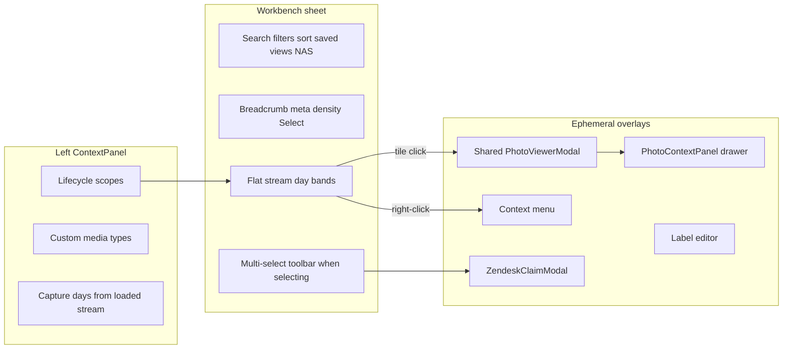

# Research briefing — Media Library extensive upgrade: Unbox SoT parity + 2026 DS principles

**For:** Gemini Pro (deep research) — **you have read access to this repository.** Paths below are pointers; open the real files. Do not invent modules from naming convention.
**From:** Cycle Forge engineering
**Date:** 2026-08-09
**Surface:** `/ops/photos` — the Media Library (Workbench pick+edit evidence DAM). **Not** Unbox Displays → Photos capture tools; **not** station dock capture chrome; **not** the attach picker modal (`MediaLibraryPickerModal`).
**Subject:** Operators now experience **Unbox** as the golden “information in the centre + actions / KNOW tools on the right” composition. The Media Library must be upgraded into an **extensively detailed, sellable DAM desk** that **composes the same source-of-truth laws** (C2 thin waist · desk inspector grammar · armed-verb presentation · flush hosts · provenance honesty · URL-as-state · one primary action plane) — without cloning Station Displays onto a spreadsheet archive. Adjudicate against **2024–2026 industry design-system principles** for DAM / evidence archives / Workbench master–detail.
**Status:** OPEN research. Supersedes the *scope* of prior Media Library briefs for **upgrade architecture**; does **not** reopen settled nav defects (folder landing, recency tabs) or casually reinstate the deleted `PhotoInspectorPanel`.
**Your deliverable:** a markdown report for an implementing agent. **You do not write repo files.**

**Bias:** Prefer **compose / grow existing SoTs** (`RightRailHost`, `DeskInspectorIndexShell` → `DisplaysIndexLeafStage`, `InspectorActionFloor`, `StationArmedVerbList` / `useArmedCursorList` *presentation*, shared `photo-gallery` viewer, `LibraryPhoto` identity, evidence `stage` labels, Workbench chrome). Prefer **deletion-ordered consolidation** of action planes over a fifth home for the same verb. “Match Unbox” means **parity of laws + shared waist**, never **host merge**.

---

## 0. Method — read before answering

### 0.1 Your job (six deliverables — keep separate)

1. **Industry DAM / evidence-desk survey (2024–2026).** How do mature DAM, DEMS-adjacent, insurance/claim photo archives, and dense B2B ops desks present: (a) a **recency stream with provenance on the face**, (b) a **persistent non-modal inspector** vs immersive lightbox, (c) **bulk vs single-asset action floors**, (d) **index→leaf topic grammar** for asset detail? Name products. Cite primary sources. State dominant patterns + win conditions for minorities.
2. **2026 design-system principle catalog for this surface.** Produce a named taxonomy (mirror structure of `right-rail-ds-principles-2026-GEMINI-RESEARCH-BRIEFING.md` §0.3 classes A–H) scoped to **photo/evidence Workbench libraries** — not scan tool columns. Each principle: name · one-sentence rule · who ships it · when warehouse-ops SaaS may deviate.
3. **Codebase gap audit (as-shipped 2026-08-09).** Map every principle + every Unbox SoT law in §2 onto `/ops/photos`. Verdict per item: `PASS` / `PARTIAL` / `FAIL` / `N/A (defended deviation)` with file quotes.
4. **Upgrade architecture scorecard.** Score the candidates in §0.3. Pick **one winning architecture** for an extensively built-out Media Library. Name hard bans.
5. **Capability backlog (deletion-ordered).** What must be built, grown, or killed so the library feels as “detailed” as Unbox’s Displays information density — without becoming a second Unbox station.
6. **Implementer decision pack.** Exact rulings D1–Dn + ≤40-line coding-agent prompt + acceptance criteria an engineer can verify on a dogfood walk of `/ops/photos`.

### 0.2 Hard framing rules

**A — Industry first, then house reconciliation.**  
For deliverables 1–2 and the architecture scorecard, compare against **industry standards** (named products, DS docs, WMS/evidence practice, citable UX research). Then, in a **separate** section, reconcile against Cycle Forge SoT (§2). Where industry and house conflict, pick a side with reasoning. A defended deviation beats a generic best-practice list.

**B — “Match Unbox” does NOT mean clone Station Displays.**  
Unbox centre = ops-flow carton work; Unbox right = Station **Displays** (`StationDisplaysPushStack`). Media Library centre = evidence archive grid; Media Library right (if any) = desk **Inspector** (`RightRailHost`). Settled C2 thin waist (2026-08-09): share tokens + `DisplaysIndexLeafStage` + domain APIs; **fork** hosts, dismiss chords, action floors, AI occupancy, visit history. Calling the library rail “Displays” or mounting `StationDisplaysPushStack` as a `RightRailHost` occupant is a hard ban unless Ask-first with extraordinary evidence.

**C — Do not casually reinstate deleted work.**  
`PhotoInspectorPanel` + durable `?photoId=` were built, verified, then **deleted by the operator**. Any return must (1) diagnose why deletion was rational, (2) differ on that axis, (3) publish a kill-list of redundant planes. See prior brief H3.

**D — Repo verification is mandatory.**  
Every path you cite must be one you opened. Mark inferences `[UNVERIFIED]`. Quote load-bearing signatures / comments. If a July-2026 nav defect is already fixed, say **FIXED — do not re-propose**.

### 0.3 Candidate architectures (score all)

| ID | Candidate | One-line |
|---|---|---|
| **A1** | **Lightbox-only deepening** | Keep ephemeral fullscreen viewer + `PhotoContextPanel` as the only record surface; enrich tile face + Details; no right rail |
| **A2** | **Desk inspector return (single-topic)** | Select photo → `RightRailHost` peek with provenance body + `InspectorActionFloor`; lightbox stays immersive zoom |
| **A3** | **Desk inspector index→leaf (Unbox waist)** | Select photo → `DeskInspectorIndexShell` topics (Identity · Evidence · Links · Activity · Actions…) dogfooding `DisplaysIndexLeafStage`; Macro floor on commit verbs |
| **A4** | **Station Displays clone on `/ops/photos`** | Mount `StationDisplaysPushStack` beside the grid as if the library were a scan station |
| **A5** | **Split Monitor + Workbench** | Top/side “Live / Last hour by stage” Monitor band + Workbench grid + optional inspector |
| **A6** | **Full DAM route family** | `/ops/photos` browse + `/ops/photos/[id]` dedicated detail route + collections / share-pack browser / listing-gallery curator as sibling routes |
| **A7** | **Finder-toolbar forever** | Multi-select header toolbar remains primary action plane; deepen context menu; reject inspector |

Score 1–5 on each axis; report a table. No eighth axis.

| Axis | Meaning |
|---|---|
| **Triage seconds** | Time from land → “what just happened / which stage” → complete top verbs |
| **Detail honesty** | Provenance (Captured vs Uploaded · stage · entity links) is visible without mode errors |
| **Action-plane clarity** | One primary home per verb; no toolbar∪menu∪Details∪floor sprawl |
| **Unbox SoT parity** | Composes C2 waist + desk inspector laws without host merge / noun lies |
| **Sellable density** | Survives ~1080p + left facet rail + optional push inspector + `MIN_WORK_SURFACE_PX` |
| **Evolution cost** | Cost to evolve library independently of Unbox Photos verbs / station capture |

**ROI ≈ (Triage × Honesty × Clarity × Parity × Density) / (6 − Evolution cost).** Rank A1–A7. State winner, runner-up win conditions, **hard bans**.

### 0.4 Related briefs — cite, do not redo

| Brief / handoff | Already owns | Your move |
|---|---|---|
| [`media-library-ux-GEMINI-RESEARCH-BRIEFING.md`](media-library-ux-GEMINI-RESEARCH-BRIEFING.md) (2026-07-28) | Folder/recency-tab nav defects | **Historical** — §§3.1–3.5 obsolete; reuse industry Q framing only |
| [`media-library-rail-card-HANDOFF.md`](media-library-rail-card-HANDOFF.md) | Flat stream, sidebar, sargable dates, inspector deletion | **Settled shipped** — do not undo |
| [`media-library-inspector-recency-GEMINI-RESEARCH-BRIEFING.md`](media-library-inspector-recency-GEMINI-RESEARCH-BRIEFING.md) (2026-08-07) | H1–H3 recency + inspector + D1–D10 | **Extend** — this brief adds Unbox golden patterns + full DAM capability gate; if that brief is still unanswered, fold its D1–D10 into your rulings rather than ignoring them |
| [`scan-vs-desk-right-rail-separation-GEMINI-RESEARCH-BRIEFING.md`](scan-vs-desk-right-rail-separation-GEMINI-RESEARCH-BRIEFING.md) | C2 thin waist | **ANSWERED** — treat as constitution input |
| [`right-rail-ds-principles-2026-GEMINI-RESEARCH-BRIEFING.md`](right-rail-ds-principles-2026-GEMINI-RESEARCH-BRIEFING.md) | Cross-cutting right-edge DS principles | **Cite / parallel method** — do not re-audit Station Displays; apply the same principle classes to Media Library |
| [`history-inspector-ds-and-table-actions-GEMINI-RESEARCH-BRIEFING.md`](history-inspector-ds-and-table-actions-GEMINI-RESEARCH-BRIEFING.md) | Desk History inspector twin | **Dogfood twin** for desk index→leaf + Macro floor |
| [`desk-show-inspector-view-and-table-edit-GEMINI-RESEARCH-BRIEFING.md`](desk-show-inspector-view-and-table-edit-GEMINI-RESEARCH-BRIEFING.md) | Show inspector vs table edit | Adjacent desk grammar |
| [`photo-evidence-chain-GEMINI-RESEARCH-BRIEFING.md`](photo-evidence-chain-GEMINI-RESEARCH-BRIEFING.md) | Dispute evidence stages | Narrow: library must *surface* stage honesty, not redefine claim law |
| [`unbox-listing-photo-compare-display-GEMINI-RESEARCH-BRIEFING.md`](unbox-listing-photo-compare-display-GEMINI-RESEARCH-BRIEFING.md) | Listing↔bench Compare modality | **ANSWERED D4 centre stage** — library Compare is a different job; do not steal Unbox Compare into `/ops/photos` without ROI |
| [`unbox-photos-armed-rows-no-tabs-HANDOFF.md`](unbox-photos-armed-rows-no-tabs-HANDOFF.md) | Photos Actions armed rows | **Locked** Unbox pattern — library may twin *presentation*, different verb set |

Your unique job: **what extensively built-out Media Library architecture wins after Unbox’s 2026-08 SoT landing**, with industry DS receipts and a deletion-ordered backlog.

---

## 1. Product context (facts only)

**Cycle Forge** is multi-tenant **reseller-operations SaaS** (used-goods / electronics refurb is the first dogfood tenant). Frame recommendations as **sellable B2B warehouse/fulfillment software**, not a five-person shop tool.

**UI identity — Kinetic Ledger:** dense, state-colored, scan-aware; **legible throughput over document calm**.

**Region contracts (mandatory vocabulary):**

| Contract | Media Library role |
|---|---|
| **Workbench** | Default for `/ops/photos` — pick → inspect/edit → persist; durable URL filters; multi-select |
| **Monitor** | Possible sub-region for “what just landed” streams — only if ROI beats Workbench chrome |
| **Station** | Capture happens on benches (Unbox · Arrival · Testing · Pack). Library is **desk archive**, not a capture dock |
| **Canvas** | Out of scope |

**Operator jobs (frequency order — still load-bearing):**

1. Identifier → photos (PO / order / tracking / serial / ticket)
2. What did we photograph recently — **and from which pipeline stage / scope?**
3. Pull every photo for an entity → ZIP / share pack for a claim
4. Attach selected photos to a Zendesk ticket
5. Find a serial close-up / labeled / damage-flagged shot
6. *(aspirational for “extensively built-out”)* Curate listing galleries, manage share packs, audit Captured vs Uploaded honesty, jump entity↔photo without losing filter context

**Unbox operator experience that raised the bar (empirical, 2026-08):**

- Centre holds the carton work plane (PO lines + label).
- Right Displays holds **KNOW** tools with **armed verb rows** + URL drills + Macro action floor.
- Dock holds the armed capture beat.
- Information density is high; verbs are discoverable without burying them in ⋮ only.

The Media Library must feel **that detailed for desk evidence work** — not become a fake scan station.

---

## 2. Unbox / house SoT laws this upgrade must compose with

Read and quote. These are **constraints for the reconciliation section**, not industry truth.

### 2.1 Displays ≠ Inspector (nouns + hosts)

| Noun | Region | Host | Operator copy | Chord |
|---|---|---|---|---|
| **Displays** | Station | `StationDisplaysPushStack` | Open displays | ⌘] |
| **Inspector** | Desk | `RightRailHost` | Show inspector | ⌘\ / ] |

Never call Media Library’s right edge “Displays.” Never mount Station Displays on `RightRailHost`.

**Constitution:** `AGENTS.md` · `.claude/rules/source-of-truth.md` → Displays vs inspector · Scan vs desk right-edge C2 · Right-rail modality · Frame column budget.  
**Desk recipe:** `.claude/rules/display/right-rail-inspector.md`.  
**Station recipe:** `.claude/rules/display/station-workbench.md` · `scan-cockpit.md` (**N/A** to library capture).

### 2.2 C2 thin waist (share vs fork)

**Share:** design tokens · `DisplaysIndexLeafStage` · domain photo APIs / stage spine / `LibraryPhoto` identity.  
**Fork:** host shells · resize/dismiss chords · action floors (`InspectorActionFloor` vs `StationDisplaysActionFloor` / `UnboxDisplaysActionFloor`) · AI occupancy · visit-history stacks.

### 2.3 Armed verb lists (presentation law)

Unbox Photos leaf: `PhotosActionsArmedList` → URL `?photoAction=` drills; letters via `photo-verb-nav-keys.ts`. Sibling leaves: `StationArmedVerbList` + `useArmedCursorList`. Never nested parent `TabDisplay` underline for leaf-level actions. Child `segment` only inside a tool.

**Library implication:** if the inspector gains multi-topic depth, prefer **index→leaf + armed rows** over tab parades — via `DeskInspectorIndexShell`, not `StationDisplaysPushStack`.

### 2.4 Action floors

| Plane | Component | Allowed on Media Library? |
|---|---|---|
| Desk Macro | `InspectorActionFloor` + `InspectorFlushDelete` | **Yes**, if a desk inspector returns |
| Station Macro | `UnboxDisplaysActionFloor` | **No** |
| Finder-style bulk toolbar | `PhotoLibraryToolbar` | Exists today — must be adjudicated vs inspector (kill or specialize) |

### 2.5 Other hard laws that touch this surface

- **Right edge PUSHES** — `RightRailHost` `modal={false}`; never float a rounded card over the grid.
- **Frame budget** — desk center keeps `MIN_WORK_SURFACE_PX`; left `ContextPanelLayout` stays open under pressure (never auto-park left to save the inspector).
- **Photo viewer SoT** — `@/components/shipped/photo-gallery` only; never a second lightbox.
- **Host vs content pad · flush-square ops chrome · depth-as-planes.**
- **Nav keys** — one owner (`src/lib/keyboard/nav-keys/`); library currently has grid shortcuts but **not** `⌘;` region arm — rule whether Right region arms an inspector.
- **Optimistic URL paint** — if durable selection returns, use `useOptimisticUrlParam` / `resolveOptimisticParam`; never a feature-local pending twin.
- **Compose → grow SoT → compound** — grow `DeskInspectorIndexShell` / photo identity helpers; never a page-local inspector twin.
- **No second search engine** — grow search SoT or defend identifier finder only.
- **Evidence stage spine** — `src/lib/photos/stages.ts`; physical `station_id` does **not** exist (stage · scope · staff proxies).

---

## 3. Measured Media Library anatomy (2026-08-09) — verify

### 3.1 Layout (as-shipped)



**Missing vs Unbox-class density:** a desk `RightRailHost` occupant; `InspectorActionFloor`; index→leaf topic depth for a selected asset; stage/Captured-vs-Uploaded on the **tile face**; nav-keys Right region; share-pack browser; listing-gallery curator inside the library; LedgerGrid list mode.

### 3.2 Key files (open these)

| Path | Role |
|---|---|
| `src/app/ops/photos/page.tsx` | Route + permission |
| `src/components/photos/PhotoLibraryPage.tsx` | Orchestrator: selection, bulk, context, overlays |
| `src/components/photos/PhotoLibrarySidebarPanel.tsx` | Left facet rail (only writer of `sourceScope` / `imageType`) |
| `src/components/photos/PhotoLibraryWorkspaceHeader.tsx` | Workbench chrome refinements |
| `src/components/photos/PhotoLibraryHeader.tsx` | Path strip / density / Select |
| `src/components/photos/PhotoLibraryToolbar.tsx` | Multi-select action bar — Finder-style fork |
| `src/components/photos/PhotoLibraryGrid.tsx` + `photo-library-grid/*` | Views + lightbox portal |
| `src/components/photos/photo-library-types.ts` | `LibraryPhoto` identity bundle |
| `src/lib/photos/library-filter-state.ts` | URL SoT — **no `?photoId=`** (quote comment ~L526) |
| `src/lib/photos/stages.ts` | Evidence stage labels |
| `src/lib/photos/capture-provenance.ts` | Captured shutter wire |
| `src/components/shipped/photo-gallery/PhotoContextPanel.tsx` | Lightbox Details (provenance) |
| `src/components/right-rail/DeskInspectorIndexShell.tsx` | Desk index→leaf waist twin |
| `src/components/right-rail/InspectorActionFloor.tsx` | Desk Macro floor |
| `src/components/station/displays/DisplaysIndexLeafStage.tsx` | Shared stage body |
| `src/components/receiving/workspace/line-edit/PhotosActionsArmedList.tsx` | Unbox Photos armed verbs (pattern twin) |
| `src/components/receiving/workspace/line-edit/UnboxDisplaysActionFloor.tsx` | Station Macro — **do not mount here** |

### 3.3 Settled — do not overturn casually

| Claim | Status |
|---|---|
| Flat reverse-chron stream landing (`DEFAULT_PHOTO_LIBRARY_VIEW = 'grid-sm'`) | Shipped |
| Year→Week folder hierarchy as primary nav | Deleted |
| Chrome “Recent · Today · Last 7 · All” date tabs | Deleted |
| Left facet rail mounted for `ops-photos` | Shipped |
| Date filter half-open UTC / sargable | Shipped |
| Always-open SearchField on this surface | House exception |
| `PhotoInspectorPanel` + `?photoId=` | Deleted — leave gone until adjudicated |
| Polymorphic `photo_entity_links` + five-stage spine | Closed |
| Physical floor `station_id` on photos | Does not exist |

### 3.4 Action-plane sprawl (as-shipped — re-verify)

| Verb | Toolbar | Context menu | Lightbox toolbar | Lightbox Details |
|---|---|---|---|---|
| Download / ZIP | ✓ | ✓ | ✓ (one) | — |
| Share links / share page | ✓ | ✓ | — | — |
| Labels | ✓ | ✓ | — | — |
| Ticket attach | ✓ | ✓ | — | — |
| Delete | ✓ | ✓ | ✓ | — |
| Open raw / entity jump | — | ✓ | — | ✓ (nav) |
| Provenance facts | — | — | — | ✓ |

Toolbar self-description: other collection surfaces use the right-rail selection plane; this page keeps bulk actions “up,” Finder-style. **Attack or defend that fork** against 2026 DAM + Cycle Forge desk golden (Orders / History).

### 3.5 Identity already on `LibraryPhoto` but weak on the face

Available: `stage`, `sourceScope`, staff, `createdAt` vs `clientCapturedAt`, PO/ticket/SKU/serial/tracking, labels, damage/analysis flags.  
**On tiles today:** title + identity line + `createdAt` + label chips — **stage and Captured/Uploaded mostly wait for Details**. That is a primary density gap vs Unbox’s fact-row honesty.

### 3.6 Unbox bridge already exists (do not reinvent)

Unbox Photos Actions includes a **Media** verb that deep-links the carton folder into `/ops/photos` via `buildUnboxingCartonLibraryHref` / photo-context provenance helpers. Library upgrade must **preserve and strengthen** that bridge — not pull Move/Send/Phone capture into the library without ROI (those remain Station tools).

---

## 4. What “extensively detailed and built out” means (capability gate)

Score each capability for v1 / v2 / never. Industry + house must agree on the cut line.

| Cap ID | Capability | Unbox analogue (if any) | Library today |
|---|---|---|---|
| **C-REC** | Recency + stage/scope/staff on stream face | Displays index enrichment / compact activity honesty | Day bands; stage buried |
| **C-INS** | Persistent non-modal inspector with Macro floor | Displays leaf + Macro / desk Orders inspector | Deleted; lightbox only |
| **C-TOP** | Index→leaf topics for one asset (Identity · Links · Evidence · Activity · …) | `DeskInspectorIndexShell` / Unbox strip tabs | None |
| **C-ARM** | Armed verb rows for single-asset actions | `PhotosActionsArmedList` | Context menu / toolbar |
| **C-BULK** | Multi-select bulk plane with clear split from single-asset | N/A (station usually single carton) | Header toolbar |
| **C-PROV** | Captured vs Uploaded + dispute-honest timestamps on face | Station capture provenance | Details only |
| **C-ENT** | Entity graph jump (PO · ticket · unit · order) without losing library filter | Linkage / Ticket leaves | Partial in Details |
| **C-PACK** | Share-pack management (list · revoke · renew) | N/A | Create only |
| **C-ZIP** | Claim ZIP / export workflows | Download verb | Exists; thin UX |
| **C-LAB** | Labels + saved views discoverability | Filter chrome | Buried in filter popover |
| **C-LIST** | List view → LedgerGrid / table-definition registry | History dogfood first (house law) | Hand-rolled list |
| **C-CMP** | Side-by-side compare inside library | Unbox Compare → centre stage (settled elsewhere) | None — justify separate job |
| **C-GAL** | Listing gallery curation from library | Unbox Listings / listing-gallery API | `ListingPhotoGallery` on detail pages only |
| **C-NAV** | Nav-keys region arm for grid + inspector | Station `⌘; m/r` | Grid shortcuts only |
| **C-KB** | Full keyboard parity (select, act, dismiss) | Armed cursor lists | Partial (`?` modal) |
| **C-RT** | Live update when phones capture | Station Ably / receiving events | Verify whether library already refreshes |
| **C-PICK** | Attach picker stays coherent with browse SoT | Modal still uses folders | Fork intentional? |
| **C-NAS** | Backup/restore clarity without polluting triage | N/A | Filter popover + ticket strips |

**Forbidden non-answers:** “add all of them”; “tabs for everything”; cloning Unbox dock onto `/ops/photos`; inventing `station_id` without ROI; keeping four primary homes for Download.

---

## 5. Hypotheses (score independently)

| # | Claim | If true… | If false… |
|---|---|---|---|
| **H1 — Density gap** | Media Library feels thin **because detail + actions are not co-located** the way Unbox Displays co-locates KNOW tools with the work middle. | Ship A2 or A3 inspector architecture + face provenance. | Thinness is mostly missing metadata on tiles / search; deepen face + Details (A1). |
| **H2 — Host choice** | The correct host is **desk `RightRailHost`**, dogfooding History/Orders inspector grammar. | Compose SoT; kill Finder-toolbar primacy for single-select. | Industry DAM lightbox-primary wins; reject rail (A1/A7). |
| **H3 — Topic depth** | An extensively built-out library needs **index→leaf topics**, not a flat facts+buttons panel. | A3 + `DeskInspectorIndexShell`. | Single-body inspector (A2) is enough; topics are overbuild. |
| **H4 — Deletion postmortem** | Prior `PhotoInspectorPanel` failed for a diagnosable reason (redundancy with lightbox, URL eviction, wrong verbs, frame budget, taste). | Any return must differ + kill-list. | Deletion was premature; restore corrected twin. |
| **H5 — Bulk vs single** | Bulk stays Finder-toolbar; single-asset moves to inspector floor — industry + Fitts split. | Specialize planes; shrink context-menu primacy. | One plane should own both (toolbar-only or inspector-only). |
| **H6 — Compare/gallery** | Library Compare and listing-gallery curation are **v2+** and must not block P0 inspector/recency. | Backlog after P0/P1. | They are table-stakes for “extensive” v1 — justify against Unbox Compare settlement. |

---

## 6. Industry questions (web research — mandatory)

**Q1 — DAM master–detail 2026.** For evidence / photo libraries used in ops triage (not creative retouching), what is the dominant pattern: lightbox-primary, inspector-primary, or dual-surface (lightbox for pixels, inspector for metadata/actions)? Cite Lightroom/Bridge/Frame.io/Bynder/Cloudinary/Axon-class/Drive Recent.

**Q2 — Design-system principles for collection + inspector.** From Polaris / Carbon / Fluent 2 / Spectrum / Primer / Material 3: which principles govern selection → side panel, multi-select bars, and when Sheets vs Panels vs Dialogs are correct for media?

**Q3 — Provenance on the face.** How dense are stage/camera/case chips on stream tiles in DEMS / insurance / returns archives? What is the minimum honest face without turning tiles into dossiers?

**Q4 — Action-plane consolidation.** Products that added inspectors — what did they remove from toolbars and context menus? Prefer deletion-ordered precedent.

**Q5 — Durable asset URLs.** Do modern DAMs deep-link `?asset=` / `/assets/:id` while filters change? Eviction UX? Is ephemeral lightbox selection still standard for grids?

**Q6 — Armed lists / command rows.** Is there industry precedent for keyboard-armed action lists beside media (vs classic toolbars)? Or is that a Kinetic Ledger / game-feel specialty that should stay Station-only?

**Q7 — When a library should grow topics.** Identity · Links · Versions · Activity · Rights — which topic set is table-stakes for **reseller evidence**, and which is creative-DAM theatre?

**Q8 — WMS photo archives.** ShipStation / ShipHero / Extensiv / returns portals — what “photo library” exists at all, and what Cycle Forge can uniquely sell by being denser?

---

## 7. Codebase questions (repo research — mandatory)

1. Trace every verb from `PhotoLibraryPage` (bulk actions, context menu builder, lightbox entry). Produce the as-shipped plane map.
2. Quote `parsePhotoLibraryDisplayParams` — what would the smallest durable selection model be if H2/A2–A3 win? Eviction rules when filters change?
3. What does `PhotoContextPanel` already show? Which actions does it refuse? What would duplicate in a rail?
4. How do Orders / History register `RightRailHost` occupants + `DeskInspectorIndexShell` + `InspectorActionFloor`? What occupant id + priority would Media Library need vs AI assistant?
5. Tile face: quote `PhotoCard` / list formatters — confirm stage / Captured-vs-Uploaded absence on face.
6. Does `/ops/photos` already live-refresh on capture events? Enough for C-REC, or need a Monitor band?
7. Map Unbox `PhotosActionsArmedList` verbs → library-appropriate twin set (Download · Share · Label · Ticket · Open entity · Delete · Media? · Compare?). Explicitly exclude Station-only (Phone · Move · Send · dock capture).
8. Saved views: today in filter popover — should they join Band-1 Pins / `useCurrentSurfaceSavedViews` SoT, or stay buried? Cite rail-less pin dropdown law carefully (Media Library **has** a left rail).
9. List→LedgerGrid: house law says table-engine fan-out dogfoods Unbox History first. Is Media Library list an allowed exception, required for inspector, or backlog forever?
10. Picker modal still uses folders — does browse/library divergence violate SoT, or is modal-as-finder a defended fork?

---

## 8. Forced decisions (one pick each — no “it depends”)

For each: **current behavior**, **strongest steelman for change**, **strongest steelman against**, **your verdict**, **what is deleted if change**.

| # | Decision |
|---|---|
| **D1** | Winning architecture **A1–A7** (one primary). |
| **D2** | Region model: pure Workbench · Workbench+Monitor band · other (no fifth contract). |
| **D3** | Selection durability: ephemeral only · `?photoId=` returns with eviction · other token (name it) · path `/ops/photos/[id]` for deep detail only. |
| **D4** | Inspector topics: none (flat body) · minimal (Identity+Actions) · full index→leaf set (list topics). |
| **D5** | Action plane map — assign **every** verb to exactly one primary plane. |
| **D6** | Recency face: day bands only · stage chip on tile · stage-grouped stream · Live/Last-hour strip · staff×stage feed. |
| **D7** | Station vocabulary copy: stage-only · scope+stage · staff+stage · new schema column (ROI required). |
| **D8** | Relationship to Unbox Photos tools: library never owns Move/Send/Phone · deep-link only · library gains some. |
| **D9** | Compare in library: never · deep-link to Unbox Compare · library v2 side-by-side · other. |
| **D10** | List view: keep hand-rolled · LedgerGrid after History · LedgerGrid now · reject list. |
| **D11** | Saved views placement: stay in filter popover · header Pins twin · left-rail section. |
| **D12** | Nav-keys: out of scope · arm Middle for grid · arm Right for inspector · both. |
| **D13** | Capability cut line: which Cap IDs are P0 / P1 / P2 / never. |
| **D14** | Kill-list: concrete files/surfaces/verbs removed so sprawl shrinks. |
| **D15** | Picker folders fork: keep · converge to flat stream · shared facet component only. |

Fold any still-open D1–D10 from `media-library-inspector-recency-GEMINI-RESEARCH-BRIEFING.md` into these rulings (do not leave two contradictory decision tables).

---

## 9. Required deliverable shape (ordered)

1. **Executive answer** — 8–12 sentences. Winning architecture; whether inspector returns; topic depth; recency face; action-plane kill-list; P0 cut line.
2. **Industry survey** — by pattern, with citations; flag 2024–2026 shifts.
3. **2026 DS principle catalog** — classes A–H applied to Media Library (not a restatement of the Station Displays brief).
4. **Codebase gap matrix** — principle × as-shipped verdict with quotes; Unbox SoT law × verdict.
5. **Architecture scorecard** — A1–A7 table + ROI ranking + hard bans.
6. **Per-decision rulings** — D1–D15 with rejected counter-arguments.
7. **Exact action catalog** — Verb · Primary plane · Secondary · Permission · Notes.
8. **Target anatomy wireframes** — ASCII for (a) first viewport recency face, (b) inspector if any (chrome · topics · body · Macro floor), (c) bulk mode.
9. **Capability roadmap** — P0 → P3 deletion-ordered; mark engineering vs product; `npm run verify` green in principle; name SoT modules to grow.
10. **Anti-patterns we will reject.**
11. **Open risks** — least confidence; telemetry / user test / EXPLAIN that would resolve.
12. **≤40-line implementer prompt** for a coding agent after your rulings.

### Anti-patterns (reject if proposed)

- Mounting `StationDisplaysPushStack` / `UnboxDisplaysActionFloor` on `/ops/photos`
- Calling the library rail “Displays” or binding ⌘] for desk inspector
- Floating / modal inspector over the grid (desk push law)
- Second lightbox or page-local photo viewer
- Reinstating Year→Week folder landing or non-sargable date SQL
- Keeping toolbar + context menu + inspector floor + lightbox Details with the **same** primary verbs
- Inventing physical `station_id` without dispute/supervisor ROI
- Pulling Phone / Move / Send / dock capture into the library “for parity”
- Raising DS ratchet baselines / `git commit --no-verify`
- Solving station capture reliability inside this brief
- Re-litigating polymorphic links or the five-stage spine
- Blocking P0 on library Compare / listing-gallery theatre

---

## 10. Suggested read order

1. `AGENTS.md` — Displays vs inspector · right-rail push · compose SoT · Unbox centre laws (for contrast)
2. `.claude/rules/source-of-truth.md` — C2 thin waist · Station Displays navigation · Inspector action floor · Frame budget · Nav keys · Photo gallery SoT
3. `.claude/rules/display/right-rail-inspector.md` — desk inspector anatomy
4. `.claude/rules/display/workbench.md` — pick+edit · action planes
5. `.claude/rules/display/station-workbench.md` — Displays Root Index (contrast only)
6. `.claude/rules/contextual-display.md` — region contracts
7. `docs/todo/media-library-rail-card-HANDOFF.md` — shipped + deletion
8. `docs/todo/media-library-inspector-recency-GEMINI-RESEARCH-BRIEFING.md` — prior open H1–H3
9. `docs/todo/scan-vs-desk-right-rail-separation-GEMINI-RESEARCH-BRIEFING.md` — C2 answer
10. `src/lib/photos/library-filter-state.ts` — URL contract
11. `src/components/photos/PhotoLibraryPage.tsx` — actions
12. `src/components/photos/PhotoLibraryToolbar.tsx` — Finder fork rationale
13. `src/components/shipped/photo-gallery/PhotoContextPanel.tsx` — Details
14. `src/components/right-rail/DeskInspectorIndexShell.tsx` + History/Orders topic maps — desk twin
15. `src/components/receiving/workspace/line-edit/PhotosActionsArmedList.tsx` — armed-verb golden
16. `src/components/receiving/workspace/line-edit/UnboxDisplaysActionFloor.tsx` — what **not** to mount

---

## 11. One-sentence success criterion

A correct answer tells an engineer **exactly** which architecture upgrades `/ops/photos` into an extensively detailed evidence DAM that **feels Unbox-class in information density and action clarity**, while **keeping desk Inspector grammar (not Station Displays)**, what the tile face must show for stage/provenance, which verbs move to which plane, what is deleted, and the P0→P3 cut line with SoT modules to grow.

---

## 12. Paste-ready Gemini prompt

```
You are Gemini Pro doing deep research for Cycle Forge (multi-tenant reseller-ops SaaS).

Read the full briefing at:
docs/todo/media-library-unbox-parity-ds-2026-GEMINI-RESEARCH-BRIEFING.md

You have repository read access. Verify every path you cite by opening it.
Mark guesses [UNVERIFIED]. Quote load-bearing signatures and comments.

Also open (do not re-litigate settled adjacent answers — cite them):
- docs/todo/media-library-inspector-recency-GEMINI-RESEARCH-BRIEFING.md
- docs/todo/media-library-rail-card-HANDOFF.md
- docs/todo/scan-vs-desk-right-rail-separation-GEMINI-RESEARCH-BRIEFING.md
- docs/todo/right-rail-ds-principles-2026-GEMINI-RESEARCH-BRIEFING.md
- AGENTS.md + .claude/rules/source-of-truth.md + display/right-rail-inspector.md

Produce the 12-part deliverable in §9.
Score architectures A1–A7 with the ROI formula in §0.3.
Score hypotheses H1–H6.
Rule D1–D15 with one pick each.
Industry sources must be named and preferably 2024–2026.
Hard bans: no Station Displays host on the Media Library; no floating inspector; no second lightbox; no casual PhotoInspectorPanel restore without kill-list + deletion postmortem.

Frame the product as sellable B2B warehouse/fulfillment SaaS (USAV is dogfood tenant only).
```

---

## 13. Empirical contrast snapshot (for the researcher — not law)

| Dimension | Unbox (golden 2026-08) | Media Library (as-shipped) |
|---|---|---|
| Region | Station | Workbench |
| Centre job | Carton ops-flow | Evidence stream |
| Right host | `StationDisplaysPushStack` | *(none)* — overlays only |
| Right job | KNOW tools + Macro | Lightbox Details / menus |
| Verb discovery | Armed rows + URL drills | Toolbar · ⋮ · lightbox |
| Provenance face | Stage-aware station chrome | Weak on tiles |
| Capture | Dock floor | Out of scope |
| Shared waist available | `DisplaysIndexLeafStage` | Unused by library |
| Desk twin available | `DeskInspectorIndexShell` + `InspectorActionFloor` | Unused by library |
| Bridge | Photos → Media deep-link | Landing archive |

The upgrade problem is **closing the right-hand and face-density gap with desk SoT**, not relocating Unbox’s scan sandwich onto `/ops/photos`.
