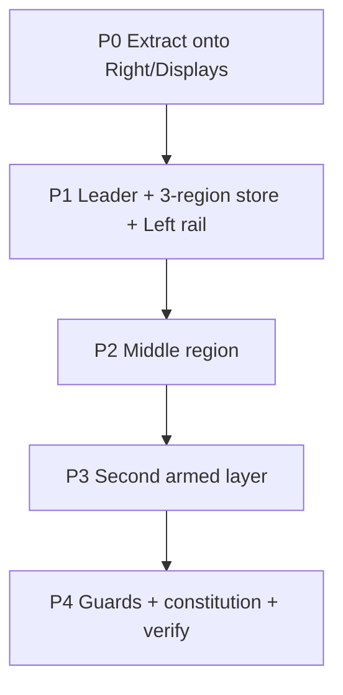

# Handoff — Nav Keys: leader-armed per-region selection keyboard

**For:** implementing agent (Claude Code / Cursor / Codex)
**From:** Cycle Forge engineering
**Date:** 2026-08-08
**Predecessor (shipped):**
[`displays-wms-terminal-binary-cut-HANDOFF.md`](./displays-wms-terminal-binary-cut-HANDOFF.md) —
binary-cut arm + `feedback.hitMarker` commit + optimistic chip on the Displays Root Index.
That work is the **seed engine** this initiative generalizes; do not re-litigate its motion feel.
**Status:** SPEC LOCKED (12 decisions interviewed 2026-08-08). **P0 ✅ (Right/Displays) · P1 ✅
(leader store + 3 regions + Left rail) · P4 ✅ (uniqueness guard + constitution).** Remaining: **P2**
(Middle region) · **P3** (second armed layer). Waist: `src/lib/keyboard/nav-keys/` — 5 test files
green (`resolveNavKeymap` · `nav-leader-machine` · `nav-leader-store` DOM · `nav-leader-owner` ·
`nav-key-uniqueness`).
**Lane:** stay on the checkout's branch · attach to **`:3050`** · never start/restart/kill the dev
server · **user owns commits**.
**Product frame:** Cycle Forge multi-tenant reseller-ops SaaS; USAV is dogfood only.

> **This is a MUCH bigger initiative than its predecessor.** The predecessor tuned *motion feel* on
> ONE list. This builds a **uniform, game-like, single-keystroke keyboard-navigation system across
> the whole triage surface** (left rail · middle scan/work · right displays), designed **web-first
> but Electron-ready**. It is the "keyboard-navigation uniqueness throughout the codebase" the
> operator asked for.

**Paste for a new session:**

```
Read docs/todo/nav-keys-selection-keyboard-HANDOFF.md and execute Phases P0→P4 in order.
This GENERALIZES the shipped Displays armed-cursor into a shared nav-keys waist — extract, never fork.

Do NOT import motion/react outside design-system/motion.
Do NOT bind BARE DIGITS (wedge law) — nav keys are LETTERS only.
Do NOT bind a second ⌘K/⌘B/⌘]/⌘\/⌘⇧V/⌘1-9 — nav leader is its own single owner (⌘;).
Do NOT ship permanent per-row key chips — hints are REVEAL-ON-ARM only (protect the density).
Do NOT let letters fire during a scan — nav mode SUSPENDS scan routing while armed + auto-disarms.
Do NOT stamp AGENTS.md / source-of-truth.md / .claude/rules law until P4 (code + guard must exist first).

Golden seed: useArmedCursorList + armed-cursor-face.ts + StationDisplayIndexList + list-key-scope.ts.
Attach to :3050. npm run verify before done (never raise knip / DS baselines).
```

---

## 0. Locked decisions (do not re-argue — interviewed 2026-08-08)

| # | Decision | Ruling |
|---|---|---|
| 1 | **Nav model** | **Per-region single letters.** Each region is its own key namespace; one region is armed at a time; letters may repeat across regions (`p` differs per region). |
| 2 | **Scan safety** | **Leader-gated + auto-disarm.** Letters are dead until an explicit leader chord arms a region; nav mode suspends scan routing and disarms fast (see §4). |
| 3 | **Hint display** | **Reveal on arm only.** Rows stay dense at rest; the letter hint is a transient overlay that appears while a region is armed and vanishes on disarm. No permanent per-row key chip. |
| 4 | **Electron** | **Web-first, Electron-ready.** Build the SoT in the web app now with one capture layer and zero reliance on browser default key behavior. Electron is a **separate later track** that only removes browser-chord conflicts + adds global/unfocused capture. |
| 5 | **Region arm** | **Leader, then region key.** One leader chord (`⌘;`) enters nav mode; a region key (`l`/`m`/`r`) arms that region and reveals its letters; then single letters select. |
| 6 | **Key mapping** | **Assigned & stable per identity.** A target's letter derives from its declared, identity-stable `navKey` and holds across sessions (`p` always = Photos). Deterministic fallback ladder + uniqueness guard. |
| 7 | **Targets** | **Structural: region → row/tab → its ONE primary action.** A row's secondary actions are a **second armed layer**, not first-layer clutter. |
| 8 | **Rollout** | **Extract from Displays; letters LAYER on arrows.** ↑↓ and letters coexist and both commit via the shipped `commitArmed` hit-marker + optimistic-chip path. Port one region per change. |
| 9 | **Regions** | **Three: Left · Middle · Right** (maps the 3-column work frame). Scan bar + PO lines + dock are all "Middle". |
| 10 | **Leader key** | **Modifier chord `⌘;` / `Ctrl+;`** — wedge-proof (a scanner emits no modifiers). Free today; not one of the 7 existing owners. Electron widens options later. |
| 11 | **Registry shape** | **Co-located `navKey` per target + uniqueness guard.** Each target declares its stable key next to its label/icon; a guard aggregates per region and fails the build on collision. |
| 12 | **Constitution timing** | The `AGENTS.md` / `source-of-truth.md` / `.claude/rules/*` law lands at **P4** — after the waist + guards exist. Prose-law-before-code is a house Never. |

---

## 1. Grammar

```
⌘;  →  region key  →  target letter  →  [row armed → its secondary actions get letters]
leader   l · m · r      stable/revealed        SECOND armed layer, same grammar
(chord)  (bare)         (bare)
```

- After the leader chord, subsequent keys are **bare letters** (fast). Safe because nav mode is
  explicitly armed, time-boxed, and auto-disarms (§4).
- **↑↓ still rove the cursor; letters teleport.** Both commit via `commitArmed` (the shipped
  `motionRole.feedback.hitMarker` + optimistic-chip path). Nothing from the binary-cut work is
  discarded — this is additive.
- **Region keys are revealed on leader**, so their exact letters are discoverable, not memorized
  cold. `l`/`m`/`r` (Left/Middle/Right) is the mnemonic default; tunable to a faster set later
  because the reveal teaches whatever they are.

---

## 2. The three regions (namespace = the guard's boundary)

| Region key | Region | Live ACTIONABLE targets (telemetry is NOT a target) |
|---|---|---|
| `l` | **Left** — context rail | recent rows · pins · collapse scan cell |
| `m` | **Middle** — scan + work | scan bar (focus) · PO-line **ledger** rows (→ focus dock step) · dock **step CTA** |
| `r` | **Right** — Displays / inspector | index rows / tabs · leaf primary action |

> **Telemetry is not a target.** The scan-progress ring, active-step context, and usage KPI are
> read-only DISPLAY METRICS — they carry no nav key. On Unbox those metrics moved out of the middle
> triage into the **bottom dock** under-dock row (`UnboxDockHost`: step context bottom-left, ring
> bottom-right); the PO-line accordion is now a pure **ledger** (`dockOwnsCapture` → click focuses the
> matching dock step). So the Middle region's targets are the scan bar, the ledger rows, and the dock
> **step CTA** — never the ring or the KPI readout.

- Letters are unique **within a region** only. `p` in Left ≠ `p` in Right.
- A row's **secondary** actions (edit / print / delete / drill) are a **second armed layer** —
  reached by arming into the row, not shown in the first layer. This is what keeps the first-layer
  namespace small enough for stable single letters.
- Spine (MasterNav) and GlobalHeader are **not regions** — they already own their nav (pins
  `⌘1-9`, page switcher). Do not add them without a new ruling.

---

## 3. Keymap resolution

- **Co-located declaration.** Each target carries a stable `navKey` next to its label/icon (the way
  a `SectionTab` carries an icon). Identity-stable — tied to the target's role/id, never to its list
  position.
- **Live resolution (pure).** For the armed region's currently-visible targets: use each target's
  `navKey` if free in this live set, else walk a **deterministic fallback ladder**. Same input →
  same output, always (no `Math.random`, no order-dependence beyond the declared set).
- **Guard.** A build-time test aggregates each region's **full possible** target set and fails on a
  declared-key collision, so fallback stays rare and never surprises muscle memory.
- **Reveal-on-arm.** The hint is a **transient overlay** painted only while the region is armed —
  it may briefly occupy the trailing-chip column but never becomes a new permanent column, and
  vanishes on disarm. Protects the density the predecessor fought for.

---

## 4. Coexistence + wedge safety (the load-bearing part)

**The 7 existing keyboard owners stay untouched.** Nav Keys is an 8th single-owner:

- Leader `⌘;` / `Ctrl+;` — free today; **not** ⌘K / ⌘B / ⌘] / ⌘\ / bare `]` / ⌘⇧V / ⌘1-9.
- While armed, register with `overlay-stack` so **Escape disarms** (innermost owner) and ambient
  scan / record keyboards yield. Extends the `list-key-scope.ts` DOM-marker model.
- **Never binds bare digits** (wedge law) — nav keys are letters only; digits stay for pins /
  quantities / scans.

**Wedge-during-armed mitigation (ACCEPTED):**

> While armed, nav mode **suspends scan routing** (yields the scan-focus hotkey via overlay-stack),
> plus **~1.5s idle timeout**, **first-unmapped-key exits nav mode** (does not swallow it), and
> **commit / Escape disarm**. The leader is a modifier chord, so arming is a deliberate keyboard
> act — the scanner is not in hand — and the timeout closes the residual window.

The chord-leader is what makes bare-letters-after safe: a scanner can never *arm* (no modifiers),
and the mode is gone in ~1.5s if unused.

---

## 5. Waist (extract from the golden — never fork)

Grow `src/lib/keyboard/nav-keys/` from the shipped seed
(`src/components/station/displays/useArmedCursorList.ts` + `armed-cursor-face.ts` +
`StationDisplayIndexList.tsx` + `src/lib/keyboard/list-key-scope.ts`):

| Module | Job |
|---|---|
| `resolveNavKeymap.ts` | **Pure, DB-free, unit-tested.** `(declaredKeys, liveTargets) → resolved letter per target`, deterministic fallback. |
| `nav-leader-store.ts` | **Single leader listener** (one `keydown`, like `scan-hotkey/store`). Armed-region state · disarm triggers · overlay-stack + scan-suspend registration. |
| `useNavRegion` | Arming + arrow/letter handling + `commitArmed`. Thin per-region adapters enumerate live targets. |
| hint face tokens | Extend `armed-cursor-face.ts` — the reveal-on-arm letter chip (transient overlay). |

- **`useArmedCursorList` is refactored INTO this waist, not duplicated.** Displays becomes the first
  consumer of the generalized hook; the arrow-roving + hit-marker commit it already ships are the
  baseline the letter layer sits on.
- No page-local twin, no second leader listener, no foreign motion package.

---

## 6. Phases (one region per change)



### P0 — Extract letter-select onto Right / Displays
Lift `useArmedCursorList` into the waist; add stable `navKey` to the Displays index rows; letters
select the same targets ↑↓ already reach, committing via the same `commitArmed`. Reveal-on-arm chip.
- **Check:** ↑↓ still work; a letter opens the same leaf ↑↓ would; hint chips appear only while
  armed and vanish on disarm; `rg "from 'motion/react'" src/lib/keyboard` → 0.

### P1 — Leader + 3-region store + Left rail
Stand up `nav-leader-store` (⌘; single owner), the 3-region enumeration, and wire the **Left** recent
rail as the second consumer. Wedge-suspend + timeout + Escape disarm live here.
- **Check:** ⌘; then `l` arms the rail and reveals letters; Escape / ~1.5s / commit disarm; scan bar
  cannot be typed into while armed; no collision with the 7 owners.

### P2 — Middle region
Scan bar (focus) + PO-line **ledger** rows (commit → focus the matching dock step) + dock **step
CTA** as Middle targets. **One owner** — lift `useNavRegion({id:'middle'})` to the Unbox center
parent so it sees all three sub-surfaces; thread `armed` + keymap into each for keycaps.
**Exclude telemetry** — the scan-progress ring / active-step context / usage KPI in the bottom dock
are read-only and carry NO nav key (see the Middle-region note in §2).
- **Check:** ⌘; `m` reveals middle targets; a dock-step letter fires the same action its click does;
  no keycap ever paints on the progress ring / KPI readout.
- **Note:** the golden Unbox center (`POUnboxingSection` · `UnboxDockHost` · `LinePoItemsSection`) is
  under active concurrent edit and carries ~8 strict guards — additive keycap only, re-run those
  guards.

### P3 — Second armed layer
Arming a row reveals its secondary actions (edit / print / delete / drill) as a fresh single-letter
set, same grammar one level deeper.
- **Check:** first-layer namespace stays small; second layer only appears after a row is armed.

### P4 — Guards + constitution + verify
- Guards: `nav-keys-uniqueness` (per-region declared-key uniqueness) · `nav-leader-owner` (single
  binder, not one of the 7, no bare digits) · reveal-on-arm (no permanent per-row chip).
- **Now** add the constitution one-liners: `AGENTS.md` hard-law line, a `source-of-truth.md` row +
  short section under keyboard ownership, and a `station-workbench.md` → Displays Root Index note
  pointing at the generalized waist.
- Full `npm run verify` (never raise knip / DS baselines).

---

## 7. Must-ship vs never-ship

**Must-ship**
1. One shared waist extracted from the golden — Displays is a consumer, not a fork.
2. `⌘;` leader → region → stable single letter, revealed on arm, committing via the shipped
   hit-marker path.
3. Wedge-safe by construction: modifier leader + scan-suspend + fast auto-disarm + letters-only.
4. Per-region uniqueness enforced by a guard.

**Never-ship**
1. Bare-digit nav keys, or a second leader binder colliding with the 7 owners.
2. Permanent per-row key chips (density regression).
3. Letters that can fire during a scan.
4. `motion/react` / `framer-motion` outside `design-system/motion`; page-local twin of the armed
   cursor; prose-law in the constitution before P4 code + guard exist.

---

## 8. Out of scope
- The Electron shell itself (separate later track; this is only *Electron-ready*).
- Spine / GlobalHeader as regions.
- Global 2-char Vimium hints (rejected — per-region single letters chosen).
- Rewriting any leaf's fetch layer.
- MasterNav spine pulse (separate briefing).

---

## 9. Done definition
`nav-keys/` waist exists (extracted, not forked); ⌘; arms a region and reveals stable single-letter
hints on structural targets across Left · Middle · Right; letters coexist with ↑↓ and commit via the
shipped hit-marker path; nav mode is wedge-safe (suspend + auto-disarm, letters-only); per-region
uniqueness + single-leader-owner + no-bare-digit guards pass; constitution one-liners land at P4;
`npm run verify` green.
