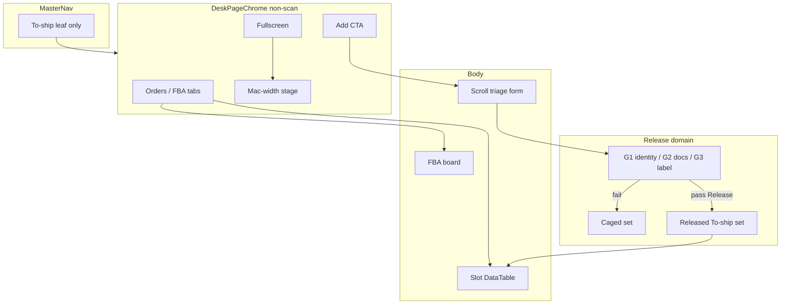

# Non-scan desk chrome + caged → released (To-ship first)

**Status:** plan of record · **Written:** 2026-08-30 · **Branch:** `main`  
**Companion prompt:** [`non-scan-desk-chrome-caged-release-IMPLEMENTATION-PROMPT.md`](./non-scan-desk-chrome-caged-release-IMPLEMENTATION-PROMPT.md)  

**Desk chrome (tabs + fixed width) lives elsewhere — compose it, do not fork it:**  
[`desk-page-chrome-fixed-width-PLAN.md`](./desk-page-chrome-fixed-width-PLAN.md)

**Also composes:** [`slot-based-metadata-table-PLAN.md`](./slot-based-metadata-table-PLAN.md) · [`jit-pack-documents-plan.md`](./jit-pack-documents-plan.md) · [`import-add-order-right-rail-HANDOFF.md`](./import-add-order-right-rail-HANDOFF.md)

---

## THIS SHIP (operator deliverable)

**Scope lock:** **Add CTA + scroll triage form + caged → released** on To-ship, mounted **on top of** the desk chrome plan (in-page tabs + fixed-width stage). Do not re-implement nav flattening or stage width here — implement those via [`desk-page-chrome-fixed-width-PLAN.md`](./desk-page-chrome-fixed-width-PLAN.md) first (or in parallel only if that chrome already exists).

**Must work when done (To-ship):**

1. Desk chrome prerequisites from the fixed-width plan are present (flat To-ship L1, Orders|FBA tabs, fixed-width stage).
2. Tab strip has a primary **Add** CTA on the **far right** of the tab band.
3. **Add** opens a **scroll-section form** for full order triage (identity links, documents, shipping label link/buy).
4. Orders are **caged** until release gates pass; only then **released** into the live To-ship queue.

---

## 0. What you are building

Two products that share one desk shell:

| Layer | Job |
|---|---|
| **Desk page chrome** | Non-scan pages: fixed-width stage + fullscreen + in-page tabs + rightmost CTA |
| **Caged → released** | Intake / triage gate: an order (or line) cannot enter the released To-ship working set until constraining links are complete |

This sits **above** the slot-based metadata table (columns/bindings). The grid stays polymorphic; this plan owns **page frame, navigation IA, and release state**.

```text
SCAN STATIONS (unchanged)
  Unbox · Pack · Scan-out · Test · …  — edge-to-edge station shell

NON-SCAN DESKS (this plan)
  Spine L1: flat names only (To-ship, …)
       ↓
  Desk shell: [ page tabs ……… ] [ Add CTA ]
              [ stage: Mac-width | fullscreen expand ]
              [ slot-driven DataTable / FBA board / … ]
```

---

## 1. Exact vocabulary

| Term | Meaning |
|---|---|
| **Scan station** | Floor scan workbench (Unbox, Pack, Scan-out, Testing, etc.) — keeps today’s edge-to-edge station chrome. **Out of this ship’s visual rewrite.** |
| **Non-scan desk** | Browser/desktop ops desk (To-ship, FBA board, later Shipped / Customers / …) — gets desk chrome. |
| **Desk stage** | The content frame that hosts the table/board — default Mac-width, optional fullscreen. |
| **Page tabs** | In-page tab strip under the desk header (Orders, FBA, …). URL-deep-linkable. |
| **Spine L1** | MasterNav top row — **leaf label only** for desks that use page tabs (no nested children for To-ship). |
| **Caged** | Order/line exists but is **not** in the released To-ship working set — missing required links. |
| **Released** | All release gates satisfied; eligible for To-ship queue work (test/pack/ship lanes). |
| **Release gate** | Hard checklist of linked facts (see §5). |
| **Add form** | Scroll-section triage form opened from the tab-band CTA. |

**Not in vocabulary:** “Put FBA under a To-ship nav dropdown,” “edge-to-edge desk grid by default,” “release without documents decision.”

---

## 2. Desk chrome (universal for non-scan)

### 2.1 Default stage — Mac minimum fixed width

- Default: content stage has a **fixed max width** sized for a Mac laptop workbench (product constant, e.g. `DESK_STAGE_MAX_PX` — pick one measured value in implementation; do not invent per-page widths).
- Stage is **centered** in the warehouse content column with gutters — **not** flush edge-to-edge like scan-station centers ([`STATION_WORKBENCH_LOCK_PX`](src/lib/station/workbench-layout.ts) remains scan-station law and must not be reused as the desk max-width).
- Horizontal scroll of the **grid inside** the stage is allowed when columns exceed the stage; the **page** does not become a full-bleed spreadsheet by default.

### 2.2 Fullscreen expand

- Control: **top-right** of the desk chrome (same band as tabs / stage header).
- Action: expand the stage to the **full available content canvas** (still inside WarehouseShell — not OS window chrome).
- Exit fullscreen restores Mac-width stage. Prefer URL or session flag so refresh does not surprise; deep-link optional.
- Interaction budget: ≤2 (click expand / click exit). No geometry layout tweens (opacity OK).

### 2.3 Page tabs (not spine children)

| Before (anti-goal) | After |
|---|---|
| Spine expands To-ship → child links | Spine: **To-ship** leaf |
| Mode chips scattered / filter tabs only | **Orders · FBA · …** as primary page tabs |
| Add buried in menus | **Add** = rightmost control on the **tab band** |

- Tabs are **normal website tabs**: one active route/mode, URL carries tab (`?desk=orders|fba` or path segment — pick one SoT and stick).
- **Add** is a CTA on the **most right** of that tab display — not a tab itself, not in the spine.
- To-ship v1 tab set (locked for this ship):

  | Tab | Surface |
  |---|---|
  | **Orders** | Slot-driven To-ship / unshipped compound grid |
  | **FBA** | Existing FBA outbound board (same desk shell, different body) |

  Later tabs (Shipped, Packed, …) are checklist ports — **do not** mount in v1 unless already trivial.

### 2.4 Propagation rule

Any **non-scan** product table that today nests children under a spine L1 should migrate to:

1. Flat spine label  
2. Shared `DeskPageChrome` (tabs + Add slot + stage + fullscreen)  
3. Body = existing table/board  

Scan stations **must not** import `DeskPageChrome`.

---

## 3. Add CTA → scroll-section triage form

### 3.1 Open behavior

- Trigger: **Add** on the tab band (Orders context → new/triage order; FBA may later swap CTA — v1 focus is Orders).
- Surface: **scroll-section form** — long vertical form with clear sections (not a tiny modal). Prefer right-rail / desk push consistent with [`import-add-order-right-rail-HANDOFF.md`](./import-add-order-right-rail-HANDOFF.md) (`modal={false}`) **or** a full-height stage panel beside/over the Mac-width stage — pick one pattern and reuse; do not invent a third intake shell.

### 3.2 Form sections (To-ship Orders Add / triage)

Minimum sections (each a scroll anchor):

1. **Identity** — order number, item number, marketplace/source, title/qty/condition  
2. **Links (release-critical)** — bind **item number ↔ order number ↔ tracking number**  
3. **Documents** — link manuals / paperwork to **item number** (or product), **or** mark **“Item number does not require documents”**  
4. **Shipping** — **Link existing shipping label** **or** **Buy shipping label** (existing Labels / ShipStation paths — do not fork a second buy engine)  
5. **Review / Release** — checklist of gates; primary action **Release** enabled only when all gates green  

Reuse existing APIs where they exist (`/api/orders/add`, document link routes, label buy). Grow `documents` + `document_entity_links` — see JIT pack docs plan.

---

## 4. Caged vs released (domain)

### 4.1 States

```text
  [draft / intake] → CAGED → RELEASED → (existing lifecycle: test / pack / ship …)
```

- **Caged:** visible in an intake / caged list or badge on the desk (exact UI: tab filter or separate “Caged” chip — must be ≤2 interactions to see). Not counted as normal To-ship actionable work until released.
- **Released:** appears in the standard To-ship Orders grid operators already use.

### 4.2 Release gate (v1 hard rule — locked)

An order/line may **Release** only when **all** of the following are true:

| # | Gate | Satisfied when |
|---|---|---|
| G1 | **Identity triangle** | **Item number** linked to **order number** AND **tracking number** (all three present and associated on the record / link table) |
| G2 | **Documents** | Item number has **≥1 linked document** (manual / paperwork via documents SoT) **OR** explicit staff flag **“does not require documents”** |
| G3 | **Shipping label** | Shipping label **linked** to the order/shipment **OR** label **purchased** via existing buy path |

Missing any gate → stays **caged**. UI must show which gate failed (not a silent disabled button).

Rationale: matches operator language — release is the moment constraining information is complete, not when a row is first typed.

### 4.3 Persistence

- Store release state + gate snapshots on the order (or order-line) — prefer expand-then-code: nullable columns / JSONB checklist on existing orders row, or a small `order_release_gates` document. **Migration before readers.**
- Audit: who released, when, which gates were green.
- Org cannot invent new gate types from the picker in v1 (product-coded gates). Later: org may require docs always (no exempt) via settings — out of v1 unless cheap.

---

## 5. Architecture



**Polymorphism:** `DeskPageChrome` never branches on “if To-ship” for frame geometry. Tabs + CTA + stage props are data. Family-specific bodies mount as children.

---

## 6. Phased delivery

### Phase A — Desk chrome shell (To-ship only)

- `DeskPageChrome` component + `DESK_STAGE_MAX_PX`
- Flatten To-ship spine children → in-page tabs Orders | FBA
- Fullscreen toggle top-right
- Add CTA placeholder → existing New Order rail (wire Phase B form next)
- Scan stations untouched
- `npm run verify`

### Phase B — Scroll triage form + gates model

- Form sections §3.2
- Persist caged/released + G1–G3 evaluation (pure function + unit tests)
- Documents link / “does not require” + label link/buy hooks
- Release action + audit
- Caged visibility on To-ship (filter or badge)

### Phase C — Propagation checklist (do not big-bang)

For each non-scan desk: flat spine + `DeskPageChrome` + tabs map. One desk per PR after To-ship sign-off.

### Out of this ship

- Redesigning Unbox/Pack/Scan-out/Test chrome  
- Org-authored custom release gates  
- Replacing ShipStation buy  
- Slot-column work (already a separate plan)  

---

## 7. Success criteria

1. On a Mac-width viewport, To-ship Orders grid shows gutters; fullscreen removes them for max table view.  
2. Spine shows **To-ship** without a child dropdown; Orders/FBA are page tabs; Add is rightmost on the tab band.  
3. Operator can complete identity + docs decision + shipping in the Add/triage form and **Release** only when G1–G3 pass.  
4. Caged orders are distinguishable and not mixed silently into released work.  
5. Scan stations pixel-identical in chrome behavior to pre-change (no `DeskPageChrome`).  
6. Pattern documented so the next non-scan desk is a checklist port.  

---

## 8. Relationship to prior work

| Prior | Role |
|---|---|
| Slot-based metadata table | Column / binding engine inside Orders tab |
| JIT pack documents | Documents SoT for G2 |
| Import / Add Order right rail | Intake modality precedent for Add form |
| Station workbench lock 720 | Scan-station only — do not reuse as desk max-width |
| Dashboard IA / outbound desk shells | Likely mount points to refactor into `DeskPageChrome` |
| **Successor form** | [`order-intake-acknowledgment-PLAN.md`](./order-intake-acknowledgment-PLAN.md) — acknowledge (platform-from-id, pairing, parcel, assignment) on the same triage host; this plan’s G1–G3 stay the release contract |
