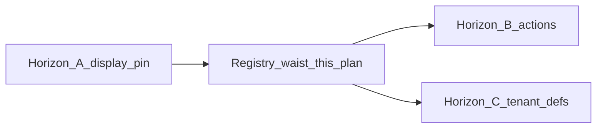

# Nonlinear data-table engine — PLAN

**Status:** APPROVED (with strict bounds on C2 and C3)  
**Date:** 2026-08-07  
**Owner:** Cycle Forge Engineering  
**Briefing:** [`nonlinear-data-table-engine-GEMINI-RESEARCH-BRIEFING.md`](nonlinear-data-table-engine-GEMINI-RESEARCH-BRIEFING.md)  
**Related:** [`ledgergrid-unified-table-sot-RESEARCH-HANDOFF.md`](ledgergrid-unified-table-sot-RESEARCH-HANDOFF.md) · Horizon B [`grid-industry-actions-HORIZON-B-PLAN.md`](grid-industry-actions-HORIZON-B-PLAN.md) · Horizon C research [`tenant-table-extensibility-HORIZON-C-GEMINI-RESEARCH-BRIEFING.md`](tenant-table-extensibility-HORIZON-C-GEMINI-RESEARCH-BRIEFING.md)

**Topic:** Transition from page-coupled `*GridView` forest → decoupled, **registry-driven** data-table engine + constrained AI authoring of **definitions** (not JSX / DDL).

---

## 1. Executive adjudication

The proposal to decouple the LedgerGrid **engine** from page routes and replace the `*GridView` forest with a **nonlinear, registry-driven** architecture is **approved**, provided it does not violate the boundary between:

| Layer | Law |
|---|---|
| **DB polymorphic hubs** | `entity_type` + `entity_id` — [`.claude/rules/polymorphic-tables.md`](../../.claude/rules/polymorphic-tables.md) |
| **UI display** | One engine + typed definition registry; **domain cells stay per family** |

Today Cycle Forge suffers from **page-coupled boilerplate**: every new ops queue re-wires TanStack state, portal intents, and cell registries into a localized `*GridView.tsx`. That fights a single SoT for high-density, scan-aware Workbench UI. Pages should **mount a `TableId` / definition id**, supply a typed feed, and declare selection/open intents — mirroring metadata-driven view architectures (Stripe / Salesforce List Views), **not** Airtable.

We are building a **1080p-optimized operator workbench**, not a base builder. AI authoring is constrained to **definition configurations** (Zod/JSON) — never arbitrary cell JSX, never schema DDL, never bypass of capability bags / `transition()` / tenant GUC.

### 1.1 Falsifiable claims

| Claim | Verdict | Guardrails |
|---|---|---|
| **C1 — Nonlinear engine** | **LIVE** | Pages reduce to bindings: fetch definition by id / `TableId`, supply typed DTO feed, handle intents. `LedgerGridSurface` remains the undisputed shell SoT. |
| **C2 — Polymorphic display link** | **LIVE (constrained)** | Engine renders many families via the registry. Registry maps **entity family → typed cell atoms**. **No mega-row** that renders “any SQL column.” |
| **C3 — AI authoring task** | **LIVE (constrained)** | Canvas/Studio AI authors column selection, default widths, visibility tiers as **Zod-validated definition payloads**. Banned: fabricating JSX, DDL, new terminal statuses, capability-bag lies. |

### 1.2 Horizon relationship (do not skip)

| Horizon | Role after this plan |
|---|---|
| **A — Display SoT** | Still required: Unbox golden must stay excellent; residual framed forks / hand geometry (`FbaBoardTable`) still migrate onto the engine |
| **This plan (registry waist)** | **Accelerates A**: thin bindings + code registry so new queues do not grow the forest. Primary candidate = **static TypeScript registry** (Stripe-style) |
| **B — Industry actions** | Still after A dogfood-strong; actions mount on the four planes, capability-gated — registry must not invent a fifth grammar |
| **C — Tenant extensibility** | **Secondary**: DB-backed JSON org views / custom fields remain Horizon C. This plan’s code registry is the **kernel** C compounds on — do not jump to runtime org JSON before the code registry + host exist |



---

## 2. Industry + scored candidates

| Class | Pattern | Cycle Forge take |
|---|---|---|
| Ops dense (Stripe, Linear, Attio) | Hard shell + config objects; view def ≠ page | **Match** |
| Metadata platforms (Salesforce List Views, Retool) | DB registry of columns/filters/sorts | **Horizon C secondary**, not wave-1 |
| DB–spreadsheet hybrids (Airtable, Notion) | User owns schema + UI | **Anti-pattern** for act-and-clear floors |
| AI helpers (Retool AI, v0) | Suggest config vs generate UI code | **Config only**; v0-style GridView codegen **killed** |

### 2.1 Scoring (research formula)

**Score ≈ (Fit × Nonlinear purity × Operator throughput) / ((6 − Blast) × (6 − Migration cost))**  
Blast/Migration: **5 = tiny/cheap, 1 = huge**. Cut line: **> 10.0**.

| Candidate | Fit | Purity | Throughput | Blast | Mig | Score | Verdict |
|---|---|---|---|---|---|---|---|
| **1. Static code registry (Stripe-style)** | 5 | 4 | 5 | 4 | 3 | **16.7** | **WINNER — ship first** |
| **2. DB-backed JSON registry (Salesforce-style)** | 5 | 5 | 5 | 3 | 4 | **13.9** | **Deferred → Horizon C** (org saved views / custom) |
| 3. Airtable mega-row engine | 1 | 5 | 1 | 1 | 1 | 0.2 | **KILLED** |
| 4. AI-generated `*GridView` (v0) | 2 | 1 | 3 | 4 | 4 | 1.5 | **KILLED** |

**Ruling:** Bridge from today’s `grid-surface-descriptor.ts` waist to C1/C2 via a **TypeScript `TableDefinitionRegistry`**. AI authors **PRs / Studio drafts of registry payloads**, not prod JSX. DB-backed defs wait until Horizon C.

---

## 3. Target architecture

### 3.1 Engine (unchanged SoT)

`src/design-system/components/grid/LedgerGridSurface.tsx` (+ `LedgerGrid`, `useGridSurface`, column display / visibility / widths / drill).  
The engine **does not know which page** it is on.

### 3.2 Definition registry (new waist)

Central **code** registry. A definition includes at minimum:

| Field | Maps to today |
|---|---|
| `tableId` | `TableId` in `src/lib/tables/table-columns.ts` |
| `entityFamily` | receiving · incoming · orders · catalog · repair · … (cell map key) |
| `columns` | Existing `*-grid-layout.ts` models (`LedgerGridColumnModel`) |
| `capabilities` | `GridSurfaceCapabilities` bag |
| `descriptorId` | e.g. `receiving.browse` |
| `defaultView` | core/optional tiers, default widths / sort hints |
| `cellMapKey` | Points at **typed** family cell registry — never inline JSX from AI |

Zod schema wraps the payload so Studio/AI output is validated before mount.

### 3.3 Page bindings (thin host)

Pages become:

1. Fetch typed DTO feed  
2. Resolve definition by id / `tableId`  
3. Pass feed + intents into **`NonlinearTableHost`** (name TBD; implement as one SoT mount)  
4. Own chrome slots (Band 1–3, KPI) and open/select handlers — **not** column geometry

```tsx
// Conceptual — implement against real props when building the host
<NonlinearTableHost
  tableId="receiving"
  definitionId="receiving.browse"
  rows={rows}
  onOpenRow={…}
  onToggleRow={…}
  columnTriggerPortalTarget={…}
/>
```

### 3.4 Status / actions

Status cells and row/record actions continue through existing waists:

- Status writes → `transition()` only  
- Assign / ticket / bulk → Horizon B planes + existing hooks  
- Engine + AI defs **forbidden** from inventing new terminal states or capability lies (e.g. turning on `rowTriageFlags` for Catalog “for consistency”)

### 3.5 Explicitly out of scope

| Surface | Why |
|---|---|
| `PoLinesAccordion` / `PoLineMetaGrid` / open-carton Station | **Not** LedgerGrid — Station edit job. Do **not** migrate onto the registry |
| Foreign grids | Banned |
| Schema-per-tenant / AI DDL | Banned |
| Mega-row polymorphic JSX | Banned (C2 bound) |

---

## 4. Phased implementation

### Phase 1 — Registry waist (first)

**Goal:** Unbox History renders from registry + host; no behavior regression.

1. **Zod `TableDefinition` schema** — encompass descriptor columns, capabilities, `TableColumnSpec` / hideKeys, density constraints (max default visible core tracks for 1080p).
2. **Extract golden** — Unbox / History (`RECEIVING_GRID_COLUMNS` + `RECEIVING_GRID_CAPABILITIES` + `receiving.browse`) into the registry. Sheet flush + ▦ / Fields must still resolve via `LedgerGridSurface`.
3. **`NonlinearTableHost`** — `tableId` + definition + rows + intents → mounts `LedgerGridSurface`. Prefer growing beside `ReceivingGridView` then strangling it.
4. **Proof** — Unbox History + Testing (`tableId="testing"` overlay) dogfood green; existing sheet/capabilities/plumbing guards still pass.

**Exit:** One receiving-family surface mounts **only** through the host; page does not re-declare column geometry.

### Phase 2 — Constrained AI authoring (Canvas)

**Goal:** Studio can propose/edit **definitions**, not components.

1. Canvas/Studio UI for column selection, tiers, default widths (compose existing Column Display concepts — do not fork Fields).
2. AI agents output **only** Zod-valid `TableDefinition` JSON.
3. **Density linter** — reject default visible sets that exceed warehouse-dense limits; force optionals into Fields.
4. Publish path: eng review / gated publish — **no live unvalidated writes** to org runtime in this phase (Horizon C owns org JSON later).

**Exit:** A definition can be authored without editing a page file; AI cannot emit JSX or capability-bag upgrades outside allowlist.

### Phase 3 — Burn the `*GridView` forest

**Goal:** Strangler migration of Workbench adapters; ratchet so the forest cannot regrow.

**Migrate (Workbench LedgerGrid adapters only):**

| Priority | Adapter |
|---|---|
| P0 | `ReceivingGridView` (golden already in registry) |
| P0 | `IncomingGridView` (same host family) |
| P1 | Thin adapters: Repair, Pickup, Catalog, Warranty, Ready, Bins, MyDay, Unfound, TechAll, Review catalog-link |
| P2 | Fat: `OrdersGridView` — strip rail/cursor/Labels leaks into page host **before** or while binding |
| P2 | Raw mounts: `StationListTable`, `FbaBoardTable` (replace hand `FBA_GRID` with layout SoT) |

**Delete** each `*GridView.tsx` only after:

1. Registry entry + host mount verified  
2. Sheet / capabilities / plumbing guards updated  
3. Allowlist shrink (pattern-evolution: retirement incomplete without guard)

**Do not delete:** Station accordion / PO line edit components; `DataTable` admin sibling; Orders header allowlisted fork until deliberately ported.

**Ratchet:** Extend `grid-surface-capabilities.guard.test.ts` (+ new host guard) so CI fails if a page outside the allowlist mounts `LedgerGrid` / `LedgerGridSurface` or adds a new `*GridView.tsx`.

**Exit:** “New queue ships without a new GridView file” — only registry entry + page binding + (if new family) typed cell map module.

---

## 5. Delete vs keep

| Keep / grow | Delete after migration |
|---|---|
| `LedgerGrid*` engine package | Fat page wiring inside `*GridView` |
| `grid-cells` / CopyChip atoms | Duplicate header / Fields plumbing in views |
| Per-family `cells/*` registries | Page-local column geometry twins |
| `table-columns.ts` `TableId` prefs deltas | Dual doors to Column Display (already banned by plumbing guard) |
| Band chrome hosts (`ReceivingLinesTable` thinned to feed+intents+chrome) | Wrapper-only GridViews once host exists |
| Station PO accordion | — (**never** migrate here) |

---

## 6. SoT update sketch (land when Phase 1 exits)

Add one-liners (detail stays in rules files):

**`AGENTS.md` / `source-of-truth.md`:**

> Workbench spreadsheets mount via the **table definition registry** + `NonlinearTableHost` → `LedgerGridSurface`. Pages supply feed + intents only — never a page-local `*GridView` twin. Domain cell maps stay per `entityFamily`. AI may author Zod table definitions only.

**`pattern-evolution.md`:**

> New ops queue = registry entry + binding + (optional) family cell map. Adding a new `*GridView.tsx` is a fork unless the host allowlist still names it during migration.

Guards enforce; prose alone is incomplete.

---

## 7. Risks & rollback

| Risk | Mitigation |
|---|---|
| Unbox dogfood regression | Phase 1 golden first; keep `ReceivingGridView` until host parity |
| Orders action loss while thinning | Move rail/cursor to page host **before** deleting GridView |
| AI density soup | Zod + density linter; publish gate |
| Jumping to Horizon C JSON too early | Code registry must exist and own mounts first |
| Confusing Station with Workbench | Explicit out-of-scope list; never port accordion |

**Rollback:** Feature-flag host per `tableId`; leave old GridView import behind flag until wave verified; never delete golden path in the same PR as host introduction.

---

## 8. Success metrics

1. Pages that own a Workbench queue **do not import** `*GridView` (allowlist shrinks to empty).  
2. New queue = registry entry + thin binding (+ cell map only if new `entityFamily`).  
3. Binding file stays thin (target: intent/feed/chrome only — no column `minmax` / cell JSX).  
4. `npm run verify` green; capabilities + new host guards green; Unbox History dogfood unchanged.

---

## 9. P0 implementer prompt (≤40 lines)

```
Read docs/todo/nonlinear-data-table-engine-PLAN.md (APPROVED).

P0 only — Phase 1 registry waist:
1. Add Zod TableDefinition schema (columns + capabilities + tableId + entityFamily + density limits).
2. Register receiving.browse from RECEIVING_GRID_COLUMNS + RECEIVING_GRID_CAPABILITIES.
3. Add NonlinearTableHost that mounts LedgerGridSurface from the registry.
4. Wire Unbox History (ReceivingLinesTable path) behind a flag/host call without regressing sheet flush, ▦, or testing tableId overlay.
5. Do NOT migrate Orders, do NOT touch PoLinesAccordion, do NOT add DB-backed defs, do NOT let AI write JSX.
6. Keep domain cells in receiving-grid/cells/*.
7. npm run verify must pass; extend/allowlist guards honestly (shrink-only).

Compose LedgerGridSurface — never invent a second shell.
```

---

## 10. Decision log

| ID | Pick |
|---|---|
| D1 Thesis | Accept **C1 + constrained C2 + constrained C3** |
| D2 Near-term | **Static code registry (candidate 1)**; DB JSON = Horizon C |
| D3 Wave-1 deletes | Wrapper/chrome twins after host parity — **not** Station accordion |
| D4 Cell registries | **Per-family forever** at this horizon |
| D5 Polymorphic UI | Bind-by-definition + family cell maps — **not** mega-row |
| D7–D9 AI | Studio/Canvas; Zod-only output; density + capability validation mandatory |
| D10 vs Horizon C | This **precedes** C and is the kernel C compounds on |
| D11 Unbox | Golden **template for receiving-like** defs — do not clone onto Orders/Catalog |
| D12 Orders | Thin/bind **after** receiving golden; strip fat host concerns first |

---

## 11. Corrections applied when landing this plan

The research paste named `PoLinesAccordion` / `PoLineMetaGrid` as Phase-3 delete targets after registry mapping. **Rejected:** those are Station open-carton edit surfaces, not Workbench LedgerGrid adapters (§3.5). Migration list is `*GridView` / raw LedgerGrid mounts only.
