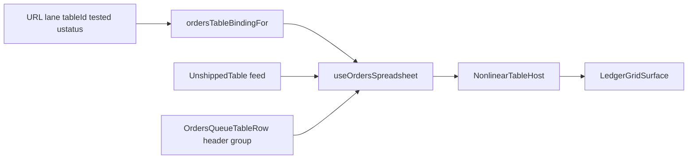
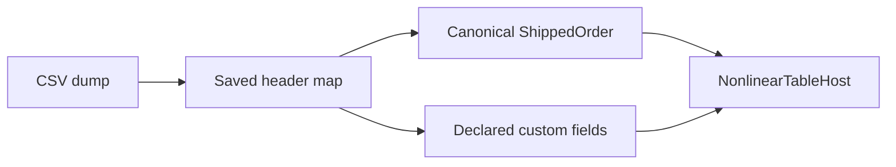

# One table engine — collapse `OrdersGridHost` onto `NonlinearTableHost`

**Status:** APPROVED to implement (docs-first; code not started in this commit)  
**Date:** 2026-08-20  
**Owner:** Cycle Forge Engineering  
**Pass:** Orders / To-Ship family only. Receiving adapter is a later pass.  
**Parent:** [`nonlinear-data-table-engine-PLAN.md`](nonlinear-data-table-engine-PLAN.md) (C1 live; this is the next forest cut)  
**Companions:** [`nonlinear-table-forest-finish-HANDOFF.md`](nonlinear-table-forest-finish-HANDOFF.md) · [`docs/rules/polymorphic-tables.md`](../rules/polymorphic-tables.md) · [`docs/kill-list/05-toship-port-spec.md`](../kill-list/05-toship-port-spec.md)

**Topic:** One **display** component for every workbench spreadsheet. Orders still mounts a second host (`OrdersGridHost`) that only exists to pick a binding and wire renderers. Industry WMS/OMS practice, and this repo’s own C1/C2 ruling, say: **route to a definition, not to a family GridHost.** Import is **map-to-canonical**, not “CSV headers become the schema.”

---

## 0. One-sentence ruling

**URL / lane → `TableDefinition` + typed binding → `NonlinearTableHost` → `LedgerGridSurface`.** Feeds, selection, and cell atoms stay family-local. There is no second table component, no Airtable mega-row, and no reuse of DB `entity_type`/`entity_id` as a spreadsheet router.

---

## 1. Why this exists (operator + engineering)

Operators already treat To-Ship as “the orders spreadsheet.” Unbox Incoming already mounts the **same** engine without an `IncomingGridHost`. To-Ship still goes:

`UnshippedTable` (feed) → `UnshippedShelfBoard` (chrome literals) → `OrdersGridHost` (adapter) → `NonlinearTableHost` (engine).

That is three wrappers around one shell. The desk-local `to-ship` table definition was already deleted (prefs twin). This plan deletes the **component** twin.

Engineering cost of keeping `OrdersGridHost`:

- New outbound lanes copy the host instead of the Incoming pattern.
- Binding selection looks like “the page picks a grid,” which invites another `tableBindingFor` prop (the desk fork we just removed).
- Comments still claim Packed/Labels/Review “survive only because To-Ship is built on OrdersGridHost” — they are stubs; the engine is `NonlinearTableHost`.

---

## 2. Industry research (the exact fact)

Three layers that look similar and **must not be collapsed into one object**:

### 2.1 Engine (one shell)

| System | Practice |
|---|---|
| SAP EWM / TM | One table control; operators **personalize** column set, order, sort. Admin views can be published. Fields come from the **object**, not from an import. |
| Salesforce | One `lightning-datatable`. Columns come from List View **describe** (`/sobjects/{type}/listviews/{id}/describe`) — metadata for **that sObject**, not arbitrary SQL. |
| AG Grid / TanStack Table | One grid component. Swap `columnDefs` + `rowData`. Different entity **shapes** use a keyed remount (`key={tabId}`) or a fresh defs array — still one component **type**. See [ag-grid#14057](https://github.com/ag-grid/ag-grid/issues/14057). |
| TanStack “composable tables” | Shared hook factory (`createTableHook`) + per-entity column helpers. Infrastructure is shared; cells are registered, not invented from CSV. |

**Cycle Forge SoT:** [`NonlinearTableHost`](../../src/components/tables/NonlinearTableHost.tsx) → [`LedgerGridSurface`](../../src/design-system/components/grid/LedgerGridSurface.tsx).

### 2.2 Definition / view (which columns)

| System | Practice |
|---|---|
| ShipStation / Linnworks | The **orders queue** is a view over a **fixed order object**. Staff hide/show columns; they do not grow a new operational schema from a spreadsheet. |
| SAP | Personalization profiles / Screen Personas **hide, reorder, emphasize**. They do not add warehouse-task fields from a vendor CSV. |
| Stripe / Linear / Attio | Hard shell + config. View ≠ page. |

**Cycle Forge SoT:** [`TableDefinition`](../../src/lib/tables/table-definition.ts) + [`REGISTERED_BINDINGS`](../../src/components/tables/registered-bindings.ts) + staff `tableColumns` in [`staff-preferences.ts`](../../src/lib/schemas/staff-preferences.ts). Pending vs Tested is **two definitions** (`fulfillment.default` / `fulfillment.tested`), picked by URL — that is display routing.

### 2.3 Import (foreign file → canonical records)

Industry WMS/OMS import is **not** “whatever columns you need, the grid becomes those columns.”

| System | Practice |
|---|---|
| [ShipStation CSV import](https://help.shipstation.com/hc/en-us/articles/360036323571-Import-Orders-via-CSV) | File → **map headers** onto Order #, SKU, address, notes, **Custom Field 1–3**. Save the mapping. Order # required. Unmapped columns do not become queue tracks. |
| CSVBox (2026 inventory upload pattern) | File → map → validate → submit JSON. Schema is the product’s; the spreadsheet is a carrier. |
| JASCI / cloud WMS (2026) | Configure **workflows** without code; master data import is still into named entities (items, inventory, customers), not a free-form grid schema. |

**Cycle Forge SoT:** [`TABLE_IMPORT_LIVE_SURFACES`](../../src/lib/tables/import/registry.ts) is `orders-import` only. Staging grid + mapping rail already exist. Extra operator columns go through **declared custom fields** ([`mergeCustomFieldColumns`](../../src/lib/custom-fields/column-model.ts)), inserted before `_fill` — never as anonymous CSV headers on the live queue.

### 2.4 What is explicitly not the standard (and already killed here)

Parent plan candidate 3 — **Airtable mega-row** — score **0.2, KILLED**. User-owned schema + UI is a base-builder. A 1080p act-and-clear floor cannot let import invent system tracks (`status`, `transition()`, identity chips).

Parent plan C2: engine renders many families via the registry; **typed cell atoms**; no “any SQL column” painter.

### 2.5 “Polymorphic data table routing” — two meanings, one is wrong here

| Meaning | Where it lives | Use for this work? |
|---|---|---|
| **DB polymorphic hub** | `entity_type` + `entity_id` on notes, photos, assignments — [`docs/rules/polymorphic-tables.md`](../rules/polymorphic-tables.md) | **No.** That is parent-pointer integrity, not a grid. |
| **Display routing** | Route / query / `tableId` → definition id → one host | **Yes.** Salesforce: sObject + list view id. CF: `?tested` / `fulfillmentLane` / `tableId="orders"` → `ordersTableBindingFor(columnMode)`. |

Do **not** “route the data table” by writing `entity_type` into `NonlinearTableHost`. That would be the mega-row.

---

## 3. Current tree (verified 2026-08-20)

### 3.1 Live mount (To-Ship)

```
DashboardOrdersView / ShippingWorkspaceView
  └─ UnshippedTable                    feed: query, Ably, load-more, fulfillmentLane
       └─ UnshippedShelfBoard          hardcoded ariaLabel, testid, queueMode, WORKBENCH_SHEET_HOST
            └─ OrdersGridHost          columnMode + plane + renderers
                 └─ NonlinearTableHost
                      └─ LedgerGridSurface
```

### 3.2 Other live `OrdersGridHost` call sites

| File | Role |
|---|---|
| [`UnshippedShelfBoard.tsx`](../../src/components/unshipped/UnshippedShelfBoard.tsx) | To-Ship / station unshipped |
| [`OrdersDrillHost.tsx`](../../src/components/outbound/orders/OrdersDrillHost.tsx) | Drill **list** mode |
| [`OrdersPaneTable.tsx`](../../src/components/outbound/orders/OrdersPaneTable.tsx) | Compare pane `UnshippedComparePane` |

Packed / Labels / Staged / Review / Shipped / StationListTable **do not** mount `OrdersGridHost` today; they return `TableRebuildPlaceholder`. Comments that say the engine “survives only because To-Ship is built on it” are stale: the engine is `NonlinearTableHost`.

### 3.3 Golden pattern already in-tree (copy this)

[`ReceivingLinesTable.tsx`](../../src/components/station/ReceivingLinesTable.tsx) Incoming embed: `NonlinearTableHost` + `INCOMING_TABLE_BINDING` + family header/row render props. **No** `IncomingGridHost`.

Unbox History still uses [`ReceivingGridHost`](../../src/components/station/receiving-grid/ReceivingGridHost.tsx) — **out of this pass**.

### 3.4 What `OrdersGridHost` actually owns (~250 lines)

Do not lose this when deleting the file. It is **not** the engine.

1. **Definition picker** — `ordersTableBindingFor(columnMode)` where `columnMode` is `fulfillment.tested` iff `queueMode === 'fulfillment'` and (`orderView === 'tested'` **or** `ustatus === 'TESTED'`).
2. **Row grouping** — `useOrdersQueueRows`.
3. **Selection / inspector plane** — `useOrdersQueuePlane` (`railSelection`, click-select, replace-tracking).
4. **Viewport collapse** — `useViewportForcedHidden(shellRef)`.
5. **Sort durability** — URL `?colsort=` only when the parent did not pass `sort`.
6. **Renderers** — `OrdersQueueColumnHeader`, `QueueGroupRow`, `OrdersQueueTableRow` (staff names, days late, labels `AddTrackingPopover`).

Items 2–6 already live in hooks/components. Item 1 is a four-line function that **stays**. The host is only the glue.

---

## 4. Target architecture





### 4.1 One display component

`NonlinearTableHost` is the only React spreadsheet mount for orders.

**Forbidden:** growing `NonlinearTableHost` with `family: 'orders'` or a switch on `entityFamily` that renders cells. That is parent-plan candidate 3.

### 4.2 Lean glue: hook, not host

Add [`src/components/dashboard/orders-queue/useOrdersSpreadsheet.ts`](../../src/components/dashboard/orders-queue/useOrdersSpreadsheet.ts).

**Input (same as today’s `OrdersGridHostProps`, minus nothing essential):**  
`records`, `loading`, `searchValue`, open/close, empty copy, `selectMode`, `selectionScope`, `railSelection`, `queueMode`, `tableId`, optional controlled `sort`, `ariaLabel`, `className`, `data-testid`, `scrollParentRef`, `columnTriggerPortalTarget`, `firstRunEmpty`.

**Output:** props object spread onto `NonlinearTableHost<ShippedOrder, OrdersQueueColumnKey, OrdersQueueColumn>`:

- `binding` from `ordersTableBindingFor(columnMode)`
- `orderGroupsByDate`, `rows`, `getRowId`
- `sort` / `dir` / `onSortChange`
- `forceHidden`, `shellRef`
- `renderColumnHeader` / `renderGroup` / `renderRow`
- empty / search empty nodes (`OrderSearchEmptyState`)

Call site shape (Incoming-identical):

```tsx
const sheet = useOrdersSpreadsheet({ ... });
return (
  <div className={WORKBENCH_SHEET_HOST}>
    <NonlinearTableHost {...sheet} />
  </div>
);
```

Keep `ordersTableBindingFor` exported from [`orders-table-definition.ts`](../../src/components/dashboard/orders-queue/orders-table-definition.ts). Do **not** restore `tableBindingFor` as a host prop.

### 4.3 Feed stays `UnshippedTable`

[`UnshippedTable.tsx`](../../src/components/unshipped/UnshippedTable.tsx) remains the **query / Ably / rowLimit / fulfillmentLane** module. It must not become a grid. After the shelf board dies, it owns `WORKBENCH_SHEET_HOST` + the hook + `NonlinearTableHost`.

Default `data-testid` override: **`pending-grid-body`** (today’s UnshippedShelfBoard). Definition default `orders-grid-body` stays for other mounts that omit the override.

---

## 5. Implementation order (deletion-safe)

Do not delete `OrdersGridHost` until every call site compiles against the hook.

1. **Extract** `useOrdersSpreadsheet` by moving the body of `OrdersGridHost` (no behavior change). `OrdersGridHost` becomes a one-liner: `return <NonlinearTableHost {...useOrdersSpreadsheet(props)} />`. Verify green.
2. **UnshippedTable** inlines shelf-board chrome; delete [`UnshippedShelfBoard.tsx`](../../src/components/unshipped/UnshippedShelfBoard.tsx).
3. **OrdersDrillHost** list mode and **OrdersPaneTable** `UnshippedComparePane` call the hook + `NonlinearTableHost` (drop `OrdersGridHost` import).
4. **Delete** [`OrdersGridHost.tsx`](../../src/components/dashboard/orders-queue/OrdersGridHost.tsx).
5. **Grep** `OrdersGridHost` in `src/`, `tests/`, `docs/`. Update comments that name it as the mount. Point [`nonlinear-table-forest-finish-HANDOFF.md`](nonlinear-table-forest-finish-HANDOFF.md) “Live adapter” row at `useOrdersSpreadsheet` + `NonlinearTableHost`.
6. **Do not** migrate `ReceivingGridHost` in this PR.

### 5.1 Files expected to change

| Action | Path |
|---|---|
| Add | `src/components/dashboard/orders-queue/useOrdersSpreadsheet.ts` |
| Edit | `UnshippedTable.tsx`, `OrdersDrillHost.tsx`, `OrdersPaneTable.tsx` |
| Edit | `registered-bindings.ts` comment (UnshippedTable → NonlinearTableHost) |
| Delete | `OrdersGridHost.tsx`, `UnshippedShelfBoard.tsx` |
| Edit comments | Packed/Labels/Review stub headers, LedgerGrid/DateGroupHeader docs, e2e describe titles if they claim OrdersGridHost is the engine |
| Optional unit | Co-located `useOrdersSpreadsheet.test.ts` only if columnMode picking can be asserted without React (pure helper extract). Prefer extracting `resolveOrdersColumnMode({ queueMode, orderView, ustatus })` if the hook is hard to unit-test. |

### 5.2 Explicit non-goals (this pass)

- `ReceivingGridHost` / Testing History / Incoming desk (Incoming embed already on the engine).
- Restoring Packed/Labels/Review live grids (placeholders stay).
- DB polymorphic hubs, `entity_type` on the host.
- Import allowing unmapped CSV headers as live ORDER/SKU/status tracks.
- Growing `NonlinearTableHost` internals.
- New `entityFamily: 'to-ship'` (already removed).
- Changing `pending-grid-body` testid (E2E contract).

---

## 6. Display routing (what to wire, exactly)

| Signal | Where | Effect |
|---|---|---|
| Dashboard `orderView === 'tested'` | `getDashboardOrderViewFromSearch` | `fulfillment.tested` binding |
| Station `?ustatus=TESTED` | `useToShipStatusFilter` | same, when `queueMode === 'fulfillment'` |
| `fulfillmentLane` pending/tested | `UnshippedTable` **query filter only** | Does not replace columnMode; keep both consistent at the dashboard (lane + URL). |
| `tableId` | default `'orders'` | Staff Fields bucket. Do not reintroduce `to-ship-desk`. |
| `queueMode` | fulfillment / labels / staged / shipped | Row chrome (tracking CTA, status dots). Labels still pass `AddTrackingPopover` via the hook. |

Compare panes pass their own `selectionScope` (`orders:compare:${paneId}`) and `railSelection={false}` — same as today.

---

## 7. Import + columns (product law for this engine)

When someone asks “import whatever then adjust columns”:

1. **Import** maps onto the **orders DTO** (and optional custom field defs). Staging UI is `orders-import`, not the live To-Ship binding.
2. **Adjust columns** = Fields / Views / drag order / hideKey / custom tracks on `tableId: 'orders'`.
3. A new **system** column (Late, Cond, Station) is a **definition change** in `ORDERS_QUEUE_COLUMNS`, dogfooded, not a CSV header.

If a tenant needs a one-off fact: **custom field** on the orders family, then Fields opt-in. That is Horizon C compounding on the code registry — not a mega-row.

---

## 8. Acceptance

- `grep -r OrdersGridHost src tests` → zero TS/TSX imports (docs may mention the deleted name in this plan and the forest handoff as history).
- `UnshippedShelfBoard` gone; knip clean.
- To-Ship `/shipping/orders` and dashboard unshipped/tested: same identity chips, click-select, inspector, Fields, sort, viewport hide.
- `data-testid="pending-grid-body"` still the To-Ship/unshipped grid.
- Drill list + compare pending/tested still open details.
- `npm run verify` green.

### 8.1 Suggested dogfood

1. `/shipping/orders` Pending + Tested column mode (tester / tested-at tracks).
2. Station embed that uses `UnshippedTable` without `fulfillmentLane`.
3. Orders compare layout: two unshipped panes, independent selection scopes.
4. CSV import still replaces the middle via `orders-import` — live queue columns unchanged by unmapped headers.

---

## 9. Later pass (not this PR)

`ReceivingGridHost` → `useReceivingSpreadsheet` + `NonlinearTableHost`, matching Incoming. Only after this orders cut is dogfood-green. Do not dual-migrate; Incoming already proves the pattern.

---

## 10. Sources (web, 2026-08-20)

- ShipStation CSV import + field mapping — help.shipstation.com articles `360036323571`, `360026138251`
- Salesforce List View describe — REST `sobjects/{sObject}/listviews/{id}/describe`
- SAP TM/EWM table personalization / admin views — SAP Community POWL / WebDynpro personalization
- AG Grid multi-shape tabs — github.com/ag-grid/ag-grid/issues/14057
- TanStack Table composable tables / `createTableHook`
- Parent adjudication — `nonlinear-data-table-engine-PLAN.md` §1–3
