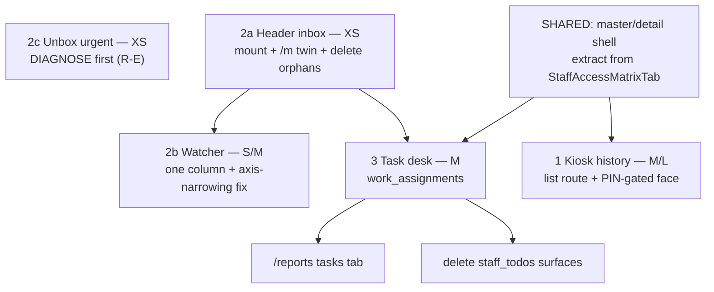

# PLAN — Four operator reconnects: kiosk history · header inbox + watcher · unbox urgent · task desk

**Status:** increments **1 (kiosk history)**, **2a (header inbox)**, **2b (tracking watcher)**
and **3 (task desk)** are LANDED — see §0.1, §0.3, §0.4. Increment **2c (unbox urgent)** is
still plan plus Definition of Done (and R-E says diagnose before building).
**Scouted:** 2026-09-22, five parallel read-only passes over `src/**`, `docs/todo/**`,
`scripts/**`, `tests/e2e/**`.

**Operator ask (paraphrased from the session):** four "bug fixes" that are really
**re-connections** — a kiosk transaction history with reprint, a top-right inbox plus a
tracking watcher, the urgent unbox list, and a desktop task system — each described as
*"already implemented throughout the back end, it just needs to be updated to the front end."*


---

## 0.1 Landed 2026-09-22 — 2a header inbox · 2b tracking watcher

**The operator's Definition of Done, in their own words:** *"I'm able to scan something in
the arrival and it to display in the notifications inbox, and this package now under urgent
and data table from a matching arrival scan, and a little pop up bottom right for the staff
scanning the package in to arrival, and auto mark it as urgent flag."*

That is one chain, and every link is now real:

| Link | Where it lives | Proof |
|---|---|---|
| A watch is written before the box exists | `watchTrackingPreArrival` → `staff_subscriptions` `rule` row (`match_tracking_normalized`, migration `2026-09-22`) | column + both indexes verified on the live DB |
| The door EMITS an arrival | `recordReceivingScan` now records the `receiving.carton.arrived` ops event on TRIAGE scans. **Nothing in the repo emitted that key before** — the vocabulary was declared and unreachable, so no watch could ever fire | live probe: event → outbox → drain `delivered: 1` |
| Only the right people hear it | `resolveRecipients` narrows the rule arm on `match_sku` AND `match_tracking_normalized` (it used to filter on the event key alone, so one SKU rule fired on every unbox event in the org) | `fanout-worker.test.ts` |
| It arrives LIVE | the fan-out worker now publishes each new `staff_inbox_items` row on `org:{org}:inbox:{staff}`. That leg was diagrammed in `2026-07-28d` and never written | `fanout-worker.test.ts` (pushed once; never twice on a retry) |
| It is READABLE | `ActivityInboxPopover` gained a `['api-inbox']` react-query arm over `GET /api/inbox`; `/m/inbox` is the phone twin. **`GET /api/inbox` had zero UI consumers** — every durable row written since July was invisible | live: panel paints `Carton scanned in`, dismiss PATCHes `{action:'read'}` |
| The box JUMPS THE QUEUE | `promoteWatchedArrival` flags the carton `is_priority` / `priority_tier = 0` through the shared `markReceivingPriority` — the same writer and the same flag the pending-order match uses, so it floats into the unbox queue's pinned urgent band and the tester's queue via `RECEIVING_PRIORITY_RANK_SQL` | live probe on carton 53187: `false/null` → `true/0`, restored after |
| The SCANNER is told | `publishWatchedArrival` → `WatchedArrivalToaster` (mounted in `WarehouseShell`, which serves BOTH the desk and `/m`) → bottom-right toast. The fan-out deliberately never notifies the actor, so without this the one operator holding the wanted box is the only person who does not know | see §0.2 |
| A fulfilled watch RETIRES | `retireFulfilledTrackingWatches` mutes the rule row once delivered — carriers reuse numbers, and a live rule would fire again on the next trip | live probe: `subscribed` → `muted` |

**Two latent defects were fixed on the way, both of the same shape — a predicate written,
indexed, documented, and never read:** the `match_*` narrowing in `resolveRecipients`, and
the entire durable inbox feed (`getInboxFeed`, unconsumed by any surface).

**Ruled here, not inherited:** a watched arrival is URGENT. The plan treated notification and
priority as separate increments (2b vs 2c); the operator's DoD joins them, and the join is
the point — telling the watcher while the box sits in scan order behind fifty others is a
notification about a wait, not an answer to it.

### 0.2 What was actually run

Everything below was executed against the real stack on the operator's own origin,
`http://localhost:3050` — never a lane port.

- **End-to-end notification**, throwaway probe: wrote a `rule` watch on a tracking number
  that exists nowhere → wrote the arrival ops event → drained it through the real cron route
  `GET /api/cron/notification-outbox` → `{"delivered":1}` → a durable `staff_inbox_items` row
  (`state: unread`, `event_key: receiving.carton.arrived`, payload carrying the number) →
  the watch left `muted`. Probe rows deleted afterwards; the `ops_events` row stays, because
  that table refuses DELETE by design ("append-only evidence").
- **Urgency**, live: carton 53187 `is_priority=false, priority_tier=null` →
  `true / 0` after `promoteWatchedArrival`, then restored to its original values.
- **The operator's toast**, live in a real browser session (Playwright, admin storage state,
  desk at 1440×900): *"Marked urgent — someone is waiting for this · Tracking ···87196381 ·
  1 person watching"*, bottom-right, from the app's single `AppToaster` corner. First attempt
  missed because Ably had not attached yet on a cold dev page — worth knowing when testing
  by hand: open the page, let it settle, then scan.
- **SQL**, all six new/changed statements `EXPLAIN`ed against the live schema (union watch
  list, both mutes, the narrowed rule arm, the payload-carrying feed read, the pre-arrival
  upsert) — no syntax or column drift.
- **Gates**: `pnpm verify:fast` PASSED (16/16, including Boundary 68/68 ratchet clean, Nav
  names, Mobile-first, Tenancy isolation). Unit: `fanout-worker.test.ts` 15/15,
  `watched-arrival.test.ts` 5/5, `nav-registry.test.ts` 17/17, tracking-format +
  resolve-shipment 37/37.
- **`/m/inbox`**, live on a 390×844 viewport: watch a known number → carton row; watch an
  unknown number → *"Waiting to arrive"*; Stop removes it and `GET /api/my-day/watch`
  returns `tracking: []`.


---

## 0.3 Landed 2026-09-22 — 3 task desk

**The operator's added instruction, in their own words:** *"ensure that adding a task will
display an inline form most similar to the exceptions orders inline instead of the data
table component."* That is the shape that shipped: `?compose=1` UNMOUNTS the grid and mounts
`TaskComposerForm` — `CONTEXT_PANEL_HOST_CLASS` host, the task queue as a resizable
context-panel rail on the left, and the form on the right as grouped `TriageScrollLayout`
sections (Record · Assignment · Details), exactly as `OrderExceptionsWorkbench` swaps its
grid for `ExceptionEditor`. The page CTA becomes the composer's own (`DeskActionSlot`,
last-writer-wins on `role="primary"`), so the desk never shows two primary verbs.

| Piece | Where it lives |
|---|---|
| Read API | `GET /api/tasks?lane=open\|done\|all&assignee=me\|all\|<id>&priority=&limit=` → `listTaskDeskRows` (one statement: `work_assignments` ⋈ `staff`×2 ⋈ `support_tickets`), `work_orders.claim`, `withTenantTransaction` |
| Edit API | `PATCH /api/tasks/[id]` — strict allowlist (403 naming the key), 409 on an illegal transition, `recordAudit` with a before-image and the changed keys |
| Create | `POST /api/tasks` gained `deadlineAt`, so the composer is ONE write, not a create-then-patch |
| Row model | `src/lib/tasks/task-desk-row.ts` — the view model every surface reads (desk, `/m`, `/reports`) |
| Table family | The registered `tasks` family, repointed from `staff_todos` and ported to a **`SlotTableFamily` record** (`TASKS_FAMILY`) — `tasks-grid-layout.ts` and `useTasksTableLayout.ts` DELETED, so `SLOT_TABLE_COLUMN_MODULE_DEBT` shrank by one and `SLOT_TABLE_COLUMN_ENGINE_FAMILIES` grew to three |
| Desk | `/tasks` (`TasksWorkbench` → `useTasksSpreadsheet` → `DataTable`), no spine row (`spineBand: false`) |
| Record plane | `TaskInspector` at the stable occupant `detail:task`; embeds `SupportTicketDetail` (`embedded` + `hideTitle`) when the task is about a ticket |
| Selection strip | `TaskActionBar` — Done · Reopen · Urgent · Normal, portaled into the slot-table action row. It is the SECOND host of the action-bar law, which is why `SLOT_TABLE_ACTION_BAR_HOST` became `SLOT_TABLE_ACTION_BAR_HOSTS` (a list) across the law, the CLI and the gate |
| Throw, once | `useThrowTask` — the resolve → roster → POST → honest-outcome sequence, extracted so `ThrowTaskPanel` (⌘⇧U) and the desk composer cannot report a degraded amplifier differently |
| Phone twin | `/m/tasks` — Open/Done lanes, one-tap optimistic complete, `work_orders.claim`, its own nav leaf |
| Record | `/reports?tab=tasks` — completed tasks, org-wide (`assignee=all`), as its own registered `report-tasks` record family |

**Proved at `http://localhost:3050`** (1440×900, real session): `/tasks` paints the grid and
the Add CTA; Add → `?compose=1`, grid gone, rail + `Record · Assignment · Details` sections
present, CTA reads *"Find a record first"* until a target resolves; ✕ returns the grid and
drops the param. `/m/tasks` and `/reports?tab=tasks` were each proved live by their own lane.

### Deviations and open notes

1. **Every task points at a record, and the composer says so.** `work_assignments.entity_type`
   / `entity_id` are NOT NULL and the enum names real records, so DoD item 5's *"optional
   paired ticket"* resolved as: the TARGET is required and a ticket is one of the three kinds
   it can be. A standalone task would have been a new polymorphic parent (enum value +
   delete-integrity trigger family) — refused, because R-A promised zero DDL.
2. **Known gap, recorded rather than silently dropped (DoD item 6).** `staff_inbox_items`
   cannot anchor `support_ticket` (`task-vocabulary.ts` — the CHECK allows receiving ·
   receiving_line · serial_unit · order · fba_shipment · repair · warranty_claim). A ticket
   task therefore still lands in the assignee's desk and `/m` list but raises NO inbox badge;
   the create path reports `notified: 'skipped_entity'` and `useThrowTask` surfaces that as a
   warning toast naming it. Widening the CHECK is an enum + migration + trigger pass.
3. **Add-on-phone is a named verb gap, not a stub.** A task needs `(entityType, entityId)`,
   which only `POST /api/scan/resolve` produces; on `/m` that resolve lives behind `/m/scan`,
   which navigates away with no return-path contract. Recorded as
   `MOBILE_FIRST_VERB_GAPS['task-throw']` with the exact prerequisite. `/m/tasks` owns the
   read and complete half today.
4. **The `staff_todos` deletion is SCHEDULED, not swept (DoD item 11).** This pass deleted
   what the cutover obsoleted: `TasksWorkbench`'s `staff_todos` binding, `useStaffTasks`,
   `TasksComposerRow`, `StaffTaskInspector`, `staff-task-row.ts` (both copies) and
   `staff-task-compound-view.ts`, plus `src/lib/staff-todos/` entirely. What SURVIVES, and is
   the named gated pass: `/api/staff-todos`, `src/lib/neon/staff-todos-queries.ts`,
   `src/lib/queries/staff-todos-queries.ts`, `src/lib/schemas/staff-todos.ts` and their one
   live reader `src/components/layout/goal-chip/useGoalChecklists.ts` (`HeaderGoalChip`).
   House doctrine is *"delete components one by one when I say so"* — that chip is not this
   increment's cutover, so it is listed here for the operator to gate rather than swept.

---

## 0.4 Landed 2026-09-22 — 1 kiosk history (Square Transactions)

**Superseded in part, 2026-09-22 (same day, operator):** the PIN gate this section describes is
GONE — History signs in pinlessly through the desk's own `StaffPickerList`, the rail routes on
All · Sales · Repair service, and the top-left command trigger reads History while the tool is
open. Current state, decisions and the open items live in
[`kiosk-history-HANDOFF.md`](./kiosk-history-HANDOFF.md); read that before touching this face.

**The ask, in the operator's words:** a history of every transaction on the tablet — *"left
side list, right side details, scrollable, with actions"* — showing who repaired it, what
part was used, the drop-off and pick-up, both signatures, and **all the actions for
printing**.

| Piece | Where it lives |
|---|---|
| List API | `GET /api/kiosk/visit?q=&cursor=&limit=` → `listKioskVisits` (`counter_transactions` ⋈ `customers` ⋈ two LATERALs), `withKioskAuth`, org from the DEVICE row. Keyset paging, capped at 50 — never an unbounded history fetch |
| One search box, every axis | `parseKioskVisitSearch` reads a typed string as phone digits **and** ticket **and** RS/visit number **and** name; a search that matches nothing returns nothing (`FALSE`), never the unfiltered list |
| Detail API | `GET /api/kiosk/visit/[id]` → `loadCounterVisit` (money, lines, devices) **+** the new `loadVisitProvenance` (drop-off / pick-up stamps, technician, parts, both signatures) |
| Technician, honestly | `unit_repairs.completed_by` → `started_by` → latest `repair_actions` staffer → `work_assignments` assignee, and the arm is returned as `technicianSource` so the face says *Assigned to* rather than claiming work nobody did. `unit_repairs` is the inventory book and is EMPTY for a customer-owned device — reading it alone would have reported "nobody repaired this" on most counter repairs |
| Edit API | `PATCH /api/kiosk/visit/[id]` — PIN step-up, allowlist of six fields (customer name/phone/email · device serial/issue/notes). Anything else is **403 naming the key**, never a silent strip; a phone edit that would collide with another customer is 409, not a silent duplicate |
| Label reprint | `POST /api/kiosk/visit/[id]/label-printed` — the device-principal twin of the staff route, calling the SAME `markRepairLabelPrinted` (first print wins). The repair must belong to the visit on screen, so a device cannot walk the repair book by id |
| Receipt reprint | the existing `GET /api/kiosk/visit/[id]/receipt`, now audited on every render with `reprint` in the metadata |
| Label payload, once | `buildRepairLabelPayload` — extracted from the desk's details panel, so the counter and the desk cannot promise different turnarounds (the 10-day SLA is one constant now) |
| Audit | `recordKioskVisitAudit` → `audit_logs` entity `counter_transaction`, actor = the stepped-up staffer, `via = kiosk_device:{id}`. Actions `kiosk.visit_print` (kind receipt\|label) and `kiosk.visit_edit` (before/after + changed keys) |
| The door | `KIOSK_SERVICES` gained a **`kind: 'staff'`** tile. History is not a fifth command: it sets no `active_command`, owns no cart, and picking any command returns the operator to the visit they were mid-way through. `serviceIdToCommand` now takes the narrow `KioskCommandServiceId`, so a staff tile cannot reach it |
| The face | `KioskHistoryPane` (PIN gate + actions) → `KioskHistoryRail` (search + rows in the catalog's own rail vocabulary) + `KioskHistoryDetail` (record, then the same rows as fields in edit mode) |
| Signatures | PNG preferred, `documents.document_data.signatureStrokes` as the documented fallback through the new read-only `SignatureStrokesView` — a failed Blob upload must not read as *"the customer never signed"* |

**The PIN stays in memory, and only while the face is open.** `kiosk-context.ts` rules that
staff identity appears "transiently via PIN step-up on a privileged action", so History mints
no cookie and no grant: the verified `{staffId, pin}` lives in component state, re-presented
to each privileged route, dropped on close and after 5 minutes idle. The step-up sheet's
blurb is now a prop — telling a staffer their PIN *"authorizes payment at the register"* while
it opens the customer book named the wrong act.

### What was actually run (all at `http://localhost:3050`, iPad Pro 11 landscape)

- **Reads, device-authed** (`cf_kiosk` from `/api/kiosk/dev-autopair`): list 200 with real
  visits; detail 200 with 2 devices, drop-off stamps and both signature sources; search by
  phone last-4 → 2 hits, by `RS-4795` → 1, by a nonsense string → 0.
- **Refusals**: `PATCH {price}` → **403 `FIELD_NOT_EDITABLE`** listing the editable set; bad
  PIN → **403 `STEPUP_FAILED`** on both PATCH and label-printed; a repair id from another
  visit → `device_not_in_visit`.
- **Writes, through the face in a real browser**: unlocked with a temporary PIN staffer, edited
  a serial (`Visit updated`, rail re-queried), printed a label — `label_printed_at` stamped,
  second call reported `alreadyPrinted`, and `audit_logs` carries `kiosk.visit_edit` +
  `kiosk.visit_print` with `actor_staff_id` = the stepped-up staffer and the device as `via`.
  Every touched row was restored (serial back, stamp back to NULL).
- **The temp staffer was RETIRED, not deleted**: `audit_logs` is append-only, so the FK's
  `ON DELETE SET NULL` is refused by design. Row 19471 is `inactive`, `pin_hash` NULL, off the
  step-up roster — the trail keeps a resolvable actor.
- **Gates**: Lint ✓ · Typecheck ✓ · Tenancy isolation ✓ · Boundary 68/68 ✓ · Nav names ✓ ·
  Mobile-first ✓ · Action bar ✓ · Id header ✓ · Identity purity ✓ · Sku identity ✓.
  Unit: `kiosk-visit-history.test.ts` 17/17, plus `commands` / `kiosk-pos-surface` /
  `route-permission-manifest` 101/101 together.
  **`Ground` is RED and it is not this increment**: `src/components/mobile/tasks/MobileTasksView.tsx:150`
  (increment 3's phone twin, landed in this same worktree) paints `bg-surface-canvas`, taking
  the `/m` grey count 45 → 46. That file is untouched here; the baseline was not raised.

### Deviations and open notes

1. **Mobile-first standing (DoD item 8).** This is surface class **D** under `SURFACE_LAW` §3,
   permitted because it is a second surface for a verb the desk already completes
   (`/api/counter/visit/[id]/receipt` + the walk-in sales board) — not a new verb. No `/m`
   exemption is claimed and the `Mobile-first` gate is green.
2. **The list route is `/api/kiosk/visit`, not `/api/kiosk/transactions`.** The plan named the
   latter; the former is the same noun the detail, receipt and stamp routes already use and is
   already on both device-host allowlists (`proxy.ts`, `kiosk-host.ts`), so the increment added
   no new public path surface.
3. **Reads take no PIN; the FACE does.** A tablet can already render any visit's receipt, so
   gating the read would have been theatre. Phase 4's actual rule — History is never reachable
   from the attract/customer face — is enforced twice: the staff tile is filtered out of
   `KioskCommandMenu` on the customer face (`showStaffTools={false}`), and the pane renders
   nothing until the PIN verifies.
4. **PIN verification is `POST /api/kiosk/staff-for-stepup`**, the roster route's other half.
   It mints nothing and carries no authority — each privileged act still re-presents the PIN
   to its own route.
---

## 0. The one sentence that explains all four

**Every one of these is unmount debt, not missing capability.** The store, the SQL, the
permission and (in three of four cases) the React component already exist on disk and are
tested; what was removed is the **door** — the mount point, the nav row, or the read API that
the door would call. That is why they present as bugs: the operator remembers using them.

The scout evidence, in one table:

| # | Feature | Store exists | Read/write API exists | UI component exists | What is actually absent |
|---|---|---|---|---|---|
| 1 | Kiosk history | ✅ `counter_transactions` · `repair_service` · `documents` | ⚠️ **detail only** (`loadCounterVisit`) | ❌ | A device-authed **list** route + a history face + a `KIOSK_SERVICES` entry |
| 2a | Header inbox | ✅ `staff_inbox_items` · `notification_outbox` | ✅ `GET /api/inbox`, `PATCH /api/inbox/[id]`, Ably `inbox:{org}:{staff}` | ✅ **orphaned** `ActivityInboxButton` | **One JSX mount.** `GlobalHeader` renders an empty right zone |
| 2b | Tracking watcher | ✅ `staff_subscriptions` **`rule` kind** — a predicate needing no existing row | ⚠️ `POST /api/my-day/watch` 400s pre-arrival | ✅ **orphaned** `SubscribeToggle`; `MyDayWatchRail` mounted (post-arrival only) | **One column** (`match_tracking_normalized`) + an emit inside `recordReceivingScan` + axis narrowing in `resolveRecipients` |
| 2c | Unbox urgent | ✅ `receiving_carton.is_priority` / `priority_tier` | ✅ `?priority_only=1` + `RECEIVING_PRIORITY_RANK_SQL` | ✅ pinned band by 2026-08-08 ruling | **Verify the band paints.** Do not restore the tab — see §4 |
| 3 | Task desk | ✅ `work_assignments` (every column the ask names) | ⚠️ `POST` only — **no `GET /api/tasks`** | ✅ **orphaned** `TasksWorkbench` + `StaffTaskInspector` | A read API, a `work_assignments` table family, one route, a `/reports` tab |

**ROI consequence.** The cost of these is dominated by *re-establishing the seam correctly*
(tenancy, auth principal, mobile-first gate, cohort law), not by building features. Feature 2a
is roughly a one-line mount plus its gate work. Feature 1 is the only one needing genuinely
new backend surface, and even there the detail reader (`loadCounterVisit`) already joins every
table the right pane must paint.

### ROI ranking (effort → operator value)

| Rank | Increment | Effort | Why it ranks here |
|---|---|---|---|
| **1** | 2a Header inbox | **XS** | Component, API, realtime channel and context provider all exist and are tested. Mount + mobile twin. |
| **2** | 2c Unbox urgent | **XS** | Backend complete. Likely a *verification* task, not a build one. May close with zero code. |
| **3** | 2b Tracking watcher | **S–M** | Re-scoped by ruling R-B from "new table" to **one column**. Carries a real bug fix: `resolveRecipients` ignores every `match_*` axis but the event key. |
| **4** | 3 Task desk | **M** | Highest daily value. Needs one read route + one table family. **Unblocked** (R-A: `work_assignments`). |
| **5** | 1 Kiosk history | **M–L** | Highest customer-facing value. Needs a device-authed list route + a new kiosk face. **Unblocked** (R-C was a typo). |

---

## 1. Shared seams — build once, four features consume

This is the part worth extracting before any feature work. Each row is an existing
implementation; none of these should be re-derived per feature.

| Seam | Canonical implementation | Consumed by |
|---|---|---|
| **Master/detail shell** (left list + right detail, URL-synced) | `src/components/admin/StaffAccessMatrixTab.tsx` + `AccessSidebarPanel.tsx` + `access/StaffAccessDetail.tsx` — selection in `?staffId=`, empty state `AdminEmptyDetail`, pure query hook | 1 (kiosk history), 3 (task → ticket) |
| **Desk right-rail inspector** (inline detail beside a slot table) | `useRegisterRightPanel` (`src/components/right-rail/useRegisterRightPanel.ts:28`) into the always-mounted `RightRailHost` (`DesktopRouteShell.tsx:405`); precedent occupant `StaffTaskInspector.tsx:241`, `InventoryInspectorRail.tsx:90` | 3 |
| **Slot-table family recipe** (6 files + 4 registrations) | Template `sku-exceptions`: field catalog, `-resolve`, row adapter, `-table-definition`, `use*Spreadsheet`, workbench host — then append to `PRODUCT_TABLES`, `REGISTERED_BINDINGS`, `SLOT_TABLE_ENGINE_LAYOUT_HOOKS`, `SLOT_TABLE_COLUMN_ENGINE_FAMILIES` | 3, and any new report tab |
| **Realtime fan-out** | `src/lib/realtime/channels.ts` — `getInboxChannelName(orgId, staffId)` = `org:{orgId}:inbox:{staffId}`; client `useAblyChannel(name, event, handler, { coalesce: 'raf' })`; existing consumer `ActivityInboxContext.tsx:509-630` already handles `priority_unbox`, `inbox_item`, `staff_message` | 2a, 2b, 2c |
| **Print action seam** | Kiosk-callable: `GET /api/kiosk/visit/[id]/receipt` (`withKioskAuth`) and client-side `printRepairLabel()` (`src/lib/print/printRepairLabel.ts:53`). Staff-only: `/api/repair-service/print/[id]`, `/api/print/dispatch`, `POST /api/label-print-jobs` | 1 |
| **Mutation route skeleton** | `withAuth`/`requireRoutePerm` → Zod → domain helper (`ctx.organizationId`, never body) → `recordAudit` → `after()`; tenancy via `withTenantTransaction` / `tenantQuery`; permission declared in `src/lib/auth/permission-registry.ts` | all four |

**The single highest-leverage shared piece is the master/detail shell.** Features 1 and 3 both
describe the identical shape in the operator's own words ("left side list, right side details,
scrollable, with actions"). Building it twice is the predictable failure of this batch.

---

## 2. Increment 1 — Kiosk device history (Square Transactions)

### Evidence

**Exists (backend).**
- `counter_transactions` / `counter_transaction_lines` — visit header + retail/buyback lines
  (`src/lib/drizzle/schema.ts:5590`, `:5605`), written by `submitCounterTransaction`
  (`src/lib/counter/submit-counter-transaction.ts`) behind `POST /api/kiosk/intake`.
- `repair_service` (`schema.ts:2178`) carries the whole provenance chain the operator listed:
  `received_at` (drop-off) · `delivered_at` + `pickup_signed_at` (pick-up) · `pickup_staff_id`
  · `received_by_staff_id` · `label_printed_at` · `ticket_number`.
- **Who repaired it:** `unit_repairs.started_by_staff_id` / `completed_by_staff_id`
  (`schema.ts:3847`), joined via `unit_repairs.repair_service_id`; plus `work_assignments`
  (`entity_type='REPAIR'`, `assigned_tech_id`).
- **What part was used:** `unit_repairs.parts_used` JSONB (`schema.ts:3843`) —
  `{ sku, description, cost, qty }[]`. Also `warranty_repair_attempts.parts_used`.
- **Signatures:** readable back **two ways** — the PNG at `documents.signature_url` (Vercel
  Blob) and the lossless vector strokes at `documents.document_data->'signatureStrokes'`.
- **A detail reader already joins all of it:** `loadCounterVisit(orgId, visitId)`
  (`src/lib/counter/read-visit.ts:262`).
- **A list reader exists for the desk:** `listCounterSalesAsSaleRows`
  (`src/lib/counter/list-counter-sales.ts:31`).

**Exists (frontend).** `KioskShell` (mounted), `KioskCommandMenu` (`KioskTopChrome.tsx:55` —
the top-left affordance the operator means), `KioskCartDoneFace` already prints a receipt via
`window.open('/api/kiosk/visit/{id}/receipt?print=1')`, `SignaturePad`.

**Absent.**
1. `GET /api/kiosk/transactions` — no device-authed **list** route exists anywhere under
   `src/app/api/kiosk/**` (29 routes enumerated; `slot-events` is `withAuth`, i.e. staff-only,
   and is hardware telemetry, not commerce).
2. A kiosk-callable reprint-stamp: `POST /api/repair-service/[id]/label-printed` is
   `requireRoutePerm('repair.intake')` and **401s on a tablet**.
3. `KIOSK_SERVICES` (`src/lib/kiosk/services.ts:40-104`) has no `history` entry.
4. The history face itself.

**Already specified in-repo.** `docs/todo/kiosk-pos-modernization-HANDOFF.md` §Phase 4
("History + reprint — staff face on device") specifies this increment, including the
**PIN gate** (`KioskPaymentStepUpSheet` + `/api/kiosk/staff-for-stepup`) and the refusal
*"do not expose History on the attract/open customer face without PIN."* **This plan adopts
Phase 4 verbatim and does not re-decide it.**

### Definition of Done — Increment 1

A tablet in kiosk mode, paired and with no staff cookie, can do all of the following:

1. **Reach it.** Top-left `KioskCommandMenu` lists **History** as a `KIOSK_SERVICES` entry
   (`status: 'live'`), below the four commerce modes. Selecting it demands staff PIN step-up
   before any row renders.
2. **Master rail.** A scrollable left list of that org's recent visits, newest first, each row
   painting: thumbnail/glyph · title (ticket # or customer name) · subtitle (model/SKU) ·
   date + time. Paginated, not an unbounded fetch.
3. **Detail pane.** Selecting a row renders a scrollable right pane showing, from real data:
   - customer + contact, line items, totals;
   - **drop-off** (`received_at`) and **pick-up** (`delivered_at` / `pickup_signed_at`) times;
   - **who repaired it** — technician name resolved from `unit_repairs.completed_by_staff_id`
     (falling back to `started_by_staff_id`, then the `work_assignments` tech);
   - **parts used** — rendered from `unit_repairs.parts_used`, each row showing description +
     qty (+ SKU when present);
   - **both signatures** — intake and pickup, rendered from `signature_url`, with the
     `signatureStrokes` canvas as the documented fallback when Blob is unreachable.
4. **Actions,** each proven to work from the device principal:
   - **Print receipt** → existing `GET /api/kiosk/visit/[id]/receipt`.
   - **Print label** → `printRepairLabel()` **and** a new `withKioskAuth` route that stamps
     `repair_service.label_printed_at` (a reprint that does not record itself is a lie).
   - **Edit** → a `withKioskAuth` `PATCH` limited to an explicit allowlist of fields; anything
     outside it returns 403 rather than silently ignoring the field.
   - *(Ruled 2026-09-22: the fourth action named in the session ask — "unparategate /
     parategate" — was a **transcription typo** and is not a feature. The action set is
     exactly the three above. Do not invent a fourth.)*
5. **Search** by phone / ticket # / last-4, per Phase 4 item 5.
6. **Tenancy.** Every new route takes `organizationId` from `withKioskAuth`'s `ctx` and runs
   under `withTenantTransaction` / `tenantQuery`. A test proves a device paired to org A
   cannot read an org B visit.
7. **Audit.** Every reprint and every edit writes `recordAudit`.
8. **Mobile-first standing.** This is surface class **D** under `SURFACE_LAW` §3. It is
   permitted **because it is a second surface for a verb the desk already completes**
   (`GET /api/counter/visit/[id]/receipt` + the walk-in sales board), not a new verb. State
   that in the PR; do not claim a `/m` exemption.

**Proof block**

```bash
npx tsx scripts/mobile-ground-guard.ts --json
npx tsx scripts/boundary-guard.ts --enforce
npx tsx --test src/lib/counter/session-events.test.ts
npx playwright test tests/e2e/kiosk-intake-flow.spec.ts --project=desktop
npx playwright test tests/e2e/counter-session-two-device.spec.ts --project=qa-desktop
pnpm verify:fast
```
Plus a browser pass at **`http://localhost:3050`** only, on an iPad-sized viewport
(`devices['iPad Pro 11 landscape']`, the posture `counter-session-two-device.spec.ts` already
uses): PIN → list → row → each action fires.

**Refusals.** No second receipt renderer (reuse `renderVisitReceiptHtml`). No staff-authed
route called from the tablet. No history on the attract face without PIN.

---

## 3. Increment 2a — Top-right inbox

### Evidence

`src/components/layout/GlobalHeader.tsx:64-96` mounts, left to right:
`SidebarCollapseControl` · `GlobalHeaderSearch` · `HeaderDailyTasks` · `HeaderPinsSwitcher`
(nav zone) → `GlobalScanDock` → `HeaderPageSwitcher` → `{panelContent}`.

`panelContent` comes from `useHeader()` (`src/contexts/HeaderContext.tsx:6`) and **zero files
in the repo call `setPanelContent`** — line 93 always evaluates to `null`. The top-right is
empty.

`GlobalHeaderActions` (`src/components/layout/GlobalHeaderActions.tsx:31`) is the old
right-hand cluster — search · add menu · goal chip · **inbox** · assistant — and has **zero
importers**. `ActivityInboxButton` → `ActivityInboxPopover` → `InboxQueueLinks` are all
orphaned behind it. Everything below them is live: `GET /api/inbox`, `PATCH /api/inbox/[id]`,
`/api/inbox/tech-queue`, `/api/inbox/support`, `ActivityInboxProvider`, and the Ably channel
`org:{orgId}:inbox:{staffId}` already handling six event types.

### Definition of Done — Increment 2a

1. **Mount the inbox, not the orphan cluster.** Re-mounting `GlobalHeaderActions` wholesale
   would double-mount `GlobalHeaderSearch` (already in the nav zone at line ~78) and
   `HeaderGoalChip` (whose `GoalPopover → TaskList` reads `staff_todos`, a store
   `daily-task-system-PLAN.md` §1.2 records as deliberately unmounted). Mount
   `ActivityInboxButton` — which was **extracted for exactly this reuse** on 2026-08-21, per
   its own docblock — into a right-aligned header zone.
2. The badge count is live: a new `staff_inbox_items` row for the signed-in staffer updates
   the badge **without a reload**, through the existing Ably leg.
3. Opening the popover lists unread items; `PATCH /api/inbox/[id]` marks read and the badge
   decrements optimistically.
4. **Mobile twin.** `MobileTopBar.tsx:74-78` records that the inbox *"has since left mobile
   entirely (it is a desk surface)"*. Restoring it on the desk re-opens that: ship the inbox
   entry in the `MobileSidebarDrawer` footer (its documented prior home) with the unread dot,
   **or** record an explicit operator exception in this file. A desk-only inbox with no
   ledger entry fails `SURFACE_LAW` §1.
5. `GlobalHeaderActions.tsx` and any component that stays unreachable after this increment is
   **deleted in the same pass** — the house rule is a clean cutover, and leaving a second
   header cluster on disk is how this drifted in the first place. `GlobalHeaderAddMenu` /
   `HeaderGoalChip` / `GlobalHeaderAssistantButton` either get mounted here or get deleted;
   they do not stay orphaned.
6. The five-icon cap that `ThrowTaskHost.tsx:13` records for this cluster is respected: a
   standing top-right icon is earned by frequency.

**Proof block**

```bash
npx tsx scripts/nav-name-guard.ts --json
npx tsx scripts/mobile-first-guard.ts --json
npx tsx scripts/boundary-guard.ts --enforce
npx tsx --test src/lib/nav/nav-name-collisions.test.ts src/lib/nav/nav-mobile-first.test.ts
npx playwright test tests/e2e/sidebar-nav-search.spec.ts --project=desktop
pnpm verify:fast
```
Browser at `:3050`: badge increments on a live insert, popover opens, item marks read.

---

## 4. Increment 2b — Global header watcher (`+` → watch anything)

### Evidence

- **A watch concept exists and is mounted:** `MyDayWatchRail`
  (`src/features/my-day/MyDayWatchRail.tsx:43`) → `POST /api/my-day/watch`
  (`src/app/api/my-day/watch/route.ts:80`) → `toggleEntitySubscription`
  (`src/lib/notifications/subscriptions.ts:57`), storing
  `staff_subscriptions(kind='entity', entity_type='receiving', entity_id=<receivingId>)`.
- **It refuses the operator's case.** `route.ts:157-164` resolves the tracking to a carton and
  throws when there is none: *"This tracking has no inbound carton yet — receive it first,
  then watch."* The operator's ask is precisely the **pre-arrival** watch — "I am looking
  forward to receiving a package."
- **The arrival hook point is known and single:** `recordReceivingScan`
  (`src/lib/receiving/record-scan.ts:95`) — it upserts `receiving_scans`, records the
  `TRACKING_SCANNED` ops event, links the STN, and stamps `door_received_at`. Every door path
  (`/api/receiving/lookup-po`, `/api/receiving-entry`, `/api/receiving/touch-scan`, desktop
  triage, `/m` arrival, unbox) funnels through it.
- **The event vocabulary is already declared:** `receiving.carton.arrived`
  (`src/lib/notifications/event-vocabulary.ts:102`, label *"Carton scanned in"*).
- **The delivery rail exists:** `notification_outbox` → `staff_inbox_items` → Ably
  `inbox:{org}:{staff}` → `ActivityInboxContext`.

### ✅ R-B RULED 2026-09-22 — **no new table.** The generic watcher already exists.

The operator asked for something *"tracking-number agnostic, just like a notification system,
reusable across different tabs and pages"* — and asked what to name the table.

**Name nothing. It is `staff_subscriptions`, and it was designed for exactly this.** Its own
migration header (`2026-07-28c_staff_subscriptions.sql:3-16`) declares **one discriminated
table covering three kinds**:

| Kind | Shape | Operator sentence |
|---|---|---|
| `entity` | many-to-one on `(entity_type, entity_id)` | *"notify me about carton 4412"* |
| **`rule`** | **one-to-many predicate over a CLASS of events** | *"notify me on every unbox event for SKU LEN-T480-i5"* |
| `sla` | fires on an **absence**, cron-walked | *"delivered but not received within 24h"* |

**`rule` is the reusable watcher, and it needs no existing row to watch.**
`staff_subscriptions_entity_shape_chk` forces rule rows to carry NULL entity columns, and
`staff_subscriptions_rule_shape_chk` requires only a non-empty `match_event_keys[]`. A rule
subscription is therefore **inherently pre-arrival** — the thing it watches for does not have
to exist yet. That is the whole property the pre-arrival tracking watch needs, already built,
already indexed (GIN on `match_event_keys`), already tenant-from-birth with FORCE RLS and a
seven-parent delete-integrity trigger family.

**The fan-out already resolves both arms in one query.** `resolveRecipients`
(`src/lib/notifications/fanout-worker.ts:267-292`) UNIONs the entity arm and the rule arm with
`DISTINCT ON (staff_id)`, honouring `state <> 'muted'` on both.

**So the entire increment is one column plus one call.** Add a `match_*` axis for the tracking
number — as a **real column**, not `match_extra` JSONB, because the migration is explicit
(`:18-24`): *"promote queryable business facts to real columns… `match_extra` JSONB stays for
genuinely variant config ONLY — never for anything the worker filters on."* The worker will
filter on this, so it is a column:

```sql
ALTER TABLE staff_subscriptions
  ADD COLUMN IF NOT EXISTS match_tracking_normalized TEXT;
CREATE INDEX IF NOT EXISTS idx_staff_subscriptions_rule_tracking
  ON staff_subscriptions (organization_id, match_tracking_normalized)
  WHERE subscription_kind = 'rule' AND state <> 'muted'
        AND match_tracking_normalized IS NOT NULL;
```

**Reusability across tabs and pages is a component, not a table.** The cross-surface primitive
is **already written and orphaned**: `SubscribeToggle`
(`src/components/notifications/SubscribeToggle.tsx:65`, **zero importers**). Any page that
wants a watch affordance mounts that one control. Do not write a second bell.

### 🐛 Latent bug this increment must not copy — and should fix

`resolveRecipients`' rule arm filters on **`$4 = ANY(match_event_keys)` and nothing else**
(`fanout-worker.ts:283-288`). It never narrows on `match_sku`, even though the column, the
partial index `idx_staff_subscriptions_rule_sku`, and the docblock at `:262-263` claiming the
arm *"hits the partial `match_sku` index"* all exist.

**Consequence:** a staffer who subscribes to *"unbox events for SKU LEN-T480-i5"* is notified
on **every** unbox event in the org. The predicate columns are written and indexed but never
read. A tracking axis added the same way would inherit the same defect — every watcher would
fire on every carton.

**Therefore the axis narrowing is part of this increment's DoD, not a follow-up:**
`resolveRecipients` must take the event's match facts (sku, platform, station, severity,
tracking) and apply each as `(match_X IS NULL OR match_X = $n)` — NULL meaning *"don't care
about this axis"*, exactly as the migration comment at `:87` documents.

### Definition of Done — Increment 2b

1. **A `+` in the top-right header** opens a small panel (clone `MyDayWatchRail`'s tracking
   leaf or `GlobalHeaderAddMenu`'s trigger shape) accepting a pasted/scanned tracking number,
   canonicalised through the existing `src/lib/tracking-format.ts`.
2. **Pre-arrival watches are accepted.** `POST /api/my-day/watch` no longer 400s when there is
   no carton (`route.ts:157-164`). When the tracking resolves to a carton it keeps writing the
   `entity` row it writes today; when it does not, it writes a **`rule` row**:
   `match_event_keys = ['receiving.carton.arrived']`,
   `match_tracking_normalized = <canonical>`, `reason = 'manual'`. Returns 201 either way.
3. **`resolveRecipients` narrows on every declared `match_*` axis** (see the bug note above),
   with a unit test proving a SKU rule does **not** fire on a different SKU, and a tracking
   rule does not fire on a different tracking number.
4. **Arrival fires the notification.** A watched number scanned at any door produces, for the
   watching staffer: a durable `staff_inbox_items` row **and** a live Ably push on
   `org:{orgId}:inbox:{staffId}`. The emit lives **inside `recordReceivingScan`**
   (`src/lib/receiving/record-scan.ts:95`) — one implementation, so no door path
   (`lookup-po`, `receiving-entry`, `touch-scan`, desk triage, `/m` arrival, unbox) can miss
   it. Emitting from `lookup-po` alone is refused.
5. **Idempotent.** A carton re-scanned three times notifies once — use the existing outbox
   `dedupKey` / `collapseKey` seam (`fanout-worker.ts:241-242`), not a new guard. A fulfilled
   pre-arrival rule is then retired (or muted) so it cannot fire for a later reuse of the same
   tracking number.
6. **Visible list, and it is reusable.** The operator sees their standing watches and can
   cancel one. Extend `listReceivingWatchesForStaff` (`subscriptions.ts:155`) to union
   unresolved `rule` watches. Any surface that wants a watch button mounts the existing
   `SubscribeToggle` — which this increment un-orphans.
7. **Tenancy.** No new table, so no new RLS surface; every read/write stays inside
   `withTenantTransaction` / `tenantQuery`. A test proves org A never notifies on org B's scan.
8. **Mobile twin.** A watch must be creatable from `/m` — the natural seat is the
   `MobileActionSlot` on `/m/scan` (you are already holding the thing) or `/m/home`.
9. **Migration hygiene.** One `ALTER TABLE … ADD COLUMN IF NOT EXISTS` + one partial index, in
   a dated immutable file with ROLLBACK + VERIFY sections (copy `2026-09-14a`'s structure).
   No backfill: NULL on legacy rows already means *"don't care about this axis."*

**Proof block**

```bash
npx tsx scripts/tenancy-guard.ts --check --static-only
npx tsx --test src/lib/tracking-format.test.ts src/lib/receiving/resolve-shipment-for-scan.test.ts
npx tsx --test src/lib/notifications/*.test.ts
npm run tenancy:audit
pnpm verify:fast
```
Plus a live loop at `:3050`: add a watch for an unknown tracking → scan that tracking at the
door → the header badge increments without a reload.

---

## 5. Increment 2c — Unbox urgent list

### ⚠ This increment contradicts a recorded operator ruling — read before building

The operator asks to *"open it back up again and display the origin data table."* The repo
records that Urgent was **deliberately** converted from a tab to a pinned band:

> `src/utils/unbox-workspace-state.ts:34-38` — *"**Urgent was a filter wearing a tab's
> clothes** — the Queue descriptor plus `?priority_only=1`, which is why leaving it had to
> *clear* a param. Urgency is not a place a carton sits; it is a flag a carton can carry at
> any stage. It is now a pinned band at the top of the queue rows, so an urgent carton is
> visible from the tab you are already on instead of behind a tab you have to remember."*

and `receiving-modes.ts:84-88` says the same. `unbox-workspace-state.ts:172-177` goes further:
`priority_only` is cleared **unconditionally** on every tab flip, specifically so a stale
`?priority_only=1` cannot silently hide every non-urgent carton.

**Read of the ask:** the operator is reporting *"I can no longer see my urgent cartons."* The
2026-08-08 ruling says they should be seeing them **pinned at the top of the queue they are
already on**. The most likely truth is that **the pinned band regressed**, not that the tab
needs restoring. Restoring the tab would re-create the exact footgun the ruling removed.

### Definition of Done — Increment 2c

1. **Diagnose first, build second.** With real data at `:3050`, open Unbox and answer: does a
   carton with `is_priority = true` (or `priority_tier IS NOT NULL`) pin to the top of the
   queue rows today, visually distinguished? Record the answer in this file.
2. **If the band regressed:** restore it. Backend needs nothing —
   `RECEIVING_PRIORITY_RANK_SQL` (`src/lib/receiving/lines/build-sql.ts:161`) already sorts
   priority first, and `receiving.browse` is a slot-table cohort peer
   (`PRODUCT_TABLES` `receiving`; layout hook
   `src/components/station/receiving-grid/useReceivingTableLayout.ts`). Fix it inside the
   cohort — no foreign chrome wrapper around `DataTable`.
3. **If the band is fine,** the real gap is *discoverability*: surface the urgent **count**
   where the operator looks (the queue's status strip), still without a tab.
4. **Refused without an explicit new operator ruling that supersedes 2026-08-08:** a restored
   Urgent tab, or any surface that leaves `?priority_only=1` set across a tab flip.
5. **Pending-order linkage.** The ask says *"urgent list for pending orders that need to be
   unboxed."* That match already exists — `priority_unbox` is a live Ably event
   (`ActivityInboxContext.tsx:509-520`, *"realtime push when an arriving carton matches a
   pending order SKU"*). Confirm it fires; that, not a tab, is the intended delivery.

**Proof block**

```bash
npx tsx scripts/data-table-industrial-guard.ts --json
npx tsx scripts/id-header-guard.ts --json
npx tsx scripts/identity-purity-guard.ts --json
pnpm run eval:cohort slot-table -- --skip-verify
npx playwright test tests/e2e/data-table-to-ship.spec.ts --project=qa-desktop
pnpm verify:fast
```

---

## 6. Increment 3 — Desktop-class task system

### Evidence

**The store the ask describes already exists, column for column.** `work_assignments`
(`src/lib/migrations/0000_baseline_through_2026-03.sql:371`, `2026-08-08b:148`,
`2026-08-08d:65`) carries:

| Operator's words | Column |
|---|---|
| "assign it to someone" | `assignee_staff_id` → `staff(id)` |
| "who it's assigned by" | `assigned_by_staff_id` → `staff(id)` |
| "the deadline" | `deadline_at TIMESTAMPTZ` |
| "the start date" | `started_at TIMESTAMPTZ` |
| "update the task to done" | `status` enum incl. `DONE` (+ `completed_at`) |
| "and the priority as well" | `priority INTEGER` (urgent = 10, normal = 100) |
| "pair a ticket to it" | `entity_type = 'SUPPORT_TICKET'` + `entity_id` |
| the task text | `notes TEXT` (≤5000) |

**No DDL is required for the core of this increment.**

- **Write path is live:** `POST /api/tasks` (`src/app/api/tasks/route.ts:44`) →
  `createTaskCore` (`src/lib/tasks/create-task-core.ts:74`) — validated, tenant-scoped, with
  urgency promotion and an inbox-notify leg. Gate is `work_orders.claim`, **which every floor
  role holds** — the precedent that passing work to a colleague is an everyday action here.
- **A trigger is already mounted app-wide:** `ThrowTaskHost` (`DesktopRouteShell.tsx:416`),
  `⌘⇧U`, with an e2e spec (`tests/e2e/throw-task-chord.spec.ts`).
- **The desk and its inspector exist, orphaned:** `TasksWorkbench.tsx:93` and
  `StaffTaskInspector.tsx:241` (a `useRegisterRightPanel` occupant — exactly the inline
  right-side detail the ask describes). `HomeWorkspace.tsx:6-9` records they were unmounted by
  operator ruling 2026-09-14, *"their files and backends stay on disk."*
- **An embeddable ticket renderer exists:** `SupportTicketDetail`
  (`src/components/support/zendesk/chat/SupportTicketDetail.tsx:64`) with an `embedded?: boolean`
  dense mode built for rails.
- **The Add-task precedent the operator names:** `HomeDailyMode.tsx:287-298` —
  `DeskHeaderAction` registered through `DeskActionSlotRegistrar`, opening `DailyComposerRow`.
- **Reports is live and top-level:** `/reports` (`src/app/reports/page.tsx:88`), nav entry
  `src/lib/sidebar-navigation.ts:420` (`kind: 'top'`, `requires: 'operations.view'`), five
  slot-table tabs, plus a phone face at `/m/reports`.

**Absent.**
1. `GET /api/tasks` — the write route has no read sibling. No enriched
   `work_assignments ⋈ staff ⋈ support_tickets` list exists.
2. A `work_assignments` table family. The registered `tasks` family
   (`src/lib/tables/field-catalog/tasks.ts`) maps **`staff_todos`** — `text`, `station`,
   `resetsAtMs` — and carries none of the columns above.
3. A route that mounts a task desk.
4. A tasks tab on `/reports`.
5. `StaffTaskInspector` does not embed `SupportTicketDetail`.

### ✅ R-A RULED 2026-09-22 — `work_assignments` owns assigned work

`docs/todo/daily-task-system-PLAN.md` (5 days old, operator ask 2026-09-16) reaches the
opposite conclusion: it makes `daily_check_items` the single task SoT, turns Throw into a
Daily composer face, deletes `staff_todos`, and (R5) keeps `POST /api/tasks` **as an urgency
amplifier only**. Its R1–R5 rulings are still open.

The two asks are not the same shape. The 09-16 ask is *a header panel of my daily tasks with
who assigned them*; this session's ask is *a desk table with deadline, start date, priority,
done, and the ticket inline on the right*. The field lists point at different stores:
`daily_check_items` has cadence, owner, per-day marks and links but **no deadline, no start,
no priority**; `work_assignments` has all three and no per-day attestation.

**Ruled: `work_assignments`.** This session's field list maps onto it 1:1 with **zero DDL**;
`daily_check_items` keeps per-day attestation, which is a genuinely different grain. This
**supersedes R5** of `daily-task-system-PLAN.md` — that plan must be amended to stop
recommending the fold, or the two plans will keep disagreeing and a future agent will pick the
wrong store. Amending it is part of this increment's cleanup, not a follow-up.

### Definition of Done — Increment 3

1. **Read API.** `GET /api/tasks` returns the caller's tasks — filterable by assignee, status
   and priority — joined to `staff` for both assignee and assigner and to `support_tickets`
   for the paired ticket. `withAuth`, permission declared in `permission-registry.ts`, org from
   `ctx.organizationId`, running under `withTenantTransaction`. Registered in
   `route-permission-manifest.test.ts`.
2. **Table family.** A slot-table family over `work_assignments` following the 6-file recipe
   and all four registrations (§1). Columns: **Id** (literal `Id`, per
   `slot-table-id-header-law.ts` — and machine handles only, per the identity-purity law, so
   **the assignee's name may not live in column one**), title/notes, assignee, assigned-by,
   priority, status, start, deadline, linked ticket.
3. **Ship-by / date cells** are `DateRangePickerField variant="compact"` — never a native
   `input type="date"`, never `InlineEditableValue`.
4. **The people picker is `AssigneeCombobox` via `StageStaffAssignPopover`** — never
   `SearchableSelectField`. Rows paint `StaffAvatar` + name.
5. **Add task, top-right,** cloning `HomeDailyMode.tsx:287-298`: `DeskHeaderAction` +
   `DeskActionSlotRegistrar`. Composer captures title, assignee, priority, deadline, and an
   optional paired ticket (reuse the existing ticket-candidates hook — do not write a second
   ticket search).
6. **Assignment lands.** A task assigned to B appears in B's list, and B's header inbox badge
   reflects it. If the inbox anchor does not cover this entity type today
   (`task-vocabulary.ts:141` anchors only `order` and `receiving`, so a ticket handoff is
   currently delivered **silently** as `notified: 'skipped_entity'`), that is either fixed here
   or recorded as a known gap in this file — not left as a silent drop.
7. **Inline ticket.** Clicking a task row opens the right rail through
   `useRegisterRightPanel` and, when `entity_type = 'SUPPORT_TICKET'`, embeds
   `SupportTicketDetail` with `embedded` + `hideTitle`. A stable occupant id
   (`'detail:task'`), never one per row.
8. **Status + priority are editable from the row** and persist; the action strip obeys
   `slot-table-action-bar-law.ts` — fixed 40px band, 32px controls, no conditional mounting,
   no `TextField`.
9. **Reports.** Completed tasks are reachable as a tab on `/reports`, registered like the five
   existing report families. No new top-level nav row (a new row would need a `LANE_MOBILE_FIRST`
   entry and would collide with the nav-name law against parent/child name reuse).
10. **Mobile-first.** `ThrowTaskHost` is desktop-only and chord-triggered —
    `daily-task-system-PLAN.md:77` already calls that *"a mobile-first violation on its face."*
    Shipping a desk task table without a `/m` path to view and complete an assigned task
    deepens that violation. The `/m` path ships in the same increment, or the increment is not
    done.
11. **Clean cutover.** `staff_todos` is the store R-A did **not** select, and per
    `daily-task-system-PLAN.md` §1.2 it already has **zero reachable UI**. Its now-dead
    surfaces (`TasksWorkbench`'s `staff_todos` binding, `tasks-grid-layout.ts`,
    `field-catalog/tasks*.ts`, `/api/staff-todos`, `staff-todos-queries.ts`) are deleted in a
    gated pass named here and scheduled with this increment. No third task store survives
    silently.

**Proof block**

```bash
npx tsx scripts/data-table-industrial-guard.ts --json
npx tsx scripts/action-bar-height-guard.ts --json
npx tsx scripts/id-header-guard.ts --json
npx tsx scripts/identity-purity-guard.ts --json
npx tsx scripts/mobile-first-guard.ts --json
npx tsx scripts/nav-name-guard.ts --json
npx tsx --test src/lib/tables/slot-table-id-header-law.test.ts \
                src/lib/tables/slot-table-action-bar-law.test.ts \
                src/lib/tables/slot-table-identity-purity-law.test.ts
npm run test:auth
pnpm run eval:cohort slot-table -- --skip-verify
pnpm run eval:cohort shortcuts -- --skip-verify
npx playwright test tests/e2e/compound-row-parity.spec.ts --project=qa-desktop
npx playwright test tests/e2e/throw-task-chord.spec.ts --project=desktop
pnpm verify
```
(Full `verify`, not `verify:fast` — this is cross-cutting.)

---

## 7. Rulings

### Settled 2026-09-22 (operator)

| # | Question | Ruling |
|---|---|---|
| **R-A** | Which store owns "a task assigned to a person with a deadline"? | ✅ **`work_assignments`.** Zero DDL — assignee, assigned-by, deadline, start, priority, status and the `SUPPORT_TICKET` link all exist. Daily keeps per-day attestation. **Supersedes R5 of `daily-task-system-PLAN.md`**, which must be amended in the same increment. |
| **R-B** | How is a pre-arrival tracking watch stored? Operator asked for something *tracking-agnostic and reusable across tabs and pages*, and asked for a table name. | ✅ **No new table.** It is `staff_subscriptions`, `subscription_kind = 'rule'` — a predicate over a *class* of events, structurally free of any existing row, already GIN-indexed, already tenant-from-birth, already resolved by `fanout-worker.ts:267`. Cost: **one column** (`match_tracking_normalized`) + one partial index. The reusable cross-page control is the already-written, currently orphaned `SubscribeToggle`. |
| **R-C** | What is "unparategate / parategate"? | ✅ **A transcription typo.** Not a feature. The kiosk history action set is exactly: print receipt · print label · edit. |

### Still open

| # | Question | Blocks | Recommendation |
|---|---|---|---|
| **R-D** | Does the desk inbox come back **without** a mobile twin (explicit `SURFACE_LAW` exception), or does the `/m` drawer entry ship with it? | Increment 2a item 4 | Ship the `/m` drawer entry. It was there before; restoring it is smaller than writing the exception. |
| **R-E** | Does Urgent come back as a **tab**, overriding the 2026-08-08 ruling, or is this a regression of the pinned band? | Increment 2c | Diagnose at `:3050` first. Do not override a recorded ruling on an inference. |

---

## 8. Sequencing



**Order:** 2c (diagnose — may close free) → **2a** (the mount every other feature notifies
through) → **2b** (rides 2a's badge; fixes the `match_*` narrowing bug while in that file) →
shared master/detail extraction → **3** → **1**.

2a is the true unblocker: increments 2b and 3 both deliver their result *into the inbox
badge*. Shipping either before the badge is mounted means building a notification nobody can
see.

**Per-increment stop condition.** Each ends green on `pnpm verify:fast` (`pnpm verify` for
increment 3), with its own proof block run and a browser pass at **`http://localhost:3050`
only** — never a lane port. If `:3050` is down, the lane is down:
`systemctl --user start cycleforge-lane@prod`. Never hand-start `next dev`.

**No increment may** raise a guard baseline, append to a shrink-only debt list, or delete law
styles to silence `ds_critique`. Call `ds_contract` / `ds_tokens <axis>` / `ds_critique <file>`
before every UI write — the PreToolUse hook denies writes under `src/**/*.{tsx,jsx,css}`
without a fresh design-mcp stamp.
