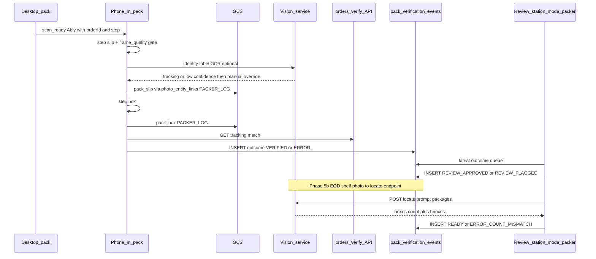

# Packer Review Station — photo bridge, guided capture, verification events, `/review`

**Status:** built in `topic/review` · promoting to main · v3 · WS-REVIEW
**Created:** 2026-07-16 · refined 2026-07-17 · implemented 2026-07-20
**Owner:** packing + unified-engine
**Related:**
- [`.claude/rules/polymorphic-tables.md`](../../.claude/rules/polymorphic-tables.md) — typed-fact table contract
- [`.claude/rules/backend-patterns.md`](../../.claude/rules/backend-patterns.md) — route skeleton, `transition()`, audit, tenant GUC
- [ops-events-station-workflow-unification-plan.md](./ops-events-station-workflow-unification-plan.md) — `recordOpsEvent` waist
- [schema-wide-polymorphic-refactor-plan.md](./schema-wide-polymorphic-refactor-plan.md) — append-only fact family
- Skills: `db-migration-author` (Phase 3 migration), `new-route` (Phase 3 APIs), `sidebar-mode` (Phase 4)

> **What this is.** Close the packer photo bridge, add guided slip/box capture on `/m/pack` (GCS +
> `photo_entity_links`), and ship an all-in-one **Review** station at `/review` (packer the only mode at
> birth) backed by a new append-only `pack_verification_events` typed-fact table — **zero `ALTER`** on
> `packer_logs` or `orders`. EOD shelf counting lands as an open-vocab detector inside the existing
> `vision/` service.

## Phase status

| Phase | Slice | Status |
|---|---|---|
| 1 | Retire `UNIT_SCAN_PHOTOS` flag, `packerLogId` dual-link, `PackerPhotoRequestStatus`, deep-link `orderId`+`step` | **done** |
| 2 | `pack_slip`/`pack_box` types, guided studio, frame-quality gate + vision OCR w/ manual override, wire `GET /api/orders/verify`, feed row (2e) | **done** |
| 3 | CREATE `pack_verification_events` (polymorphic contract), domain helper, submit/decide/queue APIs, `packing.review` permission | **done (apply migration to go live)** |
| 4 | `/review` all-in-one station with `?mode=packer` (sole mode at birth), latest-outcome queue, Approve/Flag | **done** |
| 5a | EOD shelf columns on the event table (ships with Phase 3; no UI) | **done** |
| 5b | Open-vocab box counting in `vision/` (`/locate`), bbox overlay, `READY`/`ERROR_COUNT_MISMATCH` | deferred |
| 6 | Unit tests for append-only outcomes + `npm run verify` + UAT | **tests done · UAT after migrate** |

---

## Locked decisions (from deep scan)

- **No ALTER on existing tables** — not `packer_logs`, not `orders`, not expanding `photo_entity_links.entity_type` CHECK. New work is **CREATE-only** typed-fact table(s).
- **Evidence photos** stay on GCS via [`/api/photos/upload`](../../src/app/api/photos/upload/route.ts); linked with existing `entity_type='PACKER_LOG'` already allowed in [`PHOTO_ENTITY_TYPES`](../../src/lib/photos/types.ts). Distinguish slip vs box via `photos.photo_type` constants (no schema change).
- **Verification / review state** lives in new append-only `pack_verification_events` — same family as [`entity_signals`](../../src/lib/migrations/2026-07-03l_entity_signals.sql) / [`order_unit_amendments`](../../src/lib/migrations/2026-06-27e_order_unit_amendments.sql). Do **not** overload `tech_verifications` (that is packer checklist ticks via [`packing-checks`](../../src/lib/packing/packing-checks.ts)).
- **Review is one all-in-one station** at `/review` with a **mode axis = which station's work you are reviewing**. `?mode=packer` is the sole mode at birth; tech / receiving / shipping review are later modes on the *same* page. **Not** a `/pack-review` page, **not** a Home mode.
- **No new rollout flag.** `UNIT_SCAN_PHOTOS` is **retired entirely** in Phase 1 (see §1a) — the unit-photo bridge ships on. Do not add `NEXT_PUBLIC_UNIT_SCAN_PHOTOS` to `.env.example` (it was never there).
- **AI inference lives in the existing `vision/` FastAPI service** ([`vision/app/server.py`](../../vision/app/server.py)) — slip OCR today, open-vocab box counting later. Never a standalone `locate_anything.py` app, never `tesseract.js`.
- **Industry pieces in scope:** two-step slip→box, ERP tracking cross-check (`GET /api/orders/verify` — **zero in-repo consumers today**), blur gate ([`frame-quality.ts`](../../src/lib/vision/frame-quality.ts)), manual OCR override, EOD columns on the event table (UI later).

---

## Sketch → house translation

The originating sketch ("Photo Station & Box Verification") assumed a different stack. Every idea in it survives; the **mechanism** is remapped onto what this codebase already owns. This table *is* the spec — read it before implementing any phase.

| Sketch says | House equivalent | Why |
|---|---|---|
| `ALTER TABLE orders ADD verify_status VARCHAR(50)` | `pack_verification_events.outcome` (append-only, latest-wins) | No ALTER on `orders`; review is a fact stream, not a parent column |
| `ALTER TABLE orders ADD packing_metadata JSONB` (Synology photo links) | `photo_entity_links` (`PACKER_LOG`) + `photos.photo_type` | Photo linkage already has a polymorphic hub; storing paths on a parent duplicates it |
| ENUM `UNVERIFIED / VERIFIED / READY / ERROR_MISSING_TRACKING / ERROR_COUNT_MISMATCH` | Same five, **plus** `REVIEW_APPROVED` / `REVIEW_FLAGGED` / `ERROR_OCR_FAILED` | House machine inserts a manager review step between VERIFIED and READY; the sketch's set is a subset |
| `[NEW] PhotoStation.tsx` under the barcode scanner | Extend [`MobilePackerPhotoStudio`](../../src/components/mobile/photos/MobilePackerPhotoStudio.tsx) | A second capture surface forks a solved one; the studio already owns camera + queue + GCS |
| `navigator.mediaDevices.getUserMedia` webcam stream | Already inside the studio / [`useBarcodeScanner`](../../src/components/mobile/redesign/ScanInput.tsx) | Same API, already wired with camera-suspend arbitration |
| Client-side OCR via `tesseract.js` | LAN EasyOCR: `gateFrame` → `POST {VISION_BASE}/identify-label` | Explicitly forbidden; the LAN box is the OCR SoT and is far more accurate on thermal labels |
| Upload to Synology NAS proxy `/api/nas/[[...path]]` | GCS via [`/api/photos/upload`](../../src/app/api/photos/upload/route.ts) | Hard requirement — packer evidence is GCS-only |
| Order-match check against ERP | [`GET /api/orders/verify?tracking=`](../../src/app/api/orders/verify/route.ts) | The route already exists with zero consumers; wire it rather than write a second one |
| `[NEW] EndOfDayVerification.tsx` | EOD panel inside `?mode=packer` on `/review` (Phase 5b) | Mode axis is *station scope*; EOD is a day-level action within packer review, not a top mode |
| `[NEW] locate_anything.py` (standalone) | `vision/app/locate_anything.py` module + `POST /locate` on the existing server | The service exists; [`detector.py`](../../vision/app/detector.py) already anticipates an open-vocab swap |
| NVIDIA NIM `LocateAnything-3B`, prompt `"packages"` | Same model, same prompt — reached through the vision service, not from Next | Keeps the model swappable and the token server-side |
| Manual box-count override when the API fails | Kept verbatim — same fallback | Correct instinct; matches the OCR override precedent |
| Compare shelf count to *today's VERIFIED count* | Compare to today's **`REVIEW_APPROVED`** count | The sketch had no review step; here READY only follows manager approval |

---

## Codebase anchors (what we extend)

| Concern | Existing SoT | Gap |
|---------|--------------|-----|
| Desktop pack → phone camera | [`publishPackerScanReady`](../../src/lib/realtime/publish.ts) → [`PackerScanReadyCamera`](../../src/components/mobile/packer/PackerScanReadyCamera.tsx) | Missing `orderId` + `step` query params |
| Unit QR → phone | [`useUnitPhotoRequestPublisher`](../../src/components/sidebar/receiving/useUnitPhotoRequestPublisher.ts) + `UNIT_SCAN_PHOTOS` ([`flags.ts`](../../src/lib/station/flags.ts)) | Pack path hardcodes `packerLogId: null` in [`StationPacking.tsx`](../../src/components/station/StationPacking.tsx) ~197; flag itself is retired in §1a |
| Pack photos on `/m/pack` | [`MobilePackingList`](../../src/components/mobile/packer/MobilePackingList.tsx) → [`/m/p/{id}/photos`](../../src/app/m/(immersive)/p/[id]/photos/page.tsx) → GCS | Spam camera only; no slip/box steps |
| Live OCR + quality gate | [`useLiveLabelScan`](../../src/components/receiving/label-identify/useLiveLabelScan.ts) → `gateFrame` → vision `/identify-label` | Not wired for packing slip |
| Vision service | [`vision/app/server.py`](../../vision/app/server.py) (`/identify`, `/identify-label`, `/analyze`, `/enroll`), reached via `NEXT_PUBLIC_VISION_BASE_URL` ([`vision-config`](../../src/app/api/vision-config/route.ts), [`vision-identify.ts`](../../src/lib/vision-identify.ts)) | No `/locate` endpoint; no open-vocab detector |
| Open-vocab detector swap | [`vision/app/detector.py`](../../vision/app/detector.py) — *"intentionally model-agnostic so a fine-tuned/open-vocab detector can be swapped in later"* | The swap has never been taken; LocateAnything-3B is it |
| Tracking ERP check | [`GET /api/orders/verify`](../../src/app/api/orders/verify/route.ts) | Orphan route — wire as SoT |
| Manager review queue analog | [`order_unit_amendments`](../../src/lib/migrations/2026-06-27e_order_unit_amendments.sql) PENDING→APPROVED | No review surface |
| Station + mode registry | [`sidebar-navigation.ts`](../../src/lib/sidebar-navigation.ts) — `SidebarRouteKey`, `APP_SIDEBAR_NAV`, `SIDEBAR_PAGE_NAV` | No `review` route key / nav entry / mode list |
| Polymorphic photo hub | [`photo_entity_links`](../../src/lib/drizzle/schema.ts) | Already supports `PACKER_LOG` |

---

## Target flow



---

## Phase 1 — Close bridge gaps (no schema)

### 1a. Retire the `UNIT_SCAN_PHOTOS` flag entirely

**Change from v2:** v2 planned to *document* `NEXT_PUBLIC_UNIT_SCAN_PHOTOS=1`. Instead the flag is **deleted**. The unit-photo bridge ships unconditionally.

- Delete `UNIT_SCAN_PHOTOS` from [`src/lib/station/flags.ts`](../../src/lib/station/flags.ts) (leave `STATION_VIRTUAL_LIST` / `STATION_PIPELINE_BOARDS` alone).
- Drop the gate at all **5 live consumers**, keeping the guarded branch as the unconditional path:

  | File | Line | Action |
  |---|---|---|
  | [`TestingSidebarPanel.tsx`](../../src/components/sidebar/TestingSidebarPanel.tsx) | 40, 143, 324 | drop import; remove `if (!UNIT_SCAN_PHOTOS) return;`; unwrap the `lastUnitPhotoRequest` render gate |
  | [`UnitDetailWorkspace.tsx`](../../src/components/labels/unit-detail/UnitDetailWorkspace.tsx) | 11, 77 | drop import; render `SerialUnitTimelineSection` unconditionally |
  | [`UnitPhotoRequestCamera.tsx`](../../src/components/mobile/unit/UnitPhotoRequestCamera.tsx) | 8, 72 | drop import; subscription enabled on `!!stationBridgeChannel && staffId > 0` alone |
  | [`StationPacking.tsx`](../../src/components/station/StationPacking.tsx) | 29, 192, 400 | drop import; publish + render unconditionally (see §1b — the same edit threads `packerLogId`) |

- **Do not** add the key to `.env.example` — it was never documented there, and it is going away.
- Sanity: `grep -rn "UNIT_SCAN_PHOTOS" src/` returns nothing; knip stays green (the export is gone, not orphaned).

### 1b. Dual-link `packerLogId`

In [`StationPacking.tsx`](../../src/components/station/StationPacking.tsx): when unit QR fires **after** an ORDERS pack has set `activeOrder.packerLogId`, pass that id into `publishUnitPhotoRequest`. Prepack-only stays `null`.

### 1c. Desktop status chip

Add `PackerPhotoRequestStatus` mirroring [`UnitPhotoRequestStatus`](../../src/components/station/UnitPhotoRequestStatus.tsx) using [`useScopedPackerPhotos`](../../src/hooks/useScopedPackerPhotos.ts) + packer realtime refresh.

### 1d. Deep-link

[`PackerScanReadyCamera`](../../src/components/mobile/packer/PackerScanReadyCamera.tsx):

```
/m/p/{packerLogId}/photos?orderId=…&step=slip
```

---

## Phase 2 — Two-step capture + OCR assist + tracking verify

All captures remain website-only: `/m/pack` → `/m/p/{id}/photos` → return `/m/pack`. GCS only.

### 2a. Photo types (code constants — no DB ALTER)

In [`src/lib/photos/types.ts`](../../src/lib/photos/types.ts):

```ts
export const PACK_SLIP_PHOTO_TYPE = 'pack_slip';
export const PACK_BOX_PHOTO_TYPE = 'pack_box';
```

Upload via existing `PACKER_LOG` link. Optional later: seed `photo_image_types` rows for library folders (INSERT into that table is fine; do not ALTER `photos`).

### 2b. Guided studio

Extend [`MobilePackerPhotoStudio`](../../src/components/mobile/photos/MobilePackerPhotoStudio.tsx) + [`PackerPhotoUploadQueue`](../../src/components/mobile/packer/PackerPhotoUploadQueue.ts) (`photoType` on scope):

1. **Slip** — `pack_slip`; quality gate before optional OCR.
2. **Box** — `pack_box`; then Done.

The sketch's `PhotoStation.tsx` webcam view collapses into these two steps — same `getUserMedia` stream, already owned by the studio, already arbitrated against the page scanner (`cameraSuspended`).

### 2c. Blur / quality gate + OCR (reuse receiving)

Reuse call chain — do not invent Tesseract:

```
gateFrame (frame-quality.ts)
  → useLiveLabelScan pattern
  → vision /identify-label (LAN box, NEXT_PUBLIC_VISION_BASE_URL)
  → manual override field if fail / low confidence
```

Gate-fail operator copy (from the sketch, kept verbatim — it is good floor copy):

> "Ensure lighting is clear, avoid blur, and hold the slip flat."

On OCR fail: capture still allowed; insert event with `ERROR_OCR_FAILED` **or** continue with manual tracking + later `VERIFIED` (operator choice). Manual override is required for floor reliability.

On OCR success: auto-populate the detected order number / tracking into the confirm field — never auto-submit; the operator confirms.

### 2d. Tracking cross-check (wire orphan SoT)

On Done (or after slip if tracking known from desktop payload):

- Call [`GET /api/orders/verify?tracking=`](../../src/app/api/orders/verify/route.ts).
- Map: `found` → prepare `VERIFIED`; not found → `ERROR_MISSING_TRACKING` (prominent warning, allow manager queue).
- Domain helper inserts the event (Phase 3); UI never invents status.

### 2e. Feed completeness

[`MobilePackingRow`](../../src/components/mobile/packer/MobilePackingRow.tsx): show slip/box presence from `photo_type` counts + latest verification outcome from a light hydrate (not columns on `packer_logs`).

---

## Phase 3 — Typed-fact table (CREATE only)

### 3a. Why not ALTER `packer_logs` / `orders`

House rule + user constraint: review/verify is a **fact stream**, not a parent column. Latest outcome is derived:

```sql
DISTINCT ON (organization_id, entity_type, entity_id)
… ORDER BY created_at DESC
```

Same pattern as "unreviewed = no row / latest status" used by amendments and parts-graph. This is the direct replacement for the sketch's `orders.verify_status` + `orders.packing_metadata` columns.

### 3b. DDL (polymorphic contract)

Prefer **CHECK-constrained TEXT** for `outcome` (easier to extend than `CREATE TYPE` / `ALTER TYPE ADD VALUE` — see polymorphic-tables.md). Shape aligns with the user's sketch + house naming:

```sql
-- src/lib/migrations/2026-07-16_pack_verification_events.sql  (date as authored)

CREATE TABLE IF NOT EXISTS pack_verification_events (
  id                     BIGSERIAL PRIMARY KEY,
  organization_id        UUID NOT NULL,  -- no DEFAULT; enforce_tenant_isolation()
  entity_type            TEXT NOT NULL,  -- CHECK: 'PACKER_LOG' only at birth
  entity_id              BIGINT NOT NULL, -- packer_logs.id
  shipment_id            BIGINT,         -- denormalized query assist (soft)
  outcome                TEXT NOT NULL DEFAULT 'UNVERIFIED',
  detected_order_id      TEXT,
  detected_tracking      TEXT,
  ocr_confidence         REAL,
  shelf_box_count        INTEGER,        -- EOD (Phase 5a)
  expected_count         INTEGER,        -- EOD (Phase 5a)
  verified_by_staff_id   INTEGER,
  review_note            TEXT,
  client_event_id        UUID,           -- idempotency
  meta                   JSONB,          -- gate metrics, EOD bbox JSON, detector provenance
  created_at             TIMESTAMPTZ NOT NULL DEFAULT now()
);

-- outcome CHECK includes floor + review + EOD:
-- UNVERIFIED | VERIFIED | REVIEW_APPROVED | REVIEW_FLAGGED | READY |
-- ERROR_MISSING_TRACKING | ERROR_COUNT_MISMATCH | ERROR_OCR_FAILED

-- Indexes lead with organization_id
-- Parent-delete: AFTER DELETE ON packer_logs trigger (TG_ARGV) — do NOT ship neither
-- enforce_tenant_isolation('pack_verification_events')
```

**Do not** add `PACK_VERIFICATION` to `photo_entity_links` CHECK (that would ALTER an existing table). Photos remain `PACKER_LOG` + `photo_type`; events point at the same `packer_logs.id`.

Same PR: Drizzle model in [`schema.ts`](../../src/lib/drizzle/schema.ts).

### 3c. Domain helper + APIs

| Piece | Role |
|-------|------|
| `src/lib/packing/pack-verification.ts` | `recordPackVerificationEvent` — validate packer_log exists, tenant tx, idempotency on `client_event_id`, `recordAudit`, `recordOpsEvent` (prefer over new SAL writers) |
| `POST /api/packing/verification` | Packer submit after photos: body `{ packerLogId, outcome, detectedTracking?, ocrConfidence?, clientEventId }` — permission `packing.complete_order` |
| `POST /api/packing/verification/decide` | Manager: `{ packerLogId, outcome: 'REVIEW_APPROVED' \| 'REVIEW_FLAGGED', note? }` — permission `packing.review` |
| `GET /api/packing/verification/queue` | Latest-outcome queue for the Review station's packer mode |

Outcome rules (409 on illegal):

- Packer may insert `UNVERIFIED` → `VERIFIED` / `ERROR_*` after capture.
- Manager may insert `REVIEW_APPROVED` / `REVIEW_FLAGGED` only when latest is `VERIFIED` or `ERROR_*`.
- EOD (Phase 5b) inserts `READY` / `ERROR_COUNT_MISMATCH` when latest is `REVIEW_APPROVED`.

### 3d. Permission

```ts
{ id: 'packing.review', category: 'packing', label: 'Review packed orders' }
```

in [`permission-registry.ts`](../../src/lib/auth/permission-registry.ts); regenerate route-auth manifest. (The `permission-registry-guard` agent verifies the matching `route-permission-manifest.test.ts` update.)

---

## Phase 4 — Review station (`/review`, `?mode=packer`)

**Change from v2:** v2 shipped a dedicated `/pack-review` station. Instead: **one all-in-one Review station** whose mode axis is *which station's work you are reviewing*. Packer is the only mode at birth; tech / receiving / shipping review become modes on the **same** page rather than three more sibling routes.

### 4a. Why a mode axis, not a page per station

Every station already has a review-shaped backlog (amendments, tech verdicts, receiving exceptions). Minting `/pack-review`, then `/tech-review`, then `/receiving-review` forks the same queue→detail→decide surface three times. One `/review` page + a mode pill is the [`sidebar-mode`](../../.claude/skills/sidebar-mode/SKILL.md) contract, and matches how `receiving` already spans `?mode=`.

### 4b. Nav + route key

- `src/app/review/page.tsx`
- [`sidebar-navigation.ts`](../../src/lib/sidebar-navigation.ts):
  - Add `'review'` to the `SidebarRouteKey` union.
  - `APP_SIDEBAR_NAV` entry, next to Packing:

    ```ts
    { id: 'review', label: 'Review', href: '/review', icon: ClipboardCheck,
      kind: 'station', requires: 'packing.review' }
    ```

  - `SIDEBAR_PAGE_NAV` entry with the mode list — `?mode=` cleared for the default, exactly as Shipping/Packing do:

    ```ts
    {
      id: 'review', label: 'Review', href: REVIEW, icon: ClipboardCheck,
      kind: 'station', requires: 'packing.review',
      modes: [
        { id: 'packer', label: 'Packing', icon: Box,
          to: () => ({ pathname: REVIEW, params: { mode: null } }) },
        // tech / receiving / shipping review land here — same page, new pill
      ],
    }
    ```

- `requires` is a single permission (`requires?: string`), so at birth the nav gates on `packing.review`. **When the second mode lands**, that gate must widen to any-of (`packing.review` OR `tech.review` …) — a nav-item shape change, not a new page. Note it in the entry comment so the next author doesn't fork a route instead.
- Route-key resolution: `/review` → `'review'` so the item stays active across every mode.
- Add `/review` to `MOBILE_RESTRICTED_SIDEBAR_IDS` — review is desktop-only (§4d).

### 4c. Workbench UI (mode = packer)

Region contract is **Workbench** (pick a record → decide → persist), density `ops`.

| Region | Content |
|--------|---------|
| Sidebar | Mode pills (`HorizontalButtonSlider` `variant="nav"` `dense`) via `SidebarShell` `headerAbove`; search band; queue list |
| Left queue tabs | Needs review (`VERIFIED`), Exceptions (`ERROR_*`), Flagged (`REVIEW_FLAGGED`), Approved today (`REVIEW_APPROVED`) |
| Right | Order + tracking chip, live `/api/orders/verify` badge, slip/box GCS strip (via packing-photos / library query), note field |
| Advance | Approve → `REVIEW_APPROVED`; Flag → `REVIEW_FLAGGED` + required note |

Selection is durable + URL-addressable (`?packerLogId=`); the queue list does not animate — only the right pane crossfades (`framerPresence.workbenchPane` via `useMotionPresence`).

Files: `src/app/review/page.tsx`, `src/features/review/ReviewWorkspace.tsx`, `src/features/review/packer/PackerReviewMode.tsx`, `usePackReviewQueue.ts`, `src/components/sidebar/review/ReviewSidebarPanel.tsx`.

Optional: scan tracking in the station bar to jump to that packer_log's latest event.

### 4d. Mobile

Review station is desktop-only in this plan. Packer capture stays `/m/pack`.

---

## Phase 5 — EOD box verification (open-vocab inference)

### 5a. Schema-ready (ships with Phase 3, no UI)

Columns `shelf_box_count` / `expected_count` / `meta` (bboxes) ship in the Phase 3 DDL. Nothing here blocks the Review station.

### 5b. Locate Anything in the existing vision service (deferred, fully specified)

The sketch's `locate_anything.py` standalone app becomes a **module inside the service that already runs on the LAN box**. [`vision/app/detector.py`](../../vision/app/detector.py) states its own intent: *"intentionally model-agnostic so a fine-tuned/open-vocab detector can be swapped in later."* This is that swap.

**Service side** — [`vision/`](../../vision/):

| Piece | Detail |
|---|---|
| `vision/app/locate_anything.py` | NVIDIA NIM client for `LocateAnything-3B`. Input: image bytes + text prompt. Output: `{ boxes: [{x1,y1,x2,y2,score}], count }`. Lazy import like `detector.py` so the dep stays optional. |
| `POST /locate` in [`server.py`](../../vision/app/server.py) | Sits beside `/identify-label`; body `{ image, prompt }`, default prompt `"cardboard boxes"`. Honors the existing `vision_token` auth + `allowed_origins` CORS. |
| [`config.py`](../../vision/app/config.py) | New pydantic settings: `nim_api_key`, `nim_base_url`, `locate_model: str = "nvidia/locate-anything-3b"`, `locate_prompt: str = "cardboard boxes"`. Loaded from `vision/.env`; document in `vision/config.example.txt`. |
| Degradation | NIM unreachable / key unset → `/locate` returns `503 { detector: 'unavailable' }`. It must **never** 500 the review page. |

**App side:**

| Piece | Detail |
|---|---|
| EOD panel | Inside `?mode=packer` on `/review` — a day-level action in the toolbar, not a top mode (mode axis = station scope). Replaces the sketch's `EndOfDayVerification.tsx`. |
| Shelf capture | Manager snaps the packed shelf → GCS. Overlay renders returned bboxes on a canvas above the image. |
| Count reconciliation | `expected_count` = **today's `REVIEW_APPROVED` count** (not raw `VERIFIED` — the sketch predates the review step). `shelf_box_count` = detector count, or the manual override. |
| Outcome | Match → insert `READY` per approved packer_log. Mismatch → `ERROR_COUNT_MISMATCH` with both counts + bboxes in `meta`. |
| Manual override | Always available — required when `/locate` 503s, allowed any time the manager disagrees with the detector. Record `meta.count_source = 'detector' \| 'manual'`. |
| Route | `POST /api/packing/verification/eod` — permission `packing.review`; calls the vision service server-side, then the same `recordPackVerificationEvent` helper. |

**Shelf photo parenting — the one real open question.** `PACKER_LOG` is the wrong parent for a shelf photo (a shelf is not one packer log). Options, in preference order:

1. **First cut, zero ALTER:** store shelf photo ids + bboxes in `pack_verification_events.meta` on the `READY`/`ERROR_COUNT_MISMATCH` rows.
2. **When EOD graduates:** CREATE `pack_eod_sessions` (org + civil date) and add `PACK_EOD_SESSION` to the photo entity types **in that same PR** — one controlled, deliberate CHECK expand on `photo_entity_links`, taken only when EOD actually ships.

Until then, EOD is an API stub comparing a manual count → insert `READY` / `ERROR_COUNT_MISMATCH`.

---

## Phase 6 — Verify + UAT

**Automated**

- `recordPackVerificationEvent`: outcome transitions (legal + 409 on illegal) + `client_event_id` idempotency — DB-free via `Deps` injection (see `domain-unit-test` skill).
- `POST /api/packing/verification/eod`: mocked detector counts → assert correct discrepancy outcome (`READY` vs `ERROR_COUNT_MISMATCH`) and that a 503 from `/locate` still yields a usable manual-override path, never a 500.

**Manual**

- **Flag retirement:** `grep -rn "UNIT_SCAN_PHOTOS" src/` is empty; the unit-photo bridge fires with no env var set.
- **Bridge:** desktop ORDERS scan → phone lands on `?step=slip&orderId=`.
- **Photo Station capture:** take a deliberately blurry slip photo → gate rejects with the lighting/blur copy → enter the order number manually → proceed.
- **Photos:** GCS + `photo_entity_links` `PACKER_LOG` + types `pack_slip` / `pack_box`.
- **Verification status:** inspect the latest `pack_verification_events` row — `outcome = 'VERIFIED'`, tracking populated; confirm **no** new columns appeared on `orders` / `packer_logs`.
- **Review:** Done → `/review?mode=packer` queue → Approve inserts `REVIEW_APPROVED`; Flag without a note is rejected.
- **EOD count (when 5b ships):** upload a shelf photo → bboxes render → count matches → `READY`; force a mismatch → `ERROR_COUNT_MISMATCH`; stop the vision box → manual override still completes.
- `npm run verify` green.

---

## Explicitly out of scope / forbidden

| Forbidden | Why |
|-----------|-----|
| `ALTER TABLE packer_logs` / `orders` (incl. `verify_status`, `packing_metadata`) | User + polymorphic contract; use `pack_verification_events` |
| Expand `photo_entity_links` entity_type in Phase 1–4 | Existing-table migration; defer to the EOD PR if needed |
| A new `NEXT_PUBLIC_UNIT_SCAN_PHOTOS` (or any new rollout flag) for this work | Flag is retired in §1a; ships on |
| Synology / NAS packer writes (`/api/nas/[[...path]]`) | GCS requirement |
| `tesseract.js` / any client-side OCR | Use LAN EasyOCR via the existing identify path |
| Standalone `locate_anything.py` app | Module + `/locate` endpoint inside the existing `vision/` service |
| Reuse `tech_verifications` for manager review | Different job (checklist ticks) |
| `/pack-review` as its own route | Replaced by `/review?mode=packer` |
| Home Review mode | Replaced by the Review station |
| Standalone `PhotoStation.tsx` / `EndOfDayVerification.tsx` | Extend `MobilePackerPhotoStudio`; EOD is a panel in packer review mode |

---

## Key files

| Area | Files |
|------|-------|
| Flag retirement | `flags.ts`, `TestingSidebarPanel.tsx`, `UnitDetailWorkspace.tsx`, `UnitPhotoRequestCamera.tsx`, `StationPacking.tsx` |
| Bridge | `StationPacking.tsx`, `PackerScanReadyCamera.tsx`, new `PackerPhotoRequestStatus` |
| Capture + OCR | `MobilePackerPhotoStudio.tsx`, `PackerPhotoUploadQueue.ts`, `frame-quality.ts`, `useLiveLabelScan.ts`, `orders/verify` |
| Typed fact | New migration, `schema.ts`, `src/lib/packing/pack-verification.ts`, `/api/packing/verification/*` |
| Review station | `src/app/review/page.tsx`, `ReviewWorkspace.tsx`, `PackerReviewMode.tsx`, `sidebar-navigation.ts`, `permission-registry.ts` |
| EOD inference | `vision/app/server.py`, new `vision/app/locate_anything.py`, `vision/app/config.py`, `vision/config.example.txt`, `/api/packing/verification/eod` |

## Compound opportunities

- **Do now:** append-only `pack_verification_events` + guided slip/box + wire `/api/orders/verify` + retire `UNIT_SCAN_PHOTOS`.
- **Promote to DS next (2+ call sites):** shared PhotoRequestStatus chip (unit + packer); shared CaptureStepFlow (slip/box today, receiving label next).
- **Deferred (ask first):** widen the `/review` nav gate to any-of when a second review mode lands; `photo_entity_links` CHECK expand for `PACK_EOD_SESSION`; wire the unused [`MobilePackerFlow`](../../src/components/mobile/packer/MobilePackerFlow.tsx).

---

## Suggested build order (start here)

1. **Register the lane.** New surface → own worktree lane (`../cycleforge-review` on `topic/review`), added to `docs/portfolio/WORKTREE-LANES.md` + `dev-worktrees.json`. Don't build this on `main`.
2. **PR 1 — Phase 1a (flag retirement).** Mechanical, 5 known files, isolated from the schema. Done-check: `grep -rn "UNIT_SCAN_PHOTOS" src/` empty + `npm run verify` green. Clears the decks and de-risks the bridge.
3. **PR 2 — Phase 3 spine.** Migration (via `db-migration-author` skill) + `recordPackVerificationEvent` + DB-free unit tests + permission. This is the contract every other phase writes to; build and test it before the UI so Phases 2/4 call a real helper, not a stub.
4. **PR 3 — Phase 1b–1d + Phase 2** (capture) and **PR 4 — Phase 4** (station) proceed in parallel against the real helper.
5. **Phase 5b (EOD inference)** is deferred — schedule after the station is dogfooded.
