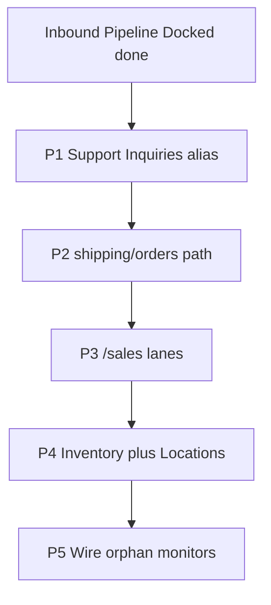

# Page/mode condensation handoff

Copy-paste brief for agents consolidating pointer desks. Template is the **Inbound desk merge** already shipped: one `/incoming` door, `?lane=pipeline|docked`, shared chrome/KPI, redirects from old doors, scan benches left alone.

---

## Template (do not reinvent)

Reference implementation:

- Lane SoT: [`src/lib/receiving/inbound-lane.ts`](../../src/lib/receiving/inbound-lane.ts)
- Chrome/KPI: [`IncomingWorkspaceHeader.tsx`](../../src/components/sidebar/receiving/incoming/IncomingWorkspaceHeader.tsx), [`IncomingKpiStrip.tsx`](../../src/components/sidebar/receiving/incoming/IncomingKpiStrip.tsx)
- Mode resolution: [`src/lib/surface-isolation.ts`](../../src/lib/surface-isolation.ts) (`lane=docked` → `history`)
- Nav leaf: [`src/lib/sidebar-navigation.ts`](../../src/lib/sidebar-navigation.ts) Inbound entry
- Redirects: [`src/proxy.ts`](../../src/proxy.ts)
- Plan/pattern: Inbound desk merge (Pipeline | Docked)

**Rules every merge must follow:**

1. Merge the **door**, keep the **feeds** (distinct API `view=` / row predicates).
2. One home URL; old URLs **308 redirect** (never delete bookmarks).
3. Cross-lane param hygiene (`clearCrossLaneParams` twin per desk).
4. Expand route-param `sort`/search unions so SurfaceParamHygiene does not strip the other lane.
5. **Never** fold scan stations into pointer desks (Arrival / Unbox / Pack / Test / Scan out / Pickup intake / Repair intake).
6. `npm run verify` green; never raise DS/knip baselines.
7. Region contracts stay: Station vs Workbench vs Monitor ([`.claude/rules/contextual-display.md`](../../.claude/rules/contextual-display.md)).

**Do not merge (multi-context):** `/triage`, `/unbox`, `/pickup` (intake), `/repair` (intake), `/test`, `/pack`, `/shipping/scan-out`. Desk may deep-link to them; never subsume.

---

## Priority backlog (value ÷ risk)

### P1 — Support Inquiries → Fulfillment orders alias

| | |
| --- | --- |
| **Today** | Shipping › To ship → `/dashboard`; Support › Inquiries → `/support?mode=orders` |
| **Dup** | Same `ShippedOrder` entity; Support board already composes dashboard grid SoT (`SupportOrdersBoard.tsx`) |
| **Shape** | Canonical desk: `/shipping/orders`. Support Inquiries = nav alias + `?context=support` — not a second mount |
| **Risk** | Permission split (`shipping.view`/`dashboard.view` vs Zendesk + `orders.view`); Support needs ticket affordances |
| **Files** | `sidebar-navigation.ts`, Support orders board, dashboard outbound view, `proxy.ts` |

### P2 — Outbound To ship off `/dashboard` onto Shipping path prefix

| | |
| --- | --- |
| **Today** | Shipping L2: To ship (`/dashboard`), Postage (`/shipping/labels`), FBA (`/shipping/fba`), Packing Review (`/review`) |
| **Dup** | Same fulfillment domain; To ship still on foreign path |
| **Shape** | `/shipping/orders` (+ Pending/Tested/Packed/Shipped tabs). `/dashboard` bare outbound → redirect. Sales stays on `/dashboard?mode=sales` until P3 |
| **Risk** | Bookmarks; `dashboard.view` gate vs `shipping.view` / `orders.view` |
| **Files** | `outbound-sidebar-shared.ts`, `dashboard/page.tsx`, nav Shipping children, e2e dashboard specs |

### P3 — Sales desk: `/sales` with Sales | Pickup History lanes

| | |
| --- | --- |
| **Today** | Sales L1 → `/dashboard?mode=sales` \| `?mode=pickup` |
| **Shape** | `/sales` home; `?lane=sales|pickup`; redirect dashboard sales modes |
| **Risk** | Dual gates (`dashboard.view` vs `walk_in.view`) — mirror Inbound |

### P4 — Inventory + Locations → one Manage Inventory desk

**Done 2026-08-03.** Locations L1 removed; Inventory L2 gains **Locations** at
`/inventory/locations` (Bin Tags · Racks · Rooms · Bins · Map nested tabs).
Legacy `/warehouse` permanently redirects. Bins table uses Receiving Sheets flush
(Band 1 tabs · Band 2 KPI · Band 3 triage · `surface="sheet"`).

### P5 — Wire orphan monitors

| Orphan | Fold into |
| --- | --- |
| `/reports` | Operations › Analytics |
| `/photos` (NAS) | Media `/ops/photos?source=nas` |
| `/tracking-exceptions` (if still orphan) | Support or Shipping exceptions lane |

### P6 — History / audit scope lanes (partial)

Operations History as cross-domain Monitor with `?scope=`; keep Admin audit separate.

### P7 — Optional polish only

Print wayfinder aliases; Home Plan mode; Admin inventory nav alias.

---

## Explicit KEEP-BOTH

| Pair | Why |
| --- | --- |
| Studio Catalog vs Products Reference | Canvas vs Workbench |
| Review Pairing vs Products pairing grid | Different row types |
| Testing `?view=shipping` vs Fulfillment Shipping | Station-scoped pane vs outbound desk |
| `/o/[orderId]` vs desk `?openOrderId=` | Deep-link resolver vs selection |
| FOH Pickup/Repair intake vs Sales history | Station vs desk |
| Three Labels kinds | Different label jobs |

---

## Already done (do not re-do)

- Incoming + Receiving Board → `/incoming` Pipeline|Docked
- FBA prep → `/shipping/fba?fbaMode=`
- Review L1 split (Packing Review → Fulfillment; Pairing/Listing → Catalog nav)
- Dashboard L1 dissolved (domain aliases)

---

## Sequencing

## Source docs

- [`page-consolidation-station-first-GEMINI-RESEARCH-BRIEFING.md`](./page-consolidation-station-first-GEMINI-RESEARCH-BRIEFING.md) §4
- [`desk-domain-spine-split-CLAUDE-CODE-PROMPT.md`](./desk-domain-spine-split-CLAUDE-CODE-PROMPT.md)
- [`foh-boh-surface-split-plan.md`](./foh-boh-surface-split-plan.md)
- [`desk-contract-unification-CLAUDE-CODE-PROMPT.md`](./desk-contract-unification-CLAUDE-CODE-PROMPT.md)
