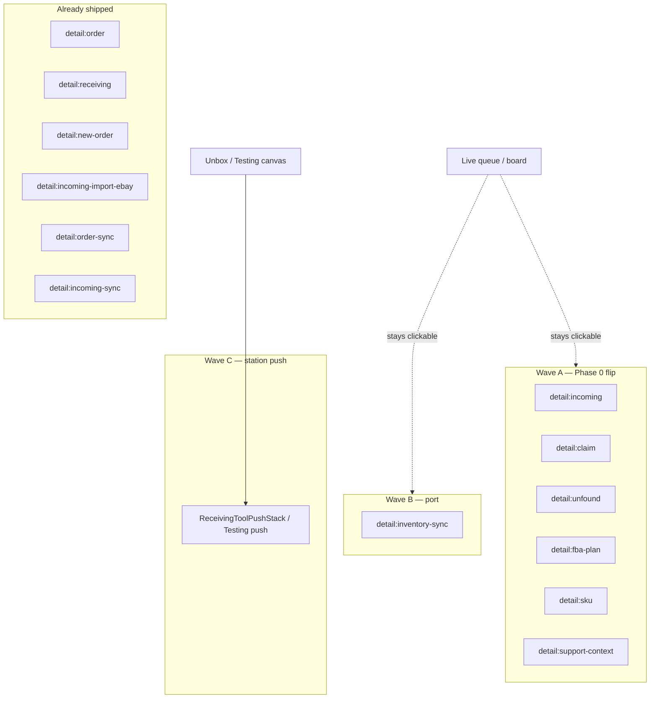

# Handoff — Queue / workbench inspectors → non-modal right rail (wave after Import / Add Order)

**For:** implementing agent (Cursor / Claude Code)
**From:** Cycle Forge engineering
**Date:** 2026-07-31
**Status:** ready to execute — pattern locked; Import / Add Order wave shipped
**Sibling just shipped:** `docs/todo/import-add-order-right-rail-HANDOFF.md` (done) — `detail:new-order`, `detail:incoming-import-ebay`, `detail:order-sync`, `detail:incoming-sync` all `modal={false}` on `RightRailHost`
**Related open plan:** `docs/todo/order-rail-selection-plane-PLAN.md` (Phases 1–5) — assumes the same non-modal metric for `detail:order` / compare / batch; **do not fork a second modality story**

---

## 0. One-sentence goal

Finish migrating every **ops queue / workbench record inspector and import-adjacent progress surface** onto the **same non-modal right-rail metric** already proven for order details, receiving details, Add Order, and Order Sync — so pick-a-row / watch-import flows never bury the live grid behind a scrim, while destructive wizards and settings stays modal by design.

---

## 1. Product ask (operator language)

Today many “look at this row / watch this sync” surfaces either:

1. already sit on `RightRailHost` but still behave like a **blocking modal** (scrim + scroll lock + `role="dialog"`), or
2. open as a **centered `RightPaneOverlay` / DS `Dialog`** over a live LedgerGrid / station queue, or
3. (Testing / Unbox leftovers) still use **centered modal wrappers** even though Unbox already has chrome-free `*Panel` bodies + `ReceivingToolPushStack`.

Desired: one family — **right-edge secondary**, queue stays clickable, resize free, named `role="region"`. Station-scoped tools that squeeze Unbox stay on **tool push**, not the global rail.

---

## 2. Pattern metric (locked — do not re-litigate)

Read first:

| Law | Path |
|---|---|
| Right-rail modality | `.claude/rules/source-of-truth.md` § Right-rail modality |
| Navigators push, inspectors float | `AGENTS.md` hard laws |
| Golden non-modal inspector | `ShippedDetailsPanel` (`detail:order`, `modal={false}`) |
| Golden receiving float | `ReceivingDetailsStack` (`detail:receiving`, `modal={false}`, `elevated`, `closeOnOutsideClick`) |
| Golden intake / sync | `NewOrderEntryOverlay`, `OrderSyncDialog` (Import / Add Order handoff — done) |
| Unbox station exception | `ReceivingToolPushStack` / `ReceivingClaimStack` / `ReceivingTicketStack` |
| Motion / stable ids | `.claude/rules/display/motion-crossfade.md` — queue-processing exception |
| E2E bar | `tests/e2e/dashboard-inspector-non-modal.spec.ts`, `tests/e2e/import-add-order-non-modal.spec.ts` |

### Decision rule for THIS initiative

| Surface family | Target shell | Why |
|---|---|---|
| **Record inspectors** over a live queue/board | `DetailStackRailRegistrar` → `RightRailHost` **`modal={false}`** + `ariaLabel` | Same metric as `detail:order`. Prefer **stable occupant ids** (not per-record) when row↔row is the core loop. |
| **Import / sync / fulfillment progress** over ops chrome | Port off centered Dialog / `RightPaneOverlay` → same non-modal rail occupant | Same family as `detail:order-sync` / `detail:incoming-sync`. |
| **Unbox / Testing station tools** with existing `*Panel` bodies | Prefer **`ReceivingToolPushStack`** (or Testing equivalent push) — **not** RightRailHost | Keeps `detail:receiving` free; station region contract. |
| **Batch confirm pickers** (flag / ship-by) | **Defer to** `order-rail-selection-plane-PLAN.md` (inline rail forms) **or** leave modal if that plan absorbs them | Do not double-migrate: selection-plane D1 rehomes Flag / Ship-by into the rail. |
| **Destructive / auth / settings / fullscreen media** | Keep modal Dialog / lightbox | Wrong contract for non-modal float. |
| **Trigger chrome** (Import popovers, menus) | Keep as popovers | Triggers are not record planes. |

**Hard rule:** never hand-roll `fixed right-0 z-panel w-[420px]`. One owner: `RightRailHost` + `src/lib/right-rail/store.ts`. Exception already illegal: `ZohoSplitPane` private fixed pane (optional cleanup lane below).

---

## 3. Inventory (measured)

### 3a — Phase 0: already on `DetailStackRailRegistrar`, still modal default

Smallest win: add `modal={false}` + named `ariaLabel`. Optionally stabilize occupant ids (see §3a notes).

| Surface | File | Registrar id today | Opened from | Target |
|---|---|---|---|---|
| **Incoming PO / shipment details** | `src/components/sidebar/receiving/IncomingDetailsPanel.tsx` (+ `incomingDetailsRailId` in `IncomingDetailsHeader.tsx`) | `detail:incoming:…` **per record** | Incoming grid row select (`ReceivingRightPane`, `useReceivingDetailOverlays`) | `modal={false}` + ariaLabel; **prefer stable** `detail:incoming` (swap node on row change — mirror `detail:order`) |
| **Repair claim details** | `src/components/repair/RepairDetailsPanel.tsx` | `detail:claim:${repair.id}` **per record** | `RepairTable`, `TechDashboardOverlays`, `GlobalDetailStackHost` | `modal={false}` + ariaLabel; prefer stable `detail:claim` (or `detail:repair`) |
| **Unfound queue details** | `src/components/receiving/unfound/UnfoundQueueDetailsPanel.tsx` | `detail:claim:${row.source_id}` **per record** (collides naming with Repair) | `UnfoundQueueTable` | `modal={false}` + ariaLabel; prefer stable `detail:unfound` (**rename away from `detail:claim:`**) |
| **FBA board detail** | `src/components/fba/FbaBoardDetailPanel.tsx` | `detail:plan:${fnsku}` **per FNSKU** | `FbaOutboundWorkspace`, `GlobalDetailStackHost` | `modal={false}` + ariaLabel; prefer stable `detail:fba-plan` if board arrowing is common |
| **SKU detail (panel variant)** | `src/components/sku/SkuDetailView.tsx` | `detail:sku:${sku}` when `variant` is panel | Inventory / search rail hosts | `modal={false}` + ariaLabel when `isPanel`; **page variant unchanged** |
| **Support context detail** | `src/components/support/context/SupportContextDetailPanel.tsx` | `detail:support-context:${ticketId}` | `SupportTicketDetail` header | `modal={false}` + ariaLabel; fix stale comment (“Close via backdrop”); prefer stable `detail:support-context` if ticket↔ticket swap is hot |
| **Global detail loading shell** | `src/components/detail-stacks/GlobalDetailStackHost.tsx` → `DetailStackLoadingShell` | `detail:global:${stackId}` | Assistant / open-store | Loading shell must also be `modal={false}` so the flash isn’t a modal; child panels own final modality |
| **Testing Box workbench** | `TestingSidebarPanel.tsx` → `BoxWorkbenchPanel` | `box:${id}` | Testing sidebar scan | `modal={false}` + ariaLabel **or** Wave C tool-push (see §3c) |
| **Testing Manifest workbench** | `TestingSidebarPanel.tsx` → `ManifestWorkbenchPanel` | `manifest:${ref}` | Testing sidebar | same as Box |

**Bodies (keep):** do not redesign tab structures / PaneHeaders — modality + id stability only in Phase 0.

**Stable-id migration notes (required for queue-feel parity with `detail:order`):**

1. Host keys `AnimatePresence` on occupant `id`. Per-record ids force exit→empty→enter on every row step.
2. Pattern: register once with stable id; keep content fresh via existing `updateRightRailPanelNode` path (already how `useRegisterRightPanel` works).
3. Re-seed editable state on record change inside the panel hook (same discipline as `useShippedDetailState`).
4. Unfound **must not** keep sharing the `detail:claim:` prefix with Repair — exclusivity / reopen bugs waiting to happen.

### 3b — Phase 1: centered Dialog / overlay → non-modal RightRailHost

| Surface | File | Shell today | Callers | Target |
|---|---|---|---|---|
| **Inventory fulfillment sync** | `src/components/shipped/InventoryFulfillmentSyncDialog.tsx` | DS `Dialog` (centered) | `ShippedActionsButton` | Extract / register `detail:inventory-sync` `modal={false}` `ariaLabel="Inventory fulfillment progress"` — **literal twin of OrderSyncDialog port** |
| **Incoming attach tracking** (if it blocks the Incoming grid) | `src/components/sidebar/receiving/IncomingAttachTrackingPopover.tsx` | DS `Dialog` | Incoming details / attach flows | Prefer non-modal rail **only if** product wants grid live during attach; else leave Dialog (short confirm). **Ask before porting.** |

**Do not Phase-1 port in this wave (owned elsewhere or wrong contract):**

| Surface | Why |
|---|---|
| `BulkFlagDialog` / `BulkShipByDialog` | `order-rail-selection-plane-PLAN.md` D1 rehomes Flag / Ship-by as **inline rail forms**. Ship-by docblock already argues deliberate blocking modal. Coordinate with that plan — do not invent a third shell. |
| `ShippingInfoEditModal`, `WarrantyLogClaimDialog`, admin CRUD Dialogs | Settings / destructive / blocking wizards |
| `PhotoUploadOverlay`, `PhotoViewerPortal`, `MediaLibraryPickerModal` | Fullscreen / media job |
| `DocumentSlideOver` | Own SoT |
| `SupportCreateTicketModal`, `ZendeskClaimModal`, `StnTicketLinkModal`, `TicketStnLinkPopover` | Claim / create wizards — modal OK unless Unbox push already owns the job |
| `AssignmentOverlayCard`, `StepUpModal`, connect sheets | Auth / assignment blocking |

### 3c — Wave C: Testing / Unbox leftover centered overlays (station exception)

Unbox already ships chrome-free panels + `ReceivingToolPushStack`. **Testing** (and a few shared hosts) still mount the thin `*Modal` / `RightPaneOverlay` wrappers:

| Surface | Modal wrapper | Panel body (keep) | Primary leftover hosts |
|---|---|---|---|
| Audit log | `ReceivingAuditModal.tsx` | `ReceivingAuditPanel.tsx` | `TestingPanelModals.tsx`, `LineEditModals.tsx`, `CartonInspectionPage.tsx` |
| Send photo note | `SendPhotoNoteModal.tsx` | `SendPhotoNotePanel.tsx` | Testing, claim lock-ticket, LineEditModals |
| Move photos between PO | `MovePhotosBetweenPoModal.tsx` | `MovePhotosBetweenPoPanel.tsx` | Testing, PhotoGallery, PhotoPeekFan |
| Claim wizard | `ReceivingClaimModal.tsx` | `ReceivingClaimPanel.tsx` | `TestingPanelModals`, `ReceivingDashboardOverlays`, `TriageUnfoundList`, `TechDashboardOverlays` — **Unbox uses `ReceivingClaimStack` push** |
| Label edit | `LabelEditPopover.tsx` (misnamed — is `RightPaneOverlay`) | (in-file body) | TestingPanel, UnboxLabelPreview |
| Product / As-listed label edit | `ProductLabelEditPopover.tsx`, `AsListedEditPopover.tsx` | in-file | Labels / barcode workspaces |
| Catalog manager | `CatalogManagerPopover.tsx` | `CatalogManagerList` | Label edit pencil |
| Unit slots manage | `UnitSlotsManageOverlay.tsx` | in-file | `ReceivingUnitRows` |
| Prebox wizard | `PreboxWizard.tsx` | in-file | `CartonUnitsRollup` |

**Target for Wave C:**

- **Station hosts (Testing / Unbox / Triage):** mount panels via **tool push** (extend `ReceivingToolPushStack` or a Testing push sibling) — same as Unbox Audit / Move / Send Photo.
- **Non-station hosts** (carton read page, Photo library): either keep a thin modal wrapper **or** register on RightRailHost `modal={false}` if the host is a workbench with a live list underneath.
- Do **not** put Unbox Claim on RightRailHost while `ReceivingClaimStack` exists — exclusivity with `detail:receiving` / Ticket is already law.

### 3d — Optional cleanup (not required for modality family)

| Surface | File | Issue | Suggested fix |
|---|---|---|---|
| **Zoho split pane** | `src/components/receiving/workspace/ZohoSplitPane.tsx` | Private `fixed right-0` pane — violates “one owner” | Port to `RightRailHost` non-modal (`detail:zoho-po`) **or** open external tab only (Zoho blocks iframe anyway) |
| **Studio block palette / config** | `BlockPaletteOverlay`, `BlockConfigSheet` | `RightPaneOverlay align="right"` | Studio editor chrome — out of ops-queue family; leave unless Studio asks |

### 3e — Explicit non-goals

- Flipping `RightRailHost` **default** modality house-wide (still `modal` defaults `true`)
- Layout **push/squeeze** of dense LedgerGrids (declined — receiving-details Model B)
- Rewriting panel bodies / tab IA
- Settings CSV import, admin Dialogs, auth step-up
- Implementing `order-rail-selection-plane` Phases 1–5 inside this handoff (coordinate only)
- Deleting `ContextualSelectionBar` globally (selection-plane D2)

---

## 4. Pattern metric checklist (copy into PR / verify)

Every migrated surface must satisfy **all** of these:

1. **Shell:** `DetailStackRailRegistrar` / `useRegisterRightPanel` — geometry owned by `RightRailHost` only (or Unbox `ReceivingToolPushStack` for Wave C station tools).
2. **`modal={false}`** — no scrim, no `backdrop-blur`, no body scroll lock (rail path).
3. **`role="region"` + `ariaLabel`** — not `role="dialog" aria-modal`.
4. **Resizable** — free once non-modal (`DETAIL_STACK_RESIZE`).
5. **Queue / board stays live** — sibling rows clickable; leave `closeOnOutsideClick` **off** unless product wants receiving-details click-off (`closeOnOutsideClick` + elevated).
6. **One right-edge secondary** — store priority / seq exclusivity; opening an inspector suspends intake/sync and vice versa.
7. **Stable ids for queue arrowing** — prefer `detail:incoming`, `detail:claim`, `detail:unfound`, … not per-entity ids when row↔row is the loop.
8. **Escape** — host closes unless inner overlay owns Escape (`useAnyOverlayOpen`).
9. **No private fixed panels.**
10. **Never raise DS ratchet baselines.**

---

## 5. Suggested execution phases

### Phase A0 — Incoming details modality + stable id (highest leverage)

**Files:** `IncomingDetailsPanel.tsx`, `IncomingDetailsHeader.tsx` (`incomingDetailsRailId`), any tests asserting the old id.

```tsx
<DetailStackRailRegistrar
  id="detail:incoming" // stable
  onClose={onClose}
  modal={false}
  ariaLabel={/* PO / shipment display name */}
>
  {/* body unchanged */}
</DetailStackRailRegistrar>
```

**Verify:** Incoming grid row click → region, no backdrop, second row hit-testable; `j`/`k` or click swaps content without unmounting the aside (mirror dashboard inspector E2E).

### Phase A1 — Repair + Unfound + FBA + SKU panel + Support context

Same Phase 0 recipe on:

- `RepairDetailsPanel` → `detail:claim` (stable) + ariaLabel
- `UnfoundQueueDetailsPanel` → **`detail:unfound`** (stable; leave `detail:claim` namespace)
- `FbaBoardDetailPanel` → `detail:fba-plan` (stable if board nav is hot) + ariaLabel
- `SkuDetailView` panel wrap → `modal={false}` + ariaLabel (keep page variant)
- `SupportContextDetailPanel` → `modal={false}` + ariaLabel; update “backdrop” comment
- `GlobalDetailStackHost` loading shell → `modal={false}`

### Phase B — Inventory fulfillment sync port

Mirror OrderSyncDialog:

1. Keep body; wrap with `DetailStackRailRegistrar` `id="detail:inventory-sync"` `modal={false}` `ariaLabel="Inventory fulfillment progress"`.
2. `if (!open) return null`; block dismiss while running.
3. Update `ShippedActionsButton` comments; remove centered Dialog chrome.
4. E2E: hang sync route → assert region + no backdrop (pattern from `import-add-order-non-modal.spec.ts`).

### Phase C — Testing / Unbox leftover overlays

1. Inventory which Testing hosts still call `*Modal` vs Unbox push (`TestingPanelModals.tsx` is the waist).
2. For each: prefer mounting existing `*Panel` in tool push; delete modal wrapper only when zero callers remain.
3. Label / Prebox / UnitSlots: decide push vs non-modal rail per host region contract (station vs labels workbench).
4. Do not migrate Claim onto RightRailHost on Unbox.

### Phase D — Docs + verify

1. Extend `.claude/rules/source-of-truth.md` Right-rail modality list with new stable ids (`detail:incoming`, `detail:claim`, `detail:unfound`, `detail:fba-plan`, `detail:inventory-sync`, …).
2. E2E: Incoming non-modal + at least one of Repair/Unfound; inventory-sync non-modal.
3. `npm run verify` green.
4. Update this handoff Status log when phases complete.

---

## 6. Architecture sketch



**Not this:** squeezing the dashboard LedgerGrid; putting Testing Claim on RightRailHost while Unbox Claim is push.

---

## 7. Key files

| Role | Path |
|---|---|
| Incoming details | `src/components/sidebar/receiving/IncomingDetailsPanel.tsx` |
| Incoming rail id helper | `…/incoming-details/IncomingDetailsHeader.tsx` (`incomingDetailsRailId`) |
| Repair details | `src/components/repair/RepairDetailsPanel.tsx` |
| Unfound details | `src/components/receiving/unfound/UnfoundQueueDetailsPanel.tsx` |
| FBA board detail | `src/components/fba/FbaBoardDetailPanel.tsx` |
| SKU detail | `src/components/sku/SkuDetailView.tsx` |
| Support context | `src/components/support/context/SupportContextDetailPanel.tsx` |
| Global open-store host | `src/components/detail-stacks/GlobalDetailStackHost.tsx` |
| Inventory sync | `src/components/shipped/InventoryFulfillmentSyncDialog.tsx` |
| Testing modal waist | `src/components/tech/testing-panel/TestingPanelModals.tsx` |
| Testing box/manifest registrars | `src/components/sidebar/TestingSidebarPanel.tsx` |
| Unbox tool push (do copy for Wave C station) | `src/components/receiving/workspace/ReceivingToolPushStack.tsx` |
| Registrar API | `src/components/right-rail/DetailStackRailRegistrar.tsx` |
| Host / store | `RightRailHost.tsx`, `src/lib/right-rail/store.ts` |
| Golden exemplars | `ShippedDetailsPanel.tsx`, `OrderSyncDialog.tsx` |
| Selection-plane coordination | `docs/todo/order-rail-selection-plane-PLAN.md` |
| Prior wave (done) | `docs/todo/import-add-order-right-rail-HANDOFF.md` |
| E2E exemplars | `tests/e2e/dashboard-inspector-non-modal.spec.ts`, `import-add-order-non-modal.spec.ts` |

---

## 8. Acceptance criteria

- [ ] Every Phase A0/A1 inspector: `modal={false}` + named `ariaLabel`; no panel/detail-stack backdrops; body scroll unlocked.
- [ ] Incoming / Repair / Unfound use **stable** occupant ids; Unfound no longer shares `detail:claim:` with Repair.
- [ ] Queue/board remains interactive under open inspectors (hit-test sibling rows).
- [ ] `InventoryFulfillmentSyncDialog` is a non-modal RightRailHost occupant (`detail:inventory-sync`), not a centered Dialog.
- [ ] Wave C: Testing no longer needs centered Audit / Send-photo / Move-photos modals for the primary Testing path (push or non-modal rail); Unbox Claim stays push.
- [ ] SoT Right-rail modality lists the new ids.
- [ ] E2E on **QA org** covers Incoming non-modal (+ preferably Repair or Unfound) and inventory-sync non-modal.
- [ ] `npm run verify` green; never raise DS ratchets.
- [ ] BulkFlag / BulkShipBy **not** independently ported if selection-plane is about to absorb them — leave a Status log note either way.

---

## 9. Prompt the next agent can paste

```
Implement docs/todo/queue-inspector-non-modal-rail-HANDOFF.md.

Pattern is locked — do not re-litigate. Match ShippedDetailsPanel / OrderSyncDialog /
ReceivingDetailsStack: DetailStackRailRegistrar → RightRailHost modal={false} +
ariaLabel. Never hand-roll fixed right panels. Never use ReceivingToolPushStack for
dashboard/Incoming/FBA board inspectors (Unbox-only). Never raise DS ratchet baselines.

Phase A0 first: IncomingDetailsPanel — modal={false} + stable id `detail:incoming`
(stop per-record ids; swap node on row change like detail:order).

Phase A1: same flip on RepairDetailsPanel (stable detail:claim), UnfoundQueueDetailsPanel
(stable detail:unfound — rename off detail:claim:), FbaBoardDetailPanel, SkuDetailView
panel variant, SupportContextDetailPanel, GlobalDetailStackHost loading shell.

Phase B: port InventoryFulfillmentSyncDialog off centered Dialog onto
detail:inventory-sync modal={false} (mirror OrderSyncDialog).

Phase C (separate commit OK): TestingPanelModals leftover *Modal wrappers → tool push
or non-modal rail using existing *Panel bodies; do not put Unbox Claim on RightRailHost.

Coordinate with docs/todo/order-rail-selection-plane-PLAN.md: do NOT independently
migrate BulkFlagDialog / BulkShipByDialog onto the rail — that plan rehomes them.

Update .claude/rules/source-of-truth.md Right-rail modality occupant list.
Verify with npm run verify + E2E patterned on import-add-order-non-modal.spec.ts /
dashboard-inspector-non-modal.spec.ts against the QA org.
Do not edit this handoff except to add Status log lines when phases complete.
```

---

## 10. Status log

| When | Note |
|---|---|
| 2026-07-31 | Handoff filed after Import / Add Order wave shipped. Inventory measured from live registrars + Dialog / RightPaneOverlay call sites. |
| 2026-07-31 | **Phase A0 + A1 done.** `modal={false}` + named `ariaLabel` on Incoming, Repair, Unfound, FBA board, SKU (panel variant only), Support context, the `GlobalDetailStackHost` loading shell, and the Testing Box / Manifest workbenches. Stable ids where row→row is the loop: `detail:incoming`, `detail:claim`, `detail:unfound`, `detail:fba-plan`; `detail:unfound` left the `detail:claim:` namespace. `detail:sku` / `detail:support-context` / `box:` / `manifest:` keep per-entity ids (no prev/next walk). **`closeOnOutsideClick` deliberately left OFF everywhere** — the dismiss layer is `fixed inset-0`, so it would swallow the sibling-row clicks the flip exists to preserve; instead each panel that had only the scrim gained an explicit header close (`PaneHeaderCloseButton` on Incoming / Repair / Unfound, an X on SKU panel + Support context, and Box / Manifest finally wire the `onClose` they were `void`-ing). |
| 2026-07-31 | **Phase B done, but unreachable.** `InventoryFulfillmentSyncDialog` ported off the centered DS `Dialog` onto `detail:inventory-sync` `modal={false}` (footer/header rebuilt as plain elements, body scroller `flex-1`, stats 2-up, table `overflow-x-auto` for the narrower column). ⚠️ Its only trigger `ShippedActionsButton` has **zero mounts** — both files are in `knip-baseline.json` as unused — so nothing in the app can open it and E2E cannot cover it. |
| 2026-07-31 | **Phase C done for the three shared tools, via the wrappers rather than per-host.** `ReceivingAuditModal` / `SendPhotoNoteModal` / `MovePhotosBetweenPoModal` → `*Rail`, now non-modal `RightRailHost` occupants (`detail:receiving-audit`, `detail:photo-note`, `detail:move-photos`). One change covers every leftover host at once (Testing, Triage, carton read, PhotoGallery, PhotoPeekFan, claim lock-ticket) and keeps **one shape per contract**: Unbox → `ReceivingToolPushStack`, everyone else → non-modal rail. A Testing-specific push sibling was rejected as the higher-risk path — it needs a flex-row host wrapper around the guard-enforced `StationPanelRoot`. Unbox Claim stays push; the Testing claim WIZARD stays a blocking modal. **Deferred (not started):** LabelEditPopover / ProductLabelEditPopover / AsListedEditPopover / CatalogManagerPopover / UnitSlotsManageOverlay / PreboxWizard — anchored field editors and wizards, a different contract from the three tool panels. |
| 2026-07-31 | **Phase D.** SoT Right-rail modality list extended (occupant inventory, the `closeOnOutsideClick`-off rule + explicit-close consequence, and the stable-id rule). New `tests/e2e/queue-inspector-non-modal.spec.ts`; `incoming-click-to-open.spec.ts` updated off `role="dialog"`. Repair case **passes** on dogfood. BulkFlag / BulkShipBy **not** touched — left to `order-rail-selection-plane-PLAN.md` D1. |
| 2026-07-31 | ⚠️ **Blocker found, not fixed (out of scope): the Incoming inspector has no live entry point.** `/incoming` is an `isTableOnlyMode` surface, so `useReceivingLineBulkSelection` pins `selectMode` ON (`const selectMode = active`), and `handleSelectRow` therefore always takes the bulk-toggle early return and never calls `dispatchSelectLine`. No event → `useReceivingDetailOverlays` never sets `incomingDetails` → `IncomingDetailsPanel` never mounts. Measured live on dogfood: 28 rows, row click emits zero `receiving-select-line` events, zero asides, zero toasts. The Phase A0 flip is correct and complete; its E2E skips until that wiring is repaired. |
| 2026-08-01 | **Incoming row-click wiring repaired — the Phase A0 surface is live.** The two action planes are now split the way the outbound grid already did them: the row body is `role="button"` and always opens the record; the select gutter is a real `GridRowCheckbox` (own click, `stopPropagation`) that owns bulk membership. `useReceivingRowSelection` gained `rowClickOpens` + a separate `handleToggleRow`/`handleOpenRow`, and `IncomingGridRow` took `isSelected` apart into `isOpen` (record in the inspector) vs `isChecked` (bulk). `ReceivingLinesTable` passes `rowClickOpens: isIncomingMode`. **Verified live:** all four cases in `queue-inspector-non-modal.spec.ts` pass on dogfood — the two Incoming cases that previously skipped now assert the region contract, the row→row stable-occupant contract, and (new case) that the gutter checkbox toggles bulk **without** opening a record. **History still has the mirror defect** (`isTableOnlyMode` pins its `selectMode` too) — same fix, not applied here. |
| 2026-07-31 | `npm run verify`: **Lint / typecheck / unit + DS guards / knip clean for the files in this change** (verified per-file). The tree's red gates are other sessions' concurrent work — `.next/types/validator.ts` (deleted `app/studio` + `app/operations` layouts), `mobile-context-navigation.ts` lint + `getMobileAppTitle` test, route-permission drift, and 10 knip findings in `sidebar-navigation` / `selection-occupancy` / `rail-actions-store` / dogfood surface gate. Three `dashboard-inspector-non-modal.spec.ts` cases also fail on files this change never touched (`useOrdersQueueSelection` / `DashboardOrdersView`). No ratchet baseline was raised. |
