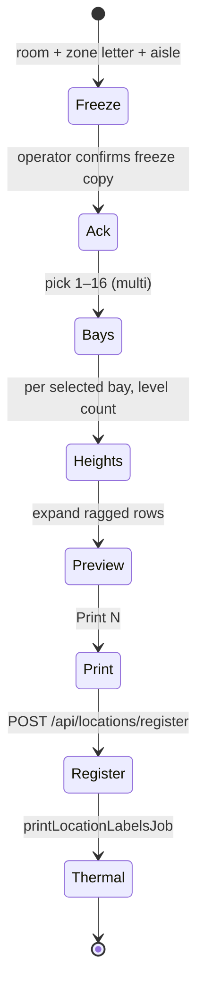

# Research briefing — Bulk bay×level rack (and bin) label print after room + aisle acknowledgement

**For:** Gemini Pro (deep research) — you do **not** have the codebase; every product fact below is embedded. Do not invent file paths or claim to have inspected source.  
**From:** Cycle Forge engineering  
**Date:** 2026-09-10  
**Subject:** How an operator **selects bays 1–16**, then **sets how many levels each selected bay has**, then **prints the whole ragged set in one job** — **only after they have acknowledged room and aisle**.  
**Deliverable:** (a) 2026 WMS / warehouse-labeling pattern language for *ragged rack-face print runs* (not one uniform height); (b) forced D1–D12 rulings reconciled to house SoTs; (c) one state machine for freeze → bay set → per-bay heights → ack → register → thermal; (d) phased P0–P2; (e) ≤40-line Claude Code P0 prompt.  
**Product surface:** Inventory → Locations → **Racks** (primary) and **Labels** (qty bins). Cycle Forge is multi-tenant warehouse/fulfillment SaaS; USAV is dogfood only.

**This brief is NOT** “print one bay at a time,” “Cartesian-product every bay 1–16 at one shared level,” “put the room name back on the sticker,” “invent a second 2×1 face,” “FilterRefinementBar / hunt tiles,” or “fold Unbox Queue/Viewed/History into the DataTable funnel.” Answers that only change `maxBays` in config and leave one-axis `expandPrintRun` **fail**.

---

## 0. How to use this brief

### 0.1 Two questions (keep separate)

1. **What is the 2026 industry standard** for *bulk printing location identifiers* when **rack faces on one aisle are not the same height** (bay 3 is 4 levels, bay 7 is 6)? Named WMS / labeling products, cited docs, dominant UX (matrix, per-column height, copy-down, aisle walk sequence). Not “it depends.”
2. **What is right for *this* stack?** Reconcile the standard against §1–§4. Where industry wants a room name on the sticker or a Cartesian cube of aisle×bay×level×bin, name the conflict and pick Cycle Forge’s side.

Then give: **exact extension of the existing print-run primitives** (file jobs named in §2), not a greenfield printer.

### 0.2 Non-goals / anti-patterns (DO NOT PROPOSE)

- Do **not** reprint room / zone names / “Lv 1” / stray zone letter on the 2×1. Stickers are **coordinate-only**: large code (`C-01-03-4` rack or `C-01-03-4-01` bin) + Data Matrix. **No HRI under the matrix.** Room is a **print-job metadata** field only (`roomName` on `printLocationLabelsJob`) so `/api/locations/register` writes the row into the right room.
- Do **not** invent a second sticker preview. Mount remains `LabelFacePreview` via `locationLabelToFace`.
- Do **not** invent a second thermal pipeline. Confirm still calls `printRackLabelRun` / `printBinLabelRun` → `printLocationLabelsJob`.
- Do **not** lift the house law in `expand-print-run.ts` (“Never Cartesian-product racks × levels × positions”) by exploding **three** axes. The allowed product is **ragged 2-axis**: selected bays × *that bay’s* level range, freeze aisle+zone, position frozen (`0` racks / `1` or operator-frozen bins).
- Do **not** require picking a single bay before “Print range” on Racks (today’s bug relative to this brief). Bins already open the sheet at aisle.
- Do **not** propose FilterRefinementBar, hunt tiles, or DataTable as the label builder.
- Do **not** propose lowering Lighthouse floors or Operator-verdict fiction.
- Do **not** skip `/api/locations/register` before ink. Unregistered QR scans do not resolve.

### 0.3 Operator story (plain)

Standing in **one room**, facing **one aisle**, the operator wants:

1. Confirm: “I am in **Zone 3 - Parts** (zone letter **C**), **Aisle 01**.”
2. Tick **which of 16 bays** get labels (not always 1–16; maybe 1,2,5,8).
3. For each ticked bay, type **how many levels** that column has (bay 1 → 5, bay 2 → 4, …).
4. See a count: “47 labels.”
5. Acknowledge room+aisle again (because the **paper will not say the room name**).
6. Print once. Walk the aisle applying stickers in scan/print order.

---

## 1. Physical + identity model (embedded SoT)

### 1.1 Coordinate (the only thing on paper)

Five segments, zone is a **letter from the room record**, never the room’s display name:

| Segment | Example | Notes |
|---|---|---|
| Zone | `C` | `rooms.zone_letter`. Missing letter blocks print (“Assign a zone letter first”). |
| Aisle | `01` | 1-based, `pad2`. |
| Bay | `01`…`16` | 1-based. Odd = **Left**, even = **Right** (`bayHand`). Floor word is **Bay** (`LOCATION_BAY_LABEL`). |
| Level | `1`…`n` | Unpadded in the dashed code (`C-01-01-1`). |
| Position | `00` rack / `01`+ bin | `position === 0` ⇒ rack sticker (`rackCode` = four-part `C-01-01-1`). Qty bin = five-part. |

GS1 Digital Link on the matrix: `encodePrintMatrix({ kind: 'location', segments, gln, orgSlug })`. GLN is **org** (`useOrgGs1()`), never a per-browser config.

### 1.2 Why acknowledgement exists

After 2026-09-10, **descriptive names are banned on the sticker**. If the operator prints C-aisle-01 labels while standing in aisle 02, the physical labels are silently wrong and will not be saved by a reprint of “Zone 3 - Parts.” **Room + aisle ack is the safety rail the ink no longer provides.**

### 1.3 Typical walk (dogfood)

Aisle with up to **16 bay columns**. Heights **differ by bay** (parts cabinets, pallet beams, mixed). Default picker caps today: `maxBays: 12`, `maxLevels: 5` in `DEFAULT_CONFIG` (bin + rack, localStorage). **12 is a picker default, not a domain max.** Segment clamp in expanders is **1–99**. This feature’s product cap is **16 bays** unless Gemini cites a reason to use the 99 clamp instead.

---

## 2. What already exists (extend; do not replace)

### 2.1 Single-label builders

| Surface | File | Steps | Primary CTA |
|---|---|---|---|
| Racks | `src/components/barcode/RackLabelPrinter.tsx` + `useRackLabelPrinter.ts` | zone/room → aisle → **one** bay → **one** level | Print one rack face (`position: 0`) |
| Labels (bins) | `src/components/barcode/BinLabelPrinter.tsx` + `useBinLabelPrinter.ts` | + position | Print one qty bin |

### 2.2 Print range sheet (one axis only)

`src/components/labels/LabelPrintRunSheet.tsx`

- Freeze breadcrumb: `roomName · zoneLetter · Aisle NN · [Bay · Level · Pos]`.
- **Vary exactly one axis** `from`–`through` (1–99): bay / level / position.
- Checkbox to drop individual expanded rows; grid of `LocationLabelFacePreview`.
- Pinned `Print N labels` → `onConfirm(ExpandedPrintRunRow[])`.
- Parts **preset** (bins only): `expandPartsDrawersPrintRun` → bay 1 levels 1–4 + bay 2 levels 1–48 at **position 1**. Hardcoded `PARTS_DRAWER_BAY_LEVELS`. **This is the only ragged per-bay height expander in the repo.** It is not operator-authored and it is not rack grain.

**Racks gate today (`canOpenRun`):** room + zone letter + **aisle + bay**. Sheet then **forces `vary: 'level'`** and **rejects `vary: 'bay'`** when `rack: true`. So you can print levels 1–5 of **one** bay, not 16 bays with different heights.

**Bins gate today:** room + zone letter + **aisle only**. Vary bay 1–16 **at one shared level** (test: `C-01-01-1-01` … `C-01-16-1-01`). That is **uniform height**, not per-bay height.

### 2.3 Expanders

| Function | File | Behavior |
|---|---|---|
| `expandPrintRun` | `src/lib/locations/expand-print-run.ts` | One axis. Rack ⇒ `vary` must be `'level'` and **bay required**. Header comment forbids full Cartesian. |
| `expandBayLevelSegments` | `src/lib/locations/expand-bay-levels.ts` | **Ragged** `BayLevelRange[]` → qty bins `position` default 1. Types already: `{ bay, letter, levelStart, levelEnd }`. |
| `expandPartsDrawersPrintRun` | same print-run module | Wrapper around the Parts A/B preset. |

**Missing function (P0):** `expandRaggedBayLevelsPrintRun({ zone, aisle, bays: BayLevelRange[], rack: boolean })` that:

- freezes zone+aisle;
- for each spec, emits levels `levelStart…levelEnd` (default start 1);
- if `rack: true`, `position: 0` and `rackCode`;
- if `rack: false`, `position` frozen (default 1) and `locationCode`;
- returns `ExpandedPrintRunRow[]` in **aisle-walk order** (bay ascending, then level ascending) unless Gemini proves a better walk (left side odds then right evens, etc.).

Tripwire already proves 16-bay **uniform** bin expansion (`expand-print-run.test.ts`). Add ragged + rack cases; do not delete the uniform tests.

### 2.4 Print + register

```
onConfirm
  → printRackLabelRun | printBinLabelRun   (`src/lib/print/printLabelRun.ts`)
    → register POST /api/locations/register (room + segments[])
    → printLocationLabelsJob                 (`src/lib/print/printLocationLabel.ts`)
         USB: sequential silent jobs if paired
         else: multi-page 2×1 iframe
    → best-effort POST /api/label-print-jobs
```

`locationLabelToFace` ignores `roomName` on the face (voided) but **callers still pass it** for register + job ledger. Keep that split.

Thermal reality: 16 bays × ~5 levels ≈ **80 unique 2×1 faces**. USB sequential can take minutes; iframe is one dialog. Gemini must rule on progress UX without inventing a second print bus.

### 2.5 Design / eval constraints (implementer)

- UI writes: `ds_contract` / `ds_tokens` / `ds_critique` (or `node tools/design-mcp/ds.mjs`).
- Sheet chrome: existing `BottomSheet` + `Button` + `NumericStep` / dense numeric fields — clone Pack density, no new “wizard app.”
- After shared table/label work: `node "$GARISEK_OS_ROOT/tools/eval-engineering/cursor-eval.mjs" --root . --fast`. This is **not** slot-table display eval unless `CompoundItem` / `useSlotTableLayout` is touched (it must not be).

---

## 3. Gap analysis (why “Print range” cannot do this today)

| Need | Today | Gap |
|---|---|---|
| Select any subset of bays 1–16 | Uniform `from`–`through` on **one** axis; or Parts A+B only | No multi-select bay set |
| Per-bay level count | One `through` for the varied axis; Parts hardcoded 4 and 48 | No operator matrix |
| Racks: many bays | Sheet locked to **one** frozen bay, vary levels | `expandPrintRun` returns `[]` if `rack && vary !== 'level'` |
| Open sheet after aisle (no bay) | Bins: yes. Racks: **no** (`canOpenRun` requires `c.bay`) | Unlock Racks to match bins |
| Ack room + aisle | Micro `freezeTitle` string; Print is one click | No blocking confirm (typed or checkbox) |
| Walk order | Numeric nested loops | Unspecified vs odd/even sides |
| Config `maxBays: 12` | Picker shows 12 tiles | Need 16 (or custom) without implying every aisle has 16 |

---

## 4. Proposed Cycle Forge recipe (Gemini must ratify or replace with cited industry)

This is the **default implementer path**. Research may swap UX chrome, not the SoT functions.

### 4.1 Entry

**Racks (and optionally Labels):** enable **Print range** when `selectedRoom && zoneLetter && aisle != null && !missingLetter` (drop bay requirement on Racks).

Primary CTA stays **Print one** when a full address is picked. Range is secondary.

### 4.2 Sheet phases (one BottomSheet, not a new route)



**Phase Freeze (always visible):** `"{roomName} · Zone {letter} · Aisle {pad2(aisle)}"` — the same strings used in `freezeTitle` today. Zone letter is not the room name.

**Phase Ack (blocking):** cannot expand or print until acknowledged. Gemini must pick **one**:

- **D1** checkbox: “I am standing in this room and aisle.”
- **D2** type-back: aisle number or `C-01`.
- **D3** industry: two-step Print (Review → Print) with freeze repeated on the button: `Print 47 · Aisle 01`.

House bias: **D3 + D1** (button copy carries aisle; checkbox is the ack). Type-back is slower on a warehouse keyboard. Overrule only with citations.

### 4.3 Bay multi-select (1–16)

- Grid of 16 bay chips (or `max(16, config.maxBays)` capped at 16 for this mode unless config is higher).
- Show Left/Right via `formatLocationBayFace` / `bayHand` in the **sheet**, not on the sticker.
- Select-all 1–16, clear, odds, evens (walking one side of the aisle) — Gemini: keep or cut odds/evens.

### 4.4 Per-bay levels

For each selected bay: one numeric **through** (levels 1…N), default `config.maxLevels` (5). Copy-down: “Apply 5 to all selected.” Empty / 0 deselects that bay.

Do **not** add a second “from” unless a warehouse actually skips ground — Cycle Forge codes are 1-based contiguous. Gemini: confirm 1…N vs arbitrary `levelStart`.

Map to existing type:

```ts
{ bay: number; letter: string; levelStart: 1; levelEnd: number }
```

`letter` can be `String.fromCharCode(64 + bay)` for Parts-style A/B **only if** that remains test/log sugar; **it must not appear on the coordinate sticker.**

### 4.5 Preview + exclude

Reuse the existing face grid + per-row checkbox (`excluded`). Count `selected.length`. Cap preview virtualization if N>80 — Gemini: max unique faces per job (thermal + register payload).

### 4.6 Confirm

Same `onConfirm` as today. Racks: map rows → `RackSegments` → `printRun`. Bins: `printBinLabelRun`. Do not print if ack is false.

### 4.7 Domain change (small)

`expandPrintRun` stays for one-axis runs. **Add** ragged expander; optionally `vary: 'ragged-bays'` in the sheet instead of overloading `from`/`through`. Do not teach `expandPrintRun` a 3-axis cube.

---

## 5. Forced rulings (Gemini must answer D1–D12)

| ID | Question | House bias |
|---|---|---|
| D1 | Ack control: checkbox vs type-back vs button-copy only | Checkbox + button copy includes aisle |
| D2 | Racks vs bins: same sheet mode or Racks-only P0 | P0 Racks; P1 Labels using `position: 1` frozen |
| D3 | Bay cap 16 vs config.maxBays vs 99 | Product 16; config raises picker; expander clamp 99 |
| D4 | Walk order: bay then level vs odds then evens | Bay then level |
| D5 | Default level per bay | `config.maxLevels` with copy-down |
| D6 | USB 80-up sequential: block UI + progress vs iframe-only above N | Keep existing USB-if-paired; progress string `Printing 12/47` |
| D7 | Register one POST vs chunk | One POST; if API limits, chunk 50 |
| D8 | Persist last ragged map per room+aisle in localStorage | P1, not P0 (wrong aisle recall is dangerous) |
| D9 | Odds/evens shortcuts | Optional P1 |
| D10 | Parts A1–A4 · B1–B48 preset vs this matrix | Keep preset on **bins**; do not hide ragged mode |
| D11 | Must a bay be selected on the main builder? | No for range; yes for Print one |
| D12 | Put Left/Right on paper again? | **No.** Sheet only. |

---

## 6. Industry research prompts (cite or say evidence is thin)

Search and name products (Manhattan, SAP EWM, NetSuite WMS, Fishbowl, Finale, Sortly, Brother/Zebra location labeling, FastFetch, etc.):

1. Bulk **location label** jobs where **bin/rack height is per column**.
2. Confirmation UX when the **label itself has no warehouse name** (GS1 Digital Link / GRAI / GLN+extension only).
3. Recommended **apply order** for aisle stickers (bottom-up vs top-down; left side then right).
4. Thermal **job size** guidance (unique 2×1 count, USB vs driver spool).
5. Whether WMS treat “rack face” (no bin position) as a first-class print grain — Cycle Forge already does (`position: 0`).

If a cited system always prints the area name on the label, **do not** copy that onto Cycle Forge paper; copy only their **ack / freeze** pattern into the sheet.

---

## 7. Phases

**P0 (ship):** Racks Print range from aisle; ragged bay multi-select 1–16 + per-bay level N; ack; `expandRaggedBayLevelsPrintRun` + tests; existing `printRackLabelRun`; preview grid; no new face.

**P1:** Same mode on Labels (frozen position); copy-down; odds/evens; print progress; optional localStorage **after** ack includes aisle id in the key.

**P2:** Remember per-aisle height maps in **server** location metadata (not browser) if multiple tenants share layouts — only if Gemini shows a WMS table for that. Do not block P0 on a migration.

---

## 8. Claude Code P0 prompt (≤40 lines; paste after Gemini returns D1–D12)

```
Cycle Forge prod lane. Inventory Racks bulk print.

Goal: LabelPrintRunSheet ragged mode for racks.
Unlock canOpenRun in RackLabelPrinter when room+zoneLetter+aisle (no bay).
Add expandRaggedBayLevelsPrintRun in src/lib/locations (BayLevelRange[], rack:true → position 0).
Tests next to expand-print-run.test.ts: C aisle 01, bays 1,2,16 with levels 3,1,2 → codes C-01-01-1..3, C-01-02-1, C-01-16-1..2; empty if no ack conceptually handled in UI.
Sheet: freeze line room · Zone L · Aisle NN; blocking ack (checkbox); 1–16 bay multi-select; per selected bay numeric level through; copy-down; reuse face grid + Print N.
onConfirm still printRackLabelRun / registerRackLocations / printLocationLabelsJob.
Do not paint room name on locationLabelToFace. Do not HRI under matrix. Do not vary three axes in expandPrintRun. Do not FilterRefinementBar. Do not slot-table/funnel. Design-mcp before tsx. cursor-eval --fast when done.
```

---

## 9. What a good Gemini answer looks like

- Named industry patterns with URLs/docs for ragged rack labeling + ack-without-area-name.
- D1–D12 filled, conflicts with house bias explicit.
- State machine matching §4.2 (or a strictly better one that still ends in `printLocationLabelsJob`).
- P0 file list: `LabelPrintRunSheet.tsx`, `RackLabelPrinter.tsx`, `expand-print-run.ts` / `expand-bay-levels.ts`, tests — **no** new print HTML shell.
- Failure modes: wrong aisle after skip-ack; USB timeout at N=80; register 413; selecting 16×99 faces.
- Claude P0 prompt updated with their D-rulings, still ≤40 lines.
