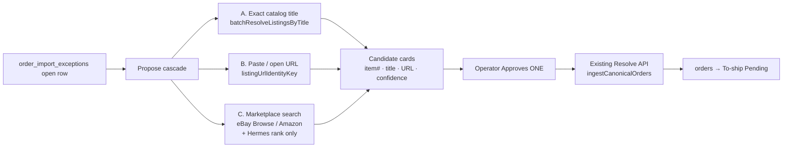

# Review · Missing item number — propose listing → approve → resolve

**Self-contained.** A new session needs only this file. Paste:

> Read `docs/todo/review-listing-propose-approve-PLAN.md` and execute Phase 0.

**Lane:** `main` (WS-DOGFOOD). Stay on it — no branch, no worktree, never `git stash`.  
**Commits:** user manages. Stage only files you touch.  
**Dev server:** already on `:3050` — attach, never start/restart/kill.  
**Verify:** `npm run verify` green before done / before any commit.  
**E2E org:** QA org only (never dogfood assertions), except documented dogfood Sheets shape tests.

**Companions (read, do not re-litigate):**
- [`sheet-import-review-queue-HANDOFF.md`](sheet-import-review-queue-HANDOFF.md) — durable queue + Resolve ingest path (live)
- [`sheet-import-visibility-FINISH-PROMPT.md`](sheet-import-visibility-FINISH-PROMPT.md) §3 — exact-title recovery rules
- [`docs/ai-automation-opportunities-plan.md`](../ai-automation-opportunities-plan.md) **C6** — item_number lookup from title
- [`docs/integrations/realtime-ai.md`](../integrations/realtime-ai.md) — Hermes gateway SoT

---

## 0. The one thing to internalise

**Hermes is the LLM gateway**, the same OpenAI-compatible endpoint already used for Zendesk seller-message drafts (`HERMES_API_URL` → `hermes.michaelgarisek.com/v1`). It is **not** a listing scraper and must **not** invent item numbers.

The product flow is:



**Approve is the only write.** Propose never mutates `orders` or closes an exception. Resolve stays the single commit path already live on `POST /api/review/import-exceptions`.

---

## 1. What already exists (compose, do not fork)

| Piece | Path | Role in this plan |
|---|---|---|
| Missing item number queue | `order_import_exceptions` + `/review?section=missing-item-number` | Surface + durable backlog |
| Resolve commit | `resolveImportException` → splice `raw_row` → `ingestCanonicalOrders` | **Only** way a proposed id becomes an order |
| Resolve UI | `CatalogLinkFormRail` / `ImportExceptionFormBody` | Grow: candidates + Approve; keep manual field |
| Exact title recovery (import-time) | `backfillItemNumbersFromListingTitles` + `batchResolveListingsByTitle` | Reuse as Propose step A (same SoT) |
| URL → item # | `listingUrlIdentityKey` in `src/lib/receiving/listing-links.ts` | Propose step B / paste-URL control |
| Item # → openable link | `getExternalUrlByPlatform` / `getExternalUrlByItemNumber` | “Check listing” link on every candidate |
| Hermes gateway | `hermes-client.ts` / `hermesToolCall` | Rank / explain candidates; never invent ids |
| Seller-message Hermes | `receiving-claim-seller-assist.ts` | **Pattern only** (gateway + approve posture). Do **not** call assist-seller — it **strips URLs** for marketplace TOS |
| Marketplace search | `src/lib/sourcing/adapters/ebay.ts` (+ future Amazon) | Candidate fetch (API, not scrape) |
| Hermes rank of candidates | `sourcing-research.ts` | Closest rank prompt; extract a Review-scoped variant |
| Pairing suggest→accept | `sku_pairing_suggestions` | UX/product posture twin (human decides) |

---

## 2. Product frame (locked)

| Question | Decision |
|---|---|
| Where does this live? | **Review · Missing item number** right rail only. No new nav entry. |
| Auto-resolve on unique catalog hit? | **No** on this surface (operator already opened triage). Import-time exact recovery may keep auto-filling *before* enqueue; Review always shows propose → Approve. |
| May Hermes invent an item # from memory? | **Never.** Candidates must carry an `externalId` from catalog SoT, URL parse, or marketplace API. |
| Scrape listing HTML? | **Out of scope v1.** Use Browse/Search APIs + URL paste. Scraping is a later gated experiment if APIs miss. |
| Ambiguous exact titles (5 eBay ids, same title)? | Show **all** as candidates with account marks; operator picks. Do not `LIMIT 1`. |
| Wrong Approve? | Same as today’s wrong Resolve — order gets wrong `item_number`. Mitigate with listing preview link + title side-by-side before Approve. |
| Seller-assist Hermes reuse? | Reuse **gateway helpers only**. New tool/prompt under `src/lib/ai/` or `src/lib/inventory/`. |

---

## 3. Operator UX (Review rail)

Grow `ImportExceptionFormBody` (Missing item number rail):

1. **Identity strip** — order chip · platform mark · title · tracking (already present).
2. **Check listing** — once an item # is in the field (typed, pasted URL-derived, or selected candidate), show primary openable URL via `getExternalUrlByPlatform(platform, itemNumber)` (and Amazon/eBay patterns). Same SoT as receiving listing chips.
3. **Propose** control — “Find listing” (one click). Runs cascade; shows up to N candidates.
4. **Candidate row** — title · item # · confidence badge · **Open listing** · **Approve**.
5. **Approve** — fills item # field + enables existing **Resolve** (or one-shot Approve+Resolve with explicit confirm). Prefer: Approve fills field → operator hits Resolve (two-step, matches C6 confirm-before-write). Optional later: single “Approve & resolve” with `confirm`.
6. **Paste URL** — input that runs `listingUrlIdentityKey` immediately (no Hermes). If parse fails, show honest error.
7. **Manual field** stays — never remove keyboard/paste of a known id.

Empty / degraded states:
- Catalog miss + marketplace disabled → paste URL or type id (honest).
- Hermes down → still show catalog + URL + raw API candidates (rank skipped, order by API relevance).
- Ambiguous catalog → list all ids; never pick silently.

---

## 4. Propose cascade (server)

New pure-ish module (suggested): `src/lib/inventory/propose-listing-for-exception.ts`

```
proposeListingCandidates({ orgId, title, platform, accountSource? })
  → ListingProposeCandidate[]
```

**Step A — Catalog exact (SoT)**  
Call `batchResolveListingsByTitle` **without collapsing ambiguity**. Today’s import recovery refuses when `item_ids.length > 1`; Propose **emits one candidate per distinct `platform_item_id`**. Confidence: `exact_catalog`.

**Step B — URL paste** (client or tiny server helper)  
`listingUrlIdentityKey(url)` → candidate with confidence `url_parse`. Build check-link via `getExternalUrlByPlatform`.

**Step C — Marketplace search** (only if A returned 0 **or** operator clicks “Search marketplaces”)  
- Platform `eBay` / `ebay` → existing `ebayAdapter` Browse search (`buildScourQuery` from title).  
- Platform `Amazon` → add Amazon Product Advertising / Keepa-free path only if credentials exist; otherwise skip with honest “Amazon search not configured”.  
- Map results to `{ externalId, title, url, source: 'ebay_browse' | … }`.  
- Optional: Hermes rank via a **Review-scoped** cousin of `researchSourcingCandidates` — forced tool / strict JSON, **keys must match provided candidates**, temperature 0. Confidence: `marketplace_ranked`.

**Hard rules for C:**
- Hermes receives **only** the candidate list returned by APIs (same rule as sourcing-research).
- Drop any Hermes output whose `key` / `externalId` is not in the input set.
- Cap candidates (e.g. 8). Cap Browse calls (1 round-trip per Propose).

---

## 5. API shape

### `POST /api/review/import-exceptions/propose` (new)

Auth: same as list/resolve (`packing.review`).  
Body: `{ id: exceptionId }` (server loads title/platform from the open exception — never trust client title alone for the write path; propose may accept override query for “search again”).

Response:
```ts
{
  success: true;
  candidates: Array<{
    itemNumber: string;
    title: string;
    platform: string;
    listingUrl: string | null;
    confidence: 'exact_catalog' | 'url_parse' | 'marketplace' | 'marketplace_ranked';
    rationale?: string;       // Hermes one-liner when ranked
    accountName?: string | null;
  }>;
  degraded?: { hermes?: boolean; marketplace?: string };
}
```

Audit: propose is read-ish; optional low-noise audit `ORDER_IMPORT_EXCEPTION_PROPOSE` with candidate count (no PII beyond order id).

### Resolve — unchanged

`POST /api/review/import-exceptions` `{ action: 'resolve', id, itemNumber }` remains the commit.  
Optional later: `{ action: 'resolve', id, itemNumber, proposeSource }` for telemetry only.

### Schema

Extend `ImportExceptionActionBody` only if adding telemetry fields. Propose gets its own Zod schema + route-permissions manifest row (`npm run audit-route-auth:emit`).

---

## 6. Listing link check (required on Approve surface)

For every candidate and for the Resolve field value:

| Platform | Builder |
|---|---|
| eBay | `getExternalUrlByPlatform('ebay', itemNumber)` → `ebay.com/itm/{id}` |
| Amazon | `…('amazon', ASIN)` → `amazon.com/dp/{ASIN}` |
| Other | `getExternalUrlByItemNumber` fallback |

UI: IconButton / text link “Open listing” (new tab). Never invent Ecwid/usavshop links for marketplace exceptions.

If `listingUrl` came from Browse API, prefer that href; still show extracted id for Resolve.

---

## 7. Hermes usage (correct base)

| Do | Don’t |
|---|---|
| `getHermesApiUrl` / `getHermesHeaders` / `hermesToolCall` or strict JSON like sourcing-research | Call `draftSellerMessageWithHermes` / assist-seller |
| Rank provided marketplace candidates | Ask Hermes to “find the eBay item number” with no candidates |
| Degrade open when Hermes 5xx/timeout | Block Propose when Hermes is down |
| `X-Source: cycle-forge-review-listing-propose` | Reuse seller-message session tags |

Seller-message path is the **gateway precedent**, not the prompt/TOS posture (that path forbids URLs).

---

## 8. Phased delivery

### Phase 0 — Spike / contract (½ day)
- [ ] Confirm live: open exception → exact catalog ambiguity count (e.g. cable title → 5 ids).
- [ ] Unit-test matrix for `listingUrlIdentityKey` on eBay/Amazon URLs operators actually paste.
- [ ] Decide Amazon adapter: ship eBay-only v1 if Amazon creds absent.

### Phase 1 — URL paste + listing check (smallest ship) **← start here**
- [ ] Rail: paste-URL control → `listingUrlIdentityKey` → fill item #.
- [ ] “Open listing” beside item # via `getExternalUrlByPlatform`.
- [ ] Guard/unit tests; no Hermes required.
- [ ] Dogfood: resolve 5 exceptions via pasted listing URL → Pending.

### Phase 2 — Catalog propose (exact + ambiguous)
- [ ] `proposeListingCandidates` step A; API `…/propose`.
- [ ] Rail: “Find listing” → candidate list → Approve fills field → Resolve.
- [ ] Ambiguous titles list **all** ids (fix silent refuse on this surface only).

### Phase 3 — Marketplace search + Hermes rank
- [ ] Wire eBay Browse adapter into propose (quota: 1 search / click).
- [ ] Hermes rank optional; degrade without it.
- [ ] Telemetry: propose → approve → resolve conversion; wrong-approve rate (manual note).

### Phase 4 — Polish
- [ ] One-shot “Approve & resolve” with confirm.
- [ ] Batch propose for selected rows (careful: Browse quota).
- [ ] Optional: store last propose payload on exception metadata for audit.

---

## 9. Files to grow (expected)

| Area | Files |
|---|---|
| Domain | `src/lib/inventory/propose-listing-for-exception.ts` (+ test) |
| AI | `src/lib/ai/review-listing-rank.ts` (thin; reuse sourcing-research rules) |
| API | `src/app/api/review/import-exceptions/propose/route.ts` |
| Schema | `src/lib/schemas/import-exception.ts` |
| UI | `CatalogLinkFormRail.tsx` / exception form body |
| Permissions | route-permission manifest emit |
| Docs | this plan; pointer from sheet-import-review handoff |

Do **not** change: transfer eligibility gate (blank Item Number still enqueues here), ingest writer, seller-assist prompts.

---

## 10. Test plan

1. **URL paste:** eBay `/itm/123…` and Amazon `/dp/B0…` → correct id + openable link.
2. **Exact unique catalog:** Propose returns 1 candidate; Approve → Resolve → order in Pending; exception `resolved`.
3. **Ambiguous catalog:** Propose returns N>1; no auto-fill; Approve one → Resolve.
4. **Marketplace (eBay):** title with 0 catalog hits → Browse candidates; Hermes down still lists API results.
5. **Hermes invent guard:** unit test drops ranked keys not in input set.
6. **Ignore path unchanged.**
7. **E2E (QA org):** fixture exception → propose mock → resolve → order appears (no dogfood assertions).

`npm run verify` green.

---

## 11. Out of scope / non-goals

- Auto-closing exceptions without Approve.
- Scraping eBay/Amazon HTML via Hermes or Puppeteer (v1).
- Changing import-time exact recovery to fuzzy (still Never — silent wrong id).
- Using assist-seller / Zendesk draft prompts for listing lookup.
- Writing back Item Number into the Google Sheet cell (sheet stays lossy mirror).

---

## 12. Success metric

Operator clears Missing item number rows **without leaving Cycle Forge to hunt ids by hand**: paste URL **or** Approve a proposed candidate → Resolve → order visible on To-ship **Pending** (labeled, not packed). Residual only when no catalog hit, no API hit, and no URL.
