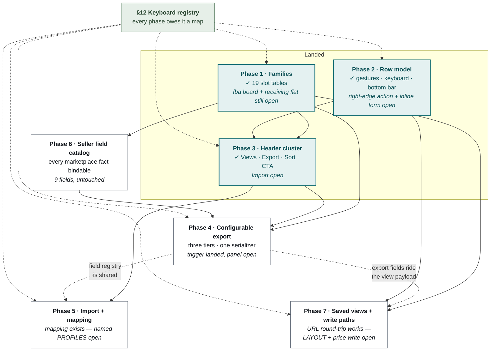
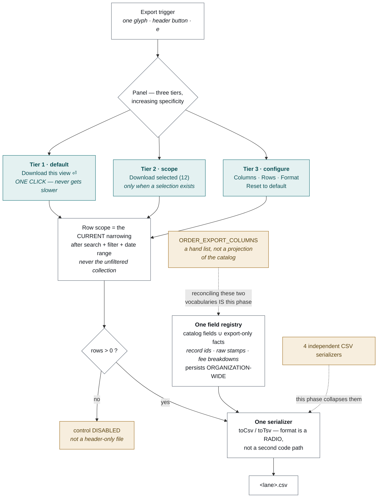
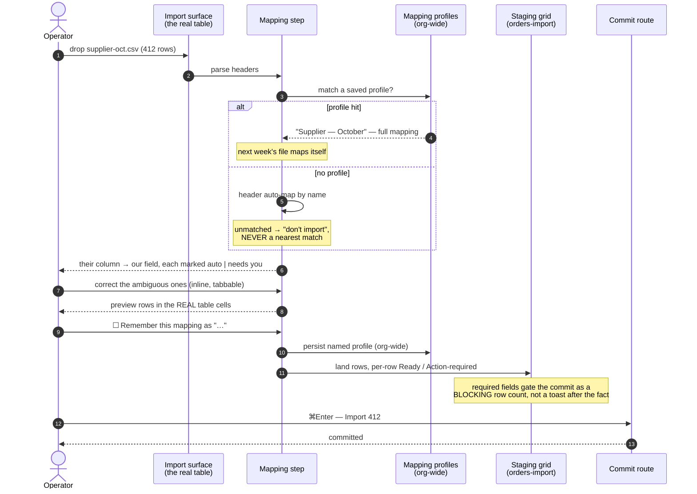
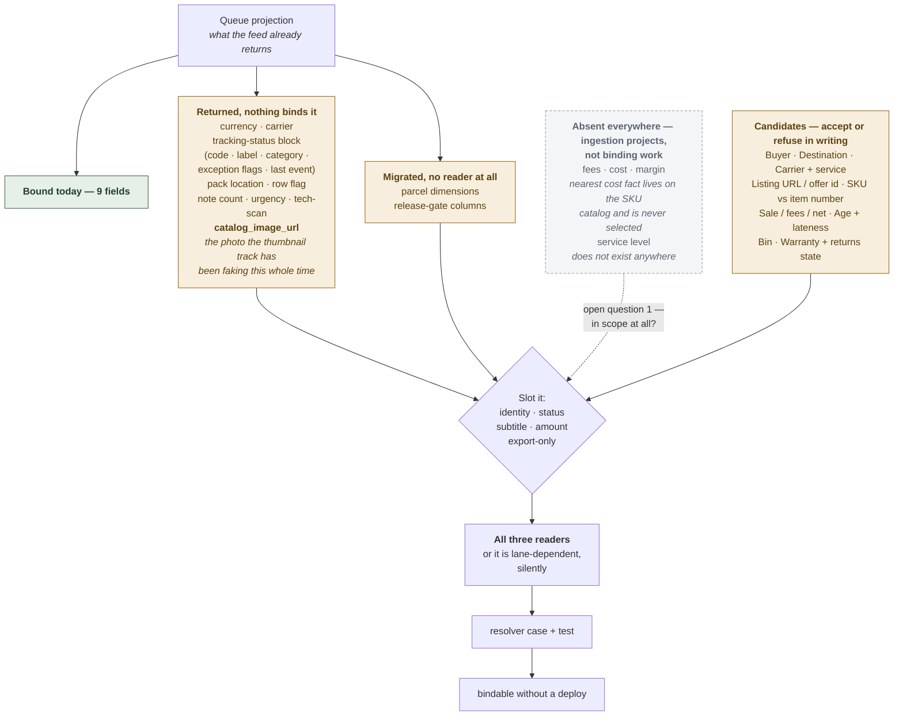
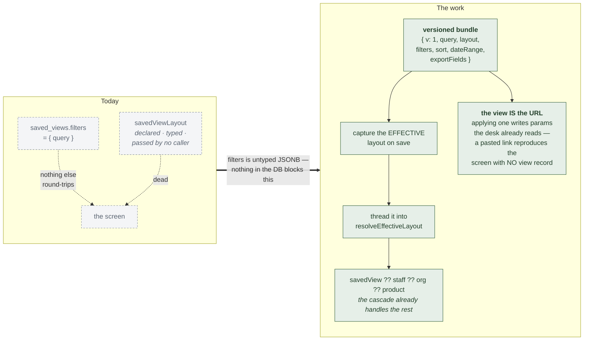
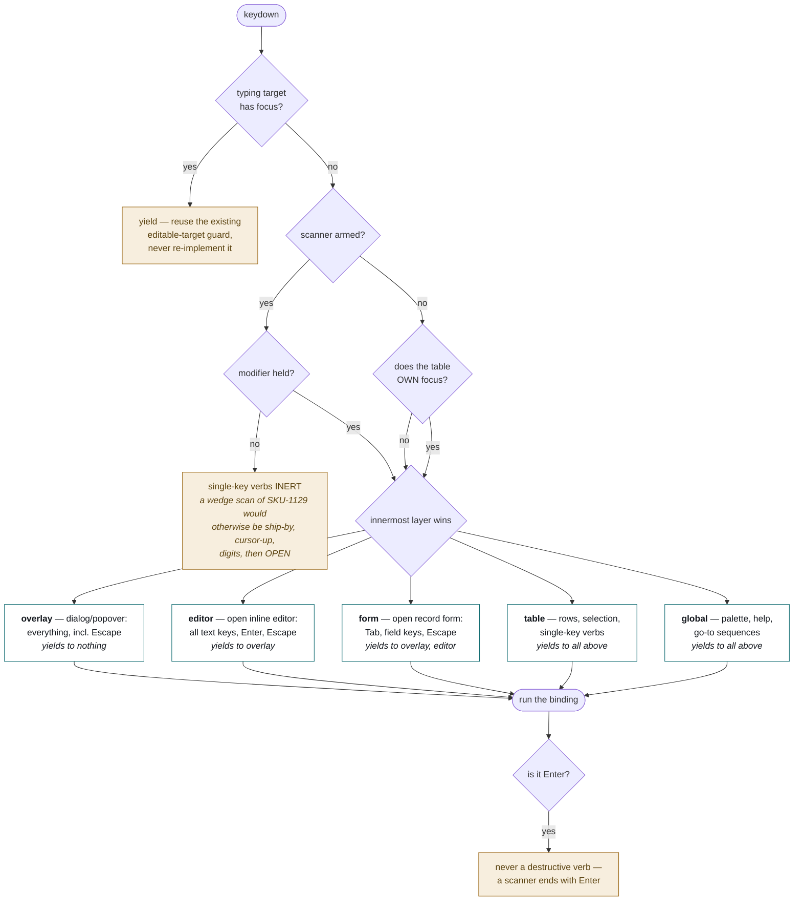

# Seller Table Program — plan of record

**Drafted** 2026-08-31 · **Source** the `Seller Table Program` execution artifact,
converted verbatim in substance · **Repo prompt**
[`docs/todo/enterprise-data-table-EXECUTION-PROMPT.md`](enterprise-data-table-EXECUTION-PROMPT.md) ·
**Kill SoT** [`docs/kill-list/07-slot-table-hand-models.md`](../kill-list/07-slot-table-hand-models.md)

Seven phases that take the desk from a good shared grid to the instrument an eBay
and Amazon seller runs their day on: one display across every family, every
marketplace fact bindable, actions at the foot of the table, import and export as
peers in the header, and a row that opens into the whole order without leaving it.

---

## 00 · The standard

Every phase is judged against these six. They are not aspirations; each was paid
for by a specific bug this table already had.

| Law | What it forbids |
|---|---|
| **One control per job** | Two controls that narrow the same rows is a fork, whatever chrome they wear. Bottom tab strips, a second toolbar band, a desk-local funnel beside the shared one — all fold into the single filter control. |
| **Data, not JSX** | A surface hands the table *values*; the table picks the component. It does **not** forbid the table reaching for a house component itself — that mistake was made twice and corrected both times. |
| **Honest absence** | No fake `0`. No `$0.00` nobody charged. No denominator for a set the operator is not looking at. No empty state where a failed fetch belongs. |
| **Interaction budget** | Primary information in ≤2 interactions, act in ≤3, status overview in ≤1. A fourth click on an existing flow is a regression even when the feature works. |
| **No layout animation** | Nothing tweens a property that reflows. Load-bearing for the row model: an expanding row must **show**, never animate open. |
| **Organization-wide by default** | A table's shape is a property of the table, not of whoever last touched it. Binding, unbinding, reordering — and saved views — write the org document. |

---

## 01 · Rulings already in force

Given in writing across the 2026-08-30 and 08-31 sessions and implemented. Read
them as constraints, not history — they are closed.

| # | Ruling | Where it lives |
|---|---|---|
| 1 | Status labels name what **has happened** — "Packed", never "Packed · Staged" | `orders.ts` |
| 2 | A pending step is icon + dash, blank second line, name screen-reader only | `CompoundStageStep` |
| 3 | An unclaimed step still paints the staff circle | `CompoundStageStep` |
| 4 | **Selection tabs are filters.** No row-narrowing tab strip; dataset-swap modes fold in too | `DataTableFilterMenu` |
| 5 | **No second chrome row** on any desk | `DashboardShippedTable` |
| 6 | Toolbar: search · filter · calendar — gap — export · columns · zoom · fullscreen, flush right | `DataTable` |
| 7 | Layout edits are **organization-wide** | `useSlotTableLayout` |
| 8 | Under the title: qty · condition · item # · notes, notes right-pinned as a glyph | `ORDERS_PRODUCT_LAYOUT` |
| 9 | Item number is a copy chip — copy-only, one click, no icon | `CompoundItem` |
| 10 | Quantity reserves two digits so 10–99 shifts nothing | `orders-resolve.ts` |
| 11 | White ground, no table border, a floor under the card, a visible scrollbar, shift+wheel scrolls sideways | `desk-stage` · `LedgerGrid` |
| 12 | Header ink is black; the image column names itself; headers drag to reorder and resize | `LedgerGridColumnHeader` |
| 13 | One popover primitive for every toolbar control | `radix-popover` |
| 14 | The export carries the lifecycle story — name and time per step, status, amount | `order-export-csv.ts` |
| 15 | The ⋮ row menu is gone from Orders; per-row work belongs to the record | `dashboard-order-row-layout` |
| 16 | **Selection actions live at the BOTTOM of the table**, as real buttons | phase 2 |
| 17 | **Double-click opens the order as a form inside the table** | phase 2 |
| 18 | **Export is a main feature button in the page header, left of the CTA** | phase 3 |
| 19 | **Import is a peer of export**, with **inline column mapping** | phase 5 |
| 20 | **Hovering a row's right edge reveals what needs doing next** | phase 2 |
| 21 | **The table is fully operable from the keyboard** | §12 |

---

## 02 · Phase graph

Seven phases. Families gates every phase that is built at the engine seam;
the row model runs in parallel because it touches the shell, not the catalogs.

**Phases 1 and 2 are done, and Phase 3 is down to one control.** What remains is
the seller-facing half — export, import profiles, the marketplace catalog, and
the layout half of saved views.



### Why the families came first  `kept as the record of the decision`

* Every capability below is built at the **engine seam**. Built while sixteen
  families still mount hand-written column arrays, each one becomes an *Orders
  feature* the next family has to be retrofitted into.
* The column picker flag is **a lie on most surfaces today** — only Orders
  supplies fields. Shipping a fields-driven export while that holds means the
  export and the picker disagree on fifteen desks.
* A hand array is a **frozen layout**: it cannot be captured for an organization
  and cannot share the skeleton. Saved views over frozen layouts save nothing.
* The ports are cheap now. Orders and Pickup proved the seam across **both
  morphs**; adoption is a catalog, a product layout and a registry entry.

**The counter-argument, honestly:** sixteen ports is real work with no visible
seller value, and the kill list itself says a big bang is a non-goal. So do not
big-bang — order them by what they de-risk.

---

## 03 · Phase 1 — Finish the displays  `LANDED 2026-08-31 · reopened and closed 2026-08-31`

All sixteen families are ported. The slot engine went from 3 registered tables
to **19**; every family in the kill list declares a `FieldCatalog` + a
`SlotLayout`, every `TABLE_COLUMNS` bucket that served a ported family is `[]`,
and `fieldsMenu: true` is honest everywhere it is set.

**Wave 1.3 had to be reopened.** An audit of the tree found the six compound
families had their MOUNT on the materialization and their CANONICAL model still
on the flat hand array — and each derived its `?colsort=` vocabulary from that
array, so **clicking a column header did nothing on six desks**. Closed
2026-08-31.

The recipe, the wave order and the per-family notes now live where the work is:
[kill-list 07](../kill-list/07-slot-table-hand-models.md) (§ Wave 3a–3f) and the
ledger in §16 below. **Still open from this phase, and only this:**

* **The Amazon Prep board display.** Unregistered by operator ruling, not
  rebuilt. `field-catalog/fba.ts` is intact — re-registering is one line in
  `SLOT_LAYOUT_TABLES` beside the rebuilt mount.
* **Receiving's FLAT model.** `/test`'s `TestingHistoryList` mounts it, now
  passing `RECEIVING_GRID_COLUMNS` explicitly rather than inheriting it by
  silence. It owes its own layout id.
* **Unmounted flat definition defaults** on the families whose descriptors and
  row components still fall back to a `*_GRID_COLUMNS` array nothing paints.

---

## 04 · Phase 2 — The row model  `mostly landed`

**The gesture table and the keyboard are done** (2026-09-01) — declared in
`src/lib/tables/row-gestures.ts`, bound by `useRowGestures` on the table region,
suppressed by `table-key-layer.ts`. Shift-click works for the first time. See
§11 for what the keyboard still owes, and §16 for the detail.

**The bottom bar is done** — selection verbs paint on `TableStatusBar` from the
first checked row, the 3+ `attention` roster is retired, and
`resolveRailOccupancy` no longer returns it.

### What is still open

**The row's right edge — a hover-revealed next action.**

```
│ … Bose Wave IV        ● TESTED   47d late  │   Pack  ⋮ │  ← on hover / focus
│   1 · USED · 9M52B2C4                      │           │
```

> **Reconcile this with the ⋮ removal before building it.** What was removed was
> a *permanent column* holding a generic menu whose only item duplicated the row
> click. What is asked for now is a **hover-revealed, contextual affordance that
> names this row's next action**. Different thing, and a better one. Say so in
> the docblock or the next agent reverts it.

* **It spends no column** — overlays the row's right edge over structural slack,
  on hover *and* on keyboard focus.
* **It names one next action**, resolved from lifecycle. A row with nothing
  outstanding shows nothing — honest absence.
* **The next action is data.** A family supplies a pure
  `row → { label, run } | null`. No lifecycle branching in a cell.
* **Opacity only.** It fades in; it never shifts the row.
* It shows its key when it appears on focus (§11).

**The inline record form.** Double-click / `Enter` / `o` call `onOpen`, and every
desk still routes that to its existing record plane. The plan's inline form —
URL-backed, fixed-height so the virtualizer's scroll math stays exact, one row
open at a time — is not built.

> **Decide what happens to the right pane.** Either the inline form replaces it
> on this desk, or the two coexist with the form as triage and the pane as the
> deep record. Do not ship both silently doing one job. *(Operator question 6.)*

**Undo or confirm on the bulk verbs.** Still true, still unaddressed: most of
them have neither.

---

## 05 · Phase 3 — The header cluster  `one control left`

```
Shipping                              [ Import ]  [ Export ]  [ + Add order ]
To ship   Amazon Prep   Shipped            ↑ the only one still missing
```

**Landed:** the page-level top-right CTA on every desk (`DeskActionSlot`,
2026-08-31, Home included — it was docking a permanent composer row under the
grid instead); **Views**, mounted in the `DataTable` toolbar beside Sort;
**Sort**, a real menu; and **Export** as a labeled `DeskHeaderAction` on a desk
stage, falling back to the toolbar glyph in fullscreen and off-stage.

**Open: Import.** Getting data *in* is a primary job, not a settings action, and
today it has no header control at all — the import surface is reached another
way. Import and export carry equal visual weight.

**What does not earn a button** — this list is the review standard, and it is
the reason the cluster stops at four:

* **Print and labels** — verbs that act on *chosen rows*; they belong in the
  bottom bar, not a header that acts on nothing. *(Now enforced: they live on
  the status-bar selection strip.)*
* **Refresh** — the desk is realtime-patched. Fix the invalidation instead.
* **Columns, filter, zoom, fullscreen** — already in the toolbar, next to the
  table they change.
* **Search** — already the toolbar's first and widest control.
* **New view** — lives *inside* the views control.

> **The toolbar glyph goes when the header button lands.** Two doors to one
> panel is the same fork as two funnels. Export already follows this — it is a
> header button on a desk and a glyph *only* where the header is unavailable,
> never both at once. Import must do the same.

---

## 06 · Phase 4 — Configurable export  `LANDED 2026-09-02`

> "The export should not just be a blind download. It should be a configurable
> download that will be inline — download default, download what's shown,
> configure more."

**Landed.** The panel is a `Popover` on the same grammar as Sort and Filter —
*inline* is the operator's word and it rules out a Dialog: a modal for a
download stops the desk to ask a question the operator answered by clicking.

* **Tier 1 never got slower.** The panel opens with *Download this view*
  focused, so the one-click case is click-then-Enter at worst.
* **Tier 2 is absent, not disabled,** without a selection — an always-present
  control that is usually dead teaches people to stop reading the panel.
* **Scope is the CURRENT narrowing**, after search, filter and date range.
* **Format is a radio over one serializer.** `serializeRows(header, rows,
  format)` — CSV quotes per RFC 4180, TSV flattens tabs and newlines because a
  spreadsheet does not read quoted TSV off the clipboard.
* **Five hand-written `csvCell` copies became one** (`DataTable`, warranty,
  order-export, receiving history, serial journey — the plan counted four).
  `serial-journey` keeps its own newline flattening, which is a local decision,
  and delegates the quoting, which is not.
* **The field choice persists org-wide** in the settings bag beside
  `tableLayouts` and `importMappingProfiles` — no migration.
* **Order comes from the registry, never the stored array.** A stored order
  would freeze a layout against a registry that gains fields, so a new fact
  would always land last however the family declared it.

**Still open, and named honestly:**

* **`ORDER_EXPORT_COLUMNS` is not yet a projection of the catalog.** Every desk
  reaches the panel through `exportSpecFromColumns`, a bridge that synthesizes
  `col:N` ids from the legacy positional shape. It works everywhere today; it
  keys the stored choice by POSITION, so a surface that wants export-only facts
  (record ids, raw stamps, fee breakdowns) graduates to a real registry —
  `exportFieldsFromCatalog` is written and tested, with nothing mounted on it.
* **`e` to open.** Binding it today means a 54th window keydown listener or a
  standing keycap the shortcut cohort refuses. It belongs to the keyboard
  registry. Enter and Escape already work inside the panel.



### Contract

```ts
export interface DataTableExportMenu<Row> {
  /** Column ids offered, in export order. Labels are the operator's words. */
  fields: readonly {
    id: string; label: string; group?: string; default: boolean;
  }[];
  /** Serialize one row for a chosen field set. Pure. */
  toRow: (
    row: Row,
    fieldIds: readonly string[],
  ) => readonly (string | number | null | undefined)[];
  /** Base filename without extension — the lane, e.g. `to-ship`. */
  filename: string;
}
```

> **Unify while you are here.** There are **four independent CSV serializers** and
> eight export paths — and no FBA or catalog export at all. `ORDER_EXPORT_COLUMNS`
> is a hand list rather than a projection of the catalog, so the two vocabularies
> already disagree: the export names `product_title`, `sku`, `status`, `platform`,
> `record_id`, and the catalog names none of them. **Do not add a fifth.**

**Done when:** one serializer and one field registry across toolbar, rail and
packed; the default tier is one click; field choice round-trips org-wide.

---

## 07 · Phase 5 — Import, with inline column mapping  `partly landed`

Export and import are one axis, and only one has ever been designed.

**More exists than the plan first credited.** A descriptor pipeline, seventeen
canonical fields with the order number the only required one, header
auto-mapping, per-row Ready / Action-required classification, a real staging grid
with its own table id and prefs bucket, a permission-gated commit — **and a
mapping step**: `CsvImportStagingRail` maps their column to our field, counts
the unmapped, gates the commit on `order_number`, and asks
`/api/orders/import/suggest-mapping` for the columns the alias map could not
place.

**Two things are still missing:**

1. **Named mapping profiles.** Nothing persists a mapping, so next week's file
   from the same supplier is mapped by hand again. This is the half that makes
   the feature pay for itself.
2. **The mapping lives in the RAIL, not in the table.** It is not a modal
   wizard, which is the failure mode the plan was written against — but it is
   also not the preview-in-the-real-cells the sketch describes.



```
Import · supplier-oct.csv · 412 rows

THEIR COLUMN            OUR FIELD
─────────────────────────────────────────────────────
Order #            →    [ Order number      ▾ ]   auto
Item Title         →    [ Item title        ▾ ]   auto
Qty Ordered        →    [ Quantity          ▾ ]   auto
Cust Ref           →    [ — don't import —  ▾ ]   needs you
Ship By            →    [ Ship-by date      ▾ ]   auto
─────────────────────────────────────────────────────
☐ Remember this mapping as "Supplier — October"
```

* ~~Mapping is not a wizard in a modal.~~ *(it is a rail — see above)*
* ~~Unmapped columns default to "don't import", never to a nearest match.~~
* ~~Required fields gate the commit, surfaced as a blocking row count.~~
* **Mappings persist as named profiles, organization-wide.** ← the gap
* **The preview uses the real table** — same cells, same row model.
* **Auto-mapped columns are marked as such** and stay editable; confidence shown.

**Done when:** a supplier file with foreign headers imports without hand-mapping
twice.

---

## 08 · Phase 6 — Seller field catalog  `LANDED 2026-09-02`

The catalog had ten fields; it has **23**. Every one was MEASURED against both
live order readers before it was named — the method below, followed rather than
summarised.

**The constraint the plan set was itself stale.** It says three independent
order readers. `getActiveOrders` no longer exists anywhere in `src`; there are
two. That mattered: the count is what each new fact gets checked against, and
checking against a reader that is gone would have let a one-sided fact through.
The comment in `/api/orders/route.ts` is corrected.

**Added** (all present in BOTH readers): `sku` · `tracking` · `carrier` ·
`delivery_status` · `delivery_event` · `exception` · `platform` · `flag` ·
`note_count` · `urgent` · `stock` · `serial` · `age`.

**Refused in writing, with the fix named** — every one reaches a single reader,
so binding it would paint on the Pending queue and go blank on every shipped
lane with no error: `catalog_image_url` (the photo the compound thumbnail has
been faking — `orders-queries.ts` never joins `sku_catalog`; the fix is that
join plus its GROUP BY entry, which is a hot-query change and not binding work),
`catalog_category`, `pack_location_name`, `has_tech_scan`, `customer_id`,
`label_printed_at`, `tracking_added_at`. Also refused: `currency` (it is how
Amount PRINTS, not a column), lateness (clock-derived — the surface owns
`nowMs`), and fees/cost/margin/service level (absent from the schema; open
question 1).

No display type was invented. The product layout is unchanged, so nothing moved
on screen — 13 more facts simply became bindable without a deploy.

### Method — do this, do not guess

1. Read the queue projection and the order row type.
2. List every column the feed returns that the catalog does not name.
3. For each, decide its slot: identity, status, subtitle, amount, or export-only.
4. Give it a `displayType` that already has geometry. **Do not invent a display
   type to fit one field** — a genuinely new type is a deliberate addition with
   its own geometry row and a test.

> **Two constraints before you start.** The slot budgets are real — ten status
> slots, five subtitle slots. And there are **three independent order readers**;
> the queue route says so in its own comment: *"a fact added to one does not reach
> the others."* Every new field must land in all three or it silently becomes
> lane-dependent, present on one desk and blank on another, with no error.



> **Platform behaviour stays data.** **No `if (platform === 'ebay')` in a cell.** A
> fact that applies to one marketplace resolves to `null` on the others and paints
> the house blank.
>
> But be honest about how much is data today. The platforms table lets an org
> rename, recolour and hide a marketplace. It carries **no URL template and no
> order-id pattern** — the Amazon and eBay id regexes and the Seller Central /
> eBay / Walmart links are code literals. An org cannot teach the system a new
> marketplace without a deploy. Close that or defer it explicitly.
>
> One eBay specific: the listing handle is written into `item_number`, there is
> **no listing URL on the order**, and "open on marketplace" links the order page,
> never the listing. "Open the listing" is a join, not a field.

**Done when:** each new field resolves in all three readers, has a resolver case
and a test, and is bindable without a deploy.

---

## 09 · Phase 7 — Saved views + write paths  `smaller than it was`

Smaller than it looks. The system exists; the payload is one field and the layout
layer was never connected.

**What exists:** a real saved-view system — a table with organization, staff,
surface, name and a JSONB `filters` blob; twenty-four registered surfaces
including all three order lanes; full CRUD, routes, a hook, and a menu now
mounted in the `DataTable` toolbar (Phase 3).

> **Correction, 2026-09-01.** This section used to say "the payload is a search
> string: the save path writes `{ query }` and nothing else." That is wrong
> against the code. `useSavedViews` encodes **every registered `paramKey`** for
> the surface into `query`, and `applyView` writes them all back — so search,
> filters, sort, date range and tab already round-trip, and **the view already
> IS the URL**. Read the hook before planning against this paragraph.

**What is actually missing is one thing: the LAYOUT layer.** Columns are the one
part of a view that does not survive it, because the parameter is dead:

```ts
const picked = savedViewLayout ?? staffLayout ?? orgLayout ?? productDefault;
//            ^^^^^^^^^^^^^^^ declared, typed, passed by no caller
```



* Capture the EFFECTIVE layout on save and thread it into
  `resolveEffectiveLayout` — the cascade already handles the rest.
* Views are **organization-wide**, extending the layout law. The table already
  carries a staff id and a shared flag — decide whether personal views survive.
  *(Operator question 4.)*
* ~~The view is the URL.~~ *(already true)*
* Deleting a view must never delete the rows it named.

### Write paths

The record form needs somewhere to write to.

> **Price has no write path at all.** `saleAmount` is absent from the assign
> payload, absent from the route's SQL, and absent from the strict PATCH body
> schema — while the database helper already accepts it. Pick *one* waist and wire
> it end to end with an audit row. Extending the assign route keeps the optimistic
> update and rollback the inline editors depend on.

* Item number editing moves off the chip and onto the record plane.
* Notes already append to the trail and refresh the denormalized column in the
  same transaction. **Do not add a second author of that field.**

**Done when:** a saved view restores layout, filters, sort and date range; the URL
alone reproduces the screen; the payload is versioned. Price edits persist with an
audit row; no field has two authors.

---

## 10 · Quality of life

Not a phase — a standing list. Each is small, each removes a daily irritation.

**Reading**

* **A totals row that follows the narrowing.** A seller triages on money; the
  table paints a column of amounts and never sums it.
* **Filter within a column.** A per-column value picker for tag and person
  columns — narrows *by the column you are looking at*.
* **Secondary sort.** Ship-by, then platform.
* **Operator column pinning.** The frozen prefix is fixed today.

**Working**

* ~~A keyboard sheet on `?`.~~ **landed** — `KeyboardShortcutsCheatSheet`, and
  the selection strip reveals its own letters on the same key.
* **Selection survives a refresh.**
* **Return to the row.** Closing the form lands you back on the row you opened,
  scrolled into view.
* **Undo on bulk writes.** A ten-second undo beats a dialog for reversible verbs.

**Marketplace-specific**

* **Same-buyer grouping.** Two orders from one buyer to one address is a combine
  opportunity and a postage saving.
* **"Why is this late."** The delay tip already computes the reason — make it a
  *bindable fact* so it can be filtered on, not just hovered.
* **Marketplace deadline versus ours.** Amazon and eBay each impose their own
  ship-by; the row shows one date.

---

## 11 · The keyboard  `cross-cutting`

Every verb the pointer can reach, the keyboard can reach.

> **53 files register their own window keydown listener.** That is the finding.
> The ownership *model* is already right; nothing composes it. Every feature adds
> listener 54 with its own copy of the guards, so precedence is decided by mount
> order and no file can answer "what does `x` do right now". **Do not add a 54th.**

**Landed 2026-09-01 — the guards, which is where the copies actually differ.**
`table-key-layer.ts` is the one suppressor (typing target → overlay → scanner →
focus ownership), `hasScanTarget()` is the scanner predicate that did not exist,
and `useRowGestures` binds the row model to the table REGION rather than to
`window`. WCAG 2.1.4 is satisfied by construction there, not by discipline.

**Still open: the REGISTRY.** `useKeymap` does not exist. Until it does, a
binding is discoverable only by reading the file that declares it, and the `?`
sheet cannot be scoped to the live layer because nothing can enumerate it.

```ts
useKeymap(layer, [
  { keys: 'j',     run: cursor.next,   label: 'Next row' },
  { keys: 'x',     run: toggleSelect,  label: 'Select row' },
  { keys: 'mod+c', run: copySelection, label: 'Copy details', when: hasSelection },
]);
```



### The map

Bound today by `useRowGestures` (✓) or still owed (—):

| Keys | Does | |
|---|---|---|
| j · k · ↑ · ↓ | Move the row cursor | ✓ |
| Home · End | First row · last row | ✓ *(the plan said `g g` / `G`; the sequence engine does not exist, and a single key that works beats a chord that does not)* |
| x · Space | Toggle selection on the focused row | ✓ |
| Shift+↑ / ↓ | Extend the selection | ✓ |
| ⌘A | Select every row in the current view | ✓ |
| Enter · o | Open the record | ✓ |
| Esc | Close the form, then clear the selection | ✓ |
| . | Open the row's overflow (alias of Shift+F10) |
| / | Focus the find field |
| f · d · c · v · e · i · z · F | Filter · date · columns · views · export · import · zoom · fullscreen |
| ⌘C | Copy details — the natural key, which is *why* copy is not `c` |
| a · s · p · ! | Assign · ship-by · print · flag |
| ⌫ | Delete (confirms) |
| ⌘K · ? · g t/p/s | Palette · keyboard sheet · desk tabs |

### Discoverability — Linear's real lesson

The shortcuts are not the hard part; knowing they exist is.

* **`?` opens a keyboard sheet** scoped to the current layer.
* **Every menu prints its own shortcut.** Highest-leverage move by a distance:
  nobody reads a help sheet, everybody reads the menu they already opened.
* The row-edge next action shows its key when it appears on focus.

### Accessibility obligations

* **WCAG 2.1 SC 2.1.4** requires single-character shortcuts to be remappable,
  switchable off, or **active only on focus**. The focus-ownership rule is what
  satisfies it — say so in the docblock so nobody "simplifies" it away.
* **Focus is always visible.**
* **Announce what the keyboard changed.**
* **The row window is one tab stop** with a roving index, not two hundred.
* **Escape has exactly one meaning at a time** — the innermost layer's.

### Per-phase obligations

| Phase | Owes |
|---|---|
| Families | The registry lives at the engine seam so every ported family inherits one map. **No family-local listener** — porting means deleting its listener, not moving it. *(open — waiting on the registry)* |
| ~~Row model~~ | ~~The gesture table gains a keyboard column. Shift-click's fix and Shift+arrow selection are the same anchor logic — write it once.~~ **done 2026-09-01** — one `selection-anchor.extendTo` serves both. |
| Header | `v` / `i` / `e` open Views / Import / Export; each trigger shows its key in its tooltip. |
| Export | `e` opens; Enter runs the default tier; Escape closes without downloading. |
| Import | Tab between mapping columns, type-ahead in each select, ⌘Enter commits. |
| Views | `v` opens, arrows walk, Enter applies — and it announces. |
| Writes | Every inline editor: Enter commits, Escape restores, Tab commits and moves on. |

> **Done means this passes, mouse unplugged.** Find the must-ship orders, select
> four, print their labels, open one, edit its condition, close it, export the
> view. Plus: `?` lists every binding live in the current layer and each also
> appears in the menu holding the same verb; a wedge scan with rows focused writes
> nothing; the row window is one tab stop; and no file outside the registry
> registers a keydown listener for the table.

---

## 12 · Cross-cutting

**Accessibility** — no live regions anywhere today (filtering, searching,
row-count changes and bulk results are silent); the focus ring is likely under the
3:1 floor on every chrome control (**never "fix" a focus test by removing a
ring**); two hundred row tab stops and no skip link; explanatory tooltips are
hover-only; the form is a named region.

**Performance** — Lighthouse ≥ 92 on every route is standing law and LCP is the
whole gap. The record form must not join the first paint. The virtualizer is why
1,189 rows are usable; nothing here may render every row to satisfy an export or a
form. Payload budgets ratchet down, never up. Assert seeds reach the first HTML
with rows.

**States** — every surface owes four settled states, and the fourth is the one
that gets dropped: **loading → absence → no-match → degraded.** A queue painting
"your warehouse is clear" on a failed fetch is the bug the degraded state exists
to prevent. The record form owes the same four.

---

## 13 · Risks

| Risk | How it bites | Mitigation |
|---|---|---|
| Sixteen ports as one big bang | A broken shared skeleton takes every desk down at once | Port in the stated order, verify per family, never batch |
| Form height vs. virtualizer | Scroll math drifts; the scrollbar lies | Fixed-height panel; measure only if forced |
| Bottom bar vs. tabs | The bar still hosts tabs on some surfaces | Largely resolved in flight — a peer session retired the tab half. Confirm before building on the bar. |
| Row-edge affordance reads as a reversal | The next agent reverts it as "the ⋮ we removed" | It spends no column and names a contextual verb — say so in the docblock |
| Header cluster creep | Every feature wants to be a main button | The "what does not earn one" list is the review standard |
| Three order readers | A field appears on one desk and not another, silently | Add to all three in one commit; test one row per reader |
| Concurrent sessions | A red gate is often someone else's in-flight file | Check the diff before repairing anything you did not write |
| Silent seeds | A seed returning nothing renders as an empty warehouse | Assert seeds reach the first HTML with rows |

> **Known blocker at time of writing.** A peer session repointed the To-ship
> server-side seed to a different scope; it seeds zero rows, the client hydrates
> that and never refetches, and the desk renders the first-run empty state.
> Confirm this is resolved before trusting any visual check.

---

## 14 · Invariants

`npm run verify` before done — lint, typecheck, unit is the whole gate.

| Guard | Asserts |
|---|---|
| `retired-symbols` | 30+ retired symbols stay at zero live references. Shrink-only. Add every kill. |
| `color-neutrals` | Raw neutral utilities stay at zero — theme tokens only. |
| `focus-ring-tokens` | Hand-rolled focus recipes may only shrink. **Never "fix" this by deleting a focus ring.** |
| `surface-box-tokens` | Hand-rolled card shells may only shrink — compose the panel primitive. |
| `slot-layout` | The write gate: unknown fields, wrong slot kinds, non-id identity, over-budget bands, duplicates. |
| `resolve-effective-layout` | Cascade precedence and soft-drop of stale bindings. |
| `materialize-tracks` | Band insertion after anchors, sheet versus compound, collision throw. |
| `saved-views/surfaces` | The surface list equals the live database constraint — **relevant to phase 7**. |
| `route-permission-manifest` | Every route's gate matches the committed manifest. |
| `order-export-csv` | Columns, quoting, stamp format, filename — **phase 4 rewrites this**. |

### Three guards named in live docblocks did not exist  `resolved 2026-08-31`

A repo-wide search returned **zero** `*.guard.test.ts` files. Three were cited as
house law and enforced nothing: the definition-to-columns **drift check**, the
registry **coverage assertion**, and the desk-peek surface law. The bindings file
documented, at length, the exact regression the first two exist to prevent — two
surfaces silently escaping the drift check for their entire life. **Phase 1
registered sixteen bindings into that seam**, which is why wave 1.5 closed it.

All three are written and green across every registered surface:

| Guard | Enforces |
|---|---|
| `table-definition-registry.guard.test.ts` | `binding.columns` and `definition.columns` are the same keys in the same order, and agree on width and frozen-ness — derived from `REGISTERED_BINDINGS`, because a hand-typed list is exactly what failed last time. |
| `table-record-plane.guard.test.ts` | The registry and the array name the same set, hold the same definition OBJECTS (identity, not deep equality — a rebuilt definition would pass a shape check and still be a second declaration), carry unique tableIds, and every non-`inspector` record plane states a real reason. A type can require the field; only a test can require it to say something. |
| `band3-find-only.guard.test.ts` | The desk-peek law in BOTH directions: a ruled surface may not grow a peek, and — the direction that matters more — a surface not on the list may not quietly become `kind: 'none'`. |

One correction fell out of writing them: the desk-peek docblock said "three"
honest-absence surfaces and there are two. The guard is the authority now, which
is the argument for putting a list in code rather than in a sentence.

### A guard that compares a thing to itself  `resolved 2026-08-31`

The definition↔columns drift check passed for all six compound families while
every one of their desks painted a different model — because `binding.columns`
and `definition.columns` were the *same reference*. An assertion whose two sides
cannot disagree is not a check; it is a comment with a test runner attached.

The guard now also asserts that a slot-opted **compound** family declares
compound tracks, which is checkable without family knowledge because the
skeleton is one shared declaration. It was verified RED against the pre-fix tree
before being kept.

### Two lessons that cost real bugs

> **Never build a Tailwind class with a template literal.** The scanner reads
> source text, so `w-[var(${VAR})]` generates nothing and the class ships with no
> rule behind it. This removed the grid's entire horizontal scroll — and the unit
> test passed the whole time, because it asserted the class *string*.

> **A test that pins a literal is not a test of the invariant.** A padding value,
> a track width, a class name — each of these failed on a legitimate change and
> passed through a real bug. Assert the behaviour or the shape, never the value.

---

## 15 · Open questions

Do not guess these. Ask, then record the answer in the repo prompt.

1. **Margin.** Half-answered by the code: there are no fees, no cost and no margin
   on the order row, and the only cost fact in the schema lives on the SKU catalog
   and is never read. So this is an ingestion project, not a display change. Is it
   in scope at all — and if so, does cost come from the catalog or from
   marketplace settlement?
2. **Buyer data.** How much customer identity belongs on a warehouse desk that
   packers can see?
3. **Per-marketplace views.** Different default layouts for eBay and Amazon, or
   one layout with marketplace facts blank where they do not apply? Related: an
   org currently *cannot add a marketplace* without a deploy. Is closing that in
   scope?
4. **View ownership.** The organization layout write is gated on
   feature-management permission, so today only a manager can change columns.
   Should saved views inherit that gate — and do *personal* views survive at all?
5. **Export destinations.** Is a file download the end state, or is the real ask a
   scheduled push to a sheet or a supplier?
6. **The right pane's future.** *Partly answered by what shipped:* the 3+ batch
   roster was retired (`resolveRailOccupancy` no longer returns `attention`)
   because it duplicated the status-bar CTAs, and **the two-row compare plane
   survived**. Still open: with the record form inline, what is the 1-row
   inspector for — the deep record, or nothing?

---

## 16 · Execution ledger

### What is left, in one place  `2026-09-01`

| # | Open work | Where |
|---|---|---|
| ~~1~~ | ~~Configurable export — three tiers, one field registry, one serializer~~ **landed 2026-09-02** | §06 |
| ~~2~~ | ~~Named import mapping profiles, org-wide~~ **landed 2026-09-01** | §07 |
| ~~3~~ | ~~Seller field catalog~~ **landed 2026-09-02** — 10 → 23 fields, measured | §08 |
| ~~4~~ | ~~Saved views: capture the effective LAYOUT and thread it in~~ **landed 2026-09-01** (To-ship opted in; other desks are one `layout:` line) | §09 |
| 5 | Price write path — no route accepts `saleAmount` on edit | §09 |
| 6 | Header Import control | §05 |
| 7 | Row right-edge next action; the inline record form | §04 |
| 8 | The keyboard REGISTRY (`useKeymap`) — the guards landed, the map did not | §11 |
| 9 | Amazon Prep board display; receiving's flat model needs its own layout id | §03 |

Everything else in this document has landed. The rows below are the record.

| Wave | Landed | Notes |
|---|---|---|
| 1.1 Ready | **2026-08-31** | `READY_FIELD_CATALOG` (7 facts) + `READY_PRODUCT_LAYOUT` (sheet) + `ready-resolve.ts` + registry entry + `readySheetColumnsFor` + `useReadyTableLayout`; `READY_GRID_COLUMNS` deleted with the last live `{ key: 'tested' }` track in `src/`; `TABLE_COLUMNS.ready` emptied; 4 symbols ledgered; 12 new unit tests. Detail: [kill-list 07 § Wave 3a](../kill-list/07-slot-table-hand-models.md). |
| 1.2 Amazon Prep | **2026-08-31** (partial) | Operator ruling: **unregister, do not rebuild yet.** `fba` dropped from `SLOT_LAYOUT_TABLES`, so `/api/tables/layouts` 404s instead of storing an org layout for a table that renders nothing; `field-catalog/fba.ts` kept intact so the rebuild is one line. A regression test now pins `slotCatalogFor('fba') === null` with the reason. **The board display rebuild itself is still open.** |
| 1.3 Compound families | **2026-08-31** (see the reopened row) | **receiving (compound mount) landed 2026-08-31** — `RECEIVING_FIELD_CATALOG` (8 facts) + compound `RECEIVING_PRODUCT_LAYOUT` with an empty band (byte-for-byte parity), `receivingCompoundColumnsFor`, `useReceivingTableLayout`, a `fields` passthrough on `ReceivingGridHost`, slot values into the shared `CompoundRowView`; 12 new unit tests. Two facts refused in writing (activity stamp, Zoho chip). **Receiving's FLAT mount (`/test` history) is a separate port** — it needs its own layout id. **incoming landed 2026-08-31** — `INCOMING_FIELD_CATALOG` (7 facts) + compound product layout with an empty band, `incomingCompoundColumnsFor`, `useIncomingTableLayout`, both mounts wired; 13 new unit tests. The resolver is deliberately NOT shared with receiving: one row, two questions (`delivery_state` vs `workflow_status`), routed by `linePhase`. Refused in writing: age, Zoho chip. **daily landed** — 4 facts, `dailyCompoundColumnsFor`, `useDailyTableLayout`, both render paths collapsed onto one `dailyRowView` helper; 10 tests. **tasks landed** — 6 facts, its own vocabulary (a staffer's list vs the org's roster-backed checklist); 13 tests; refuses a lateness fact because the surface's shared `nowMs` owns it. **catalog-link landed** — 6 facts; 11 tests; refuses `status` (every row in the queue is unlinked by definition). **import-exception landed** — 7 facts; 13 tests; same `status` refusal. **Wave 1.3 is complete**: six compound families, all with empty default bands (byte-for-byte parity) and honest Fields menus; the slot engine now serves ten tables. Their FLAT models survive as unmounted definition defaults — a separate sweep. |
| 1.4 Sheet families | **2026-08-31** | All ten landed: **units** (5 facts) · **bins** (7; the flag composite never sorts, and that rule rides the fact) · **warranty** (7; ticket CONTROL structural, linked-ticket FACT bindable) · **catalog** (9; the four roll-ups, cost and category unbound, and a zero roll-up paints blank) · **tech-all** (4; urgency is a RANK, so it opens ASCENDING against the house number default) · **unfound** (6; an interactive fact binds, the Push control does not; the queue ascends on every track so the oldest uncleared row surfaces) · **repair** (8; sort stays the `?sort=` URL vocabulary and a mounted track maps ONTO a word, never mints one — bookmarks keep their meaning) · **my-day** (6; `fieldsMenu: true` was "leftover lip copy" and is now honest) · **tracking-exceptions** (10) · **orders-import** (6; the triage status is structural, resolvers do not coerce — `02` stays `02`). Each: catalog + resolver + registry + `*SheetColumnsFor` + `use*TableLayout`, cells switched onto the bound field id, `TABLE_COLUMNS` bucket emptied, symbols ledgered. **One geometry change, with its reason:** staging's sole `1fr` moved off the `customer` FACT onto a trailing `_fill`, the house law every other family follows. |
| 1.5 Missing guards | **2026-08-31** | All three written, and each one now passes across every registered surface. **`table-definition-registry.guard.test.ts`** — the definition↔columns DRIFT CHECK, derived from `REGISTERED_BINDINGS` (a hand-typed list is what failed last time); it pins keys-in-order, width and frozen-ness for all 19 bindings. **`table-record-plane.guard.test.ts`** — the COVERAGE ASSERTION (registry ↔ array, same set, same objects by identity, unique tableIds) plus "every row says what it opens": a non-`inspector` arm must carry a reason of real substance, because a type can require the field but only a test can require it to say something. **`band3-find-only.guard.test.ts`** — the desk-peek surface law, enforced in BOTH directions: a ruled surface may not grow a peek, and — the direction that matters more — a surface not on the list may not quietly become `kind: 'none'`. Its prose count was stale (two, not three); the guard is now the authority. The three citing docblocks were corrected to say the guards exist. |
| 1.3 (reopened) | **2026-08-31** | **Audit of the tree, not the ledger, found wave 1.3 half-landed.** All six compound families had their MOUNT on the materialization and their CANONICAL model (`binding.columns` / `definition.columns`) still on the flat hand array — and each derived its `?colsort=` vocabulary from that array, so `useUrlColumnSort` rejected every mounted track key and **clicking a column header did nothing on six desks**. The same bug `queue-display-sort` documents for To-Ship one wave earlier. Fixed: definitions repointed; `TestingHistoryList` passes the flat model EXPLICITLY (a declared second mount, not a silent fallback); a track→fact map per family on the `COMPOUND_TRACK_SORT_KEYS` shape, with four refusals written down; sortability moved onto the bound fact and wired into the daily/tasks descriptors so a header stops offering a sort it cannot perform; `catalog-link` / `import-exception`'s half-patch completed (dead `item` header, `undefined` comparator type); seven prefs buckets emptied — including `receiving`, whose justification cited `useIsColumnHidden`, **which does not exist**. Detail: [kill-list 07 § Wave 3f](../kill-list/07-slot-table-hand-models.md). |
| 1.5 (staging) | **open** | The three guard files exist on disk and pass, but are **untracked** — a git-based audit reads them as missing. This tree is shared by concurrent sessions; nothing has staged them. |
| 2 · gestures/keys | **2026-09-01** | **The gesture half.** `selection-anchor.ts` (the range walk, lifted out of `useTableSelectMode` so the keyboard can reach it — 20 tests) · `row-gestures.ts`, the gesture table as DATA with its keyboard column, guarded by the pointer/keyboard parity law · `table-key-layer.ts`, the §11 suppressor, plus `hasScanTarget()` — the scanner predicate that did not exist · `useRowGestures`, bound to the table REGION and not to `window`, so it is not listener 54 and WCAG 2.1.4 holds by construction · roving tabindex (one tab stop, not 900). **Shift-click now works**: `GridRowCheckbox.onToggle` was `() => void`, swallowing the event, so every caller hard-coded `{ shiftKey: false }` against a range walk that had unit coverage and no reachable caller. A source guard fails on that literal. 52 new tests; `npm run verify` green (7,587 pass). |
| 2 · scanner guard | **2026-09-01** | The selection status-bar hotkeys fired single letters (`a c l r b p s f d`) from a **window capture listener** with no scanner check, so a wedge scan of `SKU-1129` on a station with rows checked ran Ship-by, Product labels and Shipping labels. Its four hand-copied guards are now one `suppressTableKey` call, which adds the scanner term; `?` takes the scanner check alone, because that handler deliberately allows single-line inputs. 5 regression tests, including the whole wedge payload. |
| 7 · saved-view layout | **2026-09-01** | `savedViewLayout` — declared, typed and **passed by no caller** since `resolveEffectiveLayout` was written — finally has one. A view stores the effective layout beside its query (`filters.layout`, read through the same strict `readStoredSlotLayout` the org and staff layers use); `saved-view-layout-store` carries it back to `useSlotTableLayout`, because the page calls the layout hook and passes the result DOWN into the table that mounts the views menu. One frame on apply, which is a deliberate act. 7 store tests. |
| 5 · mapping profiles | **2026-09-01** | Named column mappings, org-wide, **no migration** — they live in the `organizations.settings` passthrough bag beside `tableLayouts`. Matching is by HEADER SET, not filename: an exact signature (order-independent) or the best coverage above 0.6, ties broken by most-recently-used. A hit is OFFERED, never auto-applied — a silently-applied profile is indistinguishable from a good auto-map until something lands wrong in To-Ship. Bindings whose column is absent from this file are DROPPED rather than kept, so the field returns to the unmapped count instead of resolving blank on every row. Write gate is `orders.import`, not `admin.manage_features`: the person who learns a supplier's file is the person importing it. 26 unit tests. |
| 4 · export | **2026-09-02** | Inline three-tier panel (`DataTableExportMenu`) on the Sort/Filter popover grammar; the blind `DataTableExportButton` deleted. ONE serializer with format as a parameter — five hand-written `csvCell` copies collapsed to one owner of quoting. Field registry + org-wide persistence (`organizations.settings.exportFields`, no migration), reached from every existing desk through a positional bridge so the panel works everywhere without twenty per-desk migrations. 43 unit tests; `eval:cohort slot-table` and `eval:cohort shortcuts` both `ok: true`; verify green. |
| 6 · seller catalog | **2026-09-02** | 10 → 23 orders fields, each measured across both live readers first. 13 accepted, 11 refused in writing with the fix named for each. Found the plan's own "three readers" constraint stale — `getActiveOrders` is gone — and corrected the projection comment that carries it. Resolver arm per field, plus a test asserting EVERY catalog field resolves rather than falling through to a blank track. 15 new tests (40 in the file); verify green; `eval:cohort slot-table` ok. |

---

*Working conditions worth carrying into the next session: this checkout is shared
by several concurrent sessions, so a red gate is often someone else's in-flight
file — check the diff before repairing anything you did not write. Verification is
possible and expected: mint a session and drive the real DOM. The worst bug in
this program was invisible to every test and obvious in one `scrollWidth` reading.*
