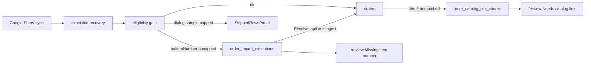

# Sheet import + Review queue — unified handoff

> **OBSOLETE (2026-09-24):** Google Sheets order import was removed; nothing enqueues new
> Review · Missing item number rows. The open queue still lists/resolves/ignores existing
> rows. Do not continue this handoff.

**Self-contained.** A new session needs only this file. Paste:

> Read `docs/todo/sheet-import-review-queue-HANDOFF.md` and continue from "Status".

**Lane:** `main` (WS-DOGFOOD). Stay on it — no branch, no worktree, never `git stash`.
**Commits:** user manages. Stage only files you touch.
**Dev server:** already on `:3050` — attach, never start/restart/kill
(`workflow-safety.md`).
**Verify:** `npm run verify` green before done / before any commit.
**E2E org:** QA org only (never dogfood tenant assertions), except the
documented dogfood-only Google Sheets import E2E (shape-based).

Everything below that says "Done" is **uncommitted** in the working tree and
already passed `npm run verify`. **Live DB (2026-07-30):** `2026-07-30c`
(exceptions table) and `2026-07-29f` contract (tenant-blind unique drops) are
**applied**; dead CASE/EXISTS removed from `order-catalog-link-chores.ts`.
`npm run db:migrate:dry` reports **0 pending**. **Manual/programmatic smoke
(§1) passed 2026-07-30** — queue populates, resolve creates order, re-sync does
not reopen.

---

## 0. Product frame (locked — do not re-litigate)

| Question | Decision |
|---|---|
| "Review station" | Existing [`/review`](../../src/app/review/page.tsx) Packer Review Station. Catalog-link mode: `/review?mode=catalog-link`. **No new nav entry.** |
| Simplest approach | Grow the existing Catalog link mode with an **in-surface chrome tab** — not a new page. |
| "Resolve the linkage" (operations) | **Two different gaps, two queues on the same page:** (1) **Needs catalog link** — order imported, Item Number present but unmatched to `sku_catalog`; staff search + link (or ignore). (2) **Missing item number** — sheet row never became an `orders` row (blank Item Number); staff type the Item Number → Resolve re-runs the *exact* sheet ingest path and creates the order (or Ignore permanently). |
| Long-term vs flash dialog | Durable DB table `order_import_exceptions` + Review triage. Sync dialog `SkippedRowsPanel` stays a **one-run sample**; Review is the backlog. |
| Scope | **Persistent ongoing queue** across all imports. Re-sight while `open` bumps `seen_count` / `last_seen_at`. Resolved/ignored **never reopen** (sheet cell is never edited by this feature). |



Only `noItemNumber` rows are legitimate candidates for the exceptions queue.
Blank padding, FBA shipments, Ecwid rows, and rows missing an order id or
tracking are excluded for their own reasons and must never be enqueued here
(see sheet-import-visibility §3).

---

## 1. Status

### Done (code, uncommitted — `npm run verify` green)

Treat as written and verified; do not re-implement.

**Table + domain + API**
- Migration [`2026-07-30c_order_import_exceptions.sql`](../../src/lib/migrations/2026-07-30c_order_import_exceptions.sql) — **applied 2026-07-30**.
- Domain [`order-import-exceptions.ts`](../../src/lib/inventory/order-import-exceptions.ts) — `ImportExceptionDeps`, upsert only while `status = 'open'`, resolve/ignore require open.
- API [`/api/review/import-exceptions`](../../src/app/api/review/import-exceptions/route.ts) + Zod schema + audit actions + route-permissions manifest.

**Enqueue**
- Uncapped `noItemNumberRows` from [`transfer-sheet-eligibility.ts`](../../src/lib/jobs/transfer-sheet-eligibility.ts) / job call site in [`google-sheets-transfer-orders.ts`](../../src/lib/jobs/google-sheets-transfer-orders.ts).
- Durable enqueue uses that uncapped list — **not** the 200-row dialog sample that feeds `SkippedRowsPanel`.

**UI**
- Second chrome tab on [`ReviewCatalogLinkTable.tsx`](../../src/features/review/catalog-link/ReviewCatalogLinkTable.tsx).
- URL: `?section=missing-item-number` + `?exceptionId=` on `REVIEW_ROUTE_PARAMS`.
- `firstSeenAt` / `lastSeenAt` on both tabs (Needs catalog link + Missing item number).

**Operational resolve path**
- Splice operator Item Number into stored `raw_row` → `mapSheetRowsToCanonicalLines` → `ingestCanonicalOrders`.
- If that Item Number still lacks a catalog match, existing `order_catalog_link_chores` enqueue fires for free — no special case in resolve.

**Sheet-import-visibility item 1**
- Contract migrate applied as `2026-07-29f_sku_platform_ids_tenant_contract.sql` (ungated from `.gated`).
- Dead CASE/EXISTS removed from [`order-catalog-link-chores.ts`](../../src/lib/inventory/order-catalog-link-chores.ts) — fill is `COALESCE(t.platform_sku, $2)`; `ON CONFLICT DO NOTHING` kept.

**Tests**
- `src/lib/inventory/order-import-exceptions.test.ts`
- Eligibility cap test asserts uncapped `noItemNumberRows`
- Route-permissions / related guards green under full verify

### Still to do (in order)

1. ~~**Manual smoke:** sync → Missing item number tab populates → Resolve with a real Item Number → order in dashboard Pending → re-sync does not resurface.~~ **DONE 2026-07-30**:
   - Sheets-only `runGoogleSheetsTransferOrders` enqueued **13** open `noItemNumber` rows.
   - Resolved exception `#6` (`112-4326091-0076261` / Solo·CineMate remote) with catalog Item Number `783970882` → order **`7753`** (`status=unassigned`, `item_number` set).
   - Re-sync left `#6` `status=resolved`, `seen_count` unchanged; open peers bumped to ×2; **0** open rows for that `account_order_id` (12 open remain).
   - UI confirmed via Playwright + `tests/.auth/admin.json`: `/review?mode=catalog-link&section=missing-item-number` lists the queue (tabs + rows visible).
   - `GET /api/review/import-exceptions` returns `{ success, total: 12 }`.
2. Leave sheet-import backlog (§5 telemetry / casing / Shopify Nango /
   `unresolvedTrackingCount`) as pointer-only in
   [`sheet-import-visibility-FINISH-PROMPT.md`](sheet-import-visibility-FINISH-PROMPT.md) — do not expand unless asked.

---

## 2. Sibling docs

| Doc | Role |
|---|---|
| [`order-import-exceptions-PLAN.md`](order-import-exceptions-PLAN.md) | Why / design notes for the durable queue (raw_row + open-only upsert). Entry for this work is **this** handoff now. |
| [`sheet-import-visibility-FINISH-PROMPT.md`](sheet-import-visibility-FINISH-PROMPT.md) | Recovery rules, skip-dialog ship notes, backlog §5, traps §6. Contract migrate item 1 is **done** — see that file §1. |
| [`review-listing-propose-approve-PLAN.md`](review-listing-propose-approve-PLAN.md) | **Next:** propose listing (catalog / URL paste / marketplace + Hermes rank) → Approve → existing Resolve. Grows this queue’s rail; does not replace it. |

Do **not** edit the Cursor plan file for this workstream.

---

## 3. Design notes worth keeping (from the exceptions plan)

- **Why `raw_row` + `col_indices` are stored:** resolve splices the corrected cell and re-runs the exact mapper + `ingestCanonicalOrders` the bulk job uses. No second order-creation path.
- **Why upsert has `WHERE status = 'open'`:** the sheet cell is never edited; every future sync still classifies the row as `noItemNumber`. Reopening resolved/ignored would make the queue never empty.
- **Ignored stays ignored** (unlike `order_catalog_link_chores`, which may reopen). A blank Item Number will not fix itself without a human or the earlier exact-title recovery (which already failed for rows that reach this table).
- **No new nav entry.** `/review?mode=catalog-link` + in-surface tab only.

---

## 4. Traps

- **Attach-only `:3050`** — never start/restart/kill the dev server.
- **Enqueue must use the uncapped `noItemNumberRows` list** — wiring the dialog's 200-row sample silently drops the backlog beyond the sample.
- **Ignored stays ignored** — do not "fix" reopen-on-re-sight to match catalog-link chores; that pattern is wrong here.
- **`TENANT_APP_DATABASE_URL` without tenant GUC looks empty** — RLS, not an empty table. Use `DATABASE_URL` (owner) for inspection.
- **Import entry point is chrome IMPORT**, not `/dashboard` outbound default. Sync hits `/api/integrations/google_sheets/sync`, not the legacy NDJSON transfer route.
- **Repeated live imports can pool-starve the dev server** (~2 min) — wait; do not restart.
- **Do not re-apply migrations** — dry-run is 0 pending; table + contract are live.

---

## 5. Verify

From the exceptions / Review-queue thread:

```bash
node --test --require ./scripts/register-server-only-shim.cjs --import tsx \
  src/lib/inventory/order-import-exceptions.test.ts
npx tsx --test src/lib/jobs/transfer-sheet-eligibility.test.ts
npm run verify                                      # before any commit
```

From the sheet-import-visibility thread (shape checks / dogfood E2E):

```bash
npx tsx --test src/lib/jobs/transfer-sheet-eligibility.test.ts \
  src/lib/integrations/connectors/orders-transfer.test.ts \
  src/lib/integrations/registry-parity.test.ts
npx playwright test tests/e2e/google-sheets-import-backfill.spec.ts --project=desktop
npm run verify                                      # before any commit
```

Manual smoke (table is live):

1. Run a Google Sheets sync (chrome IMPORT).
2. Open `/review?mode=catalog-link` → **Missing item number** tab populates.
3. Resolve one row with a real Item Number from the live sheet.
4. Confirm the order appears in `/dashboard` Pending with that item number.
5. Re-run sync — resolved row does **not** resurface; ignored never resurfaces.

---

## 6. Next session start

1. ~~Manual smoke the Missing item number tab (Status § Still to do #1).~~ **Done 2026-07-30.**
2. Do not re-litigate the product table in §0.
3. Sheet-import backlog §5 remains pointer-only in the visibility finish prompt.
4. When ready to land: `npm run verify` then user-managed commit of the uncommitted
   sheet-import + Review-queue tree (stage only those files).
