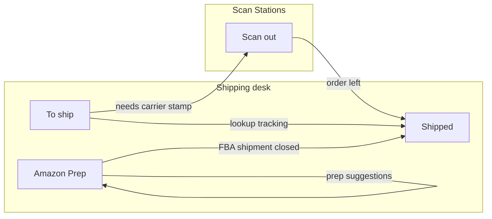

# Shipping desk IA — To ship · Amazon Prep · Shipped

**Status:** plan of record · **Written:** 2026-08-30 · **Branch:** `main`  
**Companion prompt:** [`shipping-desk-to-ship-prep-shipped-IMPLEMENTATION-PROMPT.md`](./shipping-desk-to-ship-prep-shipped-IMPLEMENTATION-PROMPT.md)

**Composes (do not fork):**  
[`desk-page-chrome-fixed-width-PLAN.md`](./desk-page-chrome-fixed-width-PLAN.md) · [`shipping-desk-fixed-width-FIX-IMPLEMENTATION-PROMPT.md`](./shipping-desk-fixed-width-FIX-IMPLEMENTATION-PROMPT.md) · [`slot-based-metadata-table-PLAN.md`](./slot-based-metadata-table-PLAN.md) · [`non-scan-desk-chrome-caged-release-PLAN.md`](./non-scan-desk-chrome-caged-release-PLAN.md)

**Product law (operator, 2026-08-30):**  
**To ship = act on open work · Amazon Prep = plan FBA · Shipped = find and measure what already left.**  
Platforms aggregate inside To ship / Shipped. Process forks (FBA) get their own desk. Analytics live on history, not on the floor queue.

---

## THIS SHIP (operator deliverable)

**Scope lock:** promote **Shipped** to a first-class Shipping desk page/tab; tighten **To ship** to open-outbound work (+ a lightweight “today” snapshot); leave **Amazon Prep** as the FBA process desk; keep **Scan out** a scan station. Land **Wave 0–2** end-to-end. Waves 3–4 (KPI compare tabs, product ranking) may ship in follow-on commits but their IA and URL contracts are locked here so later work does not invent a second history product.

**Must work when done (Waves 0–2):**

1. Shipping desk page tabs are **To ship · Amazon Prep · Shipped** (URL-deep-linkable; spine stays flat leaf via existing `deskChrome`).
2. **`/shipping/shipped`** hosts history / lookup (existing `DashboardShippedTable` + filter well + week window — remounted under desk chrome, not a To-ship lane).
3. **To ship** defaults to **open work only** — no peer “Shipped” lifecycle board inside `/shipping/orders`.
4. Legacy URLs (`/shipping/orders?shipped=`, `/dashboard?shipped=`, AI / assistant hrefs) **redirect or rewrite** to `/shipping/shipped` with params preserved where possible.
5. **Scan out** unchanged (edge-to-edge station under Scan Stations).
6. `npm run verify` green; desk chrome / slot table plans remain composed, not reimplemented.

---

## 0. Why this exists

Industry fulfillment products split **open outbound** from **shipment history**. Mixing them on one table forces two jobs into one interaction budget:

| Job | Needs | Anti-pattern on one page |
|---|---|---|
| Clear today’s queue | Open rows, stage columns, ≤1 status overview | Hydrating “everything ever shipped” |
| Find / measure what left | Date window, search, KPIs, compare tabs | Stage verbs (Pick / Pack) as the primary chrome |

Cycle Forge already has pieces of both (`/shipping/orders`, `DashboardShippedTable`, `?packed=`, FBA board). This plan makes the **IA honest** and growth-safe: platforms aggregate; FBA stays a process fork; Shipped owns history + future analytics.

---

## 1. Exact vocabulary

| Term | Meaning |
|---|---|
| **Shipping desk** | Non-scan desk under spine L1 **Shipping** — `DeskPageChrome` + page tabs. |
| **To ship** | Open outbound workbench — DTC / marketplace / any channel still in-warehouse. Path: `/shipping/orders`. |
| **Amazon Prep** | FBA plan / prep / ready process. Path: `/shipping/fba`. Not a marketplace filter on To-ship. |
| **Shipped** | History + lookup (+ later KPI / compare). Path: `/shipping/shipped`. Aggregate across platforms (and FBA closed shipments when projected). |
| **Scan out** | Scan station that stamps carrier handoff. Path: `/shipping/scan-out`. **Not** a desk tab twin. |
| **Open work** | Orders not yet carrier-handed (released / caged policy remains the intake plan’s job). |
| **Today strip** | Compact counts on To ship (open · due today · shipped today) — status overview, not a second table. |
| **History well** | Date / week / carrier / exception filters on Shipped (reuse Packed / shipped-filter patterns). |
| **Platform aggregate** | Amazon DTC, eBay, Shopify, … appear as facets/filters inside To ship and Shipped — **not** peer desk tabs. |
| **Process fork** | A workflow that cannot share To-ship’s queue semantics (FBA prep). Gets its own desk tab. |

**Not in vocabulary:** “Amazon page for all Amazon orders,” “Shipped as a To-ship `ustatus` tab forever,” “KPI dashboard inside the open queue,” “Labels as a browse desk” (retired 2026-08-30 — needing a label is a **state** on To-ship).

---

## 2. Target IA

```text
Spine L1: Shipping  (flat leaf — deskChrome: true)
              │
              ▼
DeskPageChrome tabs
  ├── To ship        → /shipping/orders     open work + today strip
  ├── Amazon Prep    → /shipping/fba        FBA process + suggestions
  └── Shipped        → /shipping/shipped    history + lookup (+ KPI waves)

Scan Stations L1: Scan out → /shipping/scan-out   (unchanged, edge-to-edge)
```



### 2.1 What each desk owns

| Desk | Owns | Does not own |
|---|---|---|
| **To ship** | Released open queue; Pick/Pack/label/stage slots; Add / caged→released; “Needs label”; today strip; deep-link to order detail | Week-over-week product ranking; full shipped archive; FBA plan board |
| **Amazon Prep** | FBA plans, ready, prep suggestions of *what to send to Amazon* | Customer marketplace open orders (those stay To-ship); Shipped KPI compare |
| **Shipped** | Date-windowed shipments across platforms; find by order/tracking/SKU; exceptions; KPI / compare tabs (Waves 3–4) | Mutating open-queue stage work; FBA planning |
| **Scan out** | Scan to stamp out | Browsing history as primary job |

### 2.2 Platform vs process

| Kind | Examples | Placement |
|---|---|---|
| **Platform facet** | Amazon marketplace, eBay, Shopify, manual | Filter / chip / saved view on To ship **and** Shipped |
| **Process fork** | Amazon FBA prep / inbound to Amazon FC | **Amazon Prep** desk only |
| **Action station** | Scan out, Pack, Test | Scan Stations — not desk tabs |

---

## 3. To ship — tighten (Wave 2)

### 3.1 Default paint

- Default URL: `/shipping/orders` → **open work only** (current unshipped feed).
- Lifecycle peer boards **Shipped** (and long-term **Packed-as-history**) **do not** live here. Prefer facets (`?ustatus`, attention, late, needs-label) for **in-warehouse** narrowing only.
- Product default slot layout remains open-queue oriented (`orders.picked` / pack / scan-out as org chooses) — see slot-table plan. History columns (delivered, carrier transit) belong on Shipped’s catalog later.

### 3.2 Today strip (status overview ≤1 interaction)

On To ship entry, paint a compact strip (counts, not a chart farm):

| Chip / metric | Meaning |
|---|---|
| Open | Count of open / released To-ship rows in current filter |
| Due today / at risk | Existing late / must-ship facet truth |
| Shipped today | Count stamped out today — **click →** `/shipping/shipped` with today’s date window |

No layout geometry animation. Clicking “Shipped today” is the handoff to history, not an inline swap of the main table to archive mode.

### 3.3 Cross-links

| From | To |
|---|---|
| Order detail / tracking | Open Shipped desk with search prefilled **or** existing details panel (keep one SoT — prefer details panel for a single order; desk search for lists) |
| FBA “N ready” | Amazon Prep tab |
| Assistant / AI shipped lookup | `/shipping/shipped?search=…` (update href builders) |

### 3.4 Packed sheet (`?packed=`)

Today: packer-centric week sheet on the orders desk ([`PLAN-filter-well-sot.md`](../warehouse-os/PLAN-filter-well-sot.md) Wave 0).

**Lock for this plan:** treat Packed **history** as belonging under **Shipped** (sub-mode or tab: **Shipments | Packed**), not as a permanent To-ship peer. Wave 2 may:

- **Preferred:** mount Packed sheet as a Shipped **inner tab** (`/shipping/shipped?view=packed` or path segment) and 307 `/shipping/orders?packed=` → that URL; **or**
- **Acceptable interim:** keep Packed reachable via redirect-only from old URL while Shipped Shipments table is the default history — document the interim in the PR, finish move in Wave 2.1.

Do not leave two competing “history” homes without a redirect.

---

## 4. Amazon Prep — keep process-scoped (Wave 0 touch only)

- Path stays `/shipping/fba` (Ready remains an **inner** FBA stage, not a Shipping peer — already true in nav comments).
- Job: plan / prep / suggestions of what to ship **to Amazon**.
- Desk chrome: same `DeskPageChrome` as siblings; rail-less Pattern E (compose fixed-width fix prompt).
- **Out of Waves 0–2:** redesigning FBA suggestion algorithms. Only ensure tab membership and cross-links are correct.
- When an FBA shipment is closed / shipped, operators must reach that fact from **Shipped** (Wave 2+: filter `shippedFilter=fba` already exists in [`shipped-dashboard-params.ts`](../../src/lib/shipped-dashboard-params.ts) — wire the desk default facets honestly).

---

## 5. Shipped — promote (Waves 1, 3–4)

### 5.1 Route + chrome (Wave 1)

| Item | Contract |
|---|---|
| Path | `/shipping/shipped` (canonical) |
| Layout | Under `src/app/shipping/(desk)/layout.tsx` — same desk chrome |
| Body | Remount / wrap existing [`DashboardShippedTable`](../../src/components/shipped/DashboardShippedTable.tsx) + [`ShippedFilterToolbar`](../../src/components/shipping/ShippedFilterToolbar.tsx) / filter-well patterns |
| Params SoT | [`resolveShippedQueryArgs`](../../src/lib/shipped-dashboard-params.ts) — do not invent a second param resolver |
| Saved views | Keep `dashboard_shipped` / `SHIPPED_SAVED_VIEWS_KEY` — retarget surface path if needed, do not fork storage keys without migration |
| Permissions | Reuse `shipping.view` / existing shipped gates; do not invent a new permission in Wave 1 unless auth already requires it |

### 5.2 Shape — history, not queue

```text
[ Desk tabs: To ship | Amazon Prep | Shipped ]
[ Optional inner tabs — Wave 3+: Shipments | Compare | Products | Exceptions ]
[ Filter well: date/week · carrier · platform/source · exceptions · find ]
[ KPI band — Wave 3 ]
[ Data table — shipments ]
```

Default: **current week** (or existing shipped week seed behavior) — never “all time unbounded” as first paint.

### 5.3 Inner tabs (Wave 3–4 — IA locked now)

| Inner tab | Job | Wave |
|---|---|---|
| **Shipments** | Row lookup table (default) | 1 |
| **Compare** | WoW / recent weeks volume, on-time, carrier mix | 3 |
| **Products** | Top SKUs / velocity in window | 4 |
| **Exceptions** | Undelivered, voids, exception filters (may start as facet on Shipments in Wave 1) | 1 facet → 3 tab if density warrants |

Interaction budget: open Shipped = see this week’s truth ≤2 (tab + well already seeded). Primary find ≤3.

### 5.4 KPI band (Wave 3 — minimum viable)

First KPI strip (above table, not a separate marketing dashboard):

| KPI | Source direction |
|---|---|
| Shipments in window | Count of rows in current feed/window |
| Shipped today | Sub-window or chip |
| Carrier mix | Facet summary (pie/legend OK if filter-well SoT already allows) |
| Exception count | Existing exceptions filter |

**Out of Wave 3:** fancy forecasting, margin, arbitrary BI. Stay ops-triage.

### 5.5 Slot table / catalog

- Wave 1 may keep the **existing** shipped table column model.
- Later: register `tableId: 'shipped'` (or reuse family with history morph) under the slot-table kernel — **do not** block Wave 1 on a full catalog port.
- Open-queue catalog (`orders.picked`, …) must **not** be forced onto Shipped rows.

---

## 6. Navigation & redirects (Wave 0)

### 6.1 Desk tab config

Update Shipping `children` / desk tab map (today: To ship · Amazon Prep in [`sidebar-navigation.ts`](../../src/lib/sidebar-navigation.ts)):

| id | label | pathname |
|---|---|---|
| `orders` | To ship | `/shipping/orders` |
| `fba` | Amazon Prep | `/shipping/fba` |
| `shipped` | Shipped | `/shipping/shipped` |

`resolveChild` must light **Shipped** on `/shipping/shipped`. Support › To ship alias (`?context=support`) stays on orders — do not steal highlight.

### 6.2 Redirect matrix

| From | To |
|---|---|
| `/shipping/orders?shipped=` (+ shipped params) | `/shipping/shipped` + mapped query |
| `/dashboard?shipped=` | `/shipping/shipped` + mapped query |
| AI / ops-assistant shipped hrefs | `/shipping/shipped?search=…` |
| Bare `/shipping` | Still To ship (`SHIPPING_ORDERS_PATH`) — open work is the desk home |
| `/shipping/labels` | Unchanged resolve rules from Labels retirement (not a desk tab) |

Preserve: week offset, carrier, exceptions, search, `shippedFilter` when renaming param namespaces — prefer **keep** `resolveShippedQueryArgs` keys so bookmarks survive.

### 6.3 Constants module

Add a twin of [`orders-desk.ts`](../../src/lib/shipping/orders-desk.ts): e.g. `src/lib/shipping/shipped-desk.ts` with `SHIPPING_SHIPPED_PATH`, href helpers. Single import SoT for redirects and assistant links.

---

## 7. Data & performance fences

| Fence | Rule |
|---|---|
| To ship seed | Open queue only; existing unshipped seed budgets stay |
| Shipped seed | Windowed (week / dateFrom–dateTo); never unbounded first HTML |
| LCP | Shipped route should follow streaming/seed patterns when mounted as a desk page — soft-fail seeds stay observable (`perf:seeds` if route is claimed) |
| Request shape | One shipped query key via `resolveShippedQueryArgs` — no duplicate panel fetches |
| Org scope | `orgId` from auth ctx only |

---

## 8. Waves (execution order)

| Wave | Name | Done when |
|---|---|---|
| **0** | IA + tabs + path stub | Desk tabs show three peers; `/shipping/shipped` exists under desk layout (body may be thin wrapper); nav `resolveChild` correct; constants landed |
| **1** | Promote history body | `DashboardShippedTable` (+ filters) live on `/shipping/shipped`; legacy `?shipped=` redirects; saved views still work; find by order/tracking |
| **2** | Tighten To ship | Open-only default; today strip; Packed history decision executed (redirect or inner tab); assistant links updated; no Shipped peer board on orders |
| **3** | KPI + Compare | KPI band + Compare inner tab (WoW / carrier mix) on Shipped |
| **4** | Products | Top shipped products / velocity tab; optional Exceptions promotion |

**This ship’s verification gate = Waves 0–2.** Waves 3–4 are specified so implementers do not paint KPIs onto To ship “for convenience.”

---

## 9. Non-goals

- Merging FBA board into To-ship component tree  
- Putting DeskPageChrome on Scan out  
- Rebuilding slot-table kernel  
- Platform-named spine children (Amazon / eBay as L1s)  
- Full BI / warehouse financials on Shipped  
- Restoring Labels as a desk tab  
- Restarting operator `:3050` / `usav-dev`  
- Branches off `main`

---

## 10. Interaction budget (standing law)

| Surface | See primary truth | Primary action |
|---|---|---|
| To ship | ≤2 (open page + optional facet) | ≤3 (row → act / Add) |
| Amazon Prep | ≤2 (tab + stage) | ≤3 |
| Shipped | ≤2 (tab + seeded week) | ≤3 (find → open row) |
| Status overview (To ship strip / Shipped KPI) | ≤1 on entry | — |

Deep-linkable URL state preferred over modal nesting.

---

## 11. Verification checklist (Waves 0–2)

1. Open `/shipping/orders` — open queue; desk tabs include **Shipped**; today strip visible (Wave 2).  
2. Click **Shipped** — `/shipping/shipped`; week well + table; Mac-width stage (compose chrome).  
3. Click **Amazon Prep** — FBA board; tab highlight correct.  
4. Visit `/shipping/orders?shipped=` — lands on Shipped with filters intact.  
5. Scan out from Scan Stations — still edge-to-edge; not a Shipping desk tab.  
6. Support `?context=support` on orders — still Support pin, not Shipped.  
7. `npm run verify`.  
8. Optional e2e: extend or add Playwright for shipped desk path (do not require `:3050` restart by the agent).

---

## 12. File / seam map (starting points)

| Seam | Path |
|---|---|
| Desk layout | `src/app/shipping/(desk)/layout.tsx` |
| Orders page | `src/app/shipping/orders/page.tsx` |
| FBA page | `src/app/shipping/fba/page.tsx` |
| New shipped page | `src/app/shipping/shipped/page.tsx` (create) |
| Nav / tabs | `src/lib/sidebar-navigation.ts`, `useDeskPageChromeTabs.ts` |
| Orders desk SoT | `src/lib/shipping/orders-desk.ts` |
| Shipped params | `src/lib/shipped-dashboard-params.ts` |
| Shipped table | `src/components/shipped/DashboardShippedTable.tsx` |
| Order view flags | `src/utils/dashboard-search-state.ts` |
| Outbound mode paths | `src/components/outbound/outbound-sidebar-shared.ts` |
| Assistant hrefs | `src/lib/ai/ops-assistant.ts`, `ai-answer-enrich.ts` |

---

## 13. Report back (every wave)

Paths changed · tab URL map · redirect matrix proven · what stayed on To ship vs moved · verify result · Waves 3–4 still open (yes/no).
