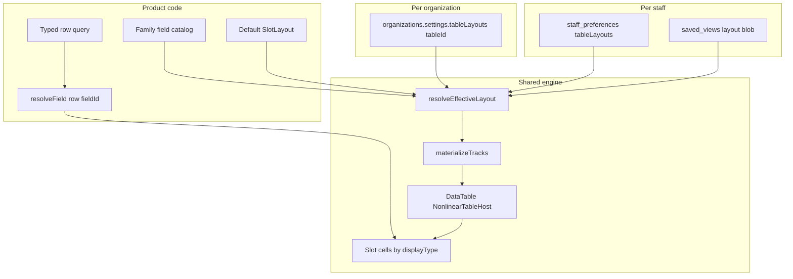

# Slot-based metadata-driven table (universal + per-org)

**Status:** plan of record · **Written:** 2026-08-30 · **Branch:** `main`  
**Companion prompt:** [`slot-based-metadata-table-IMPLEMENTATION-PROMPT.md`](./slot-based-metadata-table-IMPLEMENTATION-PROMPT.md)  
**Kill list:** [`docs/kill-list/07-slot-table-hand-models.md`](../kill-list/07-slot-table-hand-models.md) — what dies, and why, per `tableId` (verified 2026-08-30).  
**Related:** [`nonlinear-data-table-engine-PLAN.md`](./nonlinear-data-table-engine-PLAN.md) · [`universal-table-connector-and-custom-columns-PLAN.md`](./universal-table-connector-and-custom-columns-PLAN.md) (custom field *values* are a different axis; slots bind catalog facts)

---

## THIS SHIP (operator deliverable)

**Scope lock:** implement and verify on **To-ship only** (`orders` / dashboard unshipped / `UnshippedTable`). Do **not** port pickup, Receiving, or customers in this ship.

**Must work when done:**

1. **Org-wide:** an admin binds which triage facts appear in status/subtitle slots; every staffer in that org sees that layout by default (`organizations.settings.tableLayouts.orders`).
2. **Catalog from backend:** facts come from the orders row the API already returns (tester, tested time, packer, packed time, pack station, scan-out who/when, qty, notes, stage, …). Bind those into slots — do not hard-code a forever `tested` React column.
3. **To-ship is the sole verification surface.** Other pages wait until To-ship is signed off. Keep the kernel generic so later ports are checklist work only.

**Out of this ship:** Phase 3+ family mounts (pickup, customers, …). Phases 0–2 (+ optional sheet morph on To-ship only) are in scope.

---

## 0. What you are building

One display system that any **information table** in Cycle Forge mounts:

- To-ship orders
- Local pickup
- Customers (when registered as a product table)
- Receiving, repair, warranty, catalog, FBA, …

Each table keeps its **own data** (typed row feed + field catalog). Every table shares the **same slots, budgets, morphs, picker, and org-capture** mechanism.

An organization does **not** invent columns. It **binds** catalog fields into fixed slots (“what matters here”), and staff can personalize on top. That is the sellable multi-tenant model — not Airtable.

```text
PRODUCT  (code)     field catalog + default layout per tableId
   ↓ merge
ORG      (settings) tableLayouts[tableId] — what this tenant cares about
   ↓ merge
STAFF    (prefs)    optional personal delta
   ↓ merge
SAVED VIEW          named snapshot (filter + sort + layout)
   ↓
materializeTracks → DataTable / LedgerGrid
```

---

## 1. Exact vocabulary

| Term | Meaning |
|---|---|
| **Entity family** | Typed row shape + cell resolvers (`orders`, `pickup`, `receiving`, …) — already [`TABLE_ENTITY_FAMILIES`](src/lib/tables/table-definition.ts) |
| **Product table** | Launchable collection in [`PRODUCT_TABLES`](src/lib/tables/table-catalog.ts) / [`REGISTERED_BINDINGS`](src/components/tables/registered-bindings.ts) |
| **Field catalog** | Code-owned list of bindable facts for one family (`pickup.ready_at`, `orders.tested`, …) |
| **Presentation slot** | Fixed place on the skeleton: identity, `status:1…10`, `subtitle:1…5` |
| **Binding** | `slot ← fieldId` |
| **Layout** | `{ morph, identityFieldId, statusBindings, subtitleBindings }` |
| **Morph** | `sheet` (one-line Google Sheet) or `compound` (two-line WMS row) |
| **Org capture** | Org-admin saved default layout per `tableId` — “what’s important for us” |

**Not in vocabulary:** “Tested column component,” “Pickup-specific DataTable fork,” “customer grid that doesn’t share slots.”

---

## 2. Universal slot skeleton (identical for every table)

```text
[ select ] [ thumb? ]  IDENTITY  ·  STATUS×N  ·  (title+SUBTITLE on compound)
                       always      ≤10          ≤5 under title
                       · amount? · actions? · _fill
```

| Slot band | Cap | Who fills it | Rules |
|---|---|---|---|
| **Identity** | 1 | Family’s `id`-typed field | Always first data column. Not in picker. Not hideable. Order #, pickup ticket #, customer id — same *slot*, different *field*. |
| **Status** | 0–10 | Any field with `slotKinds` including `status` (typically `stage_event`, `tag`, `person`, `date`) | Header label = field label. Empty binding → no track. Rebind keeps key `status:N`. |
| **Subtitle** | 0–5 | Fields allowed under title (`text`, `note`, `number`, …) | Compound: paint under title. Sheet: each becomes its own track. |
| **Amount** | 0–1 | Optional family money field | Capability / catalog flag, not a free status slot. |
| **Actions** | 0–1 | Capability `recordPlane` / actions | Family decides; not org-authored. |

Budgets align with existing dense ceiling [`MAX_DEFAULT_VISIBLE_TRACKS = 10`](src/lib/tables/table-definition.ts).

When status slots are full, the picker shows: **“Status limit (10) reached — remove one to add another.”** Same for subtitle (5).

---

## 3. Architecture



**Polymorphism rule:** the engine never branches on `if (family === 'orders')` for chrome. It branches on `displayType` and slot key. Family code only supplies catalog + resolver + feed.

---

## 4. Data contracts (Zod, pure JSON)

### 4.1 Field definition

Module: `src/lib/tables/field-catalog/`

```ts
type FieldDisplayType =
  | 'id' | 'text' | 'number' | 'tag' | 'date'
  | 'person' | 'stage_event' | 'money' | 'note' | 'tracking';

type SlotKind = 'identity' | 'status' | 'subtitle' | 'amount';

interface FieldDef {
  id: string;                 // 'orders.tested' | 'pickup.status' | 'customers.phone'
  family: EntityFamily;       // must match TABLE_ENTITY_FAMILIES
  label: string;
  displayType: FieldDisplayType;
  slotKinds: readonly SlotKind[];  // where this field may bind
  iconKey?: string;           // stage_event header glyph
  /** Row property paths the family resolver understands. */
  paths: Readonly<Record<string, string>>;
}
```

Catalogs are **arrays registered by family**. Guard: every `REGISTERED_BINDINGS` family that opts into slots has a catalog module; `field-catalog.guard.test.ts` asserts coverage for opted-in families.

Custom fields ([`src/lib/schemas/custom-fields.ts`](src/lib/schemas/custom-fields.ts)) append into the catalog at runtime as `text`/`number`/`tag`/`date` only, ids like `orders.cf.<key>` — still no DDL from the picker.

### 4.2 Slot layout

```ts
interface SlotLayout {
  morph: 'sheet' | 'compound';
  identityFieldId: string;
  statusBindings: Array<{ fieldId: string }>;    // length 0..10
  subtitleBindings: Array<{ fieldId: string }>;  // length 0..5
  amountFieldId?: string | null;
}

const MAX_STATUS_SLOTS = 10;
const MAX_SUBTITLE_SLOTS = 5;
```

`parseSlotLayout(family, layout, catalog)` rejects:

- unknown / wrong-family fieldIds
- duplicates
- over-budget arrays
- identity field not `slotKinds`⊇`identity` and `displayType:'id'`
- status bind of a field that forbids `status`
- subtitle bind of a field that forbids `subtitle`

### 4.3 Effective layout cascade

```ts
function resolveEffectiveLayout(args: {
  family: EntityFamily;
  tableId: string;
  productDefault: SlotLayout;
  orgLayout?: SlotLayout | null;      // organizations.settings.tableLayouts[tableId]
  staffLayout?: SlotLayout | null;    // staff_preferences.prefs.tableLayouts[tableId]
  savedViewLayout?: SlotLayout | null;
}): SlotLayout
```

**Merge policy (locked):** last non-null **wins as a whole document** (not deep-merge of bindings). Rationale: partial merges of status arrays produce silent half-configs. Editors always load-edit-save the full layout.

Precedence: `savedViewLayout ?? staffLayout ?? orgLayout ?? productDefault`.

Validation runs after resolve against the family catalog (stale fieldIds dropped with a soft warn in logs; layout still paints).

---

## 5. Per-organization capture (“what’s important for us”)

### 5.1 Storage

Add under org settings JSONB (existing [`organizations.settings`](src/lib/tenancy/settings) / settings registry pattern):

```ts
// organizations.settings
{
  tableLayouts: {
    orders: SlotLayout,
    pickup: SlotLayout,
    // customers: SlotLayout, …
  }
}
```

Zod in settings registry (`src/lib/settings/`). Permission: org settings manage (same gate as other org prefs). Migration: none required if JSONB bag already free-form — only schema validation on write.

### 5.2 Admin UX

Settings → **Tables** (or per-station “Display” section):

1. Pick a product table (from [`PRODUCT_TABLES`](src/lib/tables/table-catalog.ts))
2. See morph + identity (read-only label) + status/subtitle bindings
3. Same Fields picker as the floor (bind / unbind / reorder / limit copy)
4. **Save as organization default** — writes `tableLayouts[tableId]`
5. **Reset to product default** — deletes org override

Floor Fields menu has a secondary action for admins: **“Save as org default”** (one extra confirmation — stays inside interaction budget).

### 5.3 Staff vs org

| Actor | Can do |
|---|---|
| Org admin | Set org default layout per table |
| Any staff | Personal override (staff prefs) and/or named saved view |
| System | Product default in code |

Staff opening To-ship with no personal override sees **org** layout (e.g. that tenant bound Packed into status:2). Another tenant may only bind Tested.

---

## 6. Scoping any table — adoption contract

To put **any** collection on this system (Local pickup, customers, …), implement exactly these artifacts. No new DataTable component.

### Checklist (copy per family)

1. **Family id** in `TABLE_ENTITY_FAMILIES` + binding in `REGISTERED_BINDINGS` (pickup already has [`PICKUP_TABLE_BINDING`](src/components/receiving/pickup/grid/pickup-table-definition.ts)).
2. **Field catalog** `src/lib/tables/field-catalog/<family>.ts` — every bindable fact with `slotKinds`.
3. **Resolver** `resolve<field>Field(row, fieldId): SlotValue` — pure, unit-tested.
4. **Product default `SlotLayout`** — identity + 0..N status/subtitle bindings that match today’s useful columns.
5. **Mount** — host calls `resolveEffectiveLayout` → `materializeTracks` → existing `DataTable` / `NonlinearTableHost`; pass slot values into shared cells.
6. **Saved-view surface** — ensure `SAVED_VIEW_SURFACES` includes the desk if named views should carry layout.
7. **Org key** — `tableLayouts[tableId]` uses the same `tableId` as `PRODUCT_TABLES`.
8. **Guard** — catalog registered; default layout parses; materializer smoke test.

Families **not** yet opted in keep today’s hand column arrays. Opt-in is explicit (feature flag or binding flag `slotLayout: true`) so rollout is not a big bang.

---

## 7. Worked examples

### 7.1 To-ship (`orders`)

| Slot | Product default binding |
|---|---|
| Identity | `orders.order_id` |
| Status 1 | `orders.tested` (catalog bind only — never a hard-coded `tested` track) |
| Status 2–3 | org-optional: `orders.packed`, `orders.scanned_out` |
| Subtitle | org-ordered band — e.g. `qty` · `condition` · `notes`; also `item_number`. **Not** product title (title is the item primary). |
| Morph | `compound` |

Org A might bind only Tested. Org B binds Tested + Packed + Scanned out. Subtitle order is `subtitleBindings[]` order (highly configurable per org). Same engine.

**Operator UX locks (2026-08-30 — see implementation prompt):**

- Qty under title = **number only** + [`orderRowQtyTone`](../../src/lib/condition-tone.ts) (1 muted / >1 warning).
- `stage_event` top line = **one-word** done/empty verbs (`Tested`/`Needed`, …) so empty and filled keep column width; never “Need to test.”
- No product-title duplicate under the title; `item_number` + **inline-editable condition** are subtitle-capable.
- No forever hard-coded Tested/Packed/Scanned-out React columns — display from backend row facts via catalog + resolver + bindings.

### 7.2 Local pickup (`pickup`)

Already a product table. Example catalog (illustrative — finalize against [`PickupLine`](src/components/receiving/pickup/pickup-lines.ts) / grid layout):

| Field id | displayType | slotKinds |
|---|---|---|
| `pickup.order_id` | id | identity |
| `pickup.status` | tag | status |
| `pickup.ready_at` | date | status |
| `pickup.customer_name` | text | subtitle |
| `pickup.phone` | text | subtitle |
| `pickup.note` | note | subtitle |

Product default: identity = order id; status:1 = pickup status; subtitle = customer name. Org that cares about phone binds it into subtitle:2.

### 7.3 Customers (future / new family)

Not yet in `PRODUCT_TABLES`. When added:

1. Register `customers` family + browse binding + feed API.
2. Catalog: `customers.id` (identity), `customers.status` / `customers.last_order_at` (status), `customers.email` / `customers.phone` / `customers.company` (subtitle).
3. Same slots, same picker, same org `tableLayouts.customers`.
4. Morph default `sheet` (CRM-ish one-line) or `compound` — product choice in the default layout only.

**Customers do not get a different table chrome.** They get a different catalog.

### 7.4 Receiving (later port)

Receiving stays the compound golden visually; catalog maps today’s tracks (title, stage, platform, …) into identity/status/subtitle. Proves high-density port without redesigning Unbox.

---

## 8. Engine internals

### 8.1 `materializeTracks(layout, catalog, morph) → ColumnModel[]`

1. `select` (+ `thumb` if compound)
2. Identity track — key `identity`, label from field, frozen
3. For each status binding `i`: track key `status:${i+1}`, label from field, width by displayType defaults
4. Compound: single `item` track (title from catalog title field if present, else first text; subtitles inside cell)
5. Sheet: one track per subtitle binding (`subtitle:${i+1}`)
6. Optional amount / actions / `_fill`

Track keys are **slot indices**, never field ids — rebinding does not invalidate `staff_preferences.tableColumns` width maps keyed by slot.

### 8.2 Cells

| displayType | Compound paint | Sheet paint |
|---|---|---|
| `id` | order/customer chip stack | same, single line |
| `stage_event` | icon+label / who·time·station (generalized Slice 1) | one line `label · who · time` |
| `tag` | pill / secondary | pill |
| `date` / `person` / `text` / `note` / `number` / `money` / `tracking` | existing grid cell atoms | same |

Delete hard-coded `tested` step union; `CompoundStageStep` takes `FieldDef` + `SlotValue`.

### 8.3 Host mount (every opted-in table)

```ts
const layout = resolveEffectiveLayout({ … });
const columns = materializeTracks(layout, catalog);
const slotValues = bindRowSlots(row, layout, resolveField);
// DataTable / NonlinearTableHost as today
```

---

## 9. Operator + admin UI

### Floor (To-ship — primary affordance)

**+ button → shadcn/Radix Popover** on the To-ship table chrome (route-scoped to `tableId` / `orders`):

1. Trigger: a **+** control on the data-table toolbar / header band for the current page route only.
2. Panel: [`Popover` / `PopoverTrigger` / `PopoverContent`](src/design-system/primitives/radix-popover.ts) (CNUI / shadcn — not a bespoke floating panel).
3. Content: catalog fields for this family, grouped; toggles to **add** or **remove** bindings from status / subtitle slots (identity excluded).
4. Limits: at 10 status or 5 subtitle, show explicit “limit reached” copy; do not silently ignore.
5. Persist: staff override by default; admin secondary action **Save as organization default** (confirm).
6. Interaction budget: open + (1) → toggle field (2) → optional org save confirm (3).

Capability `fieldsMenu: true` is satisfied by this + Popover — do not resurrect the deleted Sheets column-picker toolbar row.

### Settings

- Tables → per-`tableId` layout editor (same binding list, no live queue required) for org admins who prefer Settings over the floor.
- Reset to product default.

---

## 10. Phased delivery

### Phase 0 — Kernel (no visual change except tests)

- Zod: `FieldDef`, `SlotLayout`, budgets, `parseSlotLayout`
- `resolveEffectiveLayout` + unit tests (cascade precedence, stale field drop)
- `materializeTracks` pure tests
- Orders catalog stub (enough for tested) + guard scaffolding
- Flag: no production mount yet

### Phase 1 — To-ship dogfood

- Mount Orders compound via materializer
- Absorb Slice 1 `tested` → `status:1` / `orders.tested`
- Visual parity; e2e `data-col="status:1"`; remove `data-col="tested"`
- `npm run verify`

### Phase 2 — Org + staff capture

- `organizations.settings.tableLayouts`
- Staff `prefs.tableLayouts` (sibling of existing `tableColumns` widths — widths stay keyed by slot)
- Fields picker on To-ship writing staff layout; admin “Save as org default”
- Saved view `layout` blob on `dashboard_unshipped`
- Inheritance e2e: org binds Packed → staff without override sees it

### Phase 3 — Local pickup (universal proof)

- Full `pickup` catalog + default layout
- Opt in `PICKUP_TABLE_BINDING` to slot materializer
- Org can capture pickup-specific status/subtitle bindings
- Proves second family, same engine — **this is the “scope to any table” milestone**

### Phase 4 — Sheet morph + subtitles

- `morph: 'sheet'` paint path for Orders (and pickup)
- Subtitle slots: qty | notes under title (compound) / columns (sheet)

### Phase 5 — Customers + remaining PRODUCT_TABLES

- Register customers family if product wants it; otherwise roll Receiving / repair / warranty / catalog using the adoption checklist
- Custom fields appear in catalogs
- Horizon C: optional publish layout templates across orgs (secondary)

---

## 11. Explicit non-goals

- Airtable / user-authored tables / arbitrary SQL columns
- Schema-per-tenant or per-org DDL
- Unlimited columns
- Deep-merge of partial binding arrays
- In-cell lifecycle edits bypassing `transition()` / confirm dialogs
- Big-bang rewrite of all `REGISTERED_BINDINGS` before Phase 3
- A second grid engine for “CRM-like” customers

---

## 12. Test plan (by phase)

| Phase | Tests |
|---|---|
| 0 | Zod budgets; cascade precedence; materializeTracks keys stable under rebind |
| 1 | Orders resolver; To-ship visual/e2e status:1; verify green |
| 2 | Org write ACL; staff override masks org; saved view round-trip; limit copy at 10 |
| 3 | Pickup catalog parse; pickup mount; org layout on pickup does not affect orders |
| 4 | Morph sheet/compound same bindings; subtitle paint |
| 5 | Adoption checklist guard for each newly opted-in family |

---

## 13. Relationship to prior work

| Prior | Role |
|---|---|
| Slice 1 hard-coded Tested column | Prototype `stage_event` cell → absorbed Phase 1 |
| [`TableDefinition`](src/lib/tables/table-definition.ts) | Still shell/capabilities; **layout** becomes `SlotLayout` (composed or sibling) |
| [`PRODUCT_TABLES`](src/lib/tables/table-catalog.ts) / bindings | Enumeration of tables that *can* opt into slots |
| [`PICKUP_TABLE_BINDING`](src/components/receiving/pickup/grid/pickup-table-definition.ts) | Phase 3 proving ground |
| Horizon C briefing | Custom fields + org templates compound **on** this kernel |
| Staff `tableColumns` widths | Keep; key by slot ids (`status:1`), not field ids |

---

## 14. Success criteria (product)

1. **Any** opted-in table uses the same slot skeleton and picker.
2. An org admin can capture “our To-ship shows Tested+Packed” and “our pickup shows Status+Phone” without code.
3. A new family (customers) is a catalog + feed + default layout — **not** a new table product.
4. Floor operators still hit interaction budgets; dense 1080p queues stay within slot caps.

---

## 15. Kill list (what the engine replaces)

The product tables **stay**. The hand-authored column models **die**. Full inventory, evidence, and per-family why: [`docs/kill-list/07-slot-table-hand-models.md`](../kill-list/07-slot-table-hand-models.md).

**Why they must die:** a `*_GRID_COLUMNS` array is a frozen layout in field-id language (`tested`, `packer`, `qty`). An org cannot bind/unbind those facts without a deploy. That is the “Tested column component” / “pickup-specific DataTable fork” this plan forbids. `materializeTracks` is the only layout SoT: track keys are slot indices; catalogs are bindable vocabulary; `tableLayouts[tableId]` is what tenants write.

| Wave | Plan phase | Kill |
|---|---|---|
| 1 — this ship | 1–2 | `ORDERS_QUEUE_COLUMNS` forever tracks; `ORDERS_TESTED_TABLE_BINDING` / `fulfillment.tested` (layout as a second definition); `TABLE_COLUMNS.orders` hide-by-field-id. Keep `ordersCompoundColumnsFor` + catalog. One Orders binding when done. |
| 2 | 3 | `PICKUP_GRID_COLUMNS` (+ `TABLE_COLUMNS.pickup`). Binding stays. |
| 3 | 5 | The other 18 `PRODUCT_TABLES` hand arrays. **Ready** still paints `key: 'tested'` / `data-col="tested"` — same disease, other desk. |
| Out of waist | later | `StationListTable` (Tech/Packer history) — not in `PRODUCT_TABLES`; kiosk `CART_COMPOUND_COLUMNS`. |

**Do not kill:** `DataTable`, Fields `+` popover, `LedgerGrid`, feeds, `REGISTERED_BINDINGS` ids. `fieldsMenu: true` on a family with no catalog is a lie — do not build a picker on a hand array; opt in first.

Verified 2026-08-30: 20 product tables, 2 Orders bindings, **1** field catalog (orders), 21 hand column arrays, Ready’s forever Tested track still live.
