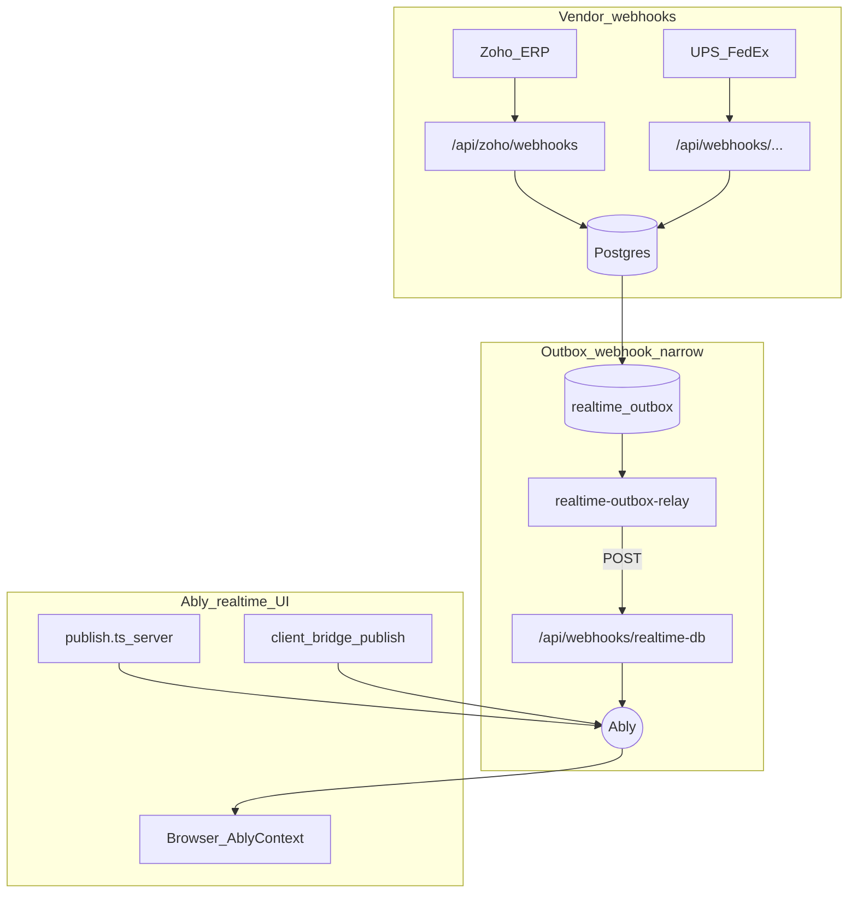
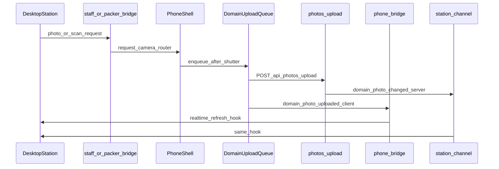

# Research briefing — Station realtime + capture visibility (cross-station SoT)

**For:** Gemini Pro (deep research) — you do **not** have the codebase; every product fact below is embedded. Do not invent file paths or claim to have inspected source.  
**From:** Cycle Forge engineering  
**Date:** 2026-08-01  
**Subject:** Paired desk↔phone evidence capture, upload visibility, Ably (“LB websocket”) reliability chrome, and webhook vs realtime planes — as a **Source of Truth for every Station-contract bench**, not an Unbox feature.  
**Deliverable:** (a) 2026 industry pattern language for paired-device capture + realtime reliability UX; (b) forced D1–D12 rulings reconciled to house SoTs; (c) three state machines; (d) phased P0–P3; (e) ≤40-line Claude Code P0 prompt.  
**Companion package:** [`station-realtime-capture-visibility-INDEX.md`](./station-realtime-capture-visibility-INDEX.md) · [`station-realtime-capture-visibility-CLAUDE-CODE-PROMPT.md`](./station-realtime-capture-visibility-CLAUDE-CODE-PROMPT.md)

**This brief is NOT** “replace Ably with SSE,” “redesign Unbox only,” “invent a second realtime bus,” or “toast-as-completion.” Answers that only fix Unbox and leave Pack/Testing with a second grammar **fail**.

---

## 0. How to use this brief

### 0.1 Two questions (keep separate)

1. **What is the 2026 industry standard** for *paired desk + phone evidence capture* and *realtime reliability UX* on a scan floor (WMS/MES/ops)? Named systems, cited sources, dominant patterns — not “it depends.”
2. **What is right for *this* SoT stack?** Reconcile the standard against §1–§5 hard constraints. Where industry conflicts with a constraint, name the conflict and pick a side for Cycle Forge.

Then give: **cross-station architecture + three state machines + phases + Claude P0 prompt**, tight enough to implement without re-litigating.

### 0.2 Non-goals / anti-patterns (DO NOT PROPOSE)

- Do **not** research replacing Ably with SSE for photo bridges (ruled out).
- Do **not** invent a second realtime bus.
- Do **not** propose toast-as-completion (violates Station law).
- Do **not** propose a page-local upload strip twin per route/station.
- Do **not** propose raising Design System ratchet baselines.
- Do **not** propose an Unbox-only solution that Pack/Unit/Testing cannot mount.
- Goal is **operator-visible reliability and capture/upload status**, not a new transport.

### 0.3 Region contracts (mandatory vocabulary)

| Contract | Driven by | Job | Selection | Density |
|---|---|---|---|---|
| **Station** | barcode / camera | act-and-clear | ephemeral | `floor` |
| **Workbench** | pointer | pick → edit → persist | durable, URL | `ops` |
| **Monitor** | filters over a stream | observe only | none | `rollup` |
| **Canvas** | pan/zoom | reshape a definition | durable focus | `studio` |

This brief owns **Station** (+ Monitor degrade parity for connection chrome only).

---

## 1. Vocabulary + physical bench reality

**Cycle Forge** — multi-tenant reseller-operations SaaS (receive → unbox → triage → test → repair → catalog → pack → ship → warranty). USAV is dogfood only.

**Kinetic Ledger** — UI identity: dense, state-colored, scan-aware; **legible throughput over document calm**.

**Station laws** (house — from `display/station.md`):

- **One active entity** at a time (carton / order / unit).
- **Act-and-clear** — workflows are definitive; state advances.
- **Pass/fail as big card** — success, failure, and blocking status are primary in-place card state. Toasts are ephemeral hints, *never* sole workflow completion.
- **OfflineBanner as station-down singleton** — represents browser network dropping, not every granular subsystem failure (Session 3 may extend it to Ably *degraded* with distinct copy — still one banner SoT).

**Physical reality (every Station bench):**

| Fact | Value |
|---|---|
| Display | 1080p landscape (desk); phone as second terminal |
| Viewing distance | ~3 ft standing |
| Posture | hands on product + scanner/camera |
| Primary input | scanner / camera, not pointer |
| Wi-Fi | warehouse — unreliable; queues must accept work offline |
| Session | minutes, high repetition |

**Universal capture grammar (already decided):** all stations migrate onto a bottom-anchored capture stack — input anchored at bottom; current task above; completed actions collapse to one-line bars pushed into a scrollable ledger. Phone and desktop share the structure; viewport only changes how much is simultaneously visible. (Plan: `unbox-capture-stack-PLAN.md`.)

---

## 2. Three planes (measured architecture)

Clarification: when operators say **“LB websocket,”** they mean **Ably** (Realtime WebSocket/SSE under the Ably SDK) — not the Neon Postgres WebSocket pool, and not a generic load-balancer health probe.



| Plane | Job | Key paths (embedded) |
|---|---|---|
| **Vendor webhooks** | Ingest ERP / carriers into Postgres | `/api/zoho/webhooks`, `/api/webhooks/{ups,fedex,…}` → DB |
| **Ably realtime** | Live UI invalidation + desk↔phone bridges | `src/lib/realtime/channels.ts`, `src/lib/realtime/publish.ts`, `src/contexts/AblyContext.tsx`, `GET /api/realtime/token` |
| **Outbox webhook** | Durable DB→Ably for **narrow** tables | `scripts/realtime-outbox-relay.js` → `POST /api/webhooks/realtime-db` → `db:*` channels |

**Crucial facts:**

- Outbox is highly narrow today (essentially `repair_service` triggers). Most station domain events use **best-effort** `publish.ts` after commit.
- Photos do **not** use GCS/NAS/vision **inbound webhooks**. Upload = `POST /api/photos/upload`; analyze/nas-mirror = crons.
- Vendor webhooks never own operator capture chrome. They write DB; UI learns via later mutations, polls, or Ably publishes from those mutations.
- Token auth: `clientId = org:{orgId}:staff:{staffId}`; per-staff bridges grant subscribe+publish for **this staffId only**; org broadcast channels are subscribe-only.

Stale doc warning: some older maps claim “always go through outbox” and “anti-pattern: publish from API route.” **Reality:** almost all station domains publish directly via `publish.ts`. Prefer `docs/integrations/realtime-ai.md` as the short Ably reference.

---

## 3. Station inventory matrix (SoT scope)

Gemini must prescribe **one** visibility + pairing SoT that covers every row via adapters. Unbox-only answers fail.

| Station bench | Desktop surface (examples) | Phone / second terminal | Send-to-device signal | Upload queue singleton | Desk refresh / feedback today |
|---|---|---|---|---|---|
| **Triage** | Receiving triage workspace, claim photo picker | Mobile triage / receiving camera | `receiving_photo_request` (stage `arrival_package`) via `publishReceivingPhotoRequest` on `staffstation:{staffId}`; share-to-phone ACK path | `PhotoUploadQueue` | `useReceivingPhotosRealtimeRefresh` + toasts / `photo_count` |
| **Unbox** | Unbox workbench, photo pill, procedure stack | `/m/r/{id}/photos`, PO item photos; `ReceivingPhotoRequestCamera` auto-routes | same bridge + stage (`unbox_carton` / `unbox_item`) | `PhotoUploadQueue` | same + partial capture-stack |
| **Testing** | Testing bench, unit context | `UnitPhotoRequestCamera` → `/m/unit-photos/{id}` | `unit_photo_request` on `staffstation:` | `UnitPhotoUploadQueue` | `useUnitPhotosRealtimeRefresh` + toasts |
| **Pack** | `StationPacking`, `PackSendToPhoneButton` | Packer camera / `scan_ready` receiver | `scan_ready` on `packer:{staffId}` (client and/or server `publishPackerScanReady`) | `PackerPhotoUploadQueue` | `usePackerPhotosRealtimeRefresh` + toasts |
| **Shipping** | Ship station active order | Phone as scan/photo peer where wired | domain Ably (`shipment.changed` / order events) | no third strip | active-card laws + OfflineBanner |
| **Pickup** | Pickup active order | Same Station laws | same pattern family | — | `ActiveOrderScanFeedback`-style card |
| **FBA** | FBA prep / sidebar scan | Mobile FBA where present | org `station:` / FBA channels | — | station patterns |
| **Shared phone shell** | — | `ReceivingPhoneBridgeMount` + unit/packer receivers in mobile / immersive layouts | all `staffstation:` / `phone:` / `packer:` events | all three queues | `PhotoUploadToaster` only (toast coalescer) |

**Pattern:** three queue singletons + multiple Ably events — **one** operator-visible status grammar required. That grammar is the SoT this brief must name.

---

## 4. Send-to-device + upload flow (station-generic, measured)

Domain adapters swap event name / queue / entity id. Receiving is the richest exemplar.



**Receiving exemplar detail:**

1. Desktop publishes `receiving_photo_request` on `org:{orgId}:staffstation:{staffId}` (`publishReceivingPhotoRequest` / `buildReceivingPhotoRequestPayload` — stage + optional `receiving_line_id` + `po_ref`).
2. Phone `ReceivingPhotoRequestCamera` (mounted in global mobile shell) normalizes payload and `router.push`es to capture href — **no confirm sheet** on scan-driven requests (“scan is intent”).
3. Parallel path: explicit share-to-phone publishes `receiving_share_to_phone`, waits ≤6s for `receiving_share_ack` — **this ACK pattern is the pairing handshake SoT to grow**.
4. Capture → `PhotoUploadQueue.enqueue` (`queued → uploading → done | failed`); localStorage mirror; `retry()` exists on the singleton.
5. Upload succeeds → client notifier publishes `receiving_photo_uploaded` on `phone:{staffId}`; server `after()` publishes `receiving-photo.changed` on org `station:changes`.
6. Desktop `useReceivingPhotosRealtimeRefresh` listens to both; UI mostly shows server `photo_count` + short toasts.

**Pack / Unit** mirror the same shape with `scan_ready` / `unit_photo_request` and their queue singletons + refresh hooks.

---

## 5. Reliability inventory (gaps you must address)

Pipeline quality (queue + dual Ably refresh + stage-aware requests) is high. Premium Station UX fails because:

1. **Upload state is invisible** — `queued → uploading → done|failed` exists in three queue singletons; UI is optimistic “Uploading…” toast then navigate away; `PhotoUploadToaster` coalesces done/failed toasts ~500ms later; `retry()` has **no UI consumer**. Server truth is `photo_count` after Ably refresh.
2. **Bridge signals are ephemeral** — client Ably publishes for camera open / share / unit / packer ready. If the phone is asleep or Ably blips, the request is missed. No durable retry for the *open camera* signal.
3. **Connection health is browser-offline only** — `OfflineBanner` / TV “Reconnecting” use `navigator.onLine`. Ably `disconnected|suspended|failed` is silent except silent React Query reconnect invalidation. Missed events while “online” but Ably-down are invisible.
4. **Dead / half bridge** — `phone_scan` subscribers exist on desktop; **no in-repo publisher**. Hygiene debt on the receiving bridge family.
5. **Doc confusion** — Feature_Interaction_Map-style “always outbox” is stale. Outbox is not used for photos or most station events.
6. **Blind desktop after send-to-device** — “Sent to phone” / “Shared to your phone” then wait for a count tick. No capturing / offline / unreachable card state on Pack or Receiving.
7. **Fork risk** — if Unbox gets a capture-stack upload ledger and Pack keeps toaster-only, Station SoT law is broken.

---

## 6. Sibling briefs (cite — do not redo)

| Sibling | Owns | This brief |
|---|---|---|
| `display/station.md` | Station contract | Hard law |
| `unbox-capture-stack-PLAN.md` | Universal stack; all stations migrate | Visibility home |
| `mobile-unbox-photo-flow-GEMINI-RESEARCH-BRIEFING.md` | Phone unbox display | Named toast-vs-queue gap |
| `photo-evidence-chain-INDEX.md` | Stage / evidence | Not transport |
| `home-ops-tv-collab-surfaces-plan.md` | TV Ably degrade intent | Session 3 parity |
| `docs/integrations/realtime-ai.md` | Ably short reference | Prefer over stale maps |

---

## 7. Industry survey asks (answer with named systems)

Cover at least:

1. **WMS / MES paired-device capture** — How do high-end warehouse systems prompt a handheld/phone from a desk scan station? What is the ack / miss / retry pattern language?
2. **Fintech / ops “sync status” chrome** — How do premium B2B products show durable offline queues and sync health without toast spam?
3. **Warehouse offline queues** — Fieldwire, Samsara, Shopify POS-class (or peers): visible retry, queue depth, failure as primary state.
4. **Realtime connection affordances** — When WebSocket/realtime drops while `navigator.onLine` is true, what do floor / TV UIs show? Map to Station density `floor` at ~3 ft (short copy, not vendor jargon).

Where industry splits, give both positions, then pick for **this** product and say why.

---

## 8. Forced decisions D1–D12 (strawman for attack)

Validate, adjust, or attack each row. Unbox-only variants of D1/D5 fail.

| ID | Decision | Strawman |
|---|---|---|
| **D1** | Upload visibility home | Embed progress in **active-entity / universal capture-stack card** — not a new global dock. Toast banned as sole signal. |
| **D2** | Desk waiting-on-device | Shared pairing timeout/ACK SoT grown from share-to-phone ≤6s; same UX on Receiving send + Pack send-to-phone. Show “Phone unreachable” on timeout. |
| **D3** | Request durability | P0–P2 stay **ephemeral** Ably + explicit unreachable UI; durable claim/outbox = **P3 ask-first** only if miss-rate demands. |
| **D4** | Ably connection chrome | Extend **OfflineBanner SoT** to track Ably `connectionState` (distinct copy from browser offline). No per-bench reconnect strip. |
| **D5** | Queue compound | One generic CaptureUpload visibility compound; domain stores (receiving/packer/unit singletons) stay separate. |
| **D6** | Desk while peer capturing | Always-on status/ledger on the **focused station’s active entity card** — not count-tick alone. |
| **D7** | Doc remediation | Kill stale “always outbox” guidance; outbox remains narrow; photos stay direct API + Ably fanout. |
| **D8** | Dead `phone_scan` | Delete orphan subscribers; HTTP submit + org Ably refresh — do not revive the dead event. |
| **D9** | Audio/haptic | Paired requests (receiving/unit/packer) trigger OS haptic on phone where available. |
| **D10** | Reduced motion | Status compound uses house motion SoT / reduced-motion floor. |
| **D11** | Multi-device | Same `staffId` on multiple phones: **last-active wins** (channel is the gate today). |
| **D12** | Monitor/TV | Read-only connection/status — never “Uploading…” modals on TV. |

---

## 9. Required output shape

1. **Industry pattern language** — concise, named systems (§7).
2. **Architecture recommendation** — reconciled to SoTs + your D1–D12 rulings; adapter map for each bench in §3.
3. **State machines** — Upload Visibility, Pairing Heartbeat, Connection Health (one set for all stations).
4. **Phased implementation**
   - **P0:** Visibility compound without transport change — Receiving **and** Pack or Unit in the same slice.
   - **P1:** Pairing reliability UI (ACK/timeout).
   - **P2:** OfflineBanner + Ably connection chrome.
   - **P3:** Optional durable requests (ask-first).
5. **Claude Code execution prompt** — ≤40 lines for **P0 only**; must forbid Unbox-only fork and SSE/new bus.

---

## 10. Paste prompt for Gemini

```
You are our Principal Architect. Read the briefing above end-to-end.

Execute the required output shape (§9) in clear, highly-scannable markdown.

Treat this as a Source of Truth for all Station benches, not an Unbox redesign.
Adhere strictly to Station laws, the non-goals (no SSE, no new bus, no per-station
upload-strip twins), and the physical bench reality (~3 ft, scan-first).

Attack or validate decisions D1–D12 to form your final architecture recommendation.
Deliver the final P0 Claude Code prompt (≤40 lines) at the end.
```

---

## Appendix A — Engineering lean (attack this)

Preliminary architecture from codebase research. **Not ratified law** — pressure-test it.

| Layer | Lean | Why |
|---|---|---|
| Transport | **Keep Ably** for bridges + invalidation | Bidirectional, org-scoped token ACL, shared by photo/unit/packer/inbox |
| Vendor webhooks | Stay DB-first ingest; never operator capture chrome | Different plane |
| Outbox | Stay narrow; do **not** expand to photo requests in P0–P2 | Durable photo truth is the Postgres row after upload |
| Visibility | Compose into capture stack / active entity card | Station law + universal stack decision |
| Pairing | Explicit waiting + timeout (P1) before durable requests (P3) | Cheapest reliability win; share-ack already exists |
| Connection | Grow OfflineBanner SoT to Ably degraded (P2) | Singleton station-down; TV reuses |
| Queues | Keep three singletons; **one** visibility compound | Avoid page-local twins (D5) |
| P0 proof | Receiving **and** Pack or Unit in same slice | Enforces SoT, not exemplar drift |

### A.1 Draft state machines (refine)

**Upload visibility**

```
idle → capturing → queued → uploading → committed
                              ↘ failed → retry → uploading
committed → collapse_to_history_bar / photo_count_truth
```

**Pairing heartbeat (desk after send-to-device)**

```
idle → request_sent → peer_active (ack_or_camera_opened within T)
                  ↘ timed_out → phone_unreachable
peer_active → uploads_visible → idle
```

**Connection health (OfflineBanner growth)**

```
online_realtime → browser_offline
               → ably_degraded
               → recovering → online_realtime
```

Copy at 3 ft: short (“Station sync paused”), not Ably jargon.

### A.2 Phased map (post-research)

| Phase | Scope |
|---|---|
| P0 | Visibility compound + `retry()` on Receiving + Pack **or** Unit; toaster demoted to echo |
| P1 | Shared waiting/timeout after any send-to-device |
| P2 | OfflineBanner tracks Ably; all stations/TV inherit |
| P3 | Durable requests only if measured miss-rate requires (ask-first) |

---

## Appendix B — Channel / event inventory

| Channel family | Events | Direction | Durable? | Stations |
|---|---|---|---|---|
| `staffstation:{staffId}` | `receiving_photo_request`, `unit_photo_request`, `receiving_share_to_phone`, `receiving_share_ack`, `phone_scan_result` | Desk↔phone | No (client) | Triage, Unbox, Testing, claims |
| `phone:{staffId}` | `receiving_photo_uploaded`, `unit_photo_uploaded`, `phone_scan` (orphan sub) | Phone→peers | No | Receiving, Unit |
| `packer:{staffId}` | `scan_ready` | Desk→phone | No / server best-effort | Pack |
| `scanlog:{staffId}` | `scan_logged` | Server→desk | No | Desk scan history |
| `station:changes` | `receiving-photo.changed`, `packer-photo.changed`, `unit-photo.changed`, log/shipment events | Server→all | No (direct publish) | All desks |
| `realtime_outbox` → `db:*` | row changed | Relay→clients | Yes (narrow tables) | Not station photo SoT |

---

## Appendix C — File index for implementers (after Gemini)

| Area | Paths |
|---|---|
| Queues | `src/components/mobile/receiving/PhotoUploadQueue.ts`, `…/packer/PackerPhotoUploadQueue.ts`, `…/unit/UnitPhotoUploadQueue.ts` |
| Bridges | `src/lib/realtime/receiving-photo-request.ts`, `ReceivingPhotoRequestCamera.tsx`, `UnitPhotoRequestCamera.tsx`, `PackSendToPhoneButton.tsx`, `ReceivingShareToPhoneSheet.tsx` |
| Refresh | `src/hooks/useReceivingPhotosRealtimeRefresh.ts`, `usePackerPhotosRealtimeRefresh.ts`, `useUnitPhotosRealtimeRefresh.ts` |
| Chrome | `src/components/layout/OfflineBanner.tsx` (+ station/mobile variants), `src/contexts/AblyContext.tsx`, `src/hooks/useAblyChannel.ts` |
| Feedback peers | `src/components/station/ActiveOrderScanFeedback.tsx`, `PhotoUploadToaster.tsx` |
| Channels / publish | `src/lib/realtime/channels.ts`, `src/lib/realtime/publish.ts`, `src/app/api/realtime/token/route.ts` |
| Laws | `.claude/rules/display/station.md`, `docs/todo/unbox-capture-stack-PLAN.md`, `docs/integrations/realtime-ai.md` |
| Handoff | `docs/todo/station-realtime-capture-visibility-CLAUDE-CODE-PROMPT.md` |

---

## Anti-summary (what a bad answer looks like)

- “Use SSE instead of Ably for photos.”
- “Add a toast when upload finishes” as the primary fix.
- “Build UnboxUploadStrip in the unbox page only.”
- “Put all station events through realtime_outbox in P0.”
- “It depends” with no forced D1–D12 picks.
- Framing Cycle Forge as a five-person shop tool.
