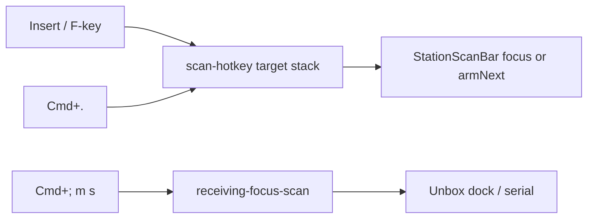

# Handoff — Station scan bar · ⌘. next-scan · keyboard gap close-out

**For:** implementing agent (Claude Code / Cursor / Codex)
**From:** Cycle Forge engineering
**Date:** 2026-08-09
**Predecessor (shipped):**
[`nav-keys-selection-keyboard-HANDOFF.md`](./nav-keys-selection-keyboard-HANDOFF.md) —
P0–P4 Unbox nav-keys (leader · Left · Middle carton-open · Right · Photos/Units/Linkage
verb letters · uniqueness + reachability guards · `?` cheat sheet · click nudges).
**Status:** ⌘. **next-scan** SHIPPED in `src/lib/scan-hotkey/`. This handoff is the
**close-the-gaps** backlog for scan-bar locus, discoverability, and sibling stations.
**Lane:** stay on the checkout's branch · attach to **`:3050`** · never start/restart/kill
the dev server · **user owns commits**.
**Product frame:** Cycle Forge multi-tenant reseller-ops SaaS; USAV is dogfood only.

---

## Paste for a new session

```
Read docs/todo/station-scan-bar-and-keyboard-gaps-HANDOFF.md and close gaps in order
(G0 already shipped — verify then G1→G5).

Do NOT bind a second ⌘. owner. Do NOT overload ⌘; m → s for "next carton"
(that is dock wedge focus). Do NOT teach bare P/D on scan stations.
Do NOT raise knip / DS / receiving-bus baselines to pass.
Attach to :3050. npm run verify before done.
```

---

## 0. Two scan loci (do not collapse them)

| Locus | Surface | Job | Chords today |
|---|---|---|---|
| **Ingestion** | Left `StationScanBar` / `ReceivingUnboxScanBar` | Next carton Ticket·Tracking·PO | **Insert** (focus) · **⌘.** (clear + focus) |
| **Wedge / dock** | `UnboxDockScanEntry` / serial step | Mid-carton capture | `receiving-focus-scan` · `⌘; m → s` |

While a carton is open, `receiving-focus-scan` **prefers the dock** (sidebar
listener returns early when `[data-unbox-dock-scan]` is mounted). ⌘. deliberately
targets the **StationScanBar stack only** — it never routes through the dock-first
bus, so "arm next carton" still works with a receipt open.



---

## 1. Shipped this slice (G0) — ⌘. next scan

| Piece | Path |
|---|---|
| Chord owner | `src/lib/scan-hotkey/store.ts` — `isNextScanChord` · `armNext` · capture listener |
| Hook | `src/lib/scan-hotkey/useScanHotkey.ts` — `useRegisterScanTarget(ref, enabled, clearValue)` |
| Bar wiring | `StationScanBar.tsx` — passes `() => onChange('')` as clear |
| Guard | `src/lib/scan-hotkey/next-scan-chord.guard.test.ts` |
| Cheat sheet | `KeyboardShortcutsCheatSheet` Global row |
| Typed bus reserve | `receiving-arm-next-scan` in `receiving-events.ts` (for future typed producers) |

**Semantics:** ⌘. / Ctrl+. → clear active station scan bar value → focus + select.
Same stack as Insert (most-recently-mounted `StationScanBar` with `hotkey`).

**Chord choice:** ⌘. is the universal next-scan button (avoids macOS ⌘Q Quit and
⌘W Close Tab). Capture-phase `preventDefault` owns the chord in the app.
Insert remains the always-on reclaim key (focus without clear).

**Done check (G0):**
1. Open Unbox carton → type garbage in sidebar scan → ⌘. (or Ctrl+.) → field empty + focused.
2. With dock focused, ⌘. still arms **sidebar** bar (not dock serial).
3. `?` sheet lists ⌘..
4. `npm run verify` green; next-scan owner guard green.

---

## 2. Remaining gaps (close in order)

### G1 — Locus clarity + operator teaching (small)

- **Shipped:** `ScanHotkeyControl` gear popover leads with fixed **⌘.** (next scan)
  and demotes Insert / F* to “Reclaim focus” remapping. Tooltip + Settings Keyboard
  section match. Face label SoT: `NEXT_SCAN_CHORD_LABEL` in `scan-hotkey/store.ts`.
- Cheat sheet already lists both; optional binder-sourced tip on the bar face if
  density allows (reveal-on-hover only — no permanent chip parade).
- One SoT sentence under **Nav keys** / scan-hotkey in
  `.claude/rules/source-of-truth.md` (constitution after code+guard — already true for G0).

### G2 — Post-receive "next carton" product loop (medium)

Today Receive success **keeps the carton open** as a receipt; it does not auto-arm
ingestion. Decide (ask-first if product is unclear):

| Option | Behavior |
|---|---|
| **A (recommended)** | Receive success toast includes "⌘. for next scan"; no auto-deselect |
| **B** | Receive success auto-emits arm-next (clear + focus sidebar) after short delay |
| **C** | Receive success also `receiving-clear-line` (strong done — loses receipt gravity) |

Default for implementers without a new ruling: **A**.

### G3 — Sibling stations parity (medium)

Return-to-scan + ⌘. stack already cover any mounted `StationScanBar`. Still open:

- Testing / Triage / Pack / Shipping **return-to-scan CTA** in WorkbenchTrailingCluster
  (Unbox guarded; siblings still exempt / missing) — see
  `.claude/rules/display/workbench.md` → Multi-region pages.
- Testing sidebar still uses raw `testing-focus-scan` in places — migrate to typed
  bus or shared scan-hotkey events when touching that file.
- Verify Pack / Shipping bars register with `hotkey` (gear) so ⌘. lands there.

### G4 — Discoverability finish (from Unbox keyboard plan Track B)

- Binder-sourced `<kbd>` on hover tooltips for ⌘] · Insert · ⌘. · ⌘; grammar
  (History More already shows ⌥ shortcuts).
- Preference-gated nudge after mouse Print/Receive **shipped**; extend nudge to
  mouse submit on StationScanBar → "Tip: ⌘. arms the next scan".
- **Settings remap horizon:** staff_preferences toggle for "require modifier" /
  letter remap — extend `focusScanHotkey` pattern; do **not** fork a second store.
  Default on stations stays leader-armed for nav letters; ⌘. stays a modifier chord.

### G5 — Nav-keys / Displays debt (from Unbox A3 intentional deferrals)

- Carton-hop chrome (`ScanStationCartonCursor`) still mouse / `⌘; l` recent-only —
  add Middle letters only if ops requires in-station hop without Left.
- Notes toggle stays mouse-only (`showNotesToggle={false}` on main Unbox).
- Declare any new Displays leaves in `DISPLAY_LEAF_NAV_KEY` before shipping
  (checklist/manuals already declared).
- Port Middle carton-open letters to Arrival / Testing **only after** Unbox stays
  green for a dogfood week.

### Out of scope (do not sneak in)

- Bare `P` / `D` station shortcuts
- Permanent per-row keycaps
- Making spine / GlobalHeader nav-key regions
- Far-left Delete dialog across Macro floors (house = trailing two-click arm)
- Raising receiving-bus / knip / DS baselines

---

## 3. Chord registry (current)

| Chord | Owner | Job |
|---|---|---|
| ⌘K | `CommandBar` | Palette |
| ⌘B | context-panel toggle | Left rail park |
| ⌘] | displays-toggle-hotkey | Station Displays |
| ⌘\ · bare `]` | workbench-inspector-toggle | Desk inspector |
| ⌘⇧V | ClipboardHistoryHost | Clipboard history |
| ⌘1–9 | pin-hotkeys | Header pins |
| Escape | overlay-stack (+ nav disarm) | Innermost overlay |
| ⌘; | nav-leader-store | Nav-keys leader |
| **⌘. / Ctrl+.** | **scan-hotkey/store** | **Arm next scan (clear + focus)** |
| Insert / F* | scan-hotkey/store | Focus scan bar (reclaim) |
| `?` | KeyboardShortcutsCheatSheet | Cheat sheet (yields on `/photos`) |

---

## 4. Verify gates

- `node --import tsx --test src/lib/scan-hotkey/next-scan-chord.guard.test.ts`
- `node --import tsx --test src/lib/keyboard/nav-keys/unbox-keyboard-reachability.guard.test.ts`
- Full `npm run verify` before done
- Manual on `:3050` Unbox: G0 done-check above + Photos verb letters still work

---

## 5. Done definition for this handoff

G0 verified; G1 teaching copy landed; G2 product choice recorded (A/B/C) and
implemented if A or B; G3 sibling return-to-scan no longer Unbox-only debt for
stations that host a Workbench strip; G4 tooltip/nudge/settings backlog either
shipped or explicitly deferred with a dated note; G5 only touched with an ops
ruling. `npm run verify` green; no second ⌘. binder; dock vs ingestion loci stay
forked on purpose.
