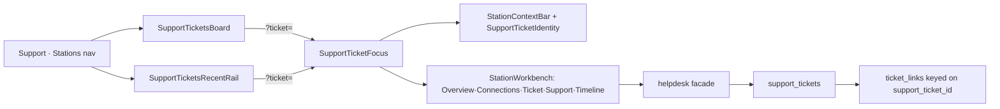

# Support Station — full waist · handoff hub

> **2026-08-01 supersession (shell/contract):** Support is **not** a Station. Gemini Option B ratified Workbench branch **`service-workspace`**. See [`support-service-workspace-PLAN.md`](./support-service-workspace-PLAN.md) + [`support-service-workspace-CLAUDE-CODE-PROMPT.md`](./support-service-workspace-CLAUDE-CODE-PROMPT.md). **Do not** keep porting Unbox `StationWorkbench` anatomy onto `/support`. Ticket **waist** work below (links re-key, helpdesk facade, create path) may continue as domain follow-ons under the new branch.

- **For:** any agent continuing this lane
- **Lane:** `main` / WS-DOGFOOD (current checkout). Prefer `../cycleforge-support` if main is busy with pending-grid WIP.
- **Status:** **Shell/contract SUPERSEDED** (see banner). Phase 0 + Phase 1 DONE historically; **Phase 2 EXPAND authored (migration unapplied)**. Phases 2b–6 pending as **domain** work only.
- **Plan:** Cursor plan `support_station_full_waist` (`/Users/icecube/.cursor/plans/support_station_full_waist_72645bf4.plan.md`).
- **Execution prompt (FABLE 5 HAND-OFF — paste this):** [`support-station-full-waist-EXECUTION-PROMPT.md`](support-station-full-waist-EXECUTION-PROMPT.md) — self-contained, covers current state + remaining Phases 2b–6 including the **vendor-neutral helpdesk** workstream.
- **Related:** [`ticket-stn-many-link-plan.md`](ticket-stn-many-link-plan.md) #2 (the re-key = Phase 2) · staff `03-testing-and-support-tickets.md` · Unbox `LineEditPanel`.

## Goal

Promote `/support` More → **Stations**, give the Tickets focus pane Unbox Station
Workbench anatomy, then complete the ticket waist (re-key `ticket_links` on
`support_ticket_id`, internal-# primary, create-like-Unbox).

## Decisions locked (do not relitigate)

| Topic | Decision |
|---|---|
| Nav placement | Support **More → Stations** (`kind: 'station'`) |
| Shell | `SurfaceGate` + `RouteShell` like Shipping |
| Tickets display | **Orders/Unbox recipe**: sidebar = recently selected dock only (`SupportTicketsRecentRail`); right pane = full queue workbench (`SupportTicketsBoard` with `WorkbenchChromeHeader` status tabs) + Station focus when `?ticket=` |
| Modes | Keep all six L2 modes; master-nav owns L2; no mode chrome in right pane |
| Focus anatomy | Unbox-family: `StationContextBar` + `StationWorkbench` + section tabs — compose `SupportOrdersWorkspace` pattern, don't fork |
| Create path | API waist like Unbox: `ReceivingClaimModal` when receiving-anchored; shared host → helpdesk create + `upsertSupportTicket` + `/api/support/tickets/link` otherwise |
| Ticket identity | Internal `support_tickets.id` = operator primary `#`; Zendesk external = secondary |
| Link waist | Re-key `ticket_links` uniques onto `support_ticket_id`; `zendesk_ticket_id` nullable provider cache |
| Anchor vocab | `SHIPMENT` when STN exists; `ORDER` when no STN; escalate must write links for internal tickets too |
| Migration | Expand / dual-write / contract (mirror 2026-07-16 many-link). **ASK-FIRST before prod apply.** |

## Architecture

## Phase status

- [x] **Phase 0 — Nav + shell.** `kind: 'station'` in `APP_SIDEBAR_NAV` + `SIDEBAR_PAGE_NAV`; `support` in `SURFACE_KEYS`/`SURFACE_REGISTRY` (archetype `station`, perm `integrations.zendesk`, pageKey `support`, mode `tickets`, `scan: null`); `/support` page = `SurfaceGate` + `RouteShell` (desktop-only `hidden md:flex`, mirrors Shipping). Guard tests updated (`surface-routing.test.ts` — support is desktop-only, exempt from the mobile-allowed assertion). **40/40 station guard tests green.**
- [x] **Phase 1 — SupportTicketFocus.** New `src/components/support/station/`:
  - `SupportTicketFocus.tsx` — StationContextBar + StationWorkbench, crossfade on `?ticket=`, default tab = Ticket (conversation).
  - `SupportTicketIdentity.tsx` — house one-row identity (TicketChip `#id` + subject + status dot); composes StationContextBar, not CartonContextCard (ticket is a different entity).
  - `support-station-tabs.tsx` — `buildSupportStationTabs`: Overview (linkage strip) · Connections (SupportContextHub full) · Ticket (`SupportTicketDetail` embedded) · Support (team segment) · Timeline (`WorkspaceTimelineTab`, gated on linkage content).
  - `SupportWorkspace.tsx` tickets mode now renders `SupportTicketFocus` under `AnimatePresence`. Type-clean (0 TS errors).
- [x] **Tickets workbench display (Orders/Unbox SoT).** Sidebar = `SupportTicketsRecentRail` (recently selected only); right pane = `SupportTicketsWorkspace` → `SupportTicketsBoard` (`WorkbenchChromeHeader` status tabs via `?tstatus=` / `?tq=`) or `SupportTicketFocus` when `?ticket=`. Removed full `SupportTicketQueue` from the sidebar.
- [~] **Phase 2 — Re-key waist (EXPAND authored, NOT applied).**
  - Migration `src/lib/migrations/2026-07-21_ticket_links_rekey_support_ticket_id.sql`: backfill `support_ticket_id` → NOT NULL; `zendesk_ticket_id` → nullable; add `ux_ticket_links_support_entity` + `ux_ticket_links_support_anchor`. Dry-run: only pending file. **APPLY via /db-migrate — and apply BEFORE deploying the code (hard deploy-order gate, see HUMAN-TODO §K).**
  - Drizzle: modeled `support_tickets`; updated `ticketLinks` (nullable zendesk, NOT NULL support, `link_role`, support-led indexes).
  - `zendesk-links.ts`: new canonical `linkSupportTicketEntity` (support-led `ON CONFLICT`, works for internal); `linkTicket` delegates to it (compose, don't fork).
  - `escalate.ts`: internal path now writes a `ticket_links` anchor via `linkSupportTicketEntity` (zendesk_ticket_id NULL) — internal tickets first-class. Test asserts entity threading.
  - Verify: tsc 0 errors, schema-drift OK, 67 threads/support unit tests pass, db:migrate:dry green.
  - **Deferred (deploy-gated, see HUMAN-TODO §K):** CONTRACT migration (drop zendesk-led uniques) + reader re-key + remaining shipment-reference writers + RECEIVING/RECEIVING_LINE parent-delete triggers.
- [ ] **Phase 3 — Identity + Connections.** Internal-# primary label SoT; dual-# chips; ticket→unit-journey deep link; wire `LinkedTicketsPanel` into Connections.
- [ ] **Phase 4 — Create like Unbox.** Shared `openClaimModal` host (`useSupportTicketClaimHost.ts`, deferred here to avoid a dead-code gate fail); `ReceivingClaimModal` for receiving anchors; New-ticket CTA.
- [ ] **Phase 5 — Modes polish + verify.** Voice/warranty/issues dual-#; `npm run verify`; dogfood loop; worklog.
- [ ] **Phase 6 — Vendor-neutral helpdesk (NEW).** Zendesk = one helpdesk *capability provider* behind the facade. Replace hardcoded "Zendesk" operator copy with `capabilityTitle/Noun('helpdesk')` / runtime `connectedProviderLabel`; give the facade a `ticketUrl()` + a client `useCapabilityProviderLabel('helpdesk')` hook (new tiny endpoint) for "Open in <provider>" deep links; route new create/link through `requireHelpdeskProvider`. Connector-layer identifiers (`zendesk-links.ts`, `zendeskTicketId`, `['zendesk']` keys, `zendesk_ticket_id` column, `integrations.zendesk` id) stay as allowed implementation detail — NOT a mass rename. Full scope + do/don't in the execution prompt §4 Phase 6.

## Verify done so far

- `npx tsx --test src/lib/stations/surface-keys.test.ts src/lib/stations/surface-routing.test.ts src/lib/sidebar-navigation.test.ts` → 40/40 pass.
- `npx tsc --noEmit` → 0 errors.
- Not yet: `npm run verify` (full) · browser dogfood · e2e.

## Golden references (import, don't fork)

- `src/components/support/orders/SupportOrdersWorkspace.tsx` — the station-shaped template Phase 1 mirrors.
- `src/components/receiving/workspace/LineEditPanel.tsx` + `line-edit/hooks/useUnboxLineController.ts` (`openClaimModal`) + `LineEditModals.tsx` — Phase 4 create path.
- `src/components/station/entity-context/` + `src/components/station/workbench/` — the composed SoT.
- `.claude/rules/display/station-workbench.md` · `.claude/rules/polymorphic-tables.md` · `.claude/skills/db-migration-author`.
