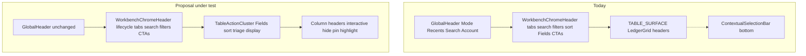

# Research briefing — table-proximal action bar & Fields altitude

**For:** Gemini Pro (deep research) — you do **not** have the codebase; every measurement below is embedded.
**From:** Cycle Forge engineering
**Date:** 2026-07-30
**Subject:** Should “Fields” (column visibility) and related table-display / triage controls move from Workbench page chrome into a **table-proximal action bar** (Google Sheets–like), and should opening Fields **couple to the column-header plane**?
**Status:** **ratified** (2026-07-30) — house PLAN: [`table-action-bar-fields-PLAN.md`](./table-action-bar-fields-PLAN.md). Originating product intuition was “move Fields out of the top header into a bar above the data table.” Engineering measurement corrected the altitude diagnosis (see §2); Gemini rulings D1–D6 accepted (keep Fields in Workbench chrome; harden trailing cluster; no `TableActionBar`).
**Deliverable:** (a) 2026 industry survey of where column/field controls live relative to dense ops tables, with named systems and citations; (b) forced rulings on D1–D6 against house constraints in §3–§6; (c) a blast-radius-ordered implementation sketch an engineer can execute without inventing a parallel chrome stack.

**Sibling briefs — do not re-answer; reconcile only where this brief’s decisions collide:**

| Sibling                                                                                                        | Owns                                                                                                  | This brief may cite, must not redo                                                                                                                           |
| -------------------------------------------------------------------------------------------------------------- | ----------------------------------------------------------------------------------------------------- | ------------------------------------------------------------------------------------------------------------------------------------------------------------ |
| `[ops-table-simplification-GEMINI-RESEARCH-BRIEFING.md](ops-table-simplification-GEMINI-RESEARCH-BRIEFING.md)` | Grid skin / zebra / column vocabulary / density / selection *models* / empty states / two-tier tables | Its Q3 toolbar inventory is adjacent — **cite your prior answer if you already produced one**, deepen only the *altitude* and *Fields↔header coupling* slice |
| `[chrome-sot-compound-GEMINI-RESEARCH-BRIEFING.md](chrome-sot-compound-GEMINI-RESEARCH-BRIEFING.md)`           | Design-system governance (law + guards + compound loop)                                               | Do not re-litigate whether guard tests vs eslint boundaries are better; assume the compound loop stands                                                      |
| `[chrome-sot-compound-PLAN.md](chrome-sot-compound-PLAN.md)`                                                   | Phased chrome consolidation (KPI, tabs, sort, saved views)                                            | Saved-views chrome home remains **Ask-first** (Phase D) — out of scope here                                                                                  |
| `[table-display-sot-GEMINI-RESEARCH-BRIEFING.md](table-display-sot-GEMINI-RESEARCH-BRIEFING.md)`               | Display SoT / zebra / in-cell edit plane                                                              | Do not reopen skin or title-edit rulings                                                                                                                     |

---

## 0. How to use this brief

Two deliverables, kept separate:

1. **What is the 2026 industry standard?** Survey how comparable products place **column/field visibility**, **filter/refine**, **sort**, and **bulk triage** relative to a dense data table. Name real systems. State the **conditions under which each pattern wins**. Do not retreat into “it depends.” Where practice changed since ~2022, say what changed and why.
2. **What is right for *this* codebase?** Reconcile against §3–§6. Where industry conflicts with a ratified house law, **pick a side and defend the deviation** (or tell us to change the law). We would rather have a defended deviation than a generic Sheets clone.

Assume the reader is the engineer who will implement the winning shape over 1–2 weeks. Anti-patterns for your answer:

- Recommending a foreign grid (AG Grid, MUI DataGrid, Handsontable, etc.) — hard Never.
- Inventing a second column-visibility system alongside `useGridColumnVisibility` — hard Never.
- Stacking a second `sticky top-*` band inside the same scroll port — house sticky law; if you recommend an in-card bar, say how it docks without that bug.
- Raising DS ratchet baselines or forking page-local twins of `GridFieldsMenu` / `WorkbenchChromeHeader`.

---

## 1. Product vocabulary (mandatory)

**Cycle Forge** is multi-tenant reseller-operations SaaS. USAV is the dogfood tenant only — frame answers for a sellable B2B ops product, not a five-person shop tool.

**Kinetic Ledger** is the UI identity: data-first, dense, state-colored, scan-aware. Bias is **legible throughput over document calm** — closer to Linear / Carbon / Stripe Dashboard chrome discipline and POS/scan floors than to Notion whitespace.

Every UI region is one of four **region contracts** (enforced house law):

| Contract      | Driven by             | Job                   | Selection                | Density  |
| ------------- | --------------------- | --------------------- | ------------------------ | -------- |
| **Station**   | barcode scanner       | act-and-clear         | ephemeral, never URL     | `floor`  |
| **Workbench** | pointer               | pick → edit → persist | durable, URL-addressable | `ops`    |
| **Monitor**   | filters over a stream | observe only          | none                     | `rollup` |
| **Canvas**    | pan/zoom/focus        | reshape a definition  | durable focus in URL     | `studio` |

**Every surface in this brief is a Workbench region** (collection map over a queue). Station scan regions are out of scope. Use this vocabulary in your answer.

---

## 2. Framing correction — the real job

### 2a. What the product owner saw

A control labeled **Fields** (columns icon + label + chevron) sits in a white horizontal chrome strip near search and account affordances. The intuition: it feels like an **app-global** header control, but it only edits the table below — so move it into a **Sheets-like action bar above the data table**, and when Fields opens, make it **interact with the table header** (highlight columns, hide/pin from headers, etc.).

### 2b. What engineering measured

**Fields is not in GlobalHeader.** GlobalHeader owns Mode / Recents / Work Order / Pace / ⌘K search / inbox / account only.

Fields is already a **Workbench chrome** control:

- Component: `GridFieldsMenu` — quiet `ToolbarButton` + `Popover` listbox.
- Placement: `WorkbenchChromeHeader` **trailing** cluster (sibling of `QueueSortSwitch`).
- Canonical chrome order: `search` → `right` (filters) → `controlsSlot` portal → `trailing` (**sort → Fields → Import → Add**).
- Persistence: `staff_preferences.tableColumns[tableId]` as a **delta** (`hidden` / `shown`), via `useGridFields` / `useGridColumnVisibility`.
- Generation: menu items come entirely from the grid descriptor’s `hideKey`s — identity columns (`select`, `title`) never appear.

So the originating complaint is not “Fields is in the wrong app shell.” It is:

1. **Altitude / proximity** — Fields lives in the **pinned page chrome** above the scroll body and the table card, visually co-located with global-feeling chrome, not glued to the grid header.
2. **Coupling** — opening Fields does **not** highlight columns, dock to the header row, or offer per-header hide/pin. Headers today only drive **sort** (`?colsort=` / `?coldir=` on some surfaces).
3. **Split action planes** — filter, sort, Fields, import CTAs, and bulk triage live at different altitudes (page chrome vs bottom selection bar vs sidebar saved views).

### 2c. Proposal under test (compressed)

> Introduce a **table-proximal action cluster** (Sheets-like) for display edits and triage. Relocate Fields into that cluster so it reads as **data-table-specific**. Opening Fields should **couple to the column-header plane** (highlight, hide/pin, header context), not feel like distant app chrome.

Your job is to say whether this is the right improvement, a partial improvement, or a misdiagnosis — and what to ship first.

---

## 3. Measured current state

### 3a. Altitude diagram

### 3b. Where Fields mounts today

| Surface                     | Mount file                                                              | `tableId`   | Column descriptor        |
| --------------------------- | ----------------------------------------------------------------------- | ----------- | ------------------------ |
| Outbound (Dashboard orders) | `OutboundWorkspaceHeader.tsx`                                           | `orders`    | `ORDERS_QUEUE_COLUMNS`   |
| Incoming                    | `IncomingWorkspaceHeader.tsx`                                           | `receiving` | `INCOMING_GRID_COLUMNS`  |
| History                     | `HistoryWorkspaceHeader.tsx`                                            | `receiving` | `RECEIVING_GRID_COLUMNS` |
| Unbox embedded table        | `ReceivingLinesTable.tsx` via `createPortal` into chrome `controlsSlot` | `receiving` | `RECEIVING_GRID_COLUMNS` |
| Catalog                     | `ProductsCatalogWorkspace.tsx`                                          | `catalog`   | `CATALOG_GRID_COLUMNS`   |
| Pickup                      | `PickupWorkspace.tsx`                                                   | `pickup`    | `PICKUP_GRID_COLUMNS`    |
| Repair                      | `RepairWorkspaceHeader.tsx`                                             | `repair`    | `REPAIR_GRID_COLUMNS`    |

**In-scope for this brief’s migration waves:** the seven mounts above.  
**Out of scope:** GlobalHeader; Search refine strip (`SearchRefineControls` / `FilterRefinementBar`); Station scan region; surfaces still on legacy `TableOptionsMenu` / `TableColumnConfig` that have not adopted `GridFieldsMenu` (those are an ops-table adoption gap, not this altitude decision).

**Known prefs hazard (already documented in ops-table §3.1):** Incoming and Receiving/History/Unbox share `tableId: "receiving"` but use **different column descriptors**. A staff delta on one can silently affect the other. Any relocation of Fields must not invent a second prefs namespace without confronting this — call it out if your waves depend on it.

### 3c. What Fields does / does not do

| Does                                                           | Does not                                                     |
| -------------------------------------------------------------- | ------------------------------------------------------------ |
| Toggle visibility for every descriptor column with a `hideKey` | Reorder columns                                              |
| Persist optimistic delta; dirty badge + “Reset to default”     | Resize columns (widths live elsewhere in prefs)              |
| Stay open across toggles (listbox)                             | Highlight the corresponding header when hovering a field row |
| Share `ToolbarListbox` anatomy with `QueueSortSwitch`          | Offer per-header context menu (hide / pin / wrap)            |
|                                                                | Enter a “header edit mode”                                   |
|                                                                | Morph when rows are selected                                 |

### 3d. Sibling chrome that already exists (do not reinvent)

| Job                                     | Named SoT                                             | Path / note                                                                    |
| --------------------------------------- | ----------------------------------------------------- | ------------------------------------------------------------------------------ |
| Sticky chrome outside scroll            | `DashboardScrollShell` `chrome` prop                  | One sticky layer law: pinned chrome **outside** `overflow-y-auto`              |
| Lifecycle tabs + search/filter/trailing | `WorkbenchChromeHeader`                               | `workbench-shell.tsx`                                                          |
| Filter popover anatomy                  | `WorkbenchFilterPopover`                              | Quiet trailing-cluster sibling                                                 |
| Display sort                            | `QueueSortSwitch`                                     | Law: quiet dropdown in trailing, never solid `TabSwitch` beside search         |
| Column visibility write/read            | `useGridFields` / `useGridColumnVisibility`           | Single resolver: structural → forceHidden → staff delta                        |
| Fields UI                               | `GridFieldsMenu`                                      | Trailing cluster today                                                         |
| In-card 40px strip (legacy)             | `QueueTableToolbar`                                   | Scope/period above column guide — **not** Fields; fallback when portal missing |
| Active refine chips                     | `FilterRefinementBar`                                 | Used on Search; not universally on Workbench queues                            |
| Multi-select / triage                   | `ContextualSelectionBar`                              | **Bottom** floating bar; selection actions scoped by lifecycle                 |
| Table frame tokens                      | `TABLE_SURFACE_*`                                     | Card shell around `LedgerGrid`                                                 |
| Grid surface                            | `LedgerGrid` / `LedgerGridSurface` / descriptor waist | TanStack = state math only                                                     |

### 3e. House action planes (ratified — challenge only with evidence)

From `.claude/rules/display/workbench.md`:

| Plane            | Mechanism                    | For                          |
| ---------------- | ---------------------------- | ---------------------------- |
| **In-cell**      | `LedgerCellEditor` / popover | Single typed values          |
| **Row-scoped**   | Hover + single-row menu      | One-record affordances       |
| **Multi-select** | `ContextualSelectionBar`     | N records at once            |
| **Record**       | Detail inspector / full page | Relational / multi-step work |

Implication the proposal must confront: **bulk triage is already a named plane at the bottom.** Morphing the top bar into a selection toolbar (classic Sheets/Gmail) is a plane merge, not a free upgrade.

### 3f. Sticky docking law (ratified)

> Never stack two `sticky top-*` bands inside the same scroll port.

House pattern: pin chrome **outside** the scroll port; the body’s only sticky layer is day-band headers at `top-0`. An in-card “action bar” that itself needs to stick while the grid scrolls is exactly the seam/overlap bug this law exists to prevent — unless it lives *inside* the non-scrolling chrome, or scrolls away with the table card top, or is not sticky.

### 3g. Pattern-evolution law (ratified)

> Compose from the named SoT first. Grow the SoT when it is wrong. Never fork a page-local twin for the same job.

A new `TableActionBar` component is only justified if growing `WorkbenchChromeHeader` trailing / `controlsSlot` / `GridFieldsMenu` / header cells is **provably weaker**. Your D2 ruling must say which.

---

## 4. Industry survey ask (Part 1)

Survey **2024–2026** practice. For each pattern, name systems and give **win conditions** (when to use it). Prefer dated docs, design-system pages, or changelogs over vibes.

### Named systems to cover (minimum set)

**Spreadsheet shells:** Google Sheets (menu + toolbar + column menus), Excel Online, Rows.app.

**Database / flexible-grid products:** Airtable (field manager + field/header menus + views), Notion databases, Attio, Linear (issue list filters / display), Height.

**Design-system table toolbars:** Shopify Polaris `IndexFilters` / `IndexTable`, IBM Carbon `DataTable` toolbar, Microsoft Fluent 2 `DataGrid`, Material 3 data tables, Atlassian Design System table patterns.

**Ops / admin list altitude only (not WMS chrome to copy wholesale):** Retool tables, ServiceNow lists, Salesforce Lightning list views, Stripe Dashboard tables.

### Q-Industry-1 — Dominant altitude for “show/hide fields”

What is the 2026 dominant treatment for column/field visibility on dense operational tables?

| Pattern | Rough description                                                         |
| ------- | ------------------------------------------------------------------------- |
| A       | Page / collection chrome (above the table card)                           |
| B       | Table-attached toolbar (inside or immediately on the card, above headers) |
| C       | Column-header context menus / field menus only                            |
| D       | Hybrid (toolbar entry + header menus that do the same job)                |

Who does what? Has the center of gravity moved since ~2022? For a **Workbench queue** (pick → edit → persist, 8–14h shifts, mouse + occasional scanner nearby), which pattern wins and why?

### Q-Industry-2 — Coupling when Fields opens

When the operator opens a Fields / Columns control, what should happen to the grid?

| Pattern | Rough description                                                                  |
| ------- | ---------------------------------------------------------------------------------- |
| A       | Detached listbox (toggle names only) — our current shape                           |
| B       | Panel docked to the header row / opens “manage fields” mode with header highlights |
| C       | Per-column header menus as the primary path; toolbar is secondary                  |
| D       | Side panel / inspector of the schema (Airtable field manager–class)                |

What do Airtable, Sheets, Notion, Polaris, Carbon, Fluent actually do in 2026? Which coupling level is expected vs delightful vs overbuilt for an ops queue that is **not** a user-authored schema (columns are product-defined descriptors, staff only show/hide)?

**Critical discriminator:** our columns are **not** tenant-authored fields. Staff cannot add a column. The menu is visibility only. Does that push us toward A, or do products still do B/C for hide-only?

### Q-Industry-3 — Selection / triage vs display chrome

Should multi-select triage **morph the top toolbar** (Sheets / Gmail / Drive), **replace it**, or stay a **separate bottom / floating selection bar** (our `ContextualSelectionBar`)?

Cite who does what in 2026. Specifically: for products that also have lifecycle tabs + filters in the same chrome strip, do they morph that strip on selection, or keep selection elsewhere so tabs/filters don’t disappear?

### Q-Industry-4 — Progressive disclosure

For an ops queue toolbar, which of these must be **always visible**, and which belong behind an icon / overflow?

Cover: lifecycle/view tabs, scoped search, filters, active filter chips, sort, fields/columns, density/row height, group-by, import/export, primary Add, result count, refresh, saved views, bulk actions.

Reconcile with ops-table Q3 if you have already answered it — deepen only where **Fields altitude** and **header coupling** change the inventory.

### Q-Industry-5 — Uniform slot skeleton vs per-surface authorship

Should every Workbench queue expose the same L→R slot skeleton (empty slots when unused), or is honest per-surface authorship correct if the **shared slots are shared components**? Polaris `IndexFilters` vs Airtable per-view chrome vs Linear — who wins for a product with genuinely different queue jobs (Outbound vs Catalog vs Repair)?

---

## 5. Forced decisions (Part 2 — pick a side)

Each decision states **Current**, **Proposed**, and the strongest **Counter**. You must pick one side (or a named third that is more precise than both) and defend it against §3–§6.

### D1 — Altitude of Fields

|              |                                                                                                                                                                                                                                                                    |
| ------------ | ------------------------------------------------------------------------------------------------------------------------------------------------------------------------------------------------------------------------------------------------------------------ |
| **Current**  | `GridFieldsMenu` in `WorkbenchChromeHeader` trailing (pinned outside scroll, above the table card).                                                                                                                                                                |
| **Proposed** | New band **inside** `TABLE_SURFACE`, immediately above the column header row (Sheets-like).                                                                                                                                                                        |
| **Counter**  | A second sticky band violates sticky docking law; an in-card non-sticky bar scrolls away and loses the control mid-triage; growing the existing trailing/portal cluster fixes “proximity” with less blast radius if the real issue is coupling (D3), not altitude. |

**Pick:** keep in page chrome / move into table card / hybrid (specify). If move: specify sticky behavior without violating §3f.

### D2 — SoT shape

|              |                                                                                                     |
| ------------ | --------------------------------------------------------------------------------------------------- |
| **Current**  | Grow `GridFieldsMenu` + `WorkbenchChromeHeader` slots / `controlsSlot` portal.                      |
| **Proposed** | New named `TableActionBar` (or similar) SoT that owns Fields + sort + triage display cluster.       |
| **Counter**  | Fork risk vs pattern-evolution / chrome-sot compound — a second toolbar language for the same jobs. |

**Pick:** grow existing / new SoT / thin wrapper that only composes existing SoTs (name it). If new SoT: what exact jobs move in, and what stays in `WorkbenchChromeHeader`?

### D3 — Header coupling when Fields opens

|              |                                                                                                                                         |
| ------------ | --------------------------------------------------------------------------------------------------------------------------------------- |
| **Current**  | Detached listbox of field names; headers unchanged.                                                                                     |
| **Proposed** | Opening Fields highlights headers / enables header hide-pin / header context menus share the same visibility SoT.                       |
| **Counter**  | Complexity and a11y cost for a hide-only, product-authored column set; operators may only need a closer trigger, not schema-manager UX. |

**Pick:** none / highlight-only / highlight + header hide / full Airtable-class field menus. State minimum viable coupling if you believe the proposal overreaches.

### D4 — Triage / bulk actions altitude

|              |                                                                                                                |
| ------------ | -------------------------------------------------------------------------------------------------------------- |
| **Current**  | Bottom `ContextualSelectionBar`; top chrome stays lifecycle + refine.                                          |
| **Proposed** | Top table action bar morphs on selection (Sheets-like).                                                        |
| **Counter**  | Merges multi-select plane into display chrome; lifecycle tabs/filters fight for space; house action-plane law. |

**Pick:** keep bottom / morph top / dual (when). If morph: what happens to lifecycle tabs while N>0 selected?

### D5 — Filter / refine co-location with Fields

|              |                                                                                                                                                                                                               |
| ------------ | ------------------------------------------------------------------------------------------------------------------------------------------------------------------------------------------------------------- |
| **Current**  | Filters in chrome `right`; Fields in `trailing`; active chips inconsistent.                                                                                                                                   |
| **Proposed** | Move refine chips + Fields into the table-proximal bar so “everything about what I see in the grid” is one cluster.                                                                                           |
| **Counter**  | Splits lifecycle tabs from refine; operators use tabs+filters as one navigation act; Fields is display preference, filters are query — industry often separates them (Polaris IndexFilters vs column picker). |

**Pick:** keep split / co-locate refine+Fields under table / co-locate only Fields+sort (leave filters in page chrome).

### D6 — Uniformity across Workbench queues

|              |                                                                                                        |
| ------------ | ------------------------------------------------------------------------------------------------------ |
| **Current**  | Per-surface authorship of which trailing slots are filled; Fields on ~7 grids, absent elsewhere.       |
| **Proposed** | Fixed slot skeleton on every in-scope Workbench queue (empty slots when N/A).                          |
| **Counter**  | Empty slots read as unfinished; honest absence is clearer if the *components* are shared when present. |

**Pick:** fixed skeleton / shared components + honest absence / phased: skeleton only for the seven Fields adopters first.

---

## 6. Constraints and non-goals

### Fixed (do not violate without an explicit “change the law” recommendation)

1. **No foreign grids.** LedgerGrid / descriptor waist only; TanStack = state math only.
2. **One column-visibility resolver.** `useGridColumnVisibility` / `useGridFields`. Never revive `useIsColumnHidden` for grid families. Prefs remain a **delta**.
3. **Identity columns never hideable.** `select` / `title`.
4. **One sticky chrome layer per scroll port.** Pin outside scroll; no stacked `sticky top-`*.
5. **Compose SoTs; don’t fork.** Grow `GridFieldsMenu` / chrome / headers before inventing twins.
6. **Action planes stay distinct** unless you explicitly recommend rewriting `.claude/rules/display/workbench.md` Action planes — and say so.
7. **Sort chrome law.** Quiet trailing dropdown (`QueueSortSwitch`), never solid `TabSwitch` beside search. Param split: `?colsort=`/`?coldir=` for column sort vs station `?sort=`/`?dir=` server ordering — don’t collide.
8. **GlobalHeader stays** Mode / Recents / WO / Pace / search / account. Nested facets are not GlobalHeader.
9. **Saved-views chrome home is Ask-first** (chrome-sot Phase D) — out of scope; don’t invent a third saved-views face here.
10. **Tokens only.** No page-local hex / raw `z-[N]`. Table frame = `TABLE_SURFACE_`*.
11. **Don’t raise DS ratchet baselines.** Guards only ratchet stricter.
12. **Station scan region** is not a Workbench queue toolbar — don’t bolt this bar onto Station.

### Non-goals for this brief

- Gridline / zebra / row-padding aesthetics (ops-table Q1).
- Shared column vocabulary / rename `status` across stations (ops-table Q2).
- Density system finish-vs-delete (ops-table Q4) — except if your toolbar inventory puts density next to Fields.
- Migrating the ~30 legacy hand-rolled `<table>`s (ops-table §3.7).
- Chrome governance method / eslint vs regex guards (chrome-sot brief).
- Search results layout / Fields on `/search`.

### Scope confirmation

**In:** Outbound, Incoming, History, Unbox portal, Catalog, Pickup, Repair — Fields altitude + header coupling + relationship to filter/sort/triage.  
**Out:** Everything in Non-goals; GlobalHeader; Station scan.

---

## 7. What a good answer looks like

### 7.1 Executive verdict (≤1 paragraph)

The single best UX improvement for Fields **for this product** — not for Sheets. Name whether the win is altitude, coupling, triage co-location, or something else entirely (e.g. “Fields is fine; the problem is X”).

### 7.2 Industry survey

Named systems + citations + win conditions for Q-Industry-1…5. Separate spreadsheet products from ops admin DS tables when the answer differs.

### 7.3 Per-decision rulings

D1…D6, each with: chosen side, 3–6 sentence defense, and explicit note if you recommend changing a house law (quote which).

### 7.4 Blast-radius-ordered implementation sketch

Waves an engineer can ship independently. For each wave:

- Goal (operator-visible)
- Grow vs invent (exact modules: `WorkbenchChromeHeader`, `GridFieldsMenu`, `LedgerGrid` header band, `controlsSlot` portal, `ContextualSelectionBar`, …)
- Files / surfaces touched (the seven mounts)
- Guards / tests to add (e.g. “Fields must not mount in GlobalHeader”; “visibility toggles still go through `useGridFields`”; sticky stacking grep)
- Risk notes (`receiving` shared `tableId`, Unbox portal, sticky)

End with:

1. **Single highest-leverage change** if we only ship one thing this sprint.
2. **What not to build** (the attractive Sheets clone piece that loses for this codebase).

### 7.5 Risks register

At minimum address: sticky stacking; shared `receiving` prefs; Unbox `createPortal`; selection-bar plane merge; operator discoverability if Fields moves farther from Import/Add CTAs; a11y for header highlight mode.

---

## Appendix A — File map (pointers only; facts are in §3)

| Concern                   | Path                                                                               |
| ------------------------- | ---------------------------------------------------------------------------------- |
| Fields UI                 | `src/components/ui/table-column-config/GridFieldsMenu.tsx`                         |
| Visibility SoT            | `src/design-system/components/grid/useGridColumnVisibility.ts`                     |
| Workbench chrome          | `src/components/dashboard/workbench-shell.tsx` (`WorkbenchChromeHeader`)           |
| Sort chrome law           | `.cursor/rules/workbench-sort-chrome.mdc`                                          |
| Sticky / action planes    | `.claude/rules/display/workbench.md`                                               |
| Scroll shell              | `src/components/dashboard/DashboardScrollShell.tsx`                                |
| Selection bar             | `src/design-system/components/ContextualSelectionBar.tsx`                          |
| In-card legacy strip      | `src/components/dashboard/queue-table/QueueTableToolbar.tsx`                       |
| Outbound mount            | `src/components/dashboard/OutboundWorkspaceHeader.tsx`                             |
| Incoming mount            | `src/components/sidebar/receiving/incoming/IncomingWorkspaceHeader.tsx`            |
| History mount             | `src/components/sidebar/receiving/HistoryWorkspaceHeader.tsx`                      |
| Unbox portal              | `src/components/station/ReceivingLinesTable.tsx`                                   |
| Catalog / Pickup / Repair | `ProductsCatalogWorkspace.tsx`, `PickupWorkspace.tsx`, `RepairWorkspaceHeader.tsx` |
| Filter popover            | `src/components/dashboard/workbench-filter-popover.tsx`                            |
| Pattern evolution         | `.claude/rules/pattern-evolution.md`                                               |
| Grid visibility law       | `.claude/rules/source-of-truth.md` (Grid column visibility + sort)                 |

## Appendix B — Raw measurements used in this brief

- `GridFieldsMenu` consumer count via repo grep (2026-07-30): **7 mount sites** listed in §3b (plus doc references in `ToolbarListbox` / filter popover comments).
- GlobalHeader: **zero** Fields / column-picker mounts (zone contract: Mode / Recents / WO / Pace / search / account).
- Chrome right-cluster render order in `WorkbenchChromeHeader`: `search` → `right` → `controlsSlotRef` → `trailing` (source lines ~231–236 of `workbench-shell.tsx`).
- Workbench sort chrome rule documents trailing order as **sort → Import → Add**; Fields is implemented as the peer immediately around sort in practice on Fields-adopting surfaces.
- `QueueTableToolbar` JSDoc: “40px in-card table toolbar — scope, period, and table controls above the column guide.”
- Incoming + History + Unbox share `tableId: "receiving"` with divergent descriptors — carried forward from ops-table §3.1(g).
- Sticky law quote and action-plane table paraphrased from `.claude/rules/display/workbench.md` (Sticky docking; Action planes).

## Appendix C — Suggested prompt header when pasting to Gemini

> You are advising Cycle Forge engineering. Answer §7’s format exactly. Force a side on D1–D6. Separate industry standard from local recommendation. Do not recommend foreign grids or a second column-visibility system. Do not re-answer ops-table skin/column-vocabulary questions or chrome-sot governance method — cite and move on. Prefer defended deviations over generic Sheets clones.

