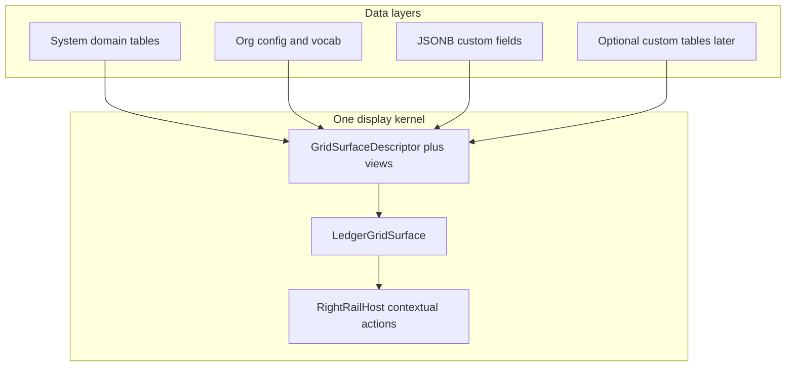

# Research briefing — Horizon C: multi-tenant table extensibility (long-term)

**For:** Gemini Pro (deep research) — **you do not have the codebase.** Every product constraint and current-state fact below is **embedded**. Do not invent file paths, claim to have inspected source, or assert “we already have X” beyond §2–§3. If you speculate past the embedded facts, label it `my reasoning:`.
**From:** Cycle Forge engineering
**Date:** 2026-08-01
**Subject:** What is the **best long-term architecture** for Cycle Forge’s Workbench data tables in a **sellable multi-tenant** product — one display engine, tenant-configurable views/fields, optional custom tables — without turning the product into Airtable or forking per-tenant DDL.
**Status:** OPEN research. Horizon A (display SoT) and Horizon B (industry actions) already have plans; this brief defines **Horizon C** only.
**Your deliverable:** one markdown **research + plan report** (chat or export). A Cursor/Claude agent with repo access will land it as `docs/todo/tenant-table-extensibility-HORIZON-C-PLAN.md` and reconcile any handoff pointers. **You do not write files.**

**This brief is NOT “build Airtable” or “give every tenant a freeform database.”** Cycle Forge is multi-tenant **reseller / warehouse-operations SaaS**. Spreadsheet chrome exists to raise operator throughput on live queues. Tenant extensibility must compound on the existing kernel — not replace Receiving/Orders with user-authored schemas.

---

## 0. Method

### 0.1 Your job is industry research + constrained recommendation

1. **Survey the web** for how Sheets / Airtable / Notion / Coda / Linear / Stripe / Retool / mature B2B ops products separate **data · views · record detail · custom fields · custom tables** in multi-tenant SaaS. Prefer primary docs and **2024–2026** sources. Cite named systems.
2. **Reconcile** every recommendation against the embedded house constraints in §1–§3. Where industry conflicts with a constraint, **pick a side and defend the deviation** (or tell us to change the constraint). Prefer a defended deviation over a generic “become Airtable.”
3. **Score** candidates with §0.3. Cut ruthlessly.
4. Treat facts in §2–§3 as **ground truth about our product today.** Do not invent modules, APIs, or shipped features that contradict them.

### 0.2 Sources to cover (minimum)

| Class | Examples | Use for |
|---|---|---|
| **Spreadsheets** | Google Sheets, Excel Online | Formula joins (`VLOOKUP`/`QUERY`/`IMPORTRANGE`) vs real relations — anti-pattern for ops SaaS |
| **DB–spreadsheet hybrids** | Airtable, Notion databases, Coda, Smartsheet | Linked records, lookups/rollups, views, Interfaces / linked views, custom tables |
| **Ops / SaaS dense tables** | Linear, Stripe Dashboard, Retool Table, Attio, Shopify Polaris IndexTable, IBM Carbon | What sellable B2B queues ship (not hobby bases) |
| **Multi-tenant schema patterns** | Shared schema + `tenant_id` / RLS; JSONB custom fields; EAV anti-pattern; schema-per-tenant costs | Postgres SaaS design 2024–2026 |
| **WMS / fulfillment–adjacent** | At least 1–2 named warehouse / fulfillment / inventory UIs (public docs or demos) | Floor reality vs workspace tools |

Where industry splits, give **both** positions, the conditions each wins under, then pick one for **this** product and say why.

**Hard fork:** “what a spreadsheet / base builder does” ≠ “what a dense, scan-driven warehouse-ops SaaS on a 1080p floor monitor should do.” This product is the latter.

### 0.3 Scoring model (mandatory)

Score every architectural candidate on **all five axes** (1–5). Report a table. Do not invent a sixth axis.

| Axis | Meaning |
|---|---|
| **Fit** | Compounds on LedgerGrid / descriptors / saved views / polymorphic hubs / tenant isolation vs requires a new paradigm |
| **Sellable isolation** | Safe across orgs; permissions + audit; no cross-tenant schema drift; not folklore for one dogfood warehouse |
| **Operator throughput** | Helps floor/workbench queues (or tenant admins configuring them) without cognitive overload |
| **Blast radius** | How many surfaces, APIs, migrations, permission models (5 = tiny; 1 = company-wide rewrite) |
| **Migration cost** | Cost to get from today’s measured state (§3) to the candidate — including unfinished Horizon A forks |

**Score ≈ (Fit × Sellable isolation × Operator throughput) / ((6 − Blast) × Migration friction)**  
where Migration friction is `6 − Migration cost` (so cheap migrations score higher).  
**Blast scoring convention:** 5 = tiny blast, 1 = huge. Use this consistently in every row (do not invert mid-table). Rank descending. State your cut line.

### 0.4 Closed forever (do not recommend unless Ask-first with strong evidence)

- Adopting a foreign grid product (AG Grid, Handsontable, MUI DataGrid, Glide, embedded Sheets) as the UI shell
- Collapsing Receiving / Orders / Catalog **domain cell registries** into one mega-row “polymorphic columns from any SQL table”
- **Schema-per-tenant** or **database-per-tenant** as the default multi-tenant model
- Skipping unfinished Horizon A fork migrations to ship custom tables first
- A second action system that bypasses the four Workbench planes or the status state machine
- EAV (`entity_id, key, value` rows) as the primary custom-field store
- Per-tenant `ALTER TABLE` / divergent DDL shapes

---

## 1. Settled laws (do not re-litigate)

A recommendation that reverses one of these without an explicit “change the house law” Ask-first section will be discarded.

| Already decided | Meaning |
|---|---|
| **Shell SoT = LedgerGrid family** | Virtualized Workbench queues mount `LedgerGrid` / `LedgerGridSurface` with a typed `GridSurfaceDescriptor` and a boolean `GridSurfaceCapabilities` bag |
| **DataTable sibling** | Non-virtualized admin / settings / reports lists use a separate `DataTable` (same visual table-surface chrome) — not forced onto LedgerGrid |
| **No foreign UI grids** | Never AG Grid / MUI / Glide / embedded Sheets as the product shell |
| **Shared schema multi-tenancy** | One Postgres schema for all orgs; every row keyed by `organization_id`; org comes from auth context, never the request body; tenant transaction / GUC isolation |
| **Domain cells stay per family** | Orders cells ≠ Receiving cells ≠ Catalog cells. Unify shell + chrome + atoms; do **not** collapse all JSX into one mega-row |
| **Capabilities gate feature bleed** | Bag booleans today: `rowTriageFlags` · `multiSelect` · `inCellEdit` · `fieldsMenu` · `dayBands`. Catalog must never grow Orders triage paint “for consistency” |
| **Status is a state machine** | Status changes only via a single `transition()` waist with audit — never raw status cell overwrites |
| **Horizon A before B actions** | Finish display SoT excellence + migrate ops forks before generalizing industry actions |
| **Station accordion ≠ LedgerGrid** | Open-carton Unbox edit (`PoLinesAccordion` / unit slots) is a different job — out of Horizon C unless Ask-first |
| **Right edge pushes** | Record inspectors use a non-modal right-rail host that **pushes** the workspace (not a floating modal over the grid as the default) |
| **Compose → grow SoT → compound** | Never fork a page-local twin for the same job; grow the named SoT when it is wrong |
| **Polymorphic hubs are eng contract** | Cross-entity facts use `entity_type` + `entity_id` (+ org-led indexes). That is **not** an Airtable “add Linked Record field” product surface yet |

### Region contracts (vocabulary)

| Region | Job | This brief |
|---|---|---|
| **Workbench** | pick → edit → persist on queues | **In scope** |
| **Station** | scanner act-and-clear | Out of scope (do not turn benches into Sheets) |
| **Monitor** | observe streams | Mention only if custom views leak here |
| **Canvas** | Studio / reshape definitions | Relevant only for “where custom tables are authored” |

### Four action planes (Horizon B already owns these)

| Plane | Job |
|---|---|
| In-cell | Edit one typed field without leaving the map |
| Row-scoped | Act on one row without full record |
| Multi-select | Act on N rows |
| Record | Full edit / relations / history — **right rail** |

Horizon C must **mount on** these planes and the same rail — not invent a fifth grammar.

---

## 2. Product context

**Cycle Forge** is multi-tenant B2B SaaS for used-goods **reseller operations**: inbound receiving, testing/QA, repair, catalog, outbound pick/pack/ship, warranty, support. USAV is only the first dogfood tenant — frame everything as a **sellable product**, not an internal tool.

**UI identity (Kinetic Ledger):** data-first, dense, state-colored, scan-aware; **legible throughput over document calm** (closer to Linear / Carbon / Stripe Dashboard + POS floors than to Notion whitespace).

**Operator reality**

- Dense queues on desktop / floor monitors (often ~1080p), long shifts, mouse-first on Workbench queues, barcode scanner-first on Station benches.
- Rows are **work items** (orders, receiving lines, repair jobs, …), not a freeform spreadsheet of cells.
- Color and meaning must survive **shift handoff**.
- Every write is tenant-scoped, permission-gated, and auditable.
- Vendor integrations (Zoho, Zendesk, …) are tenant connectors behind **capability facades** — never the product noun in operator copy (except Integrations hub).

---

## 3. Measured current state (embedded — 2026-08-01)

Treat this as product truth. You cannot re-verify; if you need a fact not listed, say so under Ask-first — do not invent it.

### 3a. Display kernel (Horizon A — largely landed)

- One virtualized framed Workbench spreadsheet shell (“LedgerGrid”) with sticky headers, frozen leading identity pane, typed column headers, staff show/hide Fields, URL-durable column sort, empty vs “no matches” states, airtable-like skin option.
- TanStack Table v8 is used for **headless state math only**; Kinetic Ledger owns markup, CSS-var geometry, virtualization, fetch, mutations.
- Every queue declares a **capability bag** (see §1). A disk-walking guard fails CI if a LedgerGrid mounts without a declared bag.
- Thin **family composers** wrap the shell: Receiving, Orders, Incoming, Catalog, Repair, Pickup, Warranty, Ready, My Day (and others). Each has its own column model + cell registry.
- **Shell split:** most families mount the higher-level `LedgerGridSurface` helper; **Orders** mounts `LedgerGrid` + the headless hook directly because its header still owns a resize/reorder recipe (documented deferral — not half-ported).
- Inventory (Phase 0–1) already classified surfaces: six+ families on the pin; several ops forks still hand-rolled.

**Still Horizon A (do not pretend done):** Unfound receiving queue (hand-rolled table + in-cell PATCH), warehouse bins table (hand-rolled sort state machine), tracking-exceptions table, admin/settings ~15 files still on raw `<table>` awaiting the `DataTable` sibling wave.

### 3b. Horizon B (actions — planned; not this brief’s job)

- Named semantic **row flags** (org-wide tint + label) already ship on **Orders** only; bulk flag exists.
- Assign-to-staff and other dispatch actions exist as domain workflows on some queues; Horizon B’s job is to generalize the **correct action planes** on the shared shell — capability-gated.
- Do **not** re-plan Horizon B features here. Only ensure Horizon C does not invent a parallel action system.

### 3c. Tenant configuration already live (views / vocab — not freeform schema)

| Mechanism | What it is today |
|---|---|
| **Saved views** | Org-scoped, staff-owned (optionally shared) named snapshots of filter/sort/URL facets per surface. Polymorphic `surface` discriminator. Used on outbound and home/today among others. |
| **Fields / column prefs** | Per-staff delta of which optional columns show, keyed by `tableId`, stored in staff preferences — not a second column geometry SoT |
| **Reason codes** | Org-extensible vocabulary table with `flow_context` (serial absent, substitution, short pick, repair failure, receiving exception, …) — Class-D tenant vocab without new DDL per code |
| **Photo type registry** | Org-scoped image-type vocabulary; new types can be seeded as registry rows without new columns |
| **Operations Studio / workflow nodes** | Tenant-authored workflow graph (Canvas region) for station identity / automation — extensibility **without** per-tenant DDL |
| **Mirror `custom_fields` jsonb** | Zoho (etc.) sync mirror tables already store vendor `custom_fields` blobs on customers / items / invoices / … — these are **external sync mirrors**, **not** a first-class Workbench “tenant defines columns” product |

### 3d. Polymorphic hubs (eng-owned cross-entity facts)

- Tables like photo↔entity links, part links, work assignments use `entity_type` + `entity_id` (discriminator + id), org-leading indexes, and application-layer parent existence checks.
- This is how Cycle Forge attaches facts to many parent kinds. It is **not** an end-user “Linked Record field type” in the Fields menu today.

### 3e. Right-rail record plane

- Non-modal push right-rail host is the record-expand grammar for Workbench queues (My Day, catalog-link, queue inspectors, etc.).
- Horizon C record expand for any future custom entity must use **this** grammar unless you Ask-first to change the house law.

### 3f. Capability bag (conceptual — exact keys)

| Capability | Meaning today |
|---|---|
| `rowTriageFlags` | May paint named triage wash (Orders only today) |
| `multiSelect` | Checkbox N-select + bulk plane |
| `inCellEdit` | Sheets-style cell editors allowed |
| `fieldsMenu` | Staff column show/hide |
| `dayBands` | Sticky civil-day group headers |

New shared capabilities get a bag boolean only when **≥2 families** need the gate.

### 3g. Conversation trigger + lean under test

Engineering conversation (2026-08-01) proposed:

> One exact data-table display component/engine; columns polymorphic per page; contextual buttons for expanding the right panel; ability to **create my own table** and **importable displays**, à la Sheets / Airtable / Notion relationships.

Working lean (**pressure-test**, do not rubber-stamp):

```text
shared product DDL
  + org-scoped config / views / vocab
  + JSONB custom fields on system entities (promote hot keys)
  + optional later custom_tables meta-schema (power / Studio)
all render through LedgerGrid + RightRailHost
```



Your job is to **accept, revise, or reject** that lean with evidence from industry + the embedded product facts above.

---

## 4. Prior program context (names only — facts already in §3)

Do not re-plan these; Horizon C continues after them:

- Horizon A — unified LedgerGrid display SoT + table-surface inventory + fork migrations
- Horizon B — industry spreadsheet actions on the shared shell (flags, assign, ticket, planes)
- Polymorphic table contract — how new `entity_type`/`entity_id` hubs must be shaped
- Operations Studio — tenant workflow authorship on Canvas (different region from Workbench queues)

---

## 5. Industry survey questions (answer explicitly)

### Q1 — How do peers separate data vs display?

For Airtable, Notion, and Sheets: what is the unit of **table / database / sheet**, **view / interface / linked view**, and **record detail**? Which of those map cleanly onto Cycle Forge’s descriptor + saved view + right-rail inspector?

### Q2 — Relationships

Compare:

- Sheets formula joins
- Airtable linked records + lookup/rollup (+ junction tables when the link has metadata)
- Notion relations + rollups + linked views
- Cycle Forge polymorphic hubs (`entity_type`/`entity_id`) as embedded in §3d

Which pattern should a **sellable multi-tenant ops product** own for (a) system entities, (b) tenant custom attributes, (c) optional custom tables?

### Q3 — Multi-tenant custom fields at scale

What do mature SaaS products use in 2024–2026: JSONB bag + registry, EAV, meta-columns, schema-per-tenant? Under what tenant count / query heat does each fail? When do they **promote** a custom key to a real column?

### Q4 — “Create my own table”

When do products offer true custom tables vs only custom fields on system objects vs only saved views? What is the ROI for a **reseller-ops** tenant vs a general workspace tool? Where should authorship live (Settings vs Operations Studio Canvas vs Workbench)?

### Q5 — Importable displays

What should “importable display” mean here?

| Candidate | Meaning |
|---|---|
| A | Saved view snapshot (filter/sort/fields URL) — **already shipping** per §3c |
| B | Shareable descriptor-like config / templates across orgs |
| C | Airtable Interface–style composed pages |
| D | Export/import of custom table schema + views |

Pick primary + secondary; kill the rest for v1 of Horizon C.

### Q6 — Anti-patterns

List ≥7 extensibility / table-product features that look impressive in demos but destroy multi-tenant ops SaaS (isolation, migrations, audit, floor clarity, connector facades).

---

## 6. Candidate architectures (score all)

| ID | Candidate | One-line |
|---|---|---|
| **C1** | **Kernel + views only** | No custom fields/tables product; only saved views + Fields + vocab registries |
| **C2** | **Kernel + JSONB custom fields** | Registry of typed keys → values on selected system entities; Ledger columns via descriptor |
| **C3** | **C2 + promote-on-heat** | Explicit promotion path from JSONB key → indexed/real column when filtered/sorted heavily |
| **C4** | **C2/C3 + custom tables meta-schema** | Org-scoped tables/fields/rows; generic cell renderers; same LedgerGrid |
| **C5** | **Airtable-in-product** | Tenant freeform bases as primary data model; system ops become “just another base” |
| **C6** | **Schema-per-tenant** | `CREATE SCHEMA` / DB per org for custom + system |
| **C7** | **EAV custom fields** | Attribute rows instead of JSONB |
| **C8** | **One mega polymorphic DataTable** | Single row component driven only by SQL column metadata; delete family composers |

For each: industry analogue · fit to §1–§3 · ROI scores · **Ship in Horizon C wave N / Defer / Never / Ask-first**.

---

## 7. Forced decisions (pick a side)

Each: **Current (from §3)** · options · ruling (**Accept lean / Revise lean / Reject**) · phase (**C0 prereq / C1 / C2 / C3 / Never**) · defense · blast · what existing pattern it grows.

| # | Decision |
|---|---|
| **D1** | One display engine (LedgerGrid family) for system queues **and** any future custom tables — Accept? |
| **D2** | Tenant extensibility priority: **views/vocab first**, freeform schema later/never — Accept? |
| **D3** | Custom attributes store: JSONB (+ registry) vs EAV vs meta-columns vs never |
| **D4** | True custom tables: Never / Studio-only / enterprise-only / general Workbench feature — when? |
| **D5** | Linked-record as a **product field type** vs keep polymorphic hubs as eng-only — which entities first? |
| **D6** | Importable display = saved views (+ optional org templates) only for Horizon C v1? |
| **D7** | Right rail is the only record-expand grammar for custom + system Workbench records? |
| **D8** | Schema-per-tenant / DB-per-tenant: Forever out unless enterprise contract — Accept? |
| **D9** | Which **first system entities** earn custom fields (orders, items, receiving lines, customers, none yet)? |
| **D10** | How do custom-field columns interact with Fields menu + per-`tableId` prefs without becoming a second column SoT? |
| **D11** | Sequencing: hard gate that remaining Horizon A forks (Unfound / bins / tracking-exceptions) finish before C2+? |
| **D12** | Your revised one-paragraph north-star architecture (replace or affirm the lean in §3g). |

---

## 8. Output format (mandatory)

Produce **one markdown report** in this order (chat is fine). Do **not** claim you wrote files into the repo.

1. **Executive verdict** (≤15 lines) — accept / revise / reject the §3g lean; one tattooable law.
2. **Industry survey** answering Q1–Q6 with citations (named systems + URLs or doc titles).
3. **ROI scoreboard** for every candidate in §6 (consistent blast convention).
4. **Forced rulings D1–D12**.
5. **Phased plan body** ready to paste into `tenant-table-extensibility-HORIZON-C-PLAN.md`:
   - Corrections section placeholder (for the landing agent: stale claims / bad math / fabricated citations)
   - C0 (prereqs / A leftovers) → C1 (views/vocab excellence) → C2 (custom fields) → C3 (optional custom tables)
   - Each wave: outcomes, modules/concepts to grow (use names from §3 — do not invent paths), risks, proof ideas (CI gates / E2E / audit / permission)
6. **Explicit Never / Defer** list with one-line reasons.
7. **Ask-first questions for the human** (max 5).
8. **Appendix** — citation list.

### Landing note (for humans / Cursor — not you)

Repo pointers already exist for Horizon C on the LedgerGrid handoff and table-surface inventory. After Gemini returns this report, a repo-capable agent should:

1. Create `docs/todo/tenant-table-extensibility-HORIZON-C-PLAN.md` from §5 of the report (Horizon-B-plan shape: corrections → verdict → rulings → waves).
2. Reconcile handoff links if the plan filename or verdict title differs.
3. **Not** implement custom fields/tables in that landing pass.

### Anti-patterns for your answer

- “Just embed Google Sheets / adopt AG Grid.”
- Making system lifecycle tables tenant-rewritable schemas.
- Skipping A/B to ship custom tables.
- Collapsing domain composers into one mega polymorphic row.
- EAV as default.
- Schema-per-tenant as default.
- Treating Notion whitespace or Airtable marketplace bases as the product north star.
- 40-feature roadmaps with no sequencing gate.
- Claiming you read or modified repository files.

---

## 9. Success criteria

Research is done when a staff eng can:

1. State the **north-star architecture** in one paragraph (D12).
2. Know whether **custom tables** are Never / later / Studio-only — and why.
3. Know the **custom-field storage** choice and first entities.
4. Know what **importable display** means in v1.
5. Paste your phased C0→C3 plan into the repo plan doc without reopening A/B or violating tenant isolation.

---

## 10. One-line mission

> Deep-research 2024–2026 multi-tenant table extensibility (Sheets / Airtable / Notion / ops SaaS) against Cycle Forge’s embedded LedgerGrid kernel; force D1–D12; return a paste-ready Horizon C plan — sell one reseller-ops kernel with configurable views and fields, not N tenant databases.

---

## 11. Paste-ready kickoff (short)

> You do **not** have the Cycle Forge codebase. Read this briefing in full; treat §1–§3 as ground truth.  
> Survey industry per §5; score §6; rule on D1–D12.  
> Return one markdown report per §8 (verdict → survey → ROI → rulings → phased C0–C3 plan body → Never/Defer → Ask-first → citations).  
> Do **not** invent file paths or claim to write repo files. Do **not** recommend foreign grids, EAV-as-default, schema-per-tenant-as-default, or skipping Horizon A forks.
