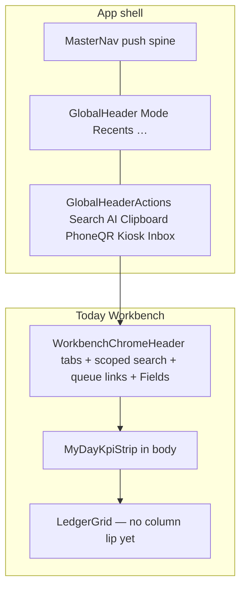

# Research briefing — premium SaaS chrome altitude (Today as proof surface)

**For:** Gemini Pro (deep research) — you do **not** have the codebase; every product fact and measurement below is embedded. Do not invent file paths or claim to have inspected source.
**From:** Cycle Forge engineering
**Date:** 2026-08-01
**Subject:** How a **world-class 2026 premium B2B ops SaaS** places **global utilities**, **workbench context chrome**, and **table-display controls** — and what Cycle Forge must change so Today (`/`) and sibling workbenches clear that bar instead of reading as “early-stage rounded-box SaaS.”
**Primary evidence:** operator screenshot of Today (`/`) on 2026-08-01 (described in §2) — crowded top context bar, floating top-right icon rail, Columns/Fields in page chrome, KPI strip above a sparse task table.
**Deliverable:** (a) industry survey with named systems + citations (prefer 2024–2026); (b) forced rulings on D1–D10 against house constraints; (c) a **concrete relocation map** (“remove X from here → put it there”) an engineer or Claude Code session can execute without inventing a parallel chrome stack; (d) a premium-threshold scorecard Today would pass/fail after the recommended changes.

**This brief is NOT “redesign the product identity” or “clone Linear pixels.”** Cycle Forge already has a named UI identity (**Kinetic Ledger**) and ratified region contracts. Your job is to pressure-test **altitude and information hierarchy** — where each control lives relative to the work surface — against top-tier premium SaaS practice, then prescribe a defended target for *this* product.

---

## 0. How to use this brief

### 0.1 Three deliverables (keep separate)

1. **What is industry standard (2026)** for premium B2B SaaS chrome altitude:
   - Global utility / command clusters (search, AI, notifications, device/session tools)
   - Workspace / view / filter context bars over dense queues
   - Column visibility / “Fields” / display controls relative to data tables
   - KPI / summary chips relative to the table they summarize
   - Cognitive load, progressive disclosure, and “one job per band”
2. **What is right for Cycle Forge.** Reconcile every recommendation against §1 and §3. Where industry conflicts with a house law, **pick a side and defend the deviation** (or tell us to change the law). Prefer a defended Kinetic Ledger deviation over a generic Notion/Sheets clone.
3. **Relocation map + Claude Code execution brief.** For every control the product owner wants “removed from the top,” say **exactly where it goes**, what opens when clicked, and which existing SoT it must compose (never invent a twin). End with a paste-ready **Claude Code prompt** (≤40 lines) that implements your winning shape on Today first, then cascades.

### 0.2 Sources to cover (minimum)

Cite **named systems** and **primary sources**. Prefer docs, design systems, changelogs, and research dated **2024–2026**.

| Class | Examples | Use for |
|---|---|---|
| **Premium command / ops SaaS** | Linear, Attio, Plain, Front, Height, Raycast + Linear-class agents, Notion (only for chrome altitude contrast, not identity) | Global utilities, command palette, sparse top chrome |
| **Payments / infra dashboards** | Stripe Dashboard, Vercel, Cloudflare, Datadog | Dense-but-calm utility placement, view chrome |
| **Design systems for B2B** | Shopify Polaris, IBM Carbon, Atlassian, Fluent 2, Material 3 Expressive (selectively) | Index tables, toolbars, overflow menus |
| **Spreadsheet / database hybrids** | Google Sheets, Airtable, Notion databases (display controls only) | Where column visibility lives relative to the grid |
| **WMS / warehouse / MES-adjacent** | At least 1–2 named public WMS/fulfillment UIs | Floor-monitor reality; do not force office-SaaS calm onto a scan floor |
| **Research / a11y** | Nielsen Norman Group (navigation / progressive disclosure), WCAG 2.2 icon-only controls | Labeling, discoverability cost of icon rails |

Where industry splits, give **both** positions, the conditions each wins under, then pick one for **this** product and say why.

**Hard fork:** “what a document editor does” ≠ “what a dense warehouse-ops queue on a 1080p floor monitor should do.” This product is the latter — but it still must clear a **premium SaaS threshold**, not an internal-tools aesthetic.

### 0.3 Anti-patterns for your answer

- Recommending a foreign grid (AG Grid, MUI DataGrid, Handsontable) or a second visual language
- Inventing a second column-visibility system beside `useGridColumnVisibility` / the table lip + `GridColumnDetailsPanel`
- Stacking a second sticky band inside the same scroll port (house sticky law)
- Raising DS ratchet baselines or forking page-local twins of `WorkbenchChromeHeader` / `GlobalHeaderActions`
- Retreating into “it depends” without a forced pick
- Framing Cycle Forge as a five-person shop tool — USAV is dogfood only; answer for sellable multi-tenant SaaS

### 0.4 Sibling briefs — do not re-answer; reconcile only where decisions collide

| Sibling | Owns | This brief may cite, must not redo |
|---|---|---|
| [`table-action-bar-fields-GEMINI-RESEARCH-BRIEFING.md`](./table-action-bar-fields-GEMINI-RESEARCH-BRIEFING.md) | 2026-07-30 Fields altitude ruling (keep in Workbench trailing; no Sheets `TableActionBar`) | Cite; **this brief may overturn** if premium-threshold + table-lip evidence is stronger |
| [`fields-chrome-to-table-lip-HANDOFF.md`](./fields-chrome-to-table-lip-HANDOFF.md) | Engineering handoff already proposing: **retire chrome Fields → LedgerGrid top-right lip → Column display right rail** | Treat as the leading engineering hypothesis under test |
| [`workbench-chrome-band-density-GEMINI-RESEARCH-BRIEFING.md`](./workbench-chrome-band-density-GEMINI-RESEARCH-BRIEFING.md) | `density="band"` geometry / segmented control | Do not re-litigate height/radius |
| [`chrome-sot-compound-GEMINI-RESEARCH-BRIEFING.md`](./chrome-sot-compound-GEMINI-RESEARCH-BRIEFING.md) | Chrome consolidation *governance* | Assume compound loop stands |
| [`daily-triage-today-chrome-parity-HANDOFF.md`](./daily-triage-today-chrome-parity-HANDOFF.md) | Today parity slices (saved views, search, trailing, KPI) | Cite current Today composition; do not redesign the feed model |
| [`grid-industry-actions-GEMINI-RESEARCH-BRIEFING.md`](./grid-industry-actions-GEMINI-RESEARCH-BRIEFING.md) | Spreadsheet action ROI inside cells/rows | Out of scope except where chrome altitude collides |

---

## 1. Product vocabulary (mandatory)

**Cycle Forge** — multi-tenant reseller-operations SaaS (receive → unbox → triage → test → repair → catalog → pack → ship → warranty/support). USAV is dogfood only.

**Kinetic Ledger** — UI identity: dense, state-colored, scan-aware; **legible throughput over document calm**. Calm chrome (Linear discipline), not Notion whitespace as the product shape. Explicit bans: random card soup, nested cards-as-rows, glowing AI dashboards, a second visual language.

**Region contracts** (house law — use these words):

| Contract | Driven by | Job | Selection | Density |
|---|---|---|---|---|
| **Station** | barcode / wedge | act-and-clear | ephemeral | `floor` |
| **Workbench** | pointer | pick → edit → persist | durable, URL-addressable | `ops` |
| **Monitor** | filters over a stream | observe only | none | `rollup` |
| **Canvas** | pan/zoom | reshape a definition | durable focus | `studio` |

**Today (`/`) is a Workbench** — personal ranked task queue over a `LedgerGrid`. Station scan regions are out of scope for this brief.

**Right-edge modality (ratified 2026-08-01, supersedes older “inspectors float” wording):** the right edge **pushes**; it never floats over the work surface. MasterNav is a push spine; context rails use `ContextPanelLayout` (resize + collapse); right-rail record / column inspectors push in-flow on `RightRailHost` (`modal={false}`, resize + collapse) and **displace the left spine before they overlap the grid**.

**Named SoTs already in play (compose; do not fork):**

| Concern | Module / law |
|---|---|
| Global utility cluster | `GlobalHeaderActions` + `GlobalHeaderSearch` (search + assistant sparkles + clipboard / phone QR / kiosk / inbox) |
| Workbench chrome band | `WorkbenchChromeHeader` `density="band"` |
| Trailing display cluster | `WorkbenchTrailingCluster` — canonical order **Sort → Fields → Import → Add** (honest absence OK) |
| Column Fields UI (chrome) | `GridFieldsMenu` — **under active retirement proposal** |
| Column display (table-proximal) | LedgerGrid sticky header **top-right lip** → `GridColumnDetailsPanel` on `RightRailHost` |
| Scoped search | `ToolbarSearchToggle` collapsed-at-rest (Today is not an always-open exception) |
| Sticky docking | One sticky chrome layer per scroll port — KPI must **not** become a second sticky inside chrome |
| Pattern law | Compose → grow SoT → never fork (`pattern-evolution.md`) |

---

## 2. Evidence — what the operator sees today (2026-08-01 screenshot)

Treat this as the **ground-truth visual complaint**. Measurements of *code placement* are in §3; this section is the *felt* hierarchy.

### 2a. Altitude stack (top → bottom)

```
┌─ App shell ─────────────────────────────────────────────────────────┐
│  [MasterNav spine — left]     [GlobalHeader left: Mode/Recents…]     │
│                               [GlobalHeader RIGHT: 6 icon utilities] │  ← A
│                                                                      │
│  ┌─ WorkbenchChromeHeader (white pill / band) ─────────────────────┐ │  ← B
│  │ Everything·1 │ Do next·1 │ Assigned to me │ Needs attention │ 🔍 │ │
│  │ Orders·107 │ Arrival·500 │ Packing·107 │ Testing·493 │ FBA·52 │  │ │
│  │ Support·0                                              [Columns] │ │  ← C
│  └──────────────────────────────────────────────────────────────────┘ │
│                                                                      │
│  ┌ KPI cards ──────────────────────────────────────────────────────┐ │  ← D
│  │ OVERDUE 1   │  DUE TODAY 0  │  UPCOMING 0                       │ │
│  └──────────────────────────────────────────────────────────────────┘ │
│                                                                      │
│  ┌ LedgerGrid ─────────────────────────────────────────────────────┐ │  ← E
│  │ TASK │ LANE │ # RECORD │ DUE                                    │ │
│  │ ● 321 Series II Media Center · DO NEXT · 8192 · Mar 13          │ │
│  └──────────────────────────────────────────────────────────────────┘ │
└──────────────────────────────────────────────────────────────────────┘
```

### 2b. The product owner’s stated instincts (under test — do not rubber-stamp)

1. **Remove the top-right global icon rail** (or radically shrink / relocate it) — search, AI/assistant, phone QR, kiosk/device preview, clipboard, notifications feel like **secondary utilities competing with the work surface**, not premium command chrome.
2. **Remove Columns / Fields from the top context bar** — it edits the table below, so it should not share altitude with lane/queue navigation.
3. **The context bar is cognitively overloaded** — personal lanes (“Everything / Do next / Assigned / Needs attention”) **and** domain queue jump-links (“Orders / Arrival / Packing / …”) **and** search **and** Columns live in one white band.
4. Goal: clear a **world-class premium SaaS threshold** — Linear / Stripe / Attio / Plain class chrome discipline — without abandoning Kinetic Ledger density.

### 2c. Felt problems to diagnose (answer each)

| Symptom | Possible causes (pick / rank) |
|---|---|
| Top-right icons feel “cheap” or unfinished | Icon-only unlabeled cluster; too many peers; wrong altitude; missing overflow; wrong jobs in global shell |
| Context bar feels crowded | Mixing lane filter + cross-domain navigation + display control in one band; count chips; insufficient progressive disclosure |
| Columns feels lost / wrong | Table-display control at page-chrome altitude; should be table-proximal (lip) or view-options overflow |
| Sparse table under heavy chrome | Chrome:content ratio inverted; KPI competing with the single work row; premium products show denser content or quieter chrome |

---

## 3. Measured current state (engineering facts — treat as ground truth)

### 3a. GlobalHeader right rail (`GlobalHeaderActions`)

Desktop cluster (left → right), shared icon gap, `min-w-[420px]` so icons column-align with the right rail:

1. **Search** — `GlobalHeaderSearch` (collapsed icon → expands field; ⌘K-class global search)
2. **Assistant** — sibling Sparkles `IconButton` (opens assistant dock) — **not** nested inside search
3. **Clipboard history**
4. **Phone sign-in QR** (`PhoneSignInQrButton`)
5. **Kiosk preview** (`KioskPreviewButton`) — desktop only
6. **Notifications / Activity inbox** (badge when count > 0)

Staff identity / org live on the **MasterNav spine footer**, not in this cluster (desktop). Mobile adds a compact account avatar.

**Comment in source already claims** “search + AI + quick-action icons” as one cluster. The product owner’s complaint is that this cluster **visually dominates the first viewport’s top-right** and competes with Today’s workbench chrome.

### 3b. Today workbench chrome (`MyDayWorkspace`)

| Slot | Content today |
|---|---|
| `tabs` | Personal lanes: Everything / Do next / Assigned to me / Needs attention (counts on tabs) |
| `search` | `ToolbarSearchToggle` — collapsed at rest; filters tasks already on screen |
| `right` | `MyDayQueueLinks` — domain queue jump cards (Orders, Arrival, Packing, Testing, FBA prep, Support) with live counts |
| `trailing` | `WorkbenchTrailingCluster` with **only** `GridFieldsMenu` (Columns / Fields) — Sort / Import / Add honestly absent |
| Body (not chrome) | `MyDayKpiStrip` — Overdue / Due today / Upcoming (horizon toggles) |
| Body | `LedgerGrid` task rows |

Engineering already documents why queue links sit in `right` not `trailing`: trailing is the **display** cluster; a queue link **leaves the surface**.

### 3c. Fields / Columns — two competing altitudes already in the codebase

| Pattern | Where | Status |
|---|---|---|
| **A. Chrome Fields** | `WorkbenchTrailingCluster` → `GridFieldsMenu` popover | Live on Today + most workbenches; prior Gemini brief (2026-07-30) **ratified keeping Fields here** |
| **B. Table lip → details rail** | Sticky column-header top-right lip → `GridColumnDetailsPanel` on pushing `RightRailHost` | Implemented on Receiving / Incoming / Catalog / Repair / Ready / Warranty / …; **Today still missing lip**; handoff proposes retiring chrome Fields house-wide in favor of B |

**This brief must resolve A vs B for premium threshold**, not leave both.

### 3d. Altitude diagram (code truth)



---

## 4. Research questions (answer all)

### Q1 — Global utility cluster

What is the **2026 premium default** for app-global utilities (search, AI assistant, notifications, device/session tools)?

Compare at least: Linear, Stripe Dashboard, Attio, Plain/Front, Vercel, one Carbon/Polaris Index page.

Force picks:

- How many **icon-only** peers may sit in the top-right before the product reads as unfinished?
- Which jobs belong in **global shell** vs **command palette only** vs **account / overflow menu** vs **removed from desktop chrome**?
- Specifically for Cycle Forge’s six: Search, Assistant, Clipboard, Phone QR, Kiosk preview, Inbox — **keep / demote / relocate / kill** each, with one-line rationale.
- Is a persistent `min-w-[420px]` icon rail aligned with the right inspector a premium pattern or a layout accident?

### Q2 — Workbench context bar composition

What belongs in a **single** workbench chrome band vs what must split?

Today mixes:

1. **Lane filters** (personal triage scopes)
2. **Cross-domain queue navigation** (Orders / Arrival / …)
3. **Scoped list search**
4. **Table display (Fields)**

Industry patterns to compare: Linear’s view/filter chrome; Stripe’s list filters; Polaris IndexTable filters; Airtable/Notion view toolbars; Carbon DataTable toolbar.

Force picks:

- May personal lanes and domain jump-links share one band?
- If not, where do domain queue links go (left context rail / overflow “Go to…” / MasterNav only / KPI-adjacent chips / elsewhere)?
- Is collapsed-at-rest scoped search correct for Today, or should Today be an always-open exception?

### Q3 — Columns / Fields altitude (premium threshold)

Re-open the 2026-07-30 ruling against the 2026-08-01 table-lip handoff and the screenshot.

Force pick **exactly one** house law going forward:

| Option | Shape |
|---|---|
| **A** | Keep Fields in `WorkbenchTrailingCluster` (prior Gemini) |
| **B** | Sole entry = LedgerGrid top-right **lip** → Column display **pushing** right rail (handoff) |
| **C** | View Options overflow (⋯) in trailing — Fields nested, not a first-class peer |
| **D** | Other (describe; must compose existing SoTs) |

Defend with industry citations **and** Kinetic Ledger / sticky / push-rail constraints. If you pick B, say what happens to Sort / Import / Add (they stay in trailing per handoff — confirm or revise).

### Q4 — KPI relative to chrome and table

Overdue / Due today / Upcoming sit in the body above the grid. Is that premium for a personal triage Workbench, or should urgency live as:

- tab badges only,
- row attention signals only,
- Monitor rollup elsewhere,
- a quieter inline summary in the chrome,
- or stay as body KPI?

Name the winning pattern and the condition under which KPI strips above sparse tables become an anti-pattern.

### Q5 — Premium threshold scorecard

Define a **pass/fail scorecard** (8–12 binary or 1–5 criteria) for “world-class premium ops SaaS chrome.” Score **Today as photographed** and score **your recommended target**. Criteria must include at least: chrome:content ratio, one-job-per-band, utility discoverability, table-display proximity, icon-only cost, cross-domain navigation discoverability, sticky-layer count, right-rail push discipline.

### Q6 — Cascade vs Today-only

If the winning relocation map starts on Today, what **must** cascade house-wide in the same program vs what may stay Today-local? Call out Fields/lip explicitly (the handoff already wants house-wide).

---

## 5. Decisions you must force (D1–D10)

For each: **pick one**, cite 1–2 sources or products, state the strongest counter-argument in one sentence, then reaffirm the pick.

| ID | Decision |
|---|---|
| **D1** | Global utility cluster: **keep as-is** / **shrink to ≤3 peers + overflow** / **command-palette-primary + minimal persistent** / **relocate most into MasterNav or account menu** |
| **D2** | Search: **global header only** / **workbench scoped only** / **both (current)** / **palette-only with no persistent icon** |
| **D3** | Assistant (Sparkles): **peer of search** / **inside search expand** / **palette / dock only** / **floating FAB (reject unless defended)** |
| **D4** | Phone QR + Kiosk preview: **global chrome** / **account overflow** / **settings / staff tools only** / **kill from desktop header** |
| **D5** | Clipboard history: **global** / **overflow** / **kill** |
| **D6** | Inbox / notifications: **always visible** / **badge on account** / **MasterNav** / **palette** |
| **D7** | Today context bar: **lanes-only** / **lanes + search** / **lanes + queues** (current) / **lanes + queues behind overflow** |
| **D8** | Domain queue links: **chrome `right`** / **left saved-views / context rail** / **MasterNav only** / **body chips under KPI** / **command palette “Go to”** |
| **D9** | Columns / Fields: **A / B / C / D** from Q3 — **one law for the house** |
| **D10** | KPI strip on Today: **keep body strip** / **collapse into tab badges** / **move to Monitor elsewhere** / **row-signal only** |

---

## 6. Brand / house constraints you must honor

1. **Kinetic Ledger** — dense, state-colored; calm chrome, not marketing whitespace.
2. **One sticky chrome layer** per scroll port — do not invent a Sheets-like second sticky `TableActionBar` above the grid.
3. **Right edge pushes** — Column display / record inspectors use `RightRailHost` `modal={false}`; displace spine before overlapping the grid.
4. **Compose SoTs** — grow `GlobalHeaderActions`, `WorkbenchChromeHeader`, `WorkbenchTrailingCluster`, LedgerGrid lip, `GridColumnDetailsPanel`; never fork page-local twins.
5. **Honest absence** in trailing cluster — empty slots are fine; fake Import/Add is not.
6. **URL is view state** — lanes via `?scope=`, selection via `?task=`, sort via `?colsort=` / `?coldir=`; do not invent parallel state stores for chrome.
7. **No second search engine** — global search stays the house search SoT; scoped Today search only refines the mounted list.
8. **Sellable multi-tenant SaaS** — every recommendation must be tenant-safe and permission-aware where it opens tools (kiosk, phone QR, inbox).

If a recommendation would make Today look like a Notion doc, a glowing AI homepage, or a consumer to-do app, **reject it and say why**.

---

## 7. Required output shape

Return your answer in this exact structure:

### A. Executive verdict (≤12 lines)
Pass/fail Today against premium threshold in one paragraph; the single highest-ROI chrome change; whether Fields law should flip from A→B.

### B. Industry survey (tables)
One table per Q1–Q4 theme. Columns: Product / Pattern / When it wins / Citation.

### C. Forced rulings D1–D10
Table: Decision / Pick / One-line why / Counter / Reaffirm.

### D. Relocation map (the artifact engineers will paste)
Markdown table:

| Control | From (today) | To (target) | Opens / behavior | SoT to compose | Cascade? |
|---|---|---|---|---|---|

Include every control named in §2–§3. “Remove” is incomplete without a “To.”

### E. Premium scorecard
Score Today-as-photographed vs Target. Show the cut line for “world-class.”

### F. Phased plan (max 4 phases)
Phase 0 = Today-only proof. Later phases cascade. Each phase: outcome, files/SoTs touched (by name from this brief), verify gate, risk.

### G. Claude Code execution prompt
A **paste-ready** prompt (≤40 lines) that:

- Assumes this Gemini report’s D1–D10 as locked
- Starts on Today (`MyDayWorkspace`) only unless a decision requires house-wide Fields/lip
- Orders: read house rules → implement relocation map → `npm run verify`
- Forbids inventing twins, raising ratchets, starting the dev server, committing unless asked
- Points at the winning SoTs by name from §1

### H. Open questions / Ask-first
Only items that truly need a human product call (e.g. killing Phone QR from desktop). Max 5.

---

## 8. Success criteria for *your* research

Your report is done when an engineer can:

1. Point at the screenshot and say which band loses which control.
2. Implement Today’s chrome without a design meeting.
3. Know whether chrome `GridFieldsMenu` survives house-wide.
4. Defend the result as **premium Kinetic Ledger**, not “we copied Linear’s pixels.”

Do not deliver mood boards, generic “improve hierarchy” advice, or a second design system.
