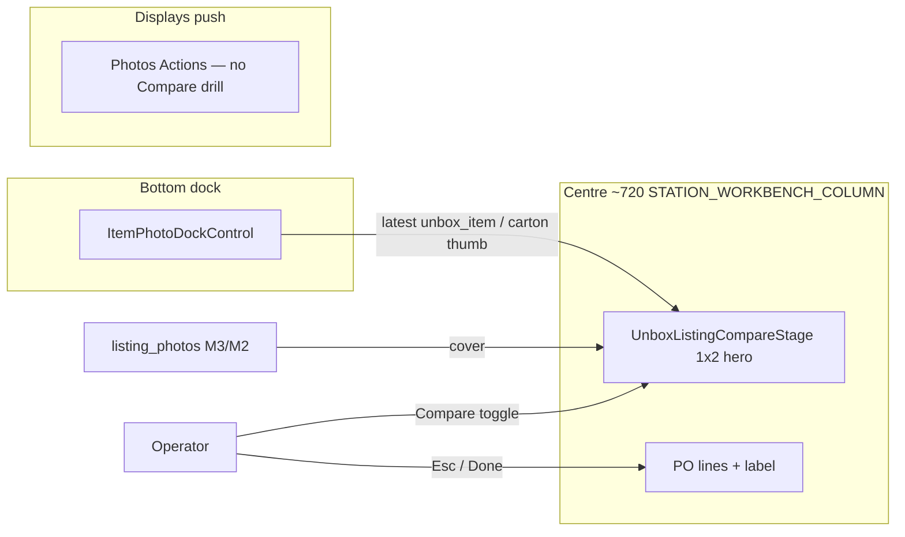

# PLAN — Unbox centre-stage listing↔bench Compare (D4 + M3/M2)

**For:** Claude Code / coding agents (paste one phase prompt at a time)  
**Date:** 2026-08-09  
**Status:** READY TO EXECUTE — Gemini Pro verdict locked (see §0).  
**Research:** [`unbox-listing-photo-compare-display-GEMINI-RESEARCH-BRIEFING.md`](./unbox-listing-photo-compare-display-GEMINI-RESEARCH-BRIEFING.md) (**ANSWERED**)  
**Supersedes (Compare UX only):** Displays leaf Compare in [`unbox-dock-listing-compare-LANE1-HANDOFF.md`](./unbox-dock-listing-compare-LANE1-HANDOFF.md) § Compare — dock honesty from that handoff stays.  
**Lane:** current checkout — attach to `:3050` (never start/restart/kill). User owns commits. Stay on branch.

**Binding rules:**  
[`AGENTS.md`](../../AGENTS.md) · [`.claude/rules/source-of-truth.md`](../../.claude/rules/source-of-truth.md) → Unbox centre · Station Displays · [`display/station-workbench.md`](../../.claude/rules/display/station-workbench.md) · [`display/scan-cockpit.md`](../../.claude/rules/display/scan-cockpit.md) · [`pattern-evolution.md`](../../.claude/rules/pattern-evolution.md).  
**Done =** phase acceptance + targeted guards + `npm run verify` green (fix only this-lane regressions).

---

## 0. Locked verdict (do not re-litigate)

| Decision | Pick |
|---|---|
| **Display home** | **D4 — Centre stage** (~720 middle): fixed **1×2 hero** = Listing cover \| Latest bench |
| **Hard bans** | **D5** full route/tab · **D6** modal · stacked thumb grids in narrow Displays as Compare |
| **Auto-open** | **(C)** Open nothing until operator asks — remove `item_photos` → Compare auto-open |
| **Capture** | **(A)** Dock-only (`ItemPhotoDockControl`) — Compare never hosts upload |
| **Media v1 primary** | **M3** durable SKU listing-gallery ingest (tenant object storage) |
| **Media v1 cold-start** | **M2** one-shot **Pull listing images** → session/durable write into gallery |
| **Difference v1** | Fixed 1×2 hero only — no wipe, no AI similarity |
| **Difference v2** | Required-angle checklist slots (later phase) |
| **Blast radius v1** | **Unbox item-photos only** — Returns SNAD = Phase 4; Pack QA stays single-thumb |

---

## 1. Target architecture



**Centre XOR:** when Compare is active, the middle shows the 1×2 stage (PO ledger condensed or swapped — see Phase 1). Dock stays mounted and operable. Displays may stay open on any other leaf; Compare is **not** a Displays occupant.

**URL (suggested — grow existing SoT, do not invent a second paint path):**

| Param | Values | Owner |
|---|---|---|
| `?compare=1` (or `compare=listing`) | absent = off · present = centre stage on | `useUnboxDisplayView` / sibling optimistic URL SoT |
| Remove | `?photoAction=compare` | after Phase 1 cutover |

Nav key (optional Phase 1b): letter jump from middle region for Compare — only if it stays wedge-safe and is not a metric. Prefer an explicit dock/tool face or Photos Actions verb that sets `compare=1` **without** opening a Displays leaf.

---

## 2. Phase map (pass gates in order)

| Phase | Name | Pass gate (must be true before next) | Estimate |
|---|---|---|---|
| **P0** | Stop the wrong path | No auto-open Compare; SoT + briefing status updated; guards expect no Displays Compare mount **or** are marked transitional | small |
| **P1** | Centre-stage 1×2 UI | Compare occupies middle; dock works; Esc restores PO; Displays Compare deleted | medium |
| **P2** | Cold-start Pull (M2) | Empty gallery shows Pull CTA; pull writes into listing gallery / session cache; hero paints cover | medium |
| **P3** | Durable ingest (M3) | Background/on-link job fills `listing_photos` before bench; P2 remains fallback | large |
| **P4** | Returns SNAD (optional) | Same centre stage on Returns station — only after P1–P2 dogfood | later |
| **P5** | Angle checklist v2 | Slot checklist — **do not start** until P1–P3 accepted | later |

**v1 shippable slice = P0 + P1 + P2.** P3 can land in parallel after P1 UI exists if gallery ingest is already half-built; do not block P1 on P3.

---

## 3. Phase 0 — Stop the wrong path

### Goal
Kill auto-open and freeze constitution so agents stop growing Displays Compare.

### Do
1. **Remove** `LineEditPanel` effect that calls `openDisplays('photos', { photoAction: 'compare' })` on `item_photos`.
2. Update [`unbox-listing-photo-compare-display-GEMINI-RESEARCH-BRIEFING.md`](./unbox-listing-photo-compare-display-GEMINI-RESEARCH-BRIEFING.md) status → **ANSWERED 2026-08-09 — winner D4 + M3/M2**.
3. Update SoT one-liners that still say “Displays Photos → Compare leaf” / “auto-opens on item_photos”:
   - `.claude/rules/source-of-truth.md` (Station Displays / Unbox)
   - `.claude/rules/display/station-workbench.md` (Photos drills)
   - `.claude/rules/display/scan-cockpit.md` if it implies Compare as rail reference for `item_photos` (rail leaf may stay `photos` Actions — not Compare drill)
4. Rewrite [`listing-photo-compare.guard.test.ts`](../../src/components/receiving/workspace/line-edit/listing-photo-compare.guard.test.ts) to **transitional** assertions:
   - Either: “no `ListingPhotoCompareHost` under `PhotosDisplayHost`” + “no auto-open compare” (if P0+P1 same PR)
   - Or: split guard — P0 asserts auto-open gone; P1 deletes host
5. Leave `ListingPhotoCompareHost` in place until P1 deletes it (avoid half-broken Photos Actions → Compare).

### Acceptance
- [ ] Entering `item_photos` does **not** open Displays Compare.
- [ ] Operator can still open Photos Displays Actions manually.
- [ ] `npm run verify -- --fast` + `listing-photo-compare` / `scan-cockpit` guards green.

### Prompt (paste)

```text
Phase 0 — Unbox Compare: stop Displays auto-open + lock SoT to D4 centre-stage plan.

Read: docs/todo/unbox-centre-stage-listing-compare-PLAN.md §3
Research verdict: docs/todo/unbox-listing-photo-compare-display-GEMINI-RESEARCH-BRIEFING.md (ANSWERED — D4)

Do:
1. Remove LineEditPanel item_photos → openDisplays('photos', { photoAction: 'compare' }).
2. Update SoT one-liners that claim Displays Compare leaf / auto-open (source-of-truth.md, station-workbench.md, scan-cockpit if needed).
3. Point briefing status to ANSWERED / D4.
4. Adjust listing-photo-compare.guard + any scan-cockpit / LineEditPanel assertions that require auto-open compare.
5. Do NOT build centre stage yet. Do NOT delete ListingPhotoCompareHost yet (P1).

Verify: targeted guards + npm run verify -- --fast; full npm run verify before done.
Attach :3050 — never start/restart/kill. Stay on branch. No commit unless asked.
```

---

## 4. Phase 1 — Centre-stage 1×2 Compare UI

### Goal
**D4:** Compare is a centre-stage instrument; Displays Compare drill is gone.

### Build
1. **New host** (name suggestion): `UnboxListingCompareStage.tsx` under `src/components/receiving/workspace/line-edit/`
   - Layout: flush 1×2 inside `STATION_WORKBENCH_COLUMN` — left **Listing cover**, right **Latest bench** (prefer newest `unbox_item` for active line; else newest carton evidence).
   - Use design-system photo thumbs / existing `PhotoThumb`; tokens only; motion via `@/design-system/motion` if any crossfade.
   - Empty listing side: honest copy + slot for P2 Pull CTA (can show disabled stub until P2).
   - Empty bench side: “Shoot from the dock.”
   - Header band: title “Compare” + Done / Esc affordance (stack-consistent; do not steal wedge — restore focus to dock scan entry after close).
2. **Wire in `LineEditPanel` / centre:**
   - When `compare` URL/optimistic flag on → render stage instead of (or over) `unboxOverview` PO block; **keep** `UnboxDockHost` mounted.
   - Prefer swap of the overview body, not a modal. Label preview may hide while Compare is on (document choice in PR notes).
3. **Entry points (operator asks):**
   - Photos Actions **Compare** verb → set centre `compare=1` (and optionally close/leave Displays on Photos Actions — do **not** set `photoAction=compare`).
   - Optional: compact control on dock during `item_photos` (“Compare”) — nice-to-have same phase if cheap.
4. **Delete Displays Compare path:**
   - Remove `ListingPhotoCompareHost` mount from `PhotosDisplayHost`.
   - Remove `compare` from `UnboxPhotoAction` / `UNBOX_PHOTO_ACTION_ORDER` / parse helpers / URL.
   - Delete or relocate `ListingPhotoCompareHost.tsx` → logic absorbed by `UnboxListingCompareStage`.
   - Update `photos-actions-armed`, `move-photos-terminal`, `station-displays-nested-grammar`, `tab-display-displays-hosts` guards.
5. **New guard:** `unbox-listing-compare-centre.guard.test.ts`
   - Centre host exists; dock capture not mounted inside stage; no `photoAction=compare`; no `ListingPhotoCompareHost` under Photos; no `window.open` for Compare itself; uses `STATION_WORKBENCH_COLUMN` / centre mount.

### Acceptance
- [ ] Compare occupies centre ~720; dock visible; capture updates right hero without dismissing Compare.
- [ ] Esc / Done restores previous centre (PO + label).
- [ ] Wedge focus not stolen on open/close (sidebar skip / dock scan owner unchanged).
- [ ] Photos Displays has no Compare drill; Compare verb arms centre stage.
- [ ] Full `npm run verify` green.

### Prompt (paste)

```text
Phase 1 — Unbox Compare centre stage (D4 1×2 hero). Delete Displays Compare drill.

Read: docs/todo/unbox-centre-stage-listing-compare-PLAN.md §4
Prereq: Phase 0 done (no item_photos auto-open).

Do:
1. Add UnboxListingCompareStage — fixed 1×2 Listing cover | Latest bench in the Unbox centre column.
2. Wire optimistic/URL compare flag; LineEditPanel swaps centre overview for the stage; UnboxDockHost stays mounted.
3. Photos Actions Compare verb → open centre compare (NOT photoAction=compare).
4. Delete ListingPhotoCompareHost + photoAction=compare from PhotosDisplayHost / unbox-side-tabs / parsers.
5. Rewrite listing-photo-compare.guard → unbox-listing-compare-centre.guard; fix sibling guards.
6. Dock-only capture — no upload UI in the stage.

Manual :3050: open carton → item_photos → click Compare → 1×2 paints → shoot from dock → right hero updates → Esc back to PO.
Verify: full npm run verify.
Attach :3050 — never start/restart/kill. Stay on branch. No commit unless asked.
```

---

## 5. Phase 2 — Cold-start Pull listing images (M2)

### Goal
Empty SKU gallery is not a silent hole — operator can **Pull listing images** once.

### Build
1. **API** (new or extend listing-gallery): e.g. `POST /api/photos/listing-gallery/pull`
   - Auth + tenant GUC; body: `{ targetKind: 'sku', targetId, listingUrl }`
   - Server fetches listing page/images **with hard timeout**, size/type caps, SSRF allowlist (http/https only; block link-local).
   - Writes into existing `listing_photos` / photo upload SoT (prefer durable write even for “session” UX — Gemini M2 as *operator-triggered ingest*, not only memory blobs).
   - Idempotent: re-pull refreshes cover set without duplicating forever (cap N images).
2. **Centre stage CTA:** when `useListingGallery` empty and `receiving_listing_url` present → primary **Pull listing images** button; loading + error toast; on success cover paints left hero.
3. **No gallery + no URL:** honest empty + link to Listings Displays leaf (optional).
4. **Guard / tests:** route auth manifest; unit test for SSRF allowlist; guard that stage mounts Pull CTA path.

### Legal / ops constraints (implement as code comments + timeout)
- Prefer marketplace APIs / already-known image URLs over HTML scrape when available.
- Log pull failures; never block receive on pull failure.
- Document ToS risk in route header (tenant-initiated, rate-limit per org).

### Acceptance
- [ ] Cold-start carton: Pull → left hero shows cover within timeout or clear error.
- [ ] Second Pull does not explode row count unbounded.
- [ ] Capture still dock-only; Compare stays open across pull.
- [ ] `npm run verify` + route-auth regenerate if route added.

### Prompt (paste)

```text
Phase 2 — Compare cold-start: Pull listing images (M2) into listing gallery.

Read: docs/todo/unbox-centre-stage-listing-compare-PLAN.md §5
Prereq: Phase 1 centre stage live.

Do:
1. POST /api/photos/listing-gallery/pull (tenant-safe, SSRF-safe, timeout, image cap) writing into listing_photos SoT.
2. UnboxListingCompareStage: empty gallery + listing URL → Pull CTA; success paints cover.
3. Tests + audit-route-auth:emit if needed.
4. Do NOT build background M3 cron yet (Phase 3). Do NOT build AI diff.

Verify: full npm run verify. Manual cold-start pull on :3050.
Attach :3050 — never start/restart/kill. Stay on branch. No commit unless asked.
```

---

## 6. Phase 3 — Durable gallery ingest (M3)

### Goal
Catalog/SKU link fills `listing_photos` **before** the carton hits the bench so Pull is rare.

### Build (outline — expand when starting phase)
1. Job trigger: on SKU↔listing URL association, PO match, or inbound sync — enqueue org-scoped worker.
2. Reuse Phase 2 pull core (shared domain helper — one fetch/write waist).
3. Observability: success/fail counts; no silent swallow.
4. Compare stage: if gallery warm, no CTA; Pull remains fallback.

### Acceptance
- [ ] Dogfood SKU with listing URL has cover before Unbox open (async lag documented).
- [ ] Pull still works when job pending/failed.
- [ ] Verify green; knip/route-auth clean.

### Prompt (paste)

```text
Phase 3 — Durable listing gallery ingest (M3). Share fetch/write waist with Phase 2 Pull.

Read: docs/todo/unbox-centre-stage-listing-compare-PLAN.md §6
Prereq: Phase 2 pull route/helper exists.

Do: enqueue ingest on listing/SKU link; reuse pull domain helper; metrics; Compare uses warm gallery without CTA.
Out of scope: Returns (P4), angle checklist (P5), AI similarity.
Verify: full npm run verify. No commit unless asked.
```

---

## 7. Phase 4 — Returns SNAD (optional)

Port `UnboxListingCompareStage` to Returns / SNAD verification with the same 1×2 + dock-or-station capture contract. **Do not** start until Unbox P1–P2 dogfooded. Pack QA stays single thumbnail — out of scope.

---

## 8. Phase 5 — v2 required-angle checklist (later)

Replace or augment 1×2 with slots (front / back / ports / serial plate). **Forbidden in v1.** No automated similarity scores.

---

## 9. Deletion checklist (must complete by end of P1)

| Delete / stop | Path |
|---|---|
| Displays Compare body | `ListingPhotoCompareHost.tsx` |
| `photoAction=compare` | `unbox-side-tabs.ts`, `PhotosDisplayHost`, parsers, visit-history fixtures that assume compare nest under photos (update tests) |
| Auto-open Compare | `LineEditPanel` `item_photos` effect |
| Stacked thumb-grid Compare UX | superseded by 1×2 hero |
| Docs saying Compare is a Photos Displays drill | SoT + Lane1 handoff note + this plan §0 |

---

## 10. Guard / SoT rewrite targets

| Artifact | Change |
|---|---|
| `listing-photo-compare.guard.test.ts` | → `unbox-listing-compare-centre.guard.test.ts` (centre mount, no Photos drill) |
| `photos-actions-armed.guard.test.ts` | Compare verb opens centre flag / callback — not `onActionChange('compare')` |
| `scan-cockpit.guard.test.ts` | `item_photos` rail may still be `photos` Actions — must **not** require Compare drill |
| `source-of-truth.md` | Unbox centre: Compare = centre stage 1×2; dock captures; Displays Photos has Move/Send not Compare |
| `station-workbench.md` | Photos drills = Move · Send only (or Actions + those); Compare called out as centre |
| `AGENTS.md` | One-line only if Compare becomes a hard law — prefer SoT detail file |

---

## 11. Manual dogfood script (P1+P2)

1. Open matched carton with SKU gallery warm → Photos Actions → Compare → centre 1×2 → listing cover left, empty/prior bench right → shoot item photo from dock → right updates → Esc → PO back.
2. Cold carton: listing URL, empty gallery → Compare → Pull → wait → cover left → shoot → Esc.
3. Confirm `item_photos` step does **not** auto-yank Displays or centre Compare.
4. Confirm Media library still same-tab; Move/Send still Displays drills.
5. Wedge scan serial while Compare open (should still work or document focus rule — prefer dock owner).

---

## 12. Out of scope (all phases unless explicitly opened)

- AI / similarity / damage scoring  
- Onion-skin / wipe  
- Second right pushover (D3) / modal (D6) / new tab (D5)  
- Dual-monitor pop-out (D7) as required path  
- Testing QC dock Lane 2  
- Remounting centre `ProcedureDeck`  
- Raising knip / DS ratchet baselines  

---

## 13. Suggested execution order for a single agent session

If time-boxed to one session: **P0 → P1** (UI cutover). Open a second session for **P2**. Park **P3+**.

If two agents: Agent A = P0+P1 UI; Agent B starts P2 API against a feature flag until P1 lands the CTA.

---

**End of plan.** Winner is centre-stage 1×2 + durable gallery with operator Pull fallback — not another right-rail drill.
