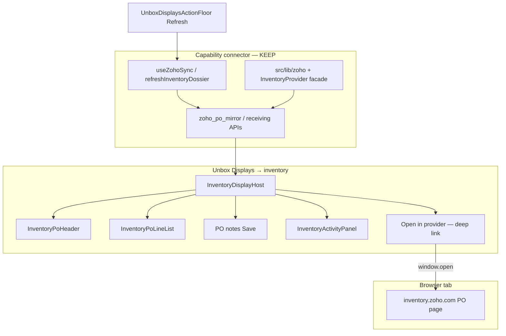

# PLAN — Unbox Inventory Displays: Zoho port = API dossier + unified deep link (no embed)

**For:** Claude Code / coding agents (paste one phase prompt at a time)  
**Date:** 2026-08-10  
**Status:** READY TO EXECUTE — Gemini Pro verdict locked for **Zoho Inventory / Unbox Inventory leaf only** (see §0).  
**Research:** [`electron-vendor-webview-displays-delete-keep-GEMINI-RESEARCH-BRIEFING.md`](./electron-vendor-webview-displays-delete-keep-GEMINI-RESEARCH-BRIEFING.md) → **Zoho/Inventory slice ANSWERED 2026-08-10** (owner paste). Listings / Electron shell work is **out of scope** here.  
**Capability program:** [`../integrations/capability-relabel-program.md`](../integrations/capability-relabel-program.md) — Zoho stays the inventory connector; Zoho-as-the-app dies.  
**Lane:** current checkout — attach to `:3050` (never start/restart/kill). User owns commits. Stay on branch.

**Binding rules:**  
[`AGENTS.md`](../../AGENTS.md) · [`.claude/rules/source-of-truth.md`](../../.claude/rules/source-of-truth.md) → Integrations · Unbox centre · Station Displays · Unboxed ≠ Received · [`display/unbox-station.md`](../../.claude/rules/display/unbox-station.md) · [`display/station-workbench.md`](../../.claude/rules/display/station-workbench.md) · [`pattern-evolution.md`](../../.claude/rules/pattern-evolution.md).  
**Done =** phase acceptance + targeted guards + `npm run verify` green (fix only this-lane regressions).

---

## 0. Locked verdict (do not re-litigate)

| Decision | Pick |
|---|---|
| **Inventory leaf shape** | **API-mirrored native dossier** (`InventoryDisplayHost` → Information · Lines · PO notes · Activity) |
| **Vendor escape hatch** | **Deep link only** — `window.open` / external tab to inventory-provider PO URL |
| **Electron / WebContentsView / iframe embed of Zoho Inventory** | **HARD BAN** — industry anti-pattern for scan stations; breaks browser-first commercialization; steals wedge focus; Zoho SPA density fights Displays column |
| **Delete native dossier for Zoho’s PO page** | **REFUSED** — keep `InventoryPoHeader`, `InventoryPoLineList`, `InventoryActivityPanel`, `useInventoryPoDossier` |
| **`ZohoSplitPane`** | **DELETE** — link-only rail occupant; `open-zoho-pane` has **no live dispatchers** (dead listener); escape hatch unifies elsewhere |
| **`src/lib/zoho/**` + sync hooks** | **KEEP** — connector + mirror sync are not UI debt |
| **Units leaf** | **KEEP** — not a Zoho surface (out of this plan’s file list; do not touch) |
| **Listings / marketplace webview** | **OUT OF SCOPE** — separate plan if pursued |

**One-sentence mission.** Finish the Zoho→capability **port** on Unbox Inventory: one SoT deep-link builder, one “Open in {provider}” affordance on the Inventory leaf / Macro floor, delete the dead Zoho rail pane, capability-correct copy — **without** embedding Zoho and **without** deleting the hand-rolled dossier.

---

## 1. Target architecture

**URL SoT (grow — do not twin):** one module builds the inventory-provider PO href from `{ purchaseOrderId?, purchaseOrderNumber? }`. Today this is duplicated:

| Location | Status |
|---|---|
| `ZohoSplitPane.tsx` `buildProviderPoUrl` | DELETE with pane |
| `useReceivingLineCore.ts` `poOpenHref` (~609–613) | **Migrate callers to SoT**; core keeps returning `poOpenHref` |
| `api/admin/po-gmail/create-zoho-draft/...` `buildZohoUrl` | Prefer shared SoT or re-export |

Suggested home (pick one in P1 — do not invent a third):

- Prefer grow: `src/lib/integrations/inventory/provider-po-url.ts` (capability-shaped; Zoho adapter supplies host/path), **or**
- `src/lib/zoho/po-open-url.ts` if facade not ready — still imported via a thin `inventoryPoOpenUrl(...)` re-export so UI never hardcodes `inventory.zoho.com`.

Operator copy: `Open in ${providerCatalogLabel('zoho')}` / `useCapabilityProviderLabel('inventory')` — never a permanent bare `"Open in Zoho"` string on product spine (Integrations hub + deep-link label exception already allowed).

---

## 2. File-level matrix (Zoho / Inventory only)

| Path | Verdict | Notes |
|---|---|---|
| `InventoryDisplayHost.tsx` | **KEEP** (+ thin add Open affordance) | Preserve armed sub-leaves; do **not** strip routing |
| `InventoryPoHeader.tsx` | **KEEP** | Density for scan bench |
| `InventoryPoLineList.tsx` | **KEEP** | Line notes / qty · rate — CF mutations |
| `InventoryActivityPanel.tsx` (+ test) | **KEEP** | Receive/unreceive trail ≠ Zoho audit UI |
| `useInventoryPoDossier.ts` | **KEEP** | Dossier data waist |
| `UnboxDisplaysActionFloor.tsx` | **KEEP** (+ copy polish) | Macro Refresh = API sync, not “open Zoho” |
| `useZohoSync.ts` / `useZohoLinePrefill.ts` | **KEEP** | Sync orchestration |
| `ZohoInboundStatusBanner.tsx` | **KEEP** | Sync health signal |
| `admin/connections/Zoho*.tsx` | **KEEP** | Admin sync tools (may deep-link Integrations) |
| `src/lib/zoho/**` | **KEEP** | Connector |
| `src/lib/integrations/inventory/**` | **KEEP / GROW** | Facade + optional URL SoT |
| `ZohoSplitPane.tsx` | **DELETE** | Dead escape-hatch pane |
| `ReceivingSurfacePage.tsx` | **THIN** | Remove `<ZohoSplitPane />` mount + comment |
| `right-rail-inspector-header.guard.test.ts` | **THIN** | Drop `ZohoSplitPane` from allowlist/paths if present |
| Units / Listings / Support trees | **DO NOT TOUCH** | Out of scope |

Measured delete budget (approx): `ZohoSplitPane.tsx` (~97) + mount wiring — small. Value is **architecture clarity**, not a line-count windfall.

---

## 3. Phase map

| Phase | Name | Pass gate | Estimate |
|---|---|---|---|
| **P0** | Lock + SoT notes | Briefing status Zoho-answered; this plan linked; no code yet required | tiny |
| **P1** | One PO open-URL SoT | Single builder; `poOpenHref` + gmail draft + any survivors call it; no raw `inventory.zoho.com` in view components | small |
| **P2** | Inventory leaf “Open in provider” | Armed verb or leaf-trailing / Macro peer opens deep link; capability label; works when id or number present | small |
| **P3** | Delete `ZohoSplitPane` | File gone; `ReceivingSurfacePage` clean; guards updated; `open-zoho-pane` string absent from `src/` | small |
| **P4** | Copy / capability polish | Macro floor tooltip / aria no longer hard-depends on “Zoho” where capability noun fits; remaining brand only on deep-link label | small |
| **P5** | Verify + dogfood | `npm run verify` green; Unbox Inventory leaf: dossier CRUD + Refresh + Open provider | required |

**v1 shippable = P1–P5.** No Electron track. No dossier deletion phase — ever, under this plan.

---

## 4. Phase details

### P0 — Lock the verdict
- Mark research briefing: Zoho/Inventory slice **ANSWERED**; point here.
- Do not open Listings/Electron work under this plan’s name.

### P1 — Unify inventory PO deep-link URL
**Do:**
1. Add `inventoryPoOpenUrl({ purchaseOrderId?, purchaseOrderNumber? }): string | null` (name flexible) in the chosen SoT module.
2. Replace inline URL builds in `useReceivingLineCore` and `create-zoho-draft` (and grep-clean any other `inventory.zoho.com/app#/purchaseorders` in `src/components/**`).
3. Unit-test: id wins over number; empty → `null`; encoding safe.

**Don’t:** change Zoho OAuth, sync routes, or mirror schema.

**Accept:** `rg 'inventory\\.zoho\\.com' src/components` returns **zero** (connector/lib + new SoT may own the host string).

### P2 — Surface Open on Inventory Displays
**Do:**
1. From `InventoryDisplayHost` (preferred: armed verb on index **or** sticky trailing when a PO is paired) call `window.open(href, '_blank', 'noopener,noreferrer')` using P1 SoT + row’s `zoho_purchaseorder_id` / number.
2. Label via `providerCatalogLabel` / `useCapabilityProviderLabel('inventory')` → `Open in {label}`.
3. Disable / hide when unpaired or href null; empty state already pushes Change PO → Linkage — leave that path.

**Don’t:** mount a rail occupant, iframe, or WebContentsView. Don’t duplicate Open on every sub-leaf if index verb is enough.

**Accept:** With a paired carton, operator can leave to Zoho PO in one click from Inventory Displays; carton context `poOpenHref` still works (same SoT).

### P3 — Delete `ZohoSplitPane`
**Do:**
1. Remove mount from `ReceivingSurfacePage.tsx` (and the “Electron-only” comment).
2. Delete `ZohoSplitPane.tsx`.
3. Update `right-rail-inspector-header.guard.test.ts` (and any other references).
4. Confirm `rg 'open-zoho-pane|ZohoSplitPane' src` is empty (allow historical comment in `useHorizontalEdgeResize` if it only mentions origin — rephrase to drop the filename if the guard cares).

**Accept:** No dead listener; deep link still available via P2 + existing `poOpenHref` chip path.

### P4 — Capability copy on Inventory chrome
**Do:**
1. `UnboxDisplaysActionFloor` refresh tooltip/aria: prefer “Refresh inventory” / “Refresh from inventory provider” over “from Zoho” where it doesn’t reduce clarity; deep-link Open may keep provider brand.
2. Grep Inventory leaf strings for unnecessary Zoho-as-product spine copy; leave connector file names (`useZohoSync`) alone.

**Accept:** Product spine speaks capability; brand survives on Open deep-link + Integrations.

### P5 — Verify
- `npm run verify` (full) green.
- Manual Unbox: paired PO → Inventory → Information/Lines/Notes/Activity still work; Macro Refresh pulls mirror; Open provider hits correct Zoho PO; unpaired still routes Change PO.

---

## 5. Explicit non-goals

- Electron / Tauri / `WebContentsView` shell for Zoho.
- Deleting or collapsing Information · Lines · Notes · Activity into one Zoho iframe.
- Touching Units, Listings, Photos Compare, Support console, or Integrations hub connect flow.
- Raising DS ratchet baselines.
- Migrating vault / burning Zoho env fallbacks (separate capability-relabel Phase 5 — blocked prerequisite).
- Expanding `zoho-received-check-watchlist-PLAN.md` scope.

---

## 6. Migration order (live Unbox)

1. P1 SoT first (behavior-preserving).  
2. P2 add Open (additive).  
3. P3 delete dead pane (safe once Open exists — carton `poOpenHref` already covers desk chips).  
4. P4 copy.  
5. P5 verify.

If P2 slips, P3 may still ship: `poOpenHref` on carton context already deep-links; pane is unused.

---

## 7. Phase prompts (paste one at a time)

### Prompt — P1
> Execute **P1** of `docs/todo/unbox-inventory-zoho-deep-link-port-PLAN.md`. Create one inventory PO open-URL SoT; migrate `useReceivingLineCore` `poOpenHref` and `create-zoho-draft` URL builder; add unit tests; remove hardcoded Zoho PO URLs from `src/components/**`. Do not delete `ZohoSplitPane` yet. Do not embed Zoho. Run targeted tests + `npm run verify -- --fast`, then full `npm run verify` before claiming done. User owns commits.

### Prompt — P2
> Execute **P2** of `docs/todo/unbox-inventory-zoho-deep-link-port-PLAN.md`. Add “Open in {inventory provider}” on Unbox `InventoryDisplayHost` using the P1 SoT + capability label helper. Deep link only (`window.open`). No iframe/webview/rail pane. Verify unpaired/null href behavior. `npm run verify` before done.

### Prompt — P3
> Execute **P3** of `docs/todo/unbox-inventory-zoho-deep-link-port-PLAN.md`. Delete `ZohoSplitPane.tsx`, unmount from `ReceivingSurfacePage`, update guards, grep-clean `open-zoho-pane` / `ZohoSplitPane`. Confirm deep link still works via P2 and/or `poOpenHref`. `npm run verify` before done.

### Prompt — P4 + P5
> Execute **P4–P5** of `docs/todo/unbox-inventory-zoho-deep-link-port-PLAN.md`. Capability-polish Inventory Macro / leaf copy; full `npm run verify`; summarize dogfood checklist results.

---

## 8. Acceptance checklist (whole plan)

- [ ] No Zoho Inventory embed path introduced anywhere  
- [ ] Native Inventory dossier files still present and wired  
- [ ] Single PO open-URL SoT; components don’t hardcode Zoho host  
- [ ] Inventory Displays (or Macro) can Open provider when paired  
- [ ] `ZohoSplitPane` deleted; `ReceivingSurfacePage` clean  
- [ ] Sync Refresh still API-mirrored (`useZohoSync` / floor icon)  
- [ ] Units / Listings / Support untouched  
- [ ] `npm run verify` green  

---

## Appendix A — research extract (locked)

> Dominant pattern: **API-mirrored dossiers + deep links**. Embedding vendor portals in a desktop wrapper is not the scan-station standard. Electron `BrowserView` is deprecated (→ `WebContentsView`); session split-brain makes embeds costly. **Contra-owner:** keep `InventoryPoHeader` / `InventoryPoLineList`; keep Activity; delete `ZohoSplitPane`; do not replace dossier with Zoho SPA.

## Appendix B — related docs

| Doc | Role |
|---|---|
| `electron-vendor-webview-displays-delete-keep-GEMINI-RESEARCH-BRIEFING.md` | Parent research (Zoho slice answered here) |
| `../integrations/capability-relabel-program.md` | Zoho connector stays; brand off spine |
| `zoho-received-check-watchlist-PLAN.md` | Separate received-check work — do not merge |
| `saas-commercialization-plan.md` §0 | Browser-first; no desktop app as primary |
