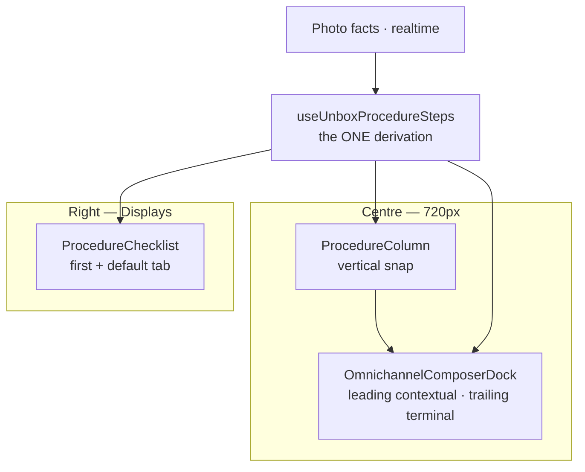

# Unbox procedure — vertical step column + contextual dock · EXECUTION HANDOFF

**Date:** 2026-08-02 · **Lane:** WS-DOGFOOD (`main`) · **Status:** ready to execute · **decisions locked**
**Filename keeps `chat-progression`** for link stability; the chat/thread metaphor is **retired** —
this surface is a snap-scrolled column of steps, not an accumulating thread.
**Supersedes:** [`unbox-guided-procedure-INDEX.md`](./unbox-guided-procedure-INDEX.md) D12 / D12a,
**and the horizontal card rail** in
[`display/station-workbench.md`](../../.claude/rules/display/station-workbench.md) → *The card rail*.
§10 lists every passage that must change **in the same landing as the code**.
**Reads with:** [`display/station-workbench.md`](../../.claude/rules/display/station-workbench.md) ·
[`display/motion-crossfade.md`](../../.claude/rules/display/motion-crossfade.md) ·
[`display/station.md`](../../.claude/rules/display/station.md)
**Grok / non-Claude agents:** read the companion
[`unbox-procedure-chat-progression-GROK-RULES.md`](./unbox-procedure-chat-progression-GROK-RULES.md)
**first** — it is the hard-rule contract. Five of its rows describe the horizontal rail and are
superseded here; §10 names them.

---

## 0. Paste prompt

```
Refactor the Unbox procedure surface from a horizontal card rail into ONE vertical scroll-snap
column of step sections, and make the bottom dock per-step contextual.

Read first, in order:
1. docs/todo/unbox-procedure-chat-progression-HANDOFF.md   (this file — the shape + the phases)
2. docs/todo/unbox-procedure-chat-progression-GROK-RULES.md (the hard rules; they bind you —
   except the rows this handoff §10 supersedes, which you rewrite in the same landing)
3. .claude/rules/display/station-workbench.md → "The procedure has TWO views" + "The card rail"
4. .claude/rules/display/motion-crossfade.md  → the layout-animation ban
5. AGENTS.md + .claude/rules/workflow-safety.md — attach :3050, never start/kill a dev server;
   the user owns commits.

Already built (do NOT re-implement):
- ProcedureCards (horizontal rail) + ProcedureChecklist (right rail), both reading ONE hook
  `useUnboxProcedureSteps`; shared focus store `src/lib/receiving/procedure-focus-store.ts`
- step-face registry (icon + functional hue) + its guard
- step-body registry `line-edit/steps/` + its guard
- pure pointer `src/lib/receiving/procedure-pointer.ts`

Your job: Phases M-0 … M-3, then STOP at M-4 for a dogfood demo. No Playwright suite until the
geometry is approved. ProcedureCards is EVOLVED in place (horizontal → vertical); do not fork a
second card renderer beside it. The rule/docblock reconciliation in §10 lands WITH the code.

BEFORE you write any animation, run the Motion pass in §3 (/motion skill + Motion MCP docs
search). Do not improvise a curve or a spring.

The four bans that will bite you first:
- Every step section stays mounted, in vocabulary order, at a CONSTANT height. Nothing is
  hidden, re-sorted, collapsed, unmounted, or layered behind anything.
- Dimming is a FOCUS channel, never a state channel, and never occlusion.
- No layout animation anywhere on this surface. None. The old sanctioned exception is withdrawn.
- Nothing here takes keyboard focus — including a clicked nav chip, which must hand focus back
  to the scan bar.

npm run verify must stay green on YOUR files (the tree holds other sessions' work — attribute
before you fix). Never raise a ratchet baseline. Do not commit unless asked.
```

---

## 1. The target shape

One vertical column. **Every** step in vocabulary order, one per scroll-snap viewport, all at the
same height. The operator pages down through the procedure; the active step is at full strength and
its neighbours are dimmed but fully present. The dock below is that step's own input.

```
┌─ StationContextBar ────────── (unchanged, absolute float) ────────────┐
└───────────────────────────────────────────────────────────────────────┘
┌─ ProcedureColumn — STATION_WORKBENCH_COLUMN (720px) ──────────────────┐
│  ┌─────────────────────────────────────────────────────────────────┐  │  ▲ scrolls
│  │ ① 📷 Arrival photos        9 photos · 10:38 ✓         dim: far  │  │  │
│  └─────────────────────────────────────────────────────────────────┘  │  │  SETTLED
│  ┌─────────────────────────────────────────────────────────────────┐  │  │  (dimmed,
│  │ ② 🏷 Shipping label        2 photos · 10:41 ✓         dim: near │  │  │   never
│  └─────────────────────────────────────────────────────────────────┘  │  │   hidden)
│  ╔═════════════════════════════════════════════════════════════════╗  │ ◄── SNAP
│  ║ ③ 🖼 Item photos                                      FULL      ║  │
│  ║    ── this step's own capture body ──                           ║  │     ACTIVE
│  ╚═════════════════════════════════════════════════════════════════╝  │
│  ┌─────────────────────────────────────────────────────────────────┐  │  │  PENDING
│  │ ④ 🏷 Condition                    pending            dim: near  │  │  │  (dimmed,
│  └─────────────────────────────────────────────────────────────────┘  │  ▼   never
│                                                                       │      hidden)
│  [ ‹ Shipping label ]                              [ Condition › ]    │ ← column neighbours
└───────────────────────────────────────────────────────────────────────┘
┌─ OmnichannelComposerDock — contextual chrome, INVARIANT terminal ─────┐
│  ③ Item photos · 4 of 6 · last scan ····4821                          │ ← scan echo (derived)
│  [ step control(s) · note… ]                          [ ▾ | Receive ] │
└───────────────────────────────────────────────────────────────────────┘
     └── contextual per active step ──┘        └── carton-terminal, never re-labels ──┘
```

### Mockup → implementation

| Mockup | Implementation |
|---|---|
| Previous card, lower opacity | Settled / neighbour sections on the opacity ladder `100 / 60 / 40` — **focus channel only**; state stays glyph + tone |
| Current card, highest opacity | Active section at full opacity, hosting that step's own body |
| `‹ back` · `next step title ›` | Neighbour chips carrying the **real vocabulary labels**; omitted at the ends (honest absence, never a dead disabled chip) |
| Bottom bar | Dock **leading** zone, contextual per `activeKey` (step control + derived scan echo + note); **trailing** Print · Receive unchanged |

### One derivation, three consumers



### Three properties carry the whole design — do not trade any of them away

1. **Nothing is ever hidden.** Every step is mounted, sized, and legible from the first frame.
2. **Nothing is ever occluded.** Sections are flat siblings — no z-stacking, no pile, no card behind
   a card. Dimming is not occlusion: a dimmed section is fully present and readable when scrolled to.
3. **Nothing ever changes size.** Every section is the same fixed height whatever its state, so
   advancing a step reflows nothing.

---

## 2. Four conflicts, and how each resolves

Each is a house law this change touches, with a specific resolution — you are not free to re-decide
them.

### 2.1 A vertical stack is what attempt #1 was — and it was deleted

`UnboxCaptureStack` was deleted at `33a3eb609` ("completely terrible"). Its diagnosis, recorded in
`derive-capture-step-states.ts`, is exact:

> it hid pending steps and re-sorted completed ones so the current card could sit at the bottom,
> which made the procedure unreadable as a procedure

A second refused pattern was the **depth pile** — rows layered behind one another, which bought
compression by occluding the completion times the record exists to show.

**Read the diagnosis literally: the defects were HIDING, RE-SORTING, and OCCLUDING. Not
verticality.** This column does none of the three:

| Killed attempt #1 | This column |
|---|---|
| hid pending steps | every step mounted, from the first frame |
| re-sorted completed ones | strict `deriveProcedureSteps` vocabulary order, always |
| (pile) layered rows behind each other | flat siblings, no z-stacking, no overlap |
| current card pinned to the bottom | the active step is a **snap target**, wherever it falls |

The horizontal rail solved the same problem by spending horizontal room. This solves it by spending
**vertical** room and paging — which the column has once the label preview folds into its own step
(§2.3) instead of sitting below the surface.

**The right-rail checklist coupling stands.** The column answers *what am I doing and what is next*,
one screen at a time; the checklist answers *how much of the whole job is left*, without scrolling.
**Do not ship this geometry with the checklist hidden, collapsed, or de-defaulted** — if that
changes, this centre reverts in the same change. State the coupling in the component docblock, and
record *why pending work left the centre*: the checklist is mounted and defaulted and is the map.
Guard in §6.

### 2.2 The sanctioned layout animation is WITHDRAWN — there is now none

The previous revision of this handoff claimed the sanctioned PUSH exception for a settling row's
`collapseHeight` reveal. **That exception is withdrawn, because the shape no longer needs it.**

Nothing enters or leaves the column: all sections are mounted from the first frame, and each is a
**constant-height** box whose *contents* swap between a static face and the active body. A content
swap inside a fixed box is a crossfade, not a reflow.

So the rule here is the plain house law with no exception attached:

- **Opacity and transform only. No height, width, padding, top, or left is animated anywhere.**
- **Travel between steps is native CSS scroll-snap**, nudged by `scrollIntoView`. The browser owns
  it, and it degrades to an instant jump under `prefers-reduced-motion` — the correct reduced form.
- **The active section's contents** crossfade on `activeKey` with `framerPresence.stationCartonSwap`
  + `framerTransition.stationCartonSwapMount` (the station-cadence preset — 0.12s, `duration: 0`
  exit). The dock's leading zone uses the same preset, for the same reason.
- **The opacity ladder is CSS**, `motion-safe:`-gated, on the section — never a framer `whileHover`,
  never a per-section `motion.div` animating opacity on pointer move.

**Why this matters more here:** a step advances 9–24 times per carton. At a bench, motion is
latency. The one thing the layout-animation ban exists to prevent is a surface that reflows on its
own that often — and a fixed-height column cannot.

**Still banned:** `layout` / `layoutId` on the column or any section; scroll-linked animation
(`animation-timeline`, `useScroll`); a spring on a discrete swap; anything over ~300ms; a JS scroll
animation replacing snap.

### 2.3 The label is `commit` phase, and the bench does not render commit steps

`print` is declared `phase: 'commit'` in `src/lib/stations/procedure.ts`. `captureStepVocabulary`
resolves the `capture` phase only, and `procedure-divergence.guard.test.ts` asserts the bench renders
capture and nothing else. Today `UnboxLabelPreview` mounts *below* the surface, outside the sequence
— which is why the operator never sees the label as a step, and why the column has the vertical room
it needs once that mount is gone.

**Locked: option (a).** Add a `label` step to the `capture` phase. It is genuinely bench work — the
operator reads the printed face and confirms it before it goes on the box. Gate it on
`receiving_line.label_note` / face resolution being non-empty, or on a `label_previewed_at` stamp if
no honest derived fact exists. **Do not gate it on `labelPrinted`**, which is the commit act and
belongs to the terminal dock. `print` stays `commit` on the trailing terminal.

*(Option (b) — promoting `print` itself to capture — is rejected: two surfaces owning one commit is
the cross-region action-at-a-distance the carton-terminal decision exists to prevent. Reopen only
with evidence Print · Receive stays unambiguous.)*

The label step gets a face, a section body, a dock control, and a gate, and all guards must pass with
it declared. The preview then renders **inside its own section**, and the standalone
`<UnboxLabelPreview>` mount is deleted — one label surface, not two.

### 2.4 A contextual dock vs. "the carton terminal never re-labels"

`station-workbench.md` is explicit: `STATION_TERMINAL_REGISTRY.unbox` is `hasSectionTabs: false` +
`defaultKind: 'mode-default'`, so the bottom primary is **always Print · Receive** and never changes
with a Displays selection — *"a click on the RIGHT re-labelling the button at the BOTTOM is
cross-region action-at-a-distance."*

That law is not violated here, and the reason is precise: **it bans a control in one region
re-labelling a control in another.** The active step is set in the column **directly above** the
dock — same region, adjacent, and it is the operator's current work. What the law protects is that
*the commit* stays unambiguous. So the dock splits into two zones with two contracts:

| Zone | Scope | Contract |
|---|---|---|
| **Leading — contextual** | the **active step** | the step's own control + derived scan echo + the note field. Swaps with `activeKey`. |
| **Trailing — terminal** | the **carton** | Print · Receive. `defaultKind: 'mode-default'`, registry untouched. **Never re-labelled, never step-scoped, never conditionally hidden, never animated.** |

Three invariants inside that split:

- **One note target.** The composer writes `receiving_line.notes` and only that. The Grok rules
  already sanction this shape: *"It is contextual in its chrome, not its target."* A step-scoped note
  store is forbidden — the placeholder may name the step, the column it writes may not.
- **The scan echo is DERIVED, never a local counter.** It reports what the carton's facts now say for
  the active step ("4 of 6", "····4821 captured"). It must never claim a completion the derivation
  has not made, and renders honest absence as `—`.
- **The dock never takes focus.** No `autoFocus` on the composer, no `.focus()` on the step control.
  See M-1: there is a live violation to remove.

**A step control is a LOCAL control, not a dock kind.** Do not add step ids to
`STATION_TERMINAL_REGISTRY`, and do not build an imperative bridge from the column into the dock —
both zones read the same hook, so they cannot disagree.

---

## 3. Motion execution — required BEFORE any animation edit

House law binds first: **call sites import only `@/design-system/motion`**; named presets are
added/adjusted in
[`motion-framer.ts`](../../src/design-system/foundations/motion-framer.ts); never `framer-motion`;
never an inline transition literal in an Unbox/procedure component. Motion's own docs say
`motion/react` — that package is named in exactly one file, the design-system motion waist.

### Tooling

| Tool | Where | When |
|---|---|---|
| **`/motion` skill** | [`.claude/skills/motion`](../../.claude/skills/motion/SKILL.md) | The entry point. React best-practices + performance audit; prefer transform/opacity; no layout thrash |
| `search-motion-docs` | Motion MCP (`motion`), platform `react` | **First step before any animation edit** |
| `generate-css-easing` | Motion MCP | Only if a CSS opacity/snap sibling needs a curve — **`bounce: 0`, no overshoot**. A bench is snappy enterprise, not springy |
| `search-motion-source` | Motion MCP (Motion+) | Optional example source; Motion+ needs auth. The free MCP returns demos/metadata only |

If the Motion MCP is not connected in your session, say so and proceed via the `/motion` skill plus
the existing production-proven presets — do **not** invent a curve to fill the gap.

### Ordered steps

1. **Search before coding each effect.** Targeted `search-motion-docs` calls for:
   `AnimatePresence` opacity crossfade (dock leading + active body swap) · `scrollIntoView` / CSS
   scroll-snap (expect CSS-native — do **not** invent a JS scroll timeline if the docs have none) ·
   `reducedMotion` / `MotionConfig` (confirm the hard cut under the app-wide `reducedMotion="user"`).
   Read the resource links returned; build on official patterns, do not improvise springs.
2. **Classify every effect against the bans** before writing it:

   | Effect | Engine | Notes |
   |---|---|---|
   | Column travel | **CSS only** — `snap-y snap-mandatory` + `scrollIntoView({ behavior: 'smooth', block: 'start' })` | Browser owns reduced motion. No `useScroll`, no `animation-timeline`, no JS scroll spring |
   | Opacity ladder | **CSS** `motion-safe:transition-opacity` | Compositor-friendly. Not a spring. Not a substitute for the state glyph |
   | Active body swap · dock leading swap | **Existing** `framerPresence.stationCartonSwap` + `framerTransition.stationCartonSwapMount`, via `useMotionPresence` / `useMotionTransition` | Tween ~0.12s. No new spring |
   | Trailing terminal | **none** | The CTA label does not animate |

3. **Preset changes only in the SoT.** If a new named role is genuinely needed (e.g. a softer opacity
   duration), add it beside its siblings in `motion-framer.ts` and consume it through the
   `@/design-system/motion` hooks. If `generate-css-easing` produces a CSS curve, bake the duration +
   `linear()` into a **named token or constant in the foundations file** — never a call-site literal.
   Prefer ~0.2s, snappy, `bounce: 0`.
4. **Wire, then re-check focus.** Apply the presets, then confirm every pointer control still
   dispatches `receiving-focus-scan` after it acts. Scroll, never focus.
5. **Verify the motion gates.** `motion-major.guard.test.ts` must stay green (no motion package
   imported outside `src/design-system/motion/**`). Spot-check reduced motion by hand: snap jumps
   instantly, opacity stays readable, nothing rubber-bands.

---

## 4. Phases — land M-0 … M-3, then **stop**

The rule + docblock reconciliation in §10 lands **with** this code, not after it.

### M-0 · Evolve `ProcedureCards` → `ProcedureColumn` (no fork)

Run the §3 Motion search pass first (snap + opacity + the existing swap preset).

- Rename/evolve
  [`ProcedureCards.tsx`](../../src/design-system/components/procedure/ProcedureCards.tsx) →
  `ProcedureColumn.tsx`; update
  [`index.ts`](../../src/design-system/components/procedure/index.ts) and the Unbox adapter.
  **One card renderer** — a second file beside it is the fork the house rules ban.
- Props: flat `steps` (**every** step, vocabulary order — never filter, hide, or re-sort),
  `activeKey`, `prevKey` / `nextKey`, `face`, `renderActiveBody`, `onSelectStep`.
- Scroll port: `snap-y snap-mandatory` + `overscroll-contain`, **exactly one port** — no nested
  scroller inside a section. An operator with a scanner in one hand cannot be asked which of two
  scrollers they are in.
- Section: `snap-start snap-always` at one exported height constant `PROCEDURE_STEP_VIEWPORT`,
  applied to every section regardless of state. Never a per-state height, never `h-auto`.
- Active scroll: `scrollIntoView({ block: 'start', behavior: 'smooth' })` — **never `.focus()`**.
  A light nudge fires on step advance (**including after a successful evidence scan**) and on a
  neighbour-chip click. (`block: 'start'` supersedes the `'nearest'` the Grok rules illustrate for
  the old horizontal rail; `'nearest'` on an equal-height snap column can park a section straddling
  two snap positions. The invariant is *scroll, never focus*.)
- Opacity ladder `100 / 60 / 40` via CSS transition — tuned so the dimmest is still **readable
  evidence**, not decoration. It is a **focus** channel only: `done` / `skipped` / `pending` stay
  carried by the face's glyph + tone, so a colour-blind or low-vision operator loses nothing.
- Neighbour chips carry the **real vocabulary labels** (`‹ Shipping label`, `Condition ›`) — never a
  bare "Next". Omitted at the ends.
- **A clicked control hands focus back.** A nav chip or section click natively focuses the button —
  and then the next wedge scan types into it and its Enter re-activates it. Every pointer control
  here dispatches `receiving-focus-scan` after it acts. This is a **new** rule and it applies to the
  existing rail's `onSelectStep` too; fix it there while you are in the file.
- **Scan routing is unchanged:** a new tracking / order scan still starts a new carton through the
  existing scan-apply path. Any other scan stays on the current display and feeds the active step.
- Adapter: evolve
  [`UnboxProcedureCards.tsx`](../../src/components/receiving/workspace/line-edit/UnboxProcedureCards.tsx)
  into the column adapter; wire from `buildUnboxOverview` in
  [`unbox-tabs.tsx`](../../src/components/receiving/workspace/line-edit/terminal/unbox-tabs.tsx).
- Width `STATION_WORKBENCH_COLUMN`; radius `cornerClass`; elevation `elevationClass`. Never a literal.

### M-1 · Contextual dock leading zone

Motion search first; reuse `stationCartonSwap` for the leading-zone content swap.

- Extend the step registry
  ([`line-edit/steps/`](../../src/components/receiving/workspace/line-edit/steps/)) so every capture
  step declares **both** a section body and a `DockControl` — **required, not optional**. An optional
  slot means every step you did not visit silently renders an empty bar, and the compiler stays quiet
  about exactly those. One registry, two mount points, one declaration, so they cannot drift.
- Wire the leading region in the Unbox notes path
  ([`LineNotesCard.tsx`](../../src/components/receiving/workspace/line-edit/LineNotesCard.tsx) /
  [`WorkspaceNotesCard.tsx`](../../src/components/receiving/workspace/line-edit/WorkspaceNotesCard.tsx))
  from the same hook's `activeKey`. The shell stays the one
  [`OmnichannelComposerDock`](../../src/design-system/primitives/OmnichannelComposerDock.tsx) — no
  second dock.
- **Remove the print-step autofocus.** `LineNotesCard.tsx:111-115` runs
  `if (activeStep === 'print') requestAnimationFrame(() => focusTextEnd(textareaRef.current))` — it
  fires on *derived* step advance with no operator gesture, puts the caret in a textarea, and the
  next wedge scan lands in the note instead of the scan bar. That is the §2 failure mode exactly, and
  it is live today. Delete it, and drop the now-unused `activeStep`-for-focus prop path.
- **Audit, don't blanket-remove, the other one.** `appendToNotes` (`:152-160`) also focuses the
  textarea, but after an *operator-initiated* insert. Decide deliberately whether the wedge should be
  parked in the composer at that moment; if it should not, dispatch `receiving-focus-scan` after the
  insert instead. Record the decision in the PR.
- Scan echo derived from the hook's summaries; honest `—` for absence. Note target stays
  `receiving_line.notes` only.
- Trailing terminal unchanged: `STATION_TERMINAL_REGISTRY.unbox` + the existing Receive/Print VM. No
  motion on the trailing CTA label.

### M-2 · Column neighbours in the hook

[`useUnboxProcedureSteps`](../../src/components/receiving/workspace/line-edit/useUnboxProcedureSteps.ts)
exposes `prevKey` / `nextKey`. It stays **one hook, one derivation**; the checklist keeps consuming
the flat `steps` array.

Two traps, both live in the current code:

- **`nextStep` is NOT `nextKey`.** The existing `nextStep` is documented as *"what a skip would
  advance TO"* — the next **pending** step. `nextKey` is the next **column neighbour in vocabulary
  order**, whatever its state, because that is what paging down lands on. Reusing `nextStep` for the
  chip sends the operator past a step they can still scroll to. Pinned by a test.
- **`settled` is already taken** — on this hook it is a boolean meaning *evidence has hydrated*. Do
  not add a `settled` array beside it; there is no partition in this design at all.

Never partition or re-order in a view.

### M-3 · Label as a capture step

Per §2.3, option (a). Touches
[`procedure.ts`](../../src/lib/stations/procedure.ts) (declaration),
`derive-capture-step-states.ts` (gate + `GATED_KEYS`), `steps/index.ts` (section body **and** dock
control), `steps/step-face.tsx` (icon + hue — `Printer` or `Tag`, hue `violet` for identity), and
deletes the standalone `UnboxLabelPreview` mount in `unbox-tabs.tsx`. All guards pass with the new
step declared. `print` stays `commit` on the trailing terminal.

### M-4 · **STOP. Demo and get approval.**

Attach to `:3050` and show it on the dogfood tenant: the column mid-carton (a settled, an active and
a pending step on screen at once) and the dock's contextual leading zone beside an unchanged
Print · Receive. **A vertical procedure surface was rejected once before** (§2.1) — validate the
resolution before spending anything else.

### Post-approval only · Playwright (QA org, `--project=qa-desktop`)

Not part of this pass. When approved:

| Spec | Asserts |
|---|---|
| `unbox-procedure-column.spec.ts` | every vocabulary step is in the DOM, in order, at the same height — before and after a step completes |
| + row | completing a step moves the snap target down one; no section unmounted, hidden, or re-ordered |
| + row | **the scan bar still holds focus after a step settles, and after a nav chip is clicked** (`data-station-scan-input`) |
| + row | the column scrolls, not the page; exactly one scroll port |
| + row | the checklist and the column agree on every step's state (one derivation, two views) |
| `unbox-procedure-dock.spec.ts` | the leading region swaps with the active step; **the trailing terminal label is byte-identical across every step**; the note still writes `receiving_line.notes` |
| `unbox-procedure-label-step.spec.ts` | the label renders inside its own section; Print · Receive unchanged |
| extend `unbox-scan-focus.spec.ts` | unchanged behaviour survives |

---

## 5. Hard nevers for this change

Beyond the standing house laws:

- **Never hide, unmount, collapse, filter, or re-sort a step section.** All steps, always, in
  vocabulary order. This is the defect that killed attempt #1.
- **Never layer sections.** No z-stack, no pile, no overlap. Flat siblings only.
- **Never let a section's height depend on its state**, and never animate a height here.
- **Never use dimming as a state channel.** It encodes focus; state is glyph + tone.
- **Never dim a section past legibility.** The evidence in a settled step is the record.
- **Never nest a second scroll port** inside the column.
- **Never animate the column's travel in JS.** CSS scroll-snap + `scrollIntoView`.
- **Never put `layout` or `layoutId` on the column or a section.**
- **Never let the column, a section, a chip, or the dock take focus** — and always hand focus back to
  the scan bar after a pointer control acts.
- **Never re-label, hide, step-scope, or animate the trailing terminal.** Print · Receive is
  carton-terminal.
- **Never add a step-scoped note store.** Contextual chrome, one target.
- **Never let the scan echo claim a completion the derivation has not made.**
- **Never add a second label surface**, and never gate the label step on `labelPrinted`.
- **Never add a per-step duration, an elapsed clock, or a progress percentage.**
- **Never fork a second card renderer** — `ProcedureCards` is evolved in place.
- **Never invent a curve or a spring.** Run §3 first; presets live in the foundations file.
- **Never hand-roll a card shell, a `max-w-[720px]`, a `focus:ring-*`, a raw `z-[N]`, or a
  `font-bold`.**
- **Never import a motion package outside `src/design-system/motion/**`.**
- **Never raise a ratchet baseline**, and never `test.skip` around missing QA data.

---

## 6. Guards — land with M-0 … M-3

| Guard | Pins |
|---|---|
| `procedure-column-order.test.ts` | the column renders **every** step from `deriveProcedureSteps`, in vocabulary order, none filtered / re-sorted / unmounted — attempt #1's exact defect |
| `procedure-column-geometry.guard.test.ts` | every section composes the one `PROCEDURE_STEP_VIEWPORT` height and `snap-start`; no per-state height; no animated height |
| `procedure-column-neighbours.test.ts` | `prevKey` / `nextKey` are column neighbours in vocabulary order and are **not** `nextStep` (the skip target) |
| extend `procedure-step-body.guard.test.ts` | every capture step declares **both** a section body and a `DockControl`; the new `label` step included |
| extend `procedure-step-face.guard.test.ts` | the new `label` step has an icon + hue |
| `procedure-dock-terminal.guard.test.ts` | the trailing terminal is invariant across `activeKey`; `STATION_TERMINAL_REGISTRY.unbox` still `hasSectionTabs: false` + `defaultKind: 'mode-default'` |
| `procedure-checklist-coupling.guard.test.ts` | `UNBOX_SIDE_TAB_ORDER[0] === 'checklist'` **and** `isUnboxSideTabVisible('checklist', …)` unconditionally true (§2.1) |
| extend `station-workbench-chrome.guard.test.ts` | the column composes `STATION_WORKBENCH_COLUMN` |
| `motion-major.guard.test.ts` (existing) | stays green — no motion package outside the waist |

---

## 7. Explicit non-goals this pass

- No photo-pipeline or `deriveProcedureSteps` changes — completion stays derived from carton facts.
- No hand-tick, no `step_completed` row, no `localStorage` tick, no manual override.
- No per-step timers.
- No Playwright suite until post-demo approval.
- No new dock shell, no second label surface, no second waiver or note store.
- Dev server: attach `:3050` only. No commit unless asked.

---

## 8. Done when

- `npm run verify` green on your files, no baseline raised (attribute pre-existing reds — the tree
  holds concurrent work).
- Every passage in §10 describes the surface that now exists, each with its reasoning, in the same
  landing as the code.
- Screenshots per M-4.

## 9. Report back

1. The screenshots.
2. The Motion MCP searches you ran and what they changed about your approach (or that the server was
   unavailable and you fell back to `/motion` + existing presets).
3. The opacity ladder you shipped, and the evidence it stays legible at the dimmest step.
4. Confirmation that no height is animated anywhere on the surface.
5. What you decided about `appendToNotes`' focus (M-1) and why.
6. Anything above you believe is wrong.

---

## 10. Passages this change supersedes — rewrite them in the same landing

These describe the **horizontal rail**. Leaving them is worse than no rule: they would forbid the
code you just shipped.

| File | Passage | Becomes |
|---|---|---|
| `unbox-procedure-chat-progression-GROK-RULES.md` | §3 table — *"chat thread … + bottom horizontal rail"* | one vertical snap column carrying every step; the checklist owns the pending map |
| ″ | §4 — the sanctioned `collapseHeight` reveal + its three conditions | **withdrawn**; no layout animation on this surface (§2.2) |
| ″ | §4 — *"A JS-driven horizontal animation for the rail … it is CSS scroll-snap"* | same rule, vertical axis |
| ″ | §7 — *"One card renderer. The thread composes the existing rail component"* | one card renderer, **evolved in place** into the column |
| ″ | §7 — *"One dock. `StationComposerDock`"* | the shell's current name is `OmnichannelComposerDock`; add the leading/trailing split (§2.4) |
| ″ | §2 — `scrollIntoView({ block: 'nearest' })` | `block: 'start'` on the snap column; the invariant is *scroll, never focus* — plus the new hand-focus-back rule (M-0) |
| `.claude/rules/display/station-workbench.md` | *"the procedure IS the centre"* → horizontal **card rail** | vertical snap column; the two-views / one-derivation ruling is unchanged |
| ″ | *"The card rail — geometry and motion"* incl. *"spends horizontal room"* and `snap-x snap-mandatory` | vertical geometry, the opacity ladder, the fixed section height, the focus-handback rule |
| ″ | Unbox dock — *"the bottom primary is always Print · Receive"* | unchanged as written; **add** that the dock's *leading* zone is step-contextual and why that is in-region (§2.4) |
| `ProcedureCards.tsx` docblock | *"Why horizontal, when a vertical pile was refused"* | §2.1's table — the ban is on **hiding, re-sorting, occlusion**, not on verticality |
| `unbox-guided-procedure-INDEX.md` | D12 / D12a geometry | points here |
