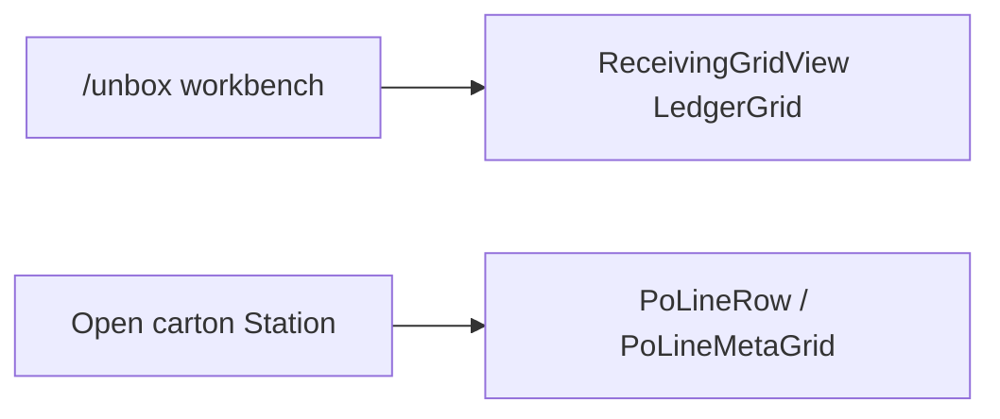

# Unbox / Receiving workbench grid — context map

**Status:** Phase A + Phase B (header + qty atom) shipped (2026-07-30). Orders header deferred.
**Lane:** Unbox / Receiving LedgerGrid (+ Incoming as second header/qty consumer).
**Skill:** `.claude/skills/receiving-grid-cell/SKILL.md`
**Display law:** `.claude/rules/display/workbench.md` → *Receiving spreadsheet agent waist*
**Header SoT:** `@/design-system/components/grid` `LedgerGridColumnHeader`

**Paste for a new session:**

> Read `docs/todo/unbox-receiving-grid-CONTEXT-MAP.md`. Edit workbench spreadsheet cells via
> `receiving-grid/cells/*` + `RECEIVING_GRID_COLUMNS` only. Header chrome → grow
> `LedgerGridColumnHeader` (Receiving/Incoming adapters stay thin). Do not open PoLine / Orders
> unless the task names them.

---

## Two surfaces (do not conflate)

| Surface | Job | Open these |
|---|---|---|
| **Workbench spreadsheet** | Pick carton/line (Queue · Viewed · History); also dashboard Receiving | `receiving-grid-layout.ts` + `receiving-grid/cells/*` |
| **Station PO accordion** | Expand/edit lines in an open carton | `PoLineMetaGrid` + `META_COL` / `PoLineRow` — **not** this map |

Same LedgerGrid family powers `/unbox` and dashboard Receiving via `ReceivingLinesTable` → `ReceivingGridView`.

---

## Phase A done — edit this column → open this file

| Column key | UI (typical) | File |
|---|---|---|
| `select` | Checkbox gutter | `src/components/station/receiving-grid/cells/ReceivingSelectCell.tsx` |
| `title` | PRODUCT + status dot | `…/cells/ReceivingTitleCell.tsx` |
| `date` | BY / civil day | `…/cells/ReceivingDateCell.tsx` |
| `qty` | QTY `received/expected` | `…/cells/ReceivingQtyCell.tsx` → `GridQtyFractionValue` |
| `condition` | Cond / STATUS-style grade | `…/cells/ReceivingConditionCell.tsx` |
| `stage` | Stage clock (age/time) | `…/cells/ReceivingStageCell.tsx` |
| `location` | Loc / triage shelf | `…/cells/ReceivingLocationCell.tsx` |
| `platform` | Channel mark | `…/cells/ReceivingPlatformCell.tsx` |
| `order` | ORDER / PO last-4 | `…/cells/ReceivingOrderCell.tsx` |
| `tracking` | TRACKING / pickup pill | `…/cells/ReceivingTrackingCell.tsx` |
| `serial` | Serial chip | `…/cells/ReceivingSerialCell.tsx` |

**Always allowed:**

- Column model SoT — `src/lib/receiving/receiving-grid-layout.ts`
- Dispatcher — `src/components/station/receiving-grid/cells/index.tsx`
- Row shell (wiring only) — `ReceivingGridRow.tsx`
- Align — `resolveGridColumnAlign` / `gridCellAlignClass`
- Value atoms — `src/components/ui/grid-cells.tsx` (`GridQtyFractionValue`, date, dash, platform…)
- Sticky header SoT — `LedgerGridColumnHeader` (+ thin `ReceivingGridColumnHeader` adapter)

**Forbidden unless the task names them:**

- `PoLineRow`, `PoLineMetaGrid`, `LineEditPanel`, `useUnboxLineController`, `useReceivingLineCore`
- `OrdersQueueTableRow`, `OrdersGridView`, `orders-queue/*`
- KPI / filter chrome; `ReceivingLinesTable` except host/wiring bugs

---

## Phase A + B checklist

- [x] Skill `receiving-grid-cell` + workbench display waist section
- [x] `ReceivingGridRow` thin shell; cells under `receiving-grid/cells/`
- [x] This context map
- [x] Shared `LedgerGridColumnHeader` — Receiving + Incoming adapters
- [x] `GridQtyFractionValue` in `grid-cells` — Receiving + Incoming qty
- [x] SoT row + `ledger-grid-column-header.guard.test.ts`
- [x] LedgerGrid selection chrome — `QUEUE_ROW.selectedLedgerClass` / `ledgerRowStateClass` fill-only (no inset ring L-glow under airtable)
- [x] `npm run verify` green

---

## Still deferred

1. **Orders** `OrdersQueueColumnHeader` — resize/reorder recipe; do not force through `LedgerGridColumnHeader` v1
2. Catalog / Pickup / Repair headers — same adapter pattern when next touched
3. Delete local `PoLineRow` twin in `PoLinesSection.tsx` — only when accordion work is in scope

---

## Out of scope

- Redesigning Unbox KPI / filter chrome
- Porting PO accordion onto LedgerGrid
- Splitting `OrdersQueueTableRow` (separate initiative)
